# semt.020.002.07

```mermaid
classDiagram
    class Hiperspace.Edge {
        # From  : Hiperspace.Node
        # To  : Hiperspace.Node
        # TypeName  : String
        + Name  : String
    }
    class ISO20022.Semt020002.BlockChainAddressWallet7 {
        + Nm  : String
        + Tp  : ISO20022.Semt020002.GenericIdentification47
        + Id  : String
    }
    ISO20022.Semt020002.BlockChainAddressWallet7 *-- ISO20022.Semt020002.GenericIdentification47
    class ISO20022.Semt020002.DeliveryReceiptType2Code {
        APMT = 1
        FREE = 2
    }
    class ISO20022.Semt020002.GenericIdentification47 {
        + SchmeNm  : String
        + Issr  : String
        + Id  : String
    }
    class ISO20022.Semt020002.GenericIdentification84 {
        + SchmeNm  : String
        + Issr  : String
        + Id  : String
    }
    class ISO20022.Semt020002.PartyIdentification136Choice {
        + PrtryId  : ISO20022.Semt020002.GenericIdentification84
        + AnyBIC  : String
    }
    ISO20022.Semt020002.PartyIdentification136Choice *-- ISO20022.Semt020002.GenericIdentification84
    class ISO20022.Semt020002.PartyIdentification156 {
        + LEI  : String
        + Id  : ISO20022.Semt020002.PartyIdentification136Choice
    }
    ISO20022.Semt020002.PartyIdentification156 *-- ISO20022.Semt020002.PartyIdentification136Choice
    class ISO20022.Semt020002.ReceiveDelivery1Code {
        RECE = 1
        DELI = 2
    }
    class ISO20022.Semt020002.References79Choice {
        + TrptyCollAndXpsrRptId  : String
        + TrptyCollStsAdvcId  : String
        + TrptyCollTxInstrPrcgStsAdvcId  : String
        + TtlPrtflValtnRptId  : String
        + OthrMsgId  : String
        + SctiesSttlmTxGnrtnNtfctnId  : ISO20022.Semt020002.SettlementTypeAndIdentification22
        + PrtflTrfNtfctnId  : String
        + SctiesSttlmTxAllgmtNtfctnTxId  : ISO20022.Semt020002.SettlementTypeAndIdentification22
        + SctiesSttlmTxAllgmtRptId  : String
        + SctiesTxPstngRptId  : String
        + SctiesTxPdgRptId  : String
        + SctiesFincgConfId  : ISO20022.Semt020002.SettlementTypeAndIdentification22
        + IntraPosMvmntPstngRptId  : String
        + SctiesBalCtdyRptId  : String
        + SctiesBalAcctgRptId  : String
        + IntraPosMvmntConfId  : String
        + SctiesSttlmTxConfId  : ISO20022.Semt020002.SettlementTypeAndIdentification22
    }
    ISO20022.Semt020002.References79Choice *-- ISO20022.Semt020002.SettlementTypeAndIdentification22
    ISO20022.Semt020002.References79Choice *-- ISO20022.Semt020002.SettlementTypeAndIdentification22
    ISO20022.Semt020002.References79Choice *-- ISO20022.Semt020002.SettlementTypeAndIdentification22
    ISO20022.Semt020002.References79Choice *-- ISO20022.Semt020002.SettlementTypeAndIdentification22
    class ISO20022.Semt020002.SecuritiesAccount30 {
        + Nm  : String
        + Tp  : ISO20022.Semt020002.GenericIdentification47
        + Id  : String
    }
    ISO20022.Semt020002.SecuritiesAccount30 *-- ISO20022.Semt020002.GenericIdentification47
    class ISO20022.Semt020002.SecuritiesMessageCancellationAdvice002V07 {
        + SplmtryData  : global::System.Collections.Generic.List~ISO20022.Semt020002.SupplementaryData1~
        + BlckChainAdrOrWllt  : ISO20022.Semt020002.BlockChainAddressWallet7
        + SfkpgAcct  : ISO20022.Semt020002.SecuritiesAccount30
        + AcctOwnr  : ISO20022.Semt020002.PartyIdentification156
        + Ref  : ISO20022.Semt020002.References79Choice
    }
    ISO20022.Semt020002.SecuritiesMessageCancellationAdvice002V07 *-- ISO20022.Semt020002.SupplementaryData1
    ISO20022.Semt020002.SecuritiesMessageCancellationAdvice002V07 *-- ISO20022.Semt020002.BlockChainAddressWallet7
    ISO20022.Semt020002.SecuritiesMessageCancellationAdvice002V07 *-- ISO20022.Semt020002.SecuritiesAccount30
    ISO20022.Semt020002.SecuritiesMessageCancellationAdvice002V07 *-- ISO20022.Semt020002.PartyIdentification156
    ISO20022.Semt020002.SecuritiesMessageCancellationAdvice002V07 *-- ISO20022.Semt020002.References79Choice
    class ISO20022.Semt020002.SettlementTypeAndIdentification22 {
        + Pmt  : String
        + SctiesMvmntTp  : String
        + TxId  : String
    }
    class ISO20022.Semt020002.SupplementaryData1 {
        + Envlp  : ISO20022.Semt020002.SupplementaryDataEnvelope1
        + PlcAndNm  : String
    }
    ISO20022.Semt020002.SupplementaryData1 *-- ISO20022.Semt020002.SupplementaryDataEnvelope1
    class ISO20022.Semt020002.SupplementaryDataEnvelope1 {
    }
    class Hiperspace.Node {
        # SKey  : String
        + TypeName  : String
        + Name  : String
        + Froms (From = this) : Hiperspace.Edge
        + Tos (To = this) : Hiperspace.Edge
    }
```

> The tables below contain descriptions of the members of each Element. 
> The first column indicates the type of the member:
> A ‘#’ indicates that the field is a key to the element, and a ‘+’ indicates that the field is a value.
> The ‘*’ column contains a description for the element member.  
> The ‘@’ column contains any properties for the member.
> The ‘=’ column contains calculated values; or in the case of an enum, the serialized value.

---

## View Hiperspace.Edge
edge between nodes

| |Name|Type|*|@|=|
|-|-|-|-|-|-|
|#|From|Hiperspace.Node||||
|#|To|Hiperspace.Node||||
|#|TypeName|String||||
|+|Name|String||||

---

## Value ISO20022.Semt020002.BlockChainAddressWallet7

| |Name|Type|*|@|=|
|-|-|-|-|-|-|
|+|Nm|String||XmlElement()||
|+|Tp|ISO20022.Semt020002.GenericIdentification47||XmlElement()||
|+|Id|String||XmlElement()||
||Validation|Some(String)||XmlIgnore(), JsonIgnore()|validation(validPattern("""Nm""",Nm,"""[0-9a-zA-Z/\-\?:\(\)\.\n\r,'\+ ]{1,70}"""),validElement(Tp),validPattern("""Id""",Id,"""[0-9a-zA-Z/\-\?:\(\)\.\n\r,'\+ ]{1,140}"""))|

---

## Enum ISO20022.Semt020002.DeliveryReceiptType2Code

| |Name|Type|*|@|=|
|-|-|-|-|-|-|
||APMT|Int32||XmlEnum("""APMT""")|1|
||FREE|Int32||XmlEnum("""FREE""")|2|

---

## Type ISO20022.Semt020002.Document

| |Name|Type|*|@|=|
|-|-|-|-|-|-|
|+|SctiesMsgCxlAdvc|ISO20022.Semt020002.SecuritiesMessageCancellationAdvice002V07||XmlElement()||
||Validation|Some(String)||XmlIgnore(), JsonIgnore()|validation(validElement(SctiesMsgCxlAdvc))|

---

## Value ISO20022.Semt020002.GenericIdentification47

| |Name|Type|*|@|=|
|-|-|-|-|-|-|
|+|SchmeNm|String||XmlElement()||
|+|Issr|String||XmlElement()||
|+|Id|String||XmlElement()||
||Validation|Some(String)||XmlIgnore(), JsonIgnore()|validation(validPattern("""SchmeNm""",SchmeNm,"""[a-zA-Z0-9]{1,4}"""),validPattern("""Issr""",Issr,"""[a-zA-Z0-9]{1,4}"""),validPattern("""Id""",Id,"""[a-zA-Z0-9]{4}"""))|

---

## Value ISO20022.Semt020002.GenericIdentification84

| |Name|Type|*|@|=|
|-|-|-|-|-|-|
|+|SchmeNm|String||XmlElement()||
|+|Issr|String||XmlElement()||
|+|Id|String||XmlElement()||
||Validation|Some(String)||XmlIgnore(), JsonIgnore()|validation(validPattern("""SchmeNm""",SchmeNm,"""[a-zA-Z0-9]{1,4}"""),validPattern("""Issr""",Issr,"""[a-zA-Z0-9]{1,4}"""),validPattern("""Id""",Id,"""([0-9a-zA-Z\-\?:\(\)\.,'\+ ]([0-9a-zA-Z\-\?:\(\)\.,'\+ ]*(/[0-9a-zA-Z\-\?:\(\)\.,'\+ ])?)*)"""))|

---

## Value ISO20022.Semt020002.PartyIdentification136Choice

| |Name|Type|*|@|=|
|-|-|-|-|-|-|
|+|PrtryId|ISO20022.Semt020002.GenericIdentification84||XmlElement()||
|+|AnyBIC|String||XmlElement()||
||Validation|Some(String)||XmlIgnore(), JsonIgnore()|validation(validElement(PrtryId),validPattern("""AnyBIC""",AnyBIC,"""[A-Z0-9]{4,4}[A-Z]{2,2}[A-Z0-9]{2,2}([A-Z0-9]{3,3}){0,1}"""),validChoice(PrtryId,AnyBIC))|

---

## Value ISO20022.Semt020002.PartyIdentification156

| |Name|Type|*|@|=|
|-|-|-|-|-|-|
|+|LEI|String||XmlElement()||
|+|Id|ISO20022.Semt020002.PartyIdentification136Choice||XmlElement()||
||Validation|Some(String)||XmlIgnore(), JsonIgnore()|validation(validPattern("""LEI""",LEI,"""[A-Z0-9]{18,18}[0-9]{2,2}"""),validElement(Id))|

---

## Enum ISO20022.Semt020002.ReceiveDelivery1Code

| |Name|Type|*|@|=|
|-|-|-|-|-|-|
||RECE|Int32||XmlEnum("""RECE""")|1|
||DELI|Int32||XmlEnum("""DELI""")|2|

---

## Value ISO20022.Semt020002.References79Choice

| |Name|Type|*|@|=|
|-|-|-|-|-|-|
|+|TrptyCollAndXpsrRptId|String||XmlElement()||
|+|TrptyCollStsAdvcId|String||XmlElement()||
|+|TrptyCollTxInstrPrcgStsAdvcId|String||XmlElement()||
|+|TtlPrtflValtnRptId|String||XmlElement()||
|+|OthrMsgId|String||XmlElement()||
|+|SctiesSttlmTxGnrtnNtfctnId|ISO20022.Semt020002.SettlementTypeAndIdentification22||XmlElement()||
|+|PrtflTrfNtfctnId|String||XmlElement()||
|+|SctiesSttlmTxAllgmtNtfctnTxId|ISO20022.Semt020002.SettlementTypeAndIdentification22||XmlElement()||
|+|SctiesSttlmTxAllgmtRptId|String||XmlElement()||
|+|SctiesTxPstngRptId|String||XmlElement()||
|+|SctiesTxPdgRptId|String||XmlElement()||
|+|SctiesFincgConfId|ISO20022.Semt020002.SettlementTypeAndIdentification22||XmlElement()||
|+|IntraPosMvmntPstngRptId|String||XmlElement()||
|+|SctiesBalCtdyRptId|String||XmlElement()||
|+|SctiesBalAcctgRptId|String||XmlElement()||
|+|IntraPosMvmntConfId|String||XmlElement()||
|+|SctiesSttlmTxConfId|ISO20022.Semt020002.SettlementTypeAndIdentification22||XmlElement()||
||Validation|Some(String)||XmlIgnore(), JsonIgnore()|validation(validPattern("""TrptyCollAndXpsrRptId""",TrptyCollAndXpsrRptId,"""([0-9a-zA-Z\-\?:\(\)\.,'\+ ]([0-9a-zA-Z\-\?:\(\)\.,'\+ ]*(/[0-9a-zA-Z\-\?:\(\)\.,'\+ ])?)*)"""),validPattern("""TrptyCollStsAdvcId""",TrptyCollStsAdvcId,"""([0-9a-zA-Z\-\?:\(\)\.,'\+ ]([0-9a-zA-Z\-\?:\(\)\.,'\+ ]*(/[0-9a-zA-Z\-\?:\(\)\.,'\+ ])?)*)"""),validPattern("""TrptyCollTxInstrPrcgStsAdvcId""",TrptyCollTxInstrPrcgStsAdvcId,"""([0-9a-zA-Z\-\?:\(\)\.,'\+ ]([0-9a-zA-Z\-\?:\(\)\.,'\+ ]*(/[0-9a-zA-Z\-\?:\(\)\.,'\+ ])?)*)"""),validPattern("""TtlPrtflValtnRptId""",TtlPrtflValtnRptId,"""([0-9a-zA-Z\-\?:\(\)\.,'\+ ]([0-9a-zA-Z\-\?:\(\)\.,'\+ ]*(/[0-9a-zA-Z\-\?:\(\)\.,'\+ ])?)*)"""),validPattern("""OthrMsgId""",OthrMsgId,"""([0-9a-zA-Z\-\?:\(\)\.,'\+ ]([0-9a-zA-Z\-\?:\(\)\.,'\+ ]*(/[0-9a-zA-Z\-\?:\(\)\.,'\+ ])?)*)"""),validElement(SctiesSttlmTxGnrtnNtfctnId),validPattern("""PrtflTrfNtfctnId""",PrtflTrfNtfctnId,"""([0-9a-zA-Z\-\?:\(\)\.,'\+ ]([0-9a-zA-Z\-\?:\(\)\.,'\+ ]*(/[0-9a-zA-Z\-\?:\(\)\.,'\+ ])?)*)"""),validElement(SctiesSttlmTxAllgmtNtfctnTxId),validPattern("""SctiesSttlmTxAllgmtRptId""",SctiesSttlmTxAllgmtRptId,"""([0-9a-zA-Z\-\?:\(\)\.,'\+ ]([0-9a-zA-Z\-\?:\(\)\.,'\+ ]*(/[0-9a-zA-Z\-\?:\(\)\.,'\+ ])?)*)"""),validPattern("""SctiesTxPstngRptId""",SctiesTxPstngRptId,"""([0-9a-zA-Z\-\?:\(\)\.,'\+ ]([0-9a-zA-Z\-\?:\(\)\.,'\+ ]*(/[0-9a-zA-Z\-\?:\(\)\.,'\+ ])?)*)"""),validPattern("""SctiesTxPdgRptId""",SctiesTxPdgRptId,"""([0-9a-zA-Z\-\?:\(\)\.,'\+ ]([0-9a-zA-Z\-\?:\(\)\.,'\+ ]*(/[0-9a-zA-Z\-\?:\(\)\.,'\+ ])?)*)"""),validElement(SctiesFincgConfId),validPattern("""IntraPosMvmntPstngRptId""",IntraPosMvmntPstngRptId,"""([0-9a-zA-Z\-\?:\(\)\.,'\+ ]([0-9a-zA-Z\-\?:\(\)\.,'\+ ]*(/[0-9a-zA-Z\-\?:\(\)\.,'\+ ])?)*)"""),validPattern("""SctiesBalCtdyRptId""",SctiesBalCtdyRptId,"""([0-9a-zA-Z\-\?:\(\)\.,'\+ ]([0-9a-zA-Z\-\?:\(\)\.,'\+ ]*(/[0-9a-zA-Z\-\?:\(\)\.,'\+ ])?)*)"""),validPattern("""SctiesBalAcctgRptId""",SctiesBalAcctgRptId,"""([0-9a-zA-Z\-\?:\(\)\.,'\+ ]([0-9a-zA-Z\-\?:\(\)\.,'\+ ]*(/[0-9a-zA-Z\-\?:\(\)\.,'\+ ])?)*)"""),validPattern("""IntraPosMvmntConfId""",IntraPosMvmntConfId,"""([0-9a-zA-Z\-\?:\(\)\.,'\+ ]([0-9a-zA-Z\-\?:\(\)\.,'\+ ]*(/[0-9a-zA-Z\-\?:\(\)\.,'\+ ])?)*)"""),validElement(SctiesSttlmTxConfId),validChoice(TrptyCollAndXpsrRptId,TrptyCollStsAdvcId,TrptyCollTxInstrPrcgStsAdvcId,TtlPrtflValtnRptId,OthrMsgId,SctiesSttlmTxGnrtnNtfctnId,PrtflTrfNtfctnId,SctiesSttlmTxAllgmtNtfctnTxId,SctiesSttlmTxAllgmtRptId,SctiesTxPstngRptId,SctiesTxPdgRptId,SctiesFincgConfId,IntraPosMvmntPstngRptId,SctiesBalCtdyRptId,SctiesBalAcctgRptId,IntraPosMvmntConfId,SctiesSttlmTxConfId))|

---

## Value ISO20022.Semt020002.SecuritiesAccount30

| |Name|Type|*|@|=|
|-|-|-|-|-|-|
|+|Nm|String||XmlElement()||
|+|Tp|ISO20022.Semt020002.GenericIdentification47||XmlElement()||
|+|Id|String||XmlElement()||
||Validation|Some(String)||XmlIgnore(), JsonIgnore()|validation(validElement(Tp),validPattern("""Id""",Id,"""[0-9a-zA-Z/\-\?:\(\)\.,'\+ ]{1,35}"""))|

---

## Aspect ISO20022.Semt020002.SecuritiesMessageCancellationAdvice002V07

| |Name|Type|*|@|=|
|-|-|-|-|-|-|
|+|SplmtryData|global::System.Collections.Generic.List<ISO20022.Semt020002.SupplementaryData1>||XmlElement()||
|+|BlckChainAdrOrWllt|ISO20022.Semt020002.BlockChainAddressWallet7||XmlElement()||
|+|SfkpgAcct|ISO20022.Semt020002.SecuritiesAccount30||XmlElement()||
|+|AcctOwnr|ISO20022.Semt020002.PartyIdentification156||XmlElement()||
|+|Ref|ISO20022.Semt020002.References79Choice||XmlElement()||
||Validation|Some(String)||XmlIgnore(), JsonIgnore()|validation(validList("""SplmtryData""",SplmtryData),validElement(SplmtryData),validElement(BlckChainAdrOrWllt),validElement(SfkpgAcct),validElement(AcctOwnr),validElement(Ref))|

---

## Value ISO20022.Semt020002.SettlementTypeAndIdentification22

| |Name|Type|*|@|=|
|-|-|-|-|-|-|
|+|Pmt|String||XmlElement()||
|+|SctiesMvmntTp|String||XmlElement()||
|+|TxId|String||XmlElement()||
||Validation|Some(String)||XmlIgnore(), JsonIgnore()|validation(validPattern("""TxId""",TxId,"""([0-9a-zA-Z\-\?:\(\)\.,'\+ ]([0-9a-zA-Z\-\?:\(\)\.,'\+ ]*(/[0-9a-zA-Z\-\?:\(\)\.,'\+ ])?)*)"""))|

---

## Value ISO20022.Semt020002.SupplementaryData1

| |Name|Type|*|@|=|
|-|-|-|-|-|-|
|+|Envlp|ISO20022.Semt020002.SupplementaryDataEnvelope1||XmlElement()||
|+|PlcAndNm|String||XmlElement()||
||Validation|Some(String)||XmlIgnore(), JsonIgnore()|validation(validElement(Envlp))|

---

## Value ISO20022.Semt020002.SupplementaryDataEnvelope1

| |Name|Type|*|@|=|
|-|-|-|-|-|-|
||Validation|Some(String)||XmlIgnore(), JsonIgnore()|""|

---

## View Hiperspace.Node
node in a graph view of data

| |Name|Type|*|@|=|
|-|-|-|-|-|-|
|#|SKey|String||||
|+|TypeName|String||||
|+|Name|String||||
||Froms|Hiperspace.Edge|||From = this|
||Tos|Hiperspace.Edge|||To = this|

