# semt.021.001.08-physical

```mermaid
classDiagram
    class ISO20022.Semt021001.Document {
        # Uri  : String
        + SctiesStmtQry () : ISO20022.Semt021001.SecuritiesStatementQueryV08
        + Validation () = validation(validElement(SctiesStmtQry))
    }
    class ISO20022.Semt021001.SecuritiesStatementQueryV08 {
        # owner  : ISO20022.Semt021001.Document
        + SplmtryData  : List~ISO20022.Semt021001.SupplementaryData1~
        + AddtlQryParams  : List~ISO20022.Semt021001.AdditionalQueryParameters13~
        + BlckChainAdrOrWllt  : ISO20022.Semt021001.BlockChainAddressWallet3
        + SfkpgAcct  : ISO20022.Semt021001.SecuritiesAccount19
        + AcctOwnr  : ISO20022.Semt021001.PartyIdentification144
        + StmtGnlDtls  : ISO20022.Semt021001.Statement83
        + StmtReqd  : ISO20022.Semt021001.DocumentNumber13
        + Validation () = validation(validList("""SplmtryData""",SplmtryData),validElement(SplmtryData),validList("""AddtlQryParams""",AddtlQryParams),validElement(AddtlQryParams),validElement(BlckChainAdrOrWllt),validElement(SfkpgAcct),validElement(AcctOwnr),validElement(StmtGnlDtls),validElement(StmtReqd))
    }
```

> The tables below contain descriptions of the members of each Element. 
> The first column indicates the type of the member:
> A ‘#’ indicates that the field is a key to the element, and a ‘+’ indicates that the field is a value.
> The ‘*’ column contains a description for the element member.  
> The ‘@’ column contains any properties for the member.
> The ‘=’ column contains calculated values; or in the case of an enum, the serialized value.

---

## EntityImpl ISO20022.Semt021001.Document

| |Name|Type|*|@|=|
|-|-|-|-|-|-|
|#|Uri|String||XmlIgnore(), JsonIgnore()||
|+|SctiesStmtQry|ISO20022.Semt021001.SecuritiesStatementQueryV08||XmlElement()||
||Validation|Some(String)||XmlIgnore(), JsonIgnore()|validation(validElement(SctiesStmtQry))|

---

## AspectImpl ISO20022.Semt021001.SecuritiesStatementQueryV08

| |Name|Type|*|@|=|
|-|-|-|-|-|-|
|#|owner|ISO20022.Semt021001.Document||||
|+|SplmtryData|List<ISO20022.Semt021001.SupplementaryData1>||XmlElement()||
|+|AddtlQryParams|List<ISO20022.Semt021001.AdditionalQueryParameters13>||XmlElement()||
|+|BlckChainAdrOrWllt|ISO20022.Semt021001.BlockChainAddressWallet3||XmlElement()||
|+|SfkpgAcct|ISO20022.Semt021001.SecuritiesAccount19||XmlElement()||
|+|AcctOwnr|ISO20022.Semt021001.PartyIdentification144||XmlElement()||
|+|StmtGnlDtls|ISO20022.Semt021001.Statement83||XmlElement()||
|+|StmtReqd|ISO20022.Semt021001.DocumentNumber13||XmlElement()||
||Validation|Some(String)||XmlIgnore(), JsonIgnore()|validation(validList("""SplmtryData""",SplmtryData),validElement(SplmtryData),validList("""AddtlQryParams""",AddtlQryParams),validElement(AddtlQryParams),validElement(BlckChainAdrOrWllt),validElement(SfkpgAcct),validElement(AcctOwnr),validElement(StmtGnlDtls),validElement(StmtReqd))|

