# semt.023.001.02-physical

```mermaid
classDiagram
    class ISO20022.Semt023001.Document {
        # Uri  : String
        + SctiesEndOfPrcRpt () : ISO20022.Semt023001.SecuritiesEndOfProcessReportV02
        + Validation () = validation(validElement(SctiesEndOfPrcRpt))
    }
    class ISO20022.Semt023001.SecuritiesEndOfProcessReportV02 {
        # owner  : ISO20022.Semt023001.Document
        + SplmtryData  : List~ISO20022.Semt023001.SupplementaryData1~
        + Invstr  : List~ISO20022.Semt023001.PartyIdentificationAndAccount220~
        + ConfPties  : List~ISO20022.Semt023001.ConfirmationParties7~
        + RptGnlDtls  : ISO20022.Semt023001.Report6
        + Pgntn  : List~ISO20022.Semt023001.Pagination1~
        + Validation () = validation(validList("""SplmtryData""",SplmtryData),validElement(SplmtryData),validList("""Invstr""",Invstr),validElement(Invstr),validList("""ConfPties""",ConfPties),validElement(ConfPties),validElement(RptGnlDtls),validList("""Pgntn""",Pgntn),validElement(Pgntn))
    }
```

> The tables below contain descriptions of the members of each Element. 
> The first column indicates the type of the member:
> A ‘#’ indicates that the field is a key to the element, and a ‘+’ indicates that the field is a value.
> The ‘*’ column contains a description for the element member.  
> The ‘@’ column contains any properties for the member.
> The ‘=’ column contains calculated values; or in the case of an enum, the serialized value.

---

## EntityImpl ISO20022.Semt023001.Document

| |Name|Type|*|@|=|
|-|-|-|-|-|-|
|#|Uri|String||XmlIgnore(), JsonIgnore()||
|+|SctiesEndOfPrcRpt|ISO20022.Semt023001.SecuritiesEndOfProcessReportV02||XmlElement()||
||Validation|Some(String)||XmlIgnore(), JsonIgnore()|validation(validElement(SctiesEndOfPrcRpt))|

---

## AspectImpl ISO20022.Semt023001.SecuritiesEndOfProcessReportV02

| |Name|Type|*|@|=|
|-|-|-|-|-|-|
|#|owner|ISO20022.Semt023001.Document||||
|+|SplmtryData|List<ISO20022.Semt023001.SupplementaryData1>||XmlElement()||
|+|Invstr|List<ISO20022.Semt023001.PartyIdentificationAndAccount220>||XmlElement()||
|+|ConfPties|List<ISO20022.Semt023001.ConfirmationParties7>||XmlElement()||
|+|RptGnlDtls|ISO20022.Semt023001.Report6||XmlElement()||
|+|Pgntn|List<ISO20022.Semt023001.Pagination1>||XmlElement()||
||Validation|Some(String)||XmlIgnore(), JsonIgnore()|validation(validList("""SplmtryData""",SplmtryData),validElement(SplmtryData),validList("""Invstr""",Invstr),validElement(Invstr),validList("""ConfPties""",ConfPties),validElement(ConfPties),validElement(RptGnlDtls),validList("""Pgntn""",Pgntn),validElement(Pgntn))|

