# semt.023.001.02

```mermaid
classDiagram
    class Hiperspace.Edge {
        # From  : Hiperspace.Node
        # To  : Hiperspace.Node
        # TypeName  : String
        + Name  : String
    }
    class ISO20022.Semt023001.AccountIdentification55Choice {
        + PrtryAcct  : ISO20022.Semt023001.SimpleIdentificationInformation2
        + UPIC  : String
        + BBAN  : String
        + IBAN  : String
    }
    ISO20022.Semt023001.AccountIdentification55Choice *-- ISO20022.Semt023001.SimpleIdentificationInformation2
    class ISO20022.Semt023001.AddressType2Code {
        DLVY = 1
        MLTO = 2
        BIZZ = 3
        HOME = 4
        PBOX = 5
        ADDR = 6
    }
    class ISO20022.Semt023001.AlternatePartyIdentification8 {
        + AltrnId  : String
        + Ctry  : String
        + IdTp  : ISO20022.Semt023001.IdentificationType43Choice
    }
    ISO20022.Semt023001.AlternatePartyIdentification8 *-- ISO20022.Semt023001.IdentificationType43Choice
    class ISO20022.Semt023001.CashAccountIdentification5Choice {
        + Prtry  : String
        + IBAN  : String
    }
    class ISO20022.Semt023001.ConfirmationParties7 {
        + TradBnfcryPty  : ISO20022.Semt023001.ConfirmationPartyDetails14
        + AffrmgPty  : ISO20022.Semt023001.ConfirmationPartyDetails11
        + CMUCtrPty  : ISO20022.Semt023001.ConfirmationPartyDetails11
        + CMUPty  : ISO20022.Semt023001.ConfirmationPartyDetails11
        + ExctgBrkr  : ISO20022.Semt023001.ConfirmationPartyDetails13
        + ClrFirm  : ISO20022.Semt023001.ConfirmationPartyDetails13
        + StepOutFirm  : ISO20022.Semt023001.ConfirmationPartyDetails11
        + StepInFirm  : ISO20022.Semt023001.ConfirmationPartyDetails11
        + IntrdcgFirm  : ISO20022.Semt023001.ConfirmationPartyDetails11
        + BrkrOfCdt  : ISO20022.Semt023001.ConfirmationPartyDetails11
        + Lndr  : ISO20022.Semt023001.ConfirmationPartyDetails12
        + Sellr  : ISO20022.Semt023001.ConfirmationPartyDetails12
        + Brrwr  : ISO20022.Semt023001.ConfirmationPartyDetails12
        + Buyr  : ISO20022.Semt023001.ConfirmationPartyDetails12
    }
    ISO20022.Semt023001.ConfirmationParties7 *-- ISO20022.Semt023001.ConfirmationPartyDetails14
    ISO20022.Semt023001.ConfirmationParties7 *-- ISO20022.Semt023001.ConfirmationPartyDetails11
    ISO20022.Semt023001.ConfirmationParties7 *-- ISO20022.Semt023001.ConfirmationPartyDetails11
    ISO20022.Semt023001.ConfirmationParties7 *-- ISO20022.Semt023001.ConfirmationPartyDetails11
    ISO20022.Semt023001.ConfirmationParties7 *-- ISO20022.Semt023001.ConfirmationPartyDetails13
    ISO20022.Semt023001.ConfirmationParties7 *-- ISO20022.Semt023001.ConfirmationPartyDetails13
    ISO20022.Semt023001.ConfirmationParties7 *-- ISO20022.Semt023001.ConfirmationPartyDetails11
    ISO20022.Semt023001.ConfirmationParties7 *-- ISO20022.Semt023001.ConfirmationPartyDetails11
    ISO20022.Semt023001.ConfirmationParties7 *-- ISO20022.Semt023001.ConfirmationPartyDetails11
    ISO20022.Semt023001.ConfirmationParties7 *-- ISO20022.Semt023001.ConfirmationPartyDetails11
    ISO20022.Semt023001.ConfirmationParties7 *-- ISO20022.Semt023001.ConfirmationPartyDetails12
    ISO20022.Semt023001.ConfirmationParties7 *-- ISO20022.Semt023001.ConfirmationPartyDetails12
    ISO20022.Semt023001.ConfirmationParties7 *-- ISO20022.Semt023001.ConfirmationPartyDetails12
    ISO20022.Semt023001.ConfirmationParties7 *-- ISO20022.Semt023001.ConfirmationPartyDetails12
    class ISO20022.Semt023001.ConfirmationPartyDetails11 {
        + AddtlInf  : ISO20022.Semt023001.PartyTextInformation5
        + PrcgId  : String
        + AltrnId  : ISO20022.Semt023001.AlternatePartyIdentification8
        + Id  : ISO20022.Semt023001.PartyIdentification240Choice
    }
    ISO20022.Semt023001.ConfirmationPartyDetails11 *-- ISO20022.Semt023001.PartyTextInformation5
    ISO20022.Semt023001.ConfirmationPartyDetails11 *-- ISO20022.Semt023001.AlternatePartyIdentification8
    ISO20022.Semt023001.ConfirmationPartyDetails11 *-- ISO20022.Semt023001.PartyIdentification240Choice
    class ISO20022.Semt023001.ConfirmationPartyDetails12 {
        + TradgPtyCpcty  : ISO20022.Semt023001.TradingPartyCapacity4Choice
        + InvstrCpcty  : ISO20022.Semt023001.InvestorCapacity4Choice
        + AddtlInf  : ISO20022.Semt023001.PartyTextInformation5
        + PrcgId  : String
        + AltrnId  : ISO20022.Semt023001.AlternatePartyIdentification8
        + Id  : ISO20022.Semt023001.PartyIdentification240Choice
    }
    ISO20022.Semt023001.ConfirmationPartyDetails12 *-- ISO20022.Semt023001.TradingPartyCapacity4Choice
    ISO20022.Semt023001.ConfirmationPartyDetails12 *-- ISO20022.Semt023001.InvestorCapacity4Choice
    ISO20022.Semt023001.ConfirmationPartyDetails12 *-- ISO20022.Semt023001.PartyTextInformation5
    ISO20022.Semt023001.ConfirmationPartyDetails12 *-- ISO20022.Semt023001.AlternatePartyIdentification8
    ISO20022.Semt023001.ConfirmationPartyDetails12 *-- ISO20022.Semt023001.PartyIdentification240Choice
    class ISO20022.Semt023001.ConfirmationPartyDetails13 {
        + InvstrPrtcnAssoctnMmbsh  : String
        + AddtlInf  : ISO20022.Semt023001.PartyTextInformation5
        + PrcgId  : String
        + AltrnId  : ISO20022.Semt023001.AlternatePartyIdentification8
        + Id  : ISO20022.Semt023001.PartyIdentification240Choice
    }
    ISO20022.Semt023001.ConfirmationPartyDetails13 *-- ISO20022.Semt023001.PartyTextInformation5
    ISO20022.Semt023001.ConfirmationPartyDetails13 *-- ISO20022.Semt023001.AlternatePartyIdentification8
    ISO20022.Semt023001.ConfirmationPartyDetails13 *-- ISO20022.Semt023001.PartyIdentification240Choice
    class ISO20022.Semt023001.ConfirmationPartyDetails14 {
        + PtyCpcty  : ISO20022.Semt023001.TradingPartyCapacity3Choice
        + AddtlInf  : ISO20022.Semt023001.PartyTextInformation5
        + PrcgId  : String
        + AltrnId  : ISO20022.Semt023001.AlternatePartyIdentification8
        + CshDtls  : ISO20022.Semt023001.AccountIdentification55Choice
        + SfkpgAcct  : ISO20022.Semt023001.SecuritiesAccount35
        + Id  : ISO20022.Semt023001.PartyIdentification240Choice
    }
    ISO20022.Semt023001.ConfirmationPartyDetails14 *-- ISO20022.Semt023001.TradingPartyCapacity3Choice
    ISO20022.Semt023001.ConfirmationPartyDetails14 *-- ISO20022.Semt023001.PartyTextInformation5
    ISO20022.Semt023001.ConfirmationPartyDetails14 *-- ISO20022.Semt023001.AlternatePartyIdentification8
    ISO20022.Semt023001.ConfirmationPartyDetails14 *-- ISO20022.Semt023001.AccountIdentification55Choice
    ISO20022.Semt023001.ConfirmationPartyDetails14 *-- ISO20022.Semt023001.SecuritiesAccount35
    ISO20022.Semt023001.ConfirmationPartyDetails14 *-- ISO20022.Semt023001.PartyIdentification240Choice
    class ISO20022.Semt023001.DateAndDateTime1Choice {
        + DtTm  : DateTime
        + Dt  : DateTime
    }
    class ISO20022.Semt023001.Eligibility1Code {
        PROF = 1
        RETL = 2
        ELIG = 3
    }
    class ISO20022.Semt023001.EventFrequency4Code {
        WEEK = 1
        INDA = 2
        DAIL = 3
        MNTH = 4
        ADHO = 5
        YEAR = 6
    }
    class ISO20022.Semt023001.Frequency25Choice {
        + Prtry  : ISO20022.Semt023001.GenericIdentification30
        + Cd  : String
    }
    ISO20022.Semt023001.Frequency25Choice *-- ISO20022.Semt023001.GenericIdentification30
    class ISO20022.Semt023001.GenericIdentification30 {
        + SchmeNm  : String
        + Issr  : String
        + Id  : String
    }
    class ISO20022.Semt023001.GenericIdentification36 {
        + SchmeNm  : String
        + Issr  : String
        + Id  : String
    }
    class ISO20022.Semt023001.GenericIdentification7 {
        + Inf  : String
        + Issr  : String
    }
    class ISO20022.Semt023001.IdentificationType43Choice {
        + Prtry  : ISO20022.Semt023001.GenericIdentification36
        + Cd  : String
    }
    ISO20022.Semt023001.IdentificationType43Choice *-- ISO20022.Semt023001.GenericIdentification36
    class ISO20022.Semt023001.InvestorCapacity4Choice {
        + Prtry  : ISO20022.Semt023001.GenericIdentification30
        + Cd  : String
    }
    ISO20022.Semt023001.InvestorCapacity4Choice *-- ISO20022.Semt023001.GenericIdentification30
    class ISO20022.Semt023001.NameAndAddress13 {
        + Adr  : ISO20022.Semt023001.PostalAddress8
        + Nm  : String
    }
    ISO20022.Semt023001.NameAndAddress13 *-- ISO20022.Semt023001.PostalAddress8
    class ISO20022.Semt023001.Pagination1 {
        + LastPgInd  : String
        + PgNb  : String
    }
    class ISO20022.Semt023001.PartyIdentification240Choice {
        + NmAndAdr  : ISO20022.Semt023001.NameAndAddress13
        + PrtryId  : ISO20022.Semt023001.GenericIdentification36
        + BIC  : String
    }
    ISO20022.Semt023001.PartyIdentification240Choice *-- ISO20022.Semt023001.NameAndAddress13
    ISO20022.Semt023001.PartyIdentification240Choice *-- ISO20022.Semt023001.GenericIdentification36
    class ISO20022.Semt023001.PartyIdentificationAndAccount220 {
        + AltrnId  : ISO20022.Semt023001.AlternatePartyIdentification8
        + AddtlInf  : ISO20022.Semt023001.PartyTextInformation1
        + CtryOfRes  : String
        + PrcgId  : String
        + CshAcct  : ISO20022.Semt023001.CashAccountIdentification5Choice
        + SfkpgAcct  : String
        + Id  : ISO20022.Semt023001.PartyIdentification240Choice
    }
    ISO20022.Semt023001.PartyIdentificationAndAccount220 *-- ISO20022.Semt023001.AlternatePartyIdentification8
    ISO20022.Semt023001.PartyIdentificationAndAccount220 *-- ISO20022.Semt023001.PartyTextInformation1
    ISO20022.Semt023001.PartyIdentificationAndAccount220 *-- ISO20022.Semt023001.CashAccountIdentification5Choice
    ISO20022.Semt023001.PartyIdentificationAndAccount220 *-- ISO20022.Semt023001.PartyIdentification240Choice
    class ISO20022.Semt023001.PartyTextInformation1 {
        + RegnDtls  : String
        + PtyCtctDtls  : String
        + DclrtnDtls  : String
    }
    class ISO20022.Semt023001.PartyTextInformation5 {
        + PtyCtctDtls  : String
        + DclrtnDtls  : String
    }
    class ISO20022.Semt023001.PostalAddress8 {
        + Ctry  : String
        + CtrySubDvsn  : String
        + TwnNm  : String
        + PstCd  : String
        + BldgNb  : String
        + StrtNm  : String
        + AdrLine  : global::System.Collections.Generic.List~String~
        + AdrTp  : String
    }
    class ISO20022.Semt023001.PurposeCode9Choice {
        + Prtry  : ISO20022.Semt023001.GenericIdentification30
        + Cd  : String
    }
    ISO20022.Semt023001.PurposeCode9Choice *-- ISO20022.Semt023001.GenericIdentification30
    class ISO20022.Semt023001.QueryReference2 {
        + QryNm  : String
        + QryRef  : String
    }
    class ISO20022.Semt023001.Report6 {
        + NtceTp  : ISO20022.Semt023001.GenericIdentification30
        + UpdTp  : ISO20022.Semt023001.StatementUpdateTypeCodeAndDSSCode1Choice
        + Frqcy  : ISO20022.Semt023001.Frequency25Choice
        + RptDtTm  : ISO20022.Semt023001.DateAndDateTime1Choice
        + RptId  : String
        + QryRef  : ISO20022.Semt023001.QueryReference2
        + RptNb  : String
    }
    ISO20022.Semt023001.Report6 *-- ISO20022.Semt023001.GenericIdentification30
    ISO20022.Semt023001.Report6 *-- ISO20022.Semt023001.StatementUpdateTypeCodeAndDSSCode1Choice
    ISO20022.Semt023001.Report6 *-- ISO20022.Semt023001.Frequency25Choice
    ISO20022.Semt023001.Report6 *-- ISO20022.Semt023001.DateAndDateTime1Choice
    ISO20022.Semt023001.Report6 *-- ISO20022.Semt023001.QueryReference2
    class ISO20022.Semt023001.SecuritiesAccount35 {
        + Nm  : String
        + Tp  : ISO20022.Semt023001.PurposeCode9Choice
        + Id  : String
    }
    ISO20022.Semt023001.SecuritiesAccount35 *-- ISO20022.Semt023001.PurposeCode9Choice
    class ISO20022.Semt023001.SecuritiesAccountPurposeType1Code {
        PHYS = 1
        DVPA = 2
        CEND = 3
        ABRD = 4
        SHOR = 5
        MARG = 6
    }
    class ISO20022.Semt023001.SecuritiesEndOfProcessReportV02 {
        + SplmtryData  : global::System.Collections.Generic.List~ISO20022.Semt023001.SupplementaryData1~
        + Invstr  : global::System.Collections.Generic.List~ISO20022.Semt023001.PartyIdentificationAndAccount220~
        + ConfPties  : global::System.Collections.Generic.List~ISO20022.Semt023001.ConfirmationParties7~
        + RptGnlDtls  : ISO20022.Semt023001.Report6
        + Pgntn  : global::System.Collections.Generic.List~ISO20022.Semt023001.Pagination1~
    }
    ISO20022.Semt023001.SecuritiesEndOfProcessReportV02 *-- ISO20022.Semt023001.SupplementaryData1
    ISO20022.Semt023001.SecuritiesEndOfProcessReportV02 *-- ISO20022.Semt023001.PartyIdentificationAndAccount220
    ISO20022.Semt023001.SecuritiesEndOfProcessReportV02 *-- ISO20022.Semt023001.ConfirmationParties7
    ISO20022.Semt023001.SecuritiesEndOfProcessReportV02 *-- ISO20022.Semt023001.Report6
    ISO20022.Semt023001.SecuritiesEndOfProcessReportV02 *-- ISO20022.Semt023001.Pagination1
    class ISO20022.Semt023001.SimpleIdentificationInformation2 {
        + Id  : String
    }
    class ISO20022.Semt023001.StatementUpdateType1Code {
        DELT = 1
        COMP = 2
    }
    class ISO20022.Semt023001.StatementUpdateTypeCodeAndDSSCode1Choice {
        + StmtUpdTpAsDSS  : ISO20022.Semt023001.GenericIdentification7
        + StmtUpdTpAsCd  : String
    }
    ISO20022.Semt023001.StatementUpdateTypeCodeAndDSSCode1Choice *-- ISO20022.Semt023001.GenericIdentification7
    class ISO20022.Semt023001.SupplementaryData1 {
        + Envlp  : ISO20022.Semt023001.SupplementaryDataEnvelope1
        + PlcAndNm  : String
    }
    ISO20022.Semt023001.SupplementaryData1 *-- ISO20022.Semt023001.SupplementaryDataEnvelope1
    class ISO20022.Semt023001.SupplementaryDataEnvelope1 {
    }
    class ISO20022.Semt023001.TradingCapacity4Code {
        TAGT = 1
        SINT = 2
        RMKT = 3
        MLTF = 4
        MKTM = 5
        INFI = 6
        BAGN = 7
        PRAG = 8
        OAGN = 9
        CAGN = 10
        AGEN = 11
        PROP = 12
        RISP = 13
        CPRN = 14
        PRIN = 15
    }
    class ISO20022.Semt023001.TradingCapacity6Code {
        PRIN = 1
        PRAG = 2
        OAGN = 3
        CPRN = 4
        CAGN = 5
        BAGN = 6
        AGEN = 7
    }
    class ISO20022.Semt023001.TradingPartyCapacity3Choice {
        + Prtry  : ISO20022.Semt023001.GenericIdentification36
        + Cd  : String
    }
    ISO20022.Semt023001.TradingPartyCapacity3Choice *-- ISO20022.Semt023001.GenericIdentification36
    class ISO20022.Semt023001.TradingPartyCapacity4Choice {
        + Prtry  : ISO20022.Semt023001.GenericIdentification30
        + Cd  : String
    }
    ISO20022.Semt023001.TradingPartyCapacity4Choice *-- ISO20022.Semt023001.GenericIdentification30
    class ISO20022.Semt023001.TypeOfIdentification2Code {
        TXID = 1
        FIIN = 2
        CORP = 3
        CHTY = 4
        ARNU = 5
    }
    class Hiperspace.Node {
        # SKey  : String
        + TypeName  : String
        + Name  : String
        + Froms (From = this) : Hiperspace.Edge
        + Tos (To = this) : Hiperspace.Edge
    }
```

> The tables below contain descriptions of the members of each Element. 
> The first column indicates the type of the member:
> A ‘#’ indicates that the field is a key to the element, and a ‘+’ indicates that the field is a value.
> The ‘*’ column contains a description for the element member.  
> The ‘@’ column contains any properties for the member.
> The ‘=’ column contains calculated values; or in the case of an enum, the serialized value.

---

## View Hiperspace.Edge
edge between nodes

| |Name|Type|*|@|=|
|-|-|-|-|-|-|
|#|From|Hiperspace.Node||||
|#|To|Hiperspace.Node||||
|#|TypeName|String||||
|+|Name|String||||

---

## Value ISO20022.Semt023001.AccountIdentification55Choice

| |Name|Type|*|@|=|
|-|-|-|-|-|-|
|+|PrtryAcct|ISO20022.Semt023001.SimpleIdentificationInformation2||XmlElement()||
|+|UPIC|String||XmlElement()||
|+|BBAN|String||XmlElement()||
|+|IBAN|String||XmlElement()||
||Validation|Some(String)||XmlIgnore(), JsonIgnore()|validation(validElement(PrtryAcct),validPattern("""UPIC""",UPIC,"""[0-9]{8,17}"""),validPattern("""BBAN""",BBAN,"""[a-zA-Z0-9]{1,30}"""),validPattern("""IBAN""",IBAN,"""[A-Z]{2,2}[0-9]{2,2}[a-zA-Z0-9]{1,30}"""),validChoice(PrtryAcct,UPIC,BBAN,IBAN))|

---

## Enum ISO20022.Semt023001.AddressType2Code

| |Name|Type|*|@|=|
|-|-|-|-|-|-|
||DLVY|Int32||XmlEnum("""DLVY""")|1|
||MLTO|Int32||XmlEnum("""MLTO""")|2|
||BIZZ|Int32||XmlEnum("""BIZZ""")|3|
||HOME|Int32||XmlEnum("""HOME""")|4|
||PBOX|Int32||XmlEnum("""PBOX""")|5|
||ADDR|Int32||XmlEnum("""ADDR""")|6|

---

## Value ISO20022.Semt023001.AlternatePartyIdentification8

| |Name|Type|*|@|=|
|-|-|-|-|-|-|
|+|AltrnId|String||XmlElement()||
|+|Ctry|String||XmlElement()||
|+|IdTp|ISO20022.Semt023001.IdentificationType43Choice||XmlElement()||
||Validation|Some(String)||XmlIgnore(), JsonIgnore()|validation(validPattern("""Ctry""",Ctry,"""[A-Z]{2,2}"""),validElement(IdTp))|

---

## Value ISO20022.Semt023001.CashAccountIdentification5Choice

| |Name|Type|*|@|=|
|-|-|-|-|-|-|
|+|Prtry|String||XmlElement()||
|+|IBAN|String||XmlElement()||
||Validation|Some(String)||XmlIgnore(), JsonIgnore()|validation(validPattern("""IBAN""",IBAN,"""[A-Z]{2,2}[0-9]{2,2}[a-zA-Z0-9]{1,30}"""),validChoice(Prtry,IBAN))|

---

## Value ISO20022.Semt023001.ConfirmationParties7

| |Name|Type|*|@|=|
|-|-|-|-|-|-|
|+|TradBnfcryPty|ISO20022.Semt023001.ConfirmationPartyDetails14||XmlElement()||
|+|AffrmgPty|ISO20022.Semt023001.ConfirmationPartyDetails11||XmlElement()||
|+|CMUCtrPty|ISO20022.Semt023001.ConfirmationPartyDetails11||XmlElement()||
|+|CMUPty|ISO20022.Semt023001.ConfirmationPartyDetails11||XmlElement()||
|+|ExctgBrkr|ISO20022.Semt023001.ConfirmationPartyDetails13||XmlElement()||
|+|ClrFirm|ISO20022.Semt023001.ConfirmationPartyDetails13||XmlElement()||
|+|StepOutFirm|ISO20022.Semt023001.ConfirmationPartyDetails11||XmlElement()||
|+|StepInFirm|ISO20022.Semt023001.ConfirmationPartyDetails11||XmlElement()||
|+|IntrdcgFirm|ISO20022.Semt023001.ConfirmationPartyDetails11||XmlElement()||
|+|BrkrOfCdt|ISO20022.Semt023001.ConfirmationPartyDetails11||XmlElement()||
|+|Lndr|ISO20022.Semt023001.ConfirmationPartyDetails12||XmlElement()||
|+|Sellr|ISO20022.Semt023001.ConfirmationPartyDetails12||XmlElement()||
|+|Brrwr|ISO20022.Semt023001.ConfirmationPartyDetails12||XmlElement()||
|+|Buyr|ISO20022.Semt023001.ConfirmationPartyDetails12||XmlElement()||
||Validation|Some(String)||XmlIgnore(), JsonIgnore()|validation(validElement(TradBnfcryPty),validElement(AffrmgPty),validElement(CMUCtrPty),validElement(CMUPty),validElement(ExctgBrkr),validElement(ClrFirm),validElement(StepOutFirm),validElement(StepInFirm),validElement(IntrdcgFirm),validElement(BrkrOfCdt),validElement(Lndr),validElement(Sellr),validElement(Brrwr),validElement(Buyr))|

---

## Value ISO20022.Semt023001.ConfirmationPartyDetails11

| |Name|Type|*|@|=|
|-|-|-|-|-|-|
|+|AddtlInf|ISO20022.Semt023001.PartyTextInformation5||XmlElement()||
|+|PrcgId|String||XmlElement()||
|+|AltrnId|ISO20022.Semt023001.AlternatePartyIdentification8||XmlElement()||
|+|Id|ISO20022.Semt023001.PartyIdentification240Choice||XmlElement()||
||Validation|Some(String)||XmlIgnore(), JsonIgnore()|validation(validElement(AddtlInf),validElement(AltrnId),validElement(Id))|

---

## Value ISO20022.Semt023001.ConfirmationPartyDetails12

| |Name|Type|*|@|=|
|-|-|-|-|-|-|
|+|TradgPtyCpcty|ISO20022.Semt023001.TradingPartyCapacity4Choice||XmlElement()||
|+|InvstrCpcty|ISO20022.Semt023001.InvestorCapacity4Choice||XmlElement()||
|+|AddtlInf|ISO20022.Semt023001.PartyTextInformation5||XmlElement()||
|+|PrcgId|String||XmlElement()||
|+|AltrnId|ISO20022.Semt023001.AlternatePartyIdentification8||XmlElement()||
|+|Id|ISO20022.Semt023001.PartyIdentification240Choice||XmlElement()||
||Validation|Some(String)||XmlIgnore(), JsonIgnore()|validation(validElement(TradgPtyCpcty),validElement(InvstrCpcty),validElement(AddtlInf),validElement(AltrnId),validElement(Id))|

---

## Value ISO20022.Semt023001.ConfirmationPartyDetails13

| |Name|Type|*|@|=|
|-|-|-|-|-|-|
|+|InvstrPrtcnAssoctnMmbsh|String||XmlElement()||
|+|AddtlInf|ISO20022.Semt023001.PartyTextInformation5||XmlElement()||
|+|PrcgId|String||XmlElement()||
|+|AltrnId|ISO20022.Semt023001.AlternatePartyIdentification8||XmlElement()||
|+|Id|ISO20022.Semt023001.PartyIdentification240Choice||XmlElement()||
||Validation|Some(String)||XmlIgnore(), JsonIgnore()|validation(validElement(AddtlInf),validElement(AltrnId),validElement(Id))|

---

## Value ISO20022.Semt023001.ConfirmationPartyDetails14

| |Name|Type|*|@|=|
|-|-|-|-|-|-|
|+|PtyCpcty|ISO20022.Semt023001.TradingPartyCapacity3Choice||XmlElement()||
|+|AddtlInf|ISO20022.Semt023001.PartyTextInformation5||XmlElement()||
|+|PrcgId|String||XmlElement()||
|+|AltrnId|ISO20022.Semt023001.AlternatePartyIdentification8||XmlElement()||
|+|CshDtls|ISO20022.Semt023001.AccountIdentification55Choice||XmlElement()||
|+|SfkpgAcct|ISO20022.Semt023001.SecuritiesAccount35||XmlElement()||
|+|Id|ISO20022.Semt023001.PartyIdentification240Choice||XmlElement()||
||Validation|Some(String)||XmlIgnore(), JsonIgnore()|validation(validElement(PtyCpcty),validElement(AddtlInf),validElement(AltrnId),validElement(CshDtls),validElement(SfkpgAcct),validElement(Id))|

---

## Value ISO20022.Semt023001.DateAndDateTime1Choice

| |Name|Type|*|@|=|
|-|-|-|-|-|-|
|+|DtTm|DateTime||XmlElement()||
|+|Dt|DateTime||XmlElement()||
||Validation|Some(String)||XmlIgnore(), JsonIgnore()|validation(validChoice(DtTm,Dt))|

---

## Type ISO20022.Semt023001.Document

| |Name|Type|*|@|=|
|-|-|-|-|-|-|
|+|SctiesEndOfPrcRpt|ISO20022.Semt023001.SecuritiesEndOfProcessReportV02||XmlElement()||
||Validation|Some(String)||XmlIgnore(), JsonIgnore()|validation(validElement(SctiesEndOfPrcRpt))|

---

## Enum ISO20022.Semt023001.Eligibility1Code

| |Name|Type|*|@|=|
|-|-|-|-|-|-|
||PROF|Int32||XmlEnum("""PROF""")|1|
||RETL|Int32||XmlEnum("""RETL""")|2|
||ELIG|Int32||XmlEnum("""ELIG""")|3|

---

## Enum ISO20022.Semt023001.EventFrequency4Code

| |Name|Type|*|@|=|
|-|-|-|-|-|-|
||WEEK|Int32||XmlEnum("""WEEK""")|1|
||INDA|Int32||XmlEnum("""INDA""")|2|
||DAIL|Int32||XmlEnum("""DAIL""")|3|
||MNTH|Int32||XmlEnum("""MNTH""")|4|
||ADHO|Int32||XmlEnum("""ADHO""")|5|
||YEAR|Int32||XmlEnum("""YEAR""")|6|

---

## Value ISO20022.Semt023001.Frequency25Choice

| |Name|Type|*|@|=|
|-|-|-|-|-|-|
|+|Prtry|ISO20022.Semt023001.GenericIdentification30||XmlElement()||
|+|Cd|String||XmlElement()||
||Validation|Some(String)||XmlIgnore(), JsonIgnore()|validation(validElement(Prtry),validChoice(Prtry,Cd))|

---

## Value ISO20022.Semt023001.GenericIdentification30

| |Name|Type|*|@|=|
|-|-|-|-|-|-|
|+|SchmeNm|String||XmlElement()||
|+|Issr|String||XmlElement()||
|+|Id|String||XmlElement()||
||Validation|Some(String)||XmlIgnore(), JsonIgnore()|validation(validPattern("""Id""",Id,"""[a-zA-Z0-9]{4}"""))|

---

## Value ISO20022.Semt023001.GenericIdentification36

| |Name|Type|*|@|=|
|-|-|-|-|-|-|
|+|SchmeNm|String||XmlElement()||
|+|Issr|String||XmlElement()||
|+|Id|String||XmlElement()||
||Validation|Some(String)||XmlIgnore(), JsonIgnore()|""|

---

## Value ISO20022.Semt023001.GenericIdentification7

| |Name|Type|*|@|=|
|-|-|-|-|-|-|
|+|Inf|String||XmlElement()||
|+|Issr|String||XmlElement()||
||Validation|Some(String)||XmlIgnore(), JsonIgnore()|""|

---

## Value ISO20022.Semt023001.IdentificationType43Choice

| |Name|Type|*|@|=|
|-|-|-|-|-|-|
|+|Prtry|ISO20022.Semt023001.GenericIdentification36||XmlElement()||
|+|Cd|String||XmlElement()||
||Validation|Some(String)||XmlIgnore(), JsonIgnore()|validation(validElement(Prtry),validChoice(Prtry,Cd))|

---

## Value ISO20022.Semt023001.InvestorCapacity4Choice

| |Name|Type|*|@|=|
|-|-|-|-|-|-|
|+|Prtry|ISO20022.Semt023001.GenericIdentification30||XmlElement()||
|+|Cd|String||XmlElement()||
||Validation|Some(String)||XmlIgnore(), JsonIgnore()|validation(validElement(Prtry),validChoice(Prtry,Cd))|

---

## Value ISO20022.Semt023001.NameAndAddress13

| |Name|Type|*|@|=|
|-|-|-|-|-|-|
|+|Adr|ISO20022.Semt023001.PostalAddress8||XmlElement()||
|+|Nm|String||XmlElement()||
||Validation|Some(String)||XmlIgnore(), JsonIgnore()|validation(validElement(Adr))|

---

## Value ISO20022.Semt023001.Pagination1

| |Name|Type|*|@|=|
|-|-|-|-|-|-|
|+|LastPgInd|String||XmlElement()||
|+|PgNb|String||XmlElement()||
||Validation|Some(String)||XmlIgnore(), JsonIgnore()|validation(validPattern("""PgNb""",PgNb,"""[0-9]{1,5}"""))|

---

## Value ISO20022.Semt023001.PartyIdentification240Choice

| |Name|Type|*|@|=|
|-|-|-|-|-|-|
|+|NmAndAdr|ISO20022.Semt023001.NameAndAddress13||XmlElement()||
|+|PrtryId|ISO20022.Semt023001.GenericIdentification36||XmlElement()||
|+|BIC|String||XmlElement()||
||Validation|Some(String)||XmlIgnore(), JsonIgnore()|validation(validElement(NmAndAdr),validElement(PrtryId),validPattern("""BIC""",BIC,"""[A-Z0-9]{4,4}[A-Z]{2,2}[A-Z0-9]{2,2}([A-Z0-9]{3,3}){0,1}"""),validChoice(NmAndAdr,PrtryId,BIC))|

---

## Value ISO20022.Semt023001.PartyIdentificationAndAccount220

| |Name|Type|*|@|=|
|-|-|-|-|-|-|
|+|AltrnId|ISO20022.Semt023001.AlternatePartyIdentification8||XmlElement()||
|+|AddtlInf|ISO20022.Semt023001.PartyTextInformation1||XmlElement()||
|+|CtryOfRes|String||XmlElement()||
|+|PrcgId|String||XmlElement()||
|+|CshAcct|ISO20022.Semt023001.CashAccountIdentification5Choice||XmlElement()||
|+|SfkpgAcct|String||XmlElement()||
|+|Id|ISO20022.Semt023001.PartyIdentification240Choice||XmlElement()||
||Validation|Some(String)||XmlIgnore(), JsonIgnore()|validation(validElement(AltrnId),validElement(AddtlInf),validPattern("""CtryOfRes""",CtryOfRes,"""[A-Z]{2,2}"""),validElement(CshAcct),validElement(Id))|

---

## Value ISO20022.Semt023001.PartyTextInformation1

| |Name|Type|*|@|=|
|-|-|-|-|-|-|
|+|RegnDtls|String||XmlElement()||
|+|PtyCtctDtls|String||XmlElement()||
|+|DclrtnDtls|String||XmlElement()||
||Validation|Some(String)||XmlIgnore(), JsonIgnore()|""|

---

## Value ISO20022.Semt023001.PartyTextInformation5

| |Name|Type|*|@|=|
|-|-|-|-|-|-|
|+|PtyCtctDtls|String||XmlElement()||
|+|DclrtnDtls|String||XmlElement()||
||Validation|Some(String)||XmlIgnore(), JsonIgnore()|""|

---

## Value ISO20022.Semt023001.PostalAddress8

| |Name|Type|*|@|=|
|-|-|-|-|-|-|
|+|Ctry|String||XmlElement()||
|+|CtrySubDvsn|String||XmlElement()||
|+|TwnNm|String||XmlElement()||
|+|PstCd|String||XmlElement()||
|+|BldgNb|String||XmlElement()||
|+|StrtNm|String||XmlElement()||
|+|AdrLine|global::System.Collections.Generic.List<String>||XmlElement()||
|+|AdrTp|String||XmlElement()||
||Validation|Some(String)||XmlIgnore(), JsonIgnore()|validation(validPattern("""Ctry""",Ctry,"""[A-Z]{2,2}"""),validListMax("""AdrLine""",AdrLine,5))|

---

## Value ISO20022.Semt023001.PurposeCode9Choice

| |Name|Type|*|@|=|
|-|-|-|-|-|-|
|+|Prtry|ISO20022.Semt023001.GenericIdentification30||XmlElement()||
|+|Cd|String||XmlElement()||
||Validation|Some(String)||XmlIgnore(), JsonIgnore()|validation(validElement(Prtry),validChoice(Prtry,Cd))|

---

## Value ISO20022.Semt023001.QueryReference2

| |Name|Type|*|@|=|
|-|-|-|-|-|-|
|+|QryNm|String||XmlElement()||
|+|QryRef|String||XmlElement()||
||Validation|Some(String)||XmlIgnore(), JsonIgnore()|""|

---

## Value ISO20022.Semt023001.Report6

| |Name|Type|*|@|=|
|-|-|-|-|-|-|
|+|NtceTp|ISO20022.Semt023001.GenericIdentification30||XmlElement()||
|+|UpdTp|ISO20022.Semt023001.StatementUpdateTypeCodeAndDSSCode1Choice||XmlElement()||
|+|Frqcy|ISO20022.Semt023001.Frequency25Choice||XmlElement()||
|+|RptDtTm|ISO20022.Semt023001.DateAndDateTime1Choice||XmlElement()||
|+|RptId|String||XmlElement()||
|+|QryRef|ISO20022.Semt023001.QueryReference2||XmlElement()||
|+|RptNb|String||XmlElement()||
||Validation|Some(String)||XmlIgnore(), JsonIgnore()|validation(validElement(NtceTp),validElement(UpdTp),validElement(Frqcy),validElement(RptDtTm),validElement(QryRef),validPattern("""RptNb""",RptNb,"""[0-9]{1,5}"""))|

---

## Value ISO20022.Semt023001.SecuritiesAccount35

| |Name|Type|*|@|=|
|-|-|-|-|-|-|
|+|Nm|String||XmlElement()||
|+|Tp|ISO20022.Semt023001.PurposeCode9Choice||XmlElement()||
|+|Id|String||XmlElement()||
||Validation|Some(String)||XmlIgnore(), JsonIgnore()|validation(validElement(Tp))|

---

## Enum ISO20022.Semt023001.SecuritiesAccountPurposeType1Code

| |Name|Type|*|@|=|
|-|-|-|-|-|-|
||PHYS|Int32||XmlEnum("""PHYS""")|1|
||DVPA|Int32||XmlEnum("""DVPA""")|2|
||CEND|Int32||XmlEnum("""CEND""")|3|
||ABRD|Int32||XmlEnum("""ABRD""")|4|
||SHOR|Int32||XmlEnum("""SHOR""")|5|
||MARG|Int32||XmlEnum("""MARG""")|6|

---

## Aspect ISO20022.Semt023001.SecuritiesEndOfProcessReportV02

| |Name|Type|*|@|=|
|-|-|-|-|-|-|
|+|SplmtryData|global::System.Collections.Generic.List<ISO20022.Semt023001.SupplementaryData1>||XmlElement()||
|+|Invstr|global::System.Collections.Generic.List<ISO20022.Semt023001.PartyIdentificationAndAccount220>||XmlElement()||
|+|ConfPties|global::System.Collections.Generic.List<ISO20022.Semt023001.ConfirmationParties7>||XmlElement()||
|+|RptGnlDtls|ISO20022.Semt023001.Report6||XmlElement()||
|+|Pgntn|global::System.Collections.Generic.List<ISO20022.Semt023001.Pagination1>||XmlElement()||
||Validation|Some(String)||XmlIgnore(), JsonIgnore()|validation(validList("""SplmtryData""",SplmtryData),validElement(SplmtryData),validList("""Invstr""",Invstr),validElement(Invstr),validList("""ConfPties""",ConfPties),validElement(ConfPties),validElement(RptGnlDtls),validList("""Pgntn""",Pgntn),validElement(Pgntn))|

---

## Value ISO20022.Semt023001.SimpleIdentificationInformation2

| |Name|Type|*|@|=|
|-|-|-|-|-|-|
|+|Id|String||XmlElement()||
||Validation|Some(String)||XmlIgnore(), JsonIgnore()|""|

---

## Enum ISO20022.Semt023001.StatementUpdateType1Code

| |Name|Type|*|@|=|
|-|-|-|-|-|-|
||DELT|Int32||XmlEnum("""DELT""")|1|
||COMP|Int32||XmlEnum("""COMP""")|2|

---

## Value ISO20022.Semt023001.StatementUpdateTypeCodeAndDSSCode1Choice

| |Name|Type|*|@|=|
|-|-|-|-|-|-|
|+|StmtUpdTpAsDSS|ISO20022.Semt023001.GenericIdentification7||XmlElement()||
|+|StmtUpdTpAsCd|String||XmlElement()||
||Validation|Some(String)||XmlIgnore(), JsonIgnore()|validation(validElement(StmtUpdTpAsDSS),validChoice(StmtUpdTpAsDSS,StmtUpdTpAsCd))|

---

## Value ISO20022.Semt023001.SupplementaryData1

| |Name|Type|*|@|=|
|-|-|-|-|-|-|
|+|Envlp|ISO20022.Semt023001.SupplementaryDataEnvelope1||XmlElement()||
|+|PlcAndNm|String||XmlElement()||
||Validation|Some(String)||XmlIgnore(), JsonIgnore()|validation(validElement(Envlp))|

---

## Value ISO20022.Semt023001.SupplementaryDataEnvelope1

| |Name|Type|*|@|=|
|-|-|-|-|-|-|
||Validation|Some(String)||XmlIgnore(), JsonIgnore()|""|

---

## Enum ISO20022.Semt023001.TradingCapacity4Code

| |Name|Type|*|@|=|
|-|-|-|-|-|-|
||TAGT|Int32||XmlEnum("""TAGT""")|1|
||SINT|Int32||XmlEnum("""SINT""")|2|
||RMKT|Int32||XmlEnum("""RMKT""")|3|
||MLTF|Int32||XmlEnum("""MLTF""")|4|
||MKTM|Int32||XmlEnum("""MKTM""")|5|
||INFI|Int32||XmlEnum("""INFI""")|6|
||BAGN|Int32||XmlEnum("""BAGN""")|7|
||PRAG|Int32||XmlEnum("""PRAG""")|8|
||OAGN|Int32||XmlEnum("""OAGN""")|9|
||CAGN|Int32||XmlEnum("""CAGN""")|10|
||AGEN|Int32||XmlEnum("""AGEN""")|11|
||PROP|Int32||XmlEnum("""PROP""")|12|
||RISP|Int32||XmlEnum("""RISP""")|13|
||CPRN|Int32||XmlEnum("""CPRN""")|14|
||PRIN|Int32||XmlEnum("""PRIN""")|15|

---

## Enum ISO20022.Semt023001.TradingCapacity6Code

| |Name|Type|*|@|=|
|-|-|-|-|-|-|
||PRIN|Int32||XmlEnum("""PRIN""")|1|
||PRAG|Int32||XmlEnum("""PRAG""")|2|
||OAGN|Int32||XmlEnum("""OAGN""")|3|
||CPRN|Int32||XmlEnum("""CPRN""")|4|
||CAGN|Int32||XmlEnum("""CAGN""")|5|
||BAGN|Int32||XmlEnum("""BAGN""")|6|
||AGEN|Int32||XmlEnum("""AGEN""")|7|

---

## Value ISO20022.Semt023001.TradingPartyCapacity3Choice

| |Name|Type|*|@|=|
|-|-|-|-|-|-|
|+|Prtry|ISO20022.Semt023001.GenericIdentification36||XmlElement()||
|+|Cd|String||XmlElement()||
||Validation|Some(String)||XmlIgnore(), JsonIgnore()|validation(validElement(Prtry),validChoice(Prtry,Cd))|

---

## Value ISO20022.Semt023001.TradingPartyCapacity4Choice

| |Name|Type|*|@|=|
|-|-|-|-|-|-|
|+|Prtry|ISO20022.Semt023001.GenericIdentification30||XmlElement()||
|+|Cd|String||XmlElement()||
||Validation|Some(String)||XmlIgnore(), JsonIgnore()|validation(validElement(Prtry),validChoice(Prtry,Cd))|

---

## Enum ISO20022.Semt023001.TypeOfIdentification2Code

| |Name|Type|*|@|=|
|-|-|-|-|-|-|
||TXID|Int32||XmlEnum("""TXID""")|1|
||FIIN|Int32||XmlEnum("""FIIN""")|2|
||CORP|Int32||XmlEnum("""CORP""")|3|
||CHTY|Int32||XmlEnum("""CHTY""")|4|
||ARNU|Int32||XmlEnum("""ARNU""")|5|

---

## View Hiperspace.Node
node in a graph view of data

| |Name|Type|*|@|=|
|-|-|-|-|-|-|
|#|SKey|String||||
|+|TypeName|String||||
|+|Name|String||||
||Froms|Hiperspace.Edge|||From = this|
||Tos|Hiperspace.Edge|||To = this|

