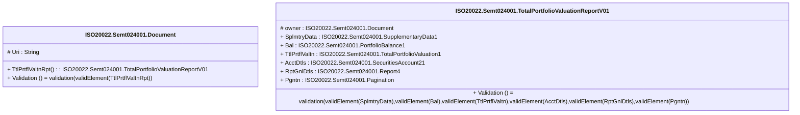

# semt.024.001.01-physical

> The tables below contain descriptions of the members of each Element. 
> The first column indicates the type of the member:
> A ‘#’ indicates that the field is a key to the element, and a ‘+’ indicates that the field is a value.
> The ‘*’ column contains a description for the element member.  
> The ‘@’ column contains any properties for the member.
> The ‘=’ column contains calculated values; or in the case of an enum, the serialized value.

---

## EntityImpl ISO20022.Semt024001.Document

| |Name|Type|*|@|=|
|-|-|-|-|-|-|
|#|Uri|String||XmlIgnore(), JsonIgnore()||
|+|TtlPrtflValtnRpt|ISO20022.Semt024001.TotalPortfolioValuationReportV01||XmlElement()||
||Validation|Some(String)||XmlIgnore(), JsonIgnore()|validation(validElement(TtlPrtflValtnRpt))|

---

## AspectImpl ISO20022.Semt024001.TotalPortfolioValuationReportV01

| |Name|Type|*|@|=|
|-|-|-|-|-|-|
|#|owner|ISO20022.Semt024001.Document||||
|+|SplmtryData|ISO20022.Semt024001.SupplementaryData1||XmlElement()||
|+|Bal|ISO20022.Semt024001.PortfolioBalance1||XmlElement()||
|+|TtlPrtflValtn|ISO20022.Semt024001.TotalPortfolioValuation1||XmlElement()||
|+|AcctDtls|ISO20022.Semt024001.SecuritiesAccount21||XmlElement()||
|+|RptGnlDtls|ISO20022.Semt024001.Report4||XmlElement()||
|+|Pgntn|ISO20022.Semt024001.Pagination||XmlElement()||
||Validation|Some(String)||XmlIgnore(), JsonIgnore()|validation(validElement(SplmtryData),validElement(Bal),validElement(TtlPrtflValtn),validElement(AcctDtls),validElement(RptGnlDtls),validElement(Pgntn))|

