# semt.024.001.01

```mermaid
classDiagram
    class Hiperspace.Edge {
        # From  : Hiperspace.Node
        # To  : Hiperspace.Node
        # TypeName  : String
        + Name  : String
    }
    class ISO20022.Semt024001.AccountIdentification5 {
        + Tp  : ISO20022.Semt024001.GenericIdentification30
        + Nm  : String
        + Id  : String
    }
    ISO20022.Semt024001.AccountIdentification5 *-- ISO20022.Semt024001.GenericIdentification30
    class ISO20022.Semt024001.ActiveOrHistoricCurrencyAnd13DecimalAmount {
        + Value  : Decimal
        + Ccy  : String
    }
    class ISO20022.Semt024001.ActiveOrHistoricCurrencyAndAmount {
        + Value  : Decimal
        + Ccy  : String
    }
    class ISO20022.Semt024001.AmountAndDirection30 {
        + Sgn  : String
        + Amt  : ISO20022.Semt024001.ActiveOrHistoricCurrencyAndAmount
    }
    ISO20022.Semt024001.AmountAndDirection30 *-- ISO20022.Semt024001.ActiveOrHistoricCurrencyAndAmount
    class ISO20022.Semt024001.AmountAndDirection31 {
        + ShrtLngInd  : String
        + Amt  : ISO20022.Semt024001.ActiveOrHistoricCurrencyAndAmount
    }
    ISO20022.Semt024001.AmountAndDirection31 *-- ISO20022.Semt024001.ActiveOrHistoricCurrencyAndAmount
    class ISO20022.Semt024001.AmountAndRate2 {
        + Rate  : Decimal
        + Amt  : ISO20022.Semt024001.AmountAndDirection30
    }
    ISO20022.Semt024001.AmountAndRate2 *-- ISO20022.Semt024001.AmountAndDirection30
    class ISO20022.Semt024001.BalanceDetails5 {
        + DtldBal  : global::System.Collections.Generic.List~ISO20022.Semt024001.BalanceDetails6~
        + Amt  : ISO20022.Semt024001.AmountAndDirection31
        + Urlsd  : String
        + Tp  : ISO20022.Semt024001.BalanceType6Choice
    }
    ISO20022.Semt024001.BalanceDetails5 *-- ISO20022.Semt024001.BalanceDetails6
    ISO20022.Semt024001.BalanceDetails5 *-- ISO20022.Semt024001.AmountAndDirection31
    ISO20022.Semt024001.BalanceDetails5 *-- ISO20022.Semt024001.BalanceType6Choice
    class ISO20022.Semt024001.BalanceDetails6 {
        + Amt  : ISO20022.Semt024001.AmountAndDirection31
        + Urlsd  : String
        + Tp  : ISO20022.Semt024001.BalanceType7Choice
        + Ctgy  : String
    }
    ISO20022.Semt024001.BalanceDetails6 *-- ISO20022.Semt024001.AmountAndDirection31
    ISO20022.Semt024001.BalanceDetails6 *-- ISO20022.Semt024001.BalanceType7Choice
    class ISO20022.Semt024001.BalanceType13Code {
        RECE = 1
        PAYA = 2
        OTHR = 3
        IIOF = 4
        EXPN = 5
        REVE = 6
        BORR = 7
        CASE = 8
        INVE = 9
    }
    class ISO20022.Semt024001.BalanceType6Choice {
        + Prtry  : ISO20022.Semt024001.GenericIdentification30
        + Cd  : String
    }
    ISO20022.Semt024001.BalanceType6Choice *-- ISO20022.Semt024001.GenericIdentification30
    class ISO20022.Semt024001.BalanceType7Choice {
        + Acct  : ISO20022.Semt024001.AccountIdentification5
        + Prtry  : ISO20022.Semt024001.GenericIdentification30
        + Cd  : String
    }
    ISO20022.Semt024001.BalanceType7Choice *-- ISO20022.Semt024001.AccountIdentification5
    ISO20022.Semt024001.BalanceType7Choice *-- ISO20022.Semt024001.GenericIdentification30
    class ISO20022.Semt024001.DateAndDateTimeChoice {
        + DtTm  : DateTime
        + Dt  : DateTime
    }
    class ISO20022.Semt024001.DatePeriodDetails {
        + ToDt  : DateTime
        + FrDt  : DateTime
    }
    class ISO20022.Semt024001.EventFrequency1Code {
        ONDE = 1
        OVNG = 2
        INDA = 3
        ADHO = 4
        DAIL = 5
        WEEK = 6
        TOWK = 7
        TWMN = 8
        MNTH = 9
        TOMN = 10
        QUTR = 11
        SEMI = 12
        YEAR = 13
    }
    class ISO20022.Semt024001.FinancialAssetBalanceType1Code {
        FXSP = 1
        FXFD = 2
        RXRP = 3
        TREP = 4
        XREP = 5
        REPO = 6
        FRAG = 7
        FWBO = 8
        ZOOO = 9
        VRDN = 10
        UNBO = 11
        UNBW = 12
        TIDE = 13
        TSTP = 14
        STIF = 15
        SLMA = 16
        MBON = 17
        MPRP = 18
        IETM = 19
        TAAB = 20
        GNMA = 21
        FLNO = 22
        FNMA = 23
        FEHL = 24
        FEHA = 25
        FEAD = 26
        DISC = 27
        CPPE = 28
        COPR = 29
        CMOO = 30
        CLOB = 31
        CDEO = 32
        CEOD = 33
        CBOO = 34
        SYBL = 35
        BAAP = 36
        PROP = 37
        GOLD = 38
        FOIV = 39
        CUEX = 40
        SWAP = 41
        FUTR = 42
        OPTN = 43
        GBND = 44
        CBND = 45
        CONV = 46
        BOND = 47
        WARR = 48
        RGHT = 49
        XFUN = 50
        MFUN = 51
        PREF = 52
        CSTK = 53
        EQUI = 54
        TIPS = 55
        CASH = 56
        FXTR = 57
        SCAS = 58
        OINT = 59
        ACRU = 60
    }
    class ISO20022.Semt024001.FinancialAssetTypeCategory1Code {
        OTHR = 1
        MMKT = 2
        DERV = 3
        ENTL = 4
        DEBT = 5
        EQTY = 6
    }
    class ISO20022.Semt024001.Frequency8Choice {
        + Prtry  : ISO20022.Semt024001.GenericIdentification30
        + Cd  : String
    }
    ISO20022.Semt024001.Frequency8Choice *-- ISO20022.Semt024001.GenericIdentification30
    class ISO20022.Semt024001.GenericIdentification29 {
        + SchmeNm  : String
        + Issr  : String
        + Id  : String
    }
    class ISO20022.Semt024001.GenericIdentification30 {
        + SchmeNm  : String
        + Issr  : String
        + Id  : String
    }
    class ISO20022.Semt024001.IdentificationSource3Choice {
        + Prtry  : String
        + Cd  : String
    }
    class ISO20022.Semt024001.InvestmentFund1 {
        + SplmtryData  : global::System.Collections.Generic.List~ISO20022.Semt024001.SupplementaryData1~
        + Pric  : global::System.Collections.Generic.List~ISO20022.Semt024001.PriceInformation10~
        + TtlVal  : ISO20022.Semt024001.AmountAndDirection30
        + TxnlUnits  : Decimal
        + TtlUnitsOutsdng  : Decimal
        + ClssTp  : String
        + FinInstrmId  : ISO20022.Semt024001.SecurityIdentification14
    }
    ISO20022.Semt024001.InvestmentFund1 *-- ISO20022.Semt024001.SupplementaryData1
    ISO20022.Semt024001.InvestmentFund1 *-- ISO20022.Semt024001.PriceInformation10
    ISO20022.Semt024001.InvestmentFund1 *-- ISO20022.Semt024001.AmountAndDirection30
    ISO20022.Semt024001.InvestmentFund1 *-- ISO20022.Semt024001.SecurityIdentification14
    class ISO20022.Semt024001.OtherIdentification1 {
        + Tp  : ISO20022.Semt024001.IdentificationSource3Choice
        + Sfx  : String
        + Id  : String
    }
    ISO20022.Semt024001.OtherIdentification1 *-- ISO20022.Semt024001.IdentificationSource3Choice
    class ISO20022.Semt024001.Pagination {
        + LastPgInd  : String
        + PgNb  : String
    }
    class ISO20022.Semt024001.PortfolioBalance1 {
        + DtldBal  : global::System.Collections.Generic.List~ISO20022.Semt024001.BalanceDetails6~
        + SummryBal  : global::System.Collections.Generic.List~ISO20022.Semt024001.BalanceDetails5~
    }
    ISO20022.Semt024001.PortfolioBalance1 *-- ISO20022.Semt024001.BalanceDetails6
    ISO20022.Semt024001.PortfolioBalance1 *-- ISO20022.Semt024001.BalanceDetails5
    class ISO20022.Semt024001.PriceAndDirection1 {
        + Sgn  : String
        + Val  : ISO20022.Semt024001.ActiveOrHistoricCurrencyAnd13DecimalAmount
    }
    ISO20022.Semt024001.PriceAndDirection1 *-- ISO20022.Semt024001.ActiveOrHistoricCurrencyAnd13DecimalAmount
    class ISO20022.Semt024001.PriceInformation10 {
        + AmtOfChng  : ISO20022.Semt024001.PriceValueAndRate4
        + PrvsPric  : ISO20022.Semt024001.ActiveOrHistoricCurrencyAnd13DecimalAmount
        + Tp  : ISO20022.Semt024001.TypeOfPrice27Choice
        + CurPric  : ISO20022.Semt024001.ActiveOrHistoricCurrencyAnd13DecimalAmount
    }
    ISO20022.Semt024001.PriceInformation10 *-- ISO20022.Semt024001.PriceValueAndRate4
    ISO20022.Semt024001.PriceInformation10 *-- ISO20022.Semt024001.ActiveOrHistoricCurrencyAnd13DecimalAmount
    ISO20022.Semt024001.PriceInformation10 *-- ISO20022.Semt024001.TypeOfPrice27Choice
    ISO20022.Semt024001.PriceInformation10 *-- ISO20022.Semt024001.ActiveOrHistoricCurrencyAnd13DecimalAmount
    class ISO20022.Semt024001.PriceValueAndRate4 {
        + Rate  : Decimal
        + Val  : ISO20022.Semt024001.PriceAndDirection1
    }
    ISO20022.Semt024001.PriceValueAndRate4 *-- ISO20022.Semt024001.PriceAndDirection1
    class ISO20022.Semt024001.Report4 {
        + ActvtyInd  : String
        + AudtdInd  : String
        + RptSrc  : ISO20022.Semt024001.StatementSource1Choice
        + RptPrd  : ISO20022.Semt024001.DatePeriodDetails
        + RptBsis  : ISO20022.Semt024001.StatementBasis6Choice
        + UpdTp  : ISO20022.Semt024001.UpdateType4Choice
        + Frqcy  : ISO20022.Semt024001.Frequency8Choice
        + PrvsRptDtTm  : ISO20022.Semt024001.DateAndDateTimeChoice
        + CreDtTm  : ISO20022.Semt024001.DateAndDateTimeChoice
        + RptDtTm  : ISO20022.Semt024001.DateAndDateTimeChoice
        + RptId  : String
        + QryRef  : String
        + RptNb  : String
    }
    ISO20022.Semt024001.Report4 *-- ISO20022.Semt024001.StatementSource1Choice
    ISO20022.Semt024001.Report4 *-- ISO20022.Semt024001.DatePeriodDetails
    ISO20022.Semt024001.Report4 *-- ISO20022.Semt024001.StatementBasis6Choice
    ISO20022.Semt024001.Report4 *-- ISO20022.Semt024001.UpdateType4Choice
    ISO20022.Semt024001.Report4 *-- ISO20022.Semt024001.Frequency8Choice
    ISO20022.Semt024001.Report4 *-- ISO20022.Semt024001.DateAndDateTimeChoice
    ISO20022.Semt024001.Report4 *-- ISO20022.Semt024001.DateAndDateTimeChoice
    ISO20022.Semt024001.Report4 *-- ISO20022.Semt024001.DateAndDateTimeChoice
    class ISO20022.Semt024001.SecuritiesAccount21 {
        + FXRate  : Decimal
        + RptgCcy  : String
        + BaseCcy  : String
        + SubAcct  : ISO20022.Semt024001.AccountIdentification5
        + Acct  : ISO20022.Semt024001.AccountIdentification5
    }
    ISO20022.Semt024001.SecuritiesAccount21 *-- ISO20022.Semt024001.AccountIdentification5
    ISO20022.Semt024001.SecuritiesAccount21 *-- ISO20022.Semt024001.AccountIdentification5
    class ISO20022.Semt024001.SecurityIdentification14 {
        + Desc  : String
        + OthrId  : global::System.Collections.Generic.List~ISO20022.Semt024001.OtherIdentification1~
        + ISIN  : String
    }
    ISO20022.Semt024001.SecurityIdentification14 *-- ISO20022.Semt024001.OtherIdentification1
    class ISO20022.Semt024001.ShortLong1Code {
        LONG = 1
        SHOR = 2
    }
    class ISO20022.Semt024001.StatementBasis1Code {
        TRAD = 1
        SETT = 2
        CONT = 3
    }
    class ISO20022.Semt024001.StatementBasis6Choice {
        + Prtry  : ISO20022.Semt024001.GenericIdentification30
        + Cd  : String
    }
    ISO20022.Semt024001.StatementBasis6Choice *-- ISO20022.Semt024001.GenericIdentification30
    class ISO20022.Semt024001.StatementSource1Choice {
        + Prtry  : ISO20022.Semt024001.GenericIdentification30
        + Cd  : String
    }
    ISO20022.Semt024001.StatementSource1Choice *-- ISO20022.Semt024001.GenericIdentification30
    class ISO20022.Semt024001.StatementSource1Code {
        CUST = 1
        ACCT = 2
    }
    class ISO20022.Semt024001.StatementUpdateType1Code {
        DELT = 1
        COMP = 2
    }
    class ISO20022.Semt024001.SupplementaryData1 {
        + Envlp  : ISO20022.Semt024001.SupplementaryDataEnvelope1
        + PlcAndNm  : String
    }
    ISO20022.Semt024001.SupplementaryData1 *-- ISO20022.Semt024001.SupplementaryDataEnvelope1
    class ISO20022.Semt024001.SupplementaryDataEnvelope1 {
    }
    class ISO20022.Semt024001.TotalPortfolioValuation1 {
        + InvstmtFndDtls  : global::System.Collections.Generic.List~ISO20022.Semt024001.InvestmentFund1~
        + AcrdIncm  : ISO20022.Semt024001.AmountAndDirection30
        + RealsdGnOrLoss  : ISO20022.Semt024001.AmountAndDirection31
        + UrlsdGnOrLoss  : ISO20022.Semt024001.AmountAndDirection31
        + ExpnssPd  : ISO20022.Semt024001.AmountAndDirection30
        + IncmRcvd  : ISO20022.Semt024001.AmountAndDirection30
        + TtlDsbrsmnts  : ISO20022.Semt024001.AmountAndDirection30
        + TtlRcts  : ISO20022.Semt024001.AmountAndDirection30
        + TtlBookValChng  : ISO20022.Semt024001.AmountAndRate2
        + PrvsTtlBookVal  : ISO20022.Semt024001.AmountAndDirection30
        + TtlBookVal  : ISO20022.Semt024001.AmountAndDirection30
        + TtlPrtflValChng  : ISO20022.Semt024001.AmountAndRate2
        + PrvsTtlPrtflVal  : ISO20022.Semt024001.AmountAndDirection30
        + TtlPrtflVal  : ISO20022.Semt024001.AmountAndDirection30
    }
    ISO20022.Semt024001.TotalPortfolioValuation1 *-- ISO20022.Semt024001.InvestmentFund1
    ISO20022.Semt024001.TotalPortfolioValuation1 *-- ISO20022.Semt024001.AmountAndDirection30
    ISO20022.Semt024001.TotalPortfolioValuation1 *-- ISO20022.Semt024001.AmountAndDirection31
    ISO20022.Semt024001.TotalPortfolioValuation1 *-- ISO20022.Semt024001.AmountAndDirection31
    ISO20022.Semt024001.TotalPortfolioValuation1 *-- ISO20022.Semt024001.AmountAndDirection30
    ISO20022.Semt024001.TotalPortfolioValuation1 *-- ISO20022.Semt024001.AmountAndDirection30
    ISO20022.Semt024001.TotalPortfolioValuation1 *-- ISO20022.Semt024001.AmountAndDirection30
    ISO20022.Semt024001.TotalPortfolioValuation1 *-- ISO20022.Semt024001.AmountAndDirection30
    ISO20022.Semt024001.TotalPortfolioValuation1 *-- ISO20022.Semt024001.AmountAndRate2
    ISO20022.Semt024001.TotalPortfolioValuation1 *-- ISO20022.Semt024001.AmountAndDirection30
    ISO20022.Semt024001.TotalPortfolioValuation1 *-- ISO20022.Semt024001.AmountAndDirection30
    ISO20022.Semt024001.TotalPortfolioValuation1 *-- ISO20022.Semt024001.AmountAndRate2
    ISO20022.Semt024001.TotalPortfolioValuation1 *-- ISO20022.Semt024001.AmountAndDirection30
    ISO20022.Semt024001.TotalPortfolioValuation1 *-- ISO20022.Semt024001.AmountAndDirection30
    class ISO20022.Semt024001.TotalPortfolioValuationReportV01 {
        + SplmtryData  : ISO20022.Semt024001.SupplementaryData1
        + Bal  : ISO20022.Semt024001.PortfolioBalance1
        + TtlPrtflValtn  : ISO20022.Semt024001.TotalPortfolioValuation1
        + AcctDtls  : ISO20022.Semt024001.SecuritiesAccount21
        + RptGnlDtls  : ISO20022.Semt024001.Report4
        + Pgntn  : ISO20022.Semt024001.Pagination
    }
    ISO20022.Semt024001.TotalPortfolioValuationReportV01 *-- ISO20022.Semt024001.SupplementaryData1
    ISO20022.Semt024001.TotalPortfolioValuationReportV01 *-- ISO20022.Semt024001.PortfolioBalance1
    ISO20022.Semt024001.TotalPortfolioValuationReportV01 *-- ISO20022.Semt024001.TotalPortfolioValuation1
    ISO20022.Semt024001.TotalPortfolioValuationReportV01 *-- ISO20022.Semt024001.SecuritiesAccount21
    ISO20022.Semt024001.TotalPortfolioValuationReportV01 *-- ISO20022.Semt024001.Report4
    ISO20022.Semt024001.TotalPortfolioValuationReportV01 *-- ISO20022.Semt024001.Pagination
    class ISO20022.Semt024001.TypeOfPrice27Choice {
        + Prtry  : ISO20022.Semt024001.GenericIdentification29
        + Cd  : String
    }
    ISO20022.Semt024001.TypeOfPrice27Choice *-- ISO20022.Semt024001.GenericIdentification29
    class ISO20022.Semt024001.TypeOfPrice30Code {
        SUBN = 1
        REDN = 2
        ENAV = 3
        GUAR = 4
        NAUP = 5
        ACTU = 6
        DDVR = 7
        SWIC = 8
        RINV = 9
        MIDD = 10
        SWNG = 11
        INTE = 12
        CANC = 13
        CREA = 14
        NAVL = 15
        OFFR = 16
        BIDE = 17
    }
    class ISO20022.Semt024001.Unrealised1Code {
        LOSS = 1
        GAIN = 2
    }
    class ISO20022.Semt024001.UpdateType4Choice {
        + Prtry  : ISO20022.Semt024001.GenericIdentification30
        + Cd  : String
    }
    ISO20022.Semt024001.UpdateType4Choice *-- ISO20022.Semt024001.GenericIdentification30
    class Hiperspace.Node {
        # SKey  : String
        + TypeName  : String
        + Name  : String
        + Froms (From = this) : Hiperspace.Edge
        + Tos (To = this) : Hiperspace.Edge
    }
```

> The tables below contain descriptions of the members of each Element. 
> The first column indicates the type of the member:
> A ‘#’ indicates that the field is a key to the element, and a ‘+’ indicates that the field is a value.
> The ‘*’ column contains a description for the element member.  
> The ‘@’ column contains any properties for the member.
> The ‘=’ column contains calculated values; or in the case of an enum, the serialized value.

---

## View Hiperspace.Edge
edge between nodes

| |Name|Type|*|@|=|
|-|-|-|-|-|-|
|#|From|Hiperspace.Node||||
|#|To|Hiperspace.Node||||
|#|TypeName|String||||
|+|Name|String||||

---

## Value ISO20022.Semt024001.AccountIdentification5

| |Name|Type|*|@|=|
|-|-|-|-|-|-|
|+|Tp|ISO20022.Semt024001.GenericIdentification30||XmlElement()||
|+|Nm|String||XmlElement()||
|+|Id|String||XmlElement()||
||Validation|Some(String)||XmlIgnore(), JsonIgnore()|validation(validElement(Tp))|

---

## Value ISO20022.Semt024001.ActiveOrHistoricCurrencyAnd13DecimalAmount

| |Name|Type|*|@|=|
|-|-|-|-|-|-|
|+|Value|Decimal||XmlElement()||
|+|Ccy|String||XmlAttribute()||
||Validation|Some(String)||XmlIgnore(), JsonIgnore()|validation(validRequired("""Value""",Value),validRequired("""Ccy""",Ccy),validPattern("""Ccy""",Ccy,"""[A-Z]{3,3}"""))|

---

## Value ISO20022.Semt024001.ActiveOrHistoricCurrencyAndAmount

| |Name|Type|*|@|=|
|-|-|-|-|-|-|
|+|Value|Decimal||XmlElement()||
|+|Ccy|String||XmlAttribute()||
||Validation|Some(String)||XmlIgnore(), JsonIgnore()|validation(validRequired("""Value""",Value),validRequired("""Ccy""",Ccy),validPattern("""Ccy""",Ccy,"""[A-Z]{3,3}"""))|

---

## Value ISO20022.Semt024001.AmountAndDirection30

| |Name|Type|*|@|=|
|-|-|-|-|-|-|
|+|Sgn|String||XmlElement()||
|+|Amt|ISO20022.Semt024001.ActiveOrHistoricCurrencyAndAmount||XmlElement()||
||Validation|Some(String)||XmlIgnore(), JsonIgnore()|validation(validElement(Amt))|

---

## Value ISO20022.Semt024001.AmountAndDirection31

| |Name|Type|*|@|=|
|-|-|-|-|-|-|
|+|ShrtLngInd|String||XmlElement()||
|+|Amt|ISO20022.Semt024001.ActiveOrHistoricCurrencyAndAmount||XmlElement()||
||Validation|Some(String)||XmlIgnore(), JsonIgnore()|validation(validElement(Amt))|

---

## Value ISO20022.Semt024001.AmountAndRate2

| |Name|Type|*|@|=|
|-|-|-|-|-|-|
|+|Rate|Decimal||XmlElement()||
|+|Amt|ISO20022.Semt024001.AmountAndDirection30||XmlElement()||
||Validation|Some(String)||XmlIgnore(), JsonIgnore()|validation(validElement(Amt))|

---

## Value ISO20022.Semt024001.BalanceDetails5

| |Name|Type|*|@|=|
|-|-|-|-|-|-|
|+|DtldBal|global::System.Collections.Generic.List<ISO20022.Semt024001.BalanceDetails6>||XmlElement()||
|+|Amt|ISO20022.Semt024001.AmountAndDirection31||XmlElement()||
|+|Urlsd|String||XmlElement()||
|+|Tp|ISO20022.Semt024001.BalanceType6Choice||XmlElement()||
||Validation|Some(String)||XmlIgnore(), JsonIgnore()|validation(validList("""DtldBal""",DtldBal),validElement(DtldBal),validElement(Amt),validElement(Tp))|

---

## Value ISO20022.Semt024001.BalanceDetails6

| |Name|Type|*|@|=|
|-|-|-|-|-|-|
|+|Amt|ISO20022.Semt024001.AmountAndDirection31||XmlElement()||
|+|Urlsd|String||XmlElement()||
|+|Tp|ISO20022.Semt024001.BalanceType7Choice||XmlElement()||
|+|Ctgy|String||XmlElement()||
||Validation|Some(String)||XmlIgnore(), JsonIgnore()|validation(validElement(Amt),validElement(Tp))|

---

## Enum ISO20022.Semt024001.BalanceType13Code

| |Name|Type|*|@|=|
|-|-|-|-|-|-|
||RECE|Int32||XmlEnum("""RECE""")|1|
||PAYA|Int32||XmlEnum("""PAYA""")|2|
||OTHR|Int32||XmlEnum("""OTHR""")|3|
||IIOF|Int32||XmlEnum("""IIOF""")|4|
||EXPN|Int32||XmlEnum("""EXPN""")|5|
||REVE|Int32||XmlEnum("""REVE""")|6|
||BORR|Int32||XmlEnum("""BORR""")|7|
||CASE|Int32||XmlEnum("""CASE""")|8|
||INVE|Int32||XmlEnum("""INVE""")|9|

---

## Value ISO20022.Semt024001.BalanceType6Choice

| |Name|Type|*|@|=|
|-|-|-|-|-|-|
|+|Prtry|ISO20022.Semt024001.GenericIdentification30||XmlElement()||
|+|Cd|String||XmlElement()||
||Validation|Some(String)||XmlIgnore(), JsonIgnore()|validation(validElement(Prtry),validChoice(Prtry,Cd))|

---

## Value ISO20022.Semt024001.BalanceType7Choice

| |Name|Type|*|@|=|
|-|-|-|-|-|-|
|+|Acct|ISO20022.Semt024001.AccountIdentification5||XmlElement()||
|+|Prtry|ISO20022.Semt024001.GenericIdentification30||XmlElement()||
|+|Cd|String||XmlElement()||
||Validation|Some(String)||XmlIgnore(), JsonIgnore()|validation(validElement(Acct),validElement(Prtry),validChoice(Acct,Prtry,Cd))|

---

## Value ISO20022.Semt024001.DateAndDateTimeChoice

| |Name|Type|*|@|=|
|-|-|-|-|-|-|
|+|DtTm|DateTime||XmlElement()||
|+|Dt|DateTime||XmlElement()||
||Validation|Some(String)||XmlIgnore(), JsonIgnore()|validation(validChoice(DtTm,Dt))|

---

## Value ISO20022.Semt024001.DatePeriodDetails

| |Name|Type|*|@|=|
|-|-|-|-|-|-|
|+|ToDt|DateTime||XmlElement()||
|+|FrDt|DateTime||XmlElement()||
||Validation|Some(String)||XmlIgnore(), JsonIgnore()|""|

---

## Type ISO20022.Semt024001.Document

| |Name|Type|*|@|=|
|-|-|-|-|-|-|
|+|TtlPrtflValtnRpt|ISO20022.Semt024001.TotalPortfolioValuationReportV01||XmlElement()||
||Validation|Some(String)||XmlIgnore(), JsonIgnore()|validation(validElement(TtlPrtflValtnRpt))|

---

## Enum ISO20022.Semt024001.EventFrequency1Code

| |Name|Type|*|@|=|
|-|-|-|-|-|-|
||ONDE|Int32||XmlEnum("""ONDE""")|1|
||OVNG|Int32||XmlEnum("""OVNG""")|2|
||INDA|Int32||XmlEnum("""INDA""")|3|
||ADHO|Int32||XmlEnum("""ADHO""")|4|
||DAIL|Int32||XmlEnum("""DAIL""")|5|
||WEEK|Int32||XmlEnum("""WEEK""")|6|
||TOWK|Int32||XmlEnum("""TOWK""")|7|
||TWMN|Int32||XmlEnum("""TWMN""")|8|
||MNTH|Int32||XmlEnum("""MNTH""")|9|
||TOMN|Int32||XmlEnum("""TOMN""")|10|
||QUTR|Int32||XmlEnum("""QUTR""")|11|
||SEMI|Int32||XmlEnum("""SEMI""")|12|
||YEAR|Int32||XmlEnum("""YEAR""")|13|

---

## Enum ISO20022.Semt024001.FinancialAssetBalanceType1Code

| |Name|Type|*|@|=|
|-|-|-|-|-|-|
||FXSP|Int32||XmlEnum("""FXSP""")|1|
||FXFD|Int32||XmlEnum("""FXFD""")|2|
||RXRP|Int32||XmlEnum("""RXRP""")|3|
||TREP|Int32||XmlEnum("""TREP""")|4|
||XREP|Int32||XmlEnum("""XREP""")|5|
||REPO|Int32||XmlEnum("""REPO""")|6|
||FRAG|Int32||XmlEnum("""FRAG""")|7|
||FWBO|Int32||XmlEnum("""FWBO""")|8|
||ZOOO|Int32||XmlEnum("""ZOOO""")|9|
||VRDN|Int32||XmlEnum("""VRDN""")|10|
||UNBO|Int32||XmlEnum("""UNBO""")|11|
||UNBW|Int32||XmlEnum("""UNBW""")|12|
||TIDE|Int32||XmlEnum("""TIDE""")|13|
||TSTP|Int32||XmlEnum("""TSTP""")|14|
||STIF|Int32||XmlEnum("""STIF""")|15|
||SLMA|Int32||XmlEnum("""SLMA""")|16|
||MBON|Int32||XmlEnum("""MBON""")|17|
||MPRP|Int32||XmlEnum("""MPRP""")|18|
||IETM|Int32||XmlEnum("""IETM""")|19|
||TAAB|Int32||XmlEnum("""TAAB""")|20|
||GNMA|Int32||XmlEnum("""GNMA""")|21|
||FLNO|Int32||XmlEnum("""FLNO""")|22|
||FNMA|Int32||XmlEnum("""FNMA""")|23|
||FEHL|Int32||XmlEnum("""FEHL""")|24|
||FEHA|Int32||XmlEnum("""FEHA""")|25|
||FEAD|Int32||XmlEnum("""FEAD""")|26|
||DISC|Int32||XmlEnum("""DISC""")|27|
||CPPE|Int32||XmlEnum("""CPPE""")|28|
||COPR|Int32||XmlEnum("""COPR""")|29|
||CMOO|Int32||XmlEnum("""CMOO""")|30|
||CLOB|Int32||XmlEnum("""CLOB""")|31|
||CDEO|Int32||XmlEnum("""CDEO""")|32|
||CEOD|Int32||XmlEnum("""CEOD""")|33|
||CBOO|Int32||XmlEnum("""CBOO""")|34|
||SYBL|Int32||XmlEnum("""SYBL""")|35|
||BAAP|Int32||XmlEnum("""BAAP""")|36|
||PROP|Int32||XmlEnum("""PROP""")|37|
||GOLD|Int32||XmlEnum("""GOLD""")|38|
||FOIV|Int32||XmlEnum("""FOIV""")|39|
||CUEX|Int32||XmlEnum("""CUEX""")|40|
||SWAP|Int32||XmlEnum("""SWAP""")|41|
||FUTR|Int32||XmlEnum("""FUTR""")|42|
||OPTN|Int32||XmlEnum("""OPTN""")|43|
||GBND|Int32||XmlEnum("""GBND""")|44|
||CBND|Int32||XmlEnum("""CBND""")|45|
||CONV|Int32||XmlEnum("""CONV""")|46|
||BOND|Int32||XmlEnum("""BOND""")|47|
||WARR|Int32||XmlEnum("""WARR""")|48|
||RGHT|Int32||XmlEnum("""RGHT""")|49|
||XFUN|Int32||XmlEnum("""XFUN""")|50|
||MFUN|Int32||XmlEnum("""MFUN""")|51|
||PREF|Int32||XmlEnum("""PREF""")|52|
||CSTK|Int32||XmlEnum("""CSTK""")|53|
||EQUI|Int32||XmlEnum("""EQUI""")|54|
||TIPS|Int32||XmlEnum("""TIPS""")|55|
||CASH|Int32||XmlEnum("""CASH""")|56|
||FXTR|Int32||XmlEnum("""FXTR""")|57|
||SCAS|Int32||XmlEnum("""SCAS""")|58|
||OINT|Int32||XmlEnum("""OINT""")|59|
||ACRU|Int32||XmlEnum("""ACRU""")|60|

---

## Enum ISO20022.Semt024001.FinancialAssetTypeCategory1Code

| |Name|Type|*|@|=|
|-|-|-|-|-|-|
||OTHR|Int32||XmlEnum("""OTHR""")|1|
||MMKT|Int32||XmlEnum("""MMKT""")|2|
||DERV|Int32||XmlEnum("""DERV""")|3|
||ENTL|Int32||XmlEnum("""ENTL""")|4|
||DEBT|Int32||XmlEnum("""DEBT""")|5|
||EQTY|Int32||XmlEnum("""EQTY""")|6|

---

## Value ISO20022.Semt024001.Frequency8Choice

| |Name|Type|*|@|=|
|-|-|-|-|-|-|
|+|Prtry|ISO20022.Semt024001.GenericIdentification30||XmlElement()||
|+|Cd|String||XmlElement()||
||Validation|Some(String)||XmlIgnore(), JsonIgnore()|validation(validElement(Prtry),validChoice(Prtry,Cd))|

---

## Value ISO20022.Semt024001.GenericIdentification29

| |Name|Type|*|@|=|
|-|-|-|-|-|-|
|+|SchmeNm|String||XmlElement()||
|+|Issr|String||XmlElement()||
|+|Id|String||XmlElement()||
||Validation|Some(String)||XmlIgnore(), JsonIgnore()|""|

---

## Value ISO20022.Semt024001.GenericIdentification30

| |Name|Type|*|@|=|
|-|-|-|-|-|-|
|+|SchmeNm|String||XmlElement()||
|+|Issr|String||XmlElement()||
|+|Id|String||XmlElement()||
||Validation|Some(String)||XmlIgnore(), JsonIgnore()|validation(validPattern("""Id""",Id,"""[a-zA-Z0-9]{4}"""))|

---

## Value ISO20022.Semt024001.IdentificationSource3Choice

| |Name|Type|*|@|=|
|-|-|-|-|-|-|
|+|Prtry|String||XmlElement()||
|+|Cd|String||XmlElement()||
||Validation|Some(String)||XmlIgnore(), JsonIgnore()|validation(validChoice(Prtry,Cd))|

---

## Value ISO20022.Semt024001.InvestmentFund1

| |Name|Type|*|@|=|
|-|-|-|-|-|-|
|+|SplmtryData|global::System.Collections.Generic.List<ISO20022.Semt024001.SupplementaryData1>||XmlElement()||
|+|Pric|global::System.Collections.Generic.List<ISO20022.Semt024001.PriceInformation10>||XmlElement()||
|+|TtlVal|ISO20022.Semt024001.AmountAndDirection30||XmlElement()||
|+|TxnlUnits|Decimal||XmlElement()||
|+|TtlUnitsOutsdng|Decimal||XmlElement()||
|+|ClssTp|String||XmlElement()||
|+|FinInstrmId|ISO20022.Semt024001.SecurityIdentification14||XmlElement()||
||Validation|Some(String)||XmlIgnore(), JsonIgnore()|validation(validList("""SplmtryData""",SplmtryData),validElement(SplmtryData),validList("""Pric""",Pric),validElement(Pric),validElement(TtlVal),validElement(FinInstrmId))|

---

## Value ISO20022.Semt024001.OtherIdentification1

| |Name|Type|*|@|=|
|-|-|-|-|-|-|
|+|Tp|ISO20022.Semt024001.IdentificationSource3Choice||XmlElement()||
|+|Sfx|String||XmlElement()||
|+|Id|String||XmlElement()||
||Validation|Some(String)||XmlIgnore(), JsonIgnore()|validation(validElement(Tp))|

---

## Value ISO20022.Semt024001.Pagination

| |Name|Type|*|@|=|
|-|-|-|-|-|-|
|+|LastPgInd|String||XmlElement()||
|+|PgNb|String||XmlElement()||
||Validation|Some(String)||XmlIgnore(), JsonIgnore()|validation(validPattern("""PgNb""",PgNb,"""[0-9]{1,5}"""))|

---

## Value ISO20022.Semt024001.PortfolioBalance1

| |Name|Type|*|@|=|
|-|-|-|-|-|-|
|+|DtldBal|global::System.Collections.Generic.List<ISO20022.Semt024001.BalanceDetails6>||XmlElement()||
|+|SummryBal|global::System.Collections.Generic.List<ISO20022.Semt024001.BalanceDetails5>||XmlElement()||
||Validation|Some(String)||XmlIgnore(), JsonIgnore()|validation(validRequired("""DtldBal""",DtldBal),validList("""DtldBal""",DtldBal),validElement(DtldBal),validRequired("""SummryBal""",SummryBal),validList("""SummryBal""",SummryBal),validElement(SummryBal),validChoice(DtldBal,SummryBal))|

---

## Value ISO20022.Semt024001.PriceAndDirection1

| |Name|Type|*|@|=|
|-|-|-|-|-|-|
|+|Sgn|String||XmlElement()||
|+|Val|ISO20022.Semt024001.ActiveOrHistoricCurrencyAnd13DecimalAmount||XmlElement()||
||Validation|Some(String)||XmlIgnore(), JsonIgnore()|validation(validElement(Val))|

---

## Value ISO20022.Semt024001.PriceInformation10

| |Name|Type|*|@|=|
|-|-|-|-|-|-|
|+|AmtOfChng|ISO20022.Semt024001.PriceValueAndRate4||XmlElement()||
|+|PrvsPric|ISO20022.Semt024001.ActiveOrHistoricCurrencyAnd13DecimalAmount||XmlElement()||
|+|Tp|ISO20022.Semt024001.TypeOfPrice27Choice||XmlElement()||
|+|CurPric|ISO20022.Semt024001.ActiveOrHistoricCurrencyAnd13DecimalAmount||XmlElement()||
||Validation|Some(String)||XmlIgnore(), JsonIgnore()|validation(validElement(AmtOfChng),validElement(PrvsPric),validElement(Tp),validElement(CurPric))|

---

## Value ISO20022.Semt024001.PriceValueAndRate4

| |Name|Type|*|@|=|
|-|-|-|-|-|-|
|+|Rate|Decimal||XmlElement()||
|+|Val|ISO20022.Semt024001.PriceAndDirection1||XmlElement()||
||Validation|Some(String)||XmlIgnore(), JsonIgnore()|validation(validElement(Val))|

---

## Value ISO20022.Semt024001.Report4

| |Name|Type|*|@|=|
|-|-|-|-|-|-|
|+|ActvtyInd|String||XmlElement()||
|+|AudtdInd|String||XmlElement()||
|+|RptSrc|ISO20022.Semt024001.StatementSource1Choice||XmlElement()||
|+|RptPrd|ISO20022.Semt024001.DatePeriodDetails||XmlElement()||
|+|RptBsis|ISO20022.Semt024001.StatementBasis6Choice||XmlElement()||
|+|UpdTp|ISO20022.Semt024001.UpdateType4Choice||XmlElement()||
|+|Frqcy|ISO20022.Semt024001.Frequency8Choice||XmlElement()||
|+|PrvsRptDtTm|ISO20022.Semt024001.DateAndDateTimeChoice||XmlElement()||
|+|CreDtTm|ISO20022.Semt024001.DateAndDateTimeChoice||XmlElement()||
|+|RptDtTm|ISO20022.Semt024001.DateAndDateTimeChoice||XmlElement()||
|+|RptId|String||XmlElement()||
|+|QryRef|String||XmlElement()||
|+|RptNb|String||XmlElement()||
||Validation|Some(String)||XmlIgnore(), JsonIgnore()|validation(validElement(RptSrc),validElement(RptPrd),validElement(RptBsis),validElement(UpdTp),validElement(Frqcy),validElement(PrvsRptDtTm),validElement(CreDtTm),validElement(RptDtTm),validPattern("""RptNb""",RptNb,"""[0-9]{1,5}"""))|

---

## Value ISO20022.Semt024001.SecuritiesAccount21

| |Name|Type|*|@|=|
|-|-|-|-|-|-|
|+|FXRate|Decimal||XmlElement()||
|+|RptgCcy|String||XmlElement()||
|+|BaseCcy|String||XmlElement()||
|+|SubAcct|ISO20022.Semt024001.AccountIdentification5||XmlElement()||
|+|Acct|ISO20022.Semt024001.AccountIdentification5||XmlElement()||
||Validation|Some(String)||XmlIgnore(), JsonIgnore()|validation(validPattern("""RptgCcy""",RptgCcy,"""[A-Z]{3,3}"""),validPattern("""BaseCcy""",BaseCcy,"""[A-Z]{3,3}"""),validElement(SubAcct),validElement(Acct))|

---

## Value ISO20022.Semt024001.SecurityIdentification14

| |Name|Type|*|@|=|
|-|-|-|-|-|-|
|+|Desc|String||XmlElement()||
|+|OthrId|global::System.Collections.Generic.List<ISO20022.Semt024001.OtherIdentification1>||XmlElement()||
|+|ISIN|String||XmlElement()||
||Validation|Some(String)||XmlIgnore(), JsonIgnore()|validation(validList("""OthrId""",OthrId),validElement(OthrId),validPattern("""ISIN""",ISIN,"""[A-Z0-9]{12,12}"""))|

---

## Enum ISO20022.Semt024001.ShortLong1Code

| |Name|Type|*|@|=|
|-|-|-|-|-|-|
||LONG|Int32||XmlEnum("""LONG""")|1|
||SHOR|Int32||XmlEnum("""SHOR""")|2|

---

## Enum ISO20022.Semt024001.StatementBasis1Code

| |Name|Type|*|@|=|
|-|-|-|-|-|-|
||TRAD|Int32||XmlEnum("""TRAD""")|1|
||SETT|Int32||XmlEnum("""SETT""")|2|
||CONT|Int32||XmlEnum("""CONT""")|3|

---

## Value ISO20022.Semt024001.StatementBasis6Choice

| |Name|Type|*|@|=|
|-|-|-|-|-|-|
|+|Prtry|ISO20022.Semt024001.GenericIdentification30||XmlElement()||
|+|Cd|String||XmlElement()||
||Validation|Some(String)||XmlIgnore(), JsonIgnore()|validation(validElement(Prtry),validChoice(Prtry,Cd))|

---

## Value ISO20022.Semt024001.StatementSource1Choice

| |Name|Type|*|@|=|
|-|-|-|-|-|-|
|+|Prtry|ISO20022.Semt024001.GenericIdentification30||XmlElement()||
|+|Cd|String||XmlElement()||
||Validation|Some(String)||XmlIgnore(), JsonIgnore()|validation(validElement(Prtry),validChoice(Prtry,Cd))|

---

## Enum ISO20022.Semt024001.StatementSource1Code

| |Name|Type|*|@|=|
|-|-|-|-|-|-|
||CUST|Int32||XmlEnum("""CUST""")|1|
||ACCT|Int32||XmlEnum("""ACCT""")|2|

---

## Enum ISO20022.Semt024001.StatementUpdateType1Code

| |Name|Type|*|@|=|
|-|-|-|-|-|-|
||DELT|Int32||XmlEnum("""DELT""")|1|
||COMP|Int32||XmlEnum("""COMP""")|2|

---

## Value ISO20022.Semt024001.SupplementaryData1

| |Name|Type|*|@|=|
|-|-|-|-|-|-|
|+|Envlp|ISO20022.Semt024001.SupplementaryDataEnvelope1||XmlElement()||
|+|PlcAndNm|String||XmlElement()||
||Validation|Some(String)||XmlIgnore(), JsonIgnore()|validation(validElement(Envlp))|

---

## Value ISO20022.Semt024001.SupplementaryDataEnvelope1

| |Name|Type|*|@|=|
|-|-|-|-|-|-|
||Validation|Some(String)||XmlIgnore(), JsonIgnore()|""|

---

## Value ISO20022.Semt024001.TotalPortfolioValuation1

| |Name|Type|*|@|=|
|-|-|-|-|-|-|
|+|InvstmtFndDtls|global::System.Collections.Generic.List<ISO20022.Semt024001.InvestmentFund1>||XmlElement()||
|+|AcrdIncm|ISO20022.Semt024001.AmountAndDirection30||XmlElement()||
|+|RealsdGnOrLoss|ISO20022.Semt024001.AmountAndDirection31||XmlElement()||
|+|UrlsdGnOrLoss|ISO20022.Semt024001.AmountAndDirection31||XmlElement()||
|+|ExpnssPd|ISO20022.Semt024001.AmountAndDirection30||XmlElement()||
|+|IncmRcvd|ISO20022.Semt024001.AmountAndDirection30||XmlElement()||
|+|TtlDsbrsmnts|ISO20022.Semt024001.AmountAndDirection30||XmlElement()||
|+|TtlRcts|ISO20022.Semt024001.AmountAndDirection30||XmlElement()||
|+|TtlBookValChng|ISO20022.Semt024001.AmountAndRate2||XmlElement()||
|+|PrvsTtlBookVal|ISO20022.Semt024001.AmountAndDirection30||XmlElement()||
|+|TtlBookVal|ISO20022.Semt024001.AmountAndDirection30||XmlElement()||
|+|TtlPrtflValChng|ISO20022.Semt024001.AmountAndRate2||XmlElement()||
|+|PrvsTtlPrtflVal|ISO20022.Semt024001.AmountAndDirection30||XmlElement()||
|+|TtlPrtflVal|ISO20022.Semt024001.AmountAndDirection30||XmlElement()||
||Validation|Some(String)||XmlIgnore(), JsonIgnore()|validation(validList("""InvstmtFndDtls""",InvstmtFndDtls),validElement(InvstmtFndDtls),validElement(AcrdIncm),validElement(RealsdGnOrLoss),validElement(UrlsdGnOrLoss),validElement(ExpnssPd),validElement(IncmRcvd),validElement(TtlDsbrsmnts),validElement(TtlRcts),validElement(TtlBookValChng),validElement(PrvsTtlBookVal),validElement(TtlBookVal),validElement(TtlPrtflValChng),validElement(PrvsTtlPrtflVal),validElement(TtlPrtflVal))|

---

## Aspect ISO20022.Semt024001.TotalPortfolioValuationReportV01

| |Name|Type|*|@|=|
|-|-|-|-|-|-|
|+|SplmtryData|ISO20022.Semt024001.SupplementaryData1||XmlElement()||
|+|Bal|ISO20022.Semt024001.PortfolioBalance1||XmlElement()||
|+|TtlPrtflValtn|ISO20022.Semt024001.TotalPortfolioValuation1||XmlElement()||
|+|AcctDtls|ISO20022.Semt024001.SecuritiesAccount21||XmlElement()||
|+|RptGnlDtls|ISO20022.Semt024001.Report4||XmlElement()||
|+|Pgntn|ISO20022.Semt024001.Pagination||XmlElement()||
||Validation|Some(String)||XmlIgnore(), JsonIgnore()|validation(validElement(SplmtryData),validElement(Bal),validElement(TtlPrtflValtn),validElement(AcctDtls),validElement(RptGnlDtls),validElement(Pgntn))|

---

## Value ISO20022.Semt024001.TypeOfPrice27Choice

| |Name|Type|*|@|=|
|-|-|-|-|-|-|
|+|Prtry|ISO20022.Semt024001.GenericIdentification29||XmlElement()||
|+|Cd|String||XmlElement()||
||Validation|Some(String)||XmlIgnore(), JsonIgnore()|validation(validElement(Prtry),validChoice(Prtry,Cd))|

---

## Enum ISO20022.Semt024001.TypeOfPrice30Code

| |Name|Type|*|@|=|
|-|-|-|-|-|-|
||SUBN|Int32||XmlEnum("""SUBN""")|1|
||REDN|Int32||XmlEnum("""REDN""")|2|
||ENAV|Int32||XmlEnum("""ENAV""")|3|
||GUAR|Int32||XmlEnum("""GUAR""")|4|
||NAUP|Int32||XmlEnum("""NAUP""")|5|
||ACTU|Int32||XmlEnum("""ACTU""")|6|
||DDVR|Int32||XmlEnum("""DDVR""")|7|
||SWIC|Int32||XmlEnum("""SWIC""")|8|
||RINV|Int32||XmlEnum("""RINV""")|9|
||MIDD|Int32||XmlEnum("""MIDD""")|10|
||SWNG|Int32||XmlEnum("""SWNG""")|11|
||INTE|Int32||XmlEnum("""INTE""")|12|
||CANC|Int32||XmlEnum("""CANC""")|13|
||CREA|Int32||XmlEnum("""CREA""")|14|
||NAVL|Int32||XmlEnum("""NAVL""")|15|
||OFFR|Int32||XmlEnum("""OFFR""")|16|
||BIDE|Int32||XmlEnum("""BIDE""")|17|

---

## Enum ISO20022.Semt024001.Unrealised1Code

| |Name|Type|*|@|=|
|-|-|-|-|-|-|
||LOSS|Int32||XmlEnum("""LOSS""")|1|
||GAIN|Int32||XmlEnum("""GAIN""")|2|

---

## Value ISO20022.Semt024001.UpdateType4Choice

| |Name|Type|*|@|=|
|-|-|-|-|-|-|
|+|Prtry|ISO20022.Semt024001.GenericIdentification30||XmlElement()||
|+|Cd|String||XmlElement()||
||Validation|Some(String)||XmlIgnore(), JsonIgnore()|validation(validElement(Prtry),validChoice(Prtry,Cd))|

---

## View Hiperspace.Node
node in a graph view of data

| |Name|Type|*|@|=|
|-|-|-|-|-|-|
|#|SKey|String||||
|+|TypeName|String||||
|+|Name|String||||
||Froms|Hiperspace.Edge|||From = this|
||Tos|Hiperspace.Edge|||To = this|

