# semt.042.001.01

```mermaid
classDiagram
    class Hiperspace.Edge {
        # From  : Hiperspace.Node
        # To  : Hiperspace.Node
        # TypeName  : String
        + Name  : String
    }
    class ISO20022.Semt042001.AddressType2Code {
        DLVY = 1
        MLTO = 2
        BIZZ = 3
        HOME = 4
        PBOX = 5
        ADDR = 6
    }
    class ISO20022.Semt042001.DateAndDateTimeChoice {
        + DtTm  : DateTime
        + Dt  : DateTime
    }
    class ISO20022.Semt042001.GenericIdentification30 {
        + SchmeNm  : String
        + Issr  : String
        + Id  : String
    }
    class ISO20022.Semt042001.GenericIdentification36 {
        + SchmeNm  : String
        + Issr  : String
        + Id  : String
    }
    class ISO20022.Semt042001.HoldingAccountLevel1Code {
        LVL9 = 1
        LVL8 = 2
        LVL7 = 3
        LVL6 = 4
        LVL5 = 5
        LVL4 = 6
        LVL3 = 7
        LVL2 = 8
        LVL1 = 9
        SAFE = 10
    }
    class ISO20022.Semt042001.HoldingRejectionReason41Code {
        NTAV = 1
        OWNT = 2
        SAID = 3
        REFE = 4
        PERI = 5
        ELIG = 6
        NINV = 7
        INNA = 8
        MUNO = 9
        IPOA = 10
        MCER = 11
        BOIS = 12
        MINO = 13
        LATT = 14
        INUK = 15
        VALR = 16
        INVL = 17
        INVN = 18
        INVE = 19
        ICOL = 20
        INHO = 21
        CONL = 22
        COMC = 23
        CASH = 24
        ADEA = 25
        INVB = 26
        NRGN = 27
        NARR = 28
        ULNK = 29
        TERM = 30
        DDEA = 31
        UKWN = 32
        SETR = 33
        TQNP = 34
        NCRR = 35
        DMON = 36
        SAFE = 37
        RCUS = 38
        DEPT = 39
        EQTY = 40
        DQUA = 41
        QUNP = 42
        IVAG = 43
        PRIC = 44
        PLCE = 45
        INPS = 46
        CORR = 47
        DISP = 48
        AGID = 49
        NAUT = 50
        NOAP = 51
        NINS = 52
        NOHO = 53
        SECO = 54
        STAR = 55
        ENDP = 56
        DSEC = 57
        INUS = 58
        INVM = 59
        INMO = 60
        OPTY = 61
        OPTI = 62
        INDT = 63
        INVA = 64
        IACT = 65
        DCUS = 66
        DADR = 67
        BREF = 68
        BPAR = 69
        CERT = 70
        INTE = 71
        AGIN = 72
        INID = 73
        INPR = 74
    }
    class ISO20022.Semt042001.IdentificationSource3Choice {
        + Prtry  : String
        + Cd  : String
    }
    class ISO20022.Semt042001.MessageIdentification1 {
        + CreDtTm  : DateTime
        + Id  : String
    }
    class ISO20022.Semt042001.NameAndAddress5 {
        + Adr  : ISO20022.Semt042001.PostalAddress1
        + Nm  : String
    }
    ISO20022.Semt042001.NameAndAddress5 *-- ISO20022.Semt042001.PostalAddress1
    class ISO20022.Semt042001.NoReasonCode {
        NORE = 1
    }
    class ISO20022.Semt042001.NumberOfItemsPerStatus1 {
        + NbOfItms  : String
        + Sts  : String
    }
    class ISO20022.Semt042001.OtherIdentification1 {
        + Tp  : ISO20022.Semt042001.IdentificationSource3Choice
        + Sfx  : String
        + Id  : String
    }
    ISO20022.Semt042001.OtherIdentification1 *-- ISO20022.Semt042001.IdentificationSource3Choice
    class ISO20022.Semt042001.Pagination {
        + LastPgInd  : String
        + PgNb  : String
    }
    class ISO20022.Semt042001.PartyIdentification100 {
        + LEI  : String
        + Id  : ISO20022.Semt042001.PartyIdentification71Choice
    }
    ISO20022.Semt042001.PartyIdentification100 *-- ISO20022.Semt042001.PartyIdentification71Choice
    class ISO20022.Semt042001.PartyIdentification71Choice {
        + NmAndAdr  : ISO20022.Semt042001.NameAndAddress5
        + PrtryId  : ISO20022.Semt042001.GenericIdentification36
        + AnyBIC  : String
    }
    ISO20022.Semt042001.PartyIdentification71Choice *-- ISO20022.Semt042001.NameAndAddress5
    ISO20022.Semt042001.PartyIdentification71Choice *-- ISO20022.Semt042001.GenericIdentification36
    class ISO20022.Semt042001.PostalAddress1 {
        + Ctry  : String
        + CtrySubDvsn  : String
        + TwnNm  : String
        + PstCd  : String
        + BldgNb  : String
        + StrtNm  : String
        + AdrLine  : global::System.Collections.Generic.List~String~
        + AdrTp  : String
    }
    class ISO20022.Semt042001.ReportItem1 {
        + ItmDt  : DateTime
        + FinInstrmId  : ISO20022.Semt042001.SecurityIdentification19
        + AcctLvl  : String
        + AcctId  : ISO20022.Semt042001.SecuritiesAccount19
    }
    ISO20022.Semt042001.ReportItem1 *-- ISO20022.Semt042001.SecurityIdentification19
    ISO20022.Semt042001.ReportItem1 *-- ISO20022.Semt042001.SecuritiesAccount19
    class ISO20022.Semt042001.ReportItemRejectionReason1Choice {
        + Prtry  : ISO20022.Semt042001.GenericIdentification30
        + Cd  : String
    }
    ISO20022.Semt042001.ReportItemRejectionReason1Choice *-- ISO20022.Semt042001.GenericIdentification30
    class ISO20022.Semt042001.ReportItemStatus1 {
        + RptItm  : global::System.Collections.Generic.List~ISO20022.Semt042001.ReportItem1~
        + AddtlRsnInf  : String
        + Xcptn  : ISO20022.Semt042001.ReportItemRejectionReason1Choice
    }
    ISO20022.Semt042001.ReportItemStatus1 *-- ISO20022.Semt042001.ReportItem1
    ISO20022.Semt042001.ReportItemStatus1 *-- ISO20022.Semt042001.ReportItemRejectionReason1Choice
    class ISO20022.Semt042001.ReportItemStatus1Choice {
        + Rjctd  : ISO20022.Semt042001.ReportItemStatus1
        + AccptdWthXcptn  : global::System.Collections.Generic.List~ISO20022.Semt042001.ReportItemStatus1~
        + Accptd  : String
    }
    ISO20022.Semt042001.ReportItemStatus1Choice *-- ISO20022.Semt042001.ReportItemStatus1
    ISO20022.Semt042001.ReportItemStatus1Choice *-- ISO20022.Semt042001.ReportItemStatus1
    class ISO20022.Semt042001.ReportItemStatus1Code {
        REJT = 1
        ACPD = 2
    }
    class ISO20022.Semt042001.SecuritiesAccount19 {
        + Nm  : String
        + Tp  : ISO20022.Semt042001.GenericIdentification30
        + Id  : String
    }
    ISO20022.Semt042001.SecuritiesAccount19 *-- ISO20022.Semt042001.GenericIdentification30
    class ISO20022.Semt042001.SecuritiesBalanceTransparencyReportStatusAdviceV01 {
        + SplmtryData  : global::System.Collections.Generic.List~ISO20022.Semt042001.SupplementaryData1~
        + NbOfItmsPerSts  : global::System.Collections.Generic.List~ISO20022.Semt042001.NumberOfItemsPerStatus1~
        + Sts  : ISO20022.Semt042001.ReportItemStatus1Choice
        + RltdStmt  : ISO20022.Semt042001.StatementReference1
        + RcvrId  : ISO20022.Semt042001.PartyIdentification100
        + SndrId  : ISO20022.Semt042001.PartyIdentification100
        + MsgId  : ISO20022.Semt042001.MessageIdentification1
    }
    ISO20022.Semt042001.SecuritiesBalanceTransparencyReportStatusAdviceV01 *-- ISO20022.Semt042001.SupplementaryData1
    ISO20022.Semt042001.SecuritiesBalanceTransparencyReportStatusAdviceV01 *-- ISO20022.Semt042001.NumberOfItemsPerStatus1
    ISO20022.Semt042001.SecuritiesBalanceTransparencyReportStatusAdviceV01 *-- ISO20022.Semt042001.ReportItemStatus1Choice
    ISO20022.Semt042001.SecuritiesBalanceTransparencyReportStatusAdviceV01 *-- ISO20022.Semt042001.StatementReference1
    ISO20022.Semt042001.SecuritiesBalanceTransparencyReportStatusAdviceV01 *-- ISO20022.Semt042001.PartyIdentification100
    ISO20022.Semt042001.SecuritiesBalanceTransparencyReportStatusAdviceV01 *-- ISO20022.Semt042001.PartyIdentification100
    ISO20022.Semt042001.SecuritiesBalanceTransparencyReportStatusAdviceV01 *-- ISO20022.Semt042001.MessageIdentification1
    class ISO20022.Semt042001.SecurityIdentification19 {
        + Desc  : String
        + OthrId  : global::System.Collections.Generic.List~ISO20022.Semt042001.OtherIdentification1~
        + ISIN  : String
    }
    ISO20022.Semt042001.SecurityIdentification19 *-- ISO20022.Semt042001.OtherIdentification1
    class ISO20022.Semt042001.StatementReference1 {
        + Pgntn  : ISO20022.Semt042001.Pagination
        + StmtDtTm  : ISO20022.Semt042001.DateAndDateTimeChoice
        + StmtId  : String
    }
    ISO20022.Semt042001.StatementReference1 *-- ISO20022.Semt042001.Pagination
    ISO20022.Semt042001.StatementReference1 *-- ISO20022.Semt042001.DateAndDateTimeChoice
    class ISO20022.Semt042001.SupplementaryData1 {
        + Envlp  : ISO20022.Semt042001.SupplementaryDataEnvelope1
        + PlcAndNm  : String
    }
    ISO20022.Semt042001.SupplementaryData1 *-- ISO20022.Semt042001.SupplementaryDataEnvelope1
    class ISO20022.Semt042001.SupplementaryDataEnvelope1 {
    }
    class Hiperspace.Node {
        # SKey  : String
        + TypeName  : String
        + Name  : String
        + Froms (From = this) : Hiperspace.Edge
        + Tos (To = this) : Hiperspace.Edge
    }
```

> The tables below contain descriptions of the members of each Element. 
> The first column indicates the type of the member:
> A ‘#’ indicates that the field is a key to the element, and a ‘+’ indicates that the field is a value.
> The ‘*’ column contains a description for the element member.  
> The ‘@’ column contains any properties for the member.
> The ‘=’ column contains calculated values; or in the case of an enum, the serialized value.

---

## View Hiperspace.Edge
edge between nodes

| |Name|Type|*|@|=|
|-|-|-|-|-|-|
|#|From|Hiperspace.Node||||
|#|To|Hiperspace.Node||||
|#|TypeName|String||||
|+|Name|String||||

---

## Enum ISO20022.Semt042001.AddressType2Code

| |Name|Type|*|@|=|
|-|-|-|-|-|-|
||DLVY|Int32||XmlEnum("""DLVY""")|1|
||MLTO|Int32||XmlEnum("""MLTO""")|2|
||BIZZ|Int32||XmlEnum("""BIZZ""")|3|
||HOME|Int32||XmlEnum("""HOME""")|4|
||PBOX|Int32||XmlEnum("""PBOX""")|5|
||ADDR|Int32||XmlEnum("""ADDR""")|6|

---

## Value ISO20022.Semt042001.DateAndDateTimeChoice

| |Name|Type|*|@|=|
|-|-|-|-|-|-|
|+|DtTm|DateTime||XmlElement()||
|+|Dt|DateTime||XmlElement()||
||Validation|Some(String)||XmlIgnore(), JsonIgnore()|validation(validChoice(DtTm,Dt))|

---

## Type ISO20022.Semt042001.Document

| |Name|Type|*|@|=|
|-|-|-|-|-|-|
|+|SctiesBalTrnsprncyRptStsAdvc|ISO20022.Semt042001.SecuritiesBalanceTransparencyReportStatusAdviceV01||XmlElement()||
||Validation|Some(String)||XmlIgnore(), JsonIgnore()|validation(validElement(SctiesBalTrnsprncyRptStsAdvc))|

---

## Value ISO20022.Semt042001.GenericIdentification30

| |Name|Type|*|@|=|
|-|-|-|-|-|-|
|+|SchmeNm|String||XmlElement()||
|+|Issr|String||XmlElement()||
|+|Id|String||XmlElement()||
||Validation|Some(String)||XmlIgnore(), JsonIgnore()|validation(validPattern("""Id""",Id,"""[a-zA-Z0-9]{4}"""))|

---

## Value ISO20022.Semt042001.GenericIdentification36

| |Name|Type|*|@|=|
|-|-|-|-|-|-|
|+|SchmeNm|String||XmlElement()||
|+|Issr|String||XmlElement()||
|+|Id|String||XmlElement()||
||Validation|Some(String)||XmlIgnore(), JsonIgnore()|""|

---

## Enum ISO20022.Semt042001.HoldingAccountLevel1Code

| |Name|Type|*|@|=|
|-|-|-|-|-|-|
||LVL9|Int32||XmlEnum("""LVL9""")|1|
||LVL8|Int32||XmlEnum("""LVL8""")|2|
||LVL7|Int32||XmlEnum("""LVL7""")|3|
||LVL6|Int32||XmlEnum("""LVL6""")|4|
||LVL5|Int32||XmlEnum("""LVL5""")|5|
||LVL4|Int32||XmlEnum("""LVL4""")|6|
||LVL3|Int32||XmlEnum("""LVL3""")|7|
||LVL2|Int32||XmlEnum("""LVL2""")|8|
||LVL1|Int32||XmlEnum("""LVL1""")|9|
||SAFE|Int32||XmlEnum("""SAFE""")|10|

---

## Enum ISO20022.Semt042001.HoldingRejectionReason41Code

| |Name|Type|*|@|=|
|-|-|-|-|-|-|
||NTAV|Int32||XmlEnum("""NTAV""")|1|
||OWNT|Int32||XmlEnum("""OWNT""")|2|
||SAID|Int32||XmlEnum("""SAID""")|3|
||REFE|Int32||XmlEnum("""REFE""")|4|
||PERI|Int32||XmlEnum("""PERI""")|5|
||ELIG|Int32||XmlEnum("""ELIG""")|6|
||NINV|Int32||XmlEnum("""NINV""")|7|
||INNA|Int32||XmlEnum("""INNA""")|8|
||MUNO|Int32||XmlEnum("""MUNO""")|9|
||IPOA|Int32||XmlEnum("""IPOA""")|10|
||MCER|Int32||XmlEnum("""MCER""")|11|
||BOIS|Int32||XmlEnum("""BOIS""")|12|
||MINO|Int32||XmlEnum("""MINO""")|13|
||LATT|Int32||XmlEnum("""LATT""")|14|
||INUK|Int32||XmlEnum("""INUK""")|15|
||VALR|Int32||XmlEnum("""VALR""")|16|
||INVL|Int32||XmlEnum("""INVL""")|17|
||INVN|Int32||XmlEnum("""INVN""")|18|
||INVE|Int32||XmlEnum("""INVE""")|19|
||ICOL|Int32||XmlEnum("""ICOL""")|20|
||INHO|Int32||XmlEnum("""INHO""")|21|
||CONL|Int32||XmlEnum("""CONL""")|22|
||COMC|Int32||XmlEnum("""COMC""")|23|
||CASH|Int32||XmlEnum("""CASH""")|24|
||ADEA|Int32||XmlEnum("""ADEA""")|25|
||INVB|Int32||XmlEnum("""INVB""")|26|
||NRGN|Int32||XmlEnum("""NRGN""")|27|
||NARR|Int32||XmlEnum("""NARR""")|28|
||ULNK|Int32||XmlEnum("""ULNK""")|29|
||TERM|Int32||XmlEnum("""TERM""")|30|
||DDEA|Int32||XmlEnum("""DDEA""")|31|
||UKWN|Int32||XmlEnum("""UKWN""")|32|
||SETR|Int32||XmlEnum("""SETR""")|33|
||TQNP|Int32||XmlEnum("""TQNP""")|34|
||NCRR|Int32||XmlEnum("""NCRR""")|35|
||DMON|Int32||XmlEnum("""DMON""")|36|
||SAFE|Int32||XmlEnum("""SAFE""")|37|
||RCUS|Int32||XmlEnum("""RCUS""")|38|
||DEPT|Int32||XmlEnum("""DEPT""")|39|
||EQTY|Int32||XmlEnum("""EQTY""")|40|
||DQUA|Int32||XmlEnum("""DQUA""")|41|
||QUNP|Int32||XmlEnum("""QUNP""")|42|
||IVAG|Int32||XmlEnum("""IVAG""")|43|
||PRIC|Int32||XmlEnum("""PRIC""")|44|
||PLCE|Int32||XmlEnum("""PLCE""")|45|
||INPS|Int32||XmlEnum("""INPS""")|46|
||CORR|Int32||XmlEnum("""CORR""")|47|
||DISP|Int32||XmlEnum("""DISP""")|48|
||AGID|Int32||XmlEnum("""AGID""")|49|
||NAUT|Int32||XmlEnum("""NAUT""")|50|
||NOAP|Int32||XmlEnum("""NOAP""")|51|
||NINS|Int32||XmlEnum("""NINS""")|52|
||NOHO|Int32||XmlEnum("""NOHO""")|53|
||SECO|Int32||XmlEnum("""SECO""")|54|
||STAR|Int32||XmlEnum("""STAR""")|55|
||ENDP|Int32||XmlEnum("""ENDP""")|56|
||DSEC|Int32||XmlEnum("""DSEC""")|57|
||INUS|Int32||XmlEnum("""INUS""")|58|
||INVM|Int32||XmlEnum("""INVM""")|59|
||INMO|Int32||XmlEnum("""INMO""")|60|
||OPTY|Int32||XmlEnum("""OPTY""")|61|
||OPTI|Int32||XmlEnum("""OPTI""")|62|
||INDT|Int32||XmlEnum("""INDT""")|63|
||INVA|Int32||XmlEnum("""INVA""")|64|
||IACT|Int32||XmlEnum("""IACT""")|65|
||DCUS|Int32||XmlEnum("""DCUS""")|66|
||DADR|Int32||XmlEnum("""DADR""")|67|
||BREF|Int32||XmlEnum("""BREF""")|68|
||BPAR|Int32||XmlEnum("""BPAR""")|69|
||CERT|Int32||XmlEnum("""CERT""")|70|
||INTE|Int32||XmlEnum("""INTE""")|71|
||AGIN|Int32||XmlEnum("""AGIN""")|72|
||INID|Int32||XmlEnum("""INID""")|73|
||INPR|Int32||XmlEnum("""INPR""")|74|

---

## Value ISO20022.Semt042001.IdentificationSource3Choice

| |Name|Type|*|@|=|
|-|-|-|-|-|-|
|+|Prtry|String||XmlElement()||
|+|Cd|String||XmlElement()||
||Validation|Some(String)||XmlIgnore(), JsonIgnore()|validation(validChoice(Prtry,Cd))|

---

## Value ISO20022.Semt042001.MessageIdentification1

| |Name|Type|*|@|=|
|-|-|-|-|-|-|
|+|CreDtTm|DateTime||XmlElement()||
|+|Id|String||XmlElement()||
||Validation|Some(String)||XmlIgnore(), JsonIgnore()|""|

---

## Value ISO20022.Semt042001.NameAndAddress5

| |Name|Type|*|@|=|
|-|-|-|-|-|-|
|+|Adr|ISO20022.Semt042001.PostalAddress1||XmlElement()||
|+|Nm|String||XmlElement()||
||Validation|Some(String)||XmlIgnore(), JsonIgnore()|validation(validElement(Adr))|

---

## Enum ISO20022.Semt042001.NoReasonCode

| |Name|Type|*|@|=|
|-|-|-|-|-|-|
||NORE|Int32||XmlEnum("""NORE""")|1|

---

## Value ISO20022.Semt042001.NumberOfItemsPerStatus1

| |Name|Type|*|@|=|
|-|-|-|-|-|-|
|+|NbOfItms|String||XmlElement()||
|+|Sts|String||XmlElement()||
||Validation|Some(String)||XmlIgnore(), JsonIgnore()|validation(validPattern("""NbOfItms""",NbOfItms,"""[0-9]{1,15}"""))|

---

## Value ISO20022.Semt042001.OtherIdentification1

| |Name|Type|*|@|=|
|-|-|-|-|-|-|
|+|Tp|ISO20022.Semt042001.IdentificationSource3Choice||XmlElement()||
|+|Sfx|String||XmlElement()||
|+|Id|String||XmlElement()||
||Validation|Some(String)||XmlIgnore(), JsonIgnore()|validation(validElement(Tp))|

---

## Value ISO20022.Semt042001.Pagination

| |Name|Type|*|@|=|
|-|-|-|-|-|-|
|+|LastPgInd|String||XmlElement()||
|+|PgNb|String||XmlElement()||
||Validation|Some(String)||XmlIgnore(), JsonIgnore()|validation(validPattern("""PgNb""",PgNb,"""[0-9]{1,5}"""))|

---

## Value ISO20022.Semt042001.PartyIdentification100

| |Name|Type|*|@|=|
|-|-|-|-|-|-|
|+|LEI|String||XmlElement()||
|+|Id|ISO20022.Semt042001.PartyIdentification71Choice||XmlElement()||
||Validation|Some(String)||XmlIgnore(), JsonIgnore()|validation(validPattern("""LEI""",LEI,"""[A-Z0-9]{18,18}[0-9]{2,2}"""),validElement(Id))|

---

## Value ISO20022.Semt042001.PartyIdentification71Choice

| |Name|Type|*|@|=|
|-|-|-|-|-|-|
|+|NmAndAdr|ISO20022.Semt042001.NameAndAddress5||XmlElement()||
|+|PrtryId|ISO20022.Semt042001.GenericIdentification36||XmlElement()||
|+|AnyBIC|String||XmlElement()||
||Validation|Some(String)||XmlIgnore(), JsonIgnore()|validation(validElement(NmAndAdr),validElement(PrtryId),validPattern("""AnyBIC""",AnyBIC,"""[A-Z]{6,6}[A-Z2-9][A-NP-Z0-9]([A-Z0-9]{3,3}){0,1}"""),validChoice(NmAndAdr,PrtryId,AnyBIC))|

---

## Value ISO20022.Semt042001.PostalAddress1

| |Name|Type|*|@|=|
|-|-|-|-|-|-|
|+|Ctry|String||XmlElement()||
|+|CtrySubDvsn|String||XmlElement()||
|+|TwnNm|String||XmlElement()||
|+|PstCd|String||XmlElement()||
|+|BldgNb|String||XmlElement()||
|+|StrtNm|String||XmlElement()||
|+|AdrLine|global::System.Collections.Generic.List<String>||XmlElement()||
|+|AdrTp|String||XmlElement()||
||Validation|Some(String)||XmlIgnore(), JsonIgnore()|validation(validPattern("""Ctry""",Ctry,"""[A-Z]{2,2}"""),validListMax("""AdrLine""",AdrLine,5))|

---

## Value ISO20022.Semt042001.ReportItem1

| |Name|Type|*|@|=|
|-|-|-|-|-|-|
|+|ItmDt|DateTime||XmlElement()||
|+|FinInstrmId|ISO20022.Semt042001.SecurityIdentification19||XmlElement()||
|+|AcctLvl|String||XmlElement()||
|+|AcctId|ISO20022.Semt042001.SecuritiesAccount19||XmlElement()||
||Validation|Some(String)||XmlIgnore(), JsonIgnore()|validation(validElement(FinInstrmId),validElement(AcctId))|

---

## Value ISO20022.Semt042001.ReportItemRejectionReason1Choice

| |Name|Type|*|@|=|
|-|-|-|-|-|-|
|+|Prtry|ISO20022.Semt042001.GenericIdentification30||XmlElement()||
|+|Cd|String||XmlElement()||
||Validation|Some(String)||XmlIgnore(), JsonIgnore()|validation(validElement(Prtry),validChoice(Prtry,Cd))|

---

## Value ISO20022.Semt042001.ReportItemStatus1

| |Name|Type|*|@|=|
|-|-|-|-|-|-|
|+|RptItm|global::System.Collections.Generic.List<ISO20022.Semt042001.ReportItem1>||XmlElement()||
|+|AddtlRsnInf|String||XmlElement()||
|+|Xcptn|ISO20022.Semt042001.ReportItemRejectionReason1Choice||XmlElement()||
||Validation|Some(String)||XmlIgnore(), JsonIgnore()|validation(validList("""RptItm""",RptItm),validElement(RptItm),validElement(Xcptn))|

---

## Value ISO20022.Semt042001.ReportItemStatus1Choice

| |Name|Type|*|@|=|
|-|-|-|-|-|-|
|+|Rjctd|ISO20022.Semt042001.ReportItemStatus1||XmlElement()||
|+|AccptdWthXcptn|global::System.Collections.Generic.List<ISO20022.Semt042001.ReportItemStatus1>||XmlElement()||
|+|Accptd|String||XmlElement()||
||Validation|Some(String)||XmlIgnore(), JsonIgnore()|validation(validElement(Rjctd),validRequired("""AccptdWthXcptn""",AccptdWthXcptn),validList("""AccptdWthXcptn""",AccptdWthXcptn),validElement(AccptdWthXcptn),validChoice(Rjctd,AccptdWthXcptn,Accptd))|

---

## Enum ISO20022.Semt042001.ReportItemStatus1Code

| |Name|Type|*|@|=|
|-|-|-|-|-|-|
||REJT|Int32||XmlEnum("""REJT""")|1|
||ACPD|Int32||XmlEnum("""ACPD""")|2|

---

## Value ISO20022.Semt042001.SecuritiesAccount19

| |Name|Type|*|@|=|
|-|-|-|-|-|-|
|+|Nm|String||XmlElement()||
|+|Tp|ISO20022.Semt042001.GenericIdentification30||XmlElement()||
|+|Id|String||XmlElement()||
||Validation|Some(String)||XmlIgnore(), JsonIgnore()|validation(validElement(Tp))|

---

## Aspect ISO20022.Semt042001.SecuritiesBalanceTransparencyReportStatusAdviceV01

| |Name|Type|*|@|=|
|-|-|-|-|-|-|
|+|SplmtryData|global::System.Collections.Generic.List<ISO20022.Semt042001.SupplementaryData1>||XmlElement()||
|+|NbOfItmsPerSts|global::System.Collections.Generic.List<ISO20022.Semt042001.NumberOfItemsPerStatus1>||XmlElement()||
|+|Sts|ISO20022.Semt042001.ReportItemStatus1Choice||XmlElement()||
|+|RltdStmt|ISO20022.Semt042001.StatementReference1||XmlElement()||
|+|RcvrId|ISO20022.Semt042001.PartyIdentification100||XmlElement()||
|+|SndrId|ISO20022.Semt042001.PartyIdentification100||XmlElement()||
|+|MsgId|ISO20022.Semt042001.MessageIdentification1||XmlElement()||
||Validation|Some(String)||XmlIgnore(), JsonIgnore()|validation(validList("""SplmtryData""",SplmtryData),validElement(SplmtryData),validList("""NbOfItmsPerSts""",NbOfItmsPerSts),validListMax("""NbOfItmsPerSts""",NbOfItmsPerSts,2),validElement(NbOfItmsPerSts),validElement(Sts),validElement(RltdStmt),validElement(RcvrId),validElement(SndrId),validElement(MsgId))|

---

## Value ISO20022.Semt042001.SecurityIdentification19

| |Name|Type|*|@|=|
|-|-|-|-|-|-|
|+|Desc|String||XmlElement()||
|+|OthrId|global::System.Collections.Generic.List<ISO20022.Semt042001.OtherIdentification1>||XmlElement()||
|+|ISIN|String||XmlElement()||
||Validation|Some(String)||XmlIgnore(), JsonIgnore()|validation(validList("""OthrId""",OthrId),validElement(OthrId),validPattern("""ISIN""",ISIN,"""[A-Z]{2,2}[A-Z0-9]{9,9}[0-9]{1,1}"""))|

---

## Value ISO20022.Semt042001.StatementReference1

| |Name|Type|*|@|=|
|-|-|-|-|-|-|
|+|Pgntn|ISO20022.Semt042001.Pagination||XmlElement()||
|+|StmtDtTm|ISO20022.Semt042001.DateAndDateTimeChoice||XmlElement()||
|+|StmtId|String||XmlElement()||
||Validation|Some(String)||XmlIgnore(), JsonIgnore()|validation(validElement(Pgntn),validElement(StmtDtTm))|

---

## Value ISO20022.Semt042001.SupplementaryData1

| |Name|Type|*|@|=|
|-|-|-|-|-|-|
|+|Envlp|ISO20022.Semt042001.SupplementaryDataEnvelope1||XmlElement()||
|+|PlcAndNm|String||XmlElement()||
||Validation|Some(String)||XmlIgnore(), JsonIgnore()|validation(validElement(Envlp))|

---

## Value ISO20022.Semt042001.SupplementaryDataEnvelope1

| |Name|Type|*|@|=|
|-|-|-|-|-|-|
||Validation|Some(String)||XmlIgnore(), JsonIgnore()|""|

---

## View Hiperspace.Node
node in a graph view of data

| |Name|Type|*|@|=|
|-|-|-|-|-|-|
|#|SKey|String||||
|+|TypeName|String||||
|+|Name|String||||
||Froms|Hiperspace.Edge|||From = this|
||Tos|Hiperspace.Edge|||To = this|

