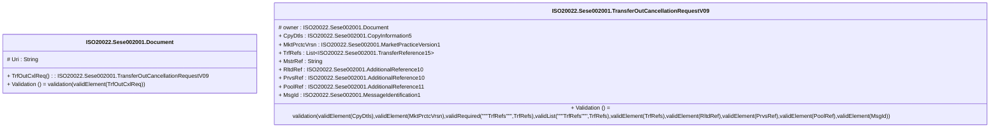

# sese.002.001.09-physical

> The tables below contain descriptions of the members of each Element. 
> The first column indicates the type of the member:
> A ‘#’ indicates that the field is a key to the element, and a ‘+’ indicates that the field is a value.
> The ‘*’ column contains a description for the element member.  
> The ‘@’ column contains any properties for the member.
> The ‘=’ column contains calculated values; or in the case of an enum, the serialized value.

---

## EntityImpl ISO20022.Sese002001.Document

| |Name|Type|*|@|=|
|-|-|-|-|-|-|
|#|Uri|String||XmlIgnore(), JsonIgnore()||
|+|TrfOutCxlReq|ISO20022.Sese002001.TransferOutCancellationRequestV09||XmlElement()||
||Validation|Some(String)||XmlIgnore(), JsonIgnore()|validation(validElement(TrfOutCxlReq))|

---

## AspectImpl ISO20022.Sese002001.TransferOutCancellationRequestV09

| |Name|Type|*|@|=|
|-|-|-|-|-|-|
|#|owner|ISO20022.Sese002001.Document||||
|+|CpyDtls|ISO20022.Sese002001.CopyInformation5||XmlElement()||
|+|MktPrctcVrsn|ISO20022.Sese002001.MarketPracticeVersion1||XmlElement()||
|+|TrfRefs|List<ISO20022.Sese002001.TransferReference15>||XmlElement()||
|+|MstrRef|String||XmlElement()||
|+|RltdRef|ISO20022.Sese002001.AdditionalReference10||XmlElement()||
|+|PrvsRef|ISO20022.Sese002001.AdditionalReference10||XmlElement()||
|+|PoolRef|ISO20022.Sese002001.AdditionalReference11||XmlElement()||
|+|MsgId|ISO20022.Sese002001.MessageIdentification1||XmlElement()||
||Validation|Some(String)||XmlIgnore(), JsonIgnore()|validation(validElement(CpyDtls),validElement(MktPrctcVrsn),validRequired("""TrfRefs""",TrfRefs),validList("""TrfRefs""",TrfRefs),validElement(TrfRefs),validElement(RltdRef),validElement(PrvsRef),validElement(PoolRef),validElement(MsgId))|

