# sese.003.001.09-physical

```mermaid
classDiagram
    class ISO20022.Sese003001.Document {
        # Uri  : String
        + TrfOutConf () : ISO20022.Sese003001.TransferOutConfirmationV09
        + Validation () = validation(validElement(TrfOutConf))
    }
    class ISO20022.Sese003001.TransferOutConfirmationV09 {
        # owner  : ISO20022.Sese003001.Document
        + Xtnsn  : List~ISO20022.Sese003001.Extension1~
        + CpyDtls  : ISO20022.Sese003001.CopyInformation5
        + MktPrctcVrsn  : ISO20022.Sese003001.MarketPracticeVersion1
        + SttlmDtls  : ISO20022.Sese003001.ReceiveInformation20
        + AcctDtls  : ISO20022.Sese003001.InvestmentAccount70
        + TrfDtls  : List~ISO20022.Sese003001.Transfer37~
        + MstrRef  : String
        + RltdRef  : ISO20022.Sese003001.AdditionalReference10
        + PrvsRef  : ISO20022.Sese003001.AdditionalReference10
        + PoolRef  : ISO20022.Sese003001.AdditionalReference11
        + MsgId  : ISO20022.Sese003001.MessageIdentification1
        + Validation () = validation(validList("""Xtnsn""",Xtnsn),validElement(Xtnsn),validElement(CpyDtls),validElement(MktPrctcVrsn),validElement(SttlmDtls),validElement(AcctDtls),validRequired("""TrfDtls""",TrfDtls),validList("""TrfDtls""",TrfDtls),validElement(TrfDtls),validElement(RltdRef),validElement(PrvsRef),validElement(PoolRef),validElement(MsgId))
    }
```

> The tables below contain descriptions of the members of each Element. 
> The first column indicates the type of the member:
> A ‘#’ indicates that the field is a key to the element, and a ‘+’ indicates that the field is a value.
> The ‘*’ column contains a description for the element member.  
> The ‘@’ column contains any properties for the member.
> The ‘=’ column contains calculated values; or in the case of an enum, the serialized value.

---

## EntityImpl ISO20022.Sese003001.Document

| |Name|Type|*|@|=|
|-|-|-|-|-|-|
|#|Uri|String||XmlIgnore(), JsonIgnore()||
|+|TrfOutConf|ISO20022.Sese003001.TransferOutConfirmationV09||XmlElement()||
||Validation|Some(String)||XmlIgnore(), JsonIgnore()|validation(validElement(TrfOutConf))|

---

## AspectImpl ISO20022.Sese003001.TransferOutConfirmationV09

| |Name|Type|*|@|=|
|-|-|-|-|-|-|
|#|owner|ISO20022.Sese003001.Document||||
|+|Xtnsn|List<ISO20022.Sese003001.Extension1>||XmlElement()||
|+|CpyDtls|ISO20022.Sese003001.CopyInformation5||XmlElement()||
|+|MktPrctcVrsn|ISO20022.Sese003001.MarketPracticeVersion1||XmlElement()||
|+|SttlmDtls|ISO20022.Sese003001.ReceiveInformation20||XmlElement()||
|+|AcctDtls|ISO20022.Sese003001.InvestmentAccount70||XmlElement()||
|+|TrfDtls|List<ISO20022.Sese003001.Transfer37>||XmlElement()||
|+|MstrRef|String||XmlElement()||
|+|RltdRef|ISO20022.Sese003001.AdditionalReference10||XmlElement()||
|+|PrvsRef|ISO20022.Sese003001.AdditionalReference10||XmlElement()||
|+|PoolRef|ISO20022.Sese003001.AdditionalReference11||XmlElement()||
|+|MsgId|ISO20022.Sese003001.MessageIdentification1||XmlElement()||
||Validation|Some(String)||XmlIgnore(), JsonIgnore()|validation(validList("""Xtnsn""",Xtnsn),validElement(Xtnsn),validElement(CpyDtls),validElement(MktPrctcVrsn),validElement(SttlmDtls),validElement(AcctDtls),validRequired("""TrfDtls""",TrfDtls),validList("""TrfDtls""",TrfDtls),validElement(TrfDtls),validElement(RltdRef),validElement(PrvsRef),validElement(PoolRef),validElement(MsgId))|

