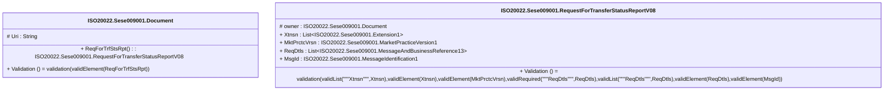

# sese.009.001.08-physical

> The tables below contain descriptions of the members of each Element. 
> The first column indicates the type of the member:
> A ‘#’ indicates that the field is a key to the element, and a ‘+’ indicates that the field is a value.
> The ‘*’ column contains a description for the element member.  
> The ‘@’ column contains any properties for the member.
> The ‘=’ column contains calculated values; or in the case of an enum, the serialized value.

---

## EntityImpl ISO20022.Sese009001.Document

| |Name|Type|*|@|=|
|-|-|-|-|-|-|
|#|Uri|String||XmlIgnore(), JsonIgnore()||
|+|ReqForTrfStsRpt|ISO20022.Sese009001.RequestForTransferStatusReportV08||XmlElement()||
||Validation|Some(String)||XmlIgnore(), JsonIgnore()|validation(validElement(ReqForTrfStsRpt))|

---

## AspectImpl ISO20022.Sese009001.RequestForTransferStatusReportV08

| |Name|Type|*|@|=|
|-|-|-|-|-|-|
|#|owner|ISO20022.Sese009001.Document||||
|+|Xtnsn|List<ISO20022.Sese009001.Extension1>||XmlElement()||
|+|MktPrctcVrsn|ISO20022.Sese009001.MarketPracticeVersion1||XmlElement()||
|+|ReqDtls|List<ISO20022.Sese009001.MessageAndBusinessReference13>||XmlElement()||
|+|MsgId|ISO20022.Sese009001.MessageIdentification1||XmlElement()||
||Validation|Some(String)||XmlIgnore(), JsonIgnore()|validation(validList("""Xtnsn""",Xtnsn),validElement(Xtnsn),validElement(MktPrctcVrsn),validRequired("""ReqDtls""",ReqDtls),validList("""ReqDtls""",ReqDtls),validElement(ReqDtls),validElement(MsgId))|

