# sese.009.001.08

```mermaid
classDiagram
    class Hiperspace.Edge {
        # From  : Hiperspace.Node
        # To  : Hiperspace.Node
        # TypeName  : String
        + Name  : String
    }
    class ISO20022.Sese009001.Account33 {
        + SubAcctDtls  : ISO20022.Sese009001.SubAccount5
        + Svcr  : ISO20022.Sese009001.PartyIdentification132
        + Tp  : ISO20022.Sese009001.GenericIdentification30
        + AcctNm  : String
        + AcctDsgnt  : String
        + AcctId  : String
        + OwnrId  : ISO20022.Sese009001.PartyIdentification132
    }
    ISO20022.Sese009001.Account33 *-- ISO20022.Sese009001.SubAccount5
    ISO20022.Sese009001.Account33 *-- ISO20022.Sese009001.PartyIdentification132
    ISO20022.Sese009001.Account33 *-- ISO20022.Sese009001.GenericIdentification30
    ISO20022.Sese009001.Account33 *-- ISO20022.Sese009001.PartyIdentification132
    class ISO20022.Sese009001.Account34 {
        + RegnAdr  : ISO20022.Sese009001.PostalAddress1
        + AcctSvcr  : ISO20022.Sese009001.PartyIdentification132
        + AcctNm  : String
        + AcctDsgnt  : String
        + AcctId  : String
    }
    ISO20022.Sese009001.Account34 *-- ISO20022.Sese009001.PostalAddress1
    ISO20022.Sese009001.Account34 *-- ISO20022.Sese009001.PartyIdentification132
    class ISO20022.Sese009001.AdditionalInformation15 {
        + InfVal  : String
        + InfTp  : ISO20022.Sese009001.GenericIdentification36
    }
    ISO20022.Sese009001.AdditionalInformation15 *-- ISO20022.Sese009001.GenericIdentification36
    class ISO20022.Sese009001.AdditionalInformation25 {
        + RjctnRsn  : ISO20022.Sese009001.RejectedReason33Choice
        + QryRsn  : String
        + Qry  : String
        + QryTp  : ISO20022.Sese009001.GenericIdentification36
    }
    ISO20022.Sese009001.AdditionalInformation25 *-- ISO20022.Sese009001.RejectedReason33Choice
    ISO20022.Sese009001.AdditionalInformation25 *-- ISO20022.Sese009001.GenericIdentification36
    class ISO20022.Sese009001.AdditionalReference10 {
        + MsgNm  : String
        + RefIssr  : ISO20022.Sese009001.PartyIdentification139
        + Ref  : String
    }
    ISO20022.Sese009001.AdditionalReference10 *-- ISO20022.Sese009001.PartyIdentification139
    class ISO20022.Sese009001.AddressType2Code {
        DLVY = 1
        MLTO = 2
        BIZZ = 3
        HOME = 4
        PBOX = 5
        ADDR = 6
    }
    class ISO20022.Sese009001.AlternateSecurityIdentification7 {
        + IdSrc  : ISO20022.Sese009001.IdentificationSource1Choice
        + Id  : String
    }
    ISO20022.Sese009001.AlternateSecurityIdentification7 *-- ISO20022.Sese009001.IdentificationSource1Choice
    class ISO20022.Sese009001.CashAsset3 {
        + AddtlInf  : ISO20022.Sese009001.AdditionalInformation15
        + TrfCcy  : String
        + HldgCcy  : String
        + CshAsstTp  : ISO20022.Sese009001.CashAssetType1Choice
    }
    ISO20022.Sese009001.CashAsset3 *-- ISO20022.Sese009001.AdditionalInformation15
    ISO20022.Sese009001.CashAsset3 *-- ISO20022.Sese009001.CashAssetType1Choice
    class ISO20022.Sese009001.CashAssetType1Choice {
        + Prtry  : ISO20022.Sese009001.GenericIdentification36
        + Cd  : String
    }
    ISO20022.Sese009001.CashAssetType1Choice *-- ISO20022.Sese009001.GenericIdentification36
    class ISO20022.Sese009001.CashAssetType1Code {
        CSH1 = 1
        CSH2 = 2
    }
    class ISO20022.Sese009001.ClassificationType32Choice {
        + AltrnClssfctn  : ISO20022.Sese009001.GenericIdentification36
        + ClssfctnFinInstrm  : String
    }
    ISO20022.Sese009001.ClassificationType32Choice *-- ISO20022.Sese009001.GenericIdentification36
    class ISO20022.Sese009001.ClearingSystemMemberIdentification2Choice {
        + OthrClrCdId  : String
        + PLKNR  : String
        + GRHEBIC  : String
        + INIFSC  : String
        + AUBSBs  : String
        + AUBSBx  : String
        + HKNCC  : String
        + ZANCC  : String
        + ESNCC  : String
        + DEBLZ  : String
        + CHSIC  : String
        + CACPA  : String
        + ATBLZ  : String
        + ITNCC  : String
        + RUCB  : String
        + PTNCC  : String
        + USFW  : String
        + CHBC  : String
        + USCH  : String
        + GBSC  : String
        + IENSC  : String
        + NZNCC  : String
        + USCHU  : String
    }
    class ISO20022.Sese009001.ContactIdentification2 {
        + EmailAdr  : String
        + FaxNb  : String
        + MobNb  : String
        + PhneNb  : String
        + Nm  : String
        + GvnNm  : String
        + NmPrfx  : String
    }
    class ISO20022.Sese009001.Extension1 {
        + Txt  : String
        + PlcAndNm  : String
    }
    class ISO20022.Sese009001.FinancialInstrument63Choice {
        + OthrAsst  : ISO20022.Sese009001.OtherAsset2
        + CshAsst  : ISO20022.Sese009001.CashAsset3
        + Scty  : ISO20022.Sese009001.FinancialInstrumentIdentification2
    }
    ISO20022.Sese009001.FinancialInstrument63Choice *-- ISO20022.Sese009001.OtherAsset2
    ISO20022.Sese009001.FinancialInstrument63Choice *-- ISO20022.Sese009001.CashAsset3
    ISO20022.Sese009001.FinancialInstrument63Choice *-- ISO20022.Sese009001.FinancialInstrumentIdentification2
    class ISO20022.Sese009001.FinancialInstrumentIdentification2 {
        + ClssfctnTp  : ISO20022.Sese009001.ClassificationType32Choice
        + ShrtNm  : String
        + Nm  : String
        + Id  : ISO20022.Sese009001.SecurityIdentification25Choice
    }
    ISO20022.Sese009001.FinancialInstrumentIdentification2 *-- ISO20022.Sese009001.ClassificationType32Choice
    ISO20022.Sese009001.FinancialInstrumentIdentification2 *-- ISO20022.Sese009001.SecurityIdentification25Choice
    class ISO20022.Sese009001.GenericIdentification1 {
        + Issr  : String
        + SchmeNm  : String
        + Id  : String
    }
    class ISO20022.Sese009001.GenericIdentification30 {
        + SchmeNm  : String
        + Issr  : String
        + Id  : String
    }
    class ISO20022.Sese009001.GenericIdentification36 {
        + SchmeNm  : String
        + Issr  : String
        + Id  : String
    }
    class ISO20022.Sese009001.IdentificationSource1Choice {
        + Prtry  : String
        + Dmst  : String
    }
    class ISO20022.Sese009001.Intermediary48 {
        + CtctPrsn  : ISO20022.Sese009001.ContactIdentification2
        + Role  : ISO20022.Sese009001.Role8Choice
        + Acct  : ISO20022.Sese009001.Account34
        + Id  : ISO20022.Sese009001.PartyIdentification132
    }
    ISO20022.Sese009001.Intermediary48 *-- ISO20022.Sese009001.ContactIdentification2
    ISO20022.Sese009001.Intermediary48 *-- ISO20022.Sese009001.Role8Choice
    ISO20022.Sese009001.Intermediary48 *-- ISO20022.Sese009001.Account34
    ISO20022.Sese009001.Intermediary48 *-- ISO20022.Sese009001.PartyIdentification132
    class ISO20022.Sese009001.InvestmentFundRole8Code {
        DATP = 1
        CONC = 2
        CACO = 3
        REGI = 4
        UCL2 = 5
        UCL1 = 6
        TRAN = 7
        TRAG = 8
        INVS = 9
        INVE = 10
        INTR = 11
        FMCO = 12
        DIST = 13
        CUST = 14
    }
    class ISO20022.Sese009001.MarketPracticeVersion1 {
        + Nb  : String
        + Dt  : String
        + Nm  : String
    }
    class ISO20022.Sese009001.MessageAndBusinessReference13 {
        + ReqRcpt  : ISO20022.Sese009001.PartyIdentification139
        + ReqIssr  : ISO20022.Sese009001.PartyIdentification139
        + QryInf  : global::System.Collections.Generic.List~ISO20022.Sese009001.AdditionalInformation25~
        + IntrmyInf  : global::System.Collections.Generic.List~ISO20022.Sese009001.Intermediary48~
        + InvstmtAcctDtls  : ISO20022.Sese009001.Account33
        + Instrm  : ISO20022.Sese009001.FinancialInstrument63Choice
        + CxlRef  : String
        + ClntRef  : ISO20022.Sese009001.AdditionalReference10
        + TrfRef  : String
        + MstrRef  : String
        + TpOfReq  : ISO20022.Sese009001.TypeOfRequest1Choice
        + Ref  : ISO20022.Sese009001.References68Choice
    }
    ISO20022.Sese009001.MessageAndBusinessReference13 *-- ISO20022.Sese009001.PartyIdentification139
    ISO20022.Sese009001.MessageAndBusinessReference13 *-- ISO20022.Sese009001.PartyIdentification139
    ISO20022.Sese009001.MessageAndBusinessReference13 *-- ISO20022.Sese009001.AdditionalInformation25
    ISO20022.Sese009001.MessageAndBusinessReference13 *-- ISO20022.Sese009001.Intermediary48
    ISO20022.Sese009001.MessageAndBusinessReference13 *-- ISO20022.Sese009001.Account33
    ISO20022.Sese009001.MessageAndBusinessReference13 *-- ISO20022.Sese009001.FinancialInstrument63Choice
    ISO20022.Sese009001.MessageAndBusinessReference13 *-- ISO20022.Sese009001.AdditionalReference10
    ISO20022.Sese009001.MessageAndBusinessReference13 *-- ISO20022.Sese009001.TypeOfRequest1Choice
    ISO20022.Sese009001.MessageAndBusinessReference13 *-- ISO20022.Sese009001.References68Choice
    class ISO20022.Sese009001.MessageIdentification1 {
        + CreDtTm  : DateTime
        + Id  : String
    }
    class ISO20022.Sese009001.NameAndAddress5 {
        + Adr  : ISO20022.Sese009001.PostalAddress1
        + Nm  : String
    }
    ISO20022.Sese009001.NameAndAddress5 *-- ISO20022.Sese009001.PostalAddress1
    class ISO20022.Sese009001.NamePrefix1Code {
        MADM = 1
        MISS = 2
        MIST = 3
        DOCT = 4
    }
    class ISO20022.Sese009001.OtherAsset2 {
        + AddtlInf  : global::System.Collections.Generic.List~ISO20022.Sese009001.AdditionalInformation15~
        + OthrId  : global::System.Collections.Generic.List~String~
        + Desc  : String
        + Nm  : String
        + Id  : String
        + OthrAsstTp  : ISO20022.Sese009001.OtherAsset2Choice
    }
    ISO20022.Sese009001.OtherAsset2 *-- ISO20022.Sese009001.AdditionalInformation15
    ISO20022.Sese009001.OtherAsset2 *-- ISO20022.Sese009001.OtherAsset2Choice
    class ISO20022.Sese009001.OtherAsset2Choice {
        + Prtry  : ISO20022.Sese009001.GenericIdentification36
        + Cd  : String
    }
    ISO20022.Sese009001.OtherAsset2Choice *-- ISO20022.Sese009001.GenericIdentification36
    class ISO20022.Sese009001.OtherAsset2Code {
        TIPP = 1
        PROP = 2
        MOVE = 3
        EXIA = 4
        DIMA = 5
    }
    class ISO20022.Sese009001.PartyIdentification125Choice {
        + NmAndAdr  : ISO20022.Sese009001.NameAndAddress5
        + PrtryId  : ISO20022.Sese009001.GenericIdentification1
        + AnyBIC  : String
    }
    ISO20022.Sese009001.PartyIdentification125Choice *-- ISO20022.Sese009001.NameAndAddress5
    ISO20022.Sese009001.PartyIdentification125Choice *-- ISO20022.Sese009001.GenericIdentification1
    class ISO20022.Sese009001.PartyIdentification132 {
        + LEI  : String
        + PrtryId  : ISO20022.Sese009001.GenericIdentification1
        + NmAndAdr  : ISO20022.Sese009001.NameAndAddress5
        + ClrSysMmbId  : ISO20022.Sese009001.ClearingSystemMemberIdentification2Choice
        + AnyBIC  : String
    }
    ISO20022.Sese009001.PartyIdentification132 *-- ISO20022.Sese009001.GenericIdentification1
    ISO20022.Sese009001.PartyIdentification132 *-- ISO20022.Sese009001.NameAndAddress5
    ISO20022.Sese009001.PartyIdentification132 *-- ISO20022.Sese009001.ClearingSystemMemberIdentification2Choice
    class ISO20022.Sese009001.PartyIdentification139 {
        + LEI  : String
        + Pty  : ISO20022.Sese009001.PartyIdentification125Choice
    }
    ISO20022.Sese009001.PartyIdentification139 *-- ISO20022.Sese009001.PartyIdentification125Choice
    class ISO20022.Sese009001.PostalAddress1 {
        + Ctry  : String
        + CtrySubDvsn  : String
        + TwnNm  : String
        + PstCd  : String
        + BldgNb  : String
        + StrtNm  : String
        + AdrLine  : global::System.Collections.Generic.List~String~
        + AdrTp  : String
    }
    class ISO20022.Sese009001.References68Choice {
        + OthrRef  : ISO20022.Sese009001.AdditionalReference10
        + PrvsRef  : ISO20022.Sese009001.AdditionalReference10
    }
    ISO20022.Sese009001.References68Choice *-- ISO20022.Sese009001.AdditionalReference10
    ISO20022.Sese009001.References68Choice *-- ISO20022.Sese009001.AdditionalReference10
    class ISO20022.Sese009001.RejectedReason33Choice {
        + Prtry  : ISO20022.Sese009001.GenericIdentification36
        + Cd  : String
    }
    ISO20022.Sese009001.RejectedReason33Choice *-- ISO20022.Sese009001.GenericIdentification36
    class ISO20022.Sese009001.RejectedStatusReason12Code {
        URSC = 1
        UPAY = 2
        DTRD = 3
        NCRR = 4
        IVAG = 5
        PRCT = 6
        DMON = 7
        INTE = 8
        IPAC = 9
        ICAG = 10
        DINV = 11
        BMRV = 12
        ILLI = 13
        COSE = 14
        BLTR = 15
        NQTY = 16
        NASS = 17
        ACLO = 18
        NCON = 19
        OTHR = 20
        ISAT = 21
        DEPT = 22
        ISTP = 23
        DDAT = 24
        DLVY = 25
        PTNS = 26
        SECU = 27
        NSLA = 28
        LEGL = 29
        INUK = 30
        SAFE = 31
        INNA = 32
        INPM = 33
        CASH = 34
        INAC = 35
        INID = 36
        FTAX = 37
        DQUA = 38
        IDNA = 39
        DSEC = 40
        TREF = 41
        CYPA = 42
        ICTN = 43
        IAQD = 44
        DOCC = 45
        BLCA = 46
    }
    class ISO20022.Sese009001.RequestForTransferStatusReportV08 {
        + Xtnsn  : global::System.Collections.Generic.List~ISO20022.Sese009001.Extension1~
        + MktPrctcVrsn  : ISO20022.Sese009001.MarketPracticeVersion1
        + ReqDtls  : global::System.Collections.Generic.List~ISO20022.Sese009001.MessageAndBusinessReference13~
        + MsgId  : ISO20022.Sese009001.MessageIdentification1
    }
    ISO20022.Sese009001.RequestForTransferStatusReportV08 *-- ISO20022.Sese009001.Extension1
    ISO20022.Sese009001.RequestForTransferStatusReportV08 *-- ISO20022.Sese009001.MarketPracticeVersion1
    ISO20022.Sese009001.RequestForTransferStatusReportV08 *-- ISO20022.Sese009001.MessageAndBusinessReference13
    ISO20022.Sese009001.RequestForTransferStatusReportV08 *-- ISO20022.Sese009001.MessageIdentification1
    class ISO20022.Sese009001.Role8Choice {
        + Prtry  : ISO20022.Sese009001.GenericIdentification36
        + Cd  : String
    }
    ISO20022.Sese009001.Role8Choice *-- ISO20022.Sese009001.GenericIdentification36
    class ISO20022.Sese009001.SecurityIdentification25Choice {
        + OthrPrtryId  : ISO20022.Sese009001.AlternateSecurityIdentification7
        + Cmon  : String
        + Belgn  : String
        + SCVM  : String
        + Vlrn  : String
        + Dtch  : String
        + Wrtppr  : String
        + QUICK  : String
        + CTA  : String
        + Blmbrg  : String
        + TckrSymb  : String
        + RIC  : String
        + CUSIP  : String
        + SEDOL  : String
        + ISIN  : String
    }
    ISO20022.Sese009001.SecurityIdentification25Choice *-- ISO20022.Sese009001.AlternateSecurityIdentification7
    class ISO20022.Sese009001.SubAccount5 {
        + Chrtc  : String
        + Nm  : String
        + Id  : String
    }
    class ISO20022.Sese009001.TypeOfRequest1Choice {
        + Prtry  : ISO20022.Sese009001.GenericIdentification36
        + Cd  : String
    }
    ISO20022.Sese009001.TypeOfRequest1Choice *-- ISO20022.Sese009001.GenericIdentification36
    class ISO20022.Sese009001.TypeOfRequest1Code {
        STAT = 1
        INFO = 2
    }
    class Hiperspace.Node {
        # SKey  : String
        + TypeName  : String
        + Name  : String
        + Froms (From = this) : Hiperspace.Edge
        + Tos (To = this) : Hiperspace.Edge
    }
```

> The tables below contain descriptions of the members of each Element. 
> The first column indicates the type of the member:
> A ‘#’ indicates that the field is a key to the element, and a ‘+’ indicates that the field is a value.
> The ‘*’ column contains a description for the element member.  
> The ‘@’ column contains any properties for the member.
> The ‘=’ column contains calculated values; or in the case of an enum, the serialized value.

---

## View Hiperspace.Edge
edge between nodes

| |Name|Type|*|@|=|
|-|-|-|-|-|-|
|#|From|Hiperspace.Node||||
|#|To|Hiperspace.Node||||
|#|TypeName|String||||
|+|Name|String||||

---

## Value ISO20022.Sese009001.Account33

| |Name|Type|*|@|=|
|-|-|-|-|-|-|
|+|SubAcctDtls|ISO20022.Sese009001.SubAccount5||XmlElement()||
|+|Svcr|ISO20022.Sese009001.PartyIdentification132||XmlElement()||
|+|Tp|ISO20022.Sese009001.GenericIdentification30||XmlElement()||
|+|AcctNm|String||XmlElement()||
|+|AcctDsgnt|String||XmlElement()||
|+|AcctId|String||XmlElement()||
|+|OwnrId|ISO20022.Sese009001.PartyIdentification132||XmlElement()||
||Validation|Some(String)||XmlIgnore(), JsonIgnore()|validation(validElement(SubAcctDtls),validElement(Svcr),validElement(Tp),validElement(OwnrId))|

---

## Value ISO20022.Sese009001.Account34

| |Name|Type|*|@|=|
|-|-|-|-|-|-|
|+|RegnAdr|ISO20022.Sese009001.PostalAddress1||XmlElement()||
|+|AcctSvcr|ISO20022.Sese009001.PartyIdentification132||XmlElement()||
|+|AcctNm|String||XmlElement()||
|+|AcctDsgnt|String||XmlElement()||
|+|AcctId|String||XmlElement()||
||Validation|Some(String)||XmlIgnore(), JsonIgnore()|validation(validElement(RegnAdr),validElement(AcctSvcr))|

---

## Value ISO20022.Sese009001.AdditionalInformation15

| |Name|Type|*|@|=|
|-|-|-|-|-|-|
|+|InfVal|String||XmlElement()||
|+|InfTp|ISO20022.Sese009001.GenericIdentification36||XmlElement()||
||Validation|Some(String)||XmlIgnore(), JsonIgnore()|validation(validElement(InfTp))|

---

## Value ISO20022.Sese009001.AdditionalInformation25

| |Name|Type|*|@|=|
|-|-|-|-|-|-|
|+|RjctnRsn|ISO20022.Sese009001.RejectedReason33Choice||XmlElement()||
|+|QryRsn|String||XmlElement()||
|+|Qry|String||XmlElement()||
|+|QryTp|ISO20022.Sese009001.GenericIdentification36||XmlElement()||
||Validation|Some(String)||XmlIgnore(), JsonIgnore()|validation(validElement(RjctnRsn),validElement(QryTp))|

---

## Value ISO20022.Sese009001.AdditionalReference10

| |Name|Type|*|@|=|
|-|-|-|-|-|-|
|+|MsgNm|String||XmlElement()||
|+|RefIssr|ISO20022.Sese009001.PartyIdentification139||XmlElement()||
|+|Ref|String||XmlElement()||
||Validation|Some(String)||XmlIgnore(), JsonIgnore()|validation(validElement(RefIssr))|

---

## Enum ISO20022.Sese009001.AddressType2Code

| |Name|Type|*|@|=|
|-|-|-|-|-|-|
||DLVY|Int32||XmlEnum("""DLVY""")|1|
||MLTO|Int32||XmlEnum("""MLTO""")|2|
||BIZZ|Int32||XmlEnum("""BIZZ""")|3|
||HOME|Int32||XmlEnum("""HOME""")|4|
||PBOX|Int32||XmlEnum("""PBOX""")|5|
||ADDR|Int32||XmlEnum("""ADDR""")|6|

---

## Value ISO20022.Sese009001.AlternateSecurityIdentification7

| |Name|Type|*|@|=|
|-|-|-|-|-|-|
|+|IdSrc|ISO20022.Sese009001.IdentificationSource1Choice||XmlElement()||
|+|Id|String||XmlElement()||
||Validation|Some(String)||XmlIgnore(), JsonIgnore()|validation(validElement(IdSrc))|

---

## Value ISO20022.Sese009001.CashAsset3

| |Name|Type|*|@|=|
|-|-|-|-|-|-|
|+|AddtlInf|ISO20022.Sese009001.AdditionalInformation15||XmlElement()||
|+|TrfCcy|String||XmlElement()||
|+|HldgCcy|String||XmlElement()||
|+|CshAsstTp|ISO20022.Sese009001.CashAssetType1Choice||XmlElement()||
||Validation|Some(String)||XmlIgnore(), JsonIgnore()|validation(validElement(AddtlInf),validPattern("""TrfCcy""",TrfCcy,"""[A-Z]{3,3}"""),validPattern("""HldgCcy""",HldgCcy,"""[A-Z]{3,3}"""),validElement(CshAsstTp))|

---

## Value ISO20022.Sese009001.CashAssetType1Choice

| |Name|Type|*|@|=|
|-|-|-|-|-|-|
|+|Prtry|ISO20022.Sese009001.GenericIdentification36||XmlElement()||
|+|Cd|String||XmlElement()||
||Validation|Some(String)||XmlIgnore(), JsonIgnore()|validation(validElement(Prtry),validChoice(Prtry,Cd))|

---

## Enum ISO20022.Sese009001.CashAssetType1Code

| |Name|Type|*|@|=|
|-|-|-|-|-|-|
||CSH1|Int32||XmlEnum("""CSH1""")|1|
||CSH2|Int32||XmlEnum("""CSH2""")|2|

---

## Value ISO20022.Sese009001.ClassificationType32Choice

| |Name|Type|*|@|=|
|-|-|-|-|-|-|
|+|AltrnClssfctn|ISO20022.Sese009001.GenericIdentification36||XmlElement()||
|+|ClssfctnFinInstrm|String||XmlElement()||
||Validation|Some(String)||XmlIgnore(), JsonIgnore()|validation(validElement(AltrnClssfctn),validPattern("""ClssfctnFinInstrm""",ClssfctnFinInstrm,"""[A-Z]{6,6}"""),validChoice(AltrnClssfctn,ClssfctnFinInstrm))|

---

## Value ISO20022.Sese009001.ClearingSystemMemberIdentification2Choice

| |Name|Type|*|@|=|
|-|-|-|-|-|-|
|+|OthrClrCdId|String||XmlElement()||
|+|PLKNR|String||XmlElement()||
|+|GRHEBIC|String||XmlElement()||
|+|INIFSC|String||XmlElement()||
|+|AUBSBs|String||XmlElement()||
|+|AUBSBx|String||XmlElement()||
|+|HKNCC|String||XmlElement()||
|+|ZANCC|String||XmlElement()||
|+|ESNCC|String||XmlElement()||
|+|DEBLZ|String||XmlElement()||
|+|CHSIC|String||XmlElement()||
|+|CACPA|String||XmlElement()||
|+|ATBLZ|String||XmlElement()||
|+|ITNCC|String||XmlElement()||
|+|RUCB|String||XmlElement()||
|+|PTNCC|String||XmlElement()||
|+|USFW|String||XmlElement()||
|+|CHBC|String||XmlElement()||
|+|USCH|String||XmlElement()||
|+|GBSC|String||XmlElement()||
|+|IENSC|String||XmlElement()||
|+|NZNCC|String||XmlElement()||
|+|USCHU|String||XmlElement()||
||Validation|Some(String)||XmlIgnore(), JsonIgnore()|validation(validPattern("""PLKNR""",PLKNR,"""PL[0-9]{8,8}"""),validPattern("""GRHEBIC""",GRHEBIC,"""GR[0-9]{7,7}"""),validPattern("""INIFSC""",INIFSC,"""IN[a-zA-Z0-9]{11,11}"""),validPattern("""AUBSBs""",AUBSBs,"""AU[0-9]{6,6}"""),validPattern("""AUBSBx""",AUBSBx,"""AU[0-9]{6,6}"""),validPattern("""HKNCC""",HKNCC,"""HK[0-9]{3,3}"""),validPattern("""ZANCC""",ZANCC,"""ZA[0-9]{6,6}"""),validPattern("""ESNCC""",ESNCC,"""ES[0-9]{8,9}"""),validPattern("""DEBLZ""",DEBLZ,"""BL[0-9]{8,8}"""),validPattern("""CHSIC""",CHSIC,"""SW[0-9]{6,6}"""),validPattern("""CACPA""",CACPA,"""CA[0-9]{9,9}"""),validPattern("""ATBLZ""",ATBLZ,"""AT[0-9]{5,5}"""),validPattern("""ITNCC""",ITNCC,"""IT[0-9]{10,10}"""),validPattern("""RUCB""",RUCB,"""RU[0-9]{9,9}"""),validPattern("""PTNCC""",PTNCC,"""PT[0-9]{8,8}"""),validPattern("""USFW""",USFW,"""FW[0-9]{9,9}"""),validPattern("""CHBC""",CHBC,"""SW[0-9]{3,5}"""),validPattern("""USCH""",USCH,"""CP[0-9]{4,4}"""),validPattern("""GBSC""",GBSC,"""SC[0-9]{6,6}"""),validPattern("""IENSC""",IENSC,"""IE[0-9]{6,6}"""),validPattern("""NZNCC""",NZNCC,"""NZ[0-9]{6,6}"""),validPattern("""USCHU""",USCHU,"""CH[0-9]{6,6}"""),validChoice(OthrClrCdId,PLKNR,GRHEBIC,INIFSC,AUBSBs,AUBSBx,HKNCC,ZANCC,ESNCC,DEBLZ,CHSIC,CACPA,ATBLZ,ITNCC,RUCB,PTNCC,USFW,CHBC,USCH,GBSC,IENSC,NZNCC,USCHU))|

---

## Value ISO20022.Sese009001.ContactIdentification2

| |Name|Type|*|@|=|
|-|-|-|-|-|-|
|+|EmailAdr|String||XmlElement()||
|+|FaxNb|String||XmlElement()||
|+|MobNb|String||XmlElement()||
|+|PhneNb|String||XmlElement()||
|+|Nm|String||XmlElement()||
|+|GvnNm|String||XmlElement()||
|+|NmPrfx|String||XmlElement()||
||Validation|Some(String)||XmlIgnore(), JsonIgnore()|validation(validPattern("""FaxNb""",FaxNb,"""\+[0-9]{1,3}-[0-9()+\-]{1,30}"""),validPattern("""MobNb""",MobNb,"""\+[0-9]{1,3}-[0-9()+\-]{1,30}"""),validPattern("""PhneNb""",PhneNb,"""\+[0-9]{1,3}-[0-9()+\-]{1,30}"""))|

---

## Type ISO20022.Sese009001.Document

| |Name|Type|*|@|=|
|-|-|-|-|-|-|
|+|ReqForTrfStsRpt|ISO20022.Sese009001.RequestForTransferStatusReportV08||XmlElement()||
||Validation|Some(String)||XmlIgnore(), JsonIgnore()|validation(validElement(ReqForTrfStsRpt))|

---

## Value ISO20022.Sese009001.Extension1

| |Name|Type|*|@|=|
|-|-|-|-|-|-|
|+|Txt|String||XmlElement()||
|+|PlcAndNm|String||XmlElement()||
||Validation|Some(String)||XmlIgnore(), JsonIgnore()|""|

---

## Value ISO20022.Sese009001.FinancialInstrument63Choice

| |Name|Type|*|@|=|
|-|-|-|-|-|-|
|+|OthrAsst|ISO20022.Sese009001.OtherAsset2||XmlElement()||
|+|CshAsst|ISO20022.Sese009001.CashAsset3||XmlElement()||
|+|Scty|ISO20022.Sese009001.FinancialInstrumentIdentification2||XmlElement()||
||Validation|Some(String)||XmlIgnore(), JsonIgnore()|validation(validElement(OthrAsst),validElement(CshAsst),validElement(Scty),validChoice(OthrAsst,CshAsst,Scty))|

---

## Value ISO20022.Sese009001.FinancialInstrumentIdentification2

| |Name|Type|*|@|=|
|-|-|-|-|-|-|
|+|ClssfctnTp|ISO20022.Sese009001.ClassificationType32Choice||XmlElement()||
|+|ShrtNm|String||XmlElement()||
|+|Nm|String||XmlElement()||
|+|Id|ISO20022.Sese009001.SecurityIdentification25Choice||XmlElement()||
||Validation|Some(String)||XmlIgnore(), JsonIgnore()|validation(validElement(ClssfctnTp),validElement(Id))|

---

## Value ISO20022.Sese009001.GenericIdentification1

| |Name|Type|*|@|=|
|-|-|-|-|-|-|
|+|Issr|String||XmlElement()||
|+|SchmeNm|String||XmlElement()||
|+|Id|String||XmlElement()||
||Validation|Some(String)||XmlIgnore(), JsonIgnore()|""|

---

## Value ISO20022.Sese009001.GenericIdentification30

| |Name|Type|*|@|=|
|-|-|-|-|-|-|
|+|SchmeNm|String||XmlElement()||
|+|Issr|String||XmlElement()||
|+|Id|String||XmlElement()||
||Validation|Some(String)||XmlIgnore(), JsonIgnore()|validation(validPattern("""Id""",Id,"""[a-zA-Z0-9]{4}"""))|

---

## Value ISO20022.Sese009001.GenericIdentification36

| |Name|Type|*|@|=|
|-|-|-|-|-|-|
|+|SchmeNm|String||XmlElement()||
|+|Issr|String||XmlElement()||
|+|Id|String||XmlElement()||
||Validation|Some(String)||XmlIgnore(), JsonIgnore()|""|

---

## Value ISO20022.Sese009001.IdentificationSource1Choice

| |Name|Type|*|@|=|
|-|-|-|-|-|-|
|+|Prtry|String||XmlElement()||
|+|Dmst|String||XmlElement()||
||Validation|Some(String)||XmlIgnore(), JsonIgnore()|validation(validPattern("""Dmst""",Dmst,"""[A-Z]{2,2}"""),validChoice(Prtry,Dmst))|

---

## Value ISO20022.Sese009001.Intermediary48

| |Name|Type|*|@|=|
|-|-|-|-|-|-|
|+|CtctPrsn|ISO20022.Sese009001.ContactIdentification2||XmlElement()||
|+|Role|ISO20022.Sese009001.Role8Choice||XmlElement()||
|+|Acct|ISO20022.Sese009001.Account34||XmlElement()||
|+|Id|ISO20022.Sese009001.PartyIdentification132||XmlElement()||
||Validation|Some(String)||XmlIgnore(), JsonIgnore()|validation(validElement(CtctPrsn),validElement(Role),validElement(Acct),validElement(Id))|

---

## Enum ISO20022.Sese009001.InvestmentFundRole8Code

| |Name|Type|*|@|=|
|-|-|-|-|-|-|
||DATP|Int32||XmlEnum("""DATP""")|1|
||CONC|Int32||XmlEnum("""CONC""")|2|
||CACO|Int32||XmlEnum("""CACO""")|3|
||REGI|Int32||XmlEnum("""REGI""")|4|
||UCL2|Int32||XmlEnum("""UCL2""")|5|
||UCL1|Int32||XmlEnum("""UCL1""")|6|
||TRAN|Int32||XmlEnum("""TRAN""")|7|
||TRAG|Int32||XmlEnum("""TRAG""")|8|
||INVS|Int32||XmlEnum("""INVS""")|9|
||INVE|Int32||XmlEnum("""INVE""")|10|
||INTR|Int32||XmlEnum("""INTR""")|11|
||FMCO|Int32||XmlEnum("""FMCO""")|12|
||DIST|Int32||XmlEnum("""DIST""")|13|
||CUST|Int32||XmlEnum("""CUST""")|14|

---

## Value ISO20022.Sese009001.MarketPracticeVersion1

| |Name|Type|*|@|=|
|-|-|-|-|-|-|
|+|Nb|String||XmlElement()||
|+|Dt|String||XmlElement()||
|+|Nm|String||XmlElement()||
||Validation|Some(String)||XmlIgnore(), JsonIgnore()|""|

---

## Value ISO20022.Sese009001.MessageAndBusinessReference13

| |Name|Type|*|@|=|
|-|-|-|-|-|-|
|+|ReqRcpt|ISO20022.Sese009001.PartyIdentification139||XmlElement()||
|+|ReqIssr|ISO20022.Sese009001.PartyIdentification139||XmlElement()||
|+|QryInf|global::System.Collections.Generic.List<ISO20022.Sese009001.AdditionalInformation25>||XmlElement()||
|+|IntrmyInf|global::System.Collections.Generic.List<ISO20022.Sese009001.Intermediary48>||XmlElement()||
|+|InvstmtAcctDtls|ISO20022.Sese009001.Account33||XmlElement()||
|+|Instrm|ISO20022.Sese009001.FinancialInstrument63Choice||XmlElement()||
|+|CxlRef|String||XmlElement()||
|+|ClntRef|ISO20022.Sese009001.AdditionalReference10||XmlElement()||
|+|TrfRef|String||XmlElement()||
|+|MstrRef|String||XmlElement()||
|+|TpOfReq|ISO20022.Sese009001.TypeOfRequest1Choice||XmlElement()||
|+|Ref|ISO20022.Sese009001.References68Choice||XmlElement()||
||Validation|Some(String)||XmlIgnore(), JsonIgnore()|validation(validElement(ReqRcpt),validElement(ReqIssr),validList("""QryInf""",QryInf),validElement(QryInf),validList("""IntrmyInf""",IntrmyInf),validElement(IntrmyInf),validElement(InvstmtAcctDtls),validElement(Instrm),validElement(ClntRef),validElement(TpOfReq),validElement(Ref))|

---

## Value ISO20022.Sese009001.MessageIdentification1

| |Name|Type|*|@|=|
|-|-|-|-|-|-|
|+|CreDtTm|DateTime||XmlElement()||
|+|Id|String||XmlElement()||
||Validation|Some(String)||XmlIgnore(), JsonIgnore()|""|

---

## Value ISO20022.Sese009001.NameAndAddress5

| |Name|Type|*|@|=|
|-|-|-|-|-|-|
|+|Adr|ISO20022.Sese009001.PostalAddress1||XmlElement()||
|+|Nm|String||XmlElement()||
||Validation|Some(String)||XmlIgnore(), JsonIgnore()|validation(validElement(Adr))|

---

## Enum ISO20022.Sese009001.NamePrefix1Code

| |Name|Type|*|@|=|
|-|-|-|-|-|-|
||MADM|Int32||XmlEnum("""MADM""")|1|
||MISS|Int32||XmlEnum("""MISS""")|2|
||MIST|Int32||XmlEnum("""MIST""")|3|
||DOCT|Int32||XmlEnum("""DOCT""")|4|

---

## Value ISO20022.Sese009001.OtherAsset2

| |Name|Type|*|@|=|
|-|-|-|-|-|-|
|+|AddtlInf|global::System.Collections.Generic.List<ISO20022.Sese009001.AdditionalInformation15>||XmlElement()||
|+|OthrId|global::System.Collections.Generic.List<String>||XmlElement()||
|+|Desc|String||XmlElement()||
|+|Nm|String||XmlElement()||
|+|Id|String||XmlElement()||
|+|OthrAsstTp|ISO20022.Sese009001.OtherAsset2Choice||XmlElement()||
||Validation|Some(String)||XmlIgnore(), JsonIgnore()|validation(validList("""AddtlInf""",AddtlInf),validElement(AddtlInf),validListMax("""OthrId""",OthrId,5),validElement(OthrAsstTp))|

---

## Value ISO20022.Sese009001.OtherAsset2Choice

| |Name|Type|*|@|=|
|-|-|-|-|-|-|
|+|Prtry|ISO20022.Sese009001.GenericIdentification36||XmlElement()||
|+|Cd|String||XmlElement()||
||Validation|Some(String)||XmlIgnore(), JsonIgnore()|validation(validElement(Prtry),validChoice(Prtry,Cd))|

---

## Enum ISO20022.Sese009001.OtherAsset2Code

| |Name|Type|*|@|=|
|-|-|-|-|-|-|
||TIPP|Int32||XmlEnum("""TIPP""")|1|
||PROP|Int32||XmlEnum("""PROP""")|2|
||MOVE|Int32||XmlEnum("""MOVE""")|3|
||EXIA|Int32||XmlEnum("""EXIA""")|4|
||DIMA|Int32||XmlEnum("""DIMA""")|5|

---

## Value ISO20022.Sese009001.PartyIdentification125Choice

| |Name|Type|*|@|=|
|-|-|-|-|-|-|
|+|NmAndAdr|ISO20022.Sese009001.NameAndAddress5||XmlElement()||
|+|PrtryId|ISO20022.Sese009001.GenericIdentification1||XmlElement()||
|+|AnyBIC|String||XmlElement()||
||Validation|Some(String)||XmlIgnore(), JsonIgnore()|validation(validElement(NmAndAdr),validElement(PrtryId),validPattern("""AnyBIC""",AnyBIC,"""[A-Z0-9]{4,4}[A-Z]{2,2}[A-Z0-9]{2,2}([A-Z0-9]{3,3}){0,1}"""),validChoice(NmAndAdr,PrtryId,AnyBIC))|

---

## Value ISO20022.Sese009001.PartyIdentification132

| |Name|Type|*|@|=|
|-|-|-|-|-|-|
|+|LEI|String||XmlElement()||
|+|PrtryId|ISO20022.Sese009001.GenericIdentification1||XmlElement()||
|+|NmAndAdr|ISO20022.Sese009001.NameAndAddress5||XmlElement()||
|+|ClrSysMmbId|ISO20022.Sese009001.ClearingSystemMemberIdentification2Choice||XmlElement()||
|+|AnyBIC|String||XmlElement()||
||Validation|Some(String)||XmlIgnore(), JsonIgnore()|validation(validPattern("""LEI""",LEI,"""[A-Z0-9]{18,18}[0-9]{2,2}"""),validElement(PrtryId),validElement(NmAndAdr),validElement(ClrSysMmbId),validPattern("""AnyBIC""",AnyBIC,"""[A-Z0-9]{4,4}[A-Z]{2,2}[A-Z0-9]{2,2}([A-Z0-9]{3,3}){0,1}"""))|

---

## Value ISO20022.Sese009001.PartyIdentification139

| |Name|Type|*|@|=|
|-|-|-|-|-|-|
|+|LEI|String||XmlElement()||
|+|Pty|ISO20022.Sese009001.PartyIdentification125Choice||XmlElement()||
||Validation|Some(String)||XmlIgnore(), JsonIgnore()|validation(validPattern("""LEI""",LEI,"""[A-Z0-9]{18,18}[0-9]{2,2}"""),validElement(Pty))|

---

## Value ISO20022.Sese009001.PostalAddress1

| |Name|Type|*|@|=|
|-|-|-|-|-|-|
|+|Ctry|String||XmlElement()||
|+|CtrySubDvsn|String||XmlElement()||
|+|TwnNm|String||XmlElement()||
|+|PstCd|String||XmlElement()||
|+|BldgNb|String||XmlElement()||
|+|StrtNm|String||XmlElement()||
|+|AdrLine|global::System.Collections.Generic.List<String>||XmlElement()||
|+|AdrTp|String||XmlElement()||
||Validation|Some(String)||XmlIgnore(), JsonIgnore()|validation(validPattern("""Ctry""",Ctry,"""[A-Z]{2,2}"""),validListMax("""AdrLine""",AdrLine,5))|

---

## Value ISO20022.Sese009001.References68Choice

| |Name|Type|*|@|=|
|-|-|-|-|-|-|
|+|OthrRef|ISO20022.Sese009001.AdditionalReference10||XmlElement()||
|+|PrvsRef|ISO20022.Sese009001.AdditionalReference10||XmlElement()||
||Validation|Some(String)||XmlIgnore(), JsonIgnore()|validation(validElement(OthrRef),validElement(PrvsRef),validChoice(OthrRef,PrvsRef))|

---

## Value ISO20022.Sese009001.RejectedReason33Choice

| |Name|Type|*|@|=|
|-|-|-|-|-|-|
|+|Prtry|ISO20022.Sese009001.GenericIdentification36||XmlElement()||
|+|Cd|String||XmlElement()||
||Validation|Some(String)||XmlIgnore(), JsonIgnore()|validation(validElement(Prtry),validChoice(Prtry,Cd))|

---

## Enum ISO20022.Sese009001.RejectedStatusReason12Code

| |Name|Type|*|@|=|
|-|-|-|-|-|-|
||URSC|Int32||XmlEnum("""URSC""")|1|
||UPAY|Int32||XmlEnum("""UPAY""")|2|
||DTRD|Int32||XmlEnum("""DTRD""")|3|
||NCRR|Int32||XmlEnum("""NCRR""")|4|
||IVAG|Int32||XmlEnum("""IVAG""")|5|
||PRCT|Int32||XmlEnum("""PRCT""")|6|
||DMON|Int32||XmlEnum("""DMON""")|7|
||INTE|Int32||XmlEnum("""INTE""")|8|
||IPAC|Int32||XmlEnum("""IPAC""")|9|
||ICAG|Int32||XmlEnum("""ICAG""")|10|
||DINV|Int32||XmlEnum("""DINV""")|11|
||BMRV|Int32||XmlEnum("""BMRV""")|12|
||ILLI|Int32||XmlEnum("""ILLI""")|13|
||COSE|Int32||XmlEnum("""COSE""")|14|
||BLTR|Int32||XmlEnum("""BLTR""")|15|
||NQTY|Int32||XmlEnum("""NQTY""")|16|
||NASS|Int32||XmlEnum("""NASS""")|17|
||ACLO|Int32||XmlEnum("""ACLO""")|18|
||NCON|Int32||XmlEnum("""NCON""")|19|
||OTHR|Int32||XmlEnum("""OTHR""")|20|
||ISAT|Int32||XmlEnum("""ISAT""")|21|
||DEPT|Int32||XmlEnum("""DEPT""")|22|
||ISTP|Int32||XmlEnum("""ISTP""")|23|
||DDAT|Int32||XmlEnum("""DDAT""")|24|
||DLVY|Int32||XmlEnum("""DLVY""")|25|
||PTNS|Int32||XmlEnum("""PTNS""")|26|
||SECU|Int32||XmlEnum("""SECU""")|27|
||NSLA|Int32||XmlEnum("""NSLA""")|28|
||LEGL|Int32||XmlEnum("""LEGL""")|29|
||INUK|Int32||XmlEnum("""INUK""")|30|
||SAFE|Int32||XmlEnum("""SAFE""")|31|
||INNA|Int32||XmlEnum("""INNA""")|32|
||INPM|Int32||XmlEnum("""INPM""")|33|
||CASH|Int32||XmlEnum("""CASH""")|34|
||INAC|Int32||XmlEnum("""INAC""")|35|
||INID|Int32||XmlEnum("""INID""")|36|
||FTAX|Int32||XmlEnum("""FTAX""")|37|
||DQUA|Int32||XmlEnum("""DQUA""")|38|
||IDNA|Int32||XmlEnum("""IDNA""")|39|
||DSEC|Int32||XmlEnum("""DSEC""")|40|
||TREF|Int32||XmlEnum("""TREF""")|41|
||CYPA|Int32||XmlEnum("""CYPA""")|42|
||ICTN|Int32||XmlEnum("""ICTN""")|43|
||IAQD|Int32||XmlEnum("""IAQD""")|44|
||DOCC|Int32||XmlEnum("""DOCC""")|45|
||BLCA|Int32||XmlEnum("""BLCA""")|46|

---

## Aspect ISO20022.Sese009001.RequestForTransferStatusReportV08

| |Name|Type|*|@|=|
|-|-|-|-|-|-|
|+|Xtnsn|global::System.Collections.Generic.List<ISO20022.Sese009001.Extension1>||XmlElement()||
|+|MktPrctcVrsn|ISO20022.Sese009001.MarketPracticeVersion1||XmlElement()||
|+|ReqDtls|global::System.Collections.Generic.List<ISO20022.Sese009001.MessageAndBusinessReference13>||XmlElement()||
|+|MsgId|ISO20022.Sese009001.MessageIdentification1||XmlElement()||
||Validation|Some(String)||XmlIgnore(), JsonIgnore()|validation(validList("""Xtnsn""",Xtnsn),validElement(Xtnsn),validElement(MktPrctcVrsn),validRequired("""ReqDtls""",ReqDtls),validList("""ReqDtls""",ReqDtls),validElement(ReqDtls),validElement(MsgId))|

---

## Value ISO20022.Sese009001.Role8Choice

| |Name|Type|*|@|=|
|-|-|-|-|-|-|
|+|Prtry|ISO20022.Sese009001.GenericIdentification36||XmlElement()||
|+|Cd|String||XmlElement()||
||Validation|Some(String)||XmlIgnore(), JsonIgnore()|validation(validElement(Prtry),validChoice(Prtry,Cd))|

---

## Value ISO20022.Sese009001.SecurityIdentification25Choice

| |Name|Type|*|@|=|
|-|-|-|-|-|-|
|+|OthrPrtryId|ISO20022.Sese009001.AlternateSecurityIdentification7||XmlElement()||
|+|Cmon|String||XmlElement()||
|+|Belgn|String||XmlElement()||
|+|SCVM|String||XmlElement()||
|+|Vlrn|String||XmlElement()||
|+|Dtch|String||XmlElement()||
|+|Wrtppr|String||XmlElement()||
|+|QUICK|String||XmlElement()||
|+|CTA|String||XmlElement()||
|+|Blmbrg|String||XmlElement()||
|+|TckrSymb|String||XmlElement()||
|+|RIC|String||XmlElement()||
|+|CUSIP|String||XmlElement()||
|+|SEDOL|String||XmlElement()||
|+|ISIN|String||XmlElement()||
||Validation|Some(String)||XmlIgnore(), JsonIgnore()|validation(validElement(OthrPrtryId),validPattern("""Blmbrg""",Blmbrg,"""(BBG)[BCDFGHJKLMNPQRSTVWXYZ\d]{8}\d"""),validPattern("""ISIN""",ISIN,"""[A-Z]{2,2}[A-Z0-9]{9,9}[0-9]{1,1}"""),validChoice(OthrPrtryId,Cmon,Belgn,SCVM,Vlrn,Dtch,Wrtppr,QUICK,CTA,Blmbrg,TckrSymb,RIC,CUSIP,SEDOL,ISIN))|

---

## Value ISO20022.Sese009001.SubAccount5

| |Name|Type|*|@|=|
|-|-|-|-|-|-|
|+|Chrtc|String||XmlElement()||
|+|Nm|String||XmlElement()||
|+|Id|String||XmlElement()||
||Validation|Some(String)||XmlIgnore(), JsonIgnore()|""|

---

## Value ISO20022.Sese009001.TypeOfRequest1Choice

| |Name|Type|*|@|=|
|-|-|-|-|-|-|
|+|Prtry|ISO20022.Sese009001.GenericIdentification36||XmlElement()||
|+|Cd|String||XmlElement()||
||Validation|Some(String)||XmlIgnore(), JsonIgnore()|validation(validElement(Prtry),validChoice(Prtry,Cd))|

---

## Enum ISO20022.Sese009001.TypeOfRequest1Code

| |Name|Type|*|@|=|
|-|-|-|-|-|-|
||STAT|Int32||XmlEnum("""STAT""")|1|
||INFO|Int32||XmlEnum("""INFO""")|2|

---

## View Hiperspace.Node
node in a graph view of data

| |Name|Type|*|@|=|
|-|-|-|-|-|-|
|#|SKey|String||||
|+|TypeName|String||||
|+|Name|String||||
||Froms|Hiperspace.Edge|||From = this|
||Tos|Hiperspace.Edge|||To = this|

