# sese.010.001.07

```mermaid
classDiagram
    class Hiperspace.Edge {
        # From  : Hiperspace.Node
        # To  : Hiperspace.Node
        # TypeName  : String
        + Name  : String
    }
    class ISO20022.Sese010001.AdditionalReference10 {
        + MsgNm  : String
        + RefIssr  : ISO20022.Sese010001.PartyIdentification139
        + Ref  : String
    }
    ISO20022.Sese010001.AdditionalReference10 *-- ISO20022.Sese010001.PartyIdentification139
    class ISO20022.Sese010001.AddressType2Code {
        DLVY = 1
        MLTO = 2
        BIZZ = 3
        HOME = 4
        PBOX = 5
        ADDR = 6
    }
    class ISO20022.Sese010001.CancellationCompleteReason1Choice {
        + Prtry  : ISO20022.Sese010001.GenericIdentification36
        + Cd  : String
    }
    ISO20022.Sese010001.CancellationCompleteReason1Choice *-- ISO20022.Sese010001.GenericIdentification36
    class ISO20022.Sese010001.CancellationRejectedReason1Code {
        COSE = 1
        CUTO = 2
    }
    class ISO20022.Sese010001.CancellationStatus5Code {
        STNP = 1
        PACK = 2
        RECE = 3
    }
    class ISO20022.Sese010001.CancellationStatusAndReason5 {
        + StsInitr  : ISO20022.Sese010001.PartyIdentification139
        + Sts  : ISO20022.Sese010001.Status31Choice
        + CxlRef  : String
        + ClntRef  : ISO20022.Sese010001.AdditionalReference10
        + TrfRef  : String
        + MstrRef  : String
    }
    ISO20022.Sese010001.CancellationStatusAndReason5 *-- ISO20022.Sese010001.PartyIdentification139
    ISO20022.Sese010001.CancellationStatusAndReason5 *-- ISO20022.Sese010001.Status31Choice
    ISO20022.Sese010001.CancellationStatusAndReason5 *-- ISO20022.Sese010001.AdditionalReference10
    class ISO20022.Sese010001.CancelledCompleteReason1 {
        + AddtlRsnInf  : String
        + Rsn  : ISO20022.Sese010001.CancellationCompleteReason1Choice
    }
    ISO20022.Sese010001.CancelledCompleteReason1 *-- ISO20022.Sese010001.CancellationCompleteReason1Choice
    class ISO20022.Sese010001.CancelledStatusReason1Code {
        CSUB = 1
        CANS = 2
        CANI = 3
    }
    class ISO20022.Sese010001.Extension1 {
        + Txt  : String
        + PlcAndNm  : String
    }
    class ISO20022.Sese010001.GenericIdentification1 {
        + Issr  : String
        + SchmeNm  : String
        + Id  : String
    }
    class ISO20022.Sese010001.GenericIdentification36 {
        + SchmeNm  : String
        + Issr  : String
        + Id  : String
    }
    class ISO20022.Sese010001.MarketPracticeVersion1 {
        + Nb  : String
        + Dt  : String
        + Nm  : String
    }
    class ISO20022.Sese010001.MessageIdentification1 {
        + CreDtTm  : DateTime
        + Id  : String
    }
    class ISO20022.Sese010001.NameAndAddress5 {
        + Adr  : ISO20022.Sese010001.PostalAddress1
        + Nm  : String
    }
    ISO20022.Sese010001.NameAndAddress5 *-- ISO20022.Sese010001.PostalAddress1
    class ISO20022.Sese010001.PartyIdentification125Choice {
        + NmAndAdr  : ISO20022.Sese010001.NameAndAddress5
        + PrtryId  : ISO20022.Sese010001.GenericIdentification1
        + AnyBIC  : String
    }
    ISO20022.Sese010001.PartyIdentification125Choice *-- ISO20022.Sese010001.NameAndAddress5
    ISO20022.Sese010001.PartyIdentification125Choice *-- ISO20022.Sese010001.GenericIdentification1
    class ISO20022.Sese010001.PartyIdentification139 {
        + LEI  : String
        + Pty  : ISO20022.Sese010001.PartyIdentification125Choice
    }
    ISO20022.Sese010001.PartyIdentification139 *-- ISO20022.Sese010001.PartyIdentification125Choice
    class ISO20022.Sese010001.PostalAddress1 {
        + Ctry  : String
        + CtrySubDvsn  : String
        + TwnNm  : String
        + PstCd  : String
        + BldgNb  : String
        + StrtNm  : String
        + AdrLine  : global::System.Collections.Generic.List~String~
        + AdrTp  : String
    }
    class ISO20022.Sese010001.References64Choice {
        + OthrRef  : global::System.Collections.Generic.List~ISO20022.Sese010001.AdditionalReference10~
        + RltdRef  : global::System.Collections.Generic.List~ISO20022.Sese010001.AdditionalReference10~
    }
    ISO20022.Sese010001.References64Choice *-- ISO20022.Sese010001.AdditionalReference10
    ISO20022.Sese010001.References64Choice *-- ISO20022.Sese010001.AdditionalReference10
    class ISO20022.Sese010001.RejectedReason17Choice {
        + Prtry  : ISO20022.Sese010001.GenericIdentification36
        + Cd  : String
    }
    ISO20022.Sese010001.RejectedReason17Choice *-- ISO20022.Sese010001.GenericIdentification36
    class ISO20022.Sese010001.RejectionReason33 {
        + AddtlRsnInf  : String
        + Rsn  : ISO20022.Sese010001.RejectedReason17Choice
    }
    ISO20022.Sese010001.RejectionReason33 *-- ISO20022.Sese010001.RejectedReason17Choice
    class ISO20022.Sese010001.Status31Choice {
        + Pdg  : ISO20022.Sese010001.TransferCancellationPendingStatus1
        + Cmplt  : ISO20022.Sese010001.CancelledCompleteReason1
        + Rjctd  : ISO20022.Sese010001.RejectionReason33
        + Sts  : ISO20022.Sese010001.TransferCancellationStatus3
    }
    ISO20022.Sese010001.Status31Choice *-- ISO20022.Sese010001.TransferCancellationPendingStatus1
    ISO20022.Sese010001.Status31Choice *-- ISO20022.Sese010001.CancelledCompleteReason1
    ISO20022.Sese010001.Status31Choice *-- ISO20022.Sese010001.RejectionReason33
    ISO20022.Sese010001.Status31Choice *-- ISO20022.Sese010001.TransferCancellationStatus3
    class ISO20022.Sese010001.TransferCancellationPendingStatus1 {
        + Rsn  : String
    }
    class ISO20022.Sese010001.TransferCancellationStatus3 {
        + Rsn  : String
        + Sts  : String
    }
    class ISO20022.Sese010001.TransferCancellationStatusReportV07 {
        + Xtnsn  : global::System.Collections.Generic.List~ISO20022.Sese010001.Extension1~
        + MktPrctcVrsn  : ISO20022.Sese010001.MarketPracticeVersion1
        + StsRpt  : ISO20022.Sese010001.CancellationStatusAndReason5
        + Ref  : ISO20022.Sese010001.References64Choice
        + CtrPtyRef  : ISO20022.Sese010001.AdditionalReference10
        + MsgId  : ISO20022.Sese010001.MessageIdentification1
    }
    ISO20022.Sese010001.TransferCancellationStatusReportV07 *-- ISO20022.Sese010001.Extension1
    ISO20022.Sese010001.TransferCancellationStatusReportV07 *-- ISO20022.Sese010001.MarketPracticeVersion1
    ISO20022.Sese010001.TransferCancellationStatusReportV07 *-- ISO20022.Sese010001.CancellationStatusAndReason5
    ISO20022.Sese010001.TransferCancellationStatusReportV07 *-- ISO20022.Sese010001.References64Choice
    ISO20022.Sese010001.TransferCancellationStatusReportV07 *-- ISO20022.Sese010001.AdditionalReference10
    ISO20022.Sese010001.TransferCancellationStatusReportV07 *-- ISO20022.Sese010001.MessageIdentification1
    class Hiperspace.Node {
        # SKey  : String
        + TypeName  : String
        + Name  : String
        + Froms (From = this) : Hiperspace.Edge
        + Tos (To = this) : Hiperspace.Edge
    }
```

> The tables below contain descriptions of the members of each Element. 
> The first column indicates the type of the member:
> A ‘#’ indicates that the field is a key to the element, and a ‘+’ indicates that the field is a value.
> The ‘*’ column contains a description for the element member.  
> The ‘@’ column contains any properties for the member.
> The ‘=’ column contains calculated values; or in the case of an enum, the serialized value.

---

## View Hiperspace.Edge
edge between nodes

| |Name|Type|*|@|=|
|-|-|-|-|-|-|
|#|From|Hiperspace.Node||||
|#|To|Hiperspace.Node||||
|#|TypeName|String||||
|+|Name|String||||

---

## Value ISO20022.Sese010001.AdditionalReference10

| |Name|Type|*|@|=|
|-|-|-|-|-|-|
|+|MsgNm|String||XmlElement()||
|+|RefIssr|ISO20022.Sese010001.PartyIdentification139||XmlElement()||
|+|Ref|String||XmlElement()||
||Validation|Some(String)||XmlIgnore(), JsonIgnore()|validation(validElement(RefIssr))|

---

## Enum ISO20022.Sese010001.AddressType2Code

| |Name|Type|*|@|=|
|-|-|-|-|-|-|
||DLVY|Int32||XmlEnum("""DLVY""")|1|
||MLTO|Int32||XmlEnum("""MLTO""")|2|
||BIZZ|Int32||XmlEnum("""BIZZ""")|3|
||HOME|Int32||XmlEnum("""HOME""")|4|
||PBOX|Int32||XmlEnum("""PBOX""")|5|
||ADDR|Int32||XmlEnum("""ADDR""")|6|

---

## Value ISO20022.Sese010001.CancellationCompleteReason1Choice

| |Name|Type|*|@|=|
|-|-|-|-|-|-|
|+|Prtry|ISO20022.Sese010001.GenericIdentification36||XmlElement()||
|+|Cd|String||XmlElement()||
||Validation|Some(String)||XmlIgnore(), JsonIgnore()|validation(validElement(Prtry),validChoice(Prtry,Cd))|

---

## Enum ISO20022.Sese010001.CancellationRejectedReason1Code

| |Name|Type|*|@|=|
|-|-|-|-|-|-|
||COSE|Int32||XmlEnum("""COSE""")|1|
||CUTO|Int32||XmlEnum("""CUTO""")|2|

---

## Enum ISO20022.Sese010001.CancellationStatus5Code

| |Name|Type|*|@|=|
|-|-|-|-|-|-|
||STNP|Int32||XmlEnum("""STNP""")|1|
||PACK|Int32||XmlEnum("""PACK""")|2|
||RECE|Int32||XmlEnum("""RECE""")|3|

---

## Value ISO20022.Sese010001.CancellationStatusAndReason5

| |Name|Type|*|@|=|
|-|-|-|-|-|-|
|+|StsInitr|ISO20022.Sese010001.PartyIdentification139||XmlElement()||
|+|Sts|ISO20022.Sese010001.Status31Choice||XmlElement()||
|+|CxlRef|String||XmlElement()||
|+|ClntRef|ISO20022.Sese010001.AdditionalReference10||XmlElement()||
|+|TrfRef|String||XmlElement()||
|+|MstrRef|String||XmlElement()||
||Validation|Some(String)||XmlIgnore(), JsonIgnore()|validation(validElement(StsInitr),validElement(Sts),validElement(ClntRef))|

---

## Value ISO20022.Sese010001.CancelledCompleteReason1

| |Name|Type|*|@|=|
|-|-|-|-|-|-|
|+|AddtlRsnInf|String||XmlElement()||
|+|Rsn|ISO20022.Sese010001.CancellationCompleteReason1Choice||XmlElement()||
||Validation|Some(String)||XmlIgnore(), JsonIgnore()|validation(validElement(Rsn))|

---

## Enum ISO20022.Sese010001.CancelledStatusReason1Code

| |Name|Type|*|@|=|
|-|-|-|-|-|-|
||CSUB|Int32||XmlEnum("""CSUB""")|1|
||CANS|Int32||XmlEnum("""CANS""")|2|
||CANI|Int32||XmlEnum("""CANI""")|3|

---

## Type ISO20022.Sese010001.Document

| |Name|Type|*|@|=|
|-|-|-|-|-|-|
|+|TrfCxlStsRpt|ISO20022.Sese010001.TransferCancellationStatusReportV07||XmlElement()||
||Validation|Some(String)||XmlIgnore(), JsonIgnore()|validation(validElement(TrfCxlStsRpt))|

---

## Value ISO20022.Sese010001.Extension1

| |Name|Type|*|@|=|
|-|-|-|-|-|-|
|+|Txt|String||XmlElement()||
|+|PlcAndNm|String||XmlElement()||
||Validation|Some(String)||XmlIgnore(), JsonIgnore()|""|

---

## Value ISO20022.Sese010001.GenericIdentification1

| |Name|Type|*|@|=|
|-|-|-|-|-|-|
|+|Issr|String||XmlElement()||
|+|SchmeNm|String||XmlElement()||
|+|Id|String||XmlElement()||
||Validation|Some(String)||XmlIgnore(), JsonIgnore()|""|

---

## Value ISO20022.Sese010001.GenericIdentification36

| |Name|Type|*|@|=|
|-|-|-|-|-|-|
|+|SchmeNm|String||XmlElement()||
|+|Issr|String||XmlElement()||
|+|Id|String||XmlElement()||
||Validation|Some(String)||XmlIgnore(), JsonIgnore()|""|

---

## Value ISO20022.Sese010001.MarketPracticeVersion1

| |Name|Type|*|@|=|
|-|-|-|-|-|-|
|+|Nb|String||XmlElement()||
|+|Dt|String||XmlElement()||
|+|Nm|String||XmlElement()||
||Validation|Some(String)||XmlIgnore(), JsonIgnore()|""|

---

## Value ISO20022.Sese010001.MessageIdentification1

| |Name|Type|*|@|=|
|-|-|-|-|-|-|
|+|CreDtTm|DateTime||XmlElement()||
|+|Id|String||XmlElement()||
||Validation|Some(String)||XmlIgnore(), JsonIgnore()|""|

---

## Value ISO20022.Sese010001.NameAndAddress5

| |Name|Type|*|@|=|
|-|-|-|-|-|-|
|+|Adr|ISO20022.Sese010001.PostalAddress1||XmlElement()||
|+|Nm|String||XmlElement()||
||Validation|Some(String)||XmlIgnore(), JsonIgnore()|validation(validElement(Adr))|

---

## Value ISO20022.Sese010001.PartyIdentification125Choice

| |Name|Type|*|@|=|
|-|-|-|-|-|-|
|+|NmAndAdr|ISO20022.Sese010001.NameAndAddress5||XmlElement()||
|+|PrtryId|ISO20022.Sese010001.GenericIdentification1||XmlElement()||
|+|AnyBIC|String||XmlElement()||
||Validation|Some(String)||XmlIgnore(), JsonIgnore()|validation(validElement(NmAndAdr),validElement(PrtryId),validPattern("""AnyBIC""",AnyBIC,"""[A-Z0-9]{4,4}[A-Z]{2,2}[A-Z0-9]{2,2}([A-Z0-9]{3,3}){0,1}"""),validChoice(NmAndAdr,PrtryId,AnyBIC))|

---

## Value ISO20022.Sese010001.PartyIdentification139

| |Name|Type|*|@|=|
|-|-|-|-|-|-|
|+|LEI|String||XmlElement()||
|+|Pty|ISO20022.Sese010001.PartyIdentification125Choice||XmlElement()||
||Validation|Some(String)||XmlIgnore(), JsonIgnore()|validation(validPattern("""LEI""",LEI,"""[A-Z0-9]{18,18}[0-9]{2,2}"""),validElement(Pty))|

---

## Value ISO20022.Sese010001.PostalAddress1

| |Name|Type|*|@|=|
|-|-|-|-|-|-|
|+|Ctry|String||XmlElement()||
|+|CtrySubDvsn|String||XmlElement()||
|+|TwnNm|String||XmlElement()||
|+|PstCd|String||XmlElement()||
|+|BldgNb|String||XmlElement()||
|+|StrtNm|String||XmlElement()||
|+|AdrLine|global::System.Collections.Generic.List<String>||XmlElement()||
|+|AdrTp|String||XmlElement()||
||Validation|Some(String)||XmlIgnore(), JsonIgnore()|validation(validPattern("""Ctry""",Ctry,"""[A-Z]{2,2}"""),validListMax("""AdrLine""",AdrLine,5))|

---

## Value ISO20022.Sese010001.References64Choice

| |Name|Type|*|@|=|
|-|-|-|-|-|-|
|+|OthrRef|global::System.Collections.Generic.List<ISO20022.Sese010001.AdditionalReference10>||XmlElement()||
|+|RltdRef|global::System.Collections.Generic.List<ISO20022.Sese010001.AdditionalReference10>||XmlElement()||
||Validation|Some(String)||XmlIgnore(), JsonIgnore()|validation(validRequired("""OthrRef""",OthrRef),validList("""OthrRef""",OthrRef),validListMax("""OthrRef""",OthrRef,2),validElement(OthrRef),validRequired("""RltdRef""",RltdRef),validList("""RltdRef""",RltdRef),validListMax("""RltdRef""",RltdRef,2),validElement(RltdRef),validChoice(OthrRef,RltdRef))|

---

## Value ISO20022.Sese010001.RejectedReason17Choice

| |Name|Type|*|@|=|
|-|-|-|-|-|-|
|+|Prtry|ISO20022.Sese010001.GenericIdentification36||XmlElement()||
|+|Cd|String||XmlElement()||
||Validation|Some(String)||XmlIgnore(), JsonIgnore()|validation(validElement(Prtry),validChoice(Prtry,Cd))|

---

## Value ISO20022.Sese010001.RejectionReason33

| |Name|Type|*|@|=|
|-|-|-|-|-|-|
|+|AddtlRsnInf|String||XmlElement()||
|+|Rsn|ISO20022.Sese010001.RejectedReason17Choice||XmlElement()||
||Validation|Some(String)||XmlIgnore(), JsonIgnore()|validation(validElement(Rsn))|

---

## Value ISO20022.Sese010001.Status31Choice

| |Name|Type|*|@|=|
|-|-|-|-|-|-|
|+|Pdg|ISO20022.Sese010001.TransferCancellationPendingStatus1||XmlElement()||
|+|Cmplt|ISO20022.Sese010001.CancelledCompleteReason1||XmlElement()||
|+|Rjctd|ISO20022.Sese010001.RejectionReason33||XmlElement()||
|+|Sts|ISO20022.Sese010001.TransferCancellationStatus3||XmlElement()||
||Validation|Some(String)||XmlIgnore(), JsonIgnore()|validation(validElement(Pdg),validElement(Cmplt),validElement(Rjctd),validElement(Sts),validChoice(Pdg,Cmplt,Rjctd,Sts))|

---

## Value ISO20022.Sese010001.TransferCancellationPendingStatus1

| |Name|Type|*|@|=|
|-|-|-|-|-|-|
|+|Rsn|String||XmlElement()||
||Validation|Some(String)||XmlIgnore(), JsonIgnore()|""|

---

## Value ISO20022.Sese010001.TransferCancellationStatus3

| |Name|Type|*|@|=|
|-|-|-|-|-|-|
|+|Rsn|String||XmlElement()||
|+|Sts|String||XmlElement()||
||Validation|Some(String)||XmlIgnore(), JsonIgnore()|""|

---

## Aspect ISO20022.Sese010001.TransferCancellationStatusReportV07

| |Name|Type|*|@|=|
|-|-|-|-|-|-|
|+|Xtnsn|global::System.Collections.Generic.List<ISO20022.Sese010001.Extension1>||XmlElement()||
|+|MktPrctcVrsn|ISO20022.Sese010001.MarketPracticeVersion1||XmlElement()||
|+|StsRpt|ISO20022.Sese010001.CancellationStatusAndReason5||XmlElement()||
|+|Ref|ISO20022.Sese010001.References64Choice||XmlElement()||
|+|CtrPtyRef|ISO20022.Sese010001.AdditionalReference10||XmlElement()||
|+|MsgId|ISO20022.Sese010001.MessageIdentification1||XmlElement()||
||Validation|Some(String)||XmlIgnore(), JsonIgnore()|validation(validList("""Xtnsn""",Xtnsn),validElement(Xtnsn),validElement(MktPrctcVrsn),validElement(StsRpt),validElement(Ref),validElement(CtrPtyRef),validElement(MsgId))|

---

## View Hiperspace.Node
node in a graph view of data

| |Name|Type|*|@|=|
|-|-|-|-|-|-|
|#|SKey|String||||
|+|TypeName|String||||
|+|Name|String||||
||Froms|Hiperspace.Edge|||From = this|
||Tos|Hiperspace.Edge|||To = this|

