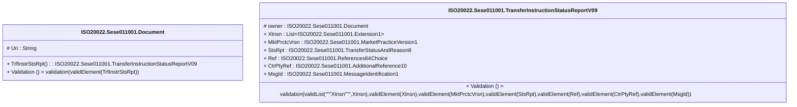

# sese.011.001.09-physical

> The tables below contain descriptions of the members of each Element. 
> The first column indicates the type of the member:
> A ‘#’ indicates that the field is a key to the element, and a ‘+’ indicates that the field is a value.
> The ‘*’ column contains a description for the element member.  
> The ‘@’ column contains any properties for the member.
> The ‘=’ column contains calculated values; or in the case of an enum, the serialized value.

---

## EntityImpl ISO20022.Sese011001.Document

| |Name|Type|*|@|=|
|-|-|-|-|-|-|
|#|Uri|String||XmlIgnore(), JsonIgnore()||
|+|TrfInstrStsRpt|ISO20022.Sese011001.TransferInstructionStatusReportV09||XmlElement()||
||Validation|Some(String)||XmlIgnore(), JsonIgnore()|validation(validElement(TrfInstrStsRpt))|

---

## AspectImpl ISO20022.Sese011001.TransferInstructionStatusReportV09

| |Name|Type|*|@|=|
|-|-|-|-|-|-|
|#|owner|ISO20022.Sese011001.Document||||
|+|Xtnsn|List<ISO20022.Sese011001.Extension1>||XmlElement()||
|+|MktPrctcVrsn|ISO20022.Sese011001.MarketPracticeVersion1||XmlElement()||
|+|StsRpt|ISO20022.Sese011001.TransferStatusAndReason8||XmlElement()||
|+|Ref|ISO20022.Sese011001.References64Choice||XmlElement()||
|+|CtrPtyRef|ISO20022.Sese011001.AdditionalReference10||XmlElement()||
|+|MsgId|ISO20022.Sese011001.MessageIdentification1||XmlElement()||
||Validation|Some(String)||XmlIgnore(), JsonIgnore()|validation(validList("""Xtnsn""",Xtnsn),validElement(Xtnsn),validElement(MktPrctcVrsn),validElement(StsRpt),validElement(Ref),validElement(CtrPtyRef),validElement(MsgId))|

