# sese.018.001.09-physical

```mermaid
classDiagram
    class ISO20022.Sese018001.Document {
        # Uri  : String
        + AcctHldgInf () : ISO20022.Sese018001.AccountHoldingInformationV09
        + Validation () = validation(validElement(AcctHldgInf))
    }
    class ISO20022.Sese018001.AccountHoldingInformationV09 {
        # owner  : ISO20022.Sese018001.Document
        + Xtnsn  : List~ISO20022.Sese018001.Extension1~
        + MktPrctcVrsn  : ISO20022.Sese018001.MarketPracticeVersion1
        + PdctTrf  : List~ISO20022.Sese018001.PortfolioTransfer9~
        + Trfee  : ISO20022.Sese018001.PartyIdentification132
        + NmneeAcct  : ISO20022.Sese018001.InvestmentAccount69
        + TrfrAcct  : ISO20022.Sese018001.InvestmentAccount69
        + OthrCorpInvstr  : List~ISO20022.Sese018001.Organisation36~
        + ScndryCorpInvstr  : ISO20022.Sese018001.Organisation36
        + PmryCorpInvstr  : ISO20022.Sese018001.Organisation36
        + OthrIndvInvstr  : List~ISO20022.Sese018001.IndividualPerson8~
        + ScndryIndvInvstr  : ISO20022.Sese018001.IndividualPerson8
        + PmryIndvInvstr  : ISO20022.Sese018001.IndividualPerson8
        + BizFlowDrctnTp  : String
        + RltdRef  : ISO20022.Sese018001.AdditionalReference10
        + PrvsRef  : ISO20022.Sese018001.AdditionalReference10
        + PoolRef  : ISO20022.Sese018001.AdditionalReference11
        + MsgRef  : ISO20022.Sese018001.MessageIdentification1
        + Validation () = validation(validList("""Xtnsn""",Xtnsn),validElement(Xtnsn),validElement(MktPrctcVrsn),validRequired("""PdctTrf""",PdctTrf),validList("""PdctTrf""",PdctTrf),validElement(PdctTrf),validElement(Trfee),validElement(NmneeAcct),validElement(TrfrAcct),validList("""OthrCorpInvstr""",OthrCorpInvstr),validElement(OthrCorpInvstr),validElement(ScndryCorpInvstr),validElement(PmryCorpInvstr),validList("""OthrIndvInvstr""",OthrIndvInvstr),validElement(OthrIndvInvstr),validElement(ScndryIndvInvstr),validElement(PmryIndvInvstr),validElement(RltdRef),validElement(PrvsRef),validElement(PoolRef),validElement(MsgRef))
    }
```

> The tables below contain descriptions of the members of each Element. 
> The first column indicates the type of the member:
> A ‘#’ indicates that the field is a key to the element, and a ‘+’ indicates that the field is a value.
> The ‘*’ column contains a description for the element member.  
> The ‘@’ column contains any properties for the member.
> The ‘=’ column contains calculated values; or in the case of an enum, the serialized value.

---

## EntityImpl ISO20022.Sese018001.Document

| |Name|Type|*|@|=|
|-|-|-|-|-|-|
|#|Uri|String||XmlIgnore(), JsonIgnore()||
|+|AcctHldgInf|ISO20022.Sese018001.AccountHoldingInformationV09||XmlElement()||
||Validation|Some(String)||XmlIgnore(), JsonIgnore()|validation(validElement(AcctHldgInf))|

---

## AspectImpl ISO20022.Sese018001.AccountHoldingInformationV09

| |Name|Type|*|@|=|
|-|-|-|-|-|-|
|#|owner|ISO20022.Sese018001.Document||||
|+|Xtnsn|List<ISO20022.Sese018001.Extension1>||XmlElement()||
|+|MktPrctcVrsn|ISO20022.Sese018001.MarketPracticeVersion1||XmlElement()||
|+|PdctTrf|List<ISO20022.Sese018001.PortfolioTransfer9>||XmlElement()||
|+|Trfee|ISO20022.Sese018001.PartyIdentification132||XmlElement()||
|+|NmneeAcct|ISO20022.Sese018001.InvestmentAccount69||XmlElement()||
|+|TrfrAcct|ISO20022.Sese018001.InvestmentAccount69||XmlElement()||
|+|OthrCorpInvstr|List<ISO20022.Sese018001.Organisation36>||XmlElement()||
|+|ScndryCorpInvstr|ISO20022.Sese018001.Organisation36||XmlElement()||
|+|PmryCorpInvstr|ISO20022.Sese018001.Organisation36||XmlElement()||
|+|OthrIndvInvstr|List<ISO20022.Sese018001.IndividualPerson8>||XmlElement()||
|+|ScndryIndvInvstr|ISO20022.Sese018001.IndividualPerson8||XmlElement()||
|+|PmryIndvInvstr|ISO20022.Sese018001.IndividualPerson8||XmlElement()||
|+|BizFlowDrctnTp|String||XmlElement()||
|+|RltdRef|ISO20022.Sese018001.AdditionalReference10||XmlElement()||
|+|PrvsRef|ISO20022.Sese018001.AdditionalReference10||XmlElement()||
|+|PoolRef|ISO20022.Sese018001.AdditionalReference11||XmlElement()||
|+|MsgRef|ISO20022.Sese018001.MessageIdentification1||XmlElement()||
||Validation|Some(String)||XmlIgnore(), JsonIgnore()|validation(validList("""Xtnsn""",Xtnsn),validElement(Xtnsn),validElement(MktPrctcVrsn),validRequired("""PdctTrf""",PdctTrf),validList("""PdctTrf""",PdctTrf),validElement(PdctTrf),validElement(Trfee),validElement(NmneeAcct),validElement(TrfrAcct),validList("""OthrCorpInvstr""",OthrCorpInvstr),validElement(OthrCorpInvstr),validElement(ScndryCorpInvstr),validElement(PmryCorpInvstr),validList("""OthrIndvInvstr""",OthrIndvInvstr),validElement(OthrIndvInvstr),validElement(ScndryIndvInvstr),validElement(PmryIndvInvstr),validElement(RltdRef),validElement(PrvsRef),validElement(PoolRef),validElement(MsgRef))|

