# sese.021.001.07

```mermaid
classDiagram
    class Hiperspace.Edge {
        # From  : Hiperspace.Node
        # To  : Hiperspace.Node
        # TypeName  : String
        + Name  : String
    }
    class ISO20022.Sese021001.BlockChainAddressWallet3 {
        + Nm  : String
        + Tp  : ISO20022.Sese021001.GenericIdentification30
        + Id  : String
    }
    ISO20022.Sese021001.BlockChainAddressWallet3 *-- ISO20022.Sese021001.GenericIdentification30
    class ISO20022.Sese021001.DocumentNumber20 {
        + Refs  : global::System.Collections.Generic.List~ISO20022.Sese021001.Identification30~
        + Nb  : ISO20022.Sese021001.DocumentNumber5Choice
    }
    ISO20022.Sese021001.DocumentNumber20 *-- ISO20022.Sese021001.Identification30
    ISO20022.Sese021001.DocumentNumber20 *-- ISO20022.Sese021001.DocumentNumber5Choice
    class ISO20022.Sese021001.DocumentNumber5Choice {
        + PrtryNb  : ISO20022.Sese021001.GenericIdentification36
        + LngNb  : String
        + ShrtNb  : String
    }
    ISO20022.Sese021001.DocumentNumber5Choice *-- ISO20022.Sese021001.GenericIdentification36
    class ISO20022.Sese021001.GenericIdentification30 {
        + SchmeNm  : String
        + Issr  : String
        + Id  : String
    }
    class ISO20022.Sese021001.GenericIdentification36 {
        + SchmeNm  : String
        + Issr  : String
        + Id  : String
    }
    class ISO20022.Sese021001.Identification30 {
        + CorpActnEvtId  : String
        + PoolId  : String
        + PrgmId  : String
        + ListId  : String
        + IndxId  : String
        + BsktId  : String
        + MstrId  : String
        + UnqTxIdr  : String
        + TradId  : String
        + CmonId  : String
        + PrcrTxId  : String
        + CtrPtyMktInfrstrctrTxId  : String
        + MktInfrstrctrTxId  : String
        + AcctSvcrTxId  : String
        + AcctOwnrTxId  : String
    }
    class ISO20022.Sese021001.PartyIdentification127Choice {
        + PrtryId  : ISO20022.Sese021001.GenericIdentification36
        + AnyBIC  : String
    }
    ISO20022.Sese021001.PartyIdentification127Choice *-- ISO20022.Sese021001.GenericIdentification36
    class ISO20022.Sese021001.PartyIdentification144 {
        + LEI  : String
        + Id  : ISO20022.Sese021001.PartyIdentification127Choice
    }
    ISO20022.Sese021001.PartyIdentification144 *-- ISO20022.Sese021001.PartyIdentification127Choice
    class ISO20022.Sese021001.SecuritiesAccount22 {
        + Nm  : String
        + Tp  : ISO20022.Sese021001.GenericIdentification30
        + Id  : String
    }
    ISO20022.Sese021001.SecuritiesAccount22 *-- ISO20022.Sese021001.GenericIdentification30
    class ISO20022.Sese021001.SecuritiesTransactionStatusQueryV07 {
        + SplmtryData  : global::System.Collections.Generic.List~ISO20022.Sese021001.SupplementaryData1~
        + BlckChainAdrOrWllt  : ISO20022.Sese021001.BlockChainAddressWallet3
        + SfkpgAcct  : ISO20022.Sese021001.SecuritiesAccount22
        + AcctOwnr  : ISO20022.Sese021001.PartyIdentification144
        + StsAdvcReqd  : ISO20022.Sese021001.DocumentNumber20
    }
    ISO20022.Sese021001.SecuritiesTransactionStatusQueryV07 *-- ISO20022.Sese021001.SupplementaryData1
    ISO20022.Sese021001.SecuritiesTransactionStatusQueryV07 *-- ISO20022.Sese021001.BlockChainAddressWallet3
    ISO20022.Sese021001.SecuritiesTransactionStatusQueryV07 *-- ISO20022.Sese021001.SecuritiesAccount22
    ISO20022.Sese021001.SecuritiesTransactionStatusQueryV07 *-- ISO20022.Sese021001.PartyIdentification144
    ISO20022.Sese021001.SecuritiesTransactionStatusQueryV07 *-- ISO20022.Sese021001.DocumentNumber20
    class ISO20022.Sese021001.SupplementaryData1 {
        + Envlp  : ISO20022.Sese021001.SupplementaryDataEnvelope1
        + PlcAndNm  : String
    }
    ISO20022.Sese021001.SupplementaryData1 *-- ISO20022.Sese021001.SupplementaryDataEnvelope1
    class ISO20022.Sese021001.SupplementaryDataEnvelope1 {
    }
    class Hiperspace.Node {
        # SKey  : String
        + TypeName  : String
        + Name  : String
        + Froms (From = this) : Hiperspace.Edge
        + Tos (To = this) : Hiperspace.Edge
    }
```

> The tables below contain descriptions of the members of each Element. 
> The first column indicates the type of the member:
> A ‘#’ indicates that the field is a key to the element, and a ‘+’ indicates that the field is a value.
> The ‘*’ column contains a description for the element member.  
> The ‘@’ column contains any properties for the member.
> The ‘=’ column contains calculated values; or in the case of an enum, the serialized value.

---

## View Hiperspace.Edge
edge between nodes

| |Name|Type|*|@|=|
|-|-|-|-|-|-|
|#|From|Hiperspace.Node||||
|#|To|Hiperspace.Node||||
|#|TypeName|String||||
|+|Name|String||||

---

## Value ISO20022.Sese021001.BlockChainAddressWallet3

| |Name|Type|*|@|=|
|-|-|-|-|-|-|
|+|Nm|String||XmlElement()||
|+|Tp|ISO20022.Sese021001.GenericIdentification30||XmlElement()||
|+|Id|String||XmlElement()||
||Validation|Some(String)||XmlIgnore(), JsonIgnore()|validation(validElement(Tp))|

---

## Type ISO20022.Sese021001.Document

| |Name|Type|*|@|=|
|-|-|-|-|-|-|
|+|SctiesTxStsQry|ISO20022.Sese021001.SecuritiesTransactionStatusQueryV07||XmlElement()||
||Validation|Some(String)||XmlIgnore(), JsonIgnore()|validation(validElement(SctiesTxStsQry))|

---

## Value ISO20022.Sese021001.DocumentNumber20

| |Name|Type|*|@|=|
|-|-|-|-|-|-|
|+|Refs|global::System.Collections.Generic.List<ISO20022.Sese021001.Identification30>||XmlElement()||
|+|Nb|ISO20022.Sese021001.DocumentNumber5Choice||XmlElement()||
||Validation|Some(String)||XmlIgnore(), JsonIgnore()|validation(validRequired("""Refs""",Refs),validList("""Refs""",Refs),validElement(Refs),validElement(Nb))|

---

## Value ISO20022.Sese021001.DocumentNumber5Choice

| |Name|Type|*|@|=|
|-|-|-|-|-|-|
|+|PrtryNb|ISO20022.Sese021001.GenericIdentification36||XmlElement()||
|+|LngNb|String||XmlElement()||
|+|ShrtNb|String||XmlElement()||
||Validation|Some(String)||XmlIgnore(), JsonIgnore()|validation(validElement(PrtryNb),validPattern("""LngNb""",LngNb,"""[a-z]{4}\.[0-9]{3}\.[0-9]{3}\.[0-9]{2}"""),validPattern("""ShrtNb""",ShrtNb,"""[0-9]{3}"""),validChoice(PrtryNb,LngNb,ShrtNb))|

---

## Value ISO20022.Sese021001.GenericIdentification30

| |Name|Type|*|@|=|
|-|-|-|-|-|-|
|+|SchmeNm|String||XmlElement()||
|+|Issr|String||XmlElement()||
|+|Id|String||XmlElement()||
||Validation|Some(String)||XmlIgnore(), JsonIgnore()|validation(validPattern("""Id""",Id,"""[a-zA-Z0-9]{4}"""))|

---

## Value ISO20022.Sese021001.GenericIdentification36

| |Name|Type|*|@|=|
|-|-|-|-|-|-|
|+|SchmeNm|String||XmlElement()||
|+|Issr|String||XmlElement()||
|+|Id|String||XmlElement()||
||Validation|Some(String)||XmlIgnore(), JsonIgnore()|""|

---

## Value ISO20022.Sese021001.Identification30

| |Name|Type|*|@|=|
|-|-|-|-|-|-|
|+|CorpActnEvtId|String||XmlElement()||
|+|PoolId|String||XmlElement()||
|+|PrgmId|String||XmlElement()||
|+|ListId|String||XmlElement()||
|+|IndxId|String||XmlElement()||
|+|BsktId|String||XmlElement()||
|+|MstrId|String||XmlElement()||
|+|UnqTxIdr|String||XmlElement()||
|+|TradId|String||XmlElement()||
|+|CmonId|String||XmlElement()||
|+|PrcrTxId|String||XmlElement()||
|+|CtrPtyMktInfrstrctrTxId|String||XmlElement()||
|+|MktInfrstrctrTxId|String||XmlElement()||
|+|AcctSvcrTxId|String||XmlElement()||
|+|AcctOwnrTxId|String||XmlElement()||
||Validation|Some(String)||XmlIgnore(), JsonIgnore()|validation(validPattern("""UnqTxIdr""",UnqTxIdr,"""[A-Z0-9]{18}[0-9]{2}[A-Z0-9]{0,32}"""))|

---

## Value ISO20022.Sese021001.PartyIdentification127Choice

| |Name|Type|*|@|=|
|-|-|-|-|-|-|
|+|PrtryId|ISO20022.Sese021001.GenericIdentification36||XmlElement()||
|+|AnyBIC|String||XmlElement()||
||Validation|Some(String)||XmlIgnore(), JsonIgnore()|validation(validElement(PrtryId),validPattern("""AnyBIC""",AnyBIC,"""[A-Z0-9]{4,4}[A-Z]{2,2}[A-Z0-9]{2,2}([A-Z0-9]{3,3}){0,1}"""),validChoice(PrtryId,AnyBIC))|

---

## Value ISO20022.Sese021001.PartyIdentification144

| |Name|Type|*|@|=|
|-|-|-|-|-|-|
|+|LEI|String||XmlElement()||
|+|Id|ISO20022.Sese021001.PartyIdentification127Choice||XmlElement()||
||Validation|Some(String)||XmlIgnore(), JsonIgnore()|validation(validPattern("""LEI""",LEI,"""[A-Z0-9]{18,18}[0-9]{2,2}"""),validElement(Id))|

---

## Value ISO20022.Sese021001.SecuritiesAccount22

| |Name|Type|*|@|=|
|-|-|-|-|-|-|
|+|Nm|String||XmlElement()||
|+|Tp|ISO20022.Sese021001.GenericIdentification30||XmlElement()||
|+|Id|String||XmlElement()||
||Validation|Some(String)||XmlIgnore(), JsonIgnore()|validation(validElement(Tp))|

---

## Aspect ISO20022.Sese021001.SecuritiesTransactionStatusQueryV07

| |Name|Type|*|@|=|
|-|-|-|-|-|-|
|+|SplmtryData|global::System.Collections.Generic.List<ISO20022.Sese021001.SupplementaryData1>||XmlElement()||
|+|BlckChainAdrOrWllt|ISO20022.Sese021001.BlockChainAddressWallet3||XmlElement()||
|+|SfkpgAcct|ISO20022.Sese021001.SecuritiesAccount22||XmlElement()||
|+|AcctOwnr|ISO20022.Sese021001.PartyIdentification144||XmlElement()||
|+|StsAdvcReqd|ISO20022.Sese021001.DocumentNumber20||XmlElement()||
||Validation|Some(String)||XmlIgnore(), JsonIgnore()|validation(validList("""SplmtryData""",SplmtryData),validElement(SplmtryData),validElement(BlckChainAdrOrWllt),validElement(SfkpgAcct),validElement(AcctOwnr),validElement(StsAdvcReqd))|

---

## Value ISO20022.Sese021001.SupplementaryData1

| |Name|Type|*|@|=|
|-|-|-|-|-|-|
|+|Envlp|ISO20022.Sese021001.SupplementaryDataEnvelope1||XmlElement()||
|+|PlcAndNm|String||XmlElement()||
||Validation|Some(String)||XmlIgnore(), JsonIgnore()|validation(validElement(Envlp))|

---

## Value ISO20022.Sese021001.SupplementaryDataEnvelope1

| |Name|Type|*|@|=|
|-|-|-|-|-|-|
||Validation|Some(String)||XmlIgnore(), JsonIgnore()|""|

---

## View Hiperspace.Node
node in a graph view of data

| |Name|Type|*|@|=|
|-|-|-|-|-|-|
|#|SKey|String||||
|+|TypeName|String||||
|+|Name|String||||
||Froms|Hiperspace.Edge|||From = this|
||Tos|Hiperspace.Edge|||To = this|

