# sese.021.002.06

```mermaid
classDiagram
    class Hiperspace.Edge {
        # From  : Hiperspace.Node
        # To  : Hiperspace.Node
        # TypeName  : String
        + Name  : String
    }
    class ISO20022.Sese021002.BlockChainAddressWallet7 {
        + Nm  : String
        + Tp  : ISO20022.Sese021002.GenericIdentification47
        + Id  : String
    }
    ISO20022.Sese021002.BlockChainAddressWallet7 *-- ISO20022.Sese021002.GenericIdentification47
    class ISO20022.Sese021002.DocumentNumber19 {
        + Refs  : global::System.Collections.Generic.List~ISO20022.Sese021002.Identification29~
        + Nb  : ISO20022.Sese021002.DocumentNumber6Choice
    }
    ISO20022.Sese021002.DocumentNumber19 *-- ISO20022.Sese021002.Identification29
    ISO20022.Sese021002.DocumentNumber19 *-- ISO20022.Sese021002.DocumentNumber6Choice
    class ISO20022.Sese021002.DocumentNumber6Choice {
        + PrtryNb  : ISO20022.Sese021002.GenericIdentification86
        + LngNb  : String
        + ShrtNb  : String
    }
    ISO20022.Sese021002.DocumentNumber6Choice *-- ISO20022.Sese021002.GenericIdentification86
    class ISO20022.Sese021002.GenericIdentification47 {
        + SchmeNm  : String
        + Issr  : String
        + Id  : String
    }
    class ISO20022.Sese021002.GenericIdentification84 {
        + SchmeNm  : String
        + Issr  : String
        + Id  : String
    }
    class ISO20022.Sese021002.GenericIdentification86 {
        + SchmeNm  : String
        + Issr  : String
        + Id  : String
    }
    class ISO20022.Sese021002.Identification29 {
        + CorpActnEvtId  : String
        + PoolId  : String
        + PrgmId  : String
        + ListId  : String
        + IndxId  : String
        + BsktId  : String
        + MstrId  : String
        + TradId  : global::System.Collections.Generic.List~String~
        + CmonId  : String
        + PrcrTxId  : String
        + CtrPtyMktInfrstrctrTxId  : String
        + MktInfrstrctrTxId  : String
        + AcctSvcrTxId  : String
        + AcctOwnrTxId  : String
    }
    class ISO20022.Sese021002.PartyIdentification136Choice {
        + PrtryId  : ISO20022.Sese021002.GenericIdentification84
        + AnyBIC  : String
    }
    ISO20022.Sese021002.PartyIdentification136Choice *-- ISO20022.Sese021002.GenericIdentification84
    class ISO20022.Sese021002.PartyIdentification156 {
        + LEI  : String
        + Id  : ISO20022.Sese021002.PartyIdentification136Choice
    }
    ISO20022.Sese021002.PartyIdentification156 *-- ISO20022.Sese021002.PartyIdentification136Choice
    class ISO20022.Sese021002.SecuritiesAccount37 {
        + Nm  : String
        + Tp  : ISO20022.Sese021002.GenericIdentification47
        + Id  : String
    }
    ISO20022.Sese021002.SecuritiesAccount37 *-- ISO20022.Sese021002.GenericIdentification47
    class ISO20022.Sese021002.SecuritiesTransactionStatusQuery002V06 {
        + SplmtryData  : global::System.Collections.Generic.List~ISO20022.Sese021002.SupplementaryData1~
        + BlckChainAdrOrWllt  : ISO20022.Sese021002.BlockChainAddressWallet7
        + SfkpgAcct  : ISO20022.Sese021002.SecuritiesAccount37
        + AcctOwnr  : ISO20022.Sese021002.PartyIdentification156
        + StsAdvcReqd  : ISO20022.Sese021002.DocumentNumber19
    }
    ISO20022.Sese021002.SecuritiesTransactionStatusQuery002V06 *-- ISO20022.Sese021002.SupplementaryData1
    ISO20022.Sese021002.SecuritiesTransactionStatusQuery002V06 *-- ISO20022.Sese021002.BlockChainAddressWallet7
    ISO20022.Sese021002.SecuritiesTransactionStatusQuery002V06 *-- ISO20022.Sese021002.SecuritiesAccount37
    ISO20022.Sese021002.SecuritiesTransactionStatusQuery002V06 *-- ISO20022.Sese021002.PartyIdentification156
    ISO20022.Sese021002.SecuritiesTransactionStatusQuery002V06 *-- ISO20022.Sese021002.DocumentNumber19
    class ISO20022.Sese021002.SupplementaryData1 {
        + Envlp  : ISO20022.Sese021002.SupplementaryDataEnvelope1
        + PlcAndNm  : String
    }
    ISO20022.Sese021002.SupplementaryData1 *-- ISO20022.Sese021002.SupplementaryDataEnvelope1
    class ISO20022.Sese021002.SupplementaryDataEnvelope1 {
    }
    class Hiperspace.Node {
        # SKey  : String
        + TypeName  : String
        + Name  : String
        + Froms (From = this) : Hiperspace.Edge
        + Tos (To = this) : Hiperspace.Edge
    }
```

> The tables below contain descriptions of the members of each Element. 
> The first column indicates the type of the member:
> A ‘#’ indicates that the field is a key to the element, and a ‘+’ indicates that the field is a value.
> The ‘*’ column contains a description for the element member.  
> The ‘@’ column contains any properties for the member.
> The ‘=’ column contains calculated values; or in the case of an enum, the serialized value.

---

## View Hiperspace.Edge
edge between nodes

| |Name|Type|*|@|=|
|-|-|-|-|-|-|
|#|From|Hiperspace.Node||||
|#|To|Hiperspace.Node||||
|#|TypeName|String||||
|+|Name|String||||

---

## Value ISO20022.Sese021002.BlockChainAddressWallet7

| |Name|Type|*|@|=|
|-|-|-|-|-|-|
|+|Nm|String||XmlElement()||
|+|Tp|ISO20022.Sese021002.GenericIdentification47||XmlElement()||
|+|Id|String||XmlElement()||
||Validation|Some(String)||XmlIgnore(), JsonIgnore()|validation(validPattern("""Nm""",Nm,"""[0-9a-zA-Z/\-\?:\(\)\.\n\r,'\+ ]{1,70}"""),validElement(Tp),validPattern("""Id""",Id,"""[0-9a-zA-Z/\-\?:\(\)\.\n\r,'\+ ]{1,140}"""))|

---

## Type ISO20022.Sese021002.Document

| |Name|Type|*|@|=|
|-|-|-|-|-|-|
|+|SctiesTxStsQry|ISO20022.Sese021002.SecuritiesTransactionStatusQuery002V06||XmlElement()||
||Validation|Some(String)||XmlIgnore(), JsonIgnore()|validation(validElement(SctiesTxStsQry))|

---

## Value ISO20022.Sese021002.DocumentNumber19

| |Name|Type|*|@|=|
|-|-|-|-|-|-|
|+|Refs|global::System.Collections.Generic.List<ISO20022.Sese021002.Identification29>||XmlElement()||
|+|Nb|ISO20022.Sese021002.DocumentNumber6Choice||XmlElement()||
||Validation|Some(String)||XmlIgnore(), JsonIgnore()|validation(validRequired("""Refs""",Refs),validList("""Refs""",Refs),validElement(Refs),validElement(Nb))|

---

## Value ISO20022.Sese021002.DocumentNumber6Choice

| |Name|Type|*|@|=|
|-|-|-|-|-|-|
|+|PrtryNb|ISO20022.Sese021002.GenericIdentification86||XmlElement()||
|+|LngNb|String||XmlElement()||
|+|ShrtNb|String||XmlElement()||
||Validation|Some(String)||XmlIgnore(), JsonIgnore()|validation(validElement(PrtryNb),validPattern("""LngNb""",LngNb,"""[a-z]{4}\.[0-9]{3}\.[0-9]{3}\.[0-9]{2}"""),validPattern("""ShrtNb""",ShrtNb,"""[0-9]{3}"""),validChoice(PrtryNb,LngNb,ShrtNb))|

---

## Value ISO20022.Sese021002.GenericIdentification47

| |Name|Type|*|@|=|
|-|-|-|-|-|-|
|+|SchmeNm|String||XmlElement()||
|+|Issr|String||XmlElement()||
|+|Id|String||XmlElement()||
||Validation|Some(String)||XmlIgnore(), JsonIgnore()|validation(validPattern("""SchmeNm""",SchmeNm,"""[a-zA-Z0-9]{1,4}"""),validPattern("""Issr""",Issr,"""[a-zA-Z0-9]{1,4}"""),validPattern("""Id""",Id,"""[a-zA-Z0-9]{4}"""))|

---

## Value ISO20022.Sese021002.GenericIdentification84

| |Name|Type|*|@|=|
|-|-|-|-|-|-|
|+|SchmeNm|String||XmlElement()||
|+|Issr|String||XmlElement()||
|+|Id|String||XmlElement()||
||Validation|Some(String)||XmlIgnore(), JsonIgnore()|validation(validPattern("""SchmeNm""",SchmeNm,"""[a-zA-Z0-9]{1,4}"""),validPattern("""Issr""",Issr,"""[a-zA-Z0-9]{1,4}"""),validPattern("""Id""",Id,"""([0-9a-zA-Z\-\?:\(\)\.,'\+ ]([0-9a-zA-Z\-\?:\(\)\.,'\+ ]*(/[0-9a-zA-Z\-\?:\(\)\.,'\+ ])?)*)"""))|

---

## Value ISO20022.Sese021002.GenericIdentification86

| |Name|Type|*|@|=|
|-|-|-|-|-|-|
|+|SchmeNm|String||XmlElement()||
|+|Issr|String||XmlElement()||
|+|Id|String||XmlElement()||
||Validation|Some(String)||XmlIgnore(), JsonIgnore()|validation(validPattern("""SchmeNm""",SchmeNm,"""[a-zA-Z0-9]{1,4}"""),validPattern("""Issr""",Issr,"""[a-zA-Z0-9]{1,4}"""),validPattern("""Id""",Id,"""([0-9a-zA-Z\-\?:\(\)\.,'\+ ]([0-9a-zA-Z\-\?:\(\)\.,'\+ ]*(/[0-9a-zA-Z\-\?:\(\)\.,'\+ ])?)*)"""))|

---

## Value ISO20022.Sese021002.Identification29

| |Name|Type|*|@|=|
|-|-|-|-|-|-|
|+|CorpActnEvtId|String||XmlElement()||
|+|PoolId|String||XmlElement()||
|+|PrgmId|String||XmlElement()||
|+|ListId|String||XmlElement()||
|+|IndxId|String||XmlElement()||
|+|BsktId|String||XmlElement()||
|+|MstrId|String||XmlElement()||
|+|TradId|global::System.Collections.Generic.List<String>||XmlElement()||
|+|CmonId|String||XmlElement()||
|+|PrcrTxId|String||XmlElement()||
|+|CtrPtyMktInfrstrctrTxId|String||XmlElement()||
|+|MktInfrstrctrTxId|String||XmlElement()||
|+|AcctSvcrTxId|String||XmlElement()||
|+|AcctOwnrTxId|String||XmlElement()||
||Validation|Some(String)||XmlIgnore(), JsonIgnore()|validation(validPattern("""CorpActnEvtId""",CorpActnEvtId,"""([0-9a-zA-Z\-\?:\(\)\.,'\+ ]([0-9a-zA-Z\-\?:\(\)\.,'\+ ]*(/[0-9a-zA-Z\-\?:\(\)\.,'\+ ])?)*)"""),validPattern("""PoolId""",PoolId,"""([0-9a-zA-Z\-\?:\(\)\.,'\+ ]([0-9a-zA-Z\-\?:\(\)\.,'\+ ]*(/[0-9a-zA-Z\-\?:\(\)\.,'\+ ])?)*)"""),validPattern("""PrgmId""",PrgmId,"""([0-9a-zA-Z\-\?:\(\)\.,'\+ ]([0-9a-zA-Z\-\?:\(\)\.,'\+ ]*(/[0-9a-zA-Z\-\?:\(\)\.,'\+ ])?)*)"""),validPattern("""ListId""",ListId,"""([0-9a-zA-Z\-\?:\(\)\.,'\+ ]([0-9a-zA-Z\-\?:\(\)\.,'\+ ]*(/[0-9a-zA-Z\-\?:\(\)\.,'\+ ])?)*)"""),validPattern("""IndxId""",IndxId,"""([0-9a-zA-Z\-\?:\(\)\.,'\+ ]([0-9a-zA-Z\-\?:\(\)\.,'\+ ]*(/[0-9a-zA-Z\-\?:\(\)\.,'\+ ])?)*)"""),validPattern("""BsktId""",BsktId,"""([0-9a-zA-Z\-\?:\(\)\.,'\+ ]([0-9a-zA-Z\-\?:\(\)\.,'\+ ]*(/[0-9a-zA-Z\-\?:\(\)\.,'\+ ])?)*)"""),validPattern("""MstrId""",MstrId,"""([0-9a-zA-Z\-\?:\(\)\.,'\+ ]([0-9a-zA-Z\-\?:\(\)\.,'\+ ]*(/[0-9a-zA-Z\-\?:\(\)\.,'\+ ])?)*)"""),validPattern("""TradId""",TradId,"""[0-9a-zA-Z/\-\?:\(\)\.,'\+ ]{1,52}"""),validPattern("""CmonId""",CmonId,"""([0-9a-zA-Z\-\?:\(\)\.,'\+ ]([0-9a-zA-Z\-\?:\(\)\.,'\+ ]*(/[0-9a-zA-Z\-\?:\(\)\.,'\+ ])?)*)"""),validPattern("""PrcrTxId""",PrcrTxId,"""([0-9a-zA-Z\-\?:\(\)\.,'\+ ]([0-9a-zA-Z\-\?:\(\)\.,'\+ ]*(/[0-9a-zA-Z\-\?:\(\)\.,'\+ ])?)*)"""),validPattern("""CtrPtyMktInfrstrctrTxId""",CtrPtyMktInfrstrctrTxId,"""([0-9a-zA-Z\-\?:\(\)\.,'\+ ]([0-9a-zA-Z\-\?:\(\)\.,'\+ ]*(/[0-9a-zA-Z\-\?:\(\)\.,'\+ ])?)*)"""),validPattern("""MktInfrstrctrTxId""",MktInfrstrctrTxId,"""([0-9a-zA-Z\-\?:\(\)\.,'\+ ]([0-9a-zA-Z\-\?:\(\)\.,'\+ ]*(/[0-9a-zA-Z\-\?:\(\)\.,'\+ ])?)*)"""),validPattern("""AcctSvcrTxId""",AcctSvcrTxId,"""([0-9a-zA-Z\-\?:\(\)\.,'\+ ]([0-9a-zA-Z\-\?:\(\)\.,'\+ ]*(/[0-9a-zA-Z\-\?:\(\)\.,'\+ ])?)*)"""),validPattern("""AcctOwnrTxId""",AcctOwnrTxId,"""([0-9a-zA-Z\-\?:\(\)\.,'\+ ]([0-9a-zA-Z\-\?:\(\)\.,'\+ ]*(/[0-9a-zA-Z\-\?:\(\)\.,'\+ ])?)*)"""))|

---

## Value ISO20022.Sese021002.PartyIdentification136Choice

| |Name|Type|*|@|=|
|-|-|-|-|-|-|
|+|PrtryId|ISO20022.Sese021002.GenericIdentification84||XmlElement()||
|+|AnyBIC|String||XmlElement()||
||Validation|Some(String)||XmlIgnore(), JsonIgnore()|validation(validElement(PrtryId),validPattern("""AnyBIC""",AnyBIC,"""[A-Z0-9]{4,4}[A-Z]{2,2}[A-Z0-9]{2,2}([A-Z0-9]{3,3}){0,1}"""),validChoice(PrtryId,AnyBIC))|

---

## Value ISO20022.Sese021002.PartyIdentification156

| |Name|Type|*|@|=|
|-|-|-|-|-|-|
|+|LEI|String||XmlElement()||
|+|Id|ISO20022.Sese021002.PartyIdentification136Choice||XmlElement()||
||Validation|Some(String)||XmlIgnore(), JsonIgnore()|validation(validPattern("""LEI""",LEI,"""[A-Z0-9]{18,18}[0-9]{2,2}"""),validElement(Id))|

---

## Value ISO20022.Sese021002.SecuritiesAccount37

| |Name|Type|*|@|=|
|-|-|-|-|-|-|
|+|Nm|String||XmlElement()||
|+|Tp|ISO20022.Sese021002.GenericIdentification47||XmlElement()||
|+|Id|String||XmlElement()||
||Validation|Some(String)||XmlIgnore(), JsonIgnore()|validation(validElement(Tp),validPattern("""Id""",Id,"""[0-9a-zA-Z/\-\?:\(\)\.,'\+ ]{1,35}"""))|

---

## Aspect ISO20022.Sese021002.SecuritiesTransactionStatusQuery002V06

| |Name|Type|*|@|=|
|-|-|-|-|-|-|
|+|SplmtryData|global::System.Collections.Generic.List<ISO20022.Sese021002.SupplementaryData1>||XmlElement()||
|+|BlckChainAdrOrWllt|ISO20022.Sese021002.BlockChainAddressWallet7||XmlElement()||
|+|SfkpgAcct|ISO20022.Sese021002.SecuritiesAccount37||XmlElement()||
|+|AcctOwnr|ISO20022.Sese021002.PartyIdentification156||XmlElement()||
|+|StsAdvcReqd|ISO20022.Sese021002.DocumentNumber19||XmlElement()||
||Validation|Some(String)||XmlIgnore(), JsonIgnore()|validation(validList("""SplmtryData""",SplmtryData),validElement(SplmtryData),validElement(BlckChainAdrOrWllt),validElement(SfkpgAcct),validElement(AcctOwnr),validElement(StsAdvcReqd))|

---

## Value ISO20022.Sese021002.SupplementaryData1

| |Name|Type|*|@|=|
|-|-|-|-|-|-|
|+|Envlp|ISO20022.Sese021002.SupplementaryDataEnvelope1||XmlElement()||
|+|PlcAndNm|String||XmlElement()||
||Validation|Some(String)||XmlIgnore(), JsonIgnore()|validation(validElement(Envlp))|

---

## Value ISO20022.Sese021002.SupplementaryDataEnvelope1

| |Name|Type|*|@|=|
|-|-|-|-|-|-|
||Validation|Some(String)||XmlIgnore(), JsonIgnore()|""|

---

## View Hiperspace.Node
node in a graph view of data

| |Name|Type|*|@|=|
|-|-|-|-|-|-|
|#|SKey|String||||
|+|TypeName|String||||
|+|Name|String||||
||Froms|Hiperspace.Edge|||From = this|
||Tos|Hiperspace.Edge|||To = this|

