# sese.022.001.07

```mermaid
classDiagram
    class Hiperspace.Edge {
        # From  : Hiperspace.Node
        # To  : Hiperspace.Node
        # TypeName  : String
        + Name  : String
    }
    class ISO20022.Sese022001.AcknowledgedAcceptedStatus24Choice {
        + Rsn  : global::System.Collections.Generic.List~ISO20022.Sese022001.AcknowledgementReason12~
        + NoSpcfdRsn  : String
    }
    ISO20022.Sese022001.AcknowledgedAcceptedStatus24Choice *-- ISO20022.Sese022001.AcknowledgementReason12
    class ISO20022.Sese022001.AcknowledgementReason12 {
        + AddtlRsnInf  : String
        + Cd  : ISO20022.Sese022001.AcknowledgementReason15Choice
    }
    ISO20022.Sese022001.AcknowledgementReason12 *-- ISO20022.Sese022001.AcknowledgementReason15Choice
    class ISO20022.Sese022001.AcknowledgementReason15Choice {
        + Prtry  : ISO20022.Sese022001.GenericIdentification30
        + Cd  : String
    }
    ISO20022.Sese022001.AcknowledgementReason15Choice *-- ISO20022.Sese022001.GenericIdentification30
    class ISO20022.Sese022001.AcknowledgementReason3Code {
        OTHR = 1
        SMPG = 2
        ADEA = 3
    }
    class ISO20022.Sese022001.BlockChainAddressWallet3 {
        + Nm  : String
        + Tp  : ISO20022.Sese022001.GenericIdentification30
        + Id  : String
    }
    ISO20022.Sese022001.BlockChainAddressWallet3 *-- ISO20022.Sese022001.GenericIdentification30
    class ISO20022.Sese022001.DocumentIdentification54 {
        + Ref  : String
        + MsgNb  : ISO20022.Sese022001.DocumentNumber5Choice
    }
    ISO20022.Sese022001.DocumentIdentification54 *-- ISO20022.Sese022001.DocumentNumber5Choice
    class ISO20022.Sese022001.DocumentNumber13 {
        + Nb  : ISO20022.Sese022001.DocumentNumber5Choice
    }
    ISO20022.Sese022001.DocumentNumber13 *-- ISO20022.Sese022001.DocumentNumber5Choice
    class ISO20022.Sese022001.DocumentNumber21 {
        + Refs  : global::System.Collections.Generic.List~ISO20022.Sese022001.Identification31~
        + Nb  : ISO20022.Sese022001.DocumentNumber5Choice
    }
    ISO20022.Sese022001.DocumentNumber21 *-- ISO20022.Sese022001.Identification31
    ISO20022.Sese022001.DocumentNumber21 *-- ISO20022.Sese022001.DocumentNumber5Choice
    class ISO20022.Sese022001.DocumentNumber5Choice {
        + PrtryNb  : ISO20022.Sese022001.GenericIdentification36
        + LngNb  : String
        + ShrtNb  : String
    }
    ISO20022.Sese022001.DocumentNumber5Choice *-- ISO20022.Sese022001.GenericIdentification36
    class ISO20022.Sese022001.GenericIdentification30 {
        + SchmeNm  : String
        + Issr  : String
        + Id  : String
    }
    class ISO20022.Sese022001.GenericIdentification36 {
        + SchmeNm  : String
        + Issr  : String
        + Id  : String
    }
    class ISO20022.Sese022001.Identification31 {
        + CorpActnEvtId  : String
        + PoolId  : String
        + PrgmId  : String
        + ListId  : String
        + IndxId  : String
        + BsktId  : String
        + MstrId  : String
        + UnqTxIdr  : String
        + TradId  : String
        + CmonId  : String
        + PrcrTxId  : String
        + CtrPtyMktInfrstrctrTxId  : String
        + MktInfrstrctrTxId  : String
        + AcctSvcrTxId  : String
        + AcctOwnrTxId  : String
    }
    class ISO20022.Sese022001.NoReasonCode {
        NORE = 1
    }
    class ISO20022.Sese022001.PartyIdentification127Choice {
        + PrtryId  : ISO20022.Sese022001.GenericIdentification36
        + AnyBIC  : String
    }
    ISO20022.Sese022001.PartyIdentification127Choice *-- ISO20022.Sese022001.GenericIdentification36
    class ISO20022.Sese022001.PartyIdentification144 {
        + LEI  : String
        + Id  : ISO20022.Sese022001.PartyIdentification127Choice
    }
    ISO20022.Sese022001.PartyIdentification144 *-- ISO20022.Sese022001.PartyIdentification127Choice
    class ISO20022.Sese022001.ProcessingStatus89Choice {
        + Prtry  : ISO20022.Sese022001.ProprietaryStatusAndReason6
        + Rjctd  : ISO20022.Sese022001.RejectionOrRepairStatus44Choice
        + AckdAccptd  : ISO20022.Sese022001.AcknowledgedAcceptedStatus24Choice
    }
    ISO20022.Sese022001.ProcessingStatus89Choice *-- ISO20022.Sese022001.ProprietaryStatusAndReason6
    ISO20022.Sese022001.ProcessingStatus89Choice *-- ISO20022.Sese022001.RejectionOrRepairStatus44Choice
    ISO20022.Sese022001.ProcessingStatus89Choice *-- ISO20022.Sese022001.AcknowledgedAcceptedStatus24Choice
    class ISO20022.Sese022001.ProprietaryReason4 {
        + AddtlRsnInf  : String
        + Rsn  : ISO20022.Sese022001.GenericIdentification30
    }
    ISO20022.Sese022001.ProprietaryReason4 *-- ISO20022.Sese022001.GenericIdentification30
    class ISO20022.Sese022001.ProprietaryStatusAndReason6 {
        + PrtryRsn  : global::System.Collections.Generic.List~ISO20022.Sese022001.ProprietaryReason4~
        + PrtrySts  : ISO20022.Sese022001.GenericIdentification30
    }
    ISO20022.Sese022001.ProprietaryStatusAndReason6 *-- ISO20022.Sese022001.ProprietaryReason4
    ISO20022.Sese022001.ProprietaryStatusAndReason6 *-- ISO20022.Sese022001.GenericIdentification30
    class ISO20022.Sese022001.RejectionAndRepairReason39Choice {
        + Prtry  : ISO20022.Sese022001.GenericIdentification30
        + Cd  : String
    }
    ISO20022.Sese022001.RejectionAndRepairReason39Choice *-- ISO20022.Sese022001.GenericIdentification30
    class ISO20022.Sese022001.RejectionOrRepairReason39 {
        + AddtlRsnInf  : String
        + Cd  : ISO20022.Sese022001.RejectionAndRepairReason39Choice
    }
    ISO20022.Sese022001.RejectionOrRepairReason39 *-- ISO20022.Sese022001.RejectionAndRepairReason39Choice
    class ISO20022.Sese022001.RejectionOrRepairStatus44Choice {
        + Rsn  : global::System.Collections.Generic.List~ISO20022.Sese022001.RejectionOrRepairReason39~
        + NoSpcfdRsn  : String
    }
    ISO20022.Sese022001.RejectionOrRepairStatus44Choice *-- ISO20022.Sese022001.RejectionOrRepairReason39
    class ISO20022.Sese022001.RejectionReason77Code {
        MISM = 1
        OTHR = 2
        ADEA = 3
        REFE = 4
        LATE = 5
        DSEC = 6
        SAFE = 7
    }
    class ISO20022.Sese022001.SecuritiesAccount19 {
        + Nm  : String
        + Tp  : ISO20022.Sese022001.GenericIdentification30
        + Id  : String
    }
    ISO20022.Sese022001.SecuritiesAccount19 *-- ISO20022.Sese022001.GenericIdentification30
    class ISO20022.Sese022001.SecuritiesStatusOrStatementQueryStatusAdviceV07 {
        + SplmtryData  : global::System.Collections.Generic.List~ISO20022.Sese022001.SupplementaryData1~
        + PrcgSts  : ISO20022.Sese022001.ProcessingStatus89Choice
        + StsOrStmtReqd  : ISO20022.Sese022001.StatusOrStatement13Choice
        + BlckChainAdrOrWllt  : ISO20022.Sese022001.BlockChainAddressWallet3
        + SfkpgAcct  : ISO20022.Sese022001.SecuritiesAccount19
        + AcctOwnr  : ISO20022.Sese022001.PartyIdentification144
        + QryDtls  : ISO20022.Sese022001.DocumentIdentification54
    }
    ISO20022.Sese022001.SecuritiesStatusOrStatementQueryStatusAdviceV07 *-- ISO20022.Sese022001.SupplementaryData1
    ISO20022.Sese022001.SecuritiesStatusOrStatementQueryStatusAdviceV07 *-- ISO20022.Sese022001.ProcessingStatus89Choice
    ISO20022.Sese022001.SecuritiesStatusOrStatementQueryStatusAdviceV07 *-- ISO20022.Sese022001.StatusOrStatement13Choice
    ISO20022.Sese022001.SecuritiesStatusOrStatementQueryStatusAdviceV07 *-- ISO20022.Sese022001.BlockChainAddressWallet3
    ISO20022.Sese022001.SecuritiesStatusOrStatementQueryStatusAdviceV07 *-- ISO20022.Sese022001.SecuritiesAccount19
    ISO20022.Sese022001.SecuritiesStatusOrStatementQueryStatusAdviceV07 *-- ISO20022.Sese022001.PartyIdentification144
    ISO20022.Sese022001.SecuritiesStatusOrStatementQueryStatusAdviceV07 *-- ISO20022.Sese022001.DocumentIdentification54
    class ISO20022.Sese022001.StatusOrStatement13Choice {
        + Stmt  : ISO20022.Sese022001.DocumentNumber13
        + StsAdvc  : ISO20022.Sese022001.DocumentNumber21
    }
    ISO20022.Sese022001.StatusOrStatement13Choice *-- ISO20022.Sese022001.DocumentNumber13
    ISO20022.Sese022001.StatusOrStatement13Choice *-- ISO20022.Sese022001.DocumentNumber21
    class ISO20022.Sese022001.SupplementaryData1 {
        + Envlp  : ISO20022.Sese022001.SupplementaryDataEnvelope1
        + PlcAndNm  : String
    }
    ISO20022.Sese022001.SupplementaryData1 *-- ISO20022.Sese022001.SupplementaryDataEnvelope1
    class ISO20022.Sese022001.SupplementaryDataEnvelope1 {
    }
    class Hiperspace.Node {
        # SKey  : String
        + TypeName  : String
        + Name  : String
        + Froms (From = this) : Hiperspace.Edge
        + Tos (To = this) : Hiperspace.Edge
    }
```

> The tables below contain descriptions of the members of each Element. 
> The first column indicates the type of the member:
> A ‘#’ indicates that the field is a key to the element, and a ‘+’ indicates that the field is a value.
> The ‘*’ column contains a description for the element member.  
> The ‘@’ column contains any properties for the member.
> The ‘=’ column contains calculated values; or in the case of an enum, the serialized value.

---

## View Hiperspace.Edge
edge between nodes

| |Name|Type|*|@|=|
|-|-|-|-|-|-|
|#|From|Hiperspace.Node||||
|#|To|Hiperspace.Node||||
|#|TypeName|String||||
|+|Name|String||||

---

## Value ISO20022.Sese022001.AcknowledgedAcceptedStatus24Choice

| |Name|Type|*|@|=|
|-|-|-|-|-|-|
|+|Rsn|global::System.Collections.Generic.List<ISO20022.Sese022001.AcknowledgementReason12>||XmlElement()||
|+|NoSpcfdRsn|String||XmlElement()||
||Validation|Some(String)||XmlIgnore(), JsonIgnore()|validation(validRequired("""Rsn""",Rsn),validList("""Rsn""",Rsn),validElement(Rsn),validChoice(Rsn,NoSpcfdRsn))|

---

## Value ISO20022.Sese022001.AcknowledgementReason12

| |Name|Type|*|@|=|
|-|-|-|-|-|-|
|+|AddtlRsnInf|String||XmlElement()||
|+|Cd|ISO20022.Sese022001.AcknowledgementReason15Choice||XmlElement()||
||Validation|Some(String)||XmlIgnore(), JsonIgnore()|validation(validElement(Cd))|

---

## Value ISO20022.Sese022001.AcknowledgementReason15Choice

| |Name|Type|*|@|=|
|-|-|-|-|-|-|
|+|Prtry|ISO20022.Sese022001.GenericIdentification30||XmlElement()||
|+|Cd|String||XmlElement()||
||Validation|Some(String)||XmlIgnore(), JsonIgnore()|validation(validElement(Prtry),validChoice(Prtry,Cd))|

---

## Enum ISO20022.Sese022001.AcknowledgementReason3Code

| |Name|Type|*|@|=|
|-|-|-|-|-|-|
||OTHR|Int32||XmlEnum("""OTHR""")|1|
||SMPG|Int32||XmlEnum("""SMPG""")|2|
||ADEA|Int32||XmlEnum("""ADEA""")|3|

---

## Value ISO20022.Sese022001.BlockChainAddressWallet3

| |Name|Type|*|@|=|
|-|-|-|-|-|-|
|+|Nm|String||XmlElement()||
|+|Tp|ISO20022.Sese022001.GenericIdentification30||XmlElement()||
|+|Id|String||XmlElement()||
||Validation|Some(String)||XmlIgnore(), JsonIgnore()|validation(validElement(Tp))|

---

## Type ISO20022.Sese022001.Document

| |Name|Type|*|@|=|
|-|-|-|-|-|-|
|+|SctiesStsOrStmtQryStsAdvc|ISO20022.Sese022001.SecuritiesStatusOrStatementQueryStatusAdviceV07||XmlElement()||
||Validation|Some(String)||XmlIgnore(), JsonIgnore()|validation(validElement(SctiesStsOrStmtQryStsAdvc))|

---

## Value ISO20022.Sese022001.DocumentIdentification54

| |Name|Type|*|@|=|
|-|-|-|-|-|-|
|+|Ref|String||XmlElement()||
|+|MsgNb|ISO20022.Sese022001.DocumentNumber5Choice||XmlElement()||
||Validation|Some(String)||XmlIgnore(), JsonIgnore()|validation(validElement(MsgNb))|

---

## Value ISO20022.Sese022001.DocumentNumber13

| |Name|Type|*|@|=|
|-|-|-|-|-|-|
|+|Nb|ISO20022.Sese022001.DocumentNumber5Choice||XmlElement()||
||Validation|Some(String)||XmlIgnore(), JsonIgnore()|validation(validElement(Nb))|

---

## Value ISO20022.Sese022001.DocumentNumber21

| |Name|Type|*|@|=|
|-|-|-|-|-|-|
|+|Refs|global::System.Collections.Generic.List<ISO20022.Sese022001.Identification31>||XmlElement()||
|+|Nb|ISO20022.Sese022001.DocumentNumber5Choice||XmlElement()||
||Validation|Some(String)||XmlIgnore(), JsonIgnore()|validation(validRequired("""Refs""",Refs),validList("""Refs""",Refs),validElement(Refs),validElement(Nb))|

---

## Value ISO20022.Sese022001.DocumentNumber5Choice

| |Name|Type|*|@|=|
|-|-|-|-|-|-|
|+|PrtryNb|ISO20022.Sese022001.GenericIdentification36||XmlElement()||
|+|LngNb|String||XmlElement()||
|+|ShrtNb|String||XmlElement()||
||Validation|Some(String)||XmlIgnore(), JsonIgnore()|validation(validElement(PrtryNb),validPattern("""LngNb""",LngNb,"""[a-z]{4}\.[0-9]{3}\.[0-9]{3}\.[0-9]{2}"""),validPattern("""ShrtNb""",ShrtNb,"""[0-9]{3}"""),validChoice(PrtryNb,LngNb,ShrtNb))|

---

## Value ISO20022.Sese022001.GenericIdentification30

| |Name|Type|*|@|=|
|-|-|-|-|-|-|
|+|SchmeNm|String||XmlElement()||
|+|Issr|String||XmlElement()||
|+|Id|String||XmlElement()||
||Validation|Some(String)||XmlIgnore(), JsonIgnore()|validation(validPattern("""Id""",Id,"""[a-zA-Z0-9]{4}"""))|

---

## Value ISO20022.Sese022001.GenericIdentification36

| |Name|Type|*|@|=|
|-|-|-|-|-|-|
|+|SchmeNm|String||XmlElement()||
|+|Issr|String||XmlElement()||
|+|Id|String||XmlElement()||
||Validation|Some(String)||XmlIgnore(), JsonIgnore()|""|

---

## Value ISO20022.Sese022001.Identification31

| |Name|Type|*|@|=|
|-|-|-|-|-|-|
|+|CorpActnEvtId|String||XmlElement()||
|+|PoolId|String||XmlElement()||
|+|PrgmId|String||XmlElement()||
|+|ListId|String||XmlElement()||
|+|IndxId|String||XmlElement()||
|+|BsktId|String||XmlElement()||
|+|MstrId|String||XmlElement()||
|+|UnqTxIdr|String||XmlElement()||
|+|TradId|String||XmlElement()||
|+|CmonId|String||XmlElement()||
|+|PrcrTxId|String||XmlElement()||
|+|CtrPtyMktInfrstrctrTxId|String||XmlElement()||
|+|MktInfrstrctrTxId|String||XmlElement()||
|+|AcctSvcrTxId|String||XmlElement()||
|+|AcctOwnrTxId|String||XmlElement()||
||Validation|Some(String)||XmlIgnore(), JsonIgnore()|validation(validPattern("""UnqTxIdr""",UnqTxIdr,"""[A-Z0-9]{18}[0-9]{2}[A-Z0-9]{0,32}"""))|

---

## Enum ISO20022.Sese022001.NoReasonCode

| |Name|Type|*|@|=|
|-|-|-|-|-|-|
||NORE|Int32||XmlEnum("""NORE""")|1|

---

## Value ISO20022.Sese022001.PartyIdentification127Choice

| |Name|Type|*|@|=|
|-|-|-|-|-|-|
|+|PrtryId|ISO20022.Sese022001.GenericIdentification36||XmlElement()||
|+|AnyBIC|String||XmlElement()||
||Validation|Some(String)||XmlIgnore(), JsonIgnore()|validation(validElement(PrtryId),validPattern("""AnyBIC""",AnyBIC,"""[A-Z0-9]{4,4}[A-Z]{2,2}[A-Z0-9]{2,2}([A-Z0-9]{3,3}){0,1}"""),validChoice(PrtryId,AnyBIC))|

---

## Value ISO20022.Sese022001.PartyIdentification144

| |Name|Type|*|@|=|
|-|-|-|-|-|-|
|+|LEI|String||XmlElement()||
|+|Id|ISO20022.Sese022001.PartyIdentification127Choice||XmlElement()||
||Validation|Some(String)||XmlIgnore(), JsonIgnore()|validation(validPattern("""LEI""",LEI,"""[A-Z0-9]{18,18}[0-9]{2,2}"""),validElement(Id))|

---

## Value ISO20022.Sese022001.ProcessingStatus89Choice

| |Name|Type|*|@|=|
|-|-|-|-|-|-|
|+|Prtry|ISO20022.Sese022001.ProprietaryStatusAndReason6||XmlElement()||
|+|Rjctd|ISO20022.Sese022001.RejectionOrRepairStatus44Choice||XmlElement()||
|+|AckdAccptd|ISO20022.Sese022001.AcknowledgedAcceptedStatus24Choice||XmlElement()||
||Validation|Some(String)||XmlIgnore(), JsonIgnore()|validation(validElement(Prtry),validElement(Rjctd),validElement(AckdAccptd),validChoice(Prtry,Rjctd,AckdAccptd))|

---

## Value ISO20022.Sese022001.ProprietaryReason4

| |Name|Type|*|@|=|
|-|-|-|-|-|-|
|+|AddtlRsnInf|String||XmlElement()||
|+|Rsn|ISO20022.Sese022001.GenericIdentification30||XmlElement()||
||Validation|Some(String)||XmlIgnore(), JsonIgnore()|validation(validElement(Rsn))|

---

## Value ISO20022.Sese022001.ProprietaryStatusAndReason6

| |Name|Type|*|@|=|
|-|-|-|-|-|-|
|+|PrtryRsn|global::System.Collections.Generic.List<ISO20022.Sese022001.ProprietaryReason4>||XmlElement()||
|+|PrtrySts|ISO20022.Sese022001.GenericIdentification30||XmlElement()||
||Validation|Some(String)||XmlIgnore(), JsonIgnore()|validation(validList("""PrtryRsn""",PrtryRsn),validElement(PrtryRsn),validElement(PrtrySts))|

---

## Value ISO20022.Sese022001.RejectionAndRepairReason39Choice

| |Name|Type|*|@|=|
|-|-|-|-|-|-|
|+|Prtry|ISO20022.Sese022001.GenericIdentification30||XmlElement()||
|+|Cd|String||XmlElement()||
||Validation|Some(String)||XmlIgnore(), JsonIgnore()|validation(validElement(Prtry),validChoice(Prtry,Cd))|

---

## Value ISO20022.Sese022001.RejectionOrRepairReason39

| |Name|Type|*|@|=|
|-|-|-|-|-|-|
|+|AddtlRsnInf|String||XmlElement()||
|+|Cd|ISO20022.Sese022001.RejectionAndRepairReason39Choice||XmlElement()||
||Validation|Some(String)||XmlIgnore(), JsonIgnore()|validation(validElement(Cd))|

---

## Value ISO20022.Sese022001.RejectionOrRepairStatus44Choice

| |Name|Type|*|@|=|
|-|-|-|-|-|-|
|+|Rsn|global::System.Collections.Generic.List<ISO20022.Sese022001.RejectionOrRepairReason39>||XmlElement()||
|+|NoSpcfdRsn|String||XmlElement()||
||Validation|Some(String)||XmlIgnore(), JsonIgnore()|validation(validRequired("""Rsn""",Rsn),validList("""Rsn""",Rsn),validElement(Rsn),validChoice(Rsn,NoSpcfdRsn))|

---

## Enum ISO20022.Sese022001.RejectionReason77Code

| |Name|Type|*|@|=|
|-|-|-|-|-|-|
||MISM|Int32||XmlEnum("""MISM""")|1|
||OTHR|Int32||XmlEnum("""OTHR""")|2|
||ADEA|Int32||XmlEnum("""ADEA""")|3|
||REFE|Int32||XmlEnum("""REFE""")|4|
||LATE|Int32||XmlEnum("""LATE""")|5|
||DSEC|Int32||XmlEnum("""DSEC""")|6|
||SAFE|Int32||XmlEnum("""SAFE""")|7|

---

## Value ISO20022.Sese022001.SecuritiesAccount19

| |Name|Type|*|@|=|
|-|-|-|-|-|-|
|+|Nm|String||XmlElement()||
|+|Tp|ISO20022.Sese022001.GenericIdentification30||XmlElement()||
|+|Id|String||XmlElement()||
||Validation|Some(String)||XmlIgnore(), JsonIgnore()|validation(validElement(Tp))|

---

## Aspect ISO20022.Sese022001.SecuritiesStatusOrStatementQueryStatusAdviceV07

| |Name|Type|*|@|=|
|-|-|-|-|-|-|
|+|SplmtryData|global::System.Collections.Generic.List<ISO20022.Sese022001.SupplementaryData1>||XmlElement()||
|+|PrcgSts|ISO20022.Sese022001.ProcessingStatus89Choice||XmlElement()||
|+|StsOrStmtReqd|ISO20022.Sese022001.StatusOrStatement13Choice||XmlElement()||
|+|BlckChainAdrOrWllt|ISO20022.Sese022001.BlockChainAddressWallet3||XmlElement()||
|+|SfkpgAcct|ISO20022.Sese022001.SecuritiesAccount19||XmlElement()||
|+|AcctOwnr|ISO20022.Sese022001.PartyIdentification144||XmlElement()||
|+|QryDtls|ISO20022.Sese022001.DocumentIdentification54||XmlElement()||
||Validation|Some(String)||XmlIgnore(), JsonIgnore()|validation(validList("""SplmtryData""",SplmtryData),validElement(SplmtryData),validElement(PrcgSts),validElement(StsOrStmtReqd),validElement(BlckChainAdrOrWllt),validElement(SfkpgAcct),validElement(AcctOwnr),validElement(QryDtls))|

---

## Value ISO20022.Sese022001.StatusOrStatement13Choice

| |Name|Type|*|@|=|
|-|-|-|-|-|-|
|+|Stmt|ISO20022.Sese022001.DocumentNumber13||XmlElement()||
|+|StsAdvc|ISO20022.Sese022001.DocumentNumber21||XmlElement()||
||Validation|Some(String)||XmlIgnore(), JsonIgnore()|validation(validElement(Stmt),validElement(StsAdvc),validChoice(Stmt,StsAdvc))|

---

## Value ISO20022.Sese022001.SupplementaryData1

| |Name|Type|*|@|=|
|-|-|-|-|-|-|
|+|Envlp|ISO20022.Sese022001.SupplementaryDataEnvelope1||XmlElement()||
|+|PlcAndNm|String||XmlElement()||
||Validation|Some(String)||XmlIgnore(), JsonIgnore()|validation(validElement(Envlp))|

---

## Value ISO20022.Sese022001.SupplementaryDataEnvelope1

| |Name|Type|*|@|=|
|-|-|-|-|-|-|
||Validation|Some(String)||XmlIgnore(), JsonIgnore()|""|

---

## View Hiperspace.Node
node in a graph view of data

| |Name|Type|*|@|=|
|-|-|-|-|-|-|
|#|SKey|String||||
|+|TypeName|String||||
|+|Name|String||||
||Froms|Hiperspace.Edge|||From = this|
||Tos|Hiperspace.Edge|||To = this|

