# sese.029.001.07

```mermaid
classDiagram
    class Hiperspace.Edge {
        # From  : Hiperspace.Node
        # To  : Hiperspace.Node
        # TypeName  : String
        + Name  : String
    }
    class ISO20022.Sese029001.ActiveCurrencyAndAmount {
        + Value  : Decimal
        + Ccy  : String
    }
    class ISO20022.Sese029001.ActiveOrHistoricCurrencyAndAmount {
        + Value  : Decimal
        + Ccy  : String
    }
    class ISO20022.Sese029001.AddressType2Code {
        DLVY = 1
        MLTO = 2
        BIZZ = 3
        HOME = 4
        PBOX = 5
        ADDR = 6
    }
    class ISO20022.Sese029001.AmountAndDirection51 {
        + OrgnlCcyAndOrdrdAmt  : ISO20022.Sese029001.ActiveOrHistoricCurrencyAndAmount
        + CdtDbtInd  : String
        + Amt  : ISO20022.Sese029001.ActiveCurrencyAndAmount
    }
    ISO20022.Sese029001.AmountAndDirection51 *-- ISO20022.Sese029001.ActiveOrHistoricCurrencyAndAmount
    ISO20022.Sese029001.AmountAndDirection51 *-- ISO20022.Sese029001.ActiveCurrencyAndAmount
    class ISO20022.Sese029001.BlockChainAddressWallet3 {
        + Nm  : String
        + Tp  : ISO20022.Sese029001.GenericIdentification30
        + Id  : String
    }
    ISO20022.Sese029001.BlockChainAddressWallet3 *-- ISO20022.Sese029001.GenericIdentification30
    class ISO20022.Sese029001.CreditDebitCode {
        DBIT = 1
        CRDT = 2
    }
    class ISO20022.Sese029001.DateAndDateTime2Choice {
        + DtTm  : DateTime
        + Dt  : DateTime
    }
    class ISO20022.Sese029001.DateType3Code {
        VARI = 1
    }
    class ISO20022.Sese029001.DeliveryReceiptType2Code {
        APMT = 1
        FREE = 2
    }
    class ISO20022.Sese029001.FinancialInstrumentQuantity33Choice {
        + DgtlTknUnit  : Decimal
        + AmtsdVal  : Decimal
        + FaceAmt  : Decimal
        + Unit  : Decimal
    }
    class ISO20022.Sese029001.GenericIdentification30 {
        + SchmeNm  : String
        + Issr  : String
        + Id  : String
    }
    class ISO20022.Sese029001.GenericIdentification36 {
        + SchmeNm  : String
        + Issr  : String
        + Id  : String
    }
    class ISO20022.Sese029001.IdentificationSource3Choice {
        + Prtry  : String
        + Cd  : String
    }
    class ISO20022.Sese029001.NameAndAddress5 {
        + Adr  : ISO20022.Sese029001.PostalAddress1
        + Nm  : String
    }
    ISO20022.Sese029001.NameAndAddress5 *-- ISO20022.Sese029001.PostalAddress1
    class ISO20022.Sese029001.OriginalAndCurrentQuantities1 {
        + AmtsdVal  : Decimal
        + FaceAmt  : Decimal
    }
    class ISO20022.Sese029001.OtherIdentification1 {
        + Tp  : ISO20022.Sese029001.IdentificationSource3Choice
        + Sfx  : String
        + Id  : String
    }
    ISO20022.Sese029001.OtherIdentification1 *-- ISO20022.Sese029001.IdentificationSource3Choice
    class ISO20022.Sese029001.PartyIdentification120Choice {
        + NmAndAdr  : ISO20022.Sese029001.NameAndAddress5
        + PrtryId  : ISO20022.Sese029001.GenericIdentification36
        + AnyBIC  : String
    }
    ISO20022.Sese029001.PartyIdentification120Choice *-- ISO20022.Sese029001.NameAndAddress5
    ISO20022.Sese029001.PartyIdentification120Choice *-- ISO20022.Sese029001.GenericIdentification36
    class ISO20022.Sese029001.PartyIdentification127Choice {
        + PrtryId  : ISO20022.Sese029001.GenericIdentification36
        + AnyBIC  : String
    }
    ISO20022.Sese029001.PartyIdentification127Choice *-- ISO20022.Sese029001.GenericIdentification36
    class ISO20022.Sese029001.PartyIdentification134Choice {
        + Ctry  : String
        + NmAndAdr  : ISO20022.Sese029001.NameAndAddress5
        + PrtryId  : ISO20022.Sese029001.GenericIdentification36
        + AnyBIC  : String
    }
    ISO20022.Sese029001.PartyIdentification134Choice *-- ISO20022.Sese029001.NameAndAddress5
    ISO20022.Sese029001.PartyIdentification134Choice *-- ISO20022.Sese029001.GenericIdentification36
    class ISO20022.Sese029001.PartyIdentification144 {
        + LEI  : String
        + Id  : ISO20022.Sese029001.PartyIdentification127Choice
    }
    ISO20022.Sese029001.PartyIdentification144 *-- ISO20022.Sese029001.PartyIdentification127Choice
    class ISO20022.Sese029001.PartyIdentification149 {
        + LEI  : String
        + Id  : ISO20022.Sese029001.PartyIdentification134Choice
    }
    ISO20022.Sese029001.PartyIdentification149 *-- ISO20022.Sese029001.PartyIdentification134Choice
    class ISO20022.Sese029001.PartyIdentification257Choice {
        + DgtlLdgrId  : String
        + Ctry  : String
        + NmAndAdr  : ISO20022.Sese029001.NameAndAddress5
        + AnyBIC  : String
    }
    ISO20022.Sese029001.PartyIdentification257Choice *-- ISO20022.Sese029001.NameAndAddress5
    class ISO20022.Sese029001.PartyIdentification314 {
        + PrcgId  : String
        + LEI  : String
        + Id  : ISO20022.Sese029001.PartyIdentification257Choice
    }
    ISO20022.Sese029001.PartyIdentification314 *-- ISO20022.Sese029001.PartyIdentification257Choice
    class ISO20022.Sese029001.PartyIdentificationAndAccount195 {
        + PrcgId  : String
        + BlckChainAdrOrWllt  : ISO20022.Sese029001.BlockChainAddressWallet3
        + SfkpgAcct  : ISO20022.Sese029001.SecuritiesAccount19
        + LEI  : String
        + Id  : ISO20022.Sese029001.PartyIdentification120Choice
    }
    ISO20022.Sese029001.PartyIdentificationAndAccount195 *-- ISO20022.Sese029001.BlockChainAddressWallet3
    ISO20022.Sese029001.PartyIdentificationAndAccount195 *-- ISO20022.Sese029001.SecuritiesAccount19
    ISO20022.Sese029001.PartyIdentificationAndAccount195 *-- ISO20022.Sese029001.PartyIdentification120Choice
    class ISO20022.Sese029001.PostalAddress1 {
        + Ctry  : String
        + CtrySubDvsn  : String
        + TwnNm  : String
        + PstCd  : String
        + BldgNb  : String
        + StrtNm  : String
        + AdrLine  : global::System.Collections.Generic.List~String~
        + AdrTp  : String
    }
    class ISO20022.Sese029001.Quantity51Choice {
        + OrgnlAndCurFace  : ISO20022.Sese029001.OriginalAndCurrentQuantities1
        + Qty  : ISO20022.Sese029001.FinancialInstrumentQuantity33Choice
    }
    ISO20022.Sese029001.Quantity51Choice *-- ISO20022.Sese029001.OriginalAndCurrentQuantities1
    ISO20022.Sese029001.Quantity51Choice *-- ISO20022.Sese029001.FinancialInstrumentQuantity33Choice
    class ISO20022.Sese029001.ReceiveDelivery1Code {
        RECE = 1
        DELI = 2
    }
    class ISO20022.Sese029001.SecuritiesAccount19 {
        + Nm  : String
        + Tp  : ISO20022.Sese029001.GenericIdentification30
        + Id  : String
    }
    ISO20022.Sese029001.SecuritiesAccount19 *-- ISO20022.Sese029001.GenericIdentification30
    class ISO20022.Sese029001.SecuritiesSettlementAllegementRemovalAdviceV07 {
        + SplmtryData  : global::System.Collections.Generic.List~ISO20022.Sese029001.SupplementaryData1~
        + TxDtls  : ISO20022.Sese029001.TransactionDetails175
        + BlckChainAdrOrWllt  : ISO20022.Sese029001.BlockChainAddressWallet3
        + SfkpgAcct  : ISO20022.Sese029001.SecuritiesAccount19
        + AcctOwnr  : ISO20022.Sese029001.PartyIdentification144
        + CtrPtyMktInfrstrctrTxId  : String
        + MktInfrstrctrTxId  : String
        + AcctSvcrTxId  : ISO20022.Sese029001.SettlementTypeAndIdentification18
    }
    ISO20022.Sese029001.SecuritiesSettlementAllegementRemovalAdviceV07 *-- ISO20022.Sese029001.SupplementaryData1
    ISO20022.Sese029001.SecuritiesSettlementAllegementRemovalAdviceV07 *-- ISO20022.Sese029001.TransactionDetails175
    ISO20022.Sese029001.SecuritiesSettlementAllegementRemovalAdviceV07 *-- ISO20022.Sese029001.BlockChainAddressWallet3
    ISO20022.Sese029001.SecuritiesSettlementAllegementRemovalAdviceV07 *-- ISO20022.Sese029001.SecuritiesAccount19
    ISO20022.Sese029001.SecuritiesSettlementAllegementRemovalAdviceV07 *-- ISO20022.Sese029001.PartyIdentification144
    ISO20022.Sese029001.SecuritiesSettlementAllegementRemovalAdviceV07 *-- ISO20022.Sese029001.SettlementTypeAndIdentification18
    class ISO20022.Sese029001.SecurityIdentification19 {
        + Desc  : String
        + OthrId  : global::System.Collections.Generic.List~ISO20022.Sese029001.OtherIdentification1~
        + ISIN  : String
    }
    ISO20022.Sese029001.SecurityIdentification19 *-- ISO20022.Sese029001.OtherIdentification1
    class ISO20022.Sese029001.SettlementDate17Choice {
        + DtCd  : ISO20022.Sese029001.SettlementDateCode7Choice
        + Dt  : ISO20022.Sese029001.DateAndDateTime2Choice
    }
    ISO20022.Sese029001.SettlementDate17Choice *-- ISO20022.Sese029001.SettlementDateCode7Choice
    ISO20022.Sese029001.SettlementDate17Choice *-- ISO20022.Sese029001.DateAndDateTime2Choice
    class ISO20022.Sese029001.SettlementDate4Code {
        WISS = 1
    }
    class ISO20022.Sese029001.SettlementDateCode7Choice {
        + Prtry  : ISO20022.Sese029001.GenericIdentification30
        + Cd  : String
    }
    ISO20022.Sese029001.SettlementDateCode7Choice *-- ISO20022.Sese029001.GenericIdentification30
    class ISO20022.Sese029001.SettlementParties125 {
        + Pty5  : ISO20022.Sese029001.PartyIdentificationAndAccount195
        + Pty4  : ISO20022.Sese029001.PartyIdentificationAndAccount195
        + Pty3  : ISO20022.Sese029001.PartyIdentificationAndAccount195
        + Pty2  : ISO20022.Sese029001.PartyIdentificationAndAccount195
        + Pty1  : ISO20022.Sese029001.PartyIdentificationAndAccount195
        + Dpstry  : ISO20022.Sese029001.PartyIdentification314
    }
    ISO20022.Sese029001.SettlementParties125 *-- ISO20022.Sese029001.PartyIdentificationAndAccount195
    ISO20022.Sese029001.SettlementParties125 *-- ISO20022.Sese029001.PartyIdentificationAndAccount195
    ISO20022.Sese029001.SettlementParties125 *-- ISO20022.Sese029001.PartyIdentificationAndAccount195
    ISO20022.Sese029001.SettlementParties125 *-- ISO20022.Sese029001.PartyIdentificationAndAccount195
    ISO20022.Sese029001.SettlementParties125 *-- ISO20022.Sese029001.PartyIdentificationAndAccount195
    ISO20022.Sese029001.SettlementParties125 *-- ISO20022.Sese029001.PartyIdentification314
    class ISO20022.Sese029001.SettlementTypeAndIdentification18 {
        + Pmt  : String
        + SctiesMvmntTp  : String
        + TxId  : String
    }
    class ISO20022.Sese029001.SupplementaryData1 {
        + Envlp  : ISO20022.Sese029001.SupplementaryDataEnvelope1
        + PlcAndNm  : String
    }
    ISO20022.Sese029001.SupplementaryData1 *-- ISO20022.Sese029001.SupplementaryDataEnvelope1
    class ISO20022.Sese029001.SupplementaryDataEnvelope1 {
    }
    class ISO20022.Sese029001.TradeDate8Choice {
        + DtCd  : ISO20022.Sese029001.TradeDateCode3Choice
        + Dt  : ISO20022.Sese029001.DateAndDateTime2Choice
    }
    ISO20022.Sese029001.TradeDate8Choice *-- ISO20022.Sese029001.TradeDateCode3Choice
    ISO20022.Sese029001.TradeDate8Choice *-- ISO20022.Sese029001.DateAndDateTime2Choice
    class ISO20022.Sese029001.TradeDateCode3Choice {
        + Prtry  : ISO20022.Sese029001.GenericIdentification30
        + Cd  : String
    }
    ISO20022.Sese029001.TradeDateCode3Choice *-- ISO20022.Sese029001.GenericIdentification30
    class ISO20022.Sese029001.TransactionDetails175 {
        + Invstr  : ISO20022.Sese029001.PartyIdentification149
        + RcvgSttlmPties  : ISO20022.Sese029001.SettlementParties125
        + DlvrgSttlmPties  : ISO20022.Sese029001.SettlementParties125
        + SttlmAmt  : ISO20022.Sese029001.AmountAndDirection51
        + SttlmQty  : ISO20022.Sese029001.Quantity51Choice
        + SttlmDt  : ISO20022.Sese029001.SettlementDate17Choice
        + TradDt  : ISO20022.Sese029001.TradeDate8Choice
        + FinInstrmId  : ISO20022.Sese029001.SecurityIdentification19
    }
    ISO20022.Sese029001.TransactionDetails175 *-- ISO20022.Sese029001.PartyIdentification149
    ISO20022.Sese029001.TransactionDetails175 *-- ISO20022.Sese029001.SettlementParties125
    ISO20022.Sese029001.TransactionDetails175 *-- ISO20022.Sese029001.SettlementParties125
    ISO20022.Sese029001.TransactionDetails175 *-- ISO20022.Sese029001.AmountAndDirection51
    ISO20022.Sese029001.TransactionDetails175 *-- ISO20022.Sese029001.Quantity51Choice
    ISO20022.Sese029001.TransactionDetails175 *-- ISO20022.Sese029001.SettlementDate17Choice
    ISO20022.Sese029001.TransactionDetails175 *-- ISO20022.Sese029001.TradeDate8Choice
    ISO20022.Sese029001.TransactionDetails175 *-- ISO20022.Sese029001.SecurityIdentification19
    class Hiperspace.Node {
        # SKey  : String
        + TypeName  : String
        + Name  : String
        + Froms (From = this) : Hiperspace.Edge
        + Tos (To = this) : Hiperspace.Edge
    }
```

> The tables below contain descriptions of the members of each Element. 
> The first column indicates the type of the member:
> A ‘#’ indicates that the field is a key to the element, and a ‘+’ indicates that the field is a value.
> The ‘*’ column contains a description for the element member.  
> The ‘@’ column contains any properties for the member.
> The ‘=’ column contains calculated values; or in the case of an enum, the serialized value.

---

## View Hiperspace.Edge
edge between nodes

| |Name|Type|*|@|=|
|-|-|-|-|-|-|
|#|From|Hiperspace.Node||||
|#|To|Hiperspace.Node||||
|#|TypeName|String||||
|+|Name|String||||

---

## Value ISO20022.Sese029001.ActiveCurrencyAndAmount

| |Name|Type|*|@|=|
|-|-|-|-|-|-|
|+|Value|Decimal||XmlElement()||
|+|Ccy|String||XmlAttribute()||
||Validation|Some(String)||XmlIgnore(), JsonIgnore()|validation(validRequired("""Value""",Value),validRequired("""Ccy""",Ccy),validPattern("""Ccy""",Ccy,"""[A-Z]{3,3}"""))|

---

## Value ISO20022.Sese029001.ActiveOrHistoricCurrencyAndAmount

| |Name|Type|*|@|=|
|-|-|-|-|-|-|
|+|Value|Decimal||XmlElement()||
|+|Ccy|String||XmlAttribute()||
||Validation|Some(String)||XmlIgnore(), JsonIgnore()|validation(validRequired("""Value""",Value),validRequired("""Ccy""",Ccy),validPattern("""Ccy""",Ccy,"""[A-Z]{3,3}"""))|

---

## Enum ISO20022.Sese029001.AddressType2Code

| |Name|Type|*|@|=|
|-|-|-|-|-|-|
||DLVY|Int32||XmlEnum("""DLVY""")|1|
||MLTO|Int32||XmlEnum("""MLTO""")|2|
||BIZZ|Int32||XmlEnum("""BIZZ""")|3|
||HOME|Int32||XmlEnum("""HOME""")|4|
||PBOX|Int32||XmlEnum("""PBOX""")|5|
||ADDR|Int32||XmlEnum("""ADDR""")|6|

---

## Value ISO20022.Sese029001.AmountAndDirection51

| |Name|Type|*|@|=|
|-|-|-|-|-|-|
|+|OrgnlCcyAndOrdrdAmt|ISO20022.Sese029001.ActiveOrHistoricCurrencyAndAmount||XmlElement()||
|+|CdtDbtInd|String||XmlElement()||
|+|Amt|ISO20022.Sese029001.ActiveCurrencyAndAmount||XmlElement()||
||Validation|Some(String)||XmlIgnore(), JsonIgnore()|validation(validElement(OrgnlCcyAndOrdrdAmt),validElement(Amt))|

---

## Value ISO20022.Sese029001.BlockChainAddressWallet3

| |Name|Type|*|@|=|
|-|-|-|-|-|-|
|+|Nm|String||XmlElement()||
|+|Tp|ISO20022.Sese029001.GenericIdentification30||XmlElement()||
|+|Id|String||XmlElement()||
||Validation|Some(String)||XmlIgnore(), JsonIgnore()|validation(validElement(Tp))|

---

## Enum ISO20022.Sese029001.CreditDebitCode

| |Name|Type|*|@|=|
|-|-|-|-|-|-|
||DBIT|Int32||XmlEnum("""DBIT""")|1|
||CRDT|Int32||XmlEnum("""CRDT""")|2|

---

## Value ISO20022.Sese029001.DateAndDateTime2Choice

| |Name|Type|*|@|=|
|-|-|-|-|-|-|
|+|DtTm|DateTime||XmlElement()||
|+|Dt|DateTime||XmlElement()||
||Validation|Some(String)||XmlIgnore(), JsonIgnore()|validation(validChoice(DtTm,Dt))|

---

## Enum ISO20022.Sese029001.DateType3Code

| |Name|Type|*|@|=|
|-|-|-|-|-|-|
||VARI|Int32||XmlEnum("""VARI""")|1|

---

## Enum ISO20022.Sese029001.DeliveryReceiptType2Code

| |Name|Type|*|@|=|
|-|-|-|-|-|-|
||APMT|Int32||XmlEnum("""APMT""")|1|
||FREE|Int32||XmlEnum("""FREE""")|2|

---

## Type ISO20022.Sese029001.Document

| |Name|Type|*|@|=|
|-|-|-|-|-|-|
|+|SctiesSttlmAllgmtRmvlAdvc|ISO20022.Sese029001.SecuritiesSettlementAllegementRemovalAdviceV07||XmlElement()||
||Validation|Some(String)||XmlIgnore(), JsonIgnore()|validation(validElement(SctiesSttlmAllgmtRmvlAdvc))|

---

## Value ISO20022.Sese029001.FinancialInstrumentQuantity33Choice

| |Name|Type|*|@|=|
|-|-|-|-|-|-|
|+|DgtlTknUnit|Decimal||XmlElement()||
|+|AmtsdVal|Decimal||XmlElement()||
|+|FaceAmt|Decimal||XmlElement()||
|+|Unit|Decimal||XmlElement()||
||Validation|Some(String)||XmlIgnore(), JsonIgnore()|validation(validChoice(DgtlTknUnit,AmtsdVal,FaceAmt,Unit))|

---

## Value ISO20022.Sese029001.GenericIdentification30

| |Name|Type|*|@|=|
|-|-|-|-|-|-|
|+|SchmeNm|String||XmlElement()||
|+|Issr|String||XmlElement()||
|+|Id|String||XmlElement()||
||Validation|Some(String)||XmlIgnore(), JsonIgnore()|validation(validPattern("""Id""",Id,"""[a-zA-Z0-9]{4}"""))|

---

## Value ISO20022.Sese029001.GenericIdentification36

| |Name|Type|*|@|=|
|-|-|-|-|-|-|
|+|SchmeNm|String||XmlElement()||
|+|Issr|String||XmlElement()||
|+|Id|String||XmlElement()||
||Validation|Some(String)||XmlIgnore(), JsonIgnore()|""|

---

## Value ISO20022.Sese029001.IdentificationSource3Choice

| |Name|Type|*|@|=|
|-|-|-|-|-|-|
|+|Prtry|String||XmlElement()||
|+|Cd|String||XmlElement()||
||Validation|Some(String)||XmlIgnore(), JsonIgnore()|validation(validChoice(Prtry,Cd))|

---

## Value ISO20022.Sese029001.NameAndAddress5

| |Name|Type|*|@|=|
|-|-|-|-|-|-|
|+|Adr|ISO20022.Sese029001.PostalAddress1||XmlElement()||
|+|Nm|String||XmlElement()||
||Validation|Some(String)||XmlIgnore(), JsonIgnore()|validation(validElement(Adr))|

---

## Value ISO20022.Sese029001.OriginalAndCurrentQuantities1

| |Name|Type|*|@|=|
|-|-|-|-|-|-|
|+|AmtsdVal|Decimal||XmlElement()||
|+|FaceAmt|Decimal||XmlElement()||
||Validation|Some(String)||XmlIgnore(), JsonIgnore()|""|

---

## Value ISO20022.Sese029001.OtherIdentification1

| |Name|Type|*|@|=|
|-|-|-|-|-|-|
|+|Tp|ISO20022.Sese029001.IdentificationSource3Choice||XmlElement()||
|+|Sfx|String||XmlElement()||
|+|Id|String||XmlElement()||
||Validation|Some(String)||XmlIgnore(), JsonIgnore()|validation(validElement(Tp))|

---

## Value ISO20022.Sese029001.PartyIdentification120Choice

| |Name|Type|*|@|=|
|-|-|-|-|-|-|
|+|NmAndAdr|ISO20022.Sese029001.NameAndAddress5||XmlElement()||
|+|PrtryId|ISO20022.Sese029001.GenericIdentification36||XmlElement()||
|+|AnyBIC|String||XmlElement()||
||Validation|Some(String)||XmlIgnore(), JsonIgnore()|validation(validElement(NmAndAdr),validElement(PrtryId),validPattern("""AnyBIC""",AnyBIC,"""[A-Z0-9]{4,4}[A-Z]{2,2}[A-Z0-9]{2,2}([A-Z0-9]{3,3}){0,1}"""),validChoice(NmAndAdr,PrtryId,AnyBIC))|

---

## Value ISO20022.Sese029001.PartyIdentification127Choice

| |Name|Type|*|@|=|
|-|-|-|-|-|-|
|+|PrtryId|ISO20022.Sese029001.GenericIdentification36||XmlElement()||
|+|AnyBIC|String||XmlElement()||
||Validation|Some(String)||XmlIgnore(), JsonIgnore()|validation(validElement(PrtryId),validPattern("""AnyBIC""",AnyBIC,"""[A-Z0-9]{4,4}[A-Z]{2,2}[A-Z0-9]{2,2}([A-Z0-9]{3,3}){0,1}"""),validChoice(PrtryId,AnyBIC))|

---

## Value ISO20022.Sese029001.PartyIdentification134Choice

| |Name|Type|*|@|=|
|-|-|-|-|-|-|
|+|Ctry|String||XmlElement()||
|+|NmAndAdr|ISO20022.Sese029001.NameAndAddress5||XmlElement()||
|+|PrtryId|ISO20022.Sese029001.GenericIdentification36||XmlElement()||
|+|AnyBIC|String||XmlElement()||
||Validation|Some(String)||XmlIgnore(), JsonIgnore()|validation(validPattern("""Ctry""",Ctry,"""[A-Z]{2,2}"""),validElement(NmAndAdr),validElement(PrtryId),validPattern("""AnyBIC""",AnyBIC,"""[A-Z0-9]{4,4}[A-Z]{2,2}[A-Z0-9]{2,2}([A-Z0-9]{3,3}){0,1}"""),validChoice(Ctry,NmAndAdr,PrtryId,AnyBIC))|

---

## Value ISO20022.Sese029001.PartyIdentification144

| |Name|Type|*|@|=|
|-|-|-|-|-|-|
|+|LEI|String||XmlElement()||
|+|Id|ISO20022.Sese029001.PartyIdentification127Choice||XmlElement()||
||Validation|Some(String)||XmlIgnore(), JsonIgnore()|validation(validPattern("""LEI""",LEI,"""[A-Z0-9]{18,18}[0-9]{2,2}"""),validElement(Id))|

---

## Value ISO20022.Sese029001.PartyIdentification149

| |Name|Type|*|@|=|
|-|-|-|-|-|-|
|+|LEI|String||XmlElement()||
|+|Id|ISO20022.Sese029001.PartyIdentification134Choice||XmlElement()||
||Validation|Some(String)||XmlIgnore(), JsonIgnore()|validation(validPattern("""LEI""",LEI,"""[A-Z0-9]{18,18}[0-9]{2,2}"""),validElement(Id))|

---

## Value ISO20022.Sese029001.PartyIdentification257Choice

| |Name|Type|*|@|=|
|-|-|-|-|-|-|
|+|DgtlLdgrId|String||XmlElement()||
|+|Ctry|String||XmlElement()||
|+|NmAndAdr|ISO20022.Sese029001.NameAndAddress5||XmlElement()||
|+|AnyBIC|String||XmlElement()||
||Validation|Some(String)||XmlIgnore(), JsonIgnore()|validation(validPattern("""DgtlLdgrId""",DgtlLdgrId,"""[1-9B-DF-HJ-NP-TV-XZ][0-9B-DF-HJ-NP-TV-XZ]{8,8}"""),validPattern("""Ctry""",Ctry,"""[A-Z]{2,2}"""),validElement(NmAndAdr),validPattern("""AnyBIC""",AnyBIC,"""[A-Z0-9]{4,4}[A-Z]{2,2}[A-Z0-9]{2,2}([A-Z0-9]{3,3}){0,1}"""),validChoice(DgtlLdgrId,Ctry,NmAndAdr,AnyBIC))|

---

## Value ISO20022.Sese029001.PartyIdentification314

| |Name|Type|*|@|=|
|-|-|-|-|-|-|
|+|PrcgId|String||XmlElement()||
|+|LEI|String||XmlElement()||
|+|Id|ISO20022.Sese029001.PartyIdentification257Choice||XmlElement()||
||Validation|Some(String)||XmlIgnore(), JsonIgnore()|validation(validPattern("""LEI""",LEI,"""[A-Z0-9]{18,18}[0-9]{2,2}"""),validElement(Id))|

---

## Value ISO20022.Sese029001.PartyIdentificationAndAccount195

| |Name|Type|*|@|=|
|-|-|-|-|-|-|
|+|PrcgId|String||XmlElement()||
|+|BlckChainAdrOrWllt|ISO20022.Sese029001.BlockChainAddressWallet3||XmlElement()||
|+|SfkpgAcct|ISO20022.Sese029001.SecuritiesAccount19||XmlElement()||
|+|LEI|String||XmlElement()||
|+|Id|ISO20022.Sese029001.PartyIdentification120Choice||XmlElement()||
||Validation|Some(String)||XmlIgnore(), JsonIgnore()|validation(validElement(BlckChainAdrOrWllt),validElement(SfkpgAcct),validPattern("""LEI""",LEI,"""[A-Z0-9]{18,18}[0-9]{2,2}"""),validElement(Id))|

---

## Value ISO20022.Sese029001.PostalAddress1

| |Name|Type|*|@|=|
|-|-|-|-|-|-|
|+|Ctry|String||XmlElement()||
|+|CtrySubDvsn|String||XmlElement()||
|+|TwnNm|String||XmlElement()||
|+|PstCd|String||XmlElement()||
|+|BldgNb|String||XmlElement()||
|+|StrtNm|String||XmlElement()||
|+|AdrLine|global::System.Collections.Generic.List<String>||XmlElement()||
|+|AdrTp|String||XmlElement()||
||Validation|Some(String)||XmlIgnore(), JsonIgnore()|validation(validPattern("""Ctry""",Ctry,"""[A-Z]{2,2}"""),validListMax("""AdrLine""",AdrLine,5))|

---

## Value ISO20022.Sese029001.Quantity51Choice

| |Name|Type|*|@|=|
|-|-|-|-|-|-|
|+|OrgnlAndCurFace|ISO20022.Sese029001.OriginalAndCurrentQuantities1||XmlElement()||
|+|Qty|ISO20022.Sese029001.FinancialInstrumentQuantity33Choice||XmlElement()||
||Validation|Some(String)||XmlIgnore(), JsonIgnore()|validation(validElement(OrgnlAndCurFace),validElement(Qty),validChoice(OrgnlAndCurFace,Qty))|

---

## Enum ISO20022.Sese029001.ReceiveDelivery1Code

| |Name|Type|*|@|=|
|-|-|-|-|-|-|
||RECE|Int32||XmlEnum("""RECE""")|1|
||DELI|Int32||XmlEnum("""DELI""")|2|

---

## Value ISO20022.Sese029001.SecuritiesAccount19

| |Name|Type|*|@|=|
|-|-|-|-|-|-|
|+|Nm|String||XmlElement()||
|+|Tp|ISO20022.Sese029001.GenericIdentification30||XmlElement()||
|+|Id|String||XmlElement()||
||Validation|Some(String)||XmlIgnore(), JsonIgnore()|validation(validElement(Tp))|

---

## Aspect ISO20022.Sese029001.SecuritiesSettlementAllegementRemovalAdviceV07

| |Name|Type|*|@|=|
|-|-|-|-|-|-|
|+|SplmtryData|global::System.Collections.Generic.List<ISO20022.Sese029001.SupplementaryData1>||XmlElement()||
|+|TxDtls|ISO20022.Sese029001.TransactionDetails175||XmlElement()||
|+|BlckChainAdrOrWllt|ISO20022.Sese029001.BlockChainAddressWallet3||XmlElement()||
|+|SfkpgAcct|ISO20022.Sese029001.SecuritiesAccount19||XmlElement()||
|+|AcctOwnr|ISO20022.Sese029001.PartyIdentification144||XmlElement()||
|+|CtrPtyMktInfrstrctrTxId|String||XmlElement()||
|+|MktInfrstrctrTxId|String||XmlElement()||
|+|AcctSvcrTxId|ISO20022.Sese029001.SettlementTypeAndIdentification18||XmlElement()||
||Validation|Some(String)||XmlIgnore(), JsonIgnore()|validation(validList("""SplmtryData""",SplmtryData),validElement(SplmtryData),validElement(TxDtls),validElement(BlckChainAdrOrWllt),validElement(SfkpgAcct),validElement(AcctOwnr),validElement(AcctSvcrTxId))|

---

## Value ISO20022.Sese029001.SecurityIdentification19

| |Name|Type|*|@|=|
|-|-|-|-|-|-|
|+|Desc|String||XmlElement()||
|+|OthrId|global::System.Collections.Generic.List<ISO20022.Sese029001.OtherIdentification1>||XmlElement()||
|+|ISIN|String||XmlElement()||
||Validation|Some(String)||XmlIgnore(), JsonIgnore()|validation(validList("""OthrId""",OthrId),validElement(OthrId),validPattern("""ISIN""",ISIN,"""[A-Z]{2,2}[A-Z0-9]{9,9}[0-9]{1,1}"""))|

---

## Value ISO20022.Sese029001.SettlementDate17Choice

| |Name|Type|*|@|=|
|-|-|-|-|-|-|
|+|DtCd|ISO20022.Sese029001.SettlementDateCode7Choice||XmlElement()||
|+|Dt|ISO20022.Sese029001.DateAndDateTime2Choice||XmlElement()||
||Validation|Some(String)||XmlIgnore(), JsonIgnore()|validation(validElement(DtCd),validElement(Dt),validChoice(DtCd,Dt))|

---

## Enum ISO20022.Sese029001.SettlementDate4Code

| |Name|Type|*|@|=|
|-|-|-|-|-|-|
||WISS|Int32||XmlEnum("""WISS""")|1|

---

## Value ISO20022.Sese029001.SettlementDateCode7Choice

| |Name|Type|*|@|=|
|-|-|-|-|-|-|
|+|Prtry|ISO20022.Sese029001.GenericIdentification30||XmlElement()||
|+|Cd|String||XmlElement()||
||Validation|Some(String)||XmlIgnore(), JsonIgnore()|validation(validElement(Prtry),validChoice(Prtry,Cd))|

---

## Value ISO20022.Sese029001.SettlementParties125

| |Name|Type|*|@|=|
|-|-|-|-|-|-|
|+|Pty5|ISO20022.Sese029001.PartyIdentificationAndAccount195||XmlElement()||
|+|Pty4|ISO20022.Sese029001.PartyIdentificationAndAccount195||XmlElement()||
|+|Pty3|ISO20022.Sese029001.PartyIdentificationAndAccount195||XmlElement()||
|+|Pty2|ISO20022.Sese029001.PartyIdentificationAndAccount195||XmlElement()||
|+|Pty1|ISO20022.Sese029001.PartyIdentificationAndAccount195||XmlElement()||
|+|Dpstry|ISO20022.Sese029001.PartyIdentification314||XmlElement()||
||Validation|Some(String)||XmlIgnore(), JsonIgnore()|validation(validElement(Pty5),validElement(Pty4),validElement(Pty3),validElement(Pty2),validElement(Pty1),validElement(Dpstry))|

---

## Value ISO20022.Sese029001.SettlementTypeAndIdentification18

| |Name|Type|*|@|=|
|-|-|-|-|-|-|
|+|Pmt|String||XmlElement()||
|+|SctiesMvmntTp|String||XmlElement()||
|+|TxId|String||XmlElement()||
||Validation|Some(String)||XmlIgnore(), JsonIgnore()|""|

---

## Value ISO20022.Sese029001.SupplementaryData1

| |Name|Type|*|@|=|
|-|-|-|-|-|-|
|+|Envlp|ISO20022.Sese029001.SupplementaryDataEnvelope1||XmlElement()||
|+|PlcAndNm|String||XmlElement()||
||Validation|Some(String)||XmlIgnore(), JsonIgnore()|validation(validElement(Envlp))|

---

## Value ISO20022.Sese029001.SupplementaryDataEnvelope1

| |Name|Type|*|@|=|
|-|-|-|-|-|-|
||Validation|Some(String)||XmlIgnore(), JsonIgnore()|""|

---

## Value ISO20022.Sese029001.TradeDate8Choice

| |Name|Type|*|@|=|
|-|-|-|-|-|-|
|+|DtCd|ISO20022.Sese029001.TradeDateCode3Choice||XmlElement()||
|+|Dt|ISO20022.Sese029001.DateAndDateTime2Choice||XmlElement()||
||Validation|Some(String)||XmlIgnore(), JsonIgnore()|validation(validElement(DtCd),validElement(Dt),validChoice(DtCd,Dt))|

---

## Value ISO20022.Sese029001.TradeDateCode3Choice

| |Name|Type|*|@|=|
|-|-|-|-|-|-|
|+|Prtry|ISO20022.Sese029001.GenericIdentification30||XmlElement()||
|+|Cd|String||XmlElement()||
||Validation|Some(String)||XmlIgnore(), JsonIgnore()|validation(validElement(Prtry),validChoice(Prtry,Cd))|

---

## Value ISO20022.Sese029001.TransactionDetails175

| |Name|Type|*|@|=|
|-|-|-|-|-|-|
|+|Invstr|ISO20022.Sese029001.PartyIdentification149||XmlElement()||
|+|RcvgSttlmPties|ISO20022.Sese029001.SettlementParties125||XmlElement()||
|+|DlvrgSttlmPties|ISO20022.Sese029001.SettlementParties125||XmlElement()||
|+|SttlmAmt|ISO20022.Sese029001.AmountAndDirection51||XmlElement()||
|+|SttlmQty|ISO20022.Sese029001.Quantity51Choice||XmlElement()||
|+|SttlmDt|ISO20022.Sese029001.SettlementDate17Choice||XmlElement()||
|+|TradDt|ISO20022.Sese029001.TradeDate8Choice||XmlElement()||
|+|FinInstrmId|ISO20022.Sese029001.SecurityIdentification19||XmlElement()||
||Validation|Some(String)||XmlIgnore(), JsonIgnore()|validation(validElement(Invstr),validElement(RcvgSttlmPties),validElement(DlvrgSttlmPties),validElement(SttlmAmt),validElement(SttlmQty),validElement(SttlmDt),validElement(TradDt),validElement(FinInstrmId))|

---

## View Hiperspace.Node
node in a graph view of data

| |Name|Type|*|@|=|
|-|-|-|-|-|-|
|#|SKey|String||||
|+|TypeName|String||||
|+|Name|String||||
||Froms|Hiperspace.Edge|||From = this|
||Tos|Hiperspace.Edge|||To = this|

