# sese.029.002.06

```mermaid
classDiagram
    class Hiperspace.Edge {
        # From  : Hiperspace.Node
        # To  : Hiperspace.Node
        # TypeName  : String
        + Name  : String
    }
    class ISO20022.Sese029002.AmountAndDirection67 {
        + OrgnlCcyAndOrdrdAmt  : ISO20022.Sese029002.RestrictedFINActiveOrHistoricCurrencyAndAmount
        + CdtDbtInd  : String
        + Amt  : ISO20022.Sese029002.RestrictedFINActiveCurrencyAndAmount
    }
    ISO20022.Sese029002.AmountAndDirection67 *-- ISO20022.Sese029002.RestrictedFINActiveOrHistoricCurrencyAndAmount
    ISO20022.Sese029002.AmountAndDirection67 *-- ISO20022.Sese029002.RestrictedFINActiveCurrencyAndAmount
    class ISO20022.Sese029002.BlockChainAddressWallet7 {
        + Nm  : String
        + Tp  : ISO20022.Sese029002.GenericIdentification47
        + Id  : String
    }
    ISO20022.Sese029002.BlockChainAddressWallet7 *-- ISO20022.Sese029002.GenericIdentification47
    class ISO20022.Sese029002.CreditDebitCode {
        DBIT = 1
        CRDT = 2
    }
    class ISO20022.Sese029002.DateAndDateTime2Choice {
        + DtTm  : DateTime
        + Dt  : DateTime
    }
    class ISO20022.Sese029002.DateType3Code {
        VARI = 1
    }
    class ISO20022.Sese029002.DeliveryReceiptType2Code {
        APMT = 1
        FREE = 2
    }
    class ISO20022.Sese029002.FinancialInstrumentQuantity36Choice {
        + DgtlTknUnit  : Decimal
        + AmtsdVal  : Decimal
        + FaceAmt  : Decimal
        + Unit  : Decimal
    }
    class ISO20022.Sese029002.GenericIdentification47 {
        + SchmeNm  : String
        + Issr  : String
        + Id  : String
    }
    class ISO20022.Sese029002.GenericIdentification84 {
        + SchmeNm  : String
        + Issr  : String
        + Id  : String
    }
    class ISO20022.Sese029002.IdentificationSource4Choice {
        + Prtry  : String
        + Cd  : String
    }
    class ISO20022.Sese029002.NameAndAddress12 {
        + Nm  : String
    }
    class ISO20022.Sese029002.OriginalAndCurrentQuantities4 {
        + AmtsdVal  : Decimal
        + FaceAmt  : Decimal
    }
    class ISO20022.Sese029002.OtherIdentification2 {
        + Tp  : ISO20022.Sese029002.IdentificationSource4Choice
        + Sfx  : String
        + Id  : String
    }
    ISO20022.Sese029002.OtherIdentification2 *-- ISO20022.Sese029002.IdentificationSource4Choice
    class ISO20022.Sese029002.PartyIdentification136Choice {
        + PrtryId  : ISO20022.Sese029002.GenericIdentification84
        + AnyBIC  : String
    }
    ISO20022.Sese029002.PartyIdentification136Choice *-- ISO20022.Sese029002.GenericIdentification84
    class ISO20022.Sese029002.PartyIdentification137Choice {
        + NmAndAdr  : ISO20022.Sese029002.NameAndAddress12
        + PrtryId  : ISO20022.Sese029002.GenericIdentification84
        + AnyBIC  : String
    }
    ISO20022.Sese029002.PartyIdentification137Choice *-- ISO20022.Sese029002.NameAndAddress12
    ISO20022.Sese029002.PartyIdentification137Choice *-- ISO20022.Sese029002.GenericIdentification84
    class ISO20022.Sese029002.PartyIdentification145Choice {
        + Ctry  : String
        + NmAndAdr  : ISO20022.Sese029002.NameAndAddress12
        + AnyBIC  : String
    }
    ISO20022.Sese029002.PartyIdentification145Choice *-- ISO20022.Sese029002.NameAndAddress12
    class ISO20022.Sese029002.PartyIdentification156 {
        + LEI  : String
        + Id  : ISO20022.Sese029002.PartyIdentification136Choice
    }
    ISO20022.Sese029002.PartyIdentification156 *-- ISO20022.Sese029002.PartyIdentification136Choice
    class ISO20022.Sese029002.PartyIdentification170 {
        + LEI  : String
        + Id  : ISO20022.Sese029002.PartyIdentification176Choice
    }
    ISO20022.Sese029002.PartyIdentification170 *-- ISO20022.Sese029002.PartyIdentification176Choice
    class ISO20022.Sese029002.PartyIdentification176Choice {
        + Ctry  : String
        + NmAndAdr  : ISO20022.Sese029002.NameAndAddress12
        + PrtryId  : ISO20022.Sese029002.GenericIdentification84
        + AnyBIC  : String
    }
    ISO20022.Sese029002.PartyIdentification176Choice *-- ISO20022.Sese029002.NameAndAddress12
    ISO20022.Sese029002.PartyIdentification176Choice *-- ISO20022.Sese029002.GenericIdentification84
    class ISO20022.Sese029002.PartyIdentification191 {
        + PrcgId  : String
        + LEI  : String
        + Id  : ISO20022.Sese029002.PartyIdentification145Choice
    }
    ISO20022.Sese029002.PartyIdentification191 *-- ISO20022.Sese029002.PartyIdentification145Choice
    class ISO20022.Sese029002.PartyIdentificationAndAccount215 {
        + PrcgId  : String
        + BlckChainAdrOrWllt  : ISO20022.Sese029002.BlockChainAddressWallet7
        + SfkpgAcct  : ISO20022.Sese029002.SecuritiesAccount30
        + LEI  : String
        + Id  : ISO20022.Sese029002.PartyIdentification137Choice
    }
    ISO20022.Sese029002.PartyIdentificationAndAccount215 *-- ISO20022.Sese029002.BlockChainAddressWallet7
    ISO20022.Sese029002.PartyIdentificationAndAccount215 *-- ISO20022.Sese029002.SecuritiesAccount30
    ISO20022.Sese029002.PartyIdentificationAndAccount215 *-- ISO20022.Sese029002.PartyIdentification137Choice
    class ISO20022.Sese029002.Quantity54Choice {
        + OrgnlAndCurFace  : ISO20022.Sese029002.OriginalAndCurrentQuantities4
        + Qty  : ISO20022.Sese029002.FinancialInstrumentQuantity36Choice
    }
    ISO20022.Sese029002.Quantity54Choice *-- ISO20022.Sese029002.OriginalAndCurrentQuantities4
    ISO20022.Sese029002.Quantity54Choice *-- ISO20022.Sese029002.FinancialInstrumentQuantity36Choice
    class ISO20022.Sese029002.ReceiveDelivery1Code {
        RECE = 1
        DELI = 2
    }
    class ISO20022.Sese029002.RestrictedFINActiveCurrencyAndAmount {
        + Value  : Decimal
        + Ccy  : String
    }
    class ISO20022.Sese029002.RestrictedFINActiveOrHistoricCurrencyAndAmount {
        + Value  : Decimal
        + Ccy  : String
    }
    class ISO20022.Sese029002.SecuritiesAccount30 {
        + Nm  : String
        + Tp  : ISO20022.Sese029002.GenericIdentification47
        + Id  : String
    }
    ISO20022.Sese029002.SecuritiesAccount30 *-- ISO20022.Sese029002.GenericIdentification47
    class ISO20022.Sese029002.SecuritiesSettlementAllegementRemovalAdvice002V06 {
        + SplmtryData  : global::System.Collections.Generic.List~ISO20022.Sese029002.SupplementaryData1~
        + TxDtls  : ISO20022.Sese029002.TransactionDetails156
        + BlckChainAdrOrWllt  : ISO20022.Sese029002.BlockChainAddressWallet7
        + SfkpgAcct  : ISO20022.Sese029002.SecuritiesAccount30
        + AcctOwnr  : ISO20022.Sese029002.PartyIdentification156
        + CtrPtyMktInfrstrctrTxId  : String
        + MktInfrstrctrTxId  : String
        + AcctSvcrTxId  : ISO20022.Sese029002.SettlementTypeAndIdentification22
    }
    ISO20022.Sese029002.SecuritiesSettlementAllegementRemovalAdvice002V06 *-- ISO20022.Sese029002.SupplementaryData1
    ISO20022.Sese029002.SecuritiesSettlementAllegementRemovalAdvice002V06 *-- ISO20022.Sese029002.TransactionDetails156
    ISO20022.Sese029002.SecuritiesSettlementAllegementRemovalAdvice002V06 *-- ISO20022.Sese029002.BlockChainAddressWallet7
    ISO20022.Sese029002.SecuritiesSettlementAllegementRemovalAdvice002V06 *-- ISO20022.Sese029002.SecuritiesAccount30
    ISO20022.Sese029002.SecuritiesSettlementAllegementRemovalAdvice002V06 *-- ISO20022.Sese029002.PartyIdentification156
    ISO20022.Sese029002.SecuritiesSettlementAllegementRemovalAdvice002V06 *-- ISO20022.Sese029002.SettlementTypeAndIdentification22
    class ISO20022.Sese029002.SecurityIdentification20 {
        + Desc  : String
        + OthrId  : global::System.Collections.Generic.List~ISO20022.Sese029002.OtherIdentification2~
        + ISIN  : String
    }
    ISO20022.Sese029002.SecurityIdentification20 *-- ISO20022.Sese029002.OtherIdentification2
    class ISO20022.Sese029002.SettlementDate20Choice {
        + DtCd  : ISO20022.Sese029002.SettlementDateCode9Choice
        + Dt  : ISO20022.Sese029002.DateAndDateTime2Choice
    }
    ISO20022.Sese029002.SettlementDate20Choice *-- ISO20022.Sese029002.SettlementDateCode9Choice
    ISO20022.Sese029002.SettlementDate20Choice *-- ISO20022.Sese029002.DateAndDateTime2Choice
    class ISO20022.Sese029002.SettlementDate4Code {
        WISS = 1
    }
    class ISO20022.Sese029002.SettlementDateCode9Choice {
        + Prtry  : ISO20022.Sese029002.GenericIdentification47
        + Cd  : String
    }
    ISO20022.Sese029002.SettlementDateCode9Choice *-- ISO20022.Sese029002.GenericIdentification47
    class ISO20022.Sese029002.SettlementParties109 {
        + Pty5  : ISO20022.Sese029002.PartyIdentificationAndAccount215
        + Pty4  : ISO20022.Sese029002.PartyIdentificationAndAccount215
        + Pty3  : ISO20022.Sese029002.PartyIdentificationAndAccount215
        + Pty2  : ISO20022.Sese029002.PartyIdentificationAndAccount215
        + Pty1  : ISO20022.Sese029002.PartyIdentificationAndAccount215
        + Dpstry  : ISO20022.Sese029002.PartyIdentification191
    }
    ISO20022.Sese029002.SettlementParties109 *-- ISO20022.Sese029002.PartyIdentificationAndAccount215
    ISO20022.Sese029002.SettlementParties109 *-- ISO20022.Sese029002.PartyIdentificationAndAccount215
    ISO20022.Sese029002.SettlementParties109 *-- ISO20022.Sese029002.PartyIdentificationAndAccount215
    ISO20022.Sese029002.SettlementParties109 *-- ISO20022.Sese029002.PartyIdentificationAndAccount215
    ISO20022.Sese029002.SettlementParties109 *-- ISO20022.Sese029002.PartyIdentificationAndAccount215
    ISO20022.Sese029002.SettlementParties109 *-- ISO20022.Sese029002.PartyIdentification191
    class ISO20022.Sese029002.SettlementTypeAndIdentification22 {
        + Pmt  : String
        + SctiesMvmntTp  : String
        + TxId  : String
    }
    class ISO20022.Sese029002.SupplementaryData1 {
        + Envlp  : ISO20022.Sese029002.SupplementaryDataEnvelope1
        + PlcAndNm  : String
    }
    ISO20022.Sese029002.SupplementaryData1 *-- ISO20022.Sese029002.SupplementaryDataEnvelope1
    class ISO20022.Sese029002.SupplementaryDataEnvelope1 {
    }
    class ISO20022.Sese029002.TradeDate9Choice {
        + DtCd  : ISO20022.Sese029002.TradeDateCode4Choice
        + Dt  : ISO20022.Sese029002.DateAndDateTime2Choice
    }
    ISO20022.Sese029002.TradeDate9Choice *-- ISO20022.Sese029002.TradeDateCode4Choice
    ISO20022.Sese029002.TradeDate9Choice *-- ISO20022.Sese029002.DateAndDateTime2Choice
    class ISO20022.Sese029002.TradeDateCode4Choice {
        + Prtry  : ISO20022.Sese029002.GenericIdentification47
        + Cd  : String
    }
    ISO20022.Sese029002.TradeDateCode4Choice *-- ISO20022.Sese029002.GenericIdentification47
    class ISO20022.Sese029002.TransactionDetails156 {
        + Invstr  : ISO20022.Sese029002.PartyIdentification170
        + RcvgSttlmPties  : ISO20022.Sese029002.SettlementParties109
        + DlvrgSttlmPties  : ISO20022.Sese029002.SettlementParties109
        + SttlmAmt  : ISO20022.Sese029002.AmountAndDirection67
        + SttlmQty  : ISO20022.Sese029002.Quantity54Choice
        + SttlmDt  : ISO20022.Sese029002.SettlementDate20Choice
        + TradDt  : ISO20022.Sese029002.TradeDate9Choice
        + FinInstrmId  : ISO20022.Sese029002.SecurityIdentification20
    }
    ISO20022.Sese029002.TransactionDetails156 *-- ISO20022.Sese029002.PartyIdentification170
    ISO20022.Sese029002.TransactionDetails156 *-- ISO20022.Sese029002.SettlementParties109
    ISO20022.Sese029002.TransactionDetails156 *-- ISO20022.Sese029002.SettlementParties109
    ISO20022.Sese029002.TransactionDetails156 *-- ISO20022.Sese029002.AmountAndDirection67
    ISO20022.Sese029002.TransactionDetails156 *-- ISO20022.Sese029002.Quantity54Choice
    ISO20022.Sese029002.TransactionDetails156 *-- ISO20022.Sese029002.SettlementDate20Choice
    ISO20022.Sese029002.TransactionDetails156 *-- ISO20022.Sese029002.TradeDate9Choice
    ISO20022.Sese029002.TransactionDetails156 *-- ISO20022.Sese029002.SecurityIdentification20
    class Hiperspace.Node {
        # SKey  : String
        + TypeName  : String
        + Name  : String
        + Froms (From = this) : Hiperspace.Edge
        + Tos (To = this) : Hiperspace.Edge
    }
```

> The tables below contain descriptions of the members of each Element. 
> The first column indicates the type of the member:
> A ‘#’ indicates that the field is a key to the element, and a ‘+’ indicates that the field is a value.
> The ‘*’ column contains a description for the element member.  
> The ‘@’ column contains any properties for the member.
> The ‘=’ column contains calculated values; or in the case of an enum, the serialized value.

---

## View Hiperspace.Edge
edge between nodes

| |Name|Type|*|@|=|
|-|-|-|-|-|-|
|#|From|Hiperspace.Node||||
|#|To|Hiperspace.Node||||
|#|TypeName|String||||
|+|Name|String||||

---

## Value ISO20022.Sese029002.AmountAndDirection67

| |Name|Type|*|@|=|
|-|-|-|-|-|-|
|+|OrgnlCcyAndOrdrdAmt|ISO20022.Sese029002.RestrictedFINActiveOrHistoricCurrencyAndAmount||XmlElement()||
|+|CdtDbtInd|String||XmlElement()||
|+|Amt|ISO20022.Sese029002.RestrictedFINActiveCurrencyAndAmount||XmlElement()||
||Validation|Some(String)||XmlIgnore(), JsonIgnore()|validation(validElement(OrgnlCcyAndOrdrdAmt),validElement(Amt))|

---

## Value ISO20022.Sese029002.BlockChainAddressWallet7

| |Name|Type|*|@|=|
|-|-|-|-|-|-|
|+|Nm|String||XmlElement()||
|+|Tp|ISO20022.Sese029002.GenericIdentification47||XmlElement()||
|+|Id|String||XmlElement()||
||Validation|Some(String)||XmlIgnore(), JsonIgnore()|validation(validPattern("""Nm""",Nm,"""[0-9a-zA-Z/\-\?:\(\)\.\n\r,'\+ ]{1,70}"""),validElement(Tp),validPattern("""Id""",Id,"""[0-9a-zA-Z/\-\?:\(\)\.\n\r,'\+ ]{1,140}"""))|

---

## Enum ISO20022.Sese029002.CreditDebitCode

| |Name|Type|*|@|=|
|-|-|-|-|-|-|
||DBIT|Int32||XmlEnum("""DBIT""")|1|
||CRDT|Int32||XmlEnum("""CRDT""")|2|

---

## Value ISO20022.Sese029002.DateAndDateTime2Choice

| |Name|Type|*|@|=|
|-|-|-|-|-|-|
|+|DtTm|DateTime||XmlElement()||
|+|Dt|DateTime||XmlElement()||
||Validation|Some(String)||XmlIgnore(), JsonIgnore()|validation(validChoice(DtTm,Dt))|

---

## Enum ISO20022.Sese029002.DateType3Code

| |Name|Type|*|@|=|
|-|-|-|-|-|-|
||VARI|Int32||XmlEnum("""VARI""")|1|

---

## Enum ISO20022.Sese029002.DeliveryReceiptType2Code

| |Name|Type|*|@|=|
|-|-|-|-|-|-|
||APMT|Int32||XmlEnum("""APMT""")|1|
||FREE|Int32||XmlEnum("""FREE""")|2|

---

## Type ISO20022.Sese029002.Document

| |Name|Type|*|@|=|
|-|-|-|-|-|-|
|+|SctiesSttlmAllgmtRmvlAdvc|ISO20022.Sese029002.SecuritiesSettlementAllegementRemovalAdvice002V06||XmlElement()||
||Validation|Some(String)||XmlIgnore(), JsonIgnore()|validation(validElement(SctiesSttlmAllgmtRmvlAdvc))|

---

## Value ISO20022.Sese029002.FinancialInstrumentQuantity36Choice

| |Name|Type|*|@|=|
|-|-|-|-|-|-|
|+|DgtlTknUnit|Decimal||XmlElement()||
|+|AmtsdVal|Decimal||XmlElement()||
|+|FaceAmt|Decimal||XmlElement()||
|+|Unit|Decimal||XmlElement()||
||Validation|Some(String)||XmlIgnore(), JsonIgnore()|validation(validChoice(DgtlTknUnit,AmtsdVal,FaceAmt,Unit))|

---

## Value ISO20022.Sese029002.GenericIdentification47

| |Name|Type|*|@|=|
|-|-|-|-|-|-|
|+|SchmeNm|String||XmlElement()||
|+|Issr|String||XmlElement()||
|+|Id|String||XmlElement()||
||Validation|Some(String)||XmlIgnore(), JsonIgnore()|validation(validPattern("""SchmeNm""",SchmeNm,"""[a-zA-Z0-9]{1,4}"""),validPattern("""Issr""",Issr,"""[a-zA-Z0-9]{1,4}"""),validPattern("""Id""",Id,"""[a-zA-Z0-9]{4}"""))|

---

## Value ISO20022.Sese029002.GenericIdentification84

| |Name|Type|*|@|=|
|-|-|-|-|-|-|
|+|SchmeNm|String||XmlElement()||
|+|Issr|String||XmlElement()||
|+|Id|String||XmlElement()||
||Validation|Some(String)||XmlIgnore(), JsonIgnore()|validation(validPattern("""SchmeNm""",SchmeNm,"""[a-zA-Z0-9]{1,4}"""),validPattern("""Issr""",Issr,"""[a-zA-Z0-9]{1,4}"""),validPattern("""Id""",Id,"""([0-9a-zA-Z\-\?:\(\)\.,'\+ ]([0-9a-zA-Z\-\?:\(\)\.,'\+ ]*(/[0-9a-zA-Z\-\?:\(\)\.,'\+ ])?)*)"""))|

---

## Value ISO20022.Sese029002.IdentificationSource4Choice

| |Name|Type|*|@|=|
|-|-|-|-|-|-|
|+|Prtry|String||XmlElement()||
|+|Cd|String||XmlElement()||
||Validation|Some(String)||XmlIgnore(), JsonIgnore()|validation(validPattern("""Prtry""",Prtry,"""XX\|TS"""),validChoice(Prtry,Cd))|

---

## Value ISO20022.Sese029002.NameAndAddress12

| |Name|Type|*|@|=|
|-|-|-|-|-|-|
|+|Nm|String||XmlElement()||
||Validation|Some(String)||XmlIgnore(), JsonIgnore()|validation(validPattern("""Nm""",Nm,"""[0-9a-zA-Z/\-\?:\(\)\.\n\r,'\+ ]{1,140}"""))|

---

## Value ISO20022.Sese029002.OriginalAndCurrentQuantities4

| |Name|Type|*|@|=|
|-|-|-|-|-|-|
|+|AmtsdVal|Decimal||XmlElement()||
|+|FaceAmt|Decimal||XmlElement()||
||Validation|Some(String)||XmlIgnore(), JsonIgnore()|""|

---

## Value ISO20022.Sese029002.OtherIdentification2

| |Name|Type|*|@|=|
|-|-|-|-|-|-|
|+|Tp|ISO20022.Sese029002.IdentificationSource4Choice||XmlElement()||
|+|Sfx|String||XmlElement()||
|+|Id|String||XmlElement()||
||Validation|Some(String)||XmlIgnore(), JsonIgnore()|validation(validElement(Tp),validPattern("""Id""",Id,"""[0-9a-zA-Z/\-\?:\(\)\.,'\+ ]{1,31}"""))|

---

## Value ISO20022.Sese029002.PartyIdentification136Choice

| |Name|Type|*|@|=|
|-|-|-|-|-|-|
|+|PrtryId|ISO20022.Sese029002.GenericIdentification84||XmlElement()||
|+|AnyBIC|String||XmlElement()||
||Validation|Some(String)||XmlIgnore(), JsonIgnore()|validation(validElement(PrtryId),validPattern("""AnyBIC""",AnyBIC,"""[A-Z0-9]{4,4}[A-Z]{2,2}[A-Z0-9]{2,2}([A-Z0-9]{3,3}){0,1}"""),validChoice(PrtryId,AnyBIC))|

---

## Value ISO20022.Sese029002.PartyIdentification137Choice

| |Name|Type|*|@|=|
|-|-|-|-|-|-|
|+|NmAndAdr|ISO20022.Sese029002.NameAndAddress12||XmlElement()||
|+|PrtryId|ISO20022.Sese029002.GenericIdentification84||XmlElement()||
|+|AnyBIC|String||XmlElement()||
||Validation|Some(String)||XmlIgnore(), JsonIgnore()|validation(validElement(NmAndAdr),validElement(PrtryId),validPattern("""AnyBIC""",AnyBIC,"""[A-Z0-9]{4,4}[A-Z]{2,2}[A-Z0-9]{2,2}([A-Z0-9]{3,3}){0,1}"""),validChoice(NmAndAdr,PrtryId,AnyBIC))|

---

## Value ISO20022.Sese029002.PartyIdentification145Choice

| |Name|Type|*|@|=|
|-|-|-|-|-|-|
|+|Ctry|String||XmlElement()||
|+|NmAndAdr|ISO20022.Sese029002.NameAndAddress12||XmlElement()||
|+|AnyBIC|String||XmlElement()||
||Validation|Some(String)||XmlIgnore(), JsonIgnore()|validation(validPattern("""Ctry""",Ctry,"""[A-Z]{2,2}"""),validElement(NmAndAdr),validPattern("""AnyBIC""",AnyBIC,"""[A-Z0-9]{4,4}[A-Z]{2,2}[A-Z0-9]{2,2}([A-Z0-9]{3,3}){0,1}"""),validChoice(Ctry,NmAndAdr,AnyBIC))|

---

## Value ISO20022.Sese029002.PartyIdentification156

| |Name|Type|*|@|=|
|-|-|-|-|-|-|
|+|LEI|String||XmlElement()||
|+|Id|ISO20022.Sese029002.PartyIdentification136Choice||XmlElement()||
||Validation|Some(String)||XmlIgnore(), JsonIgnore()|validation(validPattern("""LEI""",LEI,"""[A-Z0-9]{18,18}[0-9]{2,2}"""),validElement(Id))|

---

## Value ISO20022.Sese029002.PartyIdentification170

| |Name|Type|*|@|=|
|-|-|-|-|-|-|
|+|LEI|String||XmlElement()||
|+|Id|ISO20022.Sese029002.PartyIdentification176Choice||XmlElement()||
||Validation|Some(String)||XmlIgnore(), JsonIgnore()|validation(validPattern("""LEI""",LEI,"""[A-Z0-9]{18,18}[0-9]{2,2}"""),validElement(Id))|

---

## Value ISO20022.Sese029002.PartyIdentification176Choice

| |Name|Type|*|@|=|
|-|-|-|-|-|-|
|+|Ctry|String||XmlElement()||
|+|NmAndAdr|ISO20022.Sese029002.NameAndAddress12||XmlElement()||
|+|PrtryId|ISO20022.Sese029002.GenericIdentification84||XmlElement()||
|+|AnyBIC|String||XmlElement()||
||Validation|Some(String)||XmlIgnore(), JsonIgnore()|validation(validPattern("""Ctry""",Ctry,"""[A-Z]{2,2}"""),validElement(NmAndAdr),validElement(PrtryId),validPattern("""AnyBIC""",AnyBIC,"""[A-Z0-9]{4,4}[A-Z]{2,2}[A-Z0-9]{2,2}([A-Z0-9]{3,3}){0,1}"""),validChoice(Ctry,NmAndAdr,PrtryId,AnyBIC))|

---

## Value ISO20022.Sese029002.PartyIdentification191

| |Name|Type|*|@|=|
|-|-|-|-|-|-|
|+|PrcgId|String||XmlElement()||
|+|LEI|String||XmlElement()||
|+|Id|ISO20022.Sese029002.PartyIdentification145Choice||XmlElement()||
||Validation|Some(String)||XmlIgnore(), JsonIgnore()|validation(validPattern("""PrcgId""",PrcgId,"""([0-9a-zA-Z\-\?:\(\)\.,'\+ ]([0-9a-zA-Z\-\?:\(\)\.,'\+ ]*(/[0-9a-zA-Z\-\?:\(\)\.,'\+ ])?)*)"""),validPattern("""LEI""",LEI,"""[A-Z0-9]{18,18}[0-9]{2,2}"""),validElement(Id))|

---

## Value ISO20022.Sese029002.PartyIdentificationAndAccount215

| |Name|Type|*|@|=|
|-|-|-|-|-|-|
|+|PrcgId|String||XmlElement()||
|+|BlckChainAdrOrWllt|ISO20022.Sese029002.BlockChainAddressWallet7||XmlElement()||
|+|SfkpgAcct|ISO20022.Sese029002.SecuritiesAccount30||XmlElement()||
|+|LEI|String||XmlElement()||
|+|Id|ISO20022.Sese029002.PartyIdentification137Choice||XmlElement()||
||Validation|Some(String)||XmlIgnore(), JsonIgnore()|validation(validPattern("""PrcgId""",PrcgId,"""([0-9a-zA-Z\-\?:\(\)\.,'\+ ]([0-9a-zA-Z\-\?:\(\)\.,'\+ ]*(/[0-9a-zA-Z\-\?:\(\)\.,'\+ ])?)*)"""),validElement(BlckChainAdrOrWllt),validElement(SfkpgAcct),validPattern("""LEI""",LEI,"""[A-Z0-9]{18,18}[0-9]{2,2}"""),validElement(Id))|

---

## Value ISO20022.Sese029002.Quantity54Choice

| |Name|Type|*|@|=|
|-|-|-|-|-|-|
|+|OrgnlAndCurFace|ISO20022.Sese029002.OriginalAndCurrentQuantities4||XmlElement()||
|+|Qty|ISO20022.Sese029002.FinancialInstrumentQuantity36Choice||XmlElement()||
||Validation|Some(String)||XmlIgnore(), JsonIgnore()|validation(validElement(OrgnlAndCurFace),validElement(Qty),validChoice(OrgnlAndCurFace,Qty))|

---

## Enum ISO20022.Sese029002.ReceiveDelivery1Code

| |Name|Type|*|@|=|
|-|-|-|-|-|-|
||RECE|Int32||XmlEnum("""RECE""")|1|
||DELI|Int32||XmlEnum("""DELI""")|2|

---

## Value ISO20022.Sese029002.RestrictedFINActiveCurrencyAndAmount

| |Name|Type|*|@|=|
|-|-|-|-|-|-|
|+|Value|Decimal||XmlElement()||
|+|Ccy|String||XmlAttribute()||
||Validation|Some(String)||XmlIgnore(), JsonIgnore()|validation(validRequired("""Value""",Value),validRequired("""Ccy""",Ccy),validPattern("""Ccy""",Ccy,"""[A-Z]{3,3}"""))|

---

## Value ISO20022.Sese029002.RestrictedFINActiveOrHistoricCurrencyAndAmount

| |Name|Type|*|@|=|
|-|-|-|-|-|-|
|+|Value|Decimal||XmlElement()||
|+|Ccy|String||XmlAttribute()||
||Validation|Some(String)||XmlIgnore(), JsonIgnore()|validation(validRequired("""Value""",Value),validRequired("""Ccy""",Ccy),validPattern("""Ccy""",Ccy,"""[A-Z]{3,3}"""))|

---

## Value ISO20022.Sese029002.SecuritiesAccount30

| |Name|Type|*|@|=|
|-|-|-|-|-|-|
|+|Nm|String||XmlElement()||
|+|Tp|ISO20022.Sese029002.GenericIdentification47||XmlElement()||
|+|Id|String||XmlElement()||
||Validation|Some(String)||XmlIgnore(), JsonIgnore()|validation(validElement(Tp),validPattern("""Id""",Id,"""[0-9a-zA-Z/\-\?:\(\)\.,'\+ ]{1,35}"""))|

---

## Aspect ISO20022.Sese029002.SecuritiesSettlementAllegementRemovalAdvice002V06

| |Name|Type|*|@|=|
|-|-|-|-|-|-|
|+|SplmtryData|global::System.Collections.Generic.List<ISO20022.Sese029002.SupplementaryData1>||XmlElement()||
|+|TxDtls|ISO20022.Sese029002.TransactionDetails156||XmlElement()||
|+|BlckChainAdrOrWllt|ISO20022.Sese029002.BlockChainAddressWallet7||XmlElement()||
|+|SfkpgAcct|ISO20022.Sese029002.SecuritiesAccount30||XmlElement()||
|+|AcctOwnr|ISO20022.Sese029002.PartyIdentification156||XmlElement()||
|+|CtrPtyMktInfrstrctrTxId|String||XmlElement()||
|+|MktInfrstrctrTxId|String||XmlElement()||
|+|AcctSvcrTxId|ISO20022.Sese029002.SettlementTypeAndIdentification22||XmlElement()||
||Validation|Some(String)||XmlIgnore(), JsonIgnore()|validation(validList("""SplmtryData""",SplmtryData),validElement(SplmtryData),validElement(TxDtls),validElement(BlckChainAdrOrWllt),validElement(SfkpgAcct),validElement(AcctOwnr),validPattern("""CtrPtyMktInfrstrctrTxId""",CtrPtyMktInfrstrctrTxId,"""([0-9a-zA-Z\-\?:\(\)\.,'\+ ]([0-9a-zA-Z\-\?:\(\)\.,'\+ ]*(/[0-9a-zA-Z\-\?:\(\)\.,'\+ ])?)*)"""),validPattern("""MktInfrstrctrTxId""",MktInfrstrctrTxId,"""([0-9a-zA-Z\-\?:\(\)\.,'\+ ]([0-9a-zA-Z\-\?:\(\)\.,'\+ ]*(/[0-9a-zA-Z\-\?:\(\)\.,'\+ ])?)*)"""),validElement(AcctSvcrTxId))|

---

## Value ISO20022.Sese029002.SecurityIdentification20

| |Name|Type|*|@|=|
|-|-|-|-|-|-|
|+|Desc|String||XmlElement()||
|+|OthrId|global::System.Collections.Generic.List<ISO20022.Sese029002.OtherIdentification2>||XmlElement()||
|+|ISIN|String||XmlElement()||
||Validation|Some(String)||XmlIgnore(), JsonIgnore()|validation(validPattern("""Desc""",Desc,"""[0-9a-zA-Z/\-\?:\(\)\.\n\r,'\+ ]{1,140}"""),validList("""OthrId""",OthrId),validElement(OthrId),validPattern("""ISIN""",ISIN,"""[A-Z]{2,2}[A-Z0-9]{9,9}[0-9]{1,1}"""))|

---

## Value ISO20022.Sese029002.SettlementDate20Choice

| |Name|Type|*|@|=|
|-|-|-|-|-|-|
|+|DtCd|ISO20022.Sese029002.SettlementDateCode9Choice||XmlElement()||
|+|Dt|ISO20022.Sese029002.DateAndDateTime2Choice||XmlElement()||
||Validation|Some(String)||XmlIgnore(), JsonIgnore()|validation(validElement(DtCd),validElement(Dt),validChoice(DtCd,Dt))|

---

## Enum ISO20022.Sese029002.SettlementDate4Code

| |Name|Type|*|@|=|
|-|-|-|-|-|-|
||WISS|Int32||XmlEnum("""WISS""")|1|

---

## Value ISO20022.Sese029002.SettlementDateCode9Choice

| |Name|Type|*|@|=|
|-|-|-|-|-|-|
|+|Prtry|ISO20022.Sese029002.GenericIdentification47||XmlElement()||
|+|Cd|String||XmlElement()||
||Validation|Some(String)||XmlIgnore(), JsonIgnore()|validation(validElement(Prtry),validChoice(Prtry,Cd))|

---

## Value ISO20022.Sese029002.SettlementParties109

| |Name|Type|*|@|=|
|-|-|-|-|-|-|
|+|Pty5|ISO20022.Sese029002.PartyIdentificationAndAccount215||XmlElement()||
|+|Pty4|ISO20022.Sese029002.PartyIdentificationAndAccount215||XmlElement()||
|+|Pty3|ISO20022.Sese029002.PartyIdentificationAndAccount215||XmlElement()||
|+|Pty2|ISO20022.Sese029002.PartyIdentificationAndAccount215||XmlElement()||
|+|Pty1|ISO20022.Sese029002.PartyIdentificationAndAccount215||XmlElement()||
|+|Dpstry|ISO20022.Sese029002.PartyIdentification191||XmlElement()||
||Validation|Some(String)||XmlIgnore(), JsonIgnore()|validation(validElement(Pty5),validElement(Pty4),validElement(Pty3),validElement(Pty2),validElement(Pty1),validElement(Dpstry))|

---

## Value ISO20022.Sese029002.SettlementTypeAndIdentification22

| |Name|Type|*|@|=|
|-|-|-|-|-|-|
|+|Pmt|String||XmlElement()||
|+|SctiesMvmntTp|String||XmlElement()||
|+|TxId|String||XmlElement()||
||Validation|Some(String)||XmlIgnore(), JsonIgnore()|validation(validPattern("""TxId""",TxId,"""([0-9a-zA-Z\-\?:\(\)\.,'\+ ]([0-9a-zA-Z\-\?:\(\)\.,'\+ ]*(/[0-9a-zA-Z\-\?:\(\)\.,'\+ ])?)*)"""))|

---

## Value ISO20022.Sese029002.SupplementaryData1

| |Name|Type|*|@|=|
|-|-|-|-|-|-|
|+|Envlp|ISO20022.Sese029002.SupplementaryDataEnvelope1||XmlElement()||
|+|PlcAndNm|String||XmlElement()||
||Validation|Some(String)||XmlIgnore(), JsonIgnore()|validation(validElement(Envlp))|

---

## Value ISO20022.Sese029002.SupplementaryDataEnvelope1

| |Name|Type|*|@|=|
|-|-|-|-|-|-|
||Validation|Some(String)||XmlIgnore(), JsonIgnore()|""|

---

## Value ISO20022.Sese029002.TradeDate9Choice

| |Name|Type|*|@|=|
|-|-|-|-|-|-|
|+|DtCd|ISO20022.Sese029002.TradeDateCode4Choice||XmlElement()||
|+|Dt|ISO20022.Sese029002.DateAndDateTime2Choice||XmlElement()||
||Validation|Some(String)||XmlIgnore(), JsonIgnore()|validation(validElement(DtCd),validElement(Dt),validChoice(DtCd,Dt))|

---

## Value ISO20022.Sese029002.TradeDateCode4Choice

| |Name|Type|*|@|=|
|-|-|-|-|-|-|
|+|Prtry|ISO20022.Sese029002.GenericIdentification47||XmlElement()||
|+|Cd|String||XmlElement()||
||Validation|Some(String)||XmlIgnore(), JsonIgnore()|validation(validElement(Prtry),validChoice(Prtry,Cd))|

---

## Value ISO20022.Sese029002.TransactionDetails156

| |Name|Type|*|@|=|
|-|-|-|-|-|-|
|+|Invstr|ISO20022.Sese029002.PartyIdentification170||XmlElement()||
|+|RcvgSttlmPties|ISO20022.Sese029002.SettlementParties109||XmlElement()||
|+|DlvrgSttlmPties|ISO20022.Sese029002.SettlementParties109||XmlElement()||
|+|SttlmAmt|ISO20022.Sese029002.AmountAndDirection67||XmlElement()||
|+|SttlmQty|ISO20022.Sese029002.Quantity54Choice||XmlElement()||
|+|SttlmDt|ISO20022.Sese029002.SettlementDate20Choice||XmlElement()||
|+|TradDt|ISO20022.Sese029002.TradeDate9Choice||XmlElement()||
|+|FinInstrmId|ISO20022.Sese029002.SecurityIdentification20||XmlElement()||
||Validation|Some(String)||XmlIgnore(), JsonIgnore()|validation(validElement(Invstr),validElement(RcvgSttlmPties),validElement(DlvrgSttlmPties),validElement(SttlmAmt),validElement(SttlmQty),validElement(SttlmDt),validElement(TradDt),validElement(FinInstrmId))|

---

## View Hiperspace.Node
node in a graph view of data

| |Name|Type|*|@|=|
|-|-|-|-|-|-|
|#|SKey|String||||
|+|TypeName|String||||
|+|Name|String||||
||Froms|Hiperspace.Edge|||From = this|
||Tos|Hiperspace.Edge|||To = this|

