# sese.030.002.09

```mermaid
classDiagram
    class Hiperspace.Edge {
        # From  : Hiperspace.Node
        # To  : Hiperspace.Node
        # TypeName  : String
        + Name  : String
    }
    class ISO20022.Sese030002.AdditionalInformation28 {
        + TxSbjtToBuyIn  : String
        + RcvgPty1  : ISO20022.Sese030002.PartyIdentificationAndAccount215
        + DlvrgPty1  : ISO20022.Sese030002.PartyIdentificationAndAccount215
        + Invstr  : ISO20022.Sese030002.PartyIdentification157
        + CutOffDt  : ISO20022.Sese030002.DateAndDateTime2Choice
        + XpryDt  : ISO20022.Sese030002.DateAndDateTime2Choice
        + FctvDt  : ISO20022.Sese030002.DateAndDateTime2Choice
        + Qty  : ISO20022.Sese030002.FinancialInstrumentQuantity36Choice
        + FinInstrmId  : ISO20022.Sese030002.SecurityIdentification20
        + BlckChainAdrOrWllt  : ISO20022.Sese030002.BlockChainAddressWallet7
        + SfkpgAcct  : ISO20022.Sese030002.SecuritiesAccount30
        + ClssfctnTp  : ISO20022.Sese030002.ClassificationType33Choice
        + AcctOwnrTxId  : String
    }
    ISO20022.Sese030002.AdditionalInformation28 *-- ISO20022.Sese030002.PartyIdentificationAndAccount215
    ISO20022.Sese030002.AdditionalInformation28 *-- ISO20022.Sese030002.PartyIdentificationAndAccount215
    ISO20022.Sese030002.AdditionalInformation28 *-- ISO20022.Sese030002.PartyIdentification157
    ISO20022.Sese030002.AdditionalInformation28 *-- ISO20022.Sese030002.DateAndDateTime2Choice
    ISO20022.Sese030002.AdditionalInformation28 *-- ISO20022.Sese030002.DateAndDateTime2Choice
    ISO20022.Sese030002.AdditionalInformation28 *-- ISO20022.Sese030002.DateAndDateTime2Choice
    ISO20022.Sese030002.AdditionalInformation28 *-- ISO20022.Sese030002.FinancialInstrumentQuantity36Choice
    ISO20022.Sese030002.AdditionalInformation28 *-- ISO20022.Sese030002.SecurityIdentification20
    ISO20022.Sese030002.AdditionalInformation28 *-- ISO20022.Sese030002.BlockChainAddressWallet7
    ISO20022.Sese030002.AdditionalInformation28 *-- ISO20022.Sese030002.SecuritiesAccount30
    ISO20022.Sese030002.AdditionalInformation28 *-- ISO20022.Sese030002.ClassificationType33Choice
    class ISO20022.Sese030002.AutoBorrowing2Code {
        RTRN = 1
        YBOR = 2
        NBOR = 3
        LAMI = 4
    }
    class ISO20022.Sese030002.AutomaticBorrowing11Choice {
        + Prtry  : ISO20022.Sese030002.GenericIdentification47
        + Cd  : String
    }
    ISO20022.Sese030002.AutomaticBorrowing11Choice *-- ISO20022.Sese030002.GenericIdentification47
    class ISO20022.Sese030002.BlockChainAddressWallet7 {
        + Nm  : String
        + Tp  : ISO20022.Sese030002.GenericIdentification47
        + Id  : String
    }
    ISO20022.Sese030002.BlockChainAddressWallet7 *-- ISO20022.Sese030002.GenericIdentification47
    class ISO20022.Sese030002.ClassificationType33Choice {
        + AltrnClssfctn  : ISO20022.Sese030002.GenericIdentification86
        + ClssfctnFinInstrm  : String
    }
    ISO20022.Sese030002.ClassificationType33Choice *-- ISO20022.Sese030002.GenericIdentification86
    class ISO20022.Sese030002.DateAndDateTime2Choice {
        + DtTm  : DateTime
        + Dt  : DateTime
    }
    class ISO20022.Sese030002.DocumentNumber16Choice {
        + PrtryNb  : ISO20022.Sese030002.GenericIdentification163
        + LngNb  : String
        + ShrtNb  : String
    }
    ISO20022.Sese030002.DocumentNumber16Choice *-- ISO20022.Sese030002.GenericIdentification163
    class ISO20022.Sese030002.FinancialInstrumentQuantity36Choice {
        + DgtlTknUnit  : Decimal
        + AmtsdVal  : Decimal
        + FaceAmt  : Decimal
        + Unit  : Decimal
    }
    class ISO20022.Sese030002.GenericIdentification163 {
        + SchmeNm  : String
        + Issr  : String
        + Id  : String
    }
    class ISO20022.Sese030002.GenericIdentification47 {
        + SchmeNm  : String
        + Issr  : String
        + Id  : String
    }
    class ISO20022.Sese030002.GenericIdentification84 {
        + SchmeNm  : String
        + Issr  : String
        + Id  : String
    }
    class ISO20022.Sese030002.GenericIdentification86 {
        + SchmeNm  : String
        + Issr  : String
        + Id  : String
    }
    class ISO20022.Sese030002.HoldIndicator7 {
        + Rsn  : global::System.Collections.Generic.List~ISO20022.Sese030002.RegistrationReason6~
        + Ind  : String
    }
    ISO20022.Sese030002.HoldIndicator7 *-- ISO20022.Sese030002.RegistrationReason6
    class ISO20022.Sese030002.IdentificationSource4Choice {
        + Prtry  : String
        + Cd  : String
    }
    class ISO20022.Sese030002.LinkageType1Code {
        SOFT = 1
        UNLK = 2
        LINK = 3
    }
    class ISO20022.Sese030002.LinkageType4Choice {
        + Prtry  : ISO20022.Sese030002.GenericIdentification47
        + Cd  : String
    }
    ISO20022.Sese030002.LinkageType4Choice *-- ISO20022.Sese030002.GenericIdentification47
    class ISO20022.Sese030002.Linkages66 {
        + RefOwnr  : ISO20022.Sese030002.PartyIdentification136Choice
        + Ref  : ISO20022.Sese030002.References76Choice
        + MsgNb  : ISO20022.Sese030002.DocumentNumber16Choice
        + PrcgPos  : ISO20022.Sese030002.ProcessingPosition18Choice
    }
    ISO20022.Sese030002.Linkages66 *-- ISO20022.Sese030002.PartyIdentification136Choice
    ISO20022.Sese030002.Linkages66 *-- ISO20022.Sese030002.References76Choice
    ISO20022.Sese030002.Linkages66 *-- ISO20022.Sese030002.DocumentNumber16Choice
    ISO20022.Sese030002.Linkages66 *-- ISO20022.Sese030002.ProcessingPosition18Choice
    class ISO20022.Sese030002.MatchingDenied4Choice {
        + Prtry  : ISO20022.Sese030002.GenericIdentification47
        + Cd  : String
    }
    ISO20022.Sese030002.MatchingDenied4Choice *-- ISO20022.Sese030002.GenericIdentification47
    class ISO20022.Sese030002.MatchingProcess1Code {
        MTRE = 1
        UNMT = 2
    }
    class ISO20022.Sese030002.NameAndAddress12 {
        + Nm  : String
    }
    class ISO20022.Sese030002.OtherIdentification2 {
        + Tp  : ISO20022.Sese030002.IdentificationSource4Choice
        + Sfx  : String
        + Id  : String
    }
    ISO20022.Sese030002.OtherIdentification2 *-- ISO20022.Sese030002.IdentificationSource4Choice
    class ISO20022.Sese030002.PartyIdentification136Choice {
        + PrtryId  : ISO20022.Sese030002.GenericIdentification84
        + AnyBIC  : String
    }
    ISO20022.Sese030002.PartyIdentification136Choice *-- ISO20022.Sese030002.GenericIdentification84
    class ISO20022.Sese030002.PartyIdentification137Choice {
        + NmAndAdr  : ISO20022.Sese030002.NameAndAddress12
        + PrtryId  : ISO20022.Sese030002.GenericIdentification84
        + AnyBIC  : String
    }
    ISO20022.Sese030002.PartyIdentification137Choice *-- ISO20022.Sese030002.NameAndAddress12
    ISO20022.Sese030002.PartyIdentification137Choice *-- ISO20022.Sese030002.GenericIdentification84
    class ISO20022.Sese030002.PartyIdentification156 {
        + LEI  : String
        + Id  : ISO20022.Sese030002.PartyIdentification136Choice
    }
    ISO20022.Sese030002.PartyIdentification156 *-- ISO20022.Sese030002.PartyIdentification136Choice
    class ISO20022.Sese030002.PartyIdentification157 {
        + LEI  : String
        + Id  : ISO20022.Sese030002.PartyIdentification137Choice
    }
    ISO20022.Sese030002.PartyIdentification157 *-- ISO20022.Sese030002.PartyIdentification137Choice
    class ISO20022.Sese030002.PartyIdentificationAndAccount215 {
        + PrcgId  : String
        + BlckChainAdrOrWllt  : ISO20022.Sese030002.BlockChainAddressWallet7
        + SfkpgAcct  : ISO20022.Sese030002.SecuritiesAccount30
        + LEI  : String
        + Id  : ISO20022.Sese030002.PartyIdentification137Choice
    }
    ISO20022.Sese030002.PartyIdentificationAndAccount215 *-- ISO20022.Sese030002.BlockChainAddressWallet7
    ISO20022.Sese030002.PartyIdentificationAndAccount215 *-- ISO20022.Sese030002.SecuritiesAccount30
    ISO20022.Sese030002.PartyIdentificationAndAccount215 *-- ISO20022.Sese030002.PartyIdentification137Choice
    class ISO20022.Sese030002.PriorityNumeric5Choice {
        + Prtry  : ISO20022.Sese030002.GenericIdentification47
        + Nmrc  : String
    }
    ISO20022.Sese030002.PriorityNumeric5Choice *-- ISO20022.Sese030002.GenericIdentification47
    class ISO20022.Sese030002.ProcessingPosition18Choice {
        + Prtry  : ISO20022.Sese030002.GenericIdentification47
        + Cd  : String
    }
    ISO20022.Sese030002.ProcessingPosition18Choice *-- ISO20022.Sese030002.GenericIdentification47
    class ISO20022.Sese030002.ProcessingPosition4Code {
        WITH = 1
        BEFO = 2
        AFTE = 3
    }
    class ISO20022.Sese030002.References28 {
        + TradId  : String
        + CmonId  : String
        + PoolId  : String
        + PrcrTxId  : String
        + CtrPtyMktInfrstrctrTxId  : String
        + MktInfrstrctrTxId  : String
        + AcctSvcrTxId  : String
        + AcctOwnrTxId  : String
    }
    class ISO20022.Sese030002.References76Choice {
        + OthrTxId  : String
        + TradId  : String
        + CmonId  : String
        + PoolId  : String
        + CtrPtyMktInfrstrctrTxId  : String
        + MktInfrstrctrTxId  : String
        + AcctSvcrTxId  : String
        + IntraBalMvmntId  : String
        + IntraPosMvmntId  : String
        + SctiesSttlmTxId  : String
    }
    class ISO20022.Sese030002.Registration12Choice {
        + Prtry  : ISO20022.Sese030002.GenericIdentification47
        + Cd  : String
    }
    ISO20022.Sese030002.Registration12Choice *-- ISO20022.Sese030002.GenericIdentification47
    class ISO20022.Sese030002.Registration2Code {
        CVAL = 1
        CDEL = 2
        CSDH = 3
        PTYH = 4
    }
    class ISO20022.Sese030002.RegistrationReason6 {
        + AddtlInf  : String
        + Cd  : ISO20022.Sese030002.Registration12Choice
    }
    ISO20022.Sese030002.RegistrationReason6 *-- ISO20022.Sese030002.Registration12Choice
    class ISO20022.Sese030002.RequestDetails29 {
        + Lnkgs  : global::System.Collections.Generic.List~ISO20022.Sese030002.Linkages66~
        + UnltrlSplt  : ISO20022.Sese030002.UnilateralSplit4Choice
        + MtchgDnl  : ISO20022.Sese030002.MatchingDenied4Choice
        + HldInd  : ISO20022.Sese030002.HoldIndicator7
        + SctiesRTGS  : ISO20022.Sese030002.SecuritiesRTGS5Choice
        + PrtlSttlmInd  : String
        + OthrPrcg  : global::System.Collections.Generic.List~ISO20022.Sese030002.GenericIdentification47~
        + Prty  : ISO20022.Sese030002.PriorityNumeric5Choice
        + Lkg  : ISO20022.Sese030002.LinkageType4Choice
        + RtnInd  : String
        + AutomtcBrrwg  : ISO20022.Sese030002.AutomaticBorrowing11Choice
        + RstrctnRef  : global::System.Collections.Generic.List~ISO20022.Sese030002.RestrictionIdentification2~
        + Ref  : ISO20022.Sese030002.References28
    }
    ISO20022.Sese030002.RequestDetails29 *-- ISO20022.Sese030002.Linkages66
    ISO20022.Sese030002.RequestDetails29 *-- ISO20022.Sese030002.UnilateralSplit4Choice
    ISO20022.Sese030002.RequestDetails29 *-- ISO20022.Sese030002.MatchingDenied4Choice
    ISO20022.Sese030002.RequestDetails29 *-- ISO20022.Sese030002.HoldIndicator7
    ISO20022.Sese030002.RequestDetails29 *-- ISO20022.Sese030002.SecuritiesRTGS5Choice
    ISO20022.Sese030002.RequestDetails29 *-- ISO20022.Sese030002.GenericIdentification47
    ISO20022.Sese030002.RequestDetails29 *-- ISO20022.Sese030002.PriorityNumeric5Choice
    ISO20022.Sese030002.RequestDetails29 *-- ISO20022.Sese030002.LinkageType4Choice
    ISO20022.Sese030002.RequestDetails29 *-- ISO20022.Sese030002.AutomaticBorrowing11Choice
    ISO20022.Sese030002.RequestDetails29 *-- ISO20022.Sese030002.RestrictionIdentification2
    ISO20022.Sese030002.RequestDetails29 *-- ISO20022.Sese030002.References28
    class ISO20022.Sese030002.RestrictionIdentification2 {
        + Id  : String
        + Cd  : String
    }
    class ISO20022.Sese030002.RestrictionReference1Code {
        REMS = 1
        REMC = 2
        ADDS = 3
        ADDC = 4
    }
    class ISO20022.Sese030002.SecuritiesAccount30 {
        + Nm  : String
        + Tp  : ISO20022.Sese030002.GenericIdentification47
        + Id  : String
    }
    ISO20022.Sese030002.SecuritiesAccount30 *-- ISO20022.Sese030002.GenericIdentification47
    class ISO20022.Sese030002.SecuritiesRTGS5Choice {
        + Prtry  : ISO20022.Sese030002.GenericIdentification47
        + Ind  : String
    }
    ISO20022.Sese030002.SecuritiesRTGS5Choice *-- ISO20022.Sese030002.GenericIdentification47
    class ISO20022.Sese030002.SecuritiesSettlementConditionsModificationRequest002V09 {
        + SplmtryData  : global::System.Collections.Generic.List~ISO20022.Sese030002.SupplementaryData1~
        + AddtlInf  : global::System.Collections.Generic.List~ISO20022.Sese030002.AdditionalInformation28~
        + ReqDtls  : global::System.Collections.Generic.List~ISO20022.Sese030002.RequestDetails29~
        + BlckChainAdrOrWllt  : ISO20022.Sese030002.BlockChainAddressWallet7
        + SfkpgAcct  : ISO20022.Sese030002.SecuritiesAccount30
        + AcctOwnr  : ISO20022.Sese030002.PartyIdentification156
    }
    ISO20022.Sese030002.SecuritiesSettlementConditionsModificationRequest002V09 *-- ISO20022.Sese030002.SupplementaryData1
    ISO20022.Sese030002.SecuritiesSettlementConditionsModificationRequest002V09 *-- ISO20022.Sese030002.AdditionalInformation28
    ISO20022.Sese030002.SecuritiesSettlementConditionsModificationRequest002V09 *-- ISO20022.Sese030002.RequestDetails29
    ISO20022.Sese030002.SecuritiesSettlementConditionsModificationRequest002V09 *-- ISO20022.Sese030002.BlockChainAddressWallet7
    ISO20022.Sese030002.SecuritiesSettlementConditionsModificationRequest002V09 *-- ISO20022.Sese030002.SecuritiesAccount30
    ISO20022.Sese030002.SecuritiesSettlementConditionsModificationRequest002V09 *-- ISO20022.Sese030002.PartyIdentification156
    class ISO20022.Sese030002.SecuritiesTransactionType5Code {
        TRAD = 1
    }
    class ISO20022.Sese030002.SecurityIdentification20 {
        + Desc  : String
        + OthrId  : global::System.Collections.Generic.List~ISO20022.Sese030002.OtherIdentification2~
        + ISIN  : String
    }
    ISO20022.Sese030002.SecurityIdentification20 *-- ISO20022.Sese030002.OtherIdentification2
    class ISO20022.Sese030002.SettlementTransactionCondition5Code {
        PARQ = 1
        PARC = 2
        NPAR = 3
        PART = 4
    }
    class ISO20022.Sese030002.SupplementaryData1 {
        + Envlp  : ISO20022.Sese030002.SupplementaryDataEnvelope1
        + PlcAndNm  : String
    }
    ISO20022.Sese030002.SupplementaryData1 *-- ISO20022.Sese030002.SupplementaryDataEnvelope1
    class ISO20022.Sese030002.SupplementaryDataEnvelope1 {
    }
    class ISO20022.Sese030002.UnilateralSplit4Choice {
        + Prtry  : ISO20022.Sese030002.GenericIdentification47
        + Cd  : String
    }
    ISO20022.Sese030002.UnilateralSplit4Choice *-- ISO20022.Sese030002.GenericIdentification47
    class Hiperspace.Node {
        # SKey  : String
        + TypeName  : String
        + Name  : String
        + Froms (From = this) : Hiperspace.Edge
        + Tos (To = this) : Hiperspace.Edge
    }
```

> The tables below contain descriptions of the members of each Element. 
> The first column indicates the type of the member:
> A ‘#’ indicates that the field is a key to the element, and a ‘+’ indicates that the field is a value.
> The ‘*’ column contains a description for the element member.  
> The ‘@’ column contains any properties for the member.
> The ‘=’ column contains calculated values; or in the case of an enum, the serialized value.

---

## View Hiperspace.Edge
edge between nodes

| |Name|Type|*|@|=|
|-|-|-|-|-|-|
|#|From|Hiperspace.Node||||
|#|To|Hiperspace.Node||||
|#|TypeName|String||||
|+|Name|String||||

---

## Value ISO20022.Sese030002.AdditionalInformation28

| |Name|Type|*|@|=|
|-|-|-|-|-|-|
|+|TxSbjtToBuyIn|String||XmlElement()||
|+|RcvgPty1|ISO20022.Sese030002.PartyIdentificationAndAccount215||XmlElement()||
|+|DlvrgPty1|ISO20022.Sese030002.PartyIdentificationAndAccount215||XmlElement()||
|+|Invstr|ISO20022.Sese030002.PartyIdentification157||XmlElement()||
|+|CutOffDt|ISO20022.Sese030002.DateAndDateTime2Choice||XmlElement()||
|+|XpryDt|ISO20022.Sese030002.DateAndDateTime2Choice||XmlElement()||
|+|FctvDt|ISO20022.Sese030002.DateAndDateTime2Choice||XmlElement()||
|+|Qty|ISO20022.Sese030002.FinancialInstrumentQuantity36Choice||XmlElement()||
|+|FinInstrmId|ISO20022.Sese030002.SecurityIdentification20||XmlElement()||
|+|BlckChainAdrOrWllt|ISO20022.Sese030002.BlockChainAddressWallet7||XmlElement()||
|+|SfkpgAcct|ISO20022.Sese030002.SecuritiesAccount30||XmlElement()||
|+|ClssfctnTp|ISO20022.Sese030002.ClassificationType33Choice||XmlElement()||
|+|AcctOwnrTxId|String||XmlElement()||
||Validation|Some(String)||XmlIgnore(), JsonIgnore()|validation(validElement(RcvgPty1),validElement(DlvrgPty1),validElement(Invstr),validElement(CutOffDt),validElement(XpryDt),validElement(FctvDt),validElement(Qty),validElement(FinInstrmId),validElement(BlckChainAdrOrWllt),validElement(SfkpgAcct),validElement(ClssfctnTp),validPattern("""AcctOwnrTxId""",AcctOwnrTxId,"""([0-9a-zA-Z\-\?:\(\)\.,'\+ ]([0-9a-zA-Z\-\?:\(\)\.,'\+ ]*(/[0-9a-zA-Z\-\?:\(\)\.,'\+ ])?)*)"""))|

---

## Enum ISO20022.Sese030002.AutoBorrowing2Code

| |Name|Type|*|@|=|
|-|-|-|-|-|-|
||RTRN|Int32||XmlEnum("""RTRN""")|1|
||YBOR|Int32||XmlEnum("""YBOR""")|2|
||NBOR|Int32||XmlEnum("""NBOR""")|3|
||LAMI|Int32||XmlEnum("""LAMI""")|4|

---

## Value ISO20022.Sese030002.AutomaticBorrowing11Choice

| |Name|Type|*|@|=|
|-|-|-|-|-|-|
|+|Prtry|ISO20022.Sese030002.GenericIdentification47||XmlElement()||
|+|Cd|String||XmlElement()||
||Validation|Some(String)||XmlIgnore(), JsonIgnore()|validation(validElement(Prtry),validChoice(Prtry,Cd))|

---

## Value ISO20022.Sese030002.BlockChainAddressWallet7

| |Name|Type|*|@|=|
|-|-|-|-|-|-|
|+|Nm|String||XmlElement()||
|+|Tp|ISO20022.Sese030002.GenericIdentification47||XmlElement()||
|+|Id|String||XmlElement()||
||Validation|Some(String)||XmlIgnore(), JsonIgnore()|validation(validPattern("""Nm""",Nm,"""[0-9a-zA-Z/\-\?:\(\)\.\n\r,'\+ ]{1,70}"""),validElement(Tp),validPattern("""Id""",Id,"""[0-9a-zA-Z/\-\?:\(\)\.\n\r,'\+ ]{1,140}"""))|

---

## Value ISO20022.Sese030002.ClassificationType33Choice

| |Name|Type|*|@|=|
|-|-|-|-|-|-|
|+|AltrnClssfctn|ISO20022.Sese030002.GenericIdentification86||XmlElement()||
|+|ClssfctnFinInstrm|String||XmlElement()||
||Validation|Some(String)||XmlIgnore(), JsonIgnore()|validation(validElement(AltrnClssfctn),validPattern("""ClssfctnFinInstrm""",ClssfctnFinInstrm,"""[A-Z]{6,6}"""),validChoice(AltrnClssfctn,ClssfctnFinInstrm))|

---

## Value ISO20022.Sese030002.DateAndDateTime2Choice

| |Name|Type|*|@|=|
|-|-|-|-|-|-|
|+|DtTm|DateTime||XmlElement()||
|+|Dt|DateTime||XmlElement()||
||Validation|Some(String)||XmlIgnore(), JsonIgnore()|validation(validChoice(DtTm,Dt))|

---

## Type ISO20022.Sese030002.Document

| |Name|Type|*|@|=|
|-|-|-|-|-|-|
|+|SctiesSttlmCondsModReq|ISO20022.Sese030002.SecuritiesSettlementConditionsModificationRequest002V09||XmlElement()||
||Validation|Some(String)||XmlIgnore(), JsonIgnore()|validation(validElement(SctiesSttlmCondsModReq))|

---

## Value ISO20022.Sese030002.DocumentNumber16Choice

| |Name|Type|*|@|=|
|-|-|-|-|-|-|
|+|PrtryNb|ISO20022.Sese030002.GenericIdentification163||XmlElement()||
|+|LngNb|String||XmlElement()||
|+|ShrtNb|String||XmlElement()||
||Validation|Some(String)||XmlIgnore(), JsonIgnore()|validation(validElement(PrtryNb),validPattern("""LngNb""",LngNb,"""[a-z]{4}\.[0-9]{3}\.[0-9]{3}\.[0-9]{2}"""),validPattern("""ShrtNb""",ShrtNb,"""[0-9]{3}"""),validChoice(PrtryNb,LngNb,ShrtNb))|

---

## Value ISO20022.Sese030002.FinancialInstrumentQuantity36Choice

| |Name|Type|*|@|=|
|-|-|-|-|-|-|
|+|DgtlTknUnit|Decimal||XmlElement()||
|+|AmtsdVal|Decimal||XmlElement()||
|+|FaceAmt|Decimal||XmlElement()||
|+|Unit|Decimal||XmlElement()||
||Validation|Some(String)||XmlIgnore(), JsonIgnore()|validation(validChoice(DgtlTknUnit,AmtsdVal,FaceAmt,Unit))|

---

## Value ISO20022.Sese030002.GenericIdentification163

| |Name|Type|*|@|=|
|-|-|-|-|-|-|
|+|SchmeNm|String||XmlElement()||
|+|Issr|String||XmlElement()||
|+|Id|String||XmlElement()||
||Validation|Some(String)||XmlIgnore(), JsonIgnore()|validation(validPattern("""SchmeNm""",SchmeNm,"""[a-zA-Z0-9]{1,4}"""),validPattern("""Issr""",Issr,"""[a-zA-Z0-9]{1,4}"""))|

---

## Value ISO20022.Sese030002.GenericIdentification47

| |Name|Type|*|@|=|
|-|-|-|-|-|-|
|+|SchmeNm|String||XmlElement()||
|+|Issr|String||XmlElement()||
|+|Id|String||XmlElement()||
||Validation|Some(String)||XmlIgnore(), JsonIgnore()|validation(validPattern("""SchmeNm""",SchmeNm,"""[a-zA-Z0-9]{1,4}"""),validPattern("""Issr""",Issr,"""[a-zA-Z0-9]{1,4}"""),validPattern("""Id""",Id,"""[a-zA-Z0-9]{4}"""))|

---

## Value ISO20022.Sese030002.GenericIdentification84

| |Name|Type|*|@|=|
|-|-|-|-|-|-|
|+|SchmeNm|String||XmlElement()||
|+|Issr|String||XmlElement()||
|+|Id|String||XmlElement()||
||Validation|Some(String)||XmlIgnore(), JsonIgnore()|validation(validPattern("""SchmeNm""",SchmeNm,"""[a-zA-Z0-9]{1,4}"""),validPattern("""Issr""",Issr,"""[a-zA-Z0-9]{1,4}"""),validPattern("""Id""",Id,"""([0-9a-zA-Z\-\?:\(\)\.,'\+ ]([0-9a-zA-Z\-\?:\(\)\.,'\+ ]*(/[0-9a-zA-Z\-\?:\(\)\.,'\+ ])?)*)"""))|

---

## Value ISO20022.Sese030002.GenericIdentification86

| |Name|Type|*|@|=|
|-|-|-|-|-|-|
|+|SchmeNm|String||XmlElement()||
|+|Issr|String||XmlElement()||
|+|Id|String||XmlElement()||
||Validation|Some(String)||XmlIgnore(), JsonIgnore()|validation(validPattern("""SchmeNm""",SchmeNm,"""[a-zA-Z0-9]{1,4}"""),validPattern("""Issr""",Issr,"""[a-zA-Z0-9]{1,4}"""),validPattern("""Id""",Id,"""([0-9a-zA-Z\-\?:\(\)\.,'\+ ]([0-9a-zA-Z\-\?:\(\)\.,'\+ ]*(/[0-9a-zA-Z\-\?:\(\)\.,'\+ ])?)*)"""))|

---

## Value ISO20022.Sese030002.HoldIndicator7

| |Name|Type|*|@|=|
|-|-|-|-|-|-|
|+|Rsn|global::System.Collections.Generic.List<ISO20022.Sese030002.RegistrationReason6>||XmlElement()||
|+|Ind|String||XmlElement()||
||Validation|Some(String)||XmlIgnore(), JsonIgnore()|validation(validList("""Rsn""",Rsn),validElement(Rsn))|

---

## Value ISO20022.Sese030002.IdentificationSource4Choice

| |Name|Type|*|@|=|
|-|-|-|-|-|-|
|+|Prtry|String||XmlElement()||
|+|Cd|String||XmlElement()||
||Validation|Some(String)||XmlIgnore(), JsonIgnore()|validation(validPattern("""Prtry""",Prtry,"""XX\|TS"""),validChoice(Prtry,Cd))|

---

## Enum ISO20022.Sese030002.LinkageType1Code

| |Name|Type|*|@|=|
|-|-|-|-|-|-|
||SOFT|Int32||XmlEnum("""SOFT""")|1|
||UNLK|Int32||XmlEnum("""UNLK""")|2|
||LINK|Int32||XmlEnum("""LINK""")|3|

---

## Value ISO20022.Sese030002.LinkageType4Choice

| |Name|Type|*|@|=|
|-|-|-|-|-|-|
|+|Prtry|ISO20022.Sese030002.GenericIdentification47||XmlElement()||
|+|Cd|String||XmlElement()||
||Validation|Some(String)||XmlIgnore(), JsonIgnore()|validation(validElement(Prtry),validChoice(Prtry,Cd))|

---

## Value ISO20022.Sese030002.Linkages66

| |Name|Type|*|@|=|
|-|-|-|-|-|-|
|+|RefOwnr|ISO20022.Sese030002.PartyIdentification136Choice||XmlElement()||
|+|Ref|ISO20022.Sese030002.References76Choice||XmlElement()||
|+|MsgNb|ISO20022.Sese030002.DocumentNumber16Choice||XmlElement()||
|+|PrcgPos|ISO20022.Sese030002.ProcessingPosition18Choice||XmlElement()||
||Validation|Some(String)||XmlIgnore(), JsonIgnore()|validation(validElement(RefOwnr),validElement(Ref),validElement(MsgNb),validElement(PrcgPos))|

---

## Value ISO20022.Sese030002.MatchingDenied4Choice

| |Name|Type|*|@|=|
|-|-|-|-|-|-|
|+|Prtry|ISO20022.Sese030002.GenericIdentification47||XmlElement()||
|+|Cd|String||XmlElement()||
||Validation|Some(String)||XmlIgnore(), JsonIgnore()|validation(validElement(Prtry),validChoice(Prtry,Cd))|

---

## Enum ISO20022.Sese030002.MatchingProcess1Code

| |Name|Type|*|@|=|
|-|-|-|-|-|-|
||MTRE|Int32||XmlEnum("""MTRE""")|1|
||UNMT|Int32||XmlEnum("""UNMT""")|2|

---

## Value ISO20022.Sese030002.NameAndAddress12

| |Name|Type|*|@|=|
|-|-|-|-|-|-|
|+|Nm|String||XmlElement()||
||Validation|Some(String)||XmlIgnore(), JsonIgnore()|validation(validPattern("""Nm""",Nm,"""[0-9a-zA-Z/\-\?:\(\)\.\n\r,'\+ ]{1,140}"""))|

---

## Value ISO20022.Sese030002.OtherIdentification2

| |Name|Type|*|@|=|
|-|-|-|-|-|-|
|+|Tp|ISO20022.Sese030002.IdentificationSource4Choice||XmlElement()||
|+|Sfx|String||XmlElement()||
|+|Id|String||XmlElement()||
||Validation|Some(String)||XmlIgnore(), JsonIgnore()|validation(validElement(Tp),validPattern("""Id""",Id,"""[0-9a-zA-Z/\-\?:\(\)\.,'\+ ]{1,31}"""))|

---

## Value ISO20022.Sese030002.PartyIdentification136Choice

| |Name|Type|*|@|=|
|-|-|-|-|-|-|
|+|PrtryId|ISO20022.Sese030002.GenericIdentification84||XmlElement()||
|+|AnyBIC|String||XmlElement()||
||Validation|Some(String)||XmlIgnore(), JsonIgnore()|validation(validElement(PrtryId),validPattern("""AnyBIC""",AnyBIC,"""[A-Z0-9]{4,4}[A-Z]{2,2}[A-Z0-9]{2,2}([A-Z0-9]{3,3}){0,1}"""),validChoice(PrtryId,AnyBIC))|

---

## Value ISO20022.Sese030002.PartyIdentification137Choice

| |Name|Type|*|@|=|
|-|-|-|-|-|-|
|+|NmAndAdr|ISO20022.Sese030002.NameAndAddress12||XmlElement()||
|+|PrtryId|ISO20022.Sese030002.GenericIdentification84||XmlElement()||
|+|AnyBIC|String||XmlElement()||
||Validation|Some(String)||XmlIgnore(), JsonIgnore()|validation(validElement(NmAndAdr),validElement(PrtryId),validPattern("""AnyBIC""",AnyBIC,"""[A-Z0-9]{4,4}[A-Z]{2,2}[A-Z0-9]{2,2}([A-Z0-9]{3,3}){0,1}"""),validChoice(NmAndAdr,PrtryId,AnyBIC))|

---

## Value ISO20022.Sese030002.PartyIdentification156

| |Name|Type|*|@|=|
|-|-|-|-|-|-|
|+|LEI|String||XmlElement()||
|+|Id|ISO20022.Sese030002.PartyIdentification136Choice||XmlElement()||
||Validation|Some(String)||XmlIgnore(), JsonIgnore()|validation(validPattern("""LEI""",LEI,"""[A-Z0-9]{18,18}[0-9]{2,2}"""),validElement(Id))|

---

## Value ISO20022.Sese030002.PartyIdentification157

| |Name|Type|*|@|=|
|-|-|-|-|-|-|
|+|LEI|String||XmlElement()||
|+|Id|ISO20022.Sese030002.PartyIdentification137Choice||XmlElement()||
||Validation|Some(String)||XmlIgnore(), JsonIgnore()|validation(validPattern("""LEI""",LEI,"""[A-Z0-9]{18,18}[0-9]{2,2}"""),validElement(Id))|

---

## Value ISO20022.Sese030002.PartyIdentificationAndAccount215

| |Name|Type|*|@|=|
|-|-|-|-|-|-|
|+|PrcgId|String||XmlElement()||
|+|BlckChainAdrOrWllt|ISO20022.Sese030002.BlockChainAddressWallet7||XmlElement()||
|+|SfkpgAcct|ISO20022.Sese030002.SecuritiesAccount30||XmlElement()||
|+|LEI|String||XmlElement()||
|+|Id|ISO20022.Sese030002.PartyIdentification137Choice||XmlElement()||
||Validation|Some(String)||XmlIgnore(), JsonIgnore()|validation(validPattern("""PrcgId""",PrcgId,"""([0-9a-zA-Z\-\?:\(\)\.,'\+ ]([0-9a-zA-Z\-\?:\(\)\.,'\+ ]*(/[0-9a-zA-Z\-\?:\(\)\.,'\+ ])?)*)"""),validElement(BlckChainAdrOrWllt),validElement(SfkpgAcct),validPattern("""LEI""",LEI,"""[A-Z0-9]{18,18}[0-9]{2,2}"""),validElement(Id))|

---

## Value ISO20022.Sese030002.PriorityNumeric5Choice

| |Name|Type|*|@|=|
|-|-|-|-|-|-|
|+|Prtry|ISO20022.Sese030002.GenericIdentification47||XmlElement()||
|+|Nmrc|String||XmlElement()||
||Validation|Some(String)||XmlIgnore(), JsonIgnore()|validation(validElement(Prtry),validPattern("""Nmrc""",Nmrc,"""[0-9]{4}"""),validChoice(Prtry,Nmrc))|

---

## Value ISO20022.Sese030002.ProcessingPosition18Choice

| |Name|Type|*|@|=|
|-|-|-|-|-|-|
|+|Prtry|ISO20022.Sese030002.GenericIdentification47||XmlElement()||
|+|Cd|String||XmlElement()||
||Validation|Some(String)||XmlIgnore(), JsonIgnore()|validation(validElement(Prtry),validChoice(Prtry,Cd))|

---

## Enum ISO20022.Sese030002.ProcessingPosition4Code

| |Name|Type|*|@|=|
|-|-|-|-|-|-|
||WITH|Int32||XmlEnum("""WITH""")|1|
||BEFO|Int32||XmlEnum("""BEFO""")|2|
||AFTE|Int32||XmlEnum("""AFTE""")|3|

---

## Value ISO20022.Sese030002.References28

| |Name|Type|*|@|=|
|-|-|-|-|-|-|
|+|TradId|String||XmlElement()||
|+|CmonId|String||XmlElement()||
|+|PoolId|String||XmlElement()||
|+|PrcrTxId|String||XmlElement()||
|+|CtrPtyMktInfrstrctrTxId|String||XmlElement()||
|+|MktInfrstrctrTxId|String||XmlElement()||
|+|AcctSvcrTxId|String||XmlElement()||
|+|AcctOwnrTxId|String||XmlElement()||
||Validation|Some(String)||XmlIgnore(), JsonIgnore()|validation(validPattern("""TradId""",TradId,"""[0-9a-zA-Z/\-\?:\(\)\.,'\+ ]{1,52}"""),validPattern("""CmonId""",CmonId,"""([0-9a-zA-Z\-\?:\(\)\.,'\+ ]([0-9a-zA-Z\-\?:\(\)\.,'\+ ]*(/[0-9a-zA-Z\-\?:\(\)\.,'\+ ])?)*)"""),validPattern("""PoolId""",PoolId,"""([0-9a-zA-Z\-\?:\(\)\.,'\+ ]([0-9a-zA-Z\-\?:\(\)\.,'\+ ]*(/[0-9a-zA-Z\-\?:\(\)\.,'\+ ])?)*)"""),validPattern("""PrcrTxId""",PrcrTxId,"""([0-9a-zA-Z\-\?:\(\)\.,'\+ ]([0-9a-zA-Z\-\?:\(\)\.,'\+ ]*(/[0-9a-zA-Z\-\?:\(\)\.,'\+ ])?)*)"""),validPattern("""CtrPtyMktInfrstrctrTxId""",CtrPtyMktInfrstrctrTxId,"""([0-9a-zA-Z\-\?:\(\)\.,'\+ ]([0-9a-zA-Z\-\?:\(\)\.,'\+ ]*(/[0-9a-zA-Z\-\?:\(\)\.,'\+ ])?)*)"""),validPattern("""MktInfrstrctrTxId""",MktInfrstrctrTxId,"""([0-9a-zA-Z\-\?:\(\)\.,'\+ ]([0-9a-zA-Z\-\?:\(\)\.,'\+ ]*(/[0-9a-zA-Z\-\?:\(\)\.,'\+ ])?)*)"""),validPattern("""AcctSvcrTxId""",AcctSvcrTxId,"""([0-9a-zA-Z\-\?:\(\)\.,'\+ ]([0-9a-zA-Z\-\?:\(\)\.,'\+ ]*(/[0-9a-zA-Z\-\?:\(\)\.,'\+ ])?)*)"""),validPattern("""AcctOwnrTxId""",AcctOwnrTxId,"""([0-9a-zA-Z\-\?:\(\)\.,'\+ ]([0-9a-zA-Z\-\?:\(\)\.,'\+ ]*(/[0-9a-zA-Z\-\?:\(\)\.,'\+ ])?)*)"""))|

---

## Value ISO20022.Sese030002.References76Choice

| |Name|Type|*|@|=|
|-|-|-|-|-|-|
|+|OthrTxId|String||XmlElement()||
|+|TradId|String||XmlElement()||
|+|CmonId|String||XmlElement()||
|+|PoolId|String||XmlElement()||
|+|CtrPtyMktInfrstrctrTxId|String||XmlElement()||
|+|MktInfrstrctrTxId|String||XmlElement()||
|+|AcctSvcrTxId|String||XmlElement()||
|+|IntraBalMvmntId|String||XmlElement()||
|+|IntraPosMvmntId|String||XmlElement()||
|+|SctiesSttlmTxId|String||XmlElement()||
||Validation|Some(String)||XmlIgnore(), JsonIgnore()|validation(validPattern("""OthrTxId""",OthrTxId,"""([0-9a-zA-Z\-\?:\(\)\.,'\+ ]([0-9a-zA-Z\-\?:\(\)\.,'\+ ]*(/[0-9a-zA-Z\-\?:\(\)\.,'\+ ])?)*)"""),validPattern("""TradId""",TradId,"""[0-9a-zA-Z/\-\?:\(\)\.,'\+ ]{1,52}"""),validPattern("""CmonId""",CmonId,"""([0-9a-zA-Z\-\?:\(\)\.,'\+ ]([0-9a-zA-Z\-\?:\(\)\.,'\+ ]*(/[0-9a-zA-Z\-\?:\(\)\.,'\+ ])?)*)"""),validPattern("""PoolId""",PoolId,"""([0-9a-zA-Z\-\?:\(\)\.,'\+ ]([0-9a-zA-Z\-\?:\(\)\.,'\+ ]*(/[0-9a-zA-Z\-\?:\(\)\.,'\+ ])?)*)"""),validPattern("""CtrPtyMktInfrstrctrTxId""",CtrPtyMktInfrstrctrTxId,"""([0-9a-zA-Z\-\?:\(\)\.,'\+ ]([0-9a-zA-Z\-\?:\(\)\.,'\+ ]*(/[0-9a-zA-Z\-\?:\(\)\.,'\+ ])?)*)"""),validPattern("""MktInfrstrctrTxId""",MktInfrstrctrTxId,"""([0-9a-zA-Z\-\?:\(\)\.,'\+ ]([0-9a-zA-Z\-\?:\(\)\.,'\+ ]*(/[0-9a-zA-Z\-\?:\(\)\.,'\+ ])?)*)"""),validPattern("""AcctSvcrTxId""",AcctSvcrTxId,"""([0-9a-zA-Z\-\?:\(\)\.,'\+ ]([0-9a-zA-Z\-\?:\(\)\.,'\+ ]*(/[0-9a-zA-Z\-\?:\(\)\.,'\+ ])?)*)"""),validPattern("""IntraBalMvmntId""",IntraBalMvmntId,"""([0-9a-zA-Z\-\?:\(\)\.,'\+ ]([0-9a-zA-Z\-\?:\(\)\.,'\+ ]*(/[0-9a-zA-Z\-\?:\(\)\.,'\+ ])?)*)"""),validPattern("""IntraPosMvmntId""",IntraPosMvmntId,"""([0-9a-zA-Z\-\?:\(\)\.,'\+ ]([0-9a-zA-Z\-\?:\(\)\.,'\+ ]*(/[0-9a-zA-Z\-\?:\(\)\.,'\+ ])?)*)"""),validPattern("""SctiesSttlmTxId""",SctiesSttlmTxId,"""([0-9a-zA-Z\-\?:\(\)\.,'\+ ]([0-9a-zA-Z\-\?:\(\)\.,'\+ ]*(/[0-9a-zA-Z\-\?:\(\)\.,'\+ ])?)*)"""),validChoice(OthrTxId,TradId,CmonId,PoolId,CtrPtyMktInfrstrctrTxId,MktInfrstrctrTxId,AcctSvcrTxId,IntraBalMvmntId,IntraPosMvmntId,SctiesSttlmTxId))|

---

## Value ISO20022.Sese030002.Registration12Choice

| |Name|Type|*|@|=|
|-|-|-|-|-|-|
|+|Prtry|ISO20022.Sese030002.GenericIdentification47||XmlElement()||
|+|Cd|String||XmlElement()||
||Validation|Some(String)||XmlIgnore(), JsonIgnore()|validation(validElement(Prtry),validChoice(Prtry,Cd))|

---

## Enum ISO20022.Sese030002.Registration2Code

| |Name|Type|*|@|=|
|-|-|-|-|-|-|
||CVAL|Int32||XmlEnum("""CVAL""")|1|
||CDEL|Int32||XmlEnum("""CDEL""")|2|
||CSDH|Int32||XmlEnum("""CSDH""")|3|
||PTYH|Int32||XmlEnum("""PTYH""")|4|

---

## Value ISO20022.Sese030002.RegistrationReason6

| |Name|Type|*|@|=|
|-|-|-|-|-|-|
|+|AddtlInf|String||XmlElement()||
|+|Cd|ISO20022.Sese030002.Registration12Choice||XmlElement()||
||Validation|Some(String)||XmlIgnore(), JsonIgnore()|validation(validPattern("""AddtlInf""",AddtlInf,"""[0-9a-zA-Z/\-\?:\(\)\.\n\r,'\+ ]{1,210}"""),validElement(Cd))|

---

## Value ISO20022.Sese030002.RequestDetails29

| |Name|Type|*|@|=|
|-|-|-|-|-|-|
|+|Lnkgs|global::System.Collections.Generic.List<ISO20022.Sese030002.Linkages66>||XmlElement()||
|+|UnltrlSplt|ISO20022.Sese030002.UnilateralSplit4Choice||XmlElement()||
|+|MtchgDnl|ISO20022.Sese030002.MatchingDenied4Choice||XmlElement()||
|+|HldInd|ISO20022.Sese030002.HoldIndicator7||XmlElement()||
|+|SctiesRTGS|ISO20022.Sese030002.SecuritiesRTGS5Choice||XmlElement()||
|+|PrtlSttlmInd|String||XmlElement()||
|+|OthrPrcg|global::System.Collections.Generic.List<ISO20022.Sese030002.GenericIdentification47>||XmlElement()||
|+|Prty|ISO20022.Sese030002.PriorityNumeric5Choice||XmlElement()||
|+|Lkg|ISO20022.Sese030002.LinkageType4Choice||XmlElement()||
|+|RtnInd|String||XmlElement()||
|+|AutomtcBrrwg|ISO20022.Sese030002.AutomaticBorrowing11Choice||XmlElement()||
|+|RstrctnRef|global::System.Collections.Generic.List<ISO20022.Sese030002.RestrictionIdentification2>||XmlElement()||
|+|Ref|ISO20022.Sese030002.References28||XmlElement()||
||Validation|Some(String)||XmlIgnore(), JsonIgnore()|validation(validList("""Lnkgs""",Lnkgs),validElement(Lnkgs),validElement(UnltrlSplt),validElement(MtchgDnl),validElement(HldInd),validElement(SctiesRTGS),validList("""OthrPrcg""",OthrPrcg),validElement(OthrPrcg),validElement(Prty),validElement(Lkg),validElement(AutomtcBrrwg),validList("""RstrctnRef""",RstrctnRef),validElement(RstrctnRef),validElement(Ref))|

---

## Value ISO20022.Sese030002.RestrictionIdentification2

| |Name|Type|*|@|=|
|-|-|-|-|-|-|
|+|Id|String||XmlElement()||
|+|Cd|String||XmlElement()||
||Validation|Some(String)||XmlIgnore(), JsonIgnore()|validation(validPattern("""Id""",Id,"""([0-9a-zA-Z\-\?:\(\)\.,'\+ ]([0-9a-zA-Z\-\?:\(\)\.,'\+ ]*(/[0-9a-zA-Z\-\?:\(\)\.,'\+ ])?)*)"""))|

---

## Enum ISO20022.Sese030002.RestrictionReference1Code

| |Name|Type|*|@|=|
|-|-|-|-|-|-|
||REMS|Int32||XmlEnum("""REMS""")|1|
||REMC|Int32||XmlEnum("""REMC""")|2|
||ADDS|Int32||XmlEnum("""ADDS""")|3|
||ADDC|Int32||XmlEnum("""ADDC""")|4|

---

## Value ISO20022.Sese030002.SecuritiesAccount30

| |Name|Type|*|@|=|
|-|-|-|-|-|-|
|+|Nm|String||XmlElement()||
|+|Tp|ISO20022.Sese030002.GenericIdentification47||XmlElement()||
|+|Id|String||XmlElement()||
||Validation|Some(String)||XmlIgnore(), JsonIgnore()|validation(validElement(Tp),validPattern("""Id""",Id,"""[0-9a-zA-Z/\-\?:\(\)\.,'\+ ]{1,35}"""))|

---

## Value ISO20022.Sese030002.SecuritiesRTGS5Choice

| |Name|Type|*|@|=|
|-|-|-|-|-|-|
|+|Prtry|ISO20022.Sese030002.GenericIdentification47||XmlElement()||
|+|Ind|String||XmlElement()||
||Validation|Some(String)||XmlIgnore(), JsonIgnore()|validation(validElement(Prtry),validChoice(Prtry,Ind))|

---

## Aspect ISO20022.Sese030002.SecuritiesSettlementConditionsModificationRequest002V09

| |Name|Type|*|@|=|
|-|-|-|-|-|-|
|+|SplmtryData|global::System.Collections.Generic.List<ISO20022.Sese030002.SupplementaryData1>||XmlElement()||
|+|AddtlInf|global::System.Collections.Generic.List<ISO20022.Sese030002.AdditionalInformation28>||XmlElement()||
|+|ReqDtls|global::System.Collections.Generic.List<ISO20022.Sese030002.RequestDetails29>||XmlElement()||
|+|BlckChainAdrOrWllt|ISO20022.Sese030002.BlockChainAddressWallet7||XmlElement()||
|+|SfkpgAcct|ISO20022.Sese030002.SecuritiesAccount30||XmlElement()||
|+|AcctOwnr|ISO20022.Sese030002.PartyIdentification156||XmlElement()||
||Validation|Some(String)||XmlIgnore(), JsonIgnore()|validation(validList("""SplmtryData""",SplmtryData),validElement(SplmtryData),validList("""AddtlInf""",AddtlInf),validElement(AddtlInf),validRequired("""ReqDtls""",ReqDtls),validList("""ReqDtls""",ReqDtls),validElement(ReqDtls),validElement(BlckChainAdrOrWllt),validElement(SfkpgAcct),validElement(AcctOwnr))|

---

## Enum ISO20022.Sese030002.SecuritiesTransactionType5Code

| |Name|Type|*|@|=|
|-|-|-|-|-|-|
||TRAD|Int32||XmlEnum("""TRAD""")|1|

---

## Value ISO20022.Sese030002.SecurityIdentification20

| |Name|Type|*|@|=|
|-|-|-|-|-|-|
|+|Desc|String||XmlElement()||
|+|OthrId|global::System.Collections.Generic.List<ISO20022.Sese030002.OtherIdentification2>||XmlElement()||
|+|ISIN|String||XmlElement()||
||Validation|Some(String)||XmlIgnore(), JsonIgnore()|validation(validPattern("""Desc""",Desc,"""[0-9a-zA-Z/\-\?:\(\)\.\n\r,'\+ ]{1,140}"""),validList("""OthrId""",OthrId),validElement(OthrId),validPattern("""ISIN""",ISIN,"""[A-Z]{2,2}[A-Z0-9]{9,9}[0-9]{1,1}"""))|

---

## Enum ISO20022.Sese030002.SettlementTransactionCondition5Code

| |Name|Type|*|@|=|
|-|-|-|-|-|-|
||PARQ|Int32||XmlEnum("""PARQ""")|1|
||PARC|Int32||XmlEnum("""PARC""")|2|
||NPAR|Int32||XmlEnum("""NPAR""")|3|
||PART|Int32||XmlEnum("""PART""")|4|

---

## Value ISO20022.Sese030002.SupplementaryData1

| |Name|Type|*|@|=|
|-|-|-|-|-|-|
|+|Envlp|ISO20022.Sese030002.SupplementaryDataEnvelope1||XmlElement()||
|+|PlcAndNm|String||XmlElement()||
||Validation|Some(String)||XmlIgnore(), JsonIgnore()|validation(validElement(Envlp))|

---

## Value ISO20022.Sese030002.SupplementaryDataEnvelope1

| |Name|Type|*|@|=|
|-|-|-|-|-|-|
||Validation|Some(String)||XmlIgnore(), JsonIgnore()|""|

---

## Value ISO20022.Sese030002.UnilateralSplit4Choice

| |Name|Type|*|@|=|
|-|-|-|-|-|-|
|+|Prtry|ISO20022.Sese030002.GenericIdentification47||XmlElement()||
|+|Cd|String||XmlElement()||
||Validation|Some(String)||XmlIgnore(), JsonIgnore()|validation(validElement(Prtry),validChoice(Prtry,Cd))|

---

## View Hiperspace.Node
node in a graph view of data

| |Name|Type|*|@|=|
|-|-|-|-|-|-|
|#|SKey|String||||
|+|TypeName|String||||
|+|Name|String||||
||Froms|Hiperspace.Edge|||From = this|
||Tos|Hiperspace.Edge|||To = this|

