# sese.031.001.10

```mermaid
classDiagram
    class Hiperspace.Edge {
        # From  : Hiperspace.Node
        # To  : Hiperspace.Node
        # TypeName  : String
        + Name  : String
    }
    class ISO20022.Sese031001.AcknowledgedAcceptedStatus21Choice {
        + Rsn  : global::System.Collections.Generic.List~ISO20022.Sese031001.AcknowledgementReason9~
        + NoSpcfdRsn  : String
    }
    ISO20022.Sese031001.AcknowledgedAcceptedStatus21Choice *-- ISO20022.Sese031001.AcknowledgementReason9
    class ISO20022.Sese031001.AcknowledgementReason12Choice {
        + Prtry  : ISO20022.Sese031001.GenericIdentification30
        + Cd  : String
    }
    ISO20022.Sese031001.AcknowledgementReason12Choice *-- ISO20022.Sese031001.GenericIdentification30
    class ISO20022.Sese031001.AcknowledgementReason5Code {
        LATE = 1
        RQWV = 2
        NSTP = 3
        CDRE = 4
        CDRG = 5
        CDCY = 6
        OTHR = 7
        SMPG = 8
        ADEA = 9
    }
    class ISO20022.Sese031001.AcknowledgementReason9 {
        + AddtlRsnInf  : String
        + Cd  : ISO20022.Sese031001.AcknowledgementReason12Choice
    }
    ISO20022.Sese031001.AcknowledgementReason9 *-- ISO20022.Sese031001.AcknowledgementReason12Choice
    class ISO20022.Sese031001.AutoBorrowing2Code {
        RTRN = 1
        YBOR = 2
        NBOR = 3
        LAMI = 4
    }
    class ISO20022.Sese031001.AutomaticBorrowing7Choice {
        + Prtry  : ISO20022.Sese031001.GenericIdentification30
        + Cd  : String
    }
    ISO20022.Sese031001.AutomaticBorrowing7Choice *-- ISO20022.Sese031001.GenericIdentification30
    class ISO20022.Sese031001.BlockChainAddressWallet3 {
        + Nm  : String
        + Tp  : ISO20022.Sese031001.GenericIdentification30
        + Id  : String
    }
    ISO20022.Sese031001.BlockChainAddressWallet3 *-- ISO20022.Sese031001.GenericIdentification30
    class ISO20022.Sese031001.DeniedReason10 {
        + AddtlRsnInf  : String
        + Cd  : ISO20022.Sese031001.DeniedReason15Choice
    }
    ISO20022.Sese031001.DeniedReason10 *-- ISO20022.Sese031001.DeniedReason15Choice
    class ISO20022.Sese031001.DeniedReason15Choice {
        + Prtry  : ISO20022.Sese031001.GenericIdentification30
        + Cd  : String
    }
    ISO20022.Sese031001.DeniedReason15Choice *-- ISO20022.Sese031001.GenericIdentification30
    class ISO20022.Sese031001.DeniedReason6Code {
        CDRG = 1
        OTHR = 2
        LATE = 3
        DREP = 4
        DPRG = 5
        DSET = 6
        DCAN = 7
        CDRE = 8
        CDCY = 9
        ADEA = 10
    }
    class ISO20022.Sese031001.DeniedStatus15Choice {
        + Rsn  : global::System.Collections.Generic.List~ISO20022.Sese031001.DeniedReason10~
        + NoSpcfdRsn  : String
    }
    ISO20022.Sese031001.DeniedStatus15Choice *-- ISO20022.Sese031001.DeniedReason10
    class ISO20022.Sese031001.DocumentNumber5Choice {
        + PrtryNb  : ISO20022.Sese031001.GenericIdentification36
        + LngNb  : String
        + ShrtNb  : String
    }
    ISO20022.Sese031001.DocumentNumber5Choice *-- ISO20022.Sese031001.GenericIdentification36
    class ISO20022.Sese031001.GenericIdentification30 {
        + SchmeNm  : String
        + Issr  : String
        + Id  : String
    }
    class ISO20022.Sese031001.GenericIdentification36 {
        + SchmeNm  : String
        + Issr  : String
        + Id  : String
    }
    class ISO20022.Sese031001.HoldIndicator6 {
        + Rsn  : global::System.Collections.Generic.List~ISO20022.Sese031001.RegistrationReason5~
        + Ind  : String
    }
    ISO20022.Sese031001.HoldIndicator6 *-- ISO20022.Sese031001.RegistrationReason5
    class ISO20022.Sese031001.LinkageType1Code {
        SOFT = 1
        UNLK = 2
        LINK = 3
    }
    class ISO20022.Sese031001.LinkageType3Choice {
        + Prtry  : ISO20022.Sese031001.GenericIdentification30
        + Cd  : String
    }
    ISO20022.Sese031001.LinkageType3Choice *-- ISO20022.Sese031001.GenericIdentification30
    class ISO20022.Sese031001.Linkages74 {
        + RefOwnr  : ISO20022.Sese031001.PartyIdentification127Choice
        + Ref  : ISO20022.Sese031001.References81Choice
        + MsgNb  : ISO20022.Sese031001.DocumentNumber5Choice
        + PrcgPos  : ISO20022.Sese031001.ProcessingPosition8Choice
    }
    ISO20022.Sese031001.Linkages74 *-- ISO20022.Sese031001.PartyIdentification127Choice
    ISO20022.Sese031001.Linkages74 *-- ISO20022.Sese031001.References81Choice
    ISO20022.Sese031001.Linkages74 *-- ISO20022.Sese031001.DocumentNumber5Choice
    ISO20022.Sese031001.Linkages74 *-- ISO20022.Sese031001.ProcessingPosition8Choice
    class ISO20022.Sese031001.MatchingDenied3Choice {
        + Prtry  : ISO20022.Sese031001.GenericIdentification30
        + Cd  : String
    }
    ISO20022.Sese031001.MatchingDenied3Choice *-- ISO20022.Sese031001.GenericIdentification30
    class ISO20022.Sese031001.MatchingProcess1Code {
        MTRE = 1
        UNMT = 2
    }
    class ISO20022.Sese031001.NoReasonCode {
        NORE = 1
    }
    class ISO20022.Sese031001.PartyIdentification127Choice {
        + PrtryId  : ISO20022.Sese031001.GenericIdentification36
        + AnyBIC  : String
    }
    ISO20022.Sese031001.PartyIdentification127Choice *-- ISO20022.Sese031001.GenericIdentification36
    class ISO20022.Sese031001.PartyIdentification144 {
        + LEI  : String
        + Id  : ISO20022.Sese031001.PartyIdentification127Choice
    }
    ISO20022.Sese031001.PartyIdentification144 *-- ISO20022.Sese031001.PartyIdentification127Choice
    class ISO20022.Sese031001.PendingReason16 {
        + AddtlRsnInf  : String
        + Cd  : ISO20022.Sese031001.PendingReason28Choice
    }
    ISO20022.Sese031001.PendingReason16 *-- ISO20022.Sese031001.PendingReason28Choice
    class ISO20022.Sese031001.PendingReason28Choice {
        + Prtry  : ISO20022.Sese031001.GenericIdentification30
        + Cd  : String
    }
    ISO20022.Sese031001.PendingReason28Choice *-- ISO20022.Sese031001.GenericIdentification30
    class ISO20022.Sese031001.PendingReason6Code {
        CDRE = 1
        CDCY = 2
        CDRG = 3
        OTHR = 4
        CONF = 5
        ADEA = 6
    }
    class ISO20022.Sese031001.PendingStatus38Choice {
        + Rsn  : global::System.Collections.Generic.List~ISO20022.Sese031001.PendingReason16~
        + NoSpcfdRsn  : String
    }
    ISO20022.Sese031001.PendingStatus38Choice *-- ISO20022.Sese031001.PendingReason16
    class ISO20022.Sese031001.PriorityNumeric4Choice {
        + Prtry  : ISO20022.Sese031001.GenericIdentification30
        + Nmrc  : String
    }
    ISO20022.Sese031001.PriorityNumeric4Choice *-- ISO20022.Sese031001.GenericIdentification30
    class ISO20022.Sese031001.ProcessingPosition4Code {
        WITH = 1
        BEFO = 2
        AFTE = 3
    }
    class ISO20022.Sese031001.ProcessingPosition8Choice {
        + Prtry  : ISO20022.Sese031001.GenericIdentification30
        + Cd  : String
    }
    ISO20022.Sese031001.ProcessingPosition8Choice *-- ISO20022.Sese031001.GenericIdentification30
    class ISO20022.Sese031001.ProcessingStatus85Choice {
        + Prtry  : ISO20022.Sese031001.ProprietaryStatusAndReason6
        + Pdg  : ISO20022.Sese031001.PendingStatus38Choice
        + Dnd  : ISO20022.Sese031001.DeniedStatus15Choice
        + Cmpltd  : ISO20022.Sese031001.ProprietaryReason4
        + Rjctd  : ISO20022.Sese031001.RejectionOrRepairStatus42Choice
        + AckdAccptd  : ISO20022.Sese031001.AcknowledgedAcceptedStatus21Choice
    }
    ISO20022.Sese031001.ProcessingStatus85Choice *-- ISO20022.Sese031001.ProprietaryStatusAndReason6
    ISO20022.Sese031001.ProcessingStatus85Choice *-- ISO20022.Sese031001.PendingStatus38Choice
    ISO20022.Sese031001.ProcessingStatus85Choice *-- ISO20022.Sese031001.DeniedStatus15Choice
    ISO20022.Sese031001.ProcessingStatus85Choice *-- ISO20022.Sese031001.ProprietaryReason4
    ISO20022.Sese031001.ProcessingStatus85Choice *-- ISO20022.Sese031001.RejectionOrRepairStatus42Choice
    ISO20022.Sese031001.ProcessingStatus85Choice *-- ISO20022.Sese031001.AcknowledgedAcceptedStatus21Choice
    class ISO20022.Sese031001.ProprietaryReason4 {
        + AddtlRsnInf  : String
        + Rsn  : ISO20022.Sese031001.GenericIdentification30
    }
    ISO20022.Sese031001.ProprietaryReason4 *-- ISO20022.Sese031001.GenericIdentification30
    class ISO20022.Sese031001.ProprietaryStatusAndReason6 {
        + PrtryRsn  : global::System.Collections.Generic.List~ISO20022.Sese031001.ProprietaryReason4~
        + PrtrySts  : ISO20022.Sese031001.GenericIdentification30
    }
    ISO20022.Sese031001.ProprietaryStatusAndReason6 *-- ISO20022.Sese031001.ProprietaryReason4
    ISO20022.Sese031001.ProprietaryStatusAndReason6 *-- ISO20022.Sese031001.GenericIdentification30
    class ISO20022.Sese031001.References30 {
        + UnqTxIdr  : String
        + TradId  : String
        + CmonId  : String
        + PoolId  : String
        + PrcrTxId  : String
        + CtrPtyMktInfrstrctrTxId  : String
        + MktInfrstrctrTxId  : String
        + AcctSvcrTxId  : String
        + AcctOwnrTxId  : String
    }
    class ISO20022.Sese031001.References81Choice {
        + OthrTxId  : String
        + UnqTxIdr  : String
        + TradId  : String
        + CmonId  : String
        + PoolId  : String
        + CtrPtyMktInfrstrctrTxId  : String
        + MktInfrstrctrTxId  : String
        + AcctSvcrTxId  : String
        + IntraBalMvmntId  : String
        + IntraPosMvmntId  : String
        + SctiesSttlmTxId  : String
    }
    class ISO20022.Sese031001.Registration10Choice {
        + Prtry  : ISO20022.Sese031001.GenericIdentification30
        + Cd  : String
    }
    ISO20022.Sese031001.Registration10Choice *-- ISO20022.Sese031001.GenericIdentification30
    class ISO20022.Sese031001.Registration2Code {
        CVAL = 1
        CDEL = 2
        CSDH = 3
        PTYH = 4
    }
    class ISO20022.Sese031001.RegistrationReason5 {
        + AddtlInf  : String
        + Cd  : ISO20022.Sese031001.Registration10Choice
    }
    ISO20022.Sese031001.RegistrationReason5 *-- ISO20022.Sese031001.Registration10Choice
    class ISO20022.Sese031001.RejectionAndRepairReason37Choice {
        + Prtry  : ISO20022.Sese031001.GenericIdentification30
        + Cd  : String
    }
    ISO20022.Sese031001.RejectionAndRepairReason37Choice *-- ISO20022.Sese031001.GenericIdentification30
    class ISO20022.Sese031001.RejectionOrRepairReason37 {
        + AddtlRsnInf  : String
        + Cd  : ISO20022.Sese031001.RejectionAndRepairReason37Choice
    }
    ISO20022.Sese031001.RejectionOrRepairReason37 *-- ISO20022.Sese031001.RejectionAndRepairReason37Choice
    class ISO20022.Sese031001.RejectionOrRepairStatus42Choice {
        + Rsn  : global::System.Collections.Generic.List~ISO20022.Sese031001.RejectionOrRepairReason37~
        + NoSpcfdRsn  : String
    }
    ISO20022.Sese031001.RejectionOrRepairStatus42Choice *-- ISO20022.Sese031001.RejectionOrRepairReason37
    class ISO20022.Sese031001.RejectionReason71Code {
        INVL = 1
        INVM = 2
        REFE = 3
        OTHR = 4
        NRGN = 5
        NRGM = 6
        SAFE = 7
        LATE = 8
        ADEA = 9
    }
    class ISO20022.Sese031001.RequestDetails32 {
        + Lnkgs  : global::System.Collections.Generic.List~ISO20022.Sese031001.Linkages74~
        + UnltrlSplt  : ISO20022.Sese031001.UnilateralSplit3Choice
        + MtchgDnl  : ISO20022.Sese031001.MatchingDenied3Choice
        + HldInd  : ISO20022.Sese031001.HoldIndicator6
        + SctiesRTGS  : ISO20022.Sese031001.SecuritiesRTGS4Choice
        + PrtlSttlmInd  : String
        + OthrPrcg  : global::System.Collections.Generic.List~ISO20022.Sese031001.GenericIdentification30~
        + Prty  : ISO20022.Sese031001.PriorityNumeric4Choice
        + Lkg  : ISO20022.Sese031001.LinkageType3Choice
        + RtnInd  : String
        + AutomtcBrrwg  : ISO20022.Sese031001.AutomaticBorrowing7Choice
        + RstrctnRef  : global::System.Collections.Generic.List~ISO20022.Sese031001.RestrictionIdentification1~
        + Ref  : ISO20022.Sese031001.References30
    }
    ISO20022.Sese031001.RequestDetails32 *-- ISO20022.Sese031001.Linkages74
    ISO20022.Sese031001.RequestDetails32 *-- ISO20022.Sese031001.UnilateralSplit3Choice
    ISO20022.Sese031001.RequestDetails32 *-- ISO20022.Sese031001.MatchingDenied3Choice
    ISO20022.Sese031001.RequestDetails32 *-- ISO20022.Sese031001.HoldIndicator6
    ISO20022.Sese031001.RequestDetails32 *-- ISO20022.Sese031001.SecuritiesRTGS4Choice
    ISO20022.Sese031001.RequestDetails32 *-- ISO20022.Sese031001.GenericIdentification30
    ISO20022.Sese031001.RequestDetails32 *-- ISO20022.Sese031001.PriorityNumeric4Choice
    ISO20022.Sese031001.RequestDetails32 *-- ISO20022.Sese031001.LinkageType3Choice
    ISO20022.Sese031001.RequestDetails32 *-- ISO20022.Sese031001.AutomaticBorrowing7Choice
    ISO20022.Sese031001.RequestDetails32 *-- ISO20022.Sese031001.RestrictionIdentification1
    ISO20022.Sese031001.RequestDetails32 *-- ISO20022.Sese031001.References30
    class ISO20022.Sese031001.RestrictionIdentification1 {
        + Id  : String
        + Cd  : String
    }
    class ISO20022.Sese031001.RestrictionReference1Code {
        REMS = 1
        REMC = 2
        ADDS = 3
        ADDC = 4
    }
    class ISO20022.Sese031001.SecuritiesAccount19 {
        + Nm  : String
        + Tp  : ISO20022.Sese031001.GenericIdentification30
        + Id  : String
    }
    ISO20022.Sese031001.SecuritiesAccount19 *-- ISO20022.Sese031001.GenericIdentification30
    class ISO20022.Sese031001.SecuritiesRTGS4Choice {
        + Prtry  : ISO20022.Sese031001.GenericIdentification30
        + Ind  : String
    }
    ISO20022.Sese031001.SecuritiesRTGS4Choice *-- ISO20022.Sese031001.GenericIdentification30
    class ISO20022.Sese031001.SecuritiesSettlementConditionModificationStatusAdviceV10 {
        + SplmtryData  : global::System.Collections.Generic.List~ISO20022.Sese031001.SupplementaryData1~
        + PrcgSts  : ISO20022.Sese031001.ProcessingStatus85Choice
        + ReqDtls  : ISO20022.Sese031001.RequestDetails32
        + BlckChainAdrOrWllt  : ISO20022.Sese031001.BlockChainAddressWallet3
        + SfkpgAcct  : ISO20022.Sese031001.SecuritiesAccount19
        + AcctOwnr  : ISO20022.Sese031001.PartyIdentification144
        + ReqRef  : String
    }
    ISO20022.Sese031001.SecuritiesSettlementConditionModificationStatusAdviceV10 *-- ISO20022.Sese031001.SupplementaryData1
    ISO20022.Sese031001.SecuritiesSettlementConditionModificationStatusAdviceV10 *-- ISO20022.Sese031001.ProcessingStatus85Choice
    ISO20022.Sese031001.SecuritiesSettlementConditionModificationStatusAdviceV10 *-- ISO20022.Sese031001.RequestDetails32
    ISO20022.Sese031001.SecuritiesSettlementConditionModificationStatusAdviceV10 *-- ISO20022.Sese031001.BlockChainAddressWallet3
    ISO20022.Sese031001.SecuritiesSettlementConditionModificationStatusAdviceV10 *-- ISO20022.Sese031001.SecuritiesAccount19
    ISO20022.Sese031001.SecuritiesSettlementConditionModificationStatusAdviceV10 *-- ISO20022.Sese031001.PartyIdentification144
    class ISO20022.Sese031001.SecuritiesTransactionType5Code {
        TRAD = 1
    }
    class ISO20022.Sese031001.SettlementTransactionCondition5Code {
        PARQ = 1
        PARC = 2
        NPAR = 3
        PART = 4
    }
    class ISO20022.Sese031001.SupplementaryData1 {
        + Envlp  : ISO20022.Sese031001.SupplementaryDataEnvelope1
        + PlcAndNm  : String
    }
    ISO20022.Sese031001.SupplementaryData1 *-- ISO20022.Sese031001.SupplementaryDataEnvelope1
    class ISO20022.Sese031001.SupplementaryDataEnvelope1 {
    }
    class ISO20022.Sese031001.UnilateralSplit3Choice {
        + Prtry  : ISO20022.Sese031001.GenericIdentification30
        + Cd  : String
    }
    ISO20022.Sese031001.UnilateralSplit3Choice *-- ISO20022.Sese031001.GenericIdentification30
    class Hiperspace.Node {
        # SKey  : String
        + TypeName  : String
        + Name  : String
        + Froms (From = this) : Hiperspace.Edge
        + Tos (To = this) : Hiperspace.Edge
    }
```

> The tables below contain descriptions of the members of each Element. 
> The first column indicates the type of the member:
> A ‘#’ indicates that the field is a key to the element, and a ‘+’ indicates that the field is a value.
> The ‘*’ column contains a description for the element member.  
> The ‘@’ column contains any properties for the member.
> The ‘=’ column contains calculated values; or in the case of an enum, the serialized value.

---

## View Hiperspace.Edge
edge between nodes

| |Name|Type|*|@|=|
|-|-|-|-|-|-|
|#|From|Hiperspace.Node||||
|#|To|Hiperspace.Node||||
|#|TypeName|String||||
|+|Name|String||||

---

## Value ISO20022.Sese031001.AcknowledgedAcceptedStatus21Choice

| |Name|Type|*|@|=|
|-|-|-|-|-|-|
|+|Rsn|global::System.Collections.Generic.List<ISO20022.Sese031001.AcknowledgementReason9>||XmlElement()||
|+|NoSpcfdRsn|String||XmlElement()||
||Validation|Some(String)||XmlIgnore(), JsonIgnore()|validation(validRequired("""Rsn""",Rsn),validList("""Rsn""",Rsn),validElement(Rsn),validChoice(Rsn,NoSpcfdRsn))|

---

## Value ISO20022.Sese031001.AcknowledgementReason12Choice

| |Name|Type|*|@|=|
|-|-|-|-|-|-|
|+|Prtry|ISO20022.Sese031001.GenericIdentification30||XmlElement()||
|+|Cd|String||XmlElement()||
||Validation|Some(String)||XmlIgnore(), JsonIgnore()|validation(validElement(Prtry),validChoice(Prtry,Cd))|

---

## Enum ISO20022.Sese031001.AcknowledgementReason5Code

| |Name|Type|*|@|=|
|-|-|-|-|-|-|
||LATE|Int32||XmlEnum("""LATE""")|1|
||RQWV|Int32||XmlEnum("""RQWV""")|2|
||NSTP|Int32||XmlEnum("""NSTP""")|3|
||CDRE|Int32||XmlEnum("""CDRE""")|4|
||CDRG|Int32||XmlEnum("""CDRG""")|5|
||CDCY|Int32||XmlEnum("""CDCY""")|6|
||OTHR|Int32||XmlEnum("""OTHR""")|7|
||SMPG|Int32||XmlEnum("""SMPG""")|8|
||ADEA|Int32||XmlEnum("""ADEA""")|9|

---

## Value ISO20022.Sese031001.AcknowledgementReason9

| |Name|Type|*|@|=|
|-|-|-|-|-|-|
|+|AddtlRsnInf|String||XmlElement()||
|+|Cd|ISO20022.Sese031001.AcknowledgementReason12Choice||XmlElement()||
||Validation|Some(String)||XmlIgnore(), JsonIgnore()|validation(validElement(Cd))|

---

## Enum ISO20022.Sese031001.AutoBorrowing2Code

| |Name|Type|*|@|=|
|-|-|-|-|-|-|
||RTRN|Int32||XmlEnum("""RTRN""")|1|
||YBOR|Int32||XmlEnum("""YBOR""")|2|
||NBOR|Int32||XmlEnum("""NBOR""")|3|
||LAMI|Int32||XmlEnum("""LAMI""")|4|

---

## Value ISO20022.Sese031001.AutomaticBorrowing7Choice

| |Name|Type|*|@|=|
|-|-|-|-|-|-|
|+|Prtry|ISO20022.Sese031001.GenericIdentification30||XmlElement()||
|+|Cd|String||XmlElement()||
||Validation|Some(String)||XmlIgnore(), JsonIgnore()|validation(validElement(Prtry),validChoice(Prtry,Cd))|

---

## Value ISO20022.Sese031001.BlockChainAddressWallet3

| |Name|Type|*|@|=|
|-|-|-|-|-|-|
|+|Nm|String||XmlElement()||
|+|Tp|ISO20022.Sese031001.GenericIdentification30||XmlElement()||
|+|Id|String||XmlElement()||
||Validation|Some(String)||XmlIgnore(), JsonIgnore()|validation(validElement(Tp))|

---

## Value ISO20022.Sese031001.DeniedReason10

| |Name|Type|*|@|=|
|-|-|-|-|-|-|
|+|AddtlRsnInf|String||XmlElement()||
|+|Cd|ISO20022.Sese031001.DeniedReason15Choice||XmlElement()||
||Validation|Some(String)||XmlIgnore(), JsonIgnore()|validation(validElement(Cd))|

---

## Value ISO20022.Sese031001.DeniedReason15Choice

| |Name|Type|*|@|=|
|-|-|-|-|-|-|
|+|Prtry|ISO20022.Sese031001.GenericIdentification30||XmlElement()||
|+|Cd|String||XmlElement()||
||Validation|Some(String)||XmlIgnore(), JsonIgnore()|validation(validElement(Prtry),validChoice(Prtry,Cd))|

---

## Enum ISO20022.Sese031001.DeniedReason6Code

| |Name|Type|*|@|=|
|-|-|-|-|-|-|
||CDRG|Int32||XmlEnum("""CDRG""")|1|
||OTHR|Int32||XmlEnum("""OTHR""")|2|
||LATE|Int32||XmlEnum("""LATE""")|3|
||DREP|Int32||XmlEnum("""DREP""")|4|
||DPRG|Int32||XmlEnum("""DPRG""")|5|
||DSET|Int32||XmlEnum("""DSET""")|6|
||DCAN|Int32||XmlEnum("""DCAN""")|7|
||CDRE|Int32||XmlEnum("""CDRE""")|8|
||CDCY|Int32||XmlEnum("""CDCY""")|9|
||ADEA|Int32||XmlEnum("""ADEA""")|10|

---

## Value ISO20022.Sese031001.DeniedStatus15Choice

| |Name|Type|*|@|=|
|-|-|-|-|-|-|
|+|Rsn|global::System.Collections.Generic.List<ISO20022.Sese031001.DeniedReason10>||XmlElement()||
|+|NoSpcfdRsn|String||XmlElement()||
||Validation|Some(String)||XmlIgnore(), JsonIgnore()|validation(validRequired("""Rsn""",Rsn),validList("""Rsn""",Rsn),validElement(Rsn),validChoice(Rsn,NoSpcfdRsn))|

---

## Type ISO20022.Sese031001.Document

| |Name|Type|*|@|=|
|-|-|-|-|-|-|
|+|SctiesSttlmCondModStsAdvc|ISO20022.Sese031001.SecuritiesSettlementConditionModificationStatusAdviceV10||XmlElement()||
||Validation|Some(String)||XmlIgnore(), JsonIgnore()|validation(validElement(SctiesSttlmCondModStsAdvc))|

---

## Value ISO20022.Sese031001.DocumentNumber5Choice

| |Name|Type|*|@|=|
|-|-|-|-|-|-|
|+|PrtryNb|ISO20022.Sese031001.GenericIdentification36||XmlElement()||
|+|LngNb|String||XmlElement()||
|+|ShrtNb|String||XmlElement()||
||Validation|Some(String)||XmlIgnore(), JsonIgnore()|validation(validElement(PrtryNb),validPattern("""LngNb""",LngNb,"""[a-z]{4}\.[0-9]{3}\.[0-9]{3}\.[0-9]{2}"""),validPattern("""ShrtNb""",ShrtNb,"""[0-9]{3}"""),validChoice(PrtryNb,LngNb,ShrtNb))|

---

## Value ISO20022.Sese031001.GenericIdentification30

| |Name|Type|*|@|=|
|-|-|-|-|-|-|
|+|SchmeNm|String||XmlElement()||
|+|Issr|String||XmlElement()||
|+|Id|String||XmlElement()||
||Validation|Some(String)||XmlIgnore(), JsonIgnore()|validation(validPattern("""Id""",Id,"""[a-zA-Z0-9]{4}"""))|

---

## Value ISO20022.Sese031001.GenericIdentification36

| |Name|Type|*|@|=|
|-|-|-|-|-|-|
|+|SchmeNm|String||XmlElement()||
|+|Issr|String||XmlElement()||
|+|Id|String||XmlElement()||
||Validation|Some(String)||XmlIgnore(), JsonIgnore()|""|

---

## Value ISO20022.Sese031001.HoldIndicator6

| |Name|Type|*|@|=|
|-|-|-|-|-|-|
|+|Rsn|global::System.Collections.Generic.List<ISO20022.Sese031001.RegistrationReason5>||XmlElement()||
|+|Ind|String||XmlElement()||
||Validation|Some(String)||XmlIgnore(), JsonIgnore()|validation(validList("""Rsn""",Rsn),validElement(Rsn))|

---

## Enum ISO20022.Sese031001.LinkageType1Code

| |Name|Type|*|@|=|
|-|-|-|-|-|-|
||SOFT|Int32||XmlEnum("""SOFT""")|1|
||UNLK|Int32||XmlEnum("""UNLK""")|2|
||LINK|Int32||XmlEnum("""LINK""")|3|

---

## Value ISO20022.Sese031001.LinkageType3Choice

| |Name|Type|*|@|=|
|-|-|-|-|-|-|
|+|Prtry|ISO20022.Sese031001.GenericIdentification30||XmlElement()||
|+|Cd|String||XmlElement()||
||Validation|Some(String)||XmlIgnore(), JsonIgnore()|validation(validElement(Prtry),validChoice(Prtry,Cd))|

---

## Value ISO20022.Sese031001.Linkages74

| |Name|Type|*|@|=|
|-|-|-|-|-|-|
|+|RefOwnr|ISO20022.Sese031001.PartyIdentification127Choice||XmlElement()||
|+|Ref|ISO20022.Sese031001.References81Choice||XmlElement()||
|+|MsgNb|ISO20022.Sese031001.DocumentNumber5Choice||XmlElement()||
|+|PrcgPos|ISO20022.Sese031001.ProcessingPosition8Choice||XmlElement()||
||Validation|Some(String)||XmlIgnore(), JsonIgnore()|validation(validElement(RefOwnr),validElement(Ref),validElement(MsgNb),validElement(PrcgPos))|

---

## Value ISO20022.Sese031001.MatchingDenied3Choice

| |Name|Type|*|@|=|
|-|-|-|-|-|-|
|+|Prtry|ISO20022.Sese031001.GenericIdentification30||XmlElement()||
|+|Cd|String||XmlElement()||
||Validation|Some(String)||XmlIgnore(), JsonIgnore()|validation(validElement(Prtry),validChoice(Prtry,Cd))|

---

## Enum ISO20022.Sese031001.MatchingProcess1Code

| |Name|Type|*|@|=|
|-|-|-|-|-|-|
||MTRE|Int32||XmlEnum("""MTRE""")|1|
||UNMT|Int32||XmlEnum("""UNMT""")|2|

---

## Enum ISO20022.Sese031001.NoReasonCode

| |Name|Type|*|@|=|
|-|-|-|-|-|-|
||NORE|Int32||XmlEnum("""NORE""")|1|

---

## Value ISO20022.Sese031001.PartyIdentification127Choice

| |Name|Type|*|@|=|
|-|-|-|-|-|-|
|+|PrtryId|ISO20022.Sese031001.GenericIdentification36||XmlElement()||
|+|AnyBIC|String||XmlElement()||
||Validation|Some(String)||XmlIgnore(), JsonIgnore()|validation(validElement(PrtryId),validPattern("""AnyBIC""",AnyBIC,"""[A-Z0-9]{4,4}[A-Z]{2,2}[A-Z0-9]{2,2}([A-Z0-9]{3,3}){0,1}"""),validChoice(PrtryId,AnyBIC))|

---

## Value ISO20022.Sese031001.PartyIdentification144

| |Name|Type|*|@|=|
|-|-|-|-|-|-|
|+|LEI|String||XmlElement()||
|+|Id|ISO20022.Sese031001.PartyIdentification127Choice||XmlElement()||
||Validation|Some(String)||XmlIgnore(), JsonIgnore()|validation(validPattern("""LEI""",LEI,"""[A-Z0-9]{18,18}[0-9]{2,2}"""),validElement(Id))|

---

## Value ISO20022.Sese031001.PendingReason16

| |Name|Type|*|@|=|
|-|-|-|-|-|-|
|+|AddtlRsnInf|String||XmlElement()||
|+|Cd|ISO20022.Sese031001.PendingReason28Choice||XmlElement()||
||Validation|Some(String)||XmlIgnore(), JsonIgnore()|validation(validElement(Cd))|

---

## Value ISO20022.Sese031001.PendingReason28Choice

| |Name|Type|*|@|=|
|-|-|-|-|-|-|
|+|Prtry|ISO20022.Sese031001.GenericIdentification30||XmlElement()||
|+|Cd|String||XmlElement()||
||Validation|Some(String)||XmlIgnore(), JsonIgnore()|validation(validElement(Prtry),validChoice(Prtry,Cd))|

---

## Enum ISO20022.Sese031001.PendingReason6Code

| |Name|Type|*|@|=|
|-|-|-|-|-|-|
||CDRE|Int32||XmlEnum("""CDRE""")|1|
||CDCY|Int32||XmlEnum("""CDCY""")|2|
||CDRG|Int32||XmlEnum("""CDRG""")|3|
||OTHR|Int32||XmlEnum("""OTHR""")|4|
||CONF|Int32||XmlEnum("""CONF""")|5|
||ADEA|Int32||XmlEnum("""ADEA""")|6|

---

## Value ISO20022.Sese031001.PendingStatus38Choice

| |Name|Type|*|@|=|
|-|-|-|-|-|-|
|+|Rsn|global::System.Collections.Generic.List<ISO20022.Sese031001.PendingReason16>||XmlElement()||
|+|NoSpcfdRsn|String||XmlElement()||
||Validation|Some(String)||XmlIgnore(), JsonIgnore()|validation(validRequired("""Rsn""",Rsn),validList("""Rsn""",Rsn),validElement(Rsn),validChoice(Rsn,NoSpcfdRsn))|

---

## Value ISO20022.Sese031001.PriorityNumeric4Choice

| |Name|Type|*|@|=|
|-|-|-|-|-|-|
|+|Prtry|ISO20022.Sese031001.GenericIdentification30||XmlElement()||
|+|Nmrc|String||XmlElement()||
||Validation|Some(String)||XmlIgnore(), JsonIgnore()|validation(validElement(Prtry),validPattern("""Nmrc""",Nmrc,"""[0-9]{4}"""),validChoice(Prtry,Nmrc))|

---

## Enum ISO20022.Sese031001.ProcessingPosition4Code

| |Name|Type|*|@|=|
|-|-|-|-|-|-|
||WITH|Int32||XmlEnum("""WITH""")|1|
||BEFO|Int32||XmlEnum("""BEFO""")|2|
||AFTE|Int32||XmlEnum("""AFTE""")|3|

---

## Value ISO20022.Sese031001.ProcessingPosition8Choice

| |Name|Type|*|@|=|
|-|-|-|-|-|-|
|+|Prtry|ISO20022.Sese031001.GenericIdentification30||XmlElement()||
|+|Cd|String||XmlElement()||
||Validation|Some(String)||XmlIgnore(), JsonIgnore()|validation(validElement(Prtry),validChoice(Prtry,Cd))|

---

## Value ISO20022.Sese031001.ProcessingStatus85Choice

| |Name|Type|*|@|=|
|-|-|-|-|-|-|
|+|Prtry|ISO20022.Sese031001.ProprietaryStatusAndReason6||XmlElement()||
|+|Pdg|ISO20022.Sese031001.PendingStatus38Choice||XmlElement()||
|+|Dnd|ISO20022.Sese031001.DeniedStatus15Choice||XmlElement()||
|+|Cmpltd|ISO20022.Sese031001.ProprietaryReason4||XmlElement()||
|+|Rjctd|ISO20022.Sese031001.RejectionOrRepairStatus42Choice||XmlElement()||
|+|AckdAccptd|ISO20022.Sese031001.AcknowledgedAcceptedStatus21Choice||XmlElement()||
||Validation|Some(String)||XmlIgnore(), JsonIgnore()|validation(validElement(Prtry),validElement(Pdg),validElement(Dnd),validElement(Cmpltd),validElement(Rjctd),validElement(AckdAccptd),validChoice(Prtry,Pdg,Dnd,Cmpltd,Rjctd,AckdAccptd))|

---

## Value ISO20022.Sese031001.ProprietaryReason4

| |Name|Type|*|@|=|
|-|-|-|-|-|-|
|+|AddtlRsnInf|String||XmlElement()||
|+|Rsn|ISO20022.Sese031001.GenericIdentification30||XmlElement()||
||Validation|Some(String)||XmlIgnore(), JsonIgnore()|validation(validElement(Rsn))|

---

## Value ISO20022.Sese031001.ProprietaryStatusAndReason6

| |Name|Type|*|@|=|
|-|-|-|-|-|-|
|+|PrtryRsn|global::System.Collections.Generic.List<ISO20022.Sese031001.ProprietaryReason4>||XmlElement()||
|+|PrtrySts|ISO20022.Sese031001.GenericIdentification30||XmlElement()||
||Validation|Some(String)||XmlIgnore(), JsonIgnore()|validation(validList("""PrtryRsn""",PrtryRsn),validElement(PrtryRsn),validElement(PrtrySts))|

---

## Value ISO20022.Sese031001.References30

| |Name|Type|*|@|=|
|-|-|-|-|-|-|
|+|UnqTxIdr|String||XmlElement()||
|+|TradId|String||XmlElement()||
|+|CmonId|String||XmlElement()||
|+|PoolId|String||XmlElement()||
|+|PrcrTxId|String||XmlElement()||
|+|CtrPtyMktInfrstrctrTxId|String||XmlElement()||
|+|MktInfrstrctrTxId|String||XmlElement()||
|+|AcctSvcrTxId|String||XmlElement()||
|+|AcctOwnrTxId|String||XmlElement()||
||Validation|Some(String)||XmlIgnore(), JsonIgnore()|validation(validPattern("""UnqTxIdr""",UnqTxIdr,"""[A-Z0-9]{18}[0-9]{2}[A-Z0-9]{0,32}"""))|

---

## Value ISO20022.Sese031001.References81Choice

| |Name|Type|*|@|=|
|-|-|-|-|-|-|
|+|OthrTxId|String||XmlElement()||
|+|UnqTxIdr|String||XmlElement()||
|+|TradId|String||XmlElement()||
|+|CmonId|String||XmlElement()||
|+|PoolId|String||XmlElement()||
|+|CtrPtyMktInfrstrctrTxId|String||XmlElement()||
|+|MktInfrstrctrTxId|String||XmlElement()||
|+|AcctSvcrTxId|String||XmlElement()||
|+|IntraBalMvmntId|String||XmlElement()||
|+|IntraPosMvmntId|String||XmlElement()||
|+|SctiesSttlmTxId|String||XmlElement()||
||Validation|Some(String)||XmlIgnore(), JsonIgnore()|validation(validPattern("""UnqTxIdr""",UnqTxIdr,"""[A-Z0-9]{18}[0-9]{2}[A-Z0-9]{0,32}"""),validChoice(OthrTxId,UnqTxIdr,TradId,CmonId,PoolId,CtrPtyMktInfrstrctrTxId,MktInfrstrctrTxId,AcctSvcrTxId,IntraBalMvmntId,IntraPosMvmntId,SctiesSttlmTxId))|

---

## Value ISO20022.Sese031001.Registration10Choice

| |Name|Type|*|@|=|
|-|-|-|-|-|-|
|+|Prtry|ISO20022.Sese031001.GenericIdentification30||XmlElement()||
|+|Cd|String||XmlElement()||
||Validation|Some(String)||XmlIgnore(), JsonIgnore()|validation(validElement(Prtry),validChoice(Prtry,Cd))|

---

## Enum ISO20022.Sese031001.Registration2Code

| |Name|Type|*|@|=|
|-|-|-|-|-|-|
||CVAL|Int32||XmlEnum("""CVAL""")|1|
||CDEL|Int32||XmlEnum("""CDEL""")|2|
||CSDH|Int32||XmlEnum("""CSDH""")|3|
||PTYH|Int32||XmlEnum("""PTYH""")|4|

---

## Value ISO20022.Sese031001.RegistrationReason5

| |Name|Type|*|@|=|
|-|-|-|-|-|-|
|+|AddtlInf|String||XmlElement()||
|+|Cd|ISO20022.Sese031001.Registration10Choice||XmlElement()||
||Validation|Some(String)||XmlIgnore(), JsonIgnore()|validation(validElement(Cd))|

---

## Value ISO20022.Sese031001.RejectionAndRepairReason37Choice

| |Name|Type|*|@|=|
|-|-|-|-|-|-|
|+|Prtry|ISO20022.Sese031001.GenericIdentification30||XmlElement()||
|+|Cd|String||XmlElement()||
||Validation|Some(String)||XmlIgnore(), JsonIgnore()|validation(validElement(Prtry),validChoice(Prtry,Cd))|

---

## Value ISO20022.Sese031001.RejectionOrRepairReason37

| |Name|Type|*|@|=|
|-|-|-|-|-|-|
|+|AddtlRsnInf|String||XmlElement()||
|+|Cd|ISO20022.Sese031001.RejectionAndRepairReason37Choice||XmlElement()||
||Validation|Some(String)||XmlIgnore(), JsonIgnore()|validation(validElement(Cd))|

---

## Value ISO20022.Sese031001.RejectionOrRepairStatus42Choice

| |Name|Type|*|@|=|
|-|-|-|-|-|-|
|+|Rsn|global::System.Collections.Generic.List<ISO20022.Sese031001.RejectionOrRepairReason37>||XmlElement()||
|+|NoSpcfdRsn|String||XmlElement()||
||Validation|Some(String)||XmlIgnore(), JsonIgnore()|validation(validRequired("""Rsn""",Rsn),validList("""Rsn""",Rsn),validElement(Rsn),validChoice(Rsn,NoSpcfdRsn))|

---

## Enum ISO20022.Sese031001.RejectionReason71Code

| |Name|Type|*|@|=|
|-|-|-|-|-|-|
||INVL|Int32||XmlEnum("""INVL""")|1|
||INVM|Int32||XmlEnum("""INVM""")|2|
||REFE|Int32||XmlEnum("""REFE""")|3|
||OTHR|Int32||XmlEnum("""OTHR""")|4|
||NRGN|Int32||XmlEnum("""NRGN""")|5|
||NRGM|Int32||XmlEnum("""NRGM""")|6|
||SAFE|Int32||XmlEnum("""SAFE""")|7|
||LATE|Int32||XmlEnum("""LATE""")|8|
||ADEA|Int32||XmlEnum("""ADEA""")|9|

---

## Value ISO20022.Sese031001.RequestDetails32

| |Name|Type|*|@|=|
|-|-|-|-|-|-|
|+|Lnkgs|global::System.Collections.Generic.List<ISO20022.Sese031001.Linkages74>||XmlElement()||
|+|UnltrlSplt|ISO20022.Sese031001.UnilateralSplit3Choice||XmlElement()||
|+|MtchgDnl|ISO20022.Sese031001.MatchingDenied3Choice||XmlElement()||
|+|HldInd|ISO20022.Sese031001.HoldIndicator6||XmlElement()||
|+|SctiesRTGS|ISO20022.Sese031001.SecuritiesRTGS4Choice||XmlElement()||
|+|PrtlSttlmInd|String||XmlElement()||
|+|OthrPrcg|global::System.Collections.Generic.List<ISO20022.Sese031001.GenericIdentification30>||XmlElement()||
|+|Prty|ISO20022.Sese031001.PriorityNumeric4Choice||XmlElement()||
|+|Lkg|ISO20022.Sese031001.LinkageType3Choice||XmlElement()||
|+|RtnInd|String||XmlElement()||
|+|AutomtcBrrwg|ISO20022.Sese031001.AutomaticBorrowing7Choice||XmlElement()||
|+|RstrctnRef|global::System.Collections.Generic.List<ISO20022.Sese031001.RestrictionIdentification1>||XmlElement()||
|+|Ref|ISO20022.Sese031001.References30||XmlElement()||
||Validation|Some(String)||XmlIgnore(), JsonIgnore()|validation(validList("""Lnkgs""",Lnkgs),validElement(Lnkgs),validElement(UnltrlSplt),validElement(MtchgDnl),validElement(HldInd),validElement(SctiesRTGS),validList("""OthrPrcg""",OthrPrcg),validElement(OthrPrcg),validElement(Prty),validElement(Lkg),validElement(AutomtcBrrwg),validList("""RstrctnRef""",RstrctnRef),validElement(RstrctnRef),validElement(Ref))|

---

## Value ISO20022.Sese031001.RestrictionIdentification1

| |Name|Type|*|@|=|
|-|-|-|-|-|-|
|+|Id|String||XmlElement()||
|+|Cd|String||XmlElement()||
||Validation|Some(String)||XmlIgnore(), JsonIgnore()|""|

---

## Enum ISO20022.Sese031001.RestrictionReference1Code

| |Name|Type|*|@|=|
|-|-|-|-|-|-|
||REMS|Int32||XmlEnum("""REMS""")|1|
||REMC|Int32||XmlEnum("""REMC""")|2|
||ADDS|Int32||XmlEnum("""ADDS""")|3|
||ADDC|Int32||XmlEnum("""ADDC""")|4|

---

## Value ISO20022.Sese031001.SecuritiesAccount19

| |Name|Type|*|@|=|
|-|-|-|-|-|-|
|+|Nm|String||XmlElement()||
|+|Tp|ISO20022.Sese031001.GenericIdentification30||XmlElement()||
|+|Id|String||XmlElement()||
||Validation|Some(String)||XmlIgnore(), JsonIgnore()|validation(validElement(Tp))|

---

## Value ISO20022.Sese031001.SecuritiesRTGS4Choice

| |Name|Type|*|@|=|
|-|-|-|-|-|-|
|+|Prtry|ISO20022.Sese031001.GenericIdentification30||XmlElement()||
|+|Ind|String||XmlElement()||
||Validation|Some(String)||XmlIgnore(), JsonIgnore()|validation(validElement(Prtry),validChoice(Prtry,Ind))|

---

## Aspect ISO20022.Sese031001.SecuritiesSettlementConditionModificationStatusAdviceV10

| |Name|Type|*|@|=|
|-|-|-|-|-|-|
|+|SplmtryData|global::System.Collections.Generic.List<ISO20022.Sese031001.SupplementaryData1>||XmlElement()||
|+|PrcgSts|ISO20022.Sese031001.ProcessingStatus85Choice||XmlElement()||
|+|ReqDtls|ISO20022.Sese031001.RequestDetails32||XmlElement()||
|+|BlckChainAdrOrWllt|ISO20022.Sese031001.BlockChainAddressWallet3||XmlElement()||
|+|SfkpgAcct|ISO20022.Sese031001.SecuritiesAccount19||XmlElement()||
|+|AcctOwnr|ISO20022.Sese031001.PartyIdentification144||XmlElement()||
|+|ReqRef|String||XmlElement()||
||Validation|Some(String)||XmlIgnore(), JsonIgnore()|validation(validList("""SplmtryData""",SplmtryData),validElement(SplmtryData),validElement(PrcgSts),validElement(ReqDtls),validElement(BlckChainAdrOrWllt),validElement(SfkpgAcct),validElement(AcctOwnr))|

---

## Enum ISO20022.Sese031001.SecuritiesTransactionType5Code

| |Name|Type|*|@|=|
|-|-|-|-|-|-|
||TRAD|Int32||XmlEnum("""TRAD""")|1|

---

## Enum ISO20022.Sese031001.SettlementTransactionCondition5Code

| |Name|Type|*|@|=|
|-|-|-|-|-|-|
||PARQ|Int32||XmlEnum("""PARQ""")|1|
||PARC|Int32||XmlEnum("""PARC""")|2|
||NPAR|Int32||XmlEnum("""NPAR""")|3|
||PART|Int32||XmlEnum("""PART""")|4|

---

## Value ISO20022.Sese031001.SupplementaryData1

| |Name|Type|*|@|=|
|-|-|-|-|-|-|
|+|Envlp|ISO20022.Sese031001.SupplementaryDataEnvelope1||XmlElement()||
|+|PlcAndNm|String||XmlElement()||
||Validation|Some(String)||XmlIgnore(), JsonIgnore()|validation(validElement(Envlp))|

---

## Value ISO20022.Sese031001.SupplementaryDataEnvelope1

| |Name|Type|*|@|=|
|-|-|-|-|-|-|
||Validation|Some(String)||XmlIgnore(), JsonIgnore()|""|

---

## Value ISO20022.Sese031001.UnilateralSplit3Choice

| |Name|Type|*|@|=|
|-|-|-|-|-|-|
|+|Prtry|ISO20022.Sese031001.GenericIdentification30||XmlElement()||
|+|Cd|String||XmlElement()||
||Validation|Some(String)||XmlIgnore(), JsonIgnore()|validation(validElement(Prtry),validChoice(Prtry,Cd))|

---

## View Hiperspace.Node
node in a graph view of data

| |Name|Type|*|@|=|
|-|-|-|-|-|-|
|#|SKey|String||||
|+|TypeName|String||||
|+|Name|String||||
||Froms|Hiperspace.Edge|||From = this|
||Tos|Hiperspace.Edge|||To = this|

