# sese.033.001.12-physical

```mermaid
classDiagram
    class ISO20022.Sese033001.Document {
        # Uri  : String
        + SctiesFincgInstr () : ISO20022.Sese033001.SecuritiesFinancingInstructionV12
        + Validation () = validation(validElement(SctiesFincgInstr))
    }
    class ISO20022.Sese033001.SecuritiesFinancingInstructionV12 {
        # owner  : ISO20022.Sese033001.Document
        + SplmtryData  : List~ISO20022.Sese033001.SupplementaryData1~
        + OthrBizPties  : ISO20022.Sese033001.OtherParties43
        + DgtlNtwkFee  : ISO20022.Sese033001.NetworkFee1
        + OthrAmts  : ISO20022.Sese033001.OtherAmounts45
        + OpngSttlmAmt  : ISO20022.Sese033001.AmountAndDirection94
        + CshPties  : ISO20022.Sese033001.CashParties41
        + RcvgSttlmPties  : ISO20022.Sese033001.SettlementParties126
        + DlvrgSttlmPties  : ISO20022.Sese033001.SettlementParties126
        + StgSttlmInstrDtls  : ISO20022.Sese033001.StandingSettlementInstruction20
        + SttlmParams  : ISO20022.Sese033001.SettlementDetails148
        + SctiesFincgDtls  : ISO20022.Sese033001.SecuritiesFinancingTransactionDetails56
        + QtyAndAcctDtls  : ISO20022.Sese033001.QuantityAndAccount117
        + FinInstrmAttrbts  : ISO20022.Sese033001.FinancialInstrumentAttributes111
        + FinInstrmId  : ISO20022.Sese033001.SecurityIdentification19
        + TradDtls  : ISO20022.Sese033001.SecuritiesTradeDetails116
        + Lnkgs  : List~ISO20022.Sese033001.Linkages64~
        + NbCounts  : ISO20022.Sese033001.NumberCount2Choice
        + TxTpAndAddtlParams  : ISO20022.Sese033001.TransactionTypeAndAdditionalParameters21
        + TxId  : String
        + Validation () = validation(validList("""SplmtryData""",SplmtryData),validElement(SplmtryData),validElement(OthrBizPties),validElement(DgtlNtwkFee),validElement(OthrAmts),validElement(OpngSttlmAmt),validElement(CshPties),validElement(RcvgSttlmPties),validElement(DlvrgSttlmPties),validElement(StgSttlmInstrDtls),validElement(SttlmParams),validElement(SctiesFincgDtls),validElement(QtyAndAcctDtls),validElement(FinInstrmAttrbts),validElement(FinInstrmId),validElement(TradDtls),validList("""Lnkgs""",Lnkgs),validElement(Lnkgs),validElement(NbCounts),validElement(TxTpAndAddtlParams))
    }
```

> The tables below contain descriptions of the members of each Element. 
> The first column indicates the type of the member:
> A ‘#’ indicates that the field is a key to the element, and a ‘+’ indicates that the field is a value.
> The ‘*’ column contains a description for the element member.  
> The ‘@’ column contains any properties for the member.
> The ‘=’ column contains calculated values; or in the case of an enum, the serialized value.

---

## EntityImpl ISO20022.Sese033001.Document

| |Name|Type|*|@|=|
|-|-|-|-|-|-|
|#|Uri|String||XmlIgnore(), JsonIgnore()||
|+|SctiesFincgInstr|ISO20022.Sese033001.SecuritiesFinancingInstructionV12||XmlElement()||
||Validation|Some(String)||XmlIgnore(), JsonIgnore()|validation(validElement(SctiesFincgInstr))|

---

## AspectImpl ISO20022.Sese033001.SecuritiesFinancingInstructionV12

| |Name|Type|*|@|=|
|-|-|-|-|-|-|
|#|owner|ISO20022.Sese033001.Document||||
|+|SplmtryData|List<ISO20022.Sese033001.SupplementaryData1>||XmlElement()||
|+|OthrBizPties|ISO20022.Sese033001.OtherParties43||XmlElement()||
|+|DgtlNtwkFee|ISO20022.Sese033001.NetworkFee1||XmlElement()||
|+|OthrAmts|ISO20022.Sese033001.OtherAmounts45||XmlElement()||
|+|OpngSttlmAmt|ISO20022.Sese033001.AmountAndDirection94||XmlElement()||
|+|CshPties|ISO20022.Sese033001.CashParties41||XmlElement()||
|+|RcvgSttlmPties|ISO20022.Sese033001.SettlementParties126||XmlElement()||
|+|DlvrgSttlmPties|ISO20022.Sese033001.SettlementParties126||XmlElement()||
|+|StgSttlmInstrDtls|ISO20022.Sese033001.StandingSettlementInstruction20||XmlElement()||
|+|SttlmParams|ISO20022.Sese033001.SettlementDetails148||XmlElement()||
|+|SctiesFincgDtls|ISO20022.Sese033001.SecuritiesFinancingTransactionDetails56||XmlElement()||
|+|QtyAndAcctDtls|ISO20022.Sese033001.QuantityAndAccount117||XmlElement()||
|+|FinInstrmAttrbts|ISO20022.Sese033001.FinancialInstrumentAttributes111||XmlElement()||
|+|FinInstrmId|ISO20022.Sese033001.SecurityIdentification19||XmlElement()||
|+|TradDtls|ISO20022.Sese033001.SecuritiesTradeDetails116||XmlElement()||
|+|Lnkgs|List<ISO20022.Sese033001.Linkages64>||XmlElement()||
|+|NbCounts|ISO20022.Sese033001.NumberCount2Choice||XmlElement()||
|+|TxTpAndAddtlParams|ISO20022.Sese033001.TransactionTypeAndAdditionalParameters21||XmlElement()||
|+|TxId|String||XmlElement()||
||Validation|Some(String)||XmlIgnore(), JsonIgnore()|validation(validList("""SplmtryData""",SplmtryData),validElement(SplmtryData),validElement(OthrBizPties),validElement(DgtlNtwkFee),validElement(OthrAmts),validElement(OpngSttlmAmt),validElement(CshPties),validElement(RcvgSttlmPties),validElement(DlvrgSttlmPties),validElement(StgSttlmInstrDtls),validElement(SttlmParams),validElement(SctiesFincgDtls),validElement(QtyAndAcctDtls),validElement(FinInstrmAttrbts),validElement(FinInstrmId),validElement(TradDtls),validList("""Lnkgs""",Lnkgs),validElement(Lnkgs),validElement(NbCounts),validElement(TxTpAndAddtlParams))|

