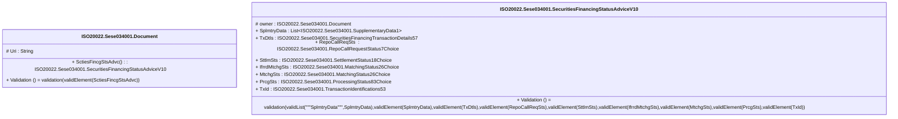

# sese.034.001.10-physical

> The tables below contain descriptions of the members of each Element. 
> The first column indicates the type of the member:
> A ‘#’ indicates that the field is a key to the element, and a ‘+’ indicates that the field is a value.
> The ‘*’ column contains a description for the element member.  
> The ‘@’ column contains any properties for the member.
> The ‘=’ column contains calculated values; or in the case of an enum, the serialized value.

---

## EntityImpl ISO20022.Sese034001.Document

| |Name|Type|*|@|=|
|-|-|-|-|-|-|
|#|Uri|String||XmlIgnore(), JsonIgnore()||
|+|SctiesFincgStsAdvc|ISO20022.Sese034001.SecuritiesFinancingStatusAdviceV10||XmlElement()||
||Validation|Some(String)||XmlIgnore(), JsonIgnore()|validation(validElement(SctiesFincgStsAdvc))|

---

## AspectImpl ISO20022.Sese034001.SecuritiesFinancingStatusAdviceV10

| |Name|Type|*|@|=|
|-|-|-|-|-|-|
|#|owner|ISO20022.Sese034001.Document||||
|+|SplmtryData|List<ISO20022.Sese034001.SupplementaryData1>||XmlElement()||
|+|TxDtls|ISO20022.Sese034001.SecuritiesFinancingTransactionDetails57||XmlElement()||
|+|RepoCallReqSts|ISO20022.Sese034001.RepoCallRequestStatus7Choice||XmlElement()||
|+|SttlmSts|ISO20022.Sese034001.SettlementStatus18Choice||XmlElement()||
|+|IfrrdMtchgSts|ISO20022.Sese034001.MatchingStatus26Choice||XmlElement()||
|+|MtchgSts|ISO20022.Sese034001.MatchingStatus26Choice||XmlElement()||
|+|PrcgSts|ISO20022.Sese034001.ProcessingStatus83Choice||XmlElement()||
|+|TxId|ISO20022.Sese034001.TransactionIdentifications53||XmlElement()||
||Validation|Some(String)||XmlIgnore(), JsonIgnore()|validation(validList("""SplmtryData""",SplmtryData),validElement(SplmtryData),validElement(TxDtls),validElement(RepoCallReqSts),validElement(SttlmSts),validElement(IfrrdMtchgSts),validElement(MtchgSts),validElement(PrcgSts),validElement(TxId))|

