# sese.035.001.12-physical

```mermaid
classDiagram
    class ISO20022.Sese035001.Document {
        # Uri  : String
        + SctiesFincgConf () : ISO20022.Sese035001.SecuritiesFinancingConfirmationV12
        + Validation () = validation(validElement(SctiesFincgConf))
    }
    class ISO20022.Sese035001.SecuritiesFinancingConfirmationV12 {
        # owner  : ISO20022.Sese035001.Document
        + SplmtryData  : List~ISO20022.Sese035001.SupplementaryData1~
        + OthrBizPties  : ISO20022.Sese035001.OtherParties43
        + DgtlNtwkFee  : ISO20022.Sese035001.NetworkFee1
        + OthrAmts  : ISO20022.Sese035001.OtherAmounts47
        + SttldAmt  : ISO20022.Sese035001.AmountAndDirection94
        + CshPties  : ISO20022.Sese035001.CashParties41
        + RcvgSttlmPties  : ISO20022.Sese035001.SettlementParties126
        + DlvrgSttlmPties  : ISO20022.Sese035001.SettlementParties126
        + SttlmParams  : ISO20022.Sese035001.SettlementDetails147
        + StgSttlmInstrDtls  : ISO20022.Sese035001.StandingSettlementInstruction20
        + SctiesFincgDtls  : ISO20022.Sese035001.SecuritiesFinancingTransactionDetails56
        + QtyAndAcctDtls  : ISO20022.Sese035001.QuantityAndAccount120
        + FinInstrmAttrbts  : ISO20022.Sese035001.FinancialInstrumentAttributes111
        + FinInstrmId  : ISO20022.Sese035001.SecurityIdentification19
        + TradDtls  : ISO20022.Sese035001.SecuritiesTradeDetails115
        + AddtlParams  : ISO20022.Sese035001.AdditionalParameters24
        + TxIdDtls  : ISO20022.Sese035001.TransactionTypeAndAdditionalParameters22
        + Validation () = validation(validList("""SplmtryData""",SplmtryData),validElement(SplmtryData),validElement(OthrBizPties),validElement(DgtlNtwkFee),validElement(OthrAmts),validElement(SttldAmt),validElement(CshPties),validElement(RcvgSttlmPties),validElement(DlvrgSttlmPties),validElement(SttlmParams),validElement(StgSttlmInstrDtls),validElement(SctiesFincgDtls),validElement(QtyAndAcctDtls),validElement(FinInstrmAttrbts),validElement(FinInstrmId),validElement(TradDtls),validElement(AddtlParams),validElement(TxIdDtls))
    }
```

> The tables below contain descriptions of the members of each Element. 
> The first column indicates the type of the member:
> A ‘#’ indicates that the field is a key to the element, and a ‘+’ indicates that the field is a value.
> The ‘*’ column contains a description for the element member.  
> The ‘@’ column contains any properties for the member.
> The ‘=’ column contains calculated values; or in the case of an enum, the serialized value.

---

## EntityImpl ISO20022.Sese035001.Document

| |Name|Type|*|@|=|
|-|-|-|-|-|-|
|#|Uri|String||XmlIgnore(), JsonIgnore()||
|+|SctiesFincgConf|ISO20022.Sese035001.SecuritiesFinancingConfirmationV12||XmlElement()||
||Validation|Some(String)||XmlIgnore(), JsonIgnore()|validation(validElement(SctiesFincgConf))|

---

## AspectImpl ISO20022.Sese035001.SecuritiesFinancingConfirmationV12

| |Name|Type|*|@|=|
|-|-|-|-|-|-|
|#|owner|ISO20022.Sese035001.Document||||
|+|SplmtryData|List<ISO20022.Sese035001.SupplementaryData1>||XmlElement()||
|+|OthrBizPties|ISO20022.Sese035001.OtherParties43||XmlElement()||
|+|DgtlNtwkFee|ISO20022.Sese035001.NetworkFee1||XmlElement()||
|+|OthrAmts|ISO20022.Sese035001.OtherAmounts47||XmlElement()||
|+|SttldAmt|ISO20022.Sese035001.AmountAndDirection94||XmlElement()||
|+|CshPties|ISO20022.Sese035001.CashParties41||XmlElement()||
|+|RcvgSttlmPties|ISO20022.Sese035001.SettlementParties126||XmlElement()||
|+|DlvrgSttlmPties|ISO20022.Sese035001.SettlementParties126||XmlElement()||
|+|SttlmParams|ISO20022.Sese035001.SettlementDetails147||XmlElement()||
|+|StgSttlmInstrDtls|ISO20022.Sese035001.StandingSettlementInstruction20||XmlElement()||
|+|SctiesFincgDtls|ISO20022.Sese035001.SecuritiesFinancingTransactionDetails56||XmlElement()||
|+|QtyAndAcctDtls|ISO20022.Sese035001.QuantityAndAccount120||XmlElement()||
|+|FinInstrmAttrbts|ISO20022.Sese035001.FinancialInstrumentAttributes111||XmlElement()||
|+|FinInstrmId|ISO20022.Sese035001.SecurityIdentification19||XmlElement()||
|+|TradDtls|ISO20022.Sese035001.SecuritiesTradeDetails115||XmlElement()||
|+|AddtlParams|ISO20022.Sese035001.AdditionalParameters24||XmlElement()||
|+|TxIdDtls|ISO20022.Sese035001.TransactionTypeAndAdditionalParameters22||XmlElement()||
||Validation|Some(String)||XmlIgnore(), JsonIgnore()|validation(validList("""SplmtryData""",SplmtryData),validElement(SplmtryData),validElement(OthrBizPties),validElement(DgtlNtwkFee),validElement(OthrAmts),validElement(SttldAmt),validElement(CshPties),validElement(RcvgSttlmPties),validElement(DlvrgSttlmPties),validElement(SttlmParams),validElement(StgSttlmInstrDtls),validElement(SctiesFincgDtls),validElement(QtyAndAcctDtls),validElement(FinInstrmAttrbts),validElement(FinInstrmId),validElement(TradDtls),validElement(AddtlParams),validElement(TxIdDtls))|

