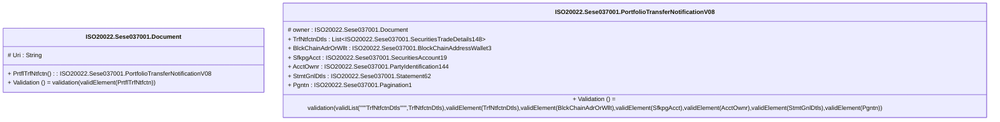

# sese.037.001.08-physical

> The tables below contain descriptions of the members of each Element. 
> The first column indicates the type of the member:
> A ‘#’ indicates that the field is a key to the element, and a ‘+’ indicates that the field is a value.
> The ‘*’ column contains a description for the element member.  
> The ‘@’ column contains any properties for the member.
> The ‘=’ column contains calculated values; or in the case of an enum, the serialized value.

---

## EntityImpl ISO20022.Sese037001.Document

| |Name|Type|*|@|=|
|-|-|-|-|-|-|
|#|Uri|String||XmlIgnore(), JsonIgnore()||
|+|PrtflTrfNtfctn|ISO20022.Sese037001.PortfolioTransferNotificationV08||XmlElement()||
||Validation|Some(String)||XmlIgnore(), JsonIgnore()|validation(validElement(PrtflTrfNtfctn))|

---

## AspectImpl ISO20022.Sese037001.PortfolioTransferNotificationV08

| |Name|Type|*|@|=|
|-|-|-|-|-|-|
|#|owner|ISO20022.Sese037001.Document||||
|+|TrfNtfctnDtls|List<ISO20022.Sese037001.SecuritiesTradeDetails148>||XmlElement()||
|+|BlckChainAdrOrWllt|ISO20022.Sese037001.BlockChainAddressWallet3||XmlElement()||
|+|SfkpgAcct|ISO20022.Sese037001.SecuritiesAccount19||XmlElement()||
|+|AcctOwnr|ISO20022.Sese037001.PartyIdentification144||XmlElement()||
|+|StmtGnlDtls|ISO20022.Sese037001.Statement62||XmlElement()||
|+|Pgntn|ISO20022.Sese037001.Pagination1||XmlElement()||
||Validation|Some(String)||XmlIgnore(), JsonIgnore()|validation(validList("""TrfNtfctnDtls""",TrfNtfctnDtls),validElement(TrfNtfctnDtls),validElement(BlckChainAdrOrWllt),validElement(SfkpgAcct),validElement(AcctOwnr),validElement(StmtGnlDtls),validElement(Pgntn))|

