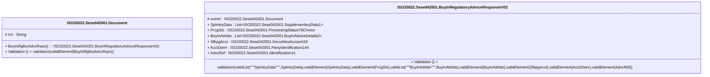

# sese.042.001.02-physical

> The tables below contain descriptions of the members of each Element. 
> The first column indicates the type of the member:
> A ‘#’ indicates that the field is a key to the element, and a ‘+’ indicates that the field is a value.
> The ‘*’ column contains a description for the element member.  
> The ‘@’ column contains any properties for the member.
> The ‘=’ column contains calculated values; or in the case of an enum, the serialized value.

---

## EntityImpl ISO20022.Sese042001.Document

| |Name|Type|*|@|=|
|-|-|-|-|-|-|
|#|Uri|String||XmlIgnore(), JsonIgnore()||
|+|BuyInRgltryAdvcRspn|ISO20022.Sese042001.BuyInRegulatoryAdviceResponseV02||XmlElement()||
||Validation|Some(String)||XmlIgnore(), JsonIgnore()|validation(validElement(BuyInRgltryAdvcRspn))|

---

## AspectImpl ISO20022.Sese042001.BuyInRegulatoryAdviceResponseV02

| |Name|Type|*|@|=|
|-|-|-|-|-|-|
|#|owner|ISO20022.Sese042001.Document||||
|+|SplmtryData|List<ISO20022.Sese042001.SupplementaryData1>||XmlElement()||
|+|PrcgSts|ISO20022.Sese042001.ProcessingStatus79Choice||XmlElement()||
|+|BuyInAttrbts|List<ISO20022.Sese042001.BuyInAdviceDetails2>||XmlElement()||
|+|SfkpgAcct|ISO20022.Sese042001.SecuritiesAccount19||XmlElement()||
|+|AcctOwnr|ISO20022.Sese042001.PartyIdentification144||XmlElement()||
|+|AdvcRef|ISO20022.Sese042001.Identification14||XmlElement()||
||Validation|Some(String)||XmlIgnore(), JsonIgnore()|validation(validList("""SplmtryData""",SplmtryData),validElement(SplmtryData),validElement(PrcgSts),validList("""BuyInAttrbts""",BuyInAttrbts),validElement(BuyInAttrbts),validElement(SfkpgAcct),validElement(AcctOwnr),validElement(AdvcRef))|

