# sese.042.001.02

```mermaid
classDiagram
    class Hiperspace.Edge {
        # From  : Hiperspace.Node
        # To  : Hiperspace.Node
        # TypeName  : String
        + Name  : String
    }
    class ISO20022.Sese042001.AcknowledgedAcceptedStatus33Choice {
        + Rsn  : global::System.Collections.Generic.List~ISO20022.Sese042001.AcknowledgementReason21~
        + NoSpcfdRsn  : String
    }
    ISO20022.Sese042001.AcknowledgedAcceptedStatus33Choice *-- ISO20022.Sese042001.AcknowledgementReason21
    class ISO20022.Sese042001.AcknowledgementReason10Code {
        OTHR = 1
        SMPG = 2
        ADEA = 3
    }
    class ISO20022.Sese042001.AcknowledgementReason21 {
        + AddtlRsnInf  : String
        + Cd  : ISO20022.Sese042001.AcknowledgementReason24Choice
    }
    ISO20022.Sese042001.AcknowledgementReason21 *-- ISO20022.Sese042001.AcknowledgementReason24Choice
    class ISO20022.Sese042001.AcknowledgementReason24Choice {
        + Prtry  : ISO20022.Sese042001.GenericIdentification30
        + Cd  : String
    }
    ISO20022.Sese042001.AcknowledgementReason24Choice *-- ISO20022.Sese042001.GenericIdentification30
    class ISO20022.Sese042001.ActiveCurrencyAnd13DecimalAmount {
        + Value  : Decimal
        + Ccy  : String
    }
    class ISO20022.Sese042001.ActiveCurrencyAndAmount {
        + Value  : Decimal
        + Ccy  : String
    }
    class ISO20022.Sese042001.AmountAndDirection102 {
        + Sgn  : String
        + Amt  : ISO20022.Sese042001.ActiveCurrencyAndAmount
    }
    ISO20022.Sese042001.AmountAndDirection102 *-- ISO20022.Sese042001.ActiveCurrencyAndAmount
    class ISO20022.Sese042001.BuyInAdviceDetails2 {
        + BuyInSttlmDt  : ISO20022.Sese042001.DateAndDateTime2Choice
        + CshCompstnAmt  : ISO20022.Sese042001.AmountAndDirection102
        + BuyInPric  : ISO20022.Sese042001.RateAndAmountFormat39Choice
        + Qty  : ISO20022.Sese042001.FinancialInstrumentQuantity1Choice
        + FinInstrmId  : ISO20022.Sese042001.SecurityIdentification19
        + BuyInDfrrl  : String
        + BuyInStat  : String
        + Ref  : ISO20022.Sese042001.References31
    }
    ISO20022.Sese042001.BuyInAdviceDetails2 *-- ISO20022.Sese042001.DateAndDateTime2Choice
    ISO20022.Sese042001.BuyInAdviceDetails2 *-- ISO20022.Sese042001.AmountAndDirection102
    ISO20022.Sese042001.BuyInAdviceDetails2 *-- ISO20022.Sese042001.RateAndAmountFormat39Choice
    ISO20022.Sese042001.BuyInAdviceDetails2 *-- ISO20022.Sese042001.FinancialInstrumentQuantity1Choice
    ISO20022.Sese042001.BuyInAdviceDetails2 *-- ISO20022.Sese042001.SecurityIdentification19
    ISO20022.Sese042001.BuyInAdviceDetails2 *-- ISO20022.Sese042001.References31
    class ISO20022.Sese042001.BuyInDeferral1Code {
        DEFN = 1
        DEFY = 2
    }
    class ISO20022.Sese042001.BuyInRegulatoryAdviceResponseV02 {
        + SplmtryData  : global::System.Collections.Generic.List~ISO20022.Sese042001.SupplementaryData1~
        + PrcgSts  : ISO20022.Sese042001.ProcessingStatus79Choice
        + BuyInAttrbts  : global::System.Collections.Generic.List~ISO20022.Sese042001.BuyInAdviceDetails2~
        + SfkpgAcct  : ISO20022.Sese042001.SecuritiesAccount19
        + AcctOwnr  : ISO20022.Sese042001.PartyIdentification144
        + AdvcRef  : ISO20022.Sese042001.Identification14
    }
    ISO20022.Sese042001.BuyInRegulatoryAdviceResponseV02 *-- ISO20022.Sese042001.SupplementaryData1
    ISO20022.Sese042001.BuyInRegulatoryAdviceResponseV02 *-- ISO20022.Sese042001.ProcessingStatus79Choice
    ISO20022.Sese042001.BuyInRegulatoryAdviceResponseV02 *-- ISO20022.Sese042001.BuyInAdviceDetails2
    ISO20022.Sese042001.BuyInRegulatoryAdviceResponseV02 *-- ISO20022.Sese042001.SecuritiesAccount19
    ISO20022.Sese042001.BuyInRegulatoryAdviceResponseV02 *-- ISO20022.Sese042001.PartyIdentification144
    ISO20022.Sese042001.BuyInRegulatoryAdviceResponseV02 *-- ISO20022.Sese042001.Identification14
    class ISO20022.Sese042001.BuyInState1Code {
        BSSN = 1
        BSSY = 2
        BSSP = 3
    }
    class ISO20022.Sese042001.DateAndDateTime2Choice {
        + DtTm  : DateTime
        + Dt  : DateTime
    }
    class ISO20022.Sese042001.FinancialInstrumentQuantity1Choice {
        + AmtsdVal  : Decimal
        + FaceAmt  : Decimal
        + Unit  : Decimal
    }
    class ISO20022.Sese042001.GenericIdentification30 {
        + SchmeNm  : String
        + Issr  : String
        + Id  : String
    }
    class ISO20022.Sese042001.GenericIdentification36 {
        + SchmeNm  : String
        + Issr  : String
        + Id  : String
    }
    class ISO20022.Sese042001.Identification14 {
        + Id  : String
    }
    class ISO20022.Sese042001.IdentificationSource3Choice {
        + Prtry  : String
        + Cd  : String
    }
    class ISO20022.Sese042001.NoReasonCode {
        NORE = 1
    }
    class ISO20022.Sese042001.OtherIdentification1 {
        + Tp  : ISO20022.Sese042001.IdentificationSource3Choice
        + Sfx  : String
        + Id  : String
    }
    ISO20022.Sese042001.OtherIdentification1 *-- ISO20022.Sese042001.IdentificationSource3Choice
    class ISO20022.Sese042001.PartyIdentification127Choice {
        + PrtryId  : ISO20022.Sese042001.GenericIdentification36
        + AnyBIC  : String
    }
    ISO20022.Sese042001.PartyIdentification127Choice *-- ISO20022.Sese042001.GenericIdentification36
    class ISO20022.Sese042001.PartyIdentification144 {
        + LEI  : String
        + Id  : ISO20022.Sese042001.PartyIdentification127Choice
    }
    ISO20022.Sese042001.PartyIdentification144 *-- ISO20022.Sese042001.PartyIdentification127Choice
    class ISO20022.Sese042001.ProcessingStatus79Choice {
        + Rjctd  : ISO20022.Sese042001.RejectionOrRepairStatus31Choice
        + AckdAccptd  : ISO20022.Sese042001.AcknowledgedAcceptedStatus33Choice
    }
    ISO20022.Sese042001.ProcessingStatus79Choice *-- ISO20022.Sese042001.RejectionOrRepairStatus31Choice
    ISO20022.Sese042001.ProcessingStatus79Choice *-- ISO20022.Sese042001.AcknowledgedAcceptedStatus33Choice
    class ISO20022.Sese042001.RateAndAmountFormat39Choice {
        + Amt  : ISO20022.Sese042001.ActiveCurrencyAnd13DecimalAmount
        + Rate  : Decimal
    }
    ISO20022.Sese042001.RateAndAmountFormat39Choice *-- ISO20022.Sese042001.ActiveCurrencyAnd13DecimalAmount
    class ISO20022.Sese042001.References31 {
        + UnqTxIdr  : String
        + TradId  : String
        + CmonId  : String
        + PoolId  : String
        + PrcrTxId  : String
        + MktInfrstrctrTxId  : String
        + AcctSvcrTxId  : String
        + AcctOwnrTxId  : String
    }
    class ISO20022.Sese042001.RejectionAndRepairReason25Choice {
        + Prtry  : ISO20022.Sese042001.GenericIdentification30
        + Cd  : String
    }
    ISO20022.Sese042001.RejectionAndRepairReason25Choice *-- ISO20022.Sese042001.GenericIdentification30
    class ISO20022.Sese042001.RejectionOrRepairReason25 {
        + AddtlRsnInf  : String
        + Cd  : ISO20022.Sese042001.RejectionAndRepairReason25Choice
    }
    ISO20022.Sese042001.RejectionOrRepairReason25 *-- ISO20022.Sese042001.RejectionAndRepairReason25Choice
    class ISO20022.Sese042001.RejectionOrRepairStatus31Choice {
        + Rsn  : global::System.Collections.Generic.List~ISO20022.Sese042001.RejectionOrRepairReason25~
        + NoSpcfdRsn  : String
    }
    ISO20022.Sese042001.RejectionOrRepairStatus31Choice *-- ISO20022.Sese042001.RejectionOrRepairReason25
    class ISO20022.Sese042001.RejectionReason27Code {
        INVL = 1
        INVM = 2
        REFE = 3
        OTHR = 4
        NRGN = 5
        NRGM = 6
        SAFE = 7
        LATE = 8
        ADEA = 9
    }
    class ISO20022.Sese042001.SecuritiesAccount19 {
        + Nm  : String
        + Tp  : ISO20022.Sese042001.GenericIdentification30
        + Id  : String
    }
    ISO20022.Sese042001.SecuritiesAccount19 *-- ISO20022.Sese042001.GenericIdentification30
    class ISO20022.Sese042001.SecurityIdentification19 {
        + Desc  : String
        + OthrId  : global::System.Collections.Generic.List~ISO20022.Sese042001.OtherIdentification1~
        + ISIN  : String
    }
    ISO20022.Sese042001.SecurityIdentification19 *-- ISO20022.Sese042001.OtherIdentification1
    class ISO20022.Sese042001.SupplementaryData1 {
        + Envlp  : ISO20022.Sese042001.SupplementaryDataEnvelope1
        + PlcAndNm  : String
    }
    ISO20022.Sese042001.SupplementaryData1 *-- ISO20022.Sese042001.SupplementaryDataEnvelope1
    class ISO20022.Sese042001.SupplementaryDataEnvelope1 {
    }
    class Hiperspace.Node {
        # SKey  : String
        + TypeName  : String
        + Name  : String
        + Froms (From = this) : Hiperspace.Edge
        + Tos (To = this) : Hiperspace.Edge
    }
```

> The tables below contain descriptions of the members of each Element. 
> The first column indicates the type of the member:
> A ‘#’ indicates that the field is a key to the element, and a ‘+’ indicates that the field is a value.
> The ‘*’ column contains a description for the element member.  
> The ‘@’ column contains any properties for the member.
> The ‘=’ column contains calculated values; or in the case of an enum, the serialized value.

---

## View Hiperspace.Edge
edge between nodes

| |Name|Type|*|@|=|
|-|-|-|-|-|-|
|#|From|Hiperspace.Node||||
|#|To|Hiperspace.Node||||
|#|TypeName|String||||
|+|Name|String||||

---

## Value ISO20022.Sese042001.AcknowledgedAcceptedStatus33Choice

| |Name|Type|*|@|=|
|-|-|-|-|-|-|
|+|Rsn|global::System.Collections.Generic.List<ISO20022.Sese042001.AcknowledgementReason21>||XmlElement()||
|+|NoSpcfdRsn|String||XmlElement()||
||Validation|Some(String)||XmlIgnore(), JsonIgnore()|validation(validRequired("""Rsn""",Rsn),validList("""Rsn""",Rsn),validElement(Rsn),validChoice(Rsn,NoSpcfdRsn))|

---

## Enum ISO20022.Sese042001.AcknowledgementReason10Code

| |Name|Type|*|@|=|
|-|-|-|-|-|-|
||OTHR|Int32||XmlEnum("""OTHR""")|1|
||SMPG|Int32||XmlEnum("""SMPG""")|2|
||ADEA|Int32||XmlEnum("""ADEA""")|3|

---

## Value ISO20022.Sese042001.AcknowledgementReason21

| |Name|Type|*|@|=|
|-|-|-|-|-|-|
|+|AddtlRsnInf|String||XmlElement()||
|+|Cd|ISO20022.Sese042001.AcknowledgementReason24Choice||XmlElement()||
||Validation|Some(String)||XmlIgnore(), JsonIgnore()|validation(validElement(Cd))|

---

## Value ISO20022.Sese042001.AcknowledgementReason24Choice

| |Name|Type|*|@|=|
|-|-|-|-|-|-|
|+|Prtry|ISO20022.Sese042001.GenericIdentification30||XmlElement()||
|+|Cd|String||XmlElement()||
||Validation|Some(String)||XmlIgnore(), JsonIgnore()|validation(validElement(Prtry),validChoice(Prtry,Cd))|

---

## Value ISO20022.Sese042001.ActiveCurrencyAnd13DecimalAmount

| |Name|Type|*|@|=|
|-|-|-|-|-|-|
|+|Value|Decimal||XmlElement()||
|+|Ccy|String||XmlAttribute()||
||Validation|Some(String)||XmlIgnore(), JsonIgnore()|validation(validRequired("""Value""",Value),validRequired("""Ccy""",Ccy),validPattern("""Ccy""",Ccy,"""[A-Z]{3,3}"""))|

---

## Value ISO20022.Sese042001.ActiveCurrencyAndAmount

| |Name|Type|*|@|=|
|-|-|-|-|-|-|
|+|Value|Decimal||XmlElement()||
|+|Ccy|String||XmlAttribute()||
||Validation|Some(String)||XmlIgnore(), JsonIgnore()|validation(validRequired("""Value""",Value),validRequired("""Ccy""",Ccy),validPattern("""Ccy""",Ccy,"""[A-Z]{3,3}"""))|

---

## Value ISO20022.Sese042001.AmountAndDirection102

| |Name|Type|*|@|=|
|-|-|-|-|-|-|
|+|Sgn|String||XmlElement()||
|+|Amt|ISO20022.Sese042001.ActiveCurrencyAndAmount||XmlElement()||
||Validation|Some(String)||XmlIgnore(), JsonIgnore()|validation(validElement(Amt))|

---

## Value ISO20022.Sese042001.BuyInAdviceDetails2

| |Name|Type|*|@|=|
|-|-|-|-|-|-|
|+|BuyInSttlmDt|ISO20022.Sese042001.DateAndDateTime2Choice||XmlElement()||
|+|CshCompstnAmt|ISO20022.Sese042001.AmountAndDirection102||XmlElement()||
|+|BuyInPric|ISO20022.Sese042001.RateAndAmountFormat39Choice||XmlElement()||
|+|Qty|ISO20022.Sese042001.FinancialInstrumentQuantity1Choice||XmlElement()||
|+|FinInstrmId|ISO20022.Sese042001.SecurityIdentification19||XmlElement()||
|+|BuyInDfrrl|String||XmlElement()||
|+|BuyInStat|String||XmlElement()||
|+|Ref|ISO20022.Sese042001.References31||XmlElement()||
||Validation|Some(String)||XmlIgnore(), JsonIgnore()|validation(validElement(BuyInSttlmDt),validElement(CshCompstnAmt),validElement(BuyInPric),validElement(Qty),validElement(FinInstrmId),validElement(Ref))|

---

## Enum ISO20022.Sese042001.BuyInDeferral1Code

| |Name|Type|*|@|=|
|-|-|-|-|-|-|
||DEFN|Int32||XmlEnum("""DEFN""")|1|
||DEFY|Int32||XmlEnum("""DEFY""")|2|

---

## Aspect ISO20022.Sese042001.BuyInRegulatoryAdviceResponseV02

| |Name|Type|*|@|=|
|-|-|-|-|-|-|
|+|SplmtryData|global::System.Collections.Generic.List<ISO20022.Sese042001.SupplementaryData1>||XmlElement()||
|+|PrcgSts|ISO20022.Sese042001.ProcessingStatus79Choice||XmlElement()||
|+|BuyInAttrbts|global::System.Collections.Generic.List<ISO20022.Sese042001.BuyInAdviceDetails2>||XmlElement()||
|+|SfkpgAcct|ISO20022.Sese042001.SecuritiesAccount19||XmlElement()||
|+|AcctOwnr|ISO20022.Sese042001.PartyIdentification144||XmlElement()||
|+|AdvcRef|ISO20022.Sese042001.Identification14||XmlElement()||
||Validation|Some(String)||XmlIgnore(), JsonIgnore()|validation(validList("""SplmtryData""",SplmtryData),validElement(SplmtryData),validElement(PrcgSts),validList("""BuyInAttrbts""",BuyInAttrbts),validElement(BuyInAttrbts),validElement(SfkpgAcct),validElement(AcctOwnr),validElement(AdvcRef))|

---

## Enum ISO20022.Sese042001.BuyInState1Code

| |Name|Type|*|@|=|
|-|-|-|-|-|-|
||BSSN|Int32||XmlEnum("""BSSN""")|1|
||BSSY|Int32||XmlEnum("""BSSY""")|2|
||BSSP|Int32||XmlEnum("""BSSP""")|3|

---

## Value ISO20022.Sese042001.DateAndDateTime2Choice

| |Name|Type|*|@|=|
|-|-|-|-|-|-|
|+|DtTm|DateTime||XmlElement()||
|+|Dt|DateTime||XmlElement()||
||Validation|Some(String)||XmlIgnore(), JsonIgnore()|validation(validChoice(DtTm,Dt))|

---

## Type ISO20022.Sese042001.Document

| |Name|Type|*|@|=|
|-|-|-|-|-|-|
|+|BuyInRgltryAdvcRspn|ISO20022.Sese042001.BuyInRegulatoryAdviceResponseV02||XmlElement()||
||Validation|Some(String)||XmlIgnore(), JsonIgnore()|validation(validElement(BuyInRgltryAdvcRspn))|

---

## Value ISO20022.Sese042001.FinancialInstrumentQuantity1Choice

| |Name|Type|*|@|=|
|-|-|-|-|-|-|
|+|AmtsdVal|Decimal||XmlElement()||
|+|FaceAmt|Decimal||XmlElement()||
|+|Unit|Decimal||XmlElement()||
||Validation|Some(String)||XmlIgnore(), JsonIgnore()|validation(validChoice(AmtsdVal,FaceAmt,Unit))|

---

## Value ISO20022.Sese042001.GenericIdentification30

| |Name|Type|*|@|=|
|-|-|-|-|-|-|
|+|SchmeNm|String||XmlElement()||
|+|Issr|String||XmlElement()||
|+|Id|String||XmlElement()||
||Validation|Some(String)||XmlIgnore(), JsonIgnore()|validation(validPattern("""Id""",Id,"""[a-zA-Z0-9]{4}"""))|

---

## Value ISO20022.Sese042001.GenericIdentification36

| |Name|Type|*|@|=|
|-|-|-|-|-|-|
|+|SchmeNm|String||XmlElement()||
|+|Issr|String||XmlElement()||
|+|Id|String||XmlElement()||
||Validation|Some(String)||XmlIgnore(), JsonIgnore()|""|

---

## Value ISO20022.Sese042001.Identification14

| |Name|Type|*|@|=|
|-|-|-|-|-|-|
|+|Id|String||XmlElement()||
||Validation|Some(String)||XmlIgnore(), JsonIgnore()|""|

---

## Value ISO20022.Sese042001.IdentificationSource3Choice

| |Name|Type|*|@|=|
|-|-|-|-|-|-|
|+|Prtry|String||XmlElement()||
|+|Cd|String||XmlElement()||
||Validation|Some(String)||XmlIgnore(), JsonIgnore()|validation(validChoice(Prtry,Cd))|

---

## Enum ISO20022.Sese042001.NoReasonCode

| |Name|Type|*|@|=|
|-|-|-|-|-|-|
||NORE|Int32||XmlEnum("""NORE""")|1|

---

## Value ISO20022.Sese042001.OtherIdentification1

| |Name|Type|*|@|=|
|-|-|-|-|-|-|
|+|Tp|ISO20022.Sese042001.IdentificationSource3Choice||XmlElement()||
|+|Sfx|String||XmlElement()||
|+|Id|String||XmlElement()||
||Validation|Some(String)||XmlIgnore(), JsonIgnore()|validation(validElement(Tp))|

---

## Value ISO20022.Sese042001.PartyIdentification127Choice

| |Name|Type|*|@|=|
|-|-|-|-|-|-|
|+|PrtryId|ISO20022.Sese042001.GenericIdentification36||XmlElement()||
|+|AnyBIC|String||XmlElement()||
||Validation|Some(String)||XmlIgnore(), JsonIgnore()|validation(validElement(PrtryId),validPattern("""AnyBIC""",AnyBIC,"""[A-Z0-9]{4,4}[A-Z]{2,2}[A-Z0-9]{2,2}([A-Z0-9]{3,3}){0,1}"""),validChoice(PrtryId,AnyBIC))|

---

## Value ISO20022.Sese042001.PartyIdentification144

| |Name|Type|*|@|=|
|-|-|-|-|-|-|
|+|LEI|String||XmlElement()||
|+|Id|ISO20022.Sese042001.PartyIdentification127Choice||XmlElement()||
||Validation|Some(String)||XmlIgnore(), JsonIgnore()|validation(validPattern("""LEI""",LEI,"""[A-Z0-9]{18,18}[0-9]{2,2}"""),validElement(Id))|

---

## Value ISO20022.Sese042001.ProcessingStatus79Choice

| |Name|Type|*|@|=|
|-|-|-|-|-|-|
|+|Rjctd|ISO20022.Sese042001.RejectionOrRepairStatus31Choice||XmlElement()||
|+|AckdAccptd|ISO20022.Sese042001.AcknowledgedAcceptedStatus33Choice||XmlElement()||
||Validation|Some(String)||XmlIgnore(), JsonIgnore()|validation(validElement(Rjctd),validElement(AckdAccptd),validChoice(Rjctd,AckdAccptd))|

---

## Value ISO20022.Sese042001.RateAndAmountFormat39Choice

| |Name|Type|*|@|=|
|-|-|-|-|-|-|
|+|Amt|ISO20022.Sese042001.ActiveCurrencyAnd13DecimalAmount||XmlElement()||
|+|Rate|Decimal||XmlElement()||
||Validation|Some(String)||XmlIgnore(), JsonIgnore()|validation(validElement(Amt),validChoice(Amt,Rate))|

---

## Value ISO20022.Sese042001.References31

| |Name|Type|*|@|=|
|-|-|-|-|-|-|
|+|UnqTxIdr|String||XmlElement()||
|+|TradId|String||XmlElement()||
|+|CmonId|String||XmlElement()||
|+|PoolId|String||XmlElement()||
|+|PrcrTxId|String||XmlElement()||
|+|MktInfrstrctrTxId|String||XmlElement()||
|+|AcctSvcrTxId|String||XmlElement()||
|+|AcctOwnrTxId|String||XmlElement()||
||Validation|Some(String)||XmlIgnore(), JsonIgnore()|validation(validPattern("""UnqTxIdr""",UnqTxIdr,"""[A-Z0-9]{18}[0-9]{2}[A-Z0-9]{0,32}"""))|

---

## Value ISO20022.Sese042001.RejectionAndRepairReason25Choice

| |Name|Type|*|@|=|
|-|-|-|-|-|-|
|+|Prtry|ISO20022.Sese042001.GenericIdentification30||XmlElement()||
|+|Cd|String||XmlElement()||
||Validation|Some(String)||XmlIgnore(), JsonIgnore()|validation(validElement(Prtry),validChoice(Prtry,Cd))|

---

## Value ISO20022.Sese042001.RejectionOrRepairReason25

| |Name|Type|*|@|=|
|-|-|-|-|-|-|
|+|AddtlRsnInf|String||XmlElement()||
|+|Cd|ISO20022.Sese042001.RejectionAndRepairReason25Choice||XmlElement()||
||Validation|Some(String)||XmlIgnore(), JsonIgnore()|validation(validElement(Cd))|

---

## Value ISO20022.Sese042001.RejectionOrRepairStatus31Choice

| |Name|Type|*|@|=|
|-|-|-|-|-|-|
|+|Rsn|global::System.Collections.Generic.List<ISO20022.Sese042001.RejectionOrRepairReason25>||XmlElement()||
|+|NoSpcfdRsn|String||XmlElement()||
||Validation|Some(String)||XmlIgnore(), JsonIgnore()|validation(validRequired("""Rsn""",Rsn),validList("""Rsn""",Rsn),validElement(Rsn),validChoice(Rsn,NoSpcfdRsn))|

---

## Enum ISO20022.Sese042001.RejectionReason27Code

| |Name|Type|*|@|=|
|-|-|-|-|-|-|
||INVL|Int32||XmlEnum("""INVL""")|1|
||INVM|Int32||XmlEnum("""INVM""")|2|
||REFE|Int32||XmlEnum("""REFE""")|3|
||OTHR|Int32||XmlEnum("""OTHR""")|4|
||NRGN|Int32||XmlEnum("""NRGN""")|5|
||NRGM|Int32||XmlEnum("""NRGM""")|6|
||SAFE|Int32||XmlEnum("""SAFE""")|7|
||LATE|Int32||XmlEnum("""LATE""")|8|
||ADEA|Int32||XmlEnum("""ADEA""")|9|

---

## Value ISO20022.Sese042001.SecuritiesAccount19

| |Name|Type|*|@|=|
|-|-|-|-|-|-|
|+|Nm|String||XmlElement()||
|+|Tp|ISO20022.Sese042001.GenericIdentification30||XmlElement()||
|+|Id|String||XmlElement()||
||Validation|Some(String)||XmlIgnore(), JsonIgnore()|validation(validElement(Tp))|

---

## Value ISO20022.Sese042001.SecurityIdentification19

| |Name|Type|*|@|=|
|-|-|-|-|-|-|
|+|Desc|String||XmlElement()||
|+|OthrId|global::System.Collections.Generic.List<ISO20022.Sese042001.OtherIdentification1>||XmlElement()||
|+|ISIN|String||XmlElement()||
||Validation|Some(String)||XmlIgnore(), JsonIgnore()|validation(validList("""OthrId""",OthrId),validElement(OthrId),validPattern("""ISIN""",ISIN,"""[A-Z]{2,2}[A-Z0-9]{9,9}[0-9]{1,1}"""))|

---

## Value ISO20022.Sese042001.SupplementaryData1

| |Name|Type|*|@|=|
|-|-|-|-|-|-|
|+|Envlp|ISO20022.Sese042001.SupplementaryDataEnvelope1||XmlElement()||
|+|PlcAndNm|String||XmlElement()||
||Validation|Some(String)||XmlIgnore(), JsonIgnore()|validation(validElement(Envlp))|

---

## Value ISO20022.Sese042001.SupplementaryDataEnvelope1

| |Name|Type|*|@|=|
|-|-|-|-|-|-|
||Validation|Some(String)||XmlIgnore(), JsonIgnore()|""|

---

## View Hiperspace.Node
node in a graph view of data

| |Name|Type|*|@|=|
|-|-|-|-|-|-|
|#|SKey|String||||
|+|TypeName|String||||
|+|Name|String||||
||Froms|Hiperspace.Edge|||From = this|
||Tos|Hiperspace.Edge|||To = this|

