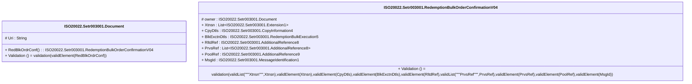

# setr.003.001.04-physical

> The tables below contain descriptions of the members of each Element. 
> The first column indicates the type of the member:
> A ‘#’ indicates that the field is a key to the element, and a ‘+’ indicates that the field is a value.
> The ‘*’ column contains a description for the element member.  
> The ‘@’ column contains any properties for the member.
> The ‘=’ column contains calculated values; or in the case of an enum, the serialized value.

---

## EntityImpl ISO20022.Setr003001.Document

| |Name|Type|*|@|=|
|-|-|-|-|-|-|
|#|Uri|String||XmlIgnore(), JsonIgnore()||
|+|RedBlkOrdrConf|ISO20022.Setr003001.RedemptionBulkOrderConfirmationV04||XmlElement()||
||Validation|Some(String)||XmlIgnore(), JsonIgnore()|validation(validElement(RedBlkOrdrConf))|

---

## AspectImpl ISO20022.Setr003001.RedemptionBulkOrderConfirmationV04

| |Name|Type|*|@|=|
|-|-|-|-|-|-|
|#|owner|ISO20022.Setr003001.Document||||
|+|Xtnsn|List<ISO20022.Setr003001.Extension1>||XmlElement()||
|+|CpyDtls|ISO20022.Setr003001.CopyInformation4||XmlElement()||
|+|BlkExctnDtls|ISO20022.Setr003001.RedemptionBulkExecution5||XmlElement()||
|+|RltdRef|ISO20022.Setr003001.AdditionalReference8||XmlElement()||
|+|PrvsRef|List<ISO20022.Setr003001.AdditionalReference8>||XmlElement()||
|+|PoolRef|ISO20022.Setr003001.AdditionalReference9||XmlElement()||
|+|MsgId|ISO20022.Setr003001.MessageIdentification1||XmlElement()||
||Validation|Some(String)||XmlIgnore(), JsonIgnore()|validation(validList("""Xtnsn""",Xtnsn),validElement(Xtnsn),validElement(CpyDtls),validElement(BlkExctnDtls),validElement(RltdRef),validList("""PrvsRef""",PrvsRef),validElement(PrvsRef),validElement(PoolRef),validElement(MsgId))|

