# setr.013.001.04-physical

```mermaid
classDiagram
    class ISO20022.Setr013001.Document {
        # Uri  : String
        + SwtchOrdr () : ISO20022.Setr013001.SwitchOrderV04
        + Validation () = validation(validElement(SwtchOrdr))
    }
    class ISO20022.Setr013001.SwitchOrderV04 {
        # owner  : ISO20022.Setr013001.Document
        + Xtnsn  : List~ISO20022.Setr013001.Extension1~
        + CpyDtls  : ISO20022.Setr013001.CopyInformation4
        + SwtchOrdrDtls  : List~ISO20022.Setr013001.SwitchOrder7~
        + MsgPgntn  : ISO20022.Setr013001.Pagination
        + PrvsRef  : List~ISO20022.Setr013001.AdditionalReference8~
        + PoolRef  : ISO20022.Setr013001.AdditionalReference9
        + MsgId  : ISO20022.Setr013001.MessageIdentification1
        + Validation () = validation(validList("""Xtnsn""",Xtnsn),validElement(Xtnsn),validElement(CpyDtls),validRequired("""SwtchOrdrDtls""",SwtchOrdrDtls),validList("""SwtchOrdrDtls""",SwtchOrdrDtls),validElement(SwtchOrdrDtls),validElement(MsgPgntn),validList("""PrvsRef""",PrvsRef),validElement(PrvsRef),validElement(PoolRef),validElement(MsgId))
    }
```

> The tables below contain descriptions of the members of each Element. 
> The first column indicates the type of the member:
> A ‘#’ indicates that the field is a key to the element, and a ‘+’ indicates that the field is a value.
> The ‘*’ column contains a description for the element member.  
> The ‘@’ column contains any properties for the member.
> The ‘=’ column contains calculated values; or in the case of an enum, the serialized value.

---

## EntityImpl ISO20022.Setr013001.Document

| |Name|Type|*|@|=|
|-|-|-|-|-|-|
|#|Uri|String||XmlIgnore(), JsonIgnore()||
|+|SwtchOrdr|ISO20022.Setr013001.SwitchOrderV04||XmlElement()||
||Validation|Some(String)||XmlIgnore(), JsonIgnore()|validation(validElement(SwtchOrdr))|

---

## AspectImpl ISO20022.Setr013001.SwitchOrderV04

| |Name|Type|*|@|=|
|-|-|-|-|-|-|
|#|owner|ISO20022.Setr013001.Document||||
|+|Xtnsn|List<ISO20022.Setr013001.Extension1>||XmlElement()||
|+|CpyDtls|ISO20022.Setr013001.CopyInformation4||XmlElement()||
|+|SwtchOrdrDtls|List<ISO20022.Setr013001.SwitchOrder7>||XmlElement()||
|+|MsgPgntn|ISO20022.Setr013001.Pagination||XmlElement()||
|+|PrvsRef|List<ISO20022.Setr013001.AdditionalReference8>||XmlElement()||
|+|PoolRef|ISO20022.Setr013001.AdditionalReference9||XmlElement()||
|+|MsgId|ISO20022.Setr013001.MessageIdentification1||XmlElement()||
||Validation|Some(String)||XmlIgnore(), JsonIgnore()|validation(validList("""Xtnsn""",Xtnsn),validElement(Xtnsn),validElement(CpyDtls),validRequired("""SwtchOrdrDtls""",SwtchOrdrDtls),validList("""SwtchOrdrDtls""",SwtchOrdrDtls),validElement(SwtchOrdrDtls),validElement(MsgPgntn),validList("""PrvsRef""",PrvsRef),validElement(PrvsRef),validElement(PoolRef),validElement(MsgId))|

