# setr.017.001.04

```mermaid
classDiagram
    class Hiperspace.Edge {
        # From  : Hiperspace.Node
        # To  : Hiperspace.Node
        # TypeName  : String
        + Name  : String
    }
    class ISO20022.Setr017001.AdditionalReference8 {
        + MsgNm  : String
        + RefIssr  : ISO20022.Setr017001.PartyIdentification113
        + Ref  : String
    }
    ISO20022.Setr017001.AdditionalReference8 *-- ISO20022.Setr017001.PartyIdentification113
    class ISO20022.Setr017001.AddressType2Code {
        DLVY = 1
        MLTO = 2
        BIZZ = 3
        HOME = 4
        PBOX = 5
        ADDR = 6
    }
    class ISO20022.Setr017001.AlternateSecurityIdentification7 {
        + IdSrc  : ISO20022.Setr017001.IdentificationSource1Choice
        + Id  : String
    }
    ISO20022.Setr017001.AlternateSecurityIdentification7 *-- ISO20022.Setr017001.IdentificationSource1Choice
    class ISO20022.Setr017001.CancellationStatus22Choice {
        + Rjctd  : ISO20022.Setr017001.RejectedStatus10
        + Sts  : String
    }
    ISO20022.Setr017001.CancellationStatus22Choice *-- ISO20022.Setr017001.RejectedStatus10
    class ISO20022.Setr017001.DateFormat42Choice {
        + YrMnthDay  : DateTime
        + YrMnth  : String
    }
    class ISO20022.Setr017001.DistributionPolicy1Code {
        ACCU = 1
        DIST = 2
    }
    class ISO20022.Setr017001.Extension1 {
        + Txt  : String
        + PlcAndNm  : String
    }
    class ISO20022.Setr017001.FinancialInstrument57 {
        + SrsId  : ISO20022.Setr017001.Series1
        + PdctGrp  : String
        + DstrbtnPlcy  : String
        + SctiesForm  : String
        + ClssTp  : String
        + SplmtryId  : String
        + ShrtNm  : String
        + Nm  : String
        + Id  : ISO20022.Setr017001.SecurityIdentification25Choice
    }
    ISO20022.Setr017001.FinancialInstrument57 *-- ISO20022.Setr017001.Series1
    ISO20022.Setr017001.FinancialInstrument57 *-- ISO20022.Setr017001.SecurityIdentification25Choice
    class ISO20022.Setr017001.FormOfSecurity1Code {
        REGD = 1
        BEAR = 2
    }
    class ISO20022.Setr017001.GenericIdentification1 {
        + Issr  : String
        + SchmeNm  : String
        + Id  : String
    }
    class ISO20022.Setr017001.IdentificationSource1Choice {
        + Prtry  : String
        + Dmst  : String
    }
    class ISO20022.Setr017001.IndividualOrderStatusAndReason8 {
        + FinInstrmDtls  : ISO20022.Setr017001.FinancialInstrument57
        + InvstmtAcctDtls  : ISO20022.Setr017001.InvestmentAccount58
        + StsInitr  : ISO20022.Setr017001.PartyIdentification113
        + CxlSts  : ISO20022.Setr017001.CancellationStatus22Choice
        + CxlRef  : String
        + ClntRef  : String
        + OrdrRef  : String
        + MstrRef  : String
    }
    ISO20022.Setr017001.IndividualOrderStatusAndReason8 *-- ISO20022.Setr017001.FinancialInstrument57
    ISO20022.Setr017001.IndividualOrderStatusAndReason8 *-- ISO20022.Setr017001.InvestmentAccount58
    ISO20022.Setr017001.IndividualOrderStatusAndReason8 *-- ISO20022.Setr017001.PartyIdentification113
    ISO20022.Setr017001.IndividualOrderStatusAndReason8 *-- ISO20022.Setr017001.CancellationStatus22Choice
    class ISO20022.Setr017001.InvestmentAccount58 {
        + SubAcctDtls  : ISO20022.Setr017001.SubAccount6
        + OrdrOrgtrElgblty  : String
        + AcctSvcr  : ISO20022.Setr017001.PartyIdentification113
        + OwnrId  : global::System.Collections.Generic.List~ISO20022.Setr017001.PartyIdentification113~
        + AcctDsgnt  : String
        + AcctNm  : String
        + AcctId  : String
    }
    ISO20022.Setr017001.InvestmentAccount58 *-- ISO20022.Setr017001.SubAccount6
    ISO20022.Setr017001.InvestmentAccount58 *-- ISO20022.Setr017001.PartyIdentification113
    ISO20022.Setr017001.InvestmentAccount58 *-- ISO20022.Setr017001.PartyIdentification113
    class ISO20022.Setr017001.MessageIdentification1 {
        + CreDtTm  : DateTime
        + Id  : String
    }
    class ISO20022.Setr017001.NameAndAddress5 {
        + Adr  : ISO20022.Setr017001.PostalAddress1
        + Nm  : String
    }
    ISO20022.Setr017001.NameAndAddress5 *-- ISO20022.Setr017001.PostalAddress1
    class ISO20022.Setr017001.OrderCancellationStatus2Code {
        CAND = 1
        CANP = 2
        RECE = 3
        STNP = 4
    }
    class ISO20022.Setr017001.OrderCancellationStatusReportV04 {
        + Xtnsn  : global::System.Collections.Generic.List~ISO20022.Setr017001.Extension1~
        + StsRpt  : ISO20022.Setr017001.Status26Choice
        + Ref  : ISO20022.Setr017001.References61Choice
        + MsgId  : ISO20022.Setr017001.MessageIdentification1
    }
    ISO20022.Setr017001.OrderCancellationStatusReportV04 *-- ISO20022.Setr017001.Extension1
    ISO20022.Setr017001.OrderCancellationStatusReportV04 *-- ISO20022.Setr017001.Status26Choice
    ISO20022.Setr017001.OrderCancellationStatusReportV04 *-- ISO20022.Setr017001.References61Choice
    ISO20022.Setr017001.OrderCancellationStatusReportV04 *-- ISO20022.Setr017001.MessageIdentification1
    class ISO20022.Setr017001.OrderOriginatorEligibility1Code {
        PROF = 1
        RETL = 2
        ELIG = 3
    }
    class ISO20022.Setr017001.OrderStatusAndReason9 {
        + StsInitr  : ISO20022.Setr017001.PartyIdentification113
        + CxlSts  : ISO20022.Setr017001.CancellationStatus22Choice
        + MstrRef  : String
    }
    ISO20022.Setr017001.OrderStatusAndReason9 *-- ISO20022.Setr017001.PartyIdentification113
    ISO20022.Setr017001.OrderStatusAndReason9 *-- ISO20022.Setr017001.CancellationStatus22Choice
    class ISO20022.Setr017001.PartyIdentification113 {
        + LEI  : String
        + Pty  : ISO20022.Setr017001.PartyIdentification90Choice
    }
    ISO20022.Setr017001.PartyIdentification113 *-- ISO20022.Setr017001.PartyIdentification90Choice
    class ISO20022.Setr017001.PartyIdentification90Choice {
        + NmAndAdr  : ISO20022.Setr017001.NameAndAddress5
        + PrtryId  : ISO20022.Setr017001.GenericIdentification1
        + AnyBIC  : String
    }
    ISO20022.Setr017001.PartyIdentification90Choice *-- ISO20022.Setr017001.NameAndAddress5
    ISO20022.Setr017001.PartyIdentification90Choice *-- ISO20022.Setr017001.GenericIdentification1
    class ISO20022.Setr017001.PostalAddress1 {
        + Ctry  : String
        + CtrySubDvsn  : String
        + TwnNm  : String
        + PstCd  : String
        + BldgNb  : String
        + StrtNm  : String
        + AdrLine  : global::System.Collections.Generic.List~String~
        + AdrTp  : String
    }
    class ISO20022.Setr017001.References61Choice {
        + OthrRef  : global::System.Collections.Generic.List~ISO20022.Setr017001.AdditionalReference8~
        + RltdRef  : global::System.Collections.Generic.List~ISO20022.Setr017001.AdditionalReference8~
    }
    ISO20022.Setr017001.References61Choice *-- ISO20022.Setr017001.AdditionalReference8
    ISO20022.Setr017001.References61Choice *-- ISO20022.Setr017001.AdditionalReference8
    class ISO20022.Setr017001.RejectedReason21Choice {
        + Prtry  : ISO20022.Setr017001.GenericIdentification1
        + Cd  : String
    }
    ISO20022.Setr017001.RejectedReason21Choice *-- ISO20022.Setr017001.GenericIdentification1
    class ISO20022.Setr017001.RejectedStatus10 {
        + AddtlInf  : String
        + Rsn  : ISO20022.Setr017001.RejectedReason21Choice
    }
    ISO20022.Setr017001.RejectedStatus10 *-- ISO20022.Setr017001.RejectedReason21Choice
    class ISO20022.Setr017001.RejectedStatusReason8Code {
        LEGL = 1
        NSLA = 2
        NALC = 3
        CUTO = 4
    }
    class ISO20022.Setr017001.SecurityIdentification25Choice {
        + OthrPrtryId  : ISO20022.Setr017001.AlternateSecurityIdentification7
        + Cmon  : String
        + Belgn  : String
        + SCVM  : String
        + Vlrn  : String
        + Dtch  : String
        + Wrtppr  : String
        + QUICK  : String
        + CTA  : String
        + Blmbrg  : String
        + TckrSymb  : String
        + RIC  : String
        + CUSIP  : String
        + SEDOL  : String
        + ISIN  : String
    }
    ISO20022.Setr017001.SecurityIdentification25Choice *-- ISO20022.Setr017001.AlternateSecurityIdentification7
    class ISO20022.Setr017001.Series1 {
        + SrsNm  : String
        + SrsDt  : ISO20022.Setr017001.DateFormat42Choice
    }
    ISO20022.Setr017001.Series1 *-- ISO20022.Setr017001.DateFormat42Choice
    class ISO20022.Setr017001.Status26Choice {
        + IndvCxlStsRpt  : global::System.Collections.Generic.List~ISO20022.Setr017001.IndividualOrderStatusAndReason8~
        + CxlStsRpt  : ISO20022.Setr017001.OrderStatusAndReason9
    }
    ISO20022.Setr017001.Status26Choice *-- ISO20022.Setr017001.IndividualOrderStatusAndReason8
    ISO20022.Setr017001.Status26Choice *-- ISO20022.Setr017001.OrderStatusAndReason9
    class ISO20022.Setr017001.SubAccount6 {
        + AcctDsgnt  : String
        + Chrtc  : String
        + Nm  : String
        + Id  : String
    }
    class Hiperspace.Node {
        # SKey  : String
        + TypeName  : String
        + Name  : String
        + Froms (From = this) : Hiperspace.Edge
        + Tos (To = this) : Hiperspace.Edge
    }
```

> The tables below contain descriptions of the members of each Element. 
> The first column indicates the type of the member:
> A ‘#’ indicates that the field is a key to the element, and a ‘+’ indicates that the field is a value.
> The ‘*’ column contains a description for the element member.  
> The ‘@’ column contains any properties for the member.
> The ‘=’ column contains calculated values; or in the case of an enum, the serialized value.

---

## View Hiperspace.Edge
edge between nodes

| |Name|Type|*|@|=|
|-|-|-|-|-|-|
|#|From|Hiperspace.Node||||
|#|To|Hiperspace.Node||||
|#|TypeName|String||||
|+|Name|String||||

---

## Value ISO20022.Setr017001.AdditionalReference8

| |Name|Type|*|@|=|
|-|-|-|-|-|-|
|+|MsgNm|String||XmlElement()||
|+|RefIssr|ISO20022.Setr017001.PartyIdentification113||XmlElement()||
|+|Ref|String||XmlElement()||
||Validation|Some(String)||XmlIgnore(), JsonIgnore()|validation(validElement(RefIssr))|

---

## Enum ISO20022.Setr017001.AddressType2Code

| |Name|Type|*|@|=|
|-|-|-|-|-|-|
||DLVY|Int32||XmlEnum("""DLVY""")|1|
||MLTO|Int32||XmlEnum("""MLTO""")|2|
||BIZZ|Int32||XmlEnum("""BIZZ""")|3|
||HOME|Int32||XmlEnum("""HOME""")|4|
||PBOX|Int32||XmlEnum("""PBOX""")|5|
||ADDR|Int32||XmlEnum("""ADDR""")|6|

---

## Value ISO20022.Setr017001.AlternateSecurityIdentification7

| |Name|Type|*|@|=|
|-|-|-|-|-|-|
|+|IdSrc|ISO20022.Setr017001.IdentificationSource1Choice||XmlElement()||
|+|Id|String||XmlElement()||
||Validation|Some(String)||XmlIgnore(), JsonIgnore()|validation(validElement(IdSrc))|

---

## Value ISO20022.Setr017001.CancellationStatus22Choice

| |Name|Type|*|@|=|
|-|-|-|-|-|-|
|+|Rjctd|ISO20022.Setr017001.RejectedStatus10||XmlElement()||
|+|Sts|String||XmlElement()||
||Validation|Some(String)||XmlIgnore(), JsonIgnore()|validation(validElement(Rjctd),validChoice(Rjctd,Sts))|

---

## Value ISO20022.Setr017001.DateFormat42Choice

| |Name|Type|*|@|=|
|-|-|-|-|-|-|
|+|YrMnthDay|DateTime||XmlElement()||
|+|YrMnth|String||XmlElement()||
||Validation|Some(String)||XmlIgnore(), JsonIgnore()|validation(validChoice(YrMnthDay,YrMnth))|

---

## Enum ISO20022.Setr017001.DistributionPolicy1Code

| |Name|Type|*|@|=|
|-|-|-|-|-|-|
||ACCU|Int32||XmlEnum("""ACCU""")|1|
||DIST|Int32||XmlEnum("""DIST""")|2|

---

## Type ISO20022.Setr017001.Document

| |Name|Type|*|@|=|
|-|-|-|-|-|-|
|+|OrdrCxlStsRpt|ISO20022.Setr017001.OrderCancellationStatusReportV04||XmlElement()||
||Validation|Some(String)||XmlIgnore(), JsonIgnore()|validation(validElement(OrdrCxlStsRpt))|

---

## Value ISO20022.Setr017001.Extension1

| |Name|Type|*|@|=|
|-|-|-|-|-|-|
|+|Txt|String||XmlElement()||
|+|PlcAndNm|String||XmlElement()||
||Validation|Some(String)||XmlIgnore(), JsonIgnore()|""|

---

## Value ISO20022.Setr017001.FinancialInstrument57

| |Name|Type|*|@|=|
|-|-|-|-|-|-|
|+|SrsId|ISO20022.Setr017001.Series1||XmlElement()||
|+|PdctGrp|String||XmlElement()||
|+|DstrbtnPlcy|String||XmlElement()||
|+|SctiesForm|String||XmlElement()||
|+|ClssTp|String||XmlElement()||
|+|SplmtryId|String||XmlElement()||
|+|ShrtNm|String||XmlElement()||
|+|Nm|String||XmlElement()||
|+|Id|ISO20022.Setr017001.SecurityIdentification25Choice||XmlElement()||
||Validation|Some(String)||XmlIgnore(), JsonIgnore()|validation(validElement(SrsId),validElement(Id))|

---

## Enum ISO20022.Setr017001.FormOfSecurity1Code

| |Name|Type|*|@|=|
|-|-|-|-|-|-|
||REGD|Int32||XmlEnum("""REGD""")|1|
||BEAR|Int32||XmlEnum("""BEAR""")|2|

---

## Value ISO20022.Setr017001.GenericIdentification1

| |Name|Type|*|@|=|
|-|-|-|-|-|-|
|+|Issr|String||XmlElement()||
|+|SchmeNm|String||XmlElement()||
|+|Id|String||XmlElement()||
||Validation|Some(String)||XmlIgnore(), JsonIgnore()|""|

---

## Value ISO20022.Setr017001.IdentificationSource1Choice

| |Name|Type|*|@|=|
|-|-|-|-|-|-|
|+|Prtry|String||XmlElement()||
|+|Dmst|String||XmlElement()||
||Validation|Some(String)||XmlIgnore(), JsonIgnore()|validation(validPattern("""Dmst""",Dmst,"""[A-Z]{2,2}"""),validChoice(Prtry,Dmst))|

---

## Value ISO20022.Setr017001.IndividualOrderStatusAndReason8

| |Name|Type|*|@|=|
|-|-|-|-|-|-|
|+|FinInstrmDtls|ISO20022.Setr017001.FinancialInstrument57||XmlElement()||
|+|InvstmtAcctDtls|ISO20022.Setr017001.InvestmentAccount58||XmlElement()||
|+|StsInitr|ISO20022.Setr017001.PartyIdentification113||XmlElement()||
|+|CxlSts|ISO20022.Setr017001.CancellationStatus22Choice||XmlElement()||
|+|CxlRef|String||XmlElement()||
|+|ClntRef|String||XmlElement()||
|+|OrdrRef|String||XmlElement()||
|+|MstrRef|String||XmlElement()||
||Validation|Some(String)||XmlIgnore(), JsonIgnore()|validation(validElement(FinInstrmDtls),validElement(InvstmtAcctDtls),validElement(StsInitr),validElement(CxlSts))|

---

## Value ISO20022.Setr017001.InvestmentAccount58

| |Name|Type|*|@|=|
|-|-|-|-|-|-|
|+|SubAcctDtls|ISO20022.Setr017001.SubAccount6||XmlElement()||
|+|OrdrOrgtrElgblty|String||XmlElement()||
|+|AcctSvcr|ISO20022.Setr017001.PartyIdentification113||XmlElement()||
|+|OwnrId|global::System.Collections.Generic.List<ISO20022.Setr017001.PartyIdentification113>||XmlElement()||
|+|AcctDsgnt|String||XmlElement()||
|+|AcctNm|String||XmlElement()||
|+|AcctId|String||XmlElement()||
||Validation|Some(String)||XmlIgnore(), JsonIgnore()|validation(validElement(SubAcctDtls),validElement(AcctSvcr),validList("""OwnrId""",OwnrId),validElement(OwnrId))|

---

## Value ISO20022.Setr017001.MessageIdentification1

| |Name|Type|*|@|=|
|-|-|-|-|-|-|
|+|CreDtTm|DateTime||XmlElement()||
|+|Id|String||XmlElement()||
||Validation|Some(String)||XmlIgnore(), JsonIgnore()|""|

---

## Value ISO20022.Setr017001.NameAndAddress5

| |Name|Type|*|@|=|
|-|-|-|-|-|-|
|+|Adr|ISO20022.Setr017001.PostalAddress1||XmlElement()||
|+|Nm|String||XmlElement()||
||Validation|Some(String)||XmlIgnore(), JsonIgnore()|validation(validElement(Adr))|

---

## Enum ISO20022.Setr017001.OrderCancellationStatus2Code

| |Name|Type|*|@|=|
|-|-|-|-|-|-|
||CAND|Int32||XmlEnum("""CAND""")|1|
||CANP|Int32||XmlEnum("""CANP""")|2|
||RECE|Int32||XmlEnum("""RECE""")|3|
||STNP|Int32||XmlEnum("""STNP""")|4|

---

## Aspect ISO20022.Setr017001.OrderCancellationStatusReportV04

| |Name|Type|*|@|=|
|-|-|-|-|-|-|
|+|Xtnsn|global::System.Collections.Generic.List<ISO20022.Setr017001.Extension1>||XmlElement()||
|+|StsRpt|ISO20022.Setr017001.Status26Choice||XmlElement()||
|+|Ref|ISO20022.Setr017001.References61Choice||XmlElement()||
|+|MsgId|ISO20022.Setr017001.MessageIdentification1||XmlElement()||
||Validation|Some(String)||XmlIgnore(), JsonIgnore()|validation(validList("""Xtnsn""",Xtnsn),validElement(Xtnsn),validElement(StsRpt),validElement(Ref),validElement(MsgId))|

---

## Enum ISO20022.Setr017001.OrderOriginatorEligibility1Code

| |Name|Type|*|@|=|
|-|-|-|-|-|-|
||PROF|Int32||XmlEnum("""PROF""")|1|
||RETL|Int32||XmlEnum("""RETL""")|2|
||ELIG|Int32||XmlEnum("""ELIG""")|3|

---

## Value ISO20022.Setr017001.OrderStatusAndReason9

| |Name|Type|*|@|=|
|-|-|-|-|-|-|
|+|StsInitr|ISO20022.Setr017001.PartyIdentification113||XmlElement()||
|+|CxlSts|ISO20022.Setr017001.CancellationStatus22Choice||XmlElement()||
|+|MstrRef|String||XmlElement()||
||Validation|Some(String)||XmlIgnore(), JsonIgnore()|validation(validElement(StsInitr),validElement(CxlSts))|

---

## Value ISO20022.Setr017001.PartyIdentification113

| |Name|Type|*|@|=|
|-|-|-|-|-|-|
|+|LEI|String||XmlElement()||
|+|Pty|ISO20022.Setr017001.PartyIdentification90Choice||XmlElement()||
||Validation|Some(String)||XmlIgnore(), JsonIgnore()|validation(validPattern("""LEI""",LEI,"""[A-Z0-9]{18,18}[0-9]{2,2}"""),validElement(Pty))|

---

## Value ISO20022.Setr017001.PartyIdentification90Choice

| |Name|Type|*|@|=|
|-|-|-|-|-|-|
|+|NmAndAdr|ISO20022.Setr017001.NameAndAddress5||XmlElement()||
|+|PrtryId|ISO20022.Setr017001.GenericIdentification1||XmlElement()||
|+|AnyBIC|String||XmlElement()||
||Validation|Some(String)||XmlIgnore(), JsonIgnore()|validation(validElement(NmAndAdr),validElement(PrtryId),validPattern("""AnyBIC""",AnyBIC,"""[A-Z]{6,6}[A-Z2-9][A-NP-Z0-9]([A-Z0-9]{3,3}){0,1}"""),validChoice(NmAndAdr,PrtryId,AnyBIC))|

---

## Value ISO20022.Setr017001.PostalAddress1

| |Name|Type|*|@|=|
|-|-|-|-|-|-|
|+|Ctry|String||XmlElement()||
|+|CtrySubDvsn|String||XmlElement()||
|+|TwnNm|String||XmlElement()||
|+|PstCd|String||XmlElement()||
|+|BldgNb|String||XmlElement()||
|+|StrtNm|String||XmlElement()||
|+|AdrLine|global::System.Collections.Generic.List<String>||XmlElement()||
|+|AdrTp|String||XmlElement()||
||Validation|Some(String)||XmlIgnore(), JsonIgnore()|validation(validPattern("""Ctry""",Ctry,"""[A-Z]{2,2}"""),validListMax("""AdrLine""",AdrLine,5))|

---

## Value ISO20022.Setr017001.References61Choice

| |Name|Type|*|@|=|
|-|-|-|-|-|-|
|+|OthrRef|global::System.Collections.Generic.List<ISO20022.Setr017001.AdditionalReference8>||XmlElement()||
|+|RltdRef|global::System.Collections.Generic.List<ISO20022.Setr017001.AdditionalReference8>||XmlElement()||
||Validation|Some(String)||XmlIgnore(), JsonIgnore()|validation(validRequired("""OthrRef""",OthrRef),validList("""OthrRef""",OthrRef),validListMax("""OthrRef""",OthrRef,2),validElement(OthrRef),validRequired("""RltdRef""",RltdRef),validList("""RltdRef""",RltdRef),validListMax("""RltdRef""",RltdRef,2),validElement(RltdRef),validChoice(OthrRef,RltdRef))|

---

## Value ISO20022.Setr017001.RejectedReason21Choice

| |Name|Type|*|@|=|
|-|-|-|-|-|-|
|+|Prtry|ISO20022.Setr017001.GenericIdentification1||XmlElement()||
|+|Cd|String||XmlElement()||
||Validation|Some(String)||XmlIgnore(), JsonIgnore()|validation(validElement(Prtry),validChoice(Prtry,Cd))|

---

## Value ISO20022.Setr017001.RejectedStatus10

| |Name|Type|*|@|=|
|-|-|-|-|-|-|
|+|AddtlInf|String||XmlElement()||
|+|Rsn|ISO20022.Setr017001.RejectedReason21Choice||XmlElement()||
||Validation|Some(String)||XmlIgnore(), JsonIgnore()|validation(validElement(Rsn))|

---

## Enum ISO20022.Setr017001.RejectedStatusReason8Code

| |Name|Type|*|@|=|
|-|-|-|-|-|-|
||LEGL|Int32||XmlEnum("""LEGL""")|1|
||NSLA|Int32||XmlEnum("""NSLA""")|2|
||NALC|Int32||XmlEnum("""NALC""")|3|
||CUTO|Int32||XmlEnum("""CUTO""")|4|

---

## Value ISO20022.Setr017001.SecurityIdentification25Choice

| |Name|Type|*|@|=|
|-|-|-|-|-|-|
|+|OthrPrtryId|ISO20022.Setr017001.AlternateSecurityIdentification7||XmlElement()||
|+|Cmon|String||XmlElement()||
|+|Belgn|String||XmlElement()||
|+|SCVM|String||XmlElement()||
|+|Vlrn|String||XmlElement()||
|+|Dtch|String||XmlElement()||
|+|Wrtppr|String||XmlElement()||
|+|QUICK|String||XmlElement()||
|+|CTA|String||XmlElement()||
|+|Blmbrg|String||XmlElement()||
|+|TckrSymb|String||XmlElement()||
|+|RIC|String||XmlElement()||
|+|CUSIP|String||XmlElement()||
|+|SEDOL|String||XmlElement()||
|+|ISIN|String||XmlElement()||
||Validation|Some(String)||XmlIgnore(), JsonIgnore()|validation(validElement(OthrPrtryId),validPattern("""Blmbrg""",Blmbrg,"""(BBG)[BCDFGHJKLMNPQRSTVWXYZ\d]{8}\d"""),validPattern("""ISIN""",ISIN,"""[A-Z]{2,2}[A-Z0-9]{9,9}[0-9]{1,1}"""),validChoice(OthrPrtryId,Cmon,Belgn,SCVM,Vlrn,Dtch,Wrtppr,QUICK,CTA,Blmbrg,TckrSymb,RIC,CUSIP,SEDOL,ISIN))|

---

## Value ISO20022.Setr017001.Series1

| |Name|Type|*|@|=|
|-|-|-|-|-|-|
|+|SrsNm|String||XmlElement()||
|+|SrsDt|ISO20022.Setr017001.DateFormat42Choice||XmlElement()||
||Validation|Some(String)||XmlIgnore(), JsonIgnore()|validation(validElement(SrsDt))|

---

## Value ISO20022.Setr017001.Status26Choice

| |Name|Type|*|@|=|
|-|-|-|-|-|-|
|+|IndvCxlStsRpt|global::System.Collections.Generic.List<ISO20022.Setr017001.IndividualOrderStatusAndReason8>||XmlElement()||
|+|CxlStsRpt|ISO20022.Setr017001.OrderStatusAndReason9||XmlElement()||
||Validation|Some(String)||XmlIgnore(), JsonIgnore()|validation(validRequired("""IndvCxlStsRpt""",IndvCxlStsRpt),validList("""IndvCxlStsRpt""",IndvCxlStsRpt),validElement(IndvCxlStsRpt),validElement(CxlStsRpt),validChoice(IndvCxlStsRpt,CxlStsRpt))|

---

## Value ISO20022.Setr017001.SubAccount6

| |Name|Type|*|@|=|
|-|-|-|-|-|-|
|+|AcctDsgnt|String||XmlElement()||
|+|Chrtc|String||XmlElement()||
|+|Nm|String||XmlElement()||
|+|Id|String||XmlElement()||
||Validation|Some(String)||XmlIgnore(), JsonIgnore()|""|

---

## View Hiperspace.Node
node in a graph view of data

| |Name|Type|*|@|=|
|-|-|-|-|-|-|
|#|SKey|String||||
|+|TypeName|String||||
|+|Name|String||||
||Froms|Hiperspace.Edge|||From = this|
||Tos|Hiperspace.Edge|||To = this|

