# setr.027.001.05-physical

```mermaid
classDiagram
    class ISO20022.Setr027001.Document {
        # Uri  : String
        + SctiesTradConf () : ISO20022.Setr027001.SecuritiesTradeConfirmationV05
        + Validation () = validation(validElement(SctiesTradConf))
    }
    class ISO20022.Setr027001.SecuritiesTradeConfirmationV05 {
        # owner  : ISO20022.Setr027001.Document
        + SplmtryData  : List~ISO20022.Setr027001.SupplementaryData1~
        + RgltryStiptns  : ISO20022.Setr027001.RegulatoryStipulations1
        + TwoLegTxDtls  : ISO20022.Setr027001.TwoLegTransactionDetails5
        + OthrBizPties  : ISO20022.Setr027001.OtherParties32
        + OthrPrics  : List~ISO20022.Setr027001.OtherPrices5~
        + OthrAmts  : List~ISO20022.Setr027001.OtherAmounts16~
        + SttlmAmt  : ISO20022.Setr027001.AmountAndDirection28
        + ClrDtls  : ISO20022.Setr027001.Clearing5
        + CshPties  : ISO20022.Setr027001.CashParties33
        + RcvgSttlmPties  : ISO20022.Setr027001.SettlementParties59
        + DlvrgSttlmPties  : ISO20022.Setr027001.SettlementParties59
        + StgSttlmInstr  : ISO20022.Setr027001.StandingSettlementInstruction13
        + SttlmParams  : ISO20022.Setr027001.SettlementDetails213
        + ConfPties  : List~ISO20022.Setr027001.ConfirmationParties6~
        + Stiptns  : ISO20022.Setr027001.FinancialInstrumentStipulations4
        + UndrlygFinInstrm  : List~ISO20022.Setr027001.UnderlyingFinancialInstrument7~
        + FinInstrmAttrbts  : ISO20022.Setr027001.FinancialInstrumentAttributes124
        + FinInstrmId  : ISO20022.Setr027001.SecurityIdentification19
        + TradDtls  : ISO20022.Setr027001.Order24
        + Refs  : List~ISO20022.Setr027001.Linkages76~
        + NbCnt  : ISO20022.Setr027001.NumberCount1Choice
        + Id  : ISO20022.Setr027001.TransactiontIdentification4
        + Validation () = validation(validList("""SplmtryData""",SplmtryData),validElement(SplmtryData),validElement(RgltryStiptns),validElement(TwoLegTxDtls),validElement(OthrBizPties),validList("""OthrPrics""",OthrPrics),validElement(OthrPrics),validList("""OthrAmts""",OthrAmts),validElement(OthrAmts),validElement(SttlmAmt),validElement(ClrDtls),validElement(CshPties),validElement(RcvgSttlmPties),validElement(DlvrgSttlmPties),validElement(StgSttlmInstr),validElement(SttlmParams),validRequired("""ConfPties""",ConfPties),validList("""ConfPties""",ConfPties),validElement(ConfPties),validElement(Stiptns),validList("""UndrlygFinInstrm""",UndrlygFinInstrm),validElement(UndrlygFinInstrm),validElement(FinInstrmAttrbts),validElement(FinInstrmId),validElement(TradDtls),validList("""Refs""",Refs),validElement(Refs),validElement(NbCnt),validElement(Id))
    }
```

> The tables below contain descriptions of the members of each Element. 
> The first column indicates the type of the member:
> A ‘#’ indicates that the field is a key to the element, and a ‘+’ indicates that the field is a value.
> The ‘*’ column contains a description for the element member.  
> The ‘@’ column contains any properties for the member.
> The ‘=’ column contains calculated values; or in the case of an enum, the serialized value.

---

## EntityImpl ISO20022.Setr027001.Document

| |Name|Type|*|@|=|
|-|-|-|-|-|-|
|#|Uri|String||XmlIgnore(), JsonIgnore()||
|+|SctiesTradConf|ISO20022.Setr027001.SecuritiesTradeConfirmationV05||XmlElement()||
||Validation|Some(String)||XmlIgnore(), JsonIgnore()|validation(validElement(SctiesTradConf))|

---

## AspectImpl ISO20022.Setr027001.SecuritiesTradeConfirmationV05

| |Name|Type|*|@|=|
|-|-|-|-|-|-|
|#|owner|ISO20022.Setr027001.Document||||
|+|SplmtryData|List<ISO20022.Setr027001.SupplementaryData1>||XmlElement()||
|+|RgltryStiptns|ISO20022.Setr027001.RegulatoryStipulations1||XmlElement()||
|+|TwoLegTxDtls|ISO20022.Setr027001.TwoLegTransactionDetails5||XmlElement()||
|+|OthrBizPties|ISO20022.Setr027001.OtherParties32||XmlElement()||
|+|OthrPrics|List<ISO20022.Setr027001.OtherPrices5>||XmlElement()||
|+|OthrAmts|List<ISO20022.Setr027001.OtherAmounts16>||XmlElement()||
|+|SttlmAmt|ISO20022.Setr027001.AmountAndDirection28||XmlElement()||
|+|ClrDtls|ISO20022.Setr027001.Clearing5||XmlElement()||
|+|CshPties|ISO20022.Setr027001.CashParties33||XmlElement()||
|+|RcvgSttlmPties|ISO20022.Setr027001.SettlementParties59||XmlElement()||
|+|DlvrgSttlmPties|ISO20022.Setr027001.SettlementParties59||XmlElement()||
|+|StgSttlmInstr|ISO20022.Setr027001.StandingSettlementInstruction13||XmlElement()||
|+|SttlmParams|ISO20022.Setr027001.SettlementDetails213||XmlElement()||
|+|ConfPties|List<ISO20022.Setr027001.ConfirmationParties6>||XmlElement()||
|+|Stiptns|ISO20022.Setr027001.FinancialInstrumentStipulations4||XmlElement()||
|+|UndrlygFinInstrm|List<ISO20022.Setr027001.UnderlyingFinancialInstrument7>||XmlElement()||
|+|FinInstrmAttrbts|ISO20022.Setr027001.FinancialInstrumentAttributes124||XmlElement()||
|+|FinInstrmId|ISO20022.Setr027001.SecurityIdentification19||XmlElement()||
|+|TradDtls|ISO20022.Setr027001.Order24||XmlElement()||
|+|Refs|List<ISO20022.Setr027001.Linkages76>||XmlElement()||
|+|NbCnt|ISO20022.Setr027001.NumberCount1Choice||XmlElement()||
|+|Id|ISO20022.Setr027001.TransactiontIdentification4||XmlElement()||
||Validation|Some(String)||XmlIgnore(), JsonIgnore()|validation(validList("""SplmtryData""",SplmtryData),validElement(SplmtryData),validElement(RgltryStiptns),validElement(TwoLegTxDtls),validElement(OthrBizPties),validList("""OthrPrics""",OthrPrics),validElement(OthrPrics),validList("""OthrAmts""",OthrAmts),validElement(OthrAmts),validElement(SttlmAmt),validElement(ClrDtls),validElement(CshPties),validElement(RcvgSttlmPties),validElement(DlvrgSttlmPties),validElement(StgSttlmInstr),validElement(SttlmParams),validRequired("""ConfPties""",ConfPties),validList("""ConfPties""",ConfPties),validElement(ConfPties),validElement(Stiptns),validList("""UndrlygFinInstrm""",UndrlygFinInstrm),validElement(UndrlygFinInstrm),validElement(FinInstrmAttrbts),validElement(FinInstrmId),validElement(TradDtls),validList("""Refs""",Refs),validElement(Refs),validElement(NbCnt),validElement(Id))|

