# setr.029.001.02

```mermaid
classDiagram
    class Hiperspace.Edge {
        # From  : Hiperspace.Node
        # To  : Hiperspace.Node
        # TypeName  : String
        + Name  : String
    }
    class ISO20022.Setr029001.AddressType2Code {
        DLVY = 1
        MLTO = 2
        BIZZ = 3
        HOME = 4
        PBOX = 5
        ADDR = 6
    }
    class ISO20022.Setr029001.AlternatePartyIdentification10 {
        + AltrnId  : String
        + Ctry  : String
        + TpOfId  : ISO20022.Setr029001.IdentificationType42Choice
    }
    ISO20022.Setr029001.AlternatePartyIdentification10 *-- ISO20022.Setr029001.IdentificationType42Choice
    class ISO20022.Setr029001.AlternatePartyIdentification8 {
        + AltrnId  : String
        + Ctry  : String
        + IdTp  : ISO20022.Setr029001.IdentificationType43Choice
    }
    ISO20022.Setr029001.AlternatePartyIdentification8 *-- ISO20022.Setr029001.IdentificationType43Choice
    class ISO20022.Setr029001.CashAccountIdentification5Choice {
        + Prtry  : String
        + IBAN  : String
    }
    class ISO20022.Setr029001.DocumentNumber17Choice {
        + PrtryNb  : ISO20022.Setr029001.GenericIdentification30
        + LngNb  : String
        + ShrtNb  : String
    }
    ISO20022.Setr029001.DocumentNumber17Choice *-- ISO20022.Setr029001.GenericIdentification30
    class ISO20022.Setr029001.GenericIdentification1 {
        + Issr  : String
        + SchmeNm  : String
        + Id  : String
    }
    class ISO20022.Setr029001.GenericIdentification30 {
        + SchmeNm  : String
        + Issr  : String
        + Id  : String
    }
    class ISO20022.Setr029001.GenericIdentification36 {
        + SchmeNm  : String
        + Issr  : String
        + Id  : String
    }
    class ISO20022.Setr029001.IdentificationReference8Choice {
        + CollTxId  : String
        + CmplcId  : String
        + CmonId  : String
        + IndxId  : String
        + ScndryAllcnId  : String
        + IndvAllcnId  : String
        + AllcnId  : String
        + BlckId  : String
        + PoolId  : String
        + ClntOrdrLkId  : String
        + MktInfrstrctrTxId  : String
        + ExctgPtyTxId  : String
        + InstgPtyTxId  : String
    }
    class ISO20022.Setr029001.IdentificationType42Choice {
        + Prtry  : ISO20022.Setr029001.GenericIdentification30
        + Cd  : String
    }
    ISO20022.Setr029001.IdentificationType42Choice *-- ISO20022.Setr029001.GenericIdentification30
    class ISO20022.Setr029001.IdentificationType43Choice {
        + Prtry  : ISO20022.Setr029001.GenericIdentification36
        + Cd  : String
    }
    ISO20022.Setr029001.IdentificationType43Choice *-- ISO20022.Setr029001.GenericIdentification36
    class ISO20022.Setr029001.Linkages52 {
        + Ref  : ISO20022.Setr029001.IdentificationReference8Choice
        + MsgNb  : ISO20022.Setr029001.DocumentNumber17Choice
    }
    ISO20022.Setr029001.Linkages52 *-- ISO20022.Setr029001.IdentificationReference8Choice
    ISO20022.Setr029001.Linkages52 *-- ISO20022.Setr029001.DocumentNumber17Choice
    class ISO20022.Setr029001.NameAndAddress13 {
        + Adr  : ISO20022.Setr029001.PostalAddress8
        + Nm  : String
    }
    ISO20022.Setr029001.NameAndAddress13 *-- ISO20022.Setr029001.PostalAddress8
    class ISO20022.Setr029001.NameAndAddress5 {
        + Adr  : ISO20022.Setr029001.PostalAddress1
        + Nm  : String
    }
    ISO20022.Setr029001.NameAndAddress5 *-- ISO20022.Setr029001.PostalAddress1
    class ISO20022.Setr029001.OtherParties45 {
        + QlfdFrgnIntrmy  : ISO20022.Setr029001.PartyIdentificationAndAccount221
        + TrptyAgt  : ISO20022.Setr029001.PartyIdentificationAndAccount154
        + TradRgltr  : ISO20022.Setr029001.PartyIdentificationAndAccount152
        + StockXchg  : ISO20022.Setr029001.PartyIdentificationAndAccount152
        + Invstr  : global::System.Collections.Generic.List~ISO20022.Setr029001.PartyIdentificationAndAccount220~
    }
    ISO20022.Setr029001.OtherParties45 *-- ISO20022.Setr029001.PartyIdentificationAndAccount221
    ISO20022.Setr029001.OtherParties45 *-- ISO20022.Setr029001.PartyIdentificationAndAccount154
    ISO20022.Setr029001.OtherParties45 *-- ISO20022.Setr029001.PartyIdentificationAndAccount152
    ISO20022.Setr029001.OtherParties45 *-- ISO20022.Setr029001.PartyIdentificationAndAccount152
    ISO20022.Setr029001.OtherParties45 *-- ISO20022.Setr029001.PartyIdentificationAndAccount220
    class ISO20022.Setr029001.PartyIdentification240Choice {
        + NmAndAdr  : ISO20022.Setr029001.NameAndAddress13
        + PrtryId  : ISO20022.Setr029001.GenericIdentification36
        + BIC  : String
    }
    ISO20022.Setr029001.PartyIdentification240Choice *-- ISO20022.Setr029001.NameAndAddress13
    ISO20022.Setr029001.PartyIdentification240Choice *-- ISO20022.Setr029001.GenericIdentification36
    class ISO20022.Setr029001.PartyIdentification245Choice {
        + NmAndAdr  : ISO20022.Setr029001.NameAndAddress5
        + PrtryId  : ISO20022.Setr029001.GenericIdentification1
        + AnyBIC  : String
    }
    ISO20022.Setr029001.PartyIdentification245Choice *-- ISO20022.Setr029001.NameAndAddress5
    ISO20022.Setr029001.PartyIdentification245Choice *-- ISO20022.Setr029001.GenericIdentification1
    class ISO20022.Setr029001.PartyIdentificationAndAccount152 {
        + AltrnId  : ISO20022.Setr029001.AlternatePartyIdentification10
        + AddtlInf  : ISO20022.Setr029001.PartyTextInformation1
        + PrcgId  : String
        + Id  : ISO20022.Setr029001.PartyIdentification245Choice
    }
    ISO20022.Setr029001.PartyIdentificationAndAccount152 *-- ISO20022.Setr029001.AlternatePartyIdentification10
    ISO20022.Setr029001.PartyIdentificationAndAccount152 *-- ISO20022.Setr029001.PartyTextInformation1
    ISO20022.Setr029001.PartyIdentificationAndAccount152 *-- ISO20022.Setr029001.PartyIdentification245Choice
    class ISO20022.Setr029001.PartyIdentificationAndAccount154 {
        + AltrnId  : ISO20022.Setr029001.AlternatePartyIdentification10
        + AddtlInf  : ISO20022.Setr029001.PartyTextInformation1
        + PrcgId  : String
        + CshAcct  : ISO20022.Setr029001.CashAccountIdentification5Choice
        + SfkpgAcct  : String
        + Id  : ISO20022.Setr029001.PartyIdentification245Choice
    }
    ISO20022.Setr029001.PartyIdentificationAndAccount154 *-- ISO20022.Setr029001.AlternatePartyIdentification10
    ISO20022.Setr029001.PartyIdentificationAndAccount154 *-- ISO20022.Setr029001.PartyTextInformation1
    ISO20022.Setr029001.PartyIdentificationAndAccount154 *-- ISO20022.Setr029001.CashAccountIdentification5Choice
    ISO20022.Setr029001.PartyIdentificationAndAccount154 *-- ISO20022.Setr029001.PartyIdentification245Choice
    class ISO20022.Setr029001.PartyIdentificationAndAccount220 {
        + AltrnId  : ISO20022.Setr029001.AlternatePartyIdentification8
        + AddtlInf  : ISO20022.Setr029001.PartyTextInformation1
        + CtryOfRes  : String
        + PrcgId  : String
        + CshAcct  : ISO20022.Setr029001.CashAccountIdentification5Choice
        + SfkpgAcct  : String
        + Id  : ISO20022.Setr029001.PartyIdentification240Choice
    }
    ISO20022.Setr029001.PartyIdentificationAndAccount220 *-- ISO20022.Setr029001.AlternatePartyIdentification8
    ISO20022.Setr029001.PartyIdentificationAndAccount220 *-- ISO20022.Setr029001.PartyTextInformation1
    ISO20022.Setr029001.PartyIdentificationAndAccount220 *-- ISO20022.Setr029001.CashAccountIdentification5Choice
    ISO20022.Setr029001.PartyIdentificationAndAccount220 *-- ISO20022.Setr029001.PartyIdentification240Choice
    class ISO20022.Setr029001.PartyIdentificationAndAccount221 {
        + AddtlInf  : ISO20022.Setr029001.PartyTextInformation1
        + PrcgId  : String
        + SfkpgAcct  : String
        + AltrnId  : ISO20022.Setr029001.AlternatePartyIdentification8
        + Id  : ISO20022.Setr029001.PartyIdentification240Choice
    }
    ISO20022.Setr029001.PartyIdentificationAndAccount221 *-- ISO20022.Setr029001.PartyTextInformation1
    ISO20022.Setr029001.PartyIdentificationAndAccount221 *-- ISO20022.Setr029001.AlternatePartyIdentification8
    ISO20022.Setr029001.PartyIdentificationAndAccount221 *-- ISO20022.Setr029001.PartyIdentification240Choice
    class ISO20022.Setr029001.PartyTextInformation1 {
        + RegnDtls  : String
        + PtyCtctDtls  : String
        + DclrtnDtls  : String
    }
    class ISO20022.Setr029001.PostalAddress1 {
        + Ctry  : String
        + CtrySubDvsn  : String
        + TwnNm  : String
        + PstCd  : String
        + BldgNb  : String
        + StrtNm  : String
        + AdrLine  : global::System.Collections.Generic.List~String~
        + AdrTp  : String
    }
    class ISO20022.Setr029001.PostalAddress8 {
        + Ctry  : String
        + CtrySubDvsn  : String
        + TwnNm  : String
        + PstCd  : String
        + BldgNb  : String
        + StrtNm  : String
        + AdrLine  : global::System.Collections.Generic.List~String~
        + AdrTp  : String
    }
    class ISO20022.Setr029001.SecuritiesTradeConfirmationCancellationV02 {
        + SplmtryData  : global::System.Collections.Generic.List~ISO20022.Setr029001.SupplementaryData1~
        + OthrBizPties  : ISO20022.Setr029001.OtherParties45
        + Refs  : global::System.Collections.Generic.List~ISO20022.Setr029001.Linkages52~
        + Id  : ISO20022.Setr029001.TransactiontIdentification4
    }
    ISO20022.Setr029001.SecuritiesTradeConfirmationCancellationV02 *-- ISO20022.Setr029001.SupplementaryData1
    ISO20022.Setr029001.SecuritiesTradeConfirmationCancellationV02 *-- ISO20022.Setr029001.OtherParties45
    ISO20022.Setr029001.SecuritiesTradeConfirmationCancellationV02 *-- ISO20022.Setr029001.Linkages52
    ISO20022.Setr029001.SecuritiesTradeConfirmationCancellationV02 *-- ISO20022.Setr029001.TransactiontIdentification4
    class ISO20022.Setr029001.SupplementaryData1 {
        + Envlp  : ISO20022.Setr029001.SupplementaryDataEnvelope1
        + PlcAndNm  : String
    }
    ISO20022.Setr029001.SupplementaryData1 *-- ISO20022.Setr029001.SupplementaryDataEnvelope1
    class ISO20022.Setr029001.SupplementaryDataEnvelope1 {
    }
    class ISO20022.Setr029001.TransactiontIdentification4 {
        + TxId  : String
    }
    class ISO20022.Setr029001.TypeOfIdentification1Code {
        TXID = 1
        FIIN = 2
        DRLC = 3
        CORP = 4
        CHTY = 5
        CCPT = 6
        ARNU = 7
    }
    class ISO20022.Setr029001.TypeOfIdentification2Code {
        TXID = 1
        FIIN = 2
        CORP = 3
        CHTY = 4
        ARNU = 5
    }
    class Hiperspace.Node {
        # SKey  : String
        + TypeName  : String
        + Name  : String
        + Froms (From = this) : Hiperspace.Edge
        + Tos (To = this) : Hiperspace.Edge
    }
```

> The tables below contain descriptions of the members of each Element. 
> The first column indicates the type of the member:
> A ‘#’ indicates that the field is a key to the element, and a ‘+’ indicates that the field is a value.
> The ‘*’ column contains a description for the element member.  
> The ‘@’ column contains any properties for the member.
> The ‘=’ column contains calculated values; or in the case of an enum, the serialized value.

---

## View Hiperspace.Edge
edge between nodes

| |Name|Type|*|@|=|
|-|-|-|-|-|-|
|#|From|Hiperspace.Node||||
|#|To|Hiperspace.Node||||
|#|TypeName|String||||
|+|Name|String||||

---

## Enum ISO20022.Setr029001.AddressType2Code

| |Name|Type|*|@|=|
|-|-|-|-|-|-|
||DLVY|Int32||XmlEnum("""DLVY""")|1|
||MLTO|Int32||XmlEnum("""MLTO""")|2|
||BIZZ|Int32||XmlEnum("""BIZZ""")|3|
||HOME|Int32||XmlEnum("""HOME""")|4|
||PBOX|Int32||XmlEnum("""PBOX""")|5|
||ADDR|Int32||XmlEnum("""ADDR""")|6|

---

## Value ISO20022.Setr029001.AlternatePartyIdentification10

| |Name|Type|*|@|=|
|-|-|-|-|-|-|
|+|AltrnId|String||XmlElement()||
|+|Ctry|String||XmlElement()||
|+|TpOfId|ISO20022.Setr029001.IdentificationType42Choice||XmlElement()||
||Validation|Some(String)||XmlIgnore(), JsonIgnore()|validation(validPattern("""Ctry""",Ctry,"""[A-Z]{2,2}"""),validElement(TpOfId))|

---

## Value ISO20022.Setr029001.AlternatePartyIdentification8

| |Name|Type|*|@|=|
|-|-|-|-|-|-|
|+|AltrnId|String||XmlElement()||
|+|Ctry|String||XmlElement()||
|+|IdTp|ISO20022.Setr029001.IdentificationType43Choice||XmlElement()||
||Validation|Some(String)||XmlIgnore(), JsonIgnore()|validation(validPattern("""Ctry""",Ctry,"""[A-Z]{2,2}"""),validElement(IdTp))|

---

## Value ISO20022.Setr029001.CashAccountIdentification5Choice

| |Name|Type|*|@|=|
|-|-|-|-|-|-|
|+|Prtry|String||XmlElement()||
|+|IBAN|String||XmlElement()||
||Validation|Some(String)||XmlIgnore(), JsonIgnore()|validation(validPattern("""IBAN""",IBAN,"""[A-Z]{2,2}[0-9]{2,2}[a-zA-Z0-9]{1,30}"""),validChoice(Prtry,IBAN))|

---

## Type ISO20022.Setr029001.Document

| |Name|Type|*|@|=|
|-|-|-|-|-|-|
|+|SctiesTradConfCxl|ISO20022.Setr029001.SecuritiesTradeConfirmationCancellationV02||XmlElement()||
||Validation|Some(String)||XmlIgnore(), JsonIgnore()|validation(validElement(SctiesTradConfCxl))|

---

## Value ISO20022.Setr029001.DocumentNumber17Choice

| |Name|Type|*|@|=|
|-|-|-|-|-|-|
|+|PrtryNb|ISO20022.Setr029001.GenericIdentification30||XmlElement()||
|+|LngNb|String||XmlElement()||
|+|ShrtNb|String||XmlElement()||
||Validation|Some(String)||XmlIgnore(), JsonIgnore()|validation(validElement(PrtryNb),validPattern("""LngNb""",LngNb,"""[a-z]{4}\.[0-9]{3}\.[0-9]{3}\.[0-9]{2}"""),validPattern("""ShrtNb""",ShrtNb,"""[0-9]{3}"""),validChoice(PrtryNb,LngNb,ShrtNb))|

---

## Value ISO20022.Setr029001.GenericIdentification1

| |Name|Type|*|@|=|
|-|-|-|-|-|-|
|+|Issr|String||XmlElement()||
|+|SchmeNm|String||XmlElement()||
|+|Id|String||XmlElement()||
||Validation|Some(String)||XmlIgnore(), JsonIgnore()|""|

---

## Value ISO20022.Setr029001.GenericIdentification30

| |Name|Type|*|@|=|
|-|-|-|-|-|-|
|+|SchmeNm|String||XmlElement()||
|+|Issr|String||XmlElement()||
|+|Id|String||XmlElement()||
||Validation|Some(String)||XmlIgnore(), JsonIgnore()|validation(validPattern("""Id""",Id,"""[a-zA-Z0-9]{4}"""))|

---

## Value ISO20022.Setr029001.GenericIdentification36

| |Name|Type|*|@|=|
|-|-|-|-|-|-|
|+|SchmeNm|String||XmlElement()||
|+|Issr|String||XmlElement()||
|+|Id|String||XmlElement()||
||Validation|Some(String)||XmlIgnore(), JsonIgnore()|""|

---

## Value ISO20022.Setr029001.IdentificationReference8Choice

| |Name|Type|*|@|=|
|-|-|-|-|-|-|
|+|CollTxId|String||XmlElement()||
|+|CmplcId|String||XmlElement()||
|+|CmonId|String||XmlElement()||
|+|IndxId|String||XmlElement()||
|+|ScndryAllcnId|String||XmlElement()||
|+|IndvAllcnId|String||XmlElement()||
|+|AllcnId|String||XmlElement()||
|+|BlckId|String||XmlElement()||
|+|PoolId|String||XmlElement()||
|+|ClntOrdrLkId|String||XmlElement()||
|+|MktInfrstrctrTxId|String||XmlElement()||
|+|ExctgPtyTxId|String||XmlElement()||
|+|InstgPtyTxId|String||XmlElement()||
||Validation|Some(String)||XmlIgnore(), JsonIgnore()|validation(validChoice(CollTxId,CmplcId,CmonId,IndxId,ScndryAllcnId,IndvAllcnId,AllcnId,BlckId,PoolId,ClntOrdrLkId,MktInfrstrctrTxId,ExctgPtyTxId,InstgPtyTxId))|

---

## Value ISO20022.Setr029001.IdentificationType42Choice

| |Name|Type|*|@|=|
|-|-|-|-|-|-|
|+|Prtry|ISO20022.Setr029001.GenericIdentification30||XmlElement()||
|+|Cd|String||XmlElement()||
||Validation|Some(String)||XmlIgnore(), JsonIgnore()|validation(validElement(Prtry),validChoice(Prtry,Cd))|

---

## Value ISO20022.Setr029001.IdentificationType43Choice

| |Name|Type|*|@|=|
|-|-|-|-|-|-|
|+|Prtry|ISO20022.Setr029001.GenericIdentification36||XmlElement()||
|+|Cd|String||XmlElement()||
||Validation|Some(String)||XmlIgnore(), JsonIgnore()|validation(validElement(Prtry),validChoice(Prtry,Cd))|

---

## Value ISO20022.Setr029001.Linkages52

| |Name|Type|*|@|=|
|-|-|-|-|-|-|
|+|Ref|ISO20022.Setr029001.IdentificationReference8Choice||XmlElement()||
|+|MsgNb|ISO20022.Setr029001.DocumentNumber17Choice||XmlElement()||
||Validation|Some(String)||XmlIgnore(), JsonIgnore()|validation(validElement(Ref),validElement(MsgNb))|

---

## Value ISO20022.Setr029001.NameAndAddress13

| |Name|Type|*|@|=|
|-|-|-|-|-|-|
|+|Adr|ISO20022.Setr029001.PostalAddress8||XmlElement()||
|+|Nm|String||XmlElement()||
||Validation|Some(String)||XmlIgnore(), JsonIgnore()|validation(validElement(Adr))|

---

## Value ISO20022.Setr029001.NameAndAddress5

| |Name|Type|*|@|=|
|-|-|-|-|-|-|
|+|Adr|ISO20022.Setr029001.PostalAddress1||XmlElement()||
|+|Nm|String||XmlElement()||
||Validation|Some(String)||XmlIgnore(), JsonIgnore()|validation(validElement(Adr))|

---

## Value ISO20022.Setr029001.OtherParties45

| |Name|Type|*|@|=|
|-|-|-|-|-|-|
|+|QlfdFrgnIntrmy|ISO20022.Setr029001.PartyIdentificationAndAccount221||XmlElement()||
|+|TrptyAgt|ISO20022.Setr029001.PartyIdentificationAndAccount154||XmlElement()||
|+|TradRgltr|ISO20022.Setr029001.PartyIdentificationAndAccount152||XmlElement()||
|+|StockXchg|ISO20022.Setr029001.PartyIdentificationAndAccount152||XmlElement()||
|+|Invstr|global::System.Collections.Generic.List<ISO20022.Setr029001.PartyIdentificationAndAccount220>||XmlElement()||
||Validation|Some(String)||XmlIgnore(), JsonIgnore()|validation(validElement(QlfdFrgnIntrmy),validElement(TrptyAgt),validElement(TradRgltr),validElement(StockXchg),validList("""Invstr""",Invstr),validElement(Invstr))|

---

## Value ISO20022.Setr029001.PartyIdentification240Choice

| |Name|Type|*|@|=|
|-|-|-|-|-|-|
|+|NmAndAdr|ISO20022.Setr029001.NameAndAddress13||XmlElement()||
|+|PrtryId|ISO20022.Setr029001.GenericIdentification36||XmlElement()||
|+|BIC|String||XmlElement()||
||Validation|Some(String)||XmlIgnore(), JsonIgnore()|validation(validElement(NmAndAdr),validElement(PrtryId),validPattern("""BIC""",BIC,"""[A-Z0-9]{4,4}[A-Z]{2,2}[A-Z0-9]{2,2}([A-Z0-9]{3,3}){0,1}"""),validChoice(NmAndAdr,PrtryId,BIC))|

---

## Value ISO20022.Setr029001.PartyIdentification245Choice

| |Name|Type|*|@|=|
|-|-|-|-|-|-|
|+|NmAndAdr|ISO20022.Setr029001.NameAndAddress5||XmlElement()||
|+|PrtryId|ISO20022.Setr029001.GenericIdentification1||XmlElement()||
|+|AnyBIC|String||XmlElement()||
||Validation|Some(String)||XmlIgnore(), JsonIgnore()|validation(validElement(NmAndAdr),validElement(PrtryId),validPattern("""AnyBIC""",AnyBIC,"""[A-Z0-9]{4,4}[A-Z]{2,2}[A-Z0-9]{2,2}([A-Z0-9]{3,3}){0,1}"""),validChoice(NmAndAdr,PrtryId,AnyBIC))|

---

## Value ISO20022.Setr029001.PartyIdentificationAndAccount152

| |Name|Type|*|@|=|
|-|-|-|-|-|-|
|+|AltrnId|ISO20022.Setr029001.AlternatePartyIdentification10||XmlElement()||
|+|AddtlInf|ISO20022.Setr029001.PartyTextInformation1||XmlElement()||
|+|PrcgId|String||XmlElement()||
|+|Id|ISO20022.Setr029001.PartyIdentification245Choice||XmlElement()||
||Validation|Some(String)||XmlIgnore(), JsonIgnore()|validation(validElement(AltrnId),validElement(AddtlInf),validElement(Id))|

---

## Value ISO20022.Setr029001.PartyIdentificationAndAccount154

| |Name|Type|*|@|=|
|-|-|-|-|-|-|
|+|AltrnId|ISO20022.Setr029001.AlternatePartyIdentification10||XmlElement()||
|+|AddtlInf|ISO20022.Setr029001.PartyTextInformation1||XmlElement()||
|+|PrcgId|String||XmlElement()||
|+|CshAcct|ISO20022.Setr029001.CashAccountIdentification5Choice||XmlElement()||
|+|SfkpgAcct|String||XmlElement()||
|+|Id|ISO20022.Setr029001.PartyIdentification245Choice||XmlElement()||
||Validation|Some(String)||XmlIgnore(), JsonIgnore()|validation(validElement(AltrnId),validElement(AddtlInf),validElement(CshAcct),validElement(Id))|

---

## Value ISO20022.Setr029001.PartyIdentificationAndAccount220

| |Name|Type|*|@|=|
|-|-|-|-|-|-|
|+|AltrnId|ISO20022.Setr029001.AlternatePartyIdentification8||XmlElement()||
|+|AddtlInf|ISO20022.Setr029001.PartyTextInformation1||XmlElement()||
|+|CtryOfRes|String||XmlElement()||
|+|PrcgId|String||XmlElement()||
|+|CshAcct|ISO20022.Setr029001.CashAccountIdentification5Choice||XmlElement()||
|+|SfkpgAcct|String||XmlElement()||
|+|Id|ISO20022.Setr029001.PartyIdentification240Choice||XmlElement()||
||Validation|Some(String)||XmlIgnore(), JsonIgnore()|validation(validElement(AltrnId),validElement(AddtlInf),validPattern("""CtryOfRes""",CtryOfRes,"""[A-Z]{2,2}"""),validElement(CshAcct),validElement(Id))|

---

## Value ISO20022.Setr029001.PartyIdentificationAndAccount221

| |Name|Type|*|@|=|
|-|-|-|-|-|-|
|+|AddtlInf|ISO20022.Setr029001.PartyTextInformation1||XmlElement()||
|+|PrcgId|String||XmlElement()||
|+|SfkpgAcct|String||XmlElement()||
|+|AltrnId|ISO20022.Setr029001.AlternatePartyIdentification8||XmlElement()||
|+|Id|ISO20022.Setr029001.PartyIdentification240Choice||XmlElement()||
||Validation|Some(String)||XmlIgnore(), JsonIgnore()|validation(validElement(AddtlInf),validElement(AltrnId),validElement(Id))|

---

## Value ISO20022.Setr029001.PartyTextInformation1

| |Name|Type|*|@|=|
|-|-|-|-|-|-|
|+|RegnDtls|String||XmlElement()||
|+|PtyCtctDtls|String||XmlElement()||
|+|DclrtnDtls|String||XmlElement()||
||Validation|Some(String)||XmlIgnore(), JsonIgnore()|""|

---

## Value ISO20022.Setr029001.PostalAddress1

| |Name|Type|*|@|=|
|-|-|-|-|-|-|
|+|Ctry|String||XmlElement()||
|+|CtrySubDvsn|String||XmlElement()||
|+|TwnNm|String||XmlElement()||
|+|PstCd|String||XmlElement()||
|+|BldgNb|String||XmlElement()||
|+|StrtNm|String||XmlElement()||
|+|AdrLine|global::System.Collections.Generic.List<String>||XmlElement()||
|+|AdrTp|String||XmlElement()||
||Validation|Some(String)||XmlIgnore(), JsonIgnore()|validation(validPattern("""Ctry""",Ctry,"""[A-Z]{2,2}"""),validListMax("""AdrLine""",AdrLine,5))|

---

## Value ISO20022.Setr029001.PostalAddress8

| |Name|Type|*|@|=|
|-|-|-|-|-|-|
|+|Ctry|String||XmlElement()||
|+|CtrySubDvsn|String||XmlElement()||
|+|TwnNm|String||XmlElement()||
|+|PstCd|String||XmlElement()||
|+|BldgNb|String||XmlElement()||
|+|StrtNm|String||XmlElement()||
|+|AdrLine|global::System.Collections.Generic.List<String>||XmlElement()||
|+|AdrTp|String||XmlElement()||
||Validation|Some(String)||XmlIgnore(), JsonIgnore()|validation(validPattern("""Ctry""",Ctry,"""[A-Z]{2,2}"""),validListMax("""AdrLine""",AdrLine,5))|

---

## Aspect ISO20022.Setr029001.SecuritiesTradeConfirmationCancellationV02

| |Name|Type|*|@|=|
|-|-|-|-|-|-|
|+|SplmtryData|global::System.Collections.Generic.List<ISO20022.Setr029001.SupplementaryData1>||XmlElement()||
|+|OthrBizPties|ISO20022.Setr029001.OtherParties45||XmlElement()||
|+|Refs|global::System.Collections.Generic.List<ISO20022.Setr029001.Linkages52>||XmlElement()||
|+|Id|ISO20022.Setr029001.TransactiontIdentification4||XmlElement()||
||Validation|Some(String)||XmlIgnore(), JsonIgnore()|validation(validList("""SplmtryData""",SplmtryData),validElement(SplmtryData),validElement(OthrBizPties),validList("""Refs""",Refs),validElement(Refs),validElement(Id))|

---

## Value ISO20022.Setr029001.SupplementaryData1

| |Name|Type|*|@|=|
|-|-|-|-|-|-|
|+|Envlp|ISO20022.Setr029001.SupplementaryDataEnvelope1||XmlElement()||
|+|PlcAndNm|String||XmlElement()||
||Validation|Some(String)||XmlIgnore(), JsonIgnore()|validation(validElement(Envlp))|

---

## Value ISO20022.Setr029001.SupplementaryDataEnvelope1

| |Name|Type|*|@|=|
|-|-|-|-|-|-|
||Validation|Some(String)||XmlIgnore(), JsonIgnore()|""|

---

## Value ISO20022.Setr029001.TransactiontIdentification4

| |Name|Type|*|@|=|
|-|-|-|-|-|-|
|+|TxId|String||XmlElement()||
||Validation|Some(String)||XmlIgnore(), JsonIgnore()|""|

---

## Enum ISO20022.Setr029001.TypeOfIdentification1Code

| |Name|Type|*|@|=|
|-|-|-|-|-|-|
||TXID|Int32||XmlEnum("""TXID""")|1|
||FIIN|Int32||XmlEnum("""FIIN""")|2|
||DRLC|Int32||XmlEnum("""DRLC""")|3|
||CORP|Int32||XmlEnum("""CORP""")|4|
||CHTY|Int32||XmlEnum("""CHTY""")|5|
||CCPT|Int32||XmlEnum("""CCPT""")|6|
||ARNU|Int32||XmlEnum("""ARNU""")|7|

---

## Enum ISO20022.Setr029001.TypeOfIdentification2Code

| |Name|Type|*|@|=|
|-|-|-|-|-|-|
||TXID|Int32||XmlEnum("""TXID""")|1|
||FIIN|Int32||XmlEnum("""FIIN""")|2|
||CORP|Int32||XmlEnum("""CORP""")|3|
||CHTY|Int32||XmlEnum("""CHTY""")|4|
||ARNU|Int32||XmlEnum("""ARNU""")|5|

---

## View Hiperspace.Node
node in a graph view of data

| |Name|Type|*|@|=|
|-|-|-|-|-|-|
|#|SKey|String||||
|+|TypeName|String||||
|+|Name|String||||
||Froms|Hiperspace.Edge|||From = this|
||Tos|Hiperspace.Edge|||To = this|

