# setr.030.001.03

```mermaid
classDiagram
    class Hiperspace.Edge {
        # From  : Hiperspace.Node
        # To  : Hiperspace.Node
        # TypeName  : String
        + Name  : String
    }
    class ISO20022.Setr030001.AccountIdentification55Choice {
        + PrtryAcct  : ISO20022.Setr030001.SimpleIdentificationInformation2
        + UPIC  : String
        + BBAN  : String
        + IBAN  : String
    }
    ISO20022.Setr030001.AccountIdentification55Choice *-- ISO20022.Setr030001.SimpleIdentificationInformation2
    class ISO20022.Setr030001.AddressType2Code {
        DLVY = 1
        MLTO = 2
        BIZZ = 3
        HOME = 4
        PBOX = 5
        ADDR = 6
    }
    class ISO20022.Setr030001.AffirmationStatus10Choice {
        + Prtry  : ISO20022.Setr030001.GenericIdentification30
        + Cd  : String
    }
    ISO20022.Setr030001.AffirmationStatus10Choice *-- ISO20022.Setr030001.GenericIdentification30
    class ISO20022.Setr030001.AffirmationStatus1Code {
        NAFI = 1
        AFFI = 2
    }
    class ISO20022.Setr030001.AlternatePartyIdentification8 {
        + AltrnId  : String
        + Ctry  : String
        + IdTp  : ISO20022.Setr030001.IdentificationType43Choice
    }
    ISO20022.Setr030001.AlternatePartyIdentification8 *-- ISO20022.Setr030001.IdentificationType43Choice
    class ISO20022.Setr030001.Clearing6 {
        + ClrSgmt  : ISO20022.Setr030001.PartyIdentification243Choice
        + ClrMmb  : global::System.Collections.Generic.List~ISO20022.Setr030001.PartyIdentificationAndAccount219~
    }
    ISO20022.Setr030001.Clearing6 *-- ISO20022.Setr030001.PartyIdentification243Choice
    ISO20022.Setr030001.Clearing6 *-- ISO20022.Setr030001.PartyIdentificationAndAccount219
    class ISO20022.Setr030001.ClearingAccountType1Code {
        LIPR = 1
        CLIE = 2
        HOUS = 3
    }
    class ISO20022.Setr030001.ClearingSide1Code {
        BORW = 1
        LEND = 2
        SELL = 3
        BUYI = 4
    }
    class ISO20022.Setr030001.ConfirmationParties8 {
        + TradBnfcryPty  : ISO20022.Setr030001.ConfirmationPartyDetails14
        + Lndr  : ISO20022.Setr030001.ConfirmationPartyDetails12
        + Sellr  : ISO20022.Setr030001.ConfirmationPartyDetails12
        + Brrwr  : ISO20022.Setr030001.ConfirmationPartyDetails12
        + Buyr  : ISO20022.Setr030001.ConfirmationPartyDetails12
        + AffrmgPty  : ISO20022.Setr030001.ConfirmationPartyDetails15
    }
    ISO20022.Setr030001.ConfirmationParties8 *-- ISO20022.Setr030001.ConfirmationPartyDetails14
    ISO20022.Setr030001.ConfirmationParties8 *-- ISO20022.Setr030001.ConfirmationPartyDetails12
    ISO20022.Setr030001.ConfirmationParties8 *-- ISO20022.Setr030001.ConfirmationPartyDetails12
    ISO20022.Setr030001.ConfirmationParties8 *-- ISO20022.Setr030001.ConfirmationPartyDetails12
    ISO20022.Setr030001.ConfirmationParties8 *-- ISO20022.Setr030001.ConfirmationPartyDetails12
    ISO20022.Setr030001.ConfirmationParties8 *-- ISO20022.Setr030001.ConfirmationPartyDetails15
    class ISO20022.Setr030001.ConfirmationPartyDetails12 {
        + TradgPtyCpcty  : ISO20022.Setr030001.TradingPartyCapacity4Choice
        + InvstrCpcty  : ISO20022.Setr030001.InvestorCapacity4Choice
        + AddtlInf  : ISO20022.Setr030001.PartyTextInformation5
        + PrcgId  : String
        + AltrnId  : ISO20022.Setr030001.AlternatePartyIdentification8
        + Id  : ISO20022.Setr030001.PartyIdentification240Choice
    }
    ISO20022.Setr030001.ConfirmationPartyDetails12 *-- ISO20022.Setr030001.TradingPartyCapacity4Choice
    ISO20022.Setr030001.ConfirmationPartyDetails12 *-- ISO20022.Setr030001.InvestorCapacity4Choice
    ISO20022.Setr030001.ConfirmationPartyDetails12 *-- ISO20022.Setr030001.PartyTextInformation5
    ISO20022.Setr030001.ConfirmationPartyDetails12 *-- ISO20022.Setr030001.AlternatePartyIdentification8
    ISO20022.Setr030001.ConfirmationPartyDetails12 *-- ISO20022.Setr030001.PartyIdentification240Choice
    class ISO20022.Setr030001.ConfirmationPartyDetails14 {
        + PtyCpcty  : ISO20022.Setr030001.TradingPartyCapacity3Choice
        + AddtlInf  : ISO20022.Setr030001.PartyTextInformation5
        + PrcgId  : String
        + AltrnId  : ISO20022.Setr030001.AlternatePartyIdentification8
        + CshDtls  : ISO20022.Setr030001.AccountIdentification55Choice
        + SfkpgAcct  : ISO20022.Setr030001.SecuritiesAccount35
        + Id  : ISO20022.Setr030001.PartyIdentification240Choice
    }
    ISO20022.Setr030001.ConfirmationPartyDetails14 *-- ISO20022.Setr030001.TradingPartyCapacity3Choice
    ISO20022.Setr030001.ConfirmationPartyDetails14 *-- ISO20022.Setr030001.PartyTextInformation5
    ISO20022.Setr030001.ConfirmationPartyDetails14 *-- ISO20022.Setr030001.AlternatePartyIdentification8
    ISO20022.Setr030001.ConfirmationPartyDetails14 *-- ISO20022.Setr030001.AccountIdentification55Choice
    ISO20022.Setr030001.ConfirmationPartyDetails14 *-- ISO20022.Setr030001.SecuritiesAccount35
    ISO20022.Setr030001.ConfirmationPartyDetails14 *-- ISO20022.Setr030001.PartyIdentification240Choice
    class ISO20022.Setr030001.ConfirmationPartyDetails15 {
        + AddtlInf  : ISO20022.Setr030001.PartyTextInformation5
        + PrcgId  : String
        + AltrnId  : ISO20022.Setr030001.AlternatePartyIdentification8
        + CshDtls  : ISO20022.Setr030001.AccountIdentification55Choice
        + SfkpgAcct  : ISO20022.Setr030001.SecuritiesAccount35
        + Id  : ISO20022.Setr030001.PartyIdentification240Choice
    }
    ISO20022.Setr030001.ConfirmationPartyDetails15 *-- ISO20022.Setr030001.PartyTextInformation5
    ISO20022.Setr030001.ConfirmationPartyDetails15 *-- ISO20022.Setr030001.AlternatePartyIdentification8
    ISO20022.Setr030001.ConfirmationPartyDetails15 *-- ISO20022.Setr030001.AccountIdentification55Choice
    ISO20022.Setr030001.ConfirmationPartyDetails15 *-- ISO20022.Setr030001.SecuritiesAccount35
    ISO20022.Setr030001.ConfirmationPartyDetails15 *-- ISO20022.Setr030001.PartyIdentification240Choice
    class ISO20022.Setr030001.DocumentNumber17Choice {
        + PrtryNb  : ISO20022.Setr030001.GenericIdentification30
        + LngNb  : String
        + ShrtNb  : String
    }
    ISO20022.Setr030001.DocumentNumber17Choice *-- ISO20022.Setr030001.GenericIdentification30
    class ISO20022.Setr030001.Eligibility1Code {
        PROF = 1
        RETL = 2
        ELIG = 3
    }
    class ISO20022.Setr030001.GenericIdentification30 {
        + SchmeNm  : String
        + Issr  : String
        + Id  : String
    }
    class ISO20022.Setr030001.GenericIdentification36 {
        + SchmeNm  : String
        + Issr  : String
        + Id  : String
    }
    class ISO20022.Setr030001.IdentificationReference15Choice {
        + UnqTxIdr  : String
        + CollTxId  : String
        + CmplcId  : String
        + CmonId  : String
        + IndxId  : String
        + ScndryAllcnId  : String
        + IndvAllcnId  : String
        + AllcnId  : String
        + BlckId  : String
        + PoolId  : String
        + ClntOrdrLkId  : String
        + MktInfrstrctrTxId  : String
        + ExctgPtyTxId  : String
        + InstgPtyTxId  : String
    }
    class ISO20022.Setr030001.IdentificationType43Choice {
        + Prtry  : ISO20022.Setr030001.GenericIdentification36
        + Cd  : String
    }
    ISO20022.Setr030001.IdentificationType43Choice *-- ISO20022.Setr030001.GenericIdentification36
    class ISO20022.Setr030001.InvestorCapacity4Choice {
        + Prtry  : ISO20022.Setr030001.GenericIdentification30
        + Cd  : String
    }
    ISO20022.Setr030001.InvestorCapacity4Choice *-- ISO20022.Setr030001.GenericIdentification30
    class ISO20022.Setr030001.Linkages76 {
        + Ref  : ISO20022.Setr030001.IdentificationReference15Choice
        + MsgNb  : ISO20022.Setr030001.DocumentNumber17Choice
    }
    ISO20022.Setr030001.Linkages76 *-- ISO20022.Setr030001.IdentificationReference15Choice
    ISO20022.Setr030001.Linkages76 *-- ISO20022.Setr030001.DocumentNumber17Choice
    class ISO20022.Setr030001.NameAndAddress13 {
        + Adr  : ISO20022.Setr030001.PostalAddress8
        + Nm  : String
    }
    ISO20022.Setr030001.NameAndAddress13 *-- ISO20022.Setr030001.PostalAddress8
    class ISO20022.Setr030001.PartyIdentification240Choice {
        + NmAndAdr  : ISO20022.Setr030001.NameAndAddress13
        + PrtryId  : ISO20022.Setr030001.GenericIdentification36
        + BIC  : String
    }
    ISO20022.Setr030001.PartyIdentification240Choice *-- ISO20022.Setr030001.NameAndAddress13
    ISO20022.Setr030001.PartyIdentification240Choice *-- ISO20022.Setr030001.GenericIdentification36
    class ISO20022.Setr030001.PartyIdentification243Choice {
        + PrtryId  : ISO20022.Setr030001.GenericIdentification30
        + BIC  : String
    }
    ISO20022.Setr030001.PartyIdentification243Choice *-- ISO20022.Setr030001.GenericIdentification30
    class ISO20022.Setr030001.PartyIdentificationAndAccount219 {
        + AddtlInf  : ISO20022.Setr030001.PartyTextInformation1
        + PrcgId  : String
        + ClrAcct  : ISO20022.Setr030001.SecuritiesAccount20
        + Sd  : String
        + AltrnId  : ISO20022.Setr030001.AlternatePartyIdentification8
        + Id  : ISO20022.Setr030001.PartyIdentification240Choice
    }
    ISO20022.Setr030001.PartyIdentificationAndAccount219 *-- ISO20022.Setr030001.PartyTextInformation1
    ISO20022.Setr030001.PartyIdentificationAndAccount219 *-- ISO20022.Setr030001.SecuritiesAccount20
    ISO20022.Setr030001.PartyIdentificationAndAccount219 *-- ISO20022.Setr030001.AlternatePartyIdentification8
    ISO20022.Setr030001.PartyIdentificationAndAccount219 *-- ISO20022.Setr030001.PartyIdentification240Choice
    class ISO20022.Setr030001.PartyTextInformation1 {
        + RegnDtls  : String
        + PtyCtctDtls  : String
        + DclrtnDtls  : String
    }
    class ISO20022.Setr030001.PartyTextInformation5 {
        + PtyCtctDtls  : String
        + DclrtnDtls  : String
    }
    class ISO20022.Setr030001.PostalAddress8 {
        + Ctry  : String
        + CtrySubDvsn  : String
        + TwnNm  : String
        + PstCd  : String
        + BldgNb  : String
        + StrtNm  : String
        + AdrLine  : global::System.Collections.Generic.List~String~
        + AdrTp  : String
    }
    class ISO20022.Setr030001.PurposeCode9Choice {
        + Prtry  : ISO20022.Setr030001.GenericIdentification30
        + Cd  : String
    }
    ISO20022.Setr030001.PurposeCode9Choice *-- ISO20022.Setr030001.GenericIdentification30
    class ISO20022.Setr030001.SecuritiesAccount20 {
        + Nm  : String
        + Tp  : String
        + Id  : String
    }
    class ISO20022.Setr030001.SecuritiesAccount35 {
        + Nm  : String
        + Tp  : ISO20022.Setr030001.PurposeCode9Choice
        + Id  : String
    }
    ISO20022.Setr030001.SecuritiesAccount35 *-- ISO20022.Setr030001.PurposeCode9Choice
    class ISO20022.Setr030001.SecuritiesAccountPurposeType1Code {
        PHYS = 1
        DVPA = 2
        CEND = 3
        ABRD = 4
        SHOR = 5
        MARG = 6
    }
    class ISO20022.Setr030001.SecuritiesTradeConfirmationResponseV03 {
        + SplmtryData  : global::System.Collections.Generic.List~ISO20022.Setr030001.SupplementaryData1~
        + ConfPties  : global::System.Collections.Generic.List~ISO20022.Setr030001.ConfirmationParties8~
        + ClrDtls  : ISO20022.Setr030001.Clearing6
        + Sts  : ISO20022.Setr030001.StatusAndReason46
        + Refs  : global::System.Collections.Generic.List~ISO20022.Setr030001.Linkages76~
        + Id  : ISO20022.Setr030001.TransactiontIdentification4
    }
    ISO20022.Setr030001.SecuritiesTradeConfirmationResponseV03 *-- ISO20022.Setr030001.SupplementaryData1
    ISO20022.Setr030001.SecuritiesTradeConfirmationResponseV03 *-- ISO20022.Setr030001.ConfirmationParties8
    ISO20022.Setr030001.SecuritiesTradeConfirmationResponseV03 *-- ISO20022.Setr030001.Clearing6
    ISO20022.Setr030001.SecuritiesTradeConfirmationResponseV03 *-- ISO20022.Setr030001.StatusAndReason46
    ISO20022.Setr030001.SecuritiesTradeConfirmationResponseV03 *-- ISO20022.Setr030001.Linkages76
    ISO20022.Setr030001.SecuritiesTradeConfirmationResponseV03 *-- ISO20022.Setr030001.TransactiontIdentification4
    class ISO20022.Setr030001.SimpleIdentificationInformation2 {
        + Id  : String
    }
    class ISO20022.Setr030001.StatusAndReason46 {
        + AddtlRsnInf  : String
        + UaffrmdRsn  : ISO20022.Setr030001.UnaffirmedReason3Choice
        + AffirmSts  : ISO20022.Setr030001.AffirmationStatus10Choice
    }
    ISO20022.Setr030001.StatusAndReason46 *-- ISO20022.Setr030001.UnaffirmedReason3Choice
    ISO20022.Setr030001.StatusAndReason46 *-- ISO20022.Setr030001.AffirmationStatus10Choice
    class ISO20022.Setr030001.SupplementaryData1 {
        + Envlp  : ISO20022.Setr030001.SupplementaryDataEnvelope1
        + PlcAndNm  : String
    }
    ISO20022.Setr030001.SupplementaryData1 *-- ISO20022.Setr030001.SupplementaryDataEnvelope1
    class ISO20022.Setr030001.SupplementaryDataEnvelope1 {
    }
    class ISO20022.Setr030001.TradingCapacity4Code {
        TAGT = 1
        SINT = 2
        RMKT = 3
        MLTF = 4
        MKTM = 5
        INFI = 6
        BAGN = 7
        PRAG = 8
        OAGN = 9
        CAGN = 10
        AGEN = 11
        PROP = 12
        RISP = 13
        CPRN = 14
        PRIN = 15
    }
    class ISO20022.Setr030001.TradingCapacity6Code {
        PRIN = 1
        PRAG = 2
        OAGN = 3
        CPRN = 4
        CAGN = 5
        BAGN = 6
        AGEN = 7
    }
    class ISO20022.Setr030001.TradingPartyCapacity3Choice {
        + Prtry  : ISO20022.Setr030001.GenericIdentification36
        + Cd  : String
    }
    ISO20022.Setr030001.TradingPartyCapacity3Choice *-- ISO20022.Setr030001.GenericIdentification36
    class ISO20022.Setr030001.TradingPartyCapacity4Choice {
        + Prtry  : ISO20022.Setr030001.GenericIdentification30
        + Cd  : String
    }
    ISO20022.Setr030001.TradingPartyCapacity4Choice *-- ISO20022.Setr030001.GenericIdentification30
    class ISO20022.Setr030001.TransactiontIdentification4 {
        + TxId  : String
    }
    class ISO20022.Setr030001.TypeOfIdentification2Code {
        TXID = 1
        FIIN = 2
        CORP = 3
        CHTY = 4
        ARNU = 5
    }
    class ISO20022.Setr030001.UnaffirmedReason1Code {
        NAFF = 1
    }
    class ISO20022.Setr030001.UnaffirmedReason3Choice {
        + Prtry  : ISO20022.Setr030001.GenericIdentification30
        + Cd  : String
    }
    ISO20022.Setr030001.UnaffirmedReason3Choice *-- ISO20022.Setr030001.GenericIdentification30
    class Hiperspace.Node {
        # SKey  : String
        + TypeName  : String
        + Name  : String
        + Froms (From = this) : Hiperspace.Edge
        + Tos (To = this) : Hiperspace.Edge
    }
```

> The tables below contain descriptions of the members of each Element. 
> The first column indicates the type of the member:
> A ‘#’ indicates that the field is a key to the element, and a ‘+’ indicates that the field is a value.
> The ‘*’ column contains a description for the element member.  
> The ‘@’ column contains any properties for the member.
> The ‘=’ column contains calculated values; or in the case of an enum, the serialized value.

---

## View Hiperspace.Edge
edge between nodes

| |Name|Type|*|@|=|
|-|-|-|-|-|-|
|#|From|Hiperspace.Node||||
|#|To|Hiperspace.Node||||
|#|TypeName|String||||
|+|Name|String||||

---

## Value ISO20022.Setr030001.AccountIdentification55Choice

| |Name|Type|*|@|=|
|-|-|-|-|-|-|
|+|PrtryAcct|ISO20022.Setr030001.SimpleIdentificationInformation2||XmlElement()||
|+|UPIC|String||XmlElement()||
|+|BBAN|String||XmlElement()||
|+|IBAN|String||XmlElement()||
||Validation|Some(String)||XmlIgnore(), JsonIgnore()|validation(validElement(PrtryAcct),validPattern("""UPIC""",UPIC,"""[0-9]{8,17}"""),validPattern("""BBAN""",BBAN,"""[a-zA-Z0-9]{1,30}"""),validPattern("""IBAN""",IBAN,"""[A-Z]{2,2}[0-9]{2,2}[a-zA-Z0-9]{1,30}"""),validChoice(PrtryAcct,UPIC,BBAN,IBAN))|

---

## Enum ISO20022.Setr030001.AddressType2Code

| |Name|Type|*|@|=|
|-|-|-|-|-|-|
||DLVY|Int32||XmlEnum("""DLVY""")|1|
||MLTO|Int32||XmlEnum("""MLTO""")|2|
||BIZZ|Int32||XmlEnum("""BIZZ""")|3|
||HOME|Int32||XmlEnum("""HOME""")|4|
||PBOX|Int32||XmlEnum("""PBOX""")|5|
||ADDR|Int32||XmlEnum("""ADDR""")|6|

---

## Value ISO20022.Setr030001.AffirmationStatus10Choice

| |Name|Type|*|@|=|
|-|-|-|-|-|-|
|+|Prtry|ISO20022.Setr030001.GenericIdentification30||XmlElement()||
|+|Cd|String||XmlElement()||
||Validation|Some(String)||XmlIgnore(), JsonIgnore()|validation(validElement(Prtry),validChoice(Prtry,Cd))|

---

## Enum ISO20022.Setr030001.AffirmationStatus1Code

| |Name|Type|*|@|=|
|-|-|-|-|-|-|
||NAFI|Int32||XmlEnum("""NAFI""")|1|
||AFFI|Int32||XmlEnum("""AFFI""")|2|

---

## Value ISO20022.Setr030001.AlternatePartyIdentification8

| |Name|Type|*|@|=|
|-|-|-|-|-|-|
|+|AltrnId|String||XmlElement()||
|+|Ctry|String||XmlElement()||
|+|IdTp|ISO20022.Setr030001.IdentificationType43Choice||XmlElement()||
||Validation|Some(String)||XmlIgnore(), JsonIgnore()|validation(validPattern("""Ctry""",Ctry,"""[A-Z]{2,2}"""),validElement(IdTp))|

---

## Value ISO20022.Setr030001.Clearing6

| |Name|Type|*|@|=|
|-|-|-|-|-|-|
|+|ClrSgmt|ISO20022.Setr030001.PartyIdentification243Choice||XmlElement()||
|+|ClrMmb|global::System.Collections.Generic.List<ISO20022.Setr030001.PartyIdentificationAndAccount219>||XmlElement()||
||Validation|Some(String)||XmlIgnore(), JsonIgnore()|validation(validElement(ClrSgmt),validRequired("""ClrMmb""",ClrMmb),validList("""ClrMmb""",ClrMmb),validElement(ClrMmb))|

---

## Enum ISO20022.Setr030001.ClearingAccountType1Code

| |Name|Type|*|@|=|
|-|-|-|-|-|-|
||LIPR|Int32||XmlEnum("""LIPR""")|1|
||CLIE|Int32||XmlEnum("""CLIE""")|2|
||HOUS|Int32||XmlEnum("""HOUS""")|3|

---

## Enum ISO20022.Setr030001.ClearingSide1Code

| |Name|Type|*|@|=|
|-|-|-|-|-|-|
||BORW|Int32||XmlEnum("""BORW""")|1|
||LEND|Int32||XmlEnum("""LEND""")|2|
||SELL|Int32||XmlEnum("""SELL""")|3|
||BUYI|Int32||XmlEnum("""BUYI""")|4|

---

## Value ISO20022.Setr030001.ConfirmationParties8

| |Name|Type|*|@|=|
|-|-|-|-|-|-|
|+|TradBnfcryPty|ISO20022.Setr030001.ConfirmationPartyDetails14||XmlElement()||
|+|Lndr|ISO20022.Setr030001.ConfirmationPartyDetails12||XmlElement()||
|+|Sellr|ISO20022.Setr030001.ConfirmationPartyDetails12||XmlElement()||
|+|Brrwr|ISO20022.Setr030001.ConfirmationPartyDetails12||XmlElement()||
|+|Buyr|ISO20022.Setr030001.ConfirmationPartyDetails12||XmlElement()||
|+|AffrmgPty|ISO20022.Setr030001.ConfirmationPartyDetails15||XmlElement()||
||Validation|Some(String)||XmlIgnore(), JsonIgnore()|validation(validElement(TradBnfcryPty),validElement(Lndr),validElement(Sellr),validElement(Brrwr),validElement(Buyr),validElement(AffrmgPty))|

---

## Value ISO20022.Setr030001.ConfirmationPartyDetails12

| |Name|Type|*|@|=|
|-|-|-|-|-|-|
|+|TradgPtyCpcty|ISO20022.Setr030001.TradingPartyCapacity4Choice||XmlElement()||
|+|InvstrCpcty|ISO20022.Setr030001.InvestorCapacity4Choice||XmlElement()||
|+|AddtlInf|ISO20022.Setr030001.PartyTextInformation5||XmlElement()||
|+|PrcgId|String||XmlElement()||
|+|AltrnId|ISO20022.Setr030001.AlternatePartyIdentification8||XmlElement()||
|+|Id|ISO20022.Setr030001.PartyIdentification240Choice||XmlElement()||
||Validation|Some(String)||XmlIgnore(), JsonIgnore()|validation(validElement(TradgPtyCpcty),validElement(InvstrCpcty),validElement(AddtlInf),validElement(AltrnId),validElement(Id))|

---

## Value ISO20022.Setr030001.ConfirmationPartyDetails14

| |Name|Type|*|@|=|
|-|-|-|-|-|-|
|+|PtyCpcty|ISO20022.Setr030001.TradingPartyCapacity3Choice||XmlElement()||
|+|AddtlInf|ISO20022.Setr030001.PartyTextInformation5||XmlElement()||
|+|PrcgId|String||XmlElement()||
|+|AltrnId|ISO20022.Setr030001.AlternatePartyIdentification8||XmlElement()||
|+|CshDtls|ISO20022.Setr030001.AccountIdentification55Choice||XmlElement()||
|+|SfkpgAcct|ISO20022.Setr030001.SecuritiesAccount35||XmlElement()||
|+|Id|ISO20022.Setr030001.PartyIdentification240Choice||XmlElement()||
||Validation|Some(String)||XmlIgnore(), JsonIgnore()|validation(validElement(PtyCpcty),validElement(AddtlInf),validElement(AltrnId),validElement(CshDtls),validElement(SfkpgAcct),validElement(Id))|

---

## Value ISO20022.Setr030001.ConfirmationPartyDetails15

| |Name|Type|*|@|=|
|-|-|-|-|-|-|
|+|AddtlInf|ISO20022.Setr030001.PartyTextInformation5||XmlElement()||
|+|PrcgId|String||XmlElement()||
|+|AltrnId|ISO20022.Setr030001.AlternatePartyIdentification8||XmlElement()||
|+|CshDtls|ISO20022.Setr030001.AccountIdentification55Choice||XmlElement()||
|+|SfkpgAcct|ISO20022.Setr030001.SecuritiesAccount35||XmlElement()||
|+|Id|ISO20022.Setr030001.PartyIdentification240Choice||XmlElement()||
||Validation|Some(String)||XmlIgnore(), JsonIgnore()|validation(validElement(AddtlInf),validElement(AltrnId),validElement(CshDtls),validElement(SfkpgAcct),validElement(Id))|

---

## Type ISO20022.Setr030001.Document

| |Name|Type|*|@|=|
|-|-|-|-|-|-|
|+|SctiesTradConfRspn|ISO20022.Setr030001.SecuritiesTradeConfirmationResponseV03||XmlElement()||
||Validation|Some(String)||XmlIgnore(), JsonIgnore()|validation(validElement(SctiesTradConfRspn))|

---

## Value ISO20022.Setr030001.DocumentNumber17Choice

| |Name|Type|*|@|=|
|-|-|-|-|-|-|
|+|PrtryNb|ISO20022.Setr030001.GenericIdentification30||XmlElement()||
|+|LngNb|String||XmlElement()||
|+|ShrtNb|String||XmlElement()||
||Validation|Some(String)||XmlIgnore(), JsonIgnore()|validation(validElement(PrtryNb),validPattern("""LngNb""",LngNb,"""[a-z]{4}\.[0-9]{3}\.[0-9]{3}\.[0-9]{2}"""),validPattern("""ShrtNb""",ShrtNb,"""[0-9]{3}"""),validChoice(PrtryNb,LngNb,ShrtNb))|

---

## Enum ISO20022.Setr030001.Eligibility1Code

| |Name|Type|*|@|=|
|-|-|-|-|-|-|
||PROF|Int32||XmlEnum("""PROF""")|1|
||RETL|Int32||XmlEnum("""RETL""")|2|
||ELIG|Int32||XmlEnum("""ELIG""")|3|

---

## Value ISO20022.Setr030001.GenericIdentification30

| |Name|Type|*|@|=|
|-|-|-|-|-|-|
|+|SchmeNm|String||XmlElement()||
|+|Issr|String||XmlElement()||
|+|Id|String||XmlElement()||
||Validation|Some(String)||XmlIgnore(), JsonIgnore()|validation(validPattern("""Id""",Id,"""[a-zA-Z0-9]{4}"""))|

---

## Value ISO20022.Setr030001.GenericIdentification36

| |Name|Type|*|@|=|
|-|-|-|-|-|-|
|+|SchmeNm|String||XmlElement()||
|+|Issr|String||XmlElement()||
|+|Id|String||XmlElement()||
||Validation|Some(String)||XmlIgnore(), JsonIgnore()|""|

---

## Value ISO20022.Setr030001.IdentificationReference15Choice

| |Name|Type|*|@|=|
|-|-|-|-|-|-|
|+|UnqTxIdr|String||XmlElement()||
|+|CollTxId|String||XmlElement()||
|+|CmplcId|String||XmlElement()||
|+|CmonId|String||XmlElement()||
|+|IndxId|String||XmlElement()||
|+|ScndryAllcnId|String||XmlElement()||
|+|IndvAllcnId|String||XmlElement()||
|+|AllcnId|String||XmlElement()||
|+|BlckId|String||XmlElement()||
|+|PoolId|String||XmlElement()||
|+|ClntOrdrLkId|String||XmlElement()||
|+|MktInfrstrctrTxId|String||XmlElement()||
|+|ExctgPtyTxId|String||XmlElement()||
|+|InstgPtyTxId|String||XmlElement()||
||Validation|Some(String)||XmlIgnore(), JsonIgnore()|validation(validPattern("""UnqTxIdr""",UnqTxIdr,"""[A-Z0-9]{18}[0-9]{2}[A-Z0-9]{0,32}"""),validChoice(UnqTxIdr,CollTxId,CmplcId,CmonId,IndxId,ScndryAllcnId,IndvAllcnId,AllcnId,BlckId,PoolId,ClntOrdrLkId,MktInfrstrctrTxId,ExctgPtyTxId,InstgPtyTxId))|

---

## Value ISO20022.Setr030001.IdentificationType43Choice

| |Name|Type|*|@|=|
|-|-|-|-|-|-|
|+|Prtry|ISO20022.Setr030001.GenericIdentification36||XmlElement()||
|+|Cd|String||XmlElement()||
||Validation|Some(String)||XmlIgnore(), JsonIgnore()|validation(validElement(Prtry),validChoice(Prtry,Cd))|

---

## Value ISO20022.Setr030001.InvestorCapacity4Choice

| |Name|Type|*|@|=|
|-|-|-|-|-|-|
|+|Prtry|ISO20022.Setr030001.GenericIdentification30||XmlElement()||
|+|Cd|String||XmlElement()||
||Validation|Some(String)||XmlIgnore(), JsonIgnore()|validation(validElement(Prtry),validChoice(Prtry,Cd))|

---

## Value ISO20022.Setr030001.Linkages76

| |Name|Type|*|@|=|
|-|-|-|-|-|-|
|+|Ref|ISO20022.Setr030001.IdentificationReference15Choice||XmlElement()||
|+|MsgNb|ISO20022.Setr030001.DocumentNumber17Choice||XmlElement()||
||Validation|Some(String)||XmlIgnore(), JsonIgnore()|validation(validElement(Ref),validElement(MsgNb))|

---

## Value ISO20022.Setr030001.NameAndAddress13

| |Name|Type|*|@|=|
|-|-|-|-|-|-|
|+|Adr|ISO20022.Setr030001.PostalAddress8||XmlElement()||
|+|Nm|String||XmlElement()||
||Validation|Some(String)||XmlIgnore(), JsonIgnore()|validation(validElement(Adr))|

---

## Value ISO20022.Setr030001.PartyIdentification240Choice

| |Name|Type|*|@|=|
|-|-|-|-|-|-|
|+|NmAndAdr|ISO20022.Setr030001.NameAndAddress13||XmlElement()||
|+|PrtryId|ISO20022.Setr030001.GenericIdentification36||XmlElement()||
|+|BIC|String||XmlElement()||
||Validation|Some(String)||XmlIgnore(), JsonIgnore()|validation(validElement(NmAndAdr),validElement(PrtryId),validPattern("""BIC""",BIC,"""[A-Z0-9]{4,4}[A-Z]{2,2}[A-Z0-9]{2,2}([A-Z0-9]{3,3}){0,1}"""),validChoice(NmAndAdr,PrtryId,BIC))|

---

## Value ISO20022.Setr030001.PartyIdentification243Choice

| |Name|Type|*|@|=|
|-|-|-|-|-|-|
|+|PrtryId|ISO20022.Setr030001.GenericIdentification30||XmlElement()||
|+|BIC|String||XmlElement()||
||Validation|Some(String)||XmlIgnore(), JsonIgnore()|validation(validElement(PrtryId),validPattern("""BIC""",BIC,"""[A-Z0-9]{4,4}[A-Z]{2,2}[A-Z0-9]{2,2}([A-Z0-9]{3,3}){0,1}"""),validChoice(PrtryId,BIC))|

---

## Value ISO20022.Setr030001.PartyIdentificationAndAccount219

| |Name|Type|*|@|=|
|-|-|-|-|-|-|
|+|AddtlInf|ISO20022.Setr030001.PartyTextInformation1||XmlElement()||
|+|PrcgId|String||XmlElement()||
|+|ClrAcct|ISO20022.Setr030001.SecuritiesAccount20||XmlElement()||
|+|Sd|String||XmlElement()||
|+|AltrnId|ISO20022.Setr030001.AlternatePartyIdentification8||XmlElement()||
|+|Id|ISO20022.Setr030001.PartyIdentification240Choice||XmlElement()||
||Validation|Some(String)||XmlIgnore(), JsonIgnore()|validation(validElement(AddtlInf),validElement(ClrAcct),validElement(AltrnId),validElement(Id))|

---

## Value ISO20022.Setr030001.PartyTextInformation1

| |Name|Type|*|@|=|
|-|-|-|-|-|-|
|+|RegnDtls|String||XmlElement()||
|+|PtyCtctDtls|String||XmlElement()||
|+|DclrtnDtls|String||XmlElement()||
||Validation|Some(String)||XmlIgnore(), JsonIgnore()|""|

---

## Value ISO20022.Setr030001.PartyTextInformation5

| |Name|Type|*|@|=|
|-|-|-|-|-|-|
|+|PtyCtctDtls|String||XmlElement()||
|+|DclrtnDtls|String||XmlElement()||
||Validation|Some(String)||XmlIgnore(), JsonIgnore()|""|

---

## Value ISO20022.Setr030001.PostalAddress8

| |Name|Type|*|@|=|
|-|-|-|-|-|-|
|+|Ctry|String||XmlElement()||
|+|CtrySubDvsn|String||XmlElement()||
|+|TwnNm|String||XmlElement()||
|+|PstCd|String||XmlElement()||
|+|BldgNb|String||XmlElement()||
|+|StrtNm|String||XmlElement()||
|+|AdrLine|global::System.Collections.Generic.List<String>||XmlElement()||
|+|AdrTp|String||XmlElement()||
||Validation|Some(String)||XmlIgnore(), JsonIgnore()|validation(validPattern("""Ctry""",Ctry,"""[A-Z]{2,2}"""),validListMax("""AdrLine""",AdrLine,5))|

---

## Value ISO20022.Setr030001.PurposeCode9Choice

| |Name|Type|*|@|=|
|-|-|-|-|-|-|
|+|Prtry|ISO20022.Setr030001.GenericIdentification30||XmlElement()||
|+|Cd|String||XmlElement()||
||Validation|Some(String)||XmlIgnore(), JsonIgnore()|validation(validElement(Prtry),validChoice(Prtry,Cd))|

---

## Value ISO20022.Setr030001.SecuritiesAccount20

| |Name|Type|*|@|=|
|-|-|-|-|-|-|
|+|Nm|String||XmlElement()||
|+|Tp|String||XmlElement()||
|+|Id|String||XmlElement()||
||Validation|Some(String)||XmlIgnore(), JsonIgnore()|""|

---

## Value ISO20022.Setr030001.SecuritiesAccount35

| |Name|Type|*|@|=|
|-|-|-|-|-|-|
|+|Nm|String||XmlElement()||
|+|Tp|ISO20022.Setr030001.PurposeCode9Choice||XmlElement()||
|+|Id|String||XmlElement()||
||Validation|Some(String)||XmlIgnore(), JsonIgnore()|validation(validElement(Tp))|

---

## Enum ISO20022.Setr030001.SecuritiesAccountPurposeType1Code

| |Name|Type|*|@|=|
|-|-|-|-|-|-|
||PHYS|Int32||XmlEnum("""PHYS""")|1|
||DVPA|Int32||XmlEnum("""DVPA""")|2|
||CEND|Int32||XmlEnum("""CEND""")|3|
||ABRD|Int32||XmlEnum("""ABRD""")|4|
||SHOR|Int32||XmlEnum("""SHOR""")|5|
||MARG|Int32||XmlEnum("""MARG""")|6|

---

## Aspect ISO20022.Setr030001.SecuritiesTradeConfirmationResponseV03

| |Name|Type|*|@|=|
|-|-|-|-|-|-|
|+|SplmtryData|global::System.Collections.Generic.List<ISO20022.Setr030001.SupplementaryData1>||XmlElement()||
|+|ConfPties|global::System.Collections.Generic.List<ISO20022.Setr030001.ConfirmationParties8>||XmlElement()||
|+|ClrDtls|ISO20022.Setr030001.Clearing6||XmlElement()||
|+|Sts|ISO20022.Setr030001.StatusAndReason46||XmlElement()||
|+|Refs|global::System.Collections.Generic.List<ISO20022.Setr030001.Linkages76>||XmlElement()||
|+|Id|ISO20022.Setr030001.TransactiontIdentification4||XmlElement()||
||Validation|Some(String)||XmlIgnore(), JsonIgnore()|validation(validList("""SplmtryData""",SplmtryData),validElement(SplmtryData),validList("""ConfPties""",ConfPties),validElement(ConfPties),validElement(ClrDtls),validElement(Sts),validRequired("""Refs""",Refs),validList("""Refs""",Refs),validElement(Refs),validElement(Id))|

---

## Value ISO20022.Setr030001.SimpleIdentificationInformation2

| |Name|Type|*|@|=|
|-|-|-|-|-|-|
|+|Id|String||XmlElement()||
||Validation|Some(String)||XmlIgnore(), JsonIgnore()|""|

---

## Value ISO20022.Setr030001.StatusAndReason46

| |Name|Type|*|@|=|
|-|-|-|-|-|-|
|+|AddtlRsnInf|String||XmlElement()||
|+|UaffrmdRsn|ISO20022.Setr030001.UnaffirmedReason3Choice||XmlElement()||
|+|AffirmSts|ISO20022.Setr030001.AffirmationStatus10Choice||XmlElement()||
||Validation|Some(String)||XmlIgnore(), JsonIgnore()|validation(validElement(UaffrmdRsn),validElement(AffirmSts))|

---

## Value ISO20022.Setr030001.SupplementaryData1

| |Name|Type|*|@|=|
|-|-|-|-|-|-|
|+|Envlp|ISO20022.Setr030001.SupplementaryDataEnvelope1||XmlElement()||
|+|PlcAndNm|String||XmlElement()||
||Validation|Some(String)||XmlIgnore(), JsonIgnore()|validation(validElement(Envlp))|

---

## Value ISO20022.Setr030001.SupplementaryDataEnvelope1

| |Name|Type|*|@|=|
|-|-|-|-|-|-|
||Validation|Some(String)||XmlIgnore(), JsonIgnore()|""|

---

## Enum ISO20022.Setr030001.TradingCapacity4Code

| |Name|Type|*|@|=|
|-|-|-|-|-|-|
||TAGT|Int32||XmlEnum("""TAGT""")|1|
||SINT|Int32||XmlEnum("""SINT""")|2|
||RMKT|Int32||XmlEnum("""RMKT""")|3|
||MLTF|Int32||XmlEnum("""MLTF""")|4|
||MKTM|Int32||XmlEnum("""MKTM""")|5|
||INFI|Int32||XmlEnum("""INFI""")|6|
||BAGN|Int32||XmlEnum("""BAGN""")|7|
||PRAG|Int32||XmlEnum("""PRAG""")|8|
||OAGN|Int32||XmlEnum("""OAGN""")|9|
||CAGN|Int32||XmlEnum("""CAGN""")|10|
||AGEN|Int32||XmlEnum("""AGEN""")|11|
||PROP|Int32||XmlEnum("""PROP""")|12|
||RISP|Int32||XmlEnum("""RISP""")|13|
||CPRN|Int32||XmlEnum("""CPRN""")|14|
||PRIN|Int32||XmlEnum("""PRIN""")|15|

---

## Enum ISO20022.Setr030001.TradingCapacity6Code

| |Name|Type|*|@|=|
|-|-|-|-|-|-|
||PRIN|Int32||XmlEnum("""PRIN""")|1|
||PRAG|Int32||XmlEnum("""PRAG""")|2|
||OAGN|Int32||XmlEnum("""OAGN""")|3|
||CPRN|Int32||XmlEnum("""CPRN""")|4|
||CAGN|Int32||XmlEnum("""CAGN""")|5|
||BAGN|Int32||XmlEnum("""BAGN""")|6|
||AGEN|Int32||XmlEnum("""AGEN""")|7|

---

## Value ISO20022.Setr030001.TradingPartyCapacity3Choice

| |Name|Type|*|@|=|
|-|-|-|-|-|-|
|+|Prtry|ISO20022.Setr030001.GenericIdentification36||XmlElement()||
|+|Cd|String||XmlElement()||
||Validation|Some(String)||XmlIgnore(), JsonIgnore()|validation(validElement(Prtry),validChoice(Prtry,Cd))|

---

## Value ISO20022.Setr030001.TradingPartyCapacity4Choice

| |Name|Type|*|@|=|
|-|-|-|-|-|-|
|+|Prtry|ISO20022.Setr030001.GenericIdentification30||XmlElement()||
|+|Cd|String||XmlElement()||
||Validation|Some(String)||XmlIgnore(), JsonIgnore()|validation(validElement(Prtry),validChoice(Prtry,Cd))|

---

## Value ISO20022.Setr030001.TransactiontIdentification4

| |Name|Type|*|@|=|
|-|-|-|-|-|-|
|+|TxId|String||XmlElement()||
||Validation|Some(String)||XmlIgnore(), JsonIgnore()|""|

---

## Enum ISO20022.Setr030001.TypeOfIdentification2Code

| |Name|Type|*|@|=|
|-|-|-|-|-|-|
||TXID|Int32||XmlEnum("""TXID""")|1|
||FIIN|Int32||XmlEnum("""FIIN""")|2|
||CORP|Int32||XmlEnum("""CORP""")|3|
||CHTY|Int32||XmlEnum("""CHTY""")|4|
||ARNU|Int32||XmlEnum("""ARNU""")|5|

---

## Enum ISO20022.Setr030001.UnaffirmedReason1Code

| |Name|Type|*|@|=|
|-|-|-|-|-|-|
||NAFF|Int32||XmlEnum("""NAFF""")|1|

---

## Value ISO20022.Setr030001.UnaffirmedReason3Choice

| |Name|Type|*|@|=|
|-|-|-|-|-|-|
|+|Prtry|ISO20022.Setr030001.GenericIdentification30||XmlElement()||
|+|Cd|String||XmlElement()||
||Validation|Some(String)||XmlIgnore(), JsonIgnore()|validation(validElement(Prtry),validChoice(Prtry,Cd))|

---

## View Hiperspace.Node
node in a graph view of data

| |Name|Type|*|@|=|
|-|-|-|-|-|-|
|#|SKey|String||||
|+|TypeName|String||||
|+|Name|String||||
||Froms|Hiperspace.Edge|||From = this|
||Tos|Hiperspace.Edge|||To = this|

