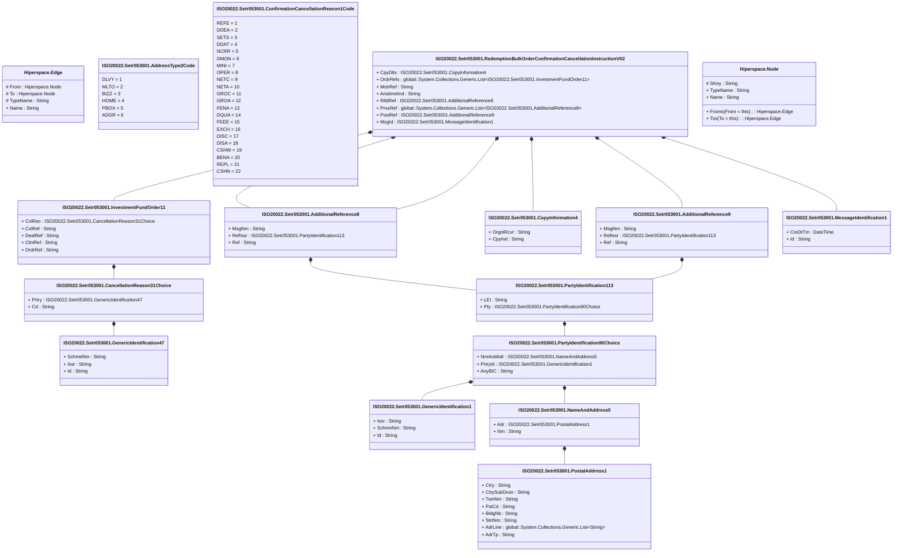

# setr.053.001.02

> The tables below contain descriptions of the members of each Element. 
> The first column indicates the type of the member:
> A ‘#’ indicates that the field is a key to the element, and a ‘+’ indicates that the field is a value.
> The ‘*’ column contains a description for the element member.  
> The ‘@’ column contains any properties for the member.
> The ‘=’ column contains calculated values; or in the case of an enum, the serialized value.

---

## View Hiperspace.Edge
edge between nodes

| |Name|Type|*|@|=|
|-|-|-|-|-|-|
|#|From|Hiperspace.Node||||
|#|To|Hiperspace.Node||||
|#|TypeName|String||||
|+|Name|String||||

---

## Value ISO20022.Setr053001.AdditionalReference8

| |Name|Type|*|@|=|
|-|-|-|-|-|-|
|+|MsgNm|String||XmlElement()||
|+|RefIssr|ISO20022.Setr053001.PartyIdentification113||XmlElement()||
|+|Ref|String||XmlElement()||
||Validation|Some(String)||XmlIgnore(), JsonIgnore()|validation(validElement(RefIssr))|

---

## Value ISO20022.Setr053001.AdditionalReference9

| |Name|Type|*|@|=|
|-|-|-|-|-|-|
|+|MsgNm|String||XmlElement()||
|+|RefIssr|ISO20022.Setr053001.PartyIdentification113||XmlElement()||
|+|Ref|String||XmlElement()||
||Validation|Some(String)||XmlIgnore(), JsonIgnore()|validation(validElement(RefIssr))|

---

## Enum ISO20022.Setr053001.AddressType2Code

| |Name|Type|*|@|=|
|-|-|-|-|-|-|
||DLVY|Int32||XmlEnum("""DLVY""")|1|
||MLTO|Int32||XmlEnum("""MLTO""")|2|
||BIZZ|Int32||XmlEnum("""BIZZ""")|3|
||HOME|Int32||XmlEnum("""HOME""")|4|
||PBOX|Int32||XmlEnum("""PBOX""")|5|
||ADDR|Int32||XmlEnum("""ADDR""")|6|

---

## Value ISO20022.Setr053001.CancellationReason31Choice

| |Name|Type|*|@|=|
|-|-|-|-|-|-|
|+|Prtry|ISO20022.Setr053001.GenericIdentification47||XmlElement()||
|+|Cd|String||XmlElement()||
||Validation|Some(String)||XmlIgnore(), JsonIgnore()|validation(validElement(Prtry),validChoice(Prtry,Cd))|

---

## Enum ISO20022.Setr053001.ConfirmationCancellationReason1Code

| |Name|Type|*|@|=|
|-|-|-|-|-|-|
||REFE|Int32||XmlEnum("""REFE""")|1|
||DDEA|Int32||XmlEnum("""DDEA""")|2|
||SETS|Int32||XmlEnum("""SETS""")|3|
||DDAT|Int32||XmlEnum("""DDAT""")|4|
||NCRR|Int32||XmlEnum("""NCRR""")|5|
||DMON|Int32||XmlEnum("""DMON""")|6|
||MINI|Int32||XmlEnum("""MINI""")|7|
||OPER|Int32||XmlEnum("""OPER""")|8|
||NETC|Int32||XmlEnum("""NETC""")|9|
||NETA|Int32||XmlEnum("""NETA""")|10|
||GROC|Int32||XmlEnum("""GROC""")|11|
||GROA|Int32||XmlEnum("""GROA""")|12|
||FENA|Int32||XmlEnum("""FENA""")|13|
||DQUA|Int32||XmlEnum("""DQUA""")|14|
||FEEE|Int32||XmlEnum("""FEEE""")|15|
||EXCH|Int32||XmlEnum("""EXCH""")|16|
||DISC|Int32||XmlEnum("""DISC""")|17|
||DISA|Int32||XmlEnum("""DISA""")|18|
||CSHW|Int32||XmlEnum("""CSHW""")|19|
||BENA|Int32||XmlEnum("""BENA""")|20|
||REPL|Int32||XmlEnum("""REPL""")|21|
||CSHN|Int32||XmlEnum("""CSHN""")|22|

---

## Value ISO20022.Setr053001.CopyInformation4

| |Name|Type|*|@|=|
|-|-|-|-|-|-|
|+|OrgnlRcvr|String||XmlElement()||
|+|CpyInd|String||XmlElement()||
||Validation|Some(String)||XmlIgnore(), JsonIgnore()|validation(validPattern("""OrgnlRcvr""",OrgnlRcvr,"""[A-Z]{6,6}[A-Z2-9][A-NP-Z0-9]([A-Z0-9]{3,3}){0,1}"""))|

---

## Type ISO20022.Setr053001.Document

| |Name|Type|*|@|=|
|-|-|-|-|-|-|
|+|RedBlkOrdrConfCxlInstr|ISO20022.Setr053001.RedemptionBulkOrderConfirmationCancellationInstructionV02||XmlElement()||
||Validation|Some(String)||XmlIgnore(), JsonIgnore()|validation(validElement(RedBlkOrdrConfCxlInstr))|

---

## Value ISO20022.Setr053001.GenericIdentification1

| |Name|Type|*|@|=|
|-|-|-|-|-|-|
|+|Issr|String||XmlElement()||
|+|SchmeNm|String||XmlElement()||
|+|Id|String||XmlElement()||
||Validation|Some(String)||XmlIgnore(), JsonIgnore()|""|

---

## Value ISO20022.Setr053001.GenericIdentification47

| |Name|Type|*|@|=|
|-|-|-|-|-|-|
|+|SchmeNm|String||XmlElement()||
|+|Issr|String||XmlElement()||
|+|Id|String||XmlElement()||
||Validation|Some(String)||XmlIgnore(), JsonIgnore()|validation(validPattern("""SchmeNm""",SchmeNm,"""[a-zA-Z0-9]{1,4}"""),validPattern("""Issr""",Issr,"""[a-zA-Z0-9]{1,4}"""),validPattern("""Id""",Id,"""[a-zA-Z0-9]{4}"""))|

---

## Value ISO20022.Setr053001.InvestmentFundOrder11

| |Name|Type|*|@|=|
|-|-|-|-|-|-|
|+|CxlRsn|ISO20022.Setr053001.CancellationReason31Choice||XmlElement()||
|+|CxlRef|String||XmlElement()||
|+|DealRef|String||XmlElement()||
|+|ClntRef|String||XmlElement()||
|+|OrdrRef|String||XmlElement()||
||Validation|Some(String)||XmlIgnore(), JsonIgnore()|validation(validElement(CxlRsn))|

---

## Value ISO20022.Setr053001.MessageIdentification1

| |Name|Type|*|@|=|
|-|-|-|-|-|-|
|+|CreDtTm|DateTime||XmlElement()||
|+|Id|String||XmlElement()||
||Validation|Some(String)||XmlIgnore(), JsonIgnore()|""|

---

## Value ISO20022.Setr053001.NameAndAddress5

| |Name|Type|*|@|=|
|-|-|-|-|-|-|
|+|Adr|ISO20022.Setr053001.PostalAddress1||XmlElement()||
|+|Nm|String||XmlElement()||
||Validation|Some(String)||XmlIgnore(), JsonIgnore()|validation(validElement(Adr))|

---

## Value ISO20022.Setr053001.PartyIdentification113

| |Name|Type|*|@|=|
|-|-|-|-|-|-|
|+|LEI|String||XmlElement()||
|+|Pty|ISO20022.Setr053001.PartyIdentification90Choice||XmlElement()||
||Validation|Some(String)||XmlIgnore(), JsonIgnore()|validation(validPattern("""LEI""",LEI,"""[A-Z0-9]{18,18}[0-9]{2,2}"""),validElement(Pty))|

---

## Value ISO20022.Setr053001.PartyIdentification90Choice

| |Name|Type|*|@|=|
|-|-|-|-|-|-|
|+|NmAndAdr|ISO20022.Setr053001.NameAndAddress5||XmlElement()||
|+|PrtryId|ISO20022.Setr053001.GenericIdentification1||XmlElement()||
|+|AnyBIC|String||XmlElement()||
||Validation|Some(String)||XmlIgnore(), JsonIgnore()|validation(validElement(NmAndAdr),validElement(PrtryId),validPattern("""AnyBIC""",AnyBIC,"""[A-Z]{6,6}[A-Z2-9][A-NP-Z0-9]([A-Z0-9]{3,3}){0,1}"""),validChoice(NmAndAdr,PrtryId,AnyBIC))|

---

## Value ISO20022.Setr053001.PostalAddress1

| |Name|Type|*|@|=|
|-|-|-|-|-|-|
|+|Ctry|String||XmlElement()||
|+|CtrySubDvsn|String||XmlElement()||
|+|TwnNm|String||XmlElement()||
|+|PstCd|String||XmlElement()||
|+|BldgNb|String||XmlElement()||
|+|StrtNm|String||XmlElement()||
|+|AdrLine|global::System.Collections.Generic.List<String>||XmlElement()||
|+|AdrTp|String||XmlElement()||
||Validation|Some(String)||XmlIgnore(), JsonIgnore()|validation(validPattern("""Ctry""",Ctry,"""[A-Z]{2,2}"""),validListMax("""AdrLine""",AdrLine,5))|

---

## Aspect ISO20022.Setr053001.RedemptionBulkOrderConfirmationCancellationInstructionV02

| |Name|Type|*|@|=|
|-|-|-|-|-|-|
|+|CpyDtls|ISO20022.Setr053001.CopyInformation4||XmlElement()||
|+|OrdrRefs|global::System.Collections.Generic.List<ISO20022.Setr053001.InvestmentFundOrder11>||XmlElement()||
|+|MstrRef|String||XmlElement()||
|+|AmdmntInd|String||XmlElement()||
|+|RltdRef|ISO20022.Setr053001.AdditionalReference8||XmlElement()||
|+|PrvsRef|global::System.Collections.Generic.List<ISO20022.Setr053001.AdditionalReference8>||XmlElement()||
|+|PoolRef|ISO20022.Setr053001.AdditionalReference9||XmlElement()||
|+|MsgId|ISO20022.Setr053001.MessageIdentification1||XmlElement()||
||Validation|Some(String)||XmlIgnore(), JsonIgnore()|validation(validElement(CpyDtls),validRequired("""OrdrRefs""",OrdrRefs),validList("""OrdrRefs""",OrdrRefs),validElement(OrdrRefs),validElement(RltdRef),validList("""PrvsRef""",PrvsRef),validElement(PrvsRef),validElement(PoolRef),validElement(MsgId))|

---

## View Hiperspace.Node
node in a graph view of data

| |Name|Type|*|@|=|
|-|-|-|-|-|-|
|#|SKey|String||||
|+|TypeName|String||||
|+|Name|String||||
||Froms|Hiperspace.Edge|||From = this|
||Tos|Hiperspace.Edge|||To = this|

