# setr.057.001.02-physical

```mermaid
classDiagram
    class ISO20022.Setr057001.Document {
        # Uri  : String
        + OrdrConfStsRpt () : ISO20022.Setr057001.OrderConfirmationStatusReportV02
        + Validation () = validation(validElement(OrdrConfStsRpt))
    }
    class ISO20022.Setr057001.OrderConfirmationStatusReportV02 {
        # owner  : ISO20022.Setr057001.Document
        + Xtnsn  : List~ISO20022.Setr057001.Extension1~
        + IndvOrdrConfDtlsRpt  : List~ISO20022.Setr057001.IndividualOrderConfirmationStatusAndReason2~
        + Ref  : ISO20022.Setr057001.References61Choice
        + MsgId  : ISO20022.Setr057001.MessageIdentification1
        + Validation () = validation(validList("""Xtnsn""",Xtnsn),validElement(Xtnsn),validRequired("""IndvOrdrConfDtlsRpt""",IndvOrdrConfDtlsRpt),validList("""IndvOrdrConfDtlsRpt""",IndvOrdrConfDtlsRpt),validElement(IndvOrdrConfDtlsRpt),validElement(Ref),validElement(MsgId))
    }
```

> The tables below contain descriptions of the members of each Element. 
> The first column indicates the type of the member:
> A ‘#’ indicates that the field is a key to the element, and a ‘+’ indicates that the field is a value.
> The ‘*’ column contains a description for the element member.  
> The ‘@’ column contains any properties for the member.
> The ‘=’ column contains calculated values; or in the case of an enum, the serialized value.

---

## EntityImpl ISO20022.Setr057001.Document

| |Name|Type|*|@|=|
|-|-|-|-|-|-|
|#|Uri|String||XmlIgnore(), JsonIgnore()||
|+|OrdrConfStsRpt|ISO20022.Setr057001.OrderConfirmationStatusReportV02||XmlElement()||
||Validation|Some(String)||XmlIgnore(), JsonIgnore()|validation(validElement(OrdrConfStsRpt))|

---

## AspectImpl ISO20022.Setr057001.OrderConfirmationStatusReportV02

| |Name|Type|*|@|=|
|-|-|-|-|-|-|
|#|owner|ISO20022.Setr057001.Document||||
|+|Xtnsn|List<ISO20022.Setr057001.Extension1>||XmlElement()||
|+|IndvOrdrConfDtlsRpt|List<ISO20022.Setr057001.IndividualOrderConfirmationStatusAndReason2>||XmlElement()||
|+|Ref|ISO20022.Setr057001.References61Choice||XmlElement()||
|+|MsgId|ISO20022.Setr057001.MessageIdentification1||XmlElement()||
||Validation|Some(String)||XmlIgnore(), JsonIgnore()|validation(validList("""Xtnsn""",Xtnsn),validElement(Xtnsn),validRequired("""IndvOrdrConfDtlsRpt""",IndvOrdrConfDtlsRpt),validList("""IndvOrdrConfDtlsRpt""",IndvOrdrConfDtlsRpt),validElement(IndvOrdrConfDtlsRpt),validElement(Ref),validElement(MsgId))|

