# setr.057.001.02

```mermaid
classDiagram
    class Hiperspace.Edge {
        # From  : Hiperspace.Node
        # To  : Hiperspace.Node
        # TypeName  : String
        + Name  : String
    }
    class ISO20022.Setr057001.AdditionalReference8 {
        + MsgNm  : String
        + RefIssr  : ISO20022.Setr057001.PartyIdentification113
        + Ref  : String
    }
    ISO20022.Setr057001.AdditionalReference8 *-- ISO20022.Setr057001.PartyIdentification113
    class ISO20022.Setr057001.AddressType2Code {
        DLVY = 1
        MLTO = 2
        BIZZ = 3
        HOME = 4
        PBOX = 5
        ADDR = 6
    }
    class ISO20022.Setr057001.AlternateSecurityIdentification7 {
        + IdSrc  : ISO20022.Setr057001.IdentificationSource1Choice
        + Id  : String
    }
    ISO20022.Setr057001.AlternateSecurityIdentification7 *-- ISO20022.Setr057001.IdentificationSource1Choice
    class ISO20022.Setr057001.ConfirmationRejectedReason1Choice {
        + Prtry  : ISO20022.Setr057001.GenericIdentification1
        + Cd  : String
    }
    ISO20022.Setr057001.ConfirmationRejectedReason1Choice *-- ISO20022.Setr057001.GenericIdentification1
    class ISO20022.Setr057001.ConfirmationRejectedStatus2 {
        + AddtlInf  : String
        + Rsn  : ISO20022.Setr057001.ConfirmationRejectedReason1Choice
    }
    ISO20022.Setr057001.ConfirmationRejectedStatus2 *-- ISO20022.Setr057001.ConfirmationRejectedReason1Choice
    class ISO20022.Setr057001.ConfirmationStatus1Choice {
        + Sts  : String
        + AmdmntRjctd  : global::System.Collections.Generic.List~ISO20022.Setr057001.ConfirmationRejectedStatus2~
        + ConfRjctd  : global::System.Collections.Generic.List~ISO20022.Setr057001.ConfirmationRejectedStatus2~
    }
    ISO20022.Setr057001.ConfirmationStatus1Choice *-- ISO20022.Setr057001.ConfirmationRejectedStatus2
    ISO20022.Setr057001.ConfirmationStatus1Choice *-- ISO20022.Setr057001.ConfirmationRejectedStatus2
    class ISO20022.Setr057001.DateFormat42Choice {
        + YrMnthDay  : DateTime
        + YrMnth  : String
    }
    class ISO20022.Setr057001.DistributionPolicy1Code {
        ACCU = 1
        DIST = 2
    }
    class ISO20022.Setr057001.Extension1 {
        + Txt  : String
        + PlcAndNm  : String
    }
    class ISO20022.Setr057001.FinancialInstrument57 {
        + SrsId  : ISO20022.Setr057001.Series1
        + PdctGrp  : String
        + DstrbtnPlcy  : String
        + SctiesForm  : String
        + ClssTp  : String
        + SplmtryId  : String
        + ShrtNm  : String
        + Nm  : String
        + Id  : ISO20022.Setr057001.SecurityIdentification25Choice
    }
    ISO20022.Setr057001.FinancialInstrument57 *-- ISO20022.Setr057001.Series1
    ISO20022.Setr057001.FinancialInstrument57 *-- ISO20022.Setr057001.SecurityIdentification25Choice
    class ISO20022.Setr057001.FormOfSecurity1Code {
        REGD = 1
        BEAR = 2
    }
    class ISO20022.Setr057001.GenericIdentification1 {
        + Issr  : String
        + SchmeNm  : String
        + Id  : String
    }
    class ISO20022.Setr057001.IdentificationSource1Choice {
        + Prtry  : String
        + Dmst  : String
    }
    class ISO20022.Setr057001.IndividualOrderConfirmationStatusAndReason2 {
        + FinInstrmDtls  : ISO20022.Setr057001.FinancialInstrument57
        + InvstmtAcctDtls  : ISO20022.Setr057001.InvestmentAccount58
        + StsInitr  : ISO20022.Setr057001.PartyIdentification113
        + DealRef  : String
        + ClntRef  : String
        + Conf  : ISO20022.Setr057001.ConfirmationStatus1Choice
        + OrdrRef  : String
        + MstrRef  : String
    }
    ISO20022.Setr057001.IndividualOrderConfirmationStatusAndReason2 *-- ISO20022.Setr057001.FinancialInstrument57
    ISO20022.Setr057001.IndividualOrderConfirmationStatusAndReason2 *-- ISO20022.Setr057001.InvestmentAccount58
    ISO20022.Setr057001.IndividualOrderConfirmationStatusAndReason2 *-- ISO20022.Setr057001.PartyIdentification113
    ISO20022.Setr057001.IndividualOrderConfirmationStatusAndReason2 *-- ISO20022.Setr057001.ConfirmationStatus1Choice
    class ISO20022.Setr057001.InvestmentAccount58 {
        + SubAcctDtls  : ISO20022.Setr057001.SubAccount6
        + OrdrOrgtrElgblty  : String
        + AcctSvcr  : ISO20022.Setr057001.PartyIdentification113
        + OwnrId  : global::System.Collections.Generic.List~ISO20022.Setr057001.PartyIdentification113~
        + AcctDsgnt  : String
        + AcctNm  : String
        + AcctId  : String
    }
    ISO20022.Setr057001.InvestmentAccount58 *-- ISO20022.Setr057001.SubAccount6
    ISO20022.Setr057001.InvestmentAccount58 *-- ISO20022.Setr057001.PartyIdentification113
    ISO20022.Setr057001.InvestmentAccount58 *-- ISO20022.Setr057001.PartyIdentification113
    class ISO20022.Setr057001.MessageIdentification1 {
        + CreDtTm  : DateTime
        + Id  : String
    }
    class ISO20022.Setr057001.NameAndAddress5 {
        + Adr  : ISO20022.Setr057001.PostalAddress1
        + Nm  : String
    }
    ISO20022.Setr057001.NameAndAddress5 *-- ISO20022.Setr057001.PostalAddress1
    class ISO20022.Setr057001.OrderConfirmationStatus1Code {
        CREC = 1
        COAC = 2
        CPNP = 3
        STNP = 4
    }
    class ISO20022.Setr057001.OrderConfirmationStatusReportV02 {
        + Xtnsn  : global::System.Collections.Generic.List~ISO20022.Setr057001.Extension1~
        + IndvOrdrConfDtlsRpt  : global::System.Collections.Generic.List~ISO20022.Setr057001.IndividualOrderConfirmationStatusAndReason2~
        + Ref  : ISO20022.Setr057001.References61Choice
        + MsgId  : ISO20022.Setr057001.MessageIdentification1
    }
    ISO20022.Setr057001.OrderConfirmationStatusReportV02 *-- ISO20022.Setr057001.Extension1
    ISO20022.Setr057001.OrderConfirmationStatusReportV02 *-- ISO20022.Setr057001.IndividualOrderConfirmationStatusAndReason2
    ISO20022.Setr057001.OrderConfirmationStatusReportV02 *-- ISO20022.Setr057001.References61Choice
    ISO20022.Setr057001.OrderConfirmationStatusReportV02 *-- ISO20022.Setr057001.MessageIdentification1
    class ISO20022.Setr057001.OrderOriginatorEligibility1Code {
        PROF = 1
        RETL = 2
        ELIG = 3
    }
    class ISO20022.Setr057001.PartyIdentification113 {
        + LEI  : String
        + Pty  : ISO20022.Setr057001.PartyIdentification90Choice
    }
    ISO20022.Setr057001.PartyIdentification113 *-- ISO20022.Setr057001.PartyIdentification90Choice
    class ISO20022.Setr057001.PartyIdentification90Choice {
        + NmAndAdr  : ISO20022.Setr057001.NameAndAddress5
        + PrtryId  : ISO20022.Setr057001.GenericIdentification1
        + AnyBIC  : String
    }
    ISO20022.Setr057001.PartyIdentification90Choice *-- ISO20022.Setr057001.NameAndAddress5
    ISO20022.Setr057001.PartyIdentification90Choice *-- ISO20022.Setr057001.GenericIdentification1
    class ISO20022.Setr057001.PostalAddress1 {
        + Ctry  : String
        + CtrySubDvsn  : String
        + TwnNm  : String
        + PstCd  : String
        + BldgNb  : String
        + StrtNm  : String
        + AdrLine  : global::System.Collections.Generic.List~String~
        + AdrTp  : String
    }
    class ISO20022.Setr057001.References61Choice {
        + OthrRef  : global::System.Collections.Generic.List~ISO20022.Setr057001.AdditionalReference8~
        + RltdRef  : global::System.Collections.Generic.List~ISO20022.Setr057001.AdditionalReference8~
    }
    ISO20022.Setr057001.References61Choice *-- ISO20022.Setr057001.AdditionalReference8
    ISO20022.Setr057001.References61Choice *-- ISO20022.Setr057001.AdditionalReference8
    class ISO20022.Setr057001.RejectedConfirmationStatusReason1Code {
        ALAT = 1
        NATA = 2
        MTAX = 3
        MCHA = 4
        MCOM = 5
        MEUT = 6
        NSLA = 7
        DDAT = 8
        DMON = 9
        ICTR = 10
        IDIN = 11
        IDCU = 12
        ICAG = 13
        IRIN = 14
        IRCU = 15
        IVAG = 16
        DREF = 17
        ULNK = 18
        DORF = 19
        DLID = 20
        DPRA = 21
        DPSA = 22
        DACO = 23
        DACI = 24
        DTSA = 25
        DTRA = 26
        DIMD = 27
        DEXD = 28
        DSDT = 29
        DSAM = 30
        DPID = 31
        DSCA = 32
        DPDD = 33
        DTAD = 34
        DXOD = 35
        DCHD = 36
        DFXD = 37
        DNAV = 38
        DRSC = 39
        DPDI = 40
        DARR = 41
        DLIR = 42
        DINP = 43
        DGRP = 44
        DHRR = 45
        DGAM = 46
        DNAM = 47
        DROU = 48
        DORT = 49
        DUNB = 50
        DCXR = 51
        DORD = 52
        DPTD = 53
        DBEN = 54
        DFIN = 55
        DSAF = 56
    }
    class ISO20022.Setr057001.SecurityIdentification25Choice {
        + OthrPrtryId  : ISO20022.Setr057001.AlternateSecurityIdentification7
        + Cmon  : String
        + Belgn  : String
        + SCVM  : String
        + Vlrn  : String
        + Dtch  : String
        + Wrtppr  : String
        + QUICK  : String
        + CTA  : String
        + Blmbrg  : String
        + TckrSymb  : String
        + RIC  : String
        + CUSIP  : String
        + SEDOL  : String
        + ISIN  : String
    }
    ISO20022.Setr057001.SecurityIdentification25Choice *-- ISO20022.Setr057001.AlternateSecurityIdentification7
    class ISO20022.Setr057001.Series1 {
        + SrsNm  : String
        + SrsDt  : ISO20022.Setr057001.DateFormat42Choice
    }
    ISO20022.Setr057001.Series1 *-- ISO20022.Setr057001.DateFormat42Choice
    class ISO20022.Setr057001.SubAccount6 {
        + AcctDsgnt  : String
        + Chrtc  : String
        + Nm  : String
        + Id  : String
    }
    class Hiperspace.Node {
        # SKey  : String
        + TypeName  : String
        + Name  : String
        + Froms (From = this) : Hiperspace.Edge
        + Tos (To = this) : Hiperspace.Edge
    }
```

> The tables below contain descriptions of the members of each Element. 
> The first column indicates the type of the member:
> A ‘#’ indicates that the field is a key to the element, and a ‘+’ indicates that the field is a value.
> The ‘*’ column contains a description for the element member.  
> The ‘@’ column contains any properties for the member.
> The ‘=’ column contains calculated values; or in the case of an enum, the serialized value.

---

## View Hiperspace.Edge
edge between nodes

| |Name|Type|*|@|=|
|-|-|-|-|-|-|
|#|From|Hiperspace.Node||||
|#|To|Hiperspace.Node||||
|#|TypeName|String||||
|+|Name|String||||

---

## Value ISO20022.Setr057001.AdditionalReference8

| |Name|Type|*|@|=|
|-|-|-|-|-|-|
|+|MsgNm|String||XmlElement()||
|+|RefIssr|ISO20022.Setr057001.PartyIdentification113||XmlElement()||
|+|Ref|String||XmlElement()||
||Validation|Some(String)||XmlIgnore(), JsonIgnore()|validation(validElement(RefIssr))|

---

## Enum ISO20022.Setr057001.AddressType2Code

| |Name|Type|*|@|=|
|-|-|-|-|-|-|
||DLVY|Int32||XmlEnum("""DLVY""")|1|
||MLTO|Int32||XmlEnum("""MLTO""")|2|
||BIZZ|Int32||XmlEnum("""BIZZ""")|3|
||HOME|Int32||XmlEnum("""HOME""")|4|
||PBOX|Int32||XmlEnum("""PBOX""")|5|
||ADDR|Int32||XmlEnum("""ADDR""")|6|

---

## Value ISO20022.Setr057001.AlternateSecurityIdentification7

| |Name|Type|*|@|=|
|-|-|-|-|-|-|
|+|IdSrc|ISO20022.Setr057001.IdentificationSource1Choice||XmlElement()||
|+|Id|String||XmlElement()||
||Validation|Some(String)||XmlIgnore(), JsonIgnore()|validation(validElement(IdSrc))|

---

## Value ISO20022.Setr057001.ConfirmationRejectedReason1Choice

| |Name|Type|*|@|=|
|-|-|-|-|-|-|
|+|Prtry|ISO20022.Setr057001.GenericIdentification1||XmlElement()||
|+|Cd|String||XmlElement()||
||Validation|Some(String)||XmlIgnore(), JsonIgnore()|validation(validElement(Prtry),validChoice(Prtry,Cd))|

---

## Value ISO20022.Setr057001.ConfirmationRejectedStatus2

| |Name|Type|*|@|=|
|-|-|-|-|-|-|
|+|AddtlInf|String||XmlElement()||
|+|Rsn|ISO20022.Setr057001.ConfirmationRejectedReason1Choice||XmlElement()||
||Validation|Some(String)||XmlIgnore(), JsonIgnore()|validation(validElement(Rsn))|

---

## Value ISO20022.Setr057001.ConfirmationStatus1Choice

| |Name|Type|*|@|=|
|-|-|-|-|-|-|
|+|Sts|String||XmlElement()||
|+|AmdmntRjctd|global::System.Collections.Generic.List<ISO20022.Setr057001.ConfirmationRejectedStatus2>||XmlElement()||
|+|ConfRjctd|global::System.Collections.Generic.List<ISO20022.Setr057001.ConfirmationRejectedStatus2>||XmlElement()||
||Validation|Some(String)||XmlIgnore(), JsonIgnore()|validation(validRequired("""AmdmntRjctd""",AmdmntRjctd),validList("""AmdmntRjctd""",AmdmntRjctd),validListMax("""AmdmntRjctd""",AmdmntRjctd,10),validElement(AmdmntRjctd),validRequired("""ConfRjctd""",ConfRjctd),validList("""ConfRjctd""",ConfRjctd),validListMax("""ConfRjctd""",ConfRjctd,10),validElement(ConfRjctd),validChoice(Sts,AmdmntRjctd,ConfRjctd))|

---

## Value ISO20022.Setr057001.DateFormat42Choice

| |Name|Type|*|@|=|
|-|-|-|-|-|-|
|+|YrMnthDay|DateTime||XmlElement()||
|+|YrMnth|String||XmlElement()||
||Validation|Some(String)||XmlIgnore(), JsonIgnore()|validation(validChoice(YrMnthDay,YrMnth))|

---

## Enum ISO20022.Setr057001.DistributionPolicy1Code

| |Name|Type|*|@|=|
|-|-|-|-|-|-|
||ACCU|Int32||XmlEnum("""ACCU""")|1|
||DIST|Int32||XmlEnum("""DIST""")|2|

---

## Type ISO20022.Setr057001.Document

| |Name|Type|*|@|=|
|-|-|-|-|-|-|
|+|OrdrConfStsRpt|ISO20022.Setr057001.OrderConfirmationStatusReportV02||XmlElement()||
||Validation|Some(String)||XmlIgnore(), JsonIgnore()|validation(validElement(OrdrConfStsRpt))|

---

## Value ISO20022.Setr057001.Extension1

| |Name|Type|*|@|=|
|-|-|-|-|-|-|
|+|Txt|String||XmlElement()||
|+|PlcAndNm|String||XmlElement()||
||Validation|Some(String)||XmlIgnore(), JsonIgnore()|""|

---

## Value ISO20022.Setr057001.FinancialInstrument57

| |Name|Type|*|@|=|
|-|-|-|-|-|-|
|+|SrsId|ISO20022.Setr057001.Series1||XmlElement()||
|+|PdctGrp|String||XmlElement()||
|+|DstrbtnPlcy|String||XmlElement()||
|+|SctiesForm|String||XmlElement()||
|+|ClssTp|String||XmlElement()||
|+|SplmtryId|String||XmlElement()||
|+|ShrtNm|String||XmlElement()||
|+|Nm|String||XmlElement()||
|+|Id|ISO20022.Setr057001.SecurityIdentification25Choice||XmlElement()||
||Validation|Some(String)||XmlIgnore(), JsonIgnore()|validation(validElement(SrsId),validElement(Id))|

---

## Enum ISO20022.Setr057001.FormOfSecurity1Code

| |Name|Type|*|@|=|
|-|-|-|-|-|-|
||REGD|Int32||XmlEnum("""REGD""")|1|
||BEAR|Int32||XmlEnum("""BEAR""")|2|

---

## Value ISO20022.Setr057001.GenericIdentification1

| |Name|Type|*|@|=|
|-|-|-|-|-|-|
|+|Issr|String||XmlElement()||
|+|SchmeNm|String||XmlElement()||
|+|Id|String||XmlElement()||
||Validation|Some(String)||XmlIgnore(), JsonIgnore()|""|

---

## Value ISO20022.Setr057001.IdentificationSource1Choice

| |Name|Type|*|@|=|
|-|-|-|-|-|-|
|+|Prtry|String||XmlElement()||
|+|Dmst|String||XmlElement()||
||Validation|Some(String)||XmlIgnore(), JsonIgnore()|validation(validPattern("""Dmst""",Dmst,"""[A-Z]{2,2}"""),validChoice(Prtry,Dmst))|

---

## Value ISO20022.Setr057001.IndividualOrderConfirmationStatusAndReason2

| |Name|Type|*|@|=|
|-|-|-|-|-|-|
|+|FinInstrmDtls|ISO20022.Setr057001.FinancialInstrument57||XmlElement()||
|+|InvstmtAcctDtls|ISO20022.Setr057001.InvestmentAccount58||XmlElement()||
|+|StsInitr|ISO20022.Setr057001.PartyIdentification113||XmlElement()||
|+|DealRef|String||XmlElement()||
|+|ClntRef|String||XmlElement()||
|+|Conf|ISO20022.Setr057001.ConfirmationStatus1Choice||XmlElement()||
|+|OrdrRef|String||XmlElement()||
|+|MstrRef|String||XmlElement()||
||Validation|Some(String)||XmlIgnore(), JsonIgnore()|validation(validElement(FinInstrmDtls),validElement(InvstmtAcctDtls),validElement(StsInitr),validElement(Conf))|

---

## Value ISO20022.Setr057001.InvestmentAccount58

| |Name|Type|*|@|=|
|-|-|-|-|-|-|
|+|SubAcctDtls|ISO20022.Setr057001.SubAccount6||XmlElement()||
|+|OrdrOrgtrElgblty|String||XmlElement()||
|+|AcctSvcr|ISO20022.Setr057001.PartyIdentification113||XmlElement()||
|+|OwnrId|global::System.Collections.Generic.List<ISO20022.Setr057001.PartyIdentification113>||XmlElement()||
|+|AcctDsgnt|String||XmlElement()||
|+|AcctNm|String||XmlElement()||
|+|AcctId|String||XmlElement()||
||Validation|Some(String)||XmlIgnore(), JsonIgnore()|validation(validElement(SubAcctDtls),validElement(AcctSvcr),validList("""OwnrId""",OwnrId),validElement(OwnrId))|

---

## Value ISO20022.Setr057001.MessageIdentification1

| |Name|Type|*|@|=|
|-|-|-|-|-|-|
|+|CreDtTm|DateTime||XmlElement()||
|+|Id|String||XmlElement()||
||Validation|Some(String)||XmlIgnore(), JsonIgnore()|""|

---

## Value ISO20022.Setr057001.NameAndAddress5

| |Name|Type|*|@|=|
|-|-|-|-|-|-|
|+|Adr|ISO20022.Setr057001.PostalAddress1||XmlElement()||
|+|Nm|String||XmlElement()||
||Validation|Some(String)||XmlIgnore(), JsonIgnore()|validation(validElement(Adr))|

---

## Enum ISO20022.Setr057001.OrderConfirmationStatus1Code

| |Name|Type|*|@|=|
|-|-|-|-|-|-|
||CREC|Int32||XmlEnum("""CREC""")|1|
||COAC|Int32||XmlEnum("""COAC""")|2|
||CPNP|Int32||XmlEnum("""CPNP""")|3|
||STNP|Int32||XmlEnum("""STNP""")|4|

---

## Aspect ISO20022.Setr057001.OrderConfirmationStatusReportV02

| |Name|Type|*|@|=|
|-|-|-|-|-|-|
|+|Xtnsn|global::System.Collections.Generic.List<ISO20022.Setr057001.Extension1>||XmlElement()||
|+|IndvOrdrConfDtlsRpt|global::System.Collections.Generic.List<ISO20022.Setr057001.IndividualOrderConfirmationStatusAndReason2>||XmlElement()||
|+|Ref|ISO20022.Setr057001.References61Choice||XmlElement()||
|+|MsgId|ISO20022.Setr057001.MessageIdentification1||XmlElement()||
||Validation|Some(String)||XmlIgnore(), JsonIgnore()|validation(validList("""Xtnsn""",Xtnsn),validElement(Xtnsn),validRequired("""IndvOrdrConfDtlsRpt""",IndvOrdrConfDtlsRpt),validList("""IndvOrdrConfDtlsRpt""",IndvOrdrConfDtlsRpt),validElement(IndvOrdrConfDtlsRpt),validElement(Ref),validElement(MsgId))|

---

## Enum ISO20022.Setr057001.OrderOriginatorEligibility1Code

| |Name|Type|*|@|=|
|-|-|-|-|-|-|
||PROF|Int32||XmlEnum("""PROF""")|1|
||RETL|Int32||XmlEnum("""RETL""")|2|
||ELIG|Int32||XmlEnum("""ELIG""")|3|

---

## Value ISO20022.Setr057001.PartyIdentification113

| |Name|Type|*|@|=|
|-|-|-|-|-|-|
|+|LEI|String||XmlElement()||
|+|Pty|ISO20022.Setr057001.PartyIdentification90Choice||XmlElement()||
||Validation|Some(String)||XmlIgnore(), JsonIgnore()|validation(validPattern("""LEI""",LEI,"""[A-Z0-9]{18,18}[0-9]{2,2}"""),validElement(Pty))|

---

## Value ISO20022.Setr057001.PartyIdentification90Choice

| |Name|Type|*|@|=|
|-|-|-|-|-|-|
|+|NmAndAdr|ISO20022.Setr057001.NameAndAddress5||XmlElement()||
|+|PrtryId|ISO20022.Setr057001.GenericIdentification1||XmlElement()||
|+|AnyBIC|String||XmlElement()||
||Validation|Some(String)||XmlIgnore(), JsonIgnore()|validation(validElement(NmAndAdr),validElement(PrtryId),validPattern("""AnyBIC""",AnyBIC,"""[A-Z]{6,6}[A-Z2-9][A-NP-Z0-9]([A-Z0-9]{3,3}){0,1}"""),validChoice(NmAndAdr,PrtryId,AnyBIC))|

---

## Value ISO20022.Setr057001.PostalAddress1

| |Name|Type|*|@|=|
|-|-|-|-|-|-|
|+|Ctry|String||XmlElement()||
|+|CtrySubDvsn|String||XmlElement()||
|+|TwnNm|String||XmlElement()||
|+|PstCd|String||XmlElement()||
|+|BldgNb|String||XmlElement()||
|+|StrtNm|String||XmlElement()||
|+|AdrLine|global::System.Collections.Generic.List<String>||XmlElement()||
|+|AdrTp|String||XmlElement()||
||Validation|Some(String)||XmlIgnore(), JsonIgnore()|validation(validPattern("""Ctry""",Ctry,"""[A-Z]{2,2}"""),validListMax("""AdrLine""",AdrLine,5))|

---

## Value ISO20022.Setr057001.References61Choice

| |Name|Type|*|@|=|
|-|-|-|-|-|-|
|+|OthrRef|global::System.Collections.Generic.List<ISO20022.Setr057001.AdditionalReference8>||XmlElement()||
|+|RltdRef|global::System.Collections.Generic.List<ISO20022.Setr057001.AdditionalReference8>||XmlElement()||
||Validation|Some(String)||XmlIgnore(), JsonIgnore()|validation(validRequired("""OthrRef""",OthrRef),validList("""OthrRef""",OthrRef),validListMax("""OthrRef""",OthrRef,2),validElement(OthrRef),validRequired("""RltdRef""",RltdRef),validList("""RltdRef""",RltdRef),validListMax("""RltdRef""",RltdRef,2),validElement(RltdRef),validChoice(OthrRef,RltdRef))|

---

## Enum ISO20022.Setr057001.RejectedConfirmationStatusReason1Code

| |Name|Type|*|@|=|
|-|-|-|-|-|-|
||ALAT|Int32||XmlEnum("""ALAT""")|1|
||NATA|Int32||XmlEnum("""NATA""")|2|
||MTAX|Int32||XmlEnum("""MTAX""")|3|
||MCHA|Int32||XmlEnum("""MCHA""")|4|
||MCOM|Int32||XmlEnum("""MCOM""")|5|
||MEUT|Int32||XmlEnum("""MEUT""")|6|
||NSLA|Int32||XmlEnum("""NSLA""")|7|
||DDAT|Int32||XmlEnum("""DDAT""")|8|
||DMON|Int32||XmlEnum("""DMON""")|9|
||ICTR|Int32||XmlEnum("""ICTR""")|10|
||IDIN|Int32||XmlEnum("""IDIN""")|11|
||IDCU|Int32||XmlEnum("""IDCU""")|12|
||ICAG|Int32||XmlEnum("""ICAG""")|13|
||IRIN|Int32||XmlEnum("""IRIN""")|14|
||IRCU|Int32||XmlEnum("""IRCU""")|15|
||IVAG|Int32||XmlEnum("""IVAG""")|16|
||DREF|Int32||XmlEnum("""DREF""")|17|
||ULNK|Int32||XmlEnum("""ULNK""")|18|
||DORF|Int32||XmlEnum("""DORF""")|19|
||DLID|Int32||XmlEnum("""DLID""")|20|
||DPRA|Int32||XmlEnum("""DPRA""")|21|
||DPSA|Int32||XmlEnum("""DPSA""")|22|
||DACO|Int32||XmlEnum("""DACO""")|23|
||DACI|Int32||XmlEnum("""DACI""")|24|
||DTSA|Int32||XmlEnum("""DTSA""")|25|
||DTRA|Int32||XmlEnum("""DTRA""")|26|
||DIMD|Int32||XmlEnum("""DIMD""")|27|
||DEXD|Int32||XmlEnum("""DEXD""")|28|
||DSDT|Int32||XmlEnum("""DSDT""")|29|
||DSAM|Int32||XmlEnum("""DSAM""")|30|
||DPID|Int32||XmlEnum("""DPID""")|31|
||DSCA|Int32||XmlEnum("""DSCA""")|32|
||DPDD|Int32||XmlEnum("""DPDD""")|33|
||DTAD|Int32||XmlEnum("""DTAD""")|34|
||DXOD|Int32||XmlEnum("""DXOD""")|35|
||DCHD|Int32||XmlEnum("""DCHD""")|36|
||DFXD|Int32||XmlEnum("""DFXD""")|37|
||DNAV|Int32||XmlEnum("""DNAV""")|38|
||DRSC|Int32||XmlEnum("""DRSC""")|39|
||DPDI|Int32||XmlEnum("""DPDI""")|40|
||DARR|Int32||XmlEnum("""DARR""")|41|
||DLIR|Int32||XmlEnum("""DLIR""")|42|
||DINP|Int32||XmlEnum("""DINP""")|43|
||DGRP|Int32||XmlEnum("""DGRP""")|44|
||DHRR|Int32||XmlEnum("""DHRR""")|45|
||DGAM|Int32||XmlEnum("""DGAM""")|46|
||DNAM|Int32||XmlEnum("""DNAM""")|47|
||DROU|Int32||XmlEnum("""DROU""")|48|
||DORT|Int32||XmlEnum("""DORT""")|49|
||DUNB|Int32||XmlEnum("""DUNB""")|50|
||DCXR|Int32||XmlEnum("""DCXR""")|51|
||DORD|Int32||XmlEnum("""DORD""")|52|
||DPTD|Int32||XmlEnum("""DPTD""")|53|
||DBEN|Int32||XmlEnum("""DBEN""")|54|
||DFIN|Int32||XmlEnum("""DFIN""")|55|
||DSAF|Int32||XmlEnum("""DSAF""")|56|

---

## Value ISO20022.Setr057001.SecurityIdentification25Choice

| |Name|Type|*|@|=|
|-|-|-|-|-|-|
|+|OthrPrtryId|ISO20022.Setr057001.AlternateSecurityIdentification7||XmlElement()||
|+|Cmon|String||XmlElement()||
|+|Belgn|String||XmlElement()||
|+|SCVM|String||XmlElement()||
|+|Vlrn|String||XmlElement()||
|+|Dtch|String||XmlElement()||
|+|Wrtppr|String||XmlElement()||
|+|QUICK|String||XmlElement()||
|+|CTA|String||XmlElement()||
|+|Blmbrg|String||XmlElement()||
|+|TckrSymb|String||XmlElement()||
|+|RIC|String||XmlElement()||
|+|CUSIP|String||XmlElement()||
|+|SEDOL|String||XmlElement()||
|+|ISIN|String||XmlElement()||
||Validation|Some(String)||XmlIgnore(), JsonIgnore()|validation(validElement(OthrPrtryId),validPattern("""Blmbrg""",Blmbrg,"""(BBG)[BCDFGHJKLMNPQRSTVWXYZ\d]{8}\d"""),validPattern("""ISIN""",ISIN,"""[A-Z]{2,2}[A-Z0-9]{9,9}[0-9]{1,1}"""),validChoice(OthrPrtryId,Cmon,Belgn,SCVM,Vlrn,Dtch,Wrtppr,QUICK,CTA,Blmbrg,TckrSymb,RIC,CUSIP,SEDOL,ISIN))|

---

## Value ISO20022.Setr057001.Series1

| |Name|Type|*|@|=|
|-|-|-|-|-|-|
|+|SrsNm|String||XmlElement()||
|+|SrsDt|ISO20022.Setr057001.DateFormat42Choice||XmlElement()||
||Validation|Some(String)||XmlIgnore(), JsonIgnore()|validation(validElement(SrsDt))|

---

## Value ISO20022.Setr057001.SubAccount6

| |Name|Type|*|@|=|
|-|-|-|-|-|-|
|+|AcctDsgnt|String||XmlElement()||
|+|Chrtc|String||XmlElement()||
|+|Nm|String||XmlElement()||
|+|Id|String||XmlElement()||
||Validation|Some(String)||XmlIgnore(), JsonIgnore()|""|

---

## View Hiperspace.Node
node in a graph view of data

| |Name|Type|*|@|=|
|-|-|-|-|-|-|
|#|SKey|String||||
|+|TypeName|String||||
|+|Name|String||||
||Froms|Hiperspace.Edge|||From = this|
||Tos|Hiperspace.Edge|||To = this|

