# tsin.001.001.01

```mermaid
classDiagram
    class Hiperspace.Edge {
        # From  : Hiperspace.Node
        # To  : Hiperspace.Node
        # TypeName  : String
        + Name  : String
    }
    class ISO20022.Tsin001001.AccountIdentification3Choice {
        + PrtryAcct  : ISO20022.Tsin001001.SimpleIdentificationInformation2
        + UPIC  : String
        + BBAN  : String
        + IBAN  : String
    }
    ISO20022.Tsin001001.AccountIdentification3Choice *-- ISO20022.Tsin001001.SimpleIdentificationInformation2
    class ISO20022.Tsin001001.ActiveCurrencyAndAmount {
        + Value  : Decimal
        + Ccy  : String
    }
    class ISO20022.Tsin001001.AdditionalInformation1 {
        + InfVal  : String
        + InfTp  : ISO20022.Tsin001001.InformationType1Choice
    }
    ISO20022.Tsin001001.AdditionalInformation1 *-- ISO20022.Tsin001001.InformationType1Choice
    class ISO20022.Tsin001001.AddressType2Code {
        DLVY = 1
        MLTO = 2
        BIZZ = 3
        HOME = 4
        PBOX = 5
        ADDR = 6
    }
    class ISO20022.Tsin001001.Adjustment5 {
        + Amt  : ISO20022.Tsin001001.ActiveCurrencyAndAmount
        + Drctn  : String
    }
    ISO20022.Tsin001001.Adjustment5 *-- ISO20022.Tsin001001.ActiveCurrencyAndAmount
    class ISO20022.Tsin001001.AdjustmentDirection1Code {
        SUBS = 1
        ADDD = 2
    }
    class ISO20022.Tsin001001.AgreementClauses1 {
        + DocURL  : String
        + Desc  : String
    }
    class ISO20022.Tsin001001.CashAccount7 {
        + Nm  : String
        + Ccy  : String
        + Tp  : ISO20022.Tsin001001.CashAccountType2
        + Id  : ISO20022.Tsin001001.AccountIdentification3Choice
    }
    ISO20022.Tsin001001.CashAccount7 *-- ISO20022.Tsin001001.CashAccountType2
    ISO20022.Tsin001001.CashAccount7 *-- ISO20022.Tsin001001.AccountIdentification3Choice
    class ISO20022.Tsin001001.CashAccountType2 {
        + Prtry  : String
        + Cd  : String
    }
    class ISO20022.Tsin001001.CashAccountType4Code {
        ODFT = 1
        SLRY = 2
        LOAN = 3
        MOMA = 4
        NREX = 5
        MGLD = 6
        ONDP = 7
        SVGS = 8
        CACC = 9
        SACC = 10
        TRAS = 11
        CISH = 12
        TAXE = 13
        COMM = 14
        CHAR = 15
        CASH = 16
    }
    class ISO20022.Tsin001001.ClearingSystemMemberIdentification2Choice {
        + OthrClrCdId  : String
        + PLKNR  : String
        + GRHEBIC  : String
        + INIFSC  : String
        + AUBSBs  : String
        + AUBSBx  : String
        + HKNCC  : String
        + ZANCC  : String
        + ESNCC  : String
        + DEBLZ  : String
        + CHSIC  : String
        + CACPA  : String
        + ATBLZ  : String
        + ITNCC  : String
        + RUCB  : String
        + PTNCC  : String
        + USFW  : String
        + CHBC  : String
        + USCH  : String
        + GBSC  : String
        + IENSC  : String
        + NZNCC  : String
        + USCHU  : String
    }
    class ISO20022.Tsin001001.ContactIdentification1 {
        + EmailAdr  : String
        + FaxNb  : String
        + PhneNb  : String
        + Role  : String
        + GvnNm  : String
        + NmPrfx  : String
        + Nm  : String
    }
    class ISO20022.Tsin001001.DateAndPlaceOfBirth {
        + CtryOfBirth  : String
        + CityOfBirth  : String
        + PrvcOfBirth  : String
        + BirthDt  : DateTime
    }
    class ISO20022.Tsin001001.DocumentGeneralInformation1 {
        + URL  : String
        + IsseDt  : DateTime
        + SndrRcvrSeqId  : String
        + DocNb  : String
        + DocTp  : String
    }
    class ISO20022.Tsin001001.DocumentType2Code {
        DISP = 1
        SOAC = 2
        CMCN = 3
        SBIN = 4
        HIRI = 5
        DEBN = 6
        CREN = 7
        CINV = 8
        DNFA = 9
        CNFA = 10
        MSIN = 11
    }
    class ISO20022.Tsin001001.DocumentType4Code {
        CINV = 1
    }
    class ISO20022.Tsin001001.FinancialInstitutionIdentification6 {
        + BIC  : String
        + PrtryId  : ISO20022.Tsin001001.GenericIdentification4
        + ClrSysMmbId  : ISO20022.Tsin001001.ClearingSystemMemberIdentification2Choice
    }
    ISO20022.Tsin001001.FinancialInstitutionIdentification6 *-- ISO20022.Tsin001001.GenericIdentification4
    ISO20022.Tsin001001.FinancialInstitutionIdentification6 *-- ISO20022.Tsin001001.ClearingSystemMemberIdentification2Choice
    class ISO20022.Tsin001001.FinancingRateOrAmountChoice {
        + Rate  : Decimal
        + Amt  : ISO20022.Tsin001001.ActiveCurrencyAndAmount
    }
    ISO20022.Tsin001001.FinancingRateOrAmountChoice *-- ISO20022.Tsin001001.ActiveCurrencyAndAmount
    class ISO20022.Tsin001001.GenericIdentification3 {
        + Issr  : String
        + Id  : String
    }
    class ISO20022.Tsin001001.GenericIdentification4 {
        + IdTp  : String
        + Id  : String
    }
    class ISO20022.Tsin001001.InformationType1Choice {
        + Prtry  : String
        + Cd  : String
    }
    class ISO20022.Tsin001001.InformationType1Code {
        RELY = 1
        INST = 2
    }
    class ISO20022.Tsin001001.Instalment1 {
        + Amt  : ISO20022.Tsin001001.ActiveCurrencyAndAmount
        + PmtDueDt  : DateTime
        + SeqId  : String
    }
    ISO20022.Tsin001001.Instalment1 *-- ISO20022.Tsin001001.ActiveCurrencyAndAmount
    class ISO20022.Tsin001001.InvoiceFinancingRequestV01 {
        + InvcReqInf  : global::System.Collections.Generic.List~ISO20022.Tsin001001.InvoiceRequestInformation1~
        + ReqGrpInf  : ISO20022.Tsin001001.RequestGroupInformation1
    }
    ISO20022.Tsin001001.InvoiceFinancingRequestV01 *-- ISO20022.Tsin001001.InvoiceRequestInformation1
    ISO20022.Tsin001001.InvoiceFinancingRequestV01 *-- ISO20022.Tsin001001.RequestGroupInformation1
    class ISO20022.Tsin001001.InvoiceRequestInformation1 {
        + RfrdDoc  : global::System.Collections.Generic.List~ISO20022.Tsin001001.ReferredDocumentInformation2~
        + InvcPmtInf  : ISO20022.Tsin001001.PaymentInformation15
        + Buyr  : ISO20022.Tsin001001.PartyIdentificationAndContactInformation1
        + Spplr  : ISO20022.Tsin001001.PartyAndAccountIdentificationAndContactInformation1
        + ReqdAmt  : ISO20022.Tsin001001.FinancingRateOrAmountChoice
        + InstlmtInf  : global::System.Collections.Generic.List~ISO20022.Tsin001001.Instalment1~
        + CdtDbtNoteAmt  : ISO20022.Tsin001001.ActiveCurrencyAndAmount
        + InvcTtlsInf  : ISO20022.Tsin001001.InvoiceTotals1
        + InvcGnlInf  : ISO20022.Tsin001001.DocumentGeneralInformation1
    }
    ISO20022.Tsin001001.InvoiceRequestInformation1 *-- ISO20022.Tsin001001.ReferredDocumentInformation2
    ISO20022.Tsin001001.InvoiceRequestInformation1 *-- ISO20022.Tsin001001.PaymentInformation15
    ISO20022.Tsin001001.InvoiceRequestInformation1 *-- ISO20022.Tsin001001.PartyIdentificationAndContactInformation1
    ISO20022.Tsin001001.InvoiceRequestInformation1 *-- ISO20022.Tsin001001.PartyAndAccountIdentificationAndContactInformation1
    ISO20022.Tsin001001.InvoiceRequestInformation1 *-- ISO20022.Tsin001001.FinancingRateOrAmountChoice
    ISO20022.Tsin001001.InvoiceRequestInformation1 *-- ISO20022.Tsin001001.Instalment1
    ISO20022.Tsin001001.InvoiceRequestInformation1 *-- ISO20022.Tsin001001.ActiveCurrencyAndAmount
    ISO20022.Tsin001001.InvoiceRequestInformation1 *-- ISO20022.Tsin001001.InvoiceTotals1
    ISO20022.Tsin001001.InvoiceRequestInformation1 *-- ISO20022.Tsin001001.DocumentGeneralInformation1
    class ISO20022.Tsin001001.InvoiceTotals1 {
        + PmtDueDt  : DateTime
        + TtlInvcAmt  : ISO20022.Tsin001001.ActiveCurrencyAndAmount
        + Adjstmnt  : ISO20022.Tsin001001.Adjustment5
        + TtlTaxAmt  : ISO20022.Tsin001001.ActiveCurrencyAndAmount
        + TtlTaxblAmt  : ISO20022.Tsin001001.ActiveCurrencyAndAmount
    }
    ISO20022.Tsin001001.InvoiceTotals1 *-- ISO20022.Tsin001001.ActiveCurrencyAndAmount
    ISO20022.Tsin001001.InvoiceTotals1 *-- ISO20022.Tsin001001.Adjustment5
    ISO20022.Tsin001001.InvoiceTotals1 *-- ISO20022.Tsin001001.ActiveCurrencyAndAmount
    ISO20022.Tsin001001.InvoiceTotals1 *-- ISO20022.Tsin001001.ActiveCurrencyAndAmount
    class ISO20022.Tsin001001.NamePrefix1Code {
        MADM = 1
        MISS = 2
        MIST = 3
        DOCT = 4
    }
    class ISO20022.Tsin001001.OrganisationIdentification2 {
        + PrtryId  : ISO20022.Tsin001001.GenericIdentification3
        + TaxIdNb  : String
        + BkPtyId  : String
        + DUNS  : String
        + USCHU  : String
        + EANGLN  : String
        + BEI  : String
        + IBEI  : String
        + BIC  : String
    }
    ISO20022.Tsin001001.OrganisationIdentification2 *-- ISO20022.Tsin001001.GenericIdentification3
    class ISO20022.Tsin001001.Party2Choice {
        + PrvtId  : global::System.Collections.Generic.List~ISO20022.Tsin001001.PersonIdentification3~
        + OrgId  : ISO20022.Tsin001001.OrganisationIdentification2
    }
    ISO20022.Tsin001001.Party2Choice *-- ISO20022.Tsin001001.PersonIdentification3
    ISO20022.Tsin001001.Party2Choice *-- ISO20022.Tsin001001.OrganisationIdentification2
    class ISO20022.Tsin001001.PartyAndAccountIdentificationAndContactInformation1 {
        + CtctInf  : ISO20022.Tsin001001.ContactIdentification1
        + AcctId  : ISO20022.Tsin001001.CashAccount7
        + PtyId  : ISO20022.Tsin001001.PartyIdentification8
    }
    ISO20022.Tsin001001.PartyAndAccountIdentificationAndContactInformation1 *-- ISO20022.Tsin001001.ContactIdentification1
    ISO20022.Tsin001001.PartyAndAccountIdentificationAndContactInformation1 *-- ISO20022.Tsin001001.CashAccount7
    ISO20022.Tsin001001.PartyAndAccountIdentificationAndContactInformation1 *-- ISO20022.Tsin001001.PartyIdentification8
    class ISO20022.Tsin001001.PartyIdentification25 {
        + BEI  : String
        + PrtryId  : ISO20022.Tsin001001.GenericIdentification4
        + Nm  : String
    }
    ISO20022.Tsin001001.PartyIdentification25 *-- ISO20022.Tsin001001.GenericIdentification4
    class ISO20022.Tsin001001.PartyIdentification8 {
        + CtryOfRes  : String
        + Id  : ISO20022.Tsin001001.Party2Choice
        + PstlAdr  : ISO20022.Tsin001001.PostalAddress1
        + Nm  : String
    }
    ISO20022.Tsin001001.PartyIdentification8 *-- ISO20022.Tsin001001.Party2Choice
    ISO20022.Tsin001001.PartyIdentification8 *-- ISO20022.Tsin001001.PostalAddress1
    class ISO20022.Tsin001001.PartyIdentificationAndAccount6 {
        + FincgAcct  : ISO20022.Tsin001001.CashAccount7
        + CdtAcct  : ISO20022.Tsin001001.CashAccount7
        + PtyId  : ISO20022.Tsin001001.PartyIdentification25
    }
    ISO20022.Tsin001001.PartyIdentificationAndAccount6 *-- ISO20022.Tsin001001.CashAccount7
    ISO20022.Tsin001001.PartyIdentificationAndAccount6 *-- ISO20022.Tsin001001.CashAccount7
    ISO20022.Tsin001001.PartyIdentificationAndAccount6 *-- ISO20022.Tsin001001.PartyIdentification25
    class ISO20022.Tsin001001.PartyIdentificationAndContactInformation1 {
        + CtctInf  : ISO20022.Tsin001001.ContactIdentification1
        + PtyId  : ISO20022.Tsin001001.PartyIdentification8
    }
    ISO20022.Tsin001001.PartyIdentificationAndContactInformation1 *-- ISO20022.Tsin001001.ContactIdentification1
    ISO20022.Tsin001001.PartyIdentificationAndContactInformation1 *-- ISO20022.Tsin001001.PartyIdentification8
    class ISO20022.Tsin001001.PaymentInformation15 {
        + PmtAcct  : ISO20022.Tsin001001.CashAccount7
        + PmtMtd  : String
    }
    ISO20022.Tsin001001.PaymentInformation15 *-- ISO20022.Tsin001001.CashAccount7
    class ISO20022.Tsin001001.PaymentMethod4Code {
        TRA = 1
        DD = 2
        TRF = 3
        CHK = 4
    }
    class ISO20022.Tsin001001.PersonIdentification3 {
        + Issr  : String
        + OthrId  : ISO20022.Tsin001001.GenericIdentification4
        + DtAndPlcOfBirth  : ISO20022.Tsin001001.DateAndPlaceOfBirth
        + MplyrIdNb  : String
        + IdntyCardNb  : String
        + TaxIdNb  : String
        + PsptNb  : String
        + AlnRegnNb  : String
        + SclSctyNb  : String
        + CstmrNb  : String
        + DrvrsLicNb  : String
    }
    ISO20022.Tsin001001.PersonIdentification3 *-- ISO20022.Tsin001001.GenericIdentification4
    ISO20022.Tsin001001.PersonIdentification3 *-- ISO20022.Tsin001001.DateAndPlaceOfBirth
    class ISO20022.Tsin001001.PostalAddress1 {
        + Ctry  : String
        + CtrySubDvsn  : String
        + TwnNm  : String
        + PstCd  : String
        + BldgNb  : String
        + StrtNm  : String
        + AdrLine  : global::System.Collections.Generic.List~String~
        + AdrTp  : String
    }
    class ISO20022.Tsin001001.ReferredDocumentInformation2 {
        + DocAmt  : ISO20022.Tsin001001.ActiveCurrencyAndAmount
        + RltdDt  : DateTime
        + DocNb  : String
        + Tp  : ISO20022.Tsin001001.ReferredDocumentType1
    }
    ISO20022.Tsin001001.ReferredDocumentInformation2 *-- ISO20022.Tsin001001.ActiveCurrencyAndAmount
    ISO20022.Tsin001001.ReferredDocumentInformation2 *-- ISO20022.Tsin001001.ReferredDocumentType1
    class ISO20022.Tsin001001.ReferredDocumentType1 {
        + Issr  : String
        + Prtry  : String
        + Cd  : String
    }
    class ISO20022.Tsin001001.RequestGroupInformation1 {
        + AddtlInf  : global::System.Collections.Generic.List~ISO20022.Tsin001001.AdditionalInformation1~
        + AgrmtClauses  : global::System.Collections.Generic.List~ISO20022.Tsin001001.AgreementClauses1~
        + FrstAgt  : ISO20022.Tsin001001.FinancialInstitutionIdentification6
        + IntrmyAgt  : ISO20022.Tsin001001.FinancialInstitutionIdentification6
        + FincgRqstr  : ISO20022.Tsin001001.PartyIdentificationAndAccount6
        + FincgAgrmt  : String
        + Ccy  : String
        + TtlBlkInvcAmt  : ISO20022.Tsin001001.ActiveCurrencyAndAmount
        + NbOfInvcReqs  : String
        + Authstn  : global::System.Collections.Generic.List~String~
        + CreDtTm  : DateTime
        + GrpId  : String
    }
    ISO20022.Tsin001001.RequestGroupInformation1 *-- ISO20022.Tsin001001.AdditionalInformation1
    ISO20022.Tsin001001.RequestGroupInformation1 *-- ISO20022.Tsin001001.AgreementClauses1
    ISO20022.Tsin001001.RequestGroupInformation1 *-- ISO20022.Tsin001001.FinancialInstitutionIdentification6
    ISO20022.Tsin001001.RequestGroupInformation1 *-- ISO20022.Tsin001001.FinancialInstitutionIdentification6
    ISO20022.Tsin001001.RequestGroupInformation1 *-- ISO20022.Tsin001001.PartyIdentificationAndAccount6
    ISO20022.Tsin001001.RequestGroupInformation1 *-- ISO20022.Tsin001001.ActiveCurrencyAndAmount
    class ISO20022.Tsin001001.SimpleIdentificationInformation2 {
        + Id  : String
    }
    class Hiperspace.Node {
        # SKey  : String
        + TypeName  : String
        + Name  : String
        + Froms (From = this) : Hiperspace.Edge
        + Tos (To = this) : Hiperspace.Edge
    }
```

> The tables below contain descriptions of the members of each Element. 
> The first column indicates the type of the member:
> A ‘#’ indicates that the field is a key to the element, and a ‘+’ indicates that the field is a value.
> The ‘*’ column contains a description for the element member.  
> The ‘@’ column contains any properties for the member.
> The ‘=’ column contains calculated values; or in the case of an enum, the serialized value.

---

## View Hiperspace.Edge
edge between nodes

| |Name|Type|*|@|=|
|-|-|-|-|-|-|
|#|From|Hiperspace.Node||||
|#|To|Hiperspace.Node||||
|#|TypeName|String||||
|+|Name|String||||

---

## Value ISO20022.Tsin001001.AccountIdentification3Choice

| |Name|Type|*|@|=|
|-|-|-|-|-|-|
|+|PrtryAcct|ISO20022.Tsin001001.SimpleIdentificationInformation2||XmlElement()||
|+|UPIC|String||XmlElement()||
|+|BBAN|String||XmlElement()||
|+|IBAN|String||XmlElement()||
||Validation|Some(String)||XmlIgnore(), JsonIgnore()|validation(validElement(PrtryAcct),validPattern("""UPIC""",UPIC,"""[0-9]{8,17}"""),validPattern("""BBAN""",BBAN,"""[a-zA-Z0-9]{1,30}"""),validPattern("""IBAN""",IBAN,"""[a-zA-Z]{2,2}[0-9]{2,2}[a-zA-Z0-9]{1,30}"""),validChoice(PrtryAcct,UPIC,BBAN,IBAN))|

---

## Value ISO20022.Tsin001001.ActiveCurrencyAndAmount

| |Name|Type|*|@|=|
|-|-|-|-|-|-|
|+|Value|Decimal||XmlElement()||
|+|Ccy|String||XmlAttribute()||
||Validation|Some(String)||XmlIgnore(), JsonIgnore()|validation(validRequired("""Value""",Value),validRequired("""Ccy""",Ccy),validPattern("""Ccy""",Ccy,"""[A-Z]{3,3}"""))|

---

## Value ISO20022.Tsin001001.AdditionalInformation1

| |Name|Type|*|@|=|
|-|-|-|-|-|-|
|+|InfVal|String||XmlElement()||
|+|InfTp|ISO20022.Tsin001001.InformationType1Choice||XmlElement()||
||Validation|Some(String)||XmlIgnore(), JsonIgnore()|validation(validElement(InfTp))|

---

## Enum ISO20022.Tsin001001.AddressType2Code

| |Name|Type|*|@|=|
|-|-|-|-|-|-|
||DLVY|Int32||XmlEnum("""DLVY""")|1|
||MLTO|Int32||XmlEnum("""MLTO""")|2|
||BIZZ|Int32||XmlEnum("""BIZZ""")|3|
||HOME|Int32||XmlEnum("""HOME""")|4|
||PBOX|Int32||XmlEnum("""PBOX""")|5|
||ADDR|Int32||XmlEnum("""ADDR""")|6|

---

## Value ISO20022.Tsin001001.Adjustment5

| |Name|Type|*|@|=|
|-|-|-|-|-|-|
|+|Amt|ISO20022.Tsin001001.ActiveCurrencyAndAmount||XmlElement()||
|+|Drctn|String||XmlElement()||
||Validation|Some(String)||XmlIgnore(), JsonIgnore()|validation(validElement(Amt))|

---

## Enum ISO20022.Tsin001001.AdjustmentDirection1Code

| |Name|Type|*|@|=|
|-|-|-|-|-|-|
||SUBS|Int32||XmlEnum("""SUBS""")|1|
||ADDD|Int32||XmlEnum("""ADDD""")|2|

---

## Value ISO20022.Tsin001001.AgreementClauses1

| |Name|Type|*|@|=|
|-|-|-|-|-|-|
|+|DocURL|String||XmlElement()||
|+|Desc|String||XmlElement()||
||Validation|Some(String)||XmlIgnore(), JsonIgnore()|""|

---

## Value ISO20022.Tsin001001.CashAccount7

| |Name|Type|*|@|=|
|-|-|-|-|-|-|
|+|Nm|String||XmlElement()||
|+|Ccy|String||XmlElement()||
|+|Tp|ISO20022.Tsin001001.CashAccountType2||XmlElement()||
|+|Id|ISO20022.Tsin001001.AccountIdentification3Choice||XmlElement()||
||Validation|Some(String)||XmlIgnore(), JsonIgnore()|validation(validPattern("""Ccy""",Ccy,"""[A-Z]{3,3}"""),validElement(Tp),validElement(Id))|

---

## Value ISO20022.Tsin001001.CashAccountType2

| |Name|Type|*|@|=|
|-|-|-|-|-|-|
|+|Prtry|String||XmlElement()||
|+|Cd|String||XmlElement()||
||Validation|Some(String)||XmlIgnore(), JsonIgnore()|validation(validChoice(Prtry,Cd))|

---

## Enum ISO20022.Tsin001001.CashAccountType4Code

| |Name|Type|*|@|=|
|-|-|-|-|-|-|
||ODFT|Int32||XmlEnum("""ODFT""")|1|
||SLRY|Int32||XmlEnum("""SLRY""")|2|
||LOAN|Int32||XmlEnum("""LOAN""")|3|
||MOMA|Int32||XmlEnum("""MOMA""")|4|
||NREX|Int32||XmlEnum("""NREX""")|5|
||MGLD|Int32||XmlEnum("""MGLD""")|6|
||ONDP|Int32||XmlEnum("""ONDP""")|7|
||SVGS|Int32||XmlEnum("""SVGS""")|8|
||CACC|Int32||XmlEnum("""CACC""")|9|
||SACC|Int32||XmlEnum("""SACC""")|10|
||TRAS|Int32||XmlEnum("""TRAS""")|11|
||CISH|Int32||XmlEnum("""CISH""")|12|
||TAXE|Int32||XmlEnum("""TAXE""")|13|
||COMM|Int32||XmlEnum("""COMM""")|14|
||CHAR|Int32||XmlEnum("""CHAR""")|15|
||CASH|Int32||XmlEnum("""CASH""")|16|

---

## Value ISO20022.Tsin001001.ClearingSystemMemberIdentification2Choice

| |Name|Type|*|@|=|
|-|-|-|-|-|-|
|+|OthrClrCdId|String||XmlElement()||
|+|PLKNR|String||XmlElement()||
|+|GRHEBIC|String||XmlElement()||
|+|INIFSC|String||XmlElement()||
|+|AUBSBs|String||XmlElement()||
|+|AUBSBx|String||XmlElement()||
|+|HKNCC|String||XmlElement()||
|+|ZANCC|String||XmlElement()||
|+|ESNCC|String||XmlElement()||
|+|DEBLZ|String||XmlElement()||
|+|CHSIC|String||XmlElement()||
|+|CACPA|String||XmlElement()||
|+|ATBLZ|String||XmlElement()||
|+|ITNCC|String||XmlElement()||
|+|RUCB|String||XmlElement()||
|+|PTNCC|String||XmlElement()||
|+|USFW|String||XmlElement()||
|+|CHBC|String||XmlElement()||
|+|USCH|String||XmlElement()||
|+|GBSC|String||XmlElement()||
|+|IENSC|String||XmlElement()||
|+|NZNCC|String||XmlElement()||
|+|USCHU|String||XmlElement()||
||Validation|Some(String)||XmlIgnore(), JsonIgnore()|validation(validPattern("""PLKNR""",PLKNR,"""PL[0-9]{8,8}"""),validPattern("""GRHEBIC""",GRHEBIC,"""GR[0-9]{7,7}"""),validPattern("""INIFSC""",INIFSC,"""IN[a-zA-Z0-9]{11,11}"""),validPattern("""AUBSBs""",AUBSBs,"""AU[0-9]{6,6}"""),validPattern("""AUBSBx""",AUBSBx,"""AU[0-9]{6,6}"""),validPattern("""HKNCC""",HKNCC,"""HK[0-9]{3,3}"""),validPattern("""ZANCC""",ZANCC,"""ZA[0-9]{6,6}"""),validPattern("""ESNCC""",ESNCC,"""ES[0-9]{8,9}"""),validPattern("""DEBLZ""",DEBLZ,"""BL[0-9]{8,8}"""),validPattern("""CHSIC""",CHSIC,"""SW[0-9]{6,6}"""),validPattern("""CACPA""",CACPA,"""CA[0-9]{9,9}"""),validPattern("""ATBLZ""",ATBLZ,"""AT[0-9]{5,5}"""),validPattern("""ITNCC""",ITNCC,"""IT[0-9]{10,10}"""),validPattern("""RUCB""",RUCB,"""RU[0-9]{9,9}"""),validPattern("""PTNCC""",PTNCC,"""PT[0-9]{8,8}"""),validPattern("""USFW""",USFW,"""FW[0-9]{9,9}"""),validPattern("""CHBC""",CHBC,"""SW[0-9]{3,5}"""),validPattern("""USCH""",USCH,"""CP[0-9]{4,4}"""),validPattern("""GBSC""",GBSC,"""SC[0-9]{6,6}"""),validPattern("""IENSC""",IENSC,"""IE[0-9]{6,6}"""),validPattern("""NZNCC""",NZNCC,"""NZ[0-9]{6,6}"""),validPattern("""USCHU""",USCHU,"""CH[0-9]{6,6}"""),validChoice(OthrClrCdId,PLKNR,GRHEBIC,INIFSC,AUBSBs,AUBSBx,HKNCC,ZANCC,ESNCC,DEBLZ,CHSIC,CACPA,ATBLZ,ITNCC,RUCB,PTNCC,USFW,CHBC,USCH,GBSC,IENSC,NZNCC,USCHU))|

---

## Value ISO20022.Tsin001001.ContactIdentification1

| |Name|Type|*|@|=|
|-|-|-|-|-|-|
|+|EmailAdr|String||XmlElement()||
|+|FaxNb|String||XmlElement()||
|+|PhneNb|String||XmlElement()||
|+|Role|String||XmlElement()||
|+|GvnNm|String||XmlElement()||
|+|NmPrfx|String||XmlElement()||
|+|Nm|String||XmlElement()||
||Validation|Some(String)||XmlIgnore(), JsonIgnore()|validation(validPattern("""FaxNb""",FaxNb,"""\+[0-9]{1,3}-[0-9()+\-]{1,30}"""),validPattern("""PhneNb""",PhneNb,"""\+[0-9]{1,3}-[0-9()+\-]{1,30}"""))|

---

## Value ISO20022.Tsin001001.DateAndPlaceOfBirth

| |Name|Type|*|@|=|
|-|-|-|-|-|-|
|+|CtryOfBirth|String||XmlElement()||
|+|CityOfBirth|String||XmlElement()||
|+|PrvcOfBirth|String||XmlElement()||
|+|BirthDt|DateTime||XmlElement()||
||Validation|Some(String)||XmlIgnore(), JsonIgnore()|validation(validPattern("""CtryOfBirth""",CtryOfBirth,"""[A-Z]{2,2}"""))|

---

## Type ISO20022.Tsin001001.Document

| |Name|Type|*|@|=|
|-|-|-|-|-|-|
|+|InvcFincgReq|ISO20022.Tsin001001.InvoiceFinancingRequestV01||XmlElement()||
||Validation|Some(String)||XmlIgnore(), JsonIgnore()|validation(validElement(InvcFincgReq))|

---

## Value ISO20022.Tsin001001.DocumentGeneralInformation1

| |Name|Type|*|@|=|
|-|-|-|-|-|-|
|+|URL|String||XmlElement()||
|+|IsseDt|DateTime||XmlElement()||
|+|SndrRcvrSeqId|String||XmlElement()||
|+|DocNb|String||XmlElement()||
|+|DocTp|String||XmlElement()||
||Validation|Some(String)||XmlIgnore(), JsonIgnore()|""|

---

## Enum ISO20022.Tsin001001.DocumentType2Code

| |Name|Type|*|@|=|
|-|-|-|-|-|-|
||DISP|Int32||XmlEnum("""DISP""")|1|
||SOAC|Int32||XmlEnum("""SOAC""")|2|
||CMCN|Int32||XmlEnum("""CMCN""")|3|
||SBIN|Int32||XmlEnum("""SBIN""")|4|
||HIRI|Int32||XmlEnum("""HIRI""")|5|
||DEBN|Int32||XmlEnum("""DEBN""")|6|
||CREN|Int32||XmlEnum("""CREN""")|7|
||CINV|Int32||XmlEnum("""CINV""")|8|
||DNFA|Int32||XmlEnum("""DNFA""")|9|
||CNFA|Int32||XmlEnum("""CNFA""")|10|
||MSIN|Int32||XmlEnum("""MSIN""")|11|

---

## Enum ISO20022.Tsin001001.DocumentType4Code

| |Name|Type|*|@|=|
|-|-|-|-|-|-|
||CINV|Int32||XmlEnum("""CINV""")|1|

---

## Value ISO20022.Tsin001001.FinancialInstitutionIdentification6

| |Name|Type|*|@|=|
|-|-|-|-|-|-|
|+|BIC|String||XmlElement()||
|+|PrtryId|ISO20022.Tsin001001.GenericIdentification4||XmlElement()||
|+|ClrSysMmbId|ISO20022.Tsin001001.ClearingSystemMemberIdentification2Choice||XmlElement()||
||Validation|Some(String)||XmlIgnore(), JsonIgnore()|validation(validPattern("""BIC""",BIC,"""[A-Z]{6,6}[A-Z2-9][A-NP-Z0-9]([A-Z0-9]{3,3}){0,1}"""),validElement(PrtryId),validElement(ClrSysMmbId))|

---

## Value ISO20022.Tsin001001.FinancingRateOrAmountChoice

| |Name|Type|*|@|=|
|-|-|-|-|-|-|
|+|Rate|Decimal||XmlElement()||
|+|Amt|ISO20022.Tsin001001.ActiveCurrencyAndAmount||XmlElement()||
||Validation|Some(String)||XmlIgnore(), JsonIgnore()|validation(validElement(Amt),validChoice(Rate,Amt))|

---

## Value ISO20022.Tsin001001.GenericIdentification3

| |Name|Type|*|@|=|
|-|-|-|-|-|-|
|+|Issr|String||XmlElement()||
|+|Id|String||XmlElement()||
||Validation|Some(String)||XmlIgnore(), JsonIgnore()|""|

---

## Value ISO20022.Tsin001001.GenericIdentification4

| |Name|Type|*|@|=|
|-|-|-|-|-|-|
|+|IdTp|String||XmlElement()||
|+|Id|String||XmlElement()||
||Validation|Some(String)||XmlIgnore(), JsonIgnore()|""|

---

## Value ISO20022.Tsin001001.InformationType1Choice

| |Name|Type|*|@|=|
|-|-|-|-|-|-|
|+|Prtry|String||XmlElement()||
|+|Cd|String||XmlElement()||
||Validation|Some(String)||XmlIgnore(), JsonIgnore()|validation(validChoice(Prtry,Cd))|

---

## Enum ISO20022.Tsin001001.InformationType1Code

| |Name|Type|*|@|=|
|-|-|-|-|-|-|
||RELY|Int32||XmlEnum("""RELY""")|1|
||INST|Int32||XmlEnum("""INST""")|2|

---

## Value ISO20022.Tsin001001.Instalment1

| |Name|Type|*|@|=|
|-|-|-|-|-|-|
|+|Amt|ISO20022.Tsin001001.ActiveCurrencyAndAmount||XmlElement()||
|+|PmtDueDt|DateTime||XmlElement()||
|+|SeqId|String||XmlElement()||
||Validation|Some(String)||XmlIgnore(), JsonIgnore()|validation(validElement(Amt))|

---

## Aspect ISO20022.Tsin001001.InvoiceFinancingRequestV01

| |Name|Type|*|@|=|
|-|-|-|-|-|-|
|+|InvcReqInf|global::System.Collections.Generic.List<ISO20022.Tsin001001.InvoiceRequestInformation1>||XmlElement()||
|+|ReqGrpInf|ISO20022.Tsin001001.RequestGroupInformation1||XmlElement()||
||Validation|Some(String)||XmlIgnore(), JsonIgnore()|validation(validRequired("""InvcReqInf""",InvcReqInf),validList("""InvcReqInf""",InvcReqInf),validElement(InvcReqInf),validElement(ReqGrpInf))|

---

## Value ISO20022.Tsin001001.InvoiceRequestInformation1

| |Name|Type|*|@|=|
|-|-|-|-|-|-|
|+|RfrdDoc|global::System.Collections.Generic.List<ISO20022.Tsin001001.ReferredDocumentInformation2>||XmlElement()||
|+|InvcPmtInf|ISO20022.Tsin001001.PaymentInformation15||XmlElement()||
|+|Buyr|ISO20022.Tsin001001.PartyIdentificationAndContactInformation1||XmlElement()||
|+|Spplr|ISO20022.Tsin001001.PartyAndAccountIdentificationAndContactInformation1||XmlElement()||
|+|ReqdAmt|ISO20022.Tsin001001.FinancingRateOrAmountChoice||XmlElement()||
|+|InstlmtInf|global::System.Collections.Generic.List<ISO20022.Tsin001001.Instalment1>||XmlElement()||
|+|CdtDbtNoteAmt|ISO20022.Tsin001001.ActiveCurrencyAndAmount||XmlElement()||
|+|InvcTtlsInf|ISO20022.Tsin001001.InvoiceTotals1||XmlElement()||
|+|InvcGnlInf|ISO20022.Tsin001001.DocumentGeneralInformation1||XmlElement()||
||Validation|Some(String)||XmlIgnore(), JsonIgnore()|validation(validList("""RfrdDoc""",RfrdDoc),validElement(RfrdDoc),validElement(InvcPmtInf),validElement(Buyr),validElement(Spplr),validElement(ReqdAmt),validList("""InstlmtInf""",InstlmtInf),validElement(InstlmtInf),validElement(CdtDbtNoteAmt),validElement(InvcTtlsInf),validElement(InvcGnlInf))|

---

## Value ISO20022.Tsin001001.InvoiceTotals1

| |Name|Type|*|@|=|
|-|-|-|-|-|-|
|+|PmtDueDt|DateTime||XmlElement()||
|+|TtlInvcAmt|ISO20022.Tsin001001.ActiveCurrencyAndAmount||XmlElement()||
|+|Adjstmnt|ISO20022.Tsin001001.Adjustment5||XmlElement()||
|+|TtlTaxAmt|ISO20022.Tsin001001.ActiveCurrencyAndAmount||XmlElement()||
|+|TtlTaxblAmt|ISO20022.Tsin001001.ActiveCurrencyAndAmount||XmlElement()||
||Validation|Some(String)||XmlIgnore(), JsonIgnore()|validation(validElement(TtlInvcAmt),validElement(Adjstmnt),validElement(TtlTaxAmt),validElement(TtlTaxblAmt))|

---

## Enum ISO20022.Tsin001001.NamePrefix1Code

| |Name|Type|*|@|=|
|-|-|-|-|-|-|
||MADM|Int32||XmlEnum("""MADM""")|1|
||MISS|Int32||XmlEnum("""MISS""")|2|
||MIST|Int32||XmlEnum("""MIST""")|3|
||DOCT|Int32||XmlEnum("""DOCT""")|4|

---

## Value ISO20022.Tsin001001.OrganisationIdentification2

| |Name|Type|*|@|=|
|-|-|-|-|-|-|
|+|PrtryId|ISO20022.Tsin001001.GenericIdentification3||XmlElement()||
|+|TaxIdNb|String||XmlElement()||
|+|BkPtyId|String||XmlElement()||
|+|DUNS|String||XmlElement()||
|+|USCHU|String||XmlElement()||
|+|EANGLN|String||XmlElement()||
|+|BEI|String||XmlElement()||
|+|IBEI|String||XmlElement()||
|+|BIC|String||XmlElement()||
||Validation|Some(String)||XmlIgnore(), JsonIgnore()|validation(validElement(PrtryId),validPattern("""DUNS""",DUNS,"""[0-9]{9,9}"""),validPattern("""USCHU""",USCHU,"""CH[0-9]{6,6}"""),validPattern("""EANGLN""",EANGLN,"""[0-9]{13,13}"""),validPattern("""BEI""",BEI,"""[A-Z]{6,6}[A-Z2-9][A-NP-Z0-9]([A-Z0-9]{3,3}){0,1}"""),validPattern("""IBEI""",IBEI,"""[A-Z]{2,2}[B-DF-HJ-NP-TV-XZ0-9]{7,7}[0-9]{1,1}"""),validPattern("""BIC""",BIC,"""[A-Z]{6,6}[A-Z2-9][A-NP-Z0-9]([A-Z0-9]{3,3}){0,1}"""))|

---

## Value ISO20022.Tsin001001.Party2Choice

| |Name|Type|*|@|=|
|-|-|-|-|-|-|
|+|PrvtId|global::System.Collections.Generic.List<ISO20022.Tsin001001.PersonIdentification3>||XmlElement()||
|+|OrgId|ISO20022.Tsin001001.OrganisationIdentification2||XmlElement()||
||Validation|Some(String)||XmlIgnore(), JsonIgnore()|validation(validRequired("""PrvtId""",PrvtId),validList("""PrvtId""",PrvtId),validListMax("""PrvtId""",PrvtId,4),validElement(PrvtId),validElement(OrgId),validChoice(PrvtId,OrgId))|

---

## Value ISO20022.Tsin001001.PartyAndAccountIdentificationAndContactInformation1

| |Name|Type|*|@|=|
|-|-|-|-|-|-|
|+|CtctInf|ISO20022.Tsin001001.ContactIdentification1||XmlElement()||
|+|AcctId|ISO20022.Tsin001001.CashAccount7||XmlElement()||
|+|PtyId|ISO20022.Tsin001001.PartyIdentification8||XmlElement()||
||Validation|Some(String)||XmlIgnore(), JsonIgnore()|validation(validElement(CtctInf),validElement(AcctId),validElement(PtyId))|

---

## Value ISO20022.Tsin001001.PartyIdentification25

| |Name|Type|*|@|=|
|-|-|-|-|-|-|
|+|BEI|String||XmlElement()||
|+|PrtryId|ISO20022.Tsin001001.GenericIdentification4||XmlElement()||
|+|Nm|String||XmlElement()||
||Validation|Some(String)||XmlIgnore(), JsonIgnore()|validation(validPattern("""BEI""",BEI,"""[A-Z]{6,6}[A-Z2-9][A-NP-Z0-9]([A-Z0-9]{3,3}){0,1}"""),validElement(PrtryId))|

---

## Value ISO20022.Tsin001001.PartyIdentification8

| |Name|Type|*|@|=|
|-|-|-|-|-|-|
|+|CtryOfRes|String||XmlElement()||
|+|Id|ISO20022.Tsin001001.Party2Choice||XmlElement()||
|+|PstlAdr|ISO20022.Tsin001001.PostalAddress1||XmlElement()||
|+|Nm|String||XmlElement()||
||Validation|Some(String)||XmlIgnore(), JsonIgnore()|validation(validPattern("""CtryOfRes""",CtryOfRes,"""[A-Z]{2,2}"""),validElement(Id),validElement(PstlAdr))|

---

## Value ISO20022.Tsin001001.PartyIdentificationAndAccount6

| |Name|Type|*|@|=|
|-|-|-|-|-|-|
|+|FincgAcct|ISO20022.Tsin001001.CashAccount7||XmlElement()||
|+|CdtAcct|ISO20022.Tsin001001.CashAccount7||XmlElement()||
|+|PtyId|ISO20022.Tsin001001.PartyIdentification25||XmlElement()||
||Validation|Some(String)||XmlIgnore(), JsonIgnore()|validation(validElement(FincgAcct),validElement(CdtAcct),validElement(PtyId))|

---

## Value ISO20022.Tsin001001.PartyIdentificationAndContactInformation1

| |Name|Type|*|@|=|
|-|-|-|-|-|-|
|+|CtctInf|ISO20022.Tsin001001.ContactIdentification1||XmlElement()||
|+|PtyId|ISO20022.Tsin001001.PartyIdentification8||XmlElement()||
||Validation|Some(String)||XmlIgnore(), JsonIgnore()|validation(validElement(CtctInf),validElement(PtyId))|

---

## Value ISO20022.Tsin001001.PaymentInformation15

| |Name|Type|*|@|=|
|-|-|-|-|-|-|
|+|PmtAcct|ISO20022.Tsin001001.CashAccount7||XmlElement()||
|+|PmtMtd|String||XmlElement()||
||Validation|Some(String)||XmlIgnore(), JsonIgnore()|validation(validElement(PmtAcct))|

---

## Enum ISO20022.Tsin001001.PaymentMethod4Code

| |Name|Type|*|@|=|
|-|-|-|-|-|-|
||TRA|Int32||XmlEnum("""TRA""")|1|
||DD|Int32||XmlEnum("""DD""")|2|
||TRF|Int32||XmlEnum("""TRF""")|3|
||CHK|Int32||XmlEnum("""CHK""")|4|

---

## Value ISO20022.Tsin001001.PersonIdentification3

| |Name|Type|*|@|=|
|-|-|-|-|-|-|
|+|Issr|String||XmlElement()||
|+|OthrId|ISO20022.Tsin001001.GenericIdentification4||XmlElement()||
|+|DtAndPlcOfBirth|ISO20022.Tsin001001.DateAndPlaceOfBirth||XmlElement()||
|+|MplyrIdNb|String||XmlElement()||
|+|IdntyCardNb|String||XmlElement()||
|+|TaxIdNb|String||XmlElement()||
|+|PsptNb|String||XmlElement()||
|+|AlnRegnNb|String||XmlElement()||
|+|SclSctyNb|String||XmlElement()||
|+|CstmrNb|String||XmlElement()||
|+|DrvrsLicNb|String||XmlElement()||
||Validation|Some(String)||XmlIgnore(), JsonIgnore()|validation(validElement(OthrId),validElement(DtAndPlcOfBirth),validChoice(Issr,OthrId,DtAndPlcOfBirth,MplyrIdNb,IdntyCardNb,TaxIdNb,PsptNb,AlnRegnNb,SclSctyNb,CstmrNb,DrvrsLicNb))|

---

## Value ISO20022.Tsin001001.PostalAddress1

| |Name|Type|*|@|=|
|-|-|-|-|-|-|
|+|Ctry|String||XmlElement()||
|+|CtrySubDvsn|String||XmlElement()||
|+|TwnNm|String||XmlElement()||
|+|PstCd|String||XmlElement()||
|+|BldgNb|String||XmlElement()||
|+|StrtNm|String||XmlElement()||
|+|AdrLine|global::System.Collections.Generic.List<String>||XmlElement()||
|+|AdrTp|String||XmlElement()||
||Validation|Some(String)||XmlIgnore(), JsonIgnore()|validation(validPattern("""Ctry""",Ctry,"""[A-Z]{2,2}"""),validListMax("""AdrLine""",AdrLine,5))|

---

## Value ISO20022.Tsin001001.ReferredDocumentInformation2

| |Name|Type|*|@|=|
|-|-|-|-|-|-|
|+|DocAmt|ISO20022.Tsin001001.ActiveCurrencyAndAmount||XmlElement()||
|+|RltdDt|DateTime||XmlElement()||
|+|DocNb|String||XmlElement()||
|+|Tp|ISO20022.Tsin001001.ReferredDocumentType1||XmlElement()||
||Validation|Some(String)||XmlIgnore(), JsonIgnore()|validation(validElement(DocAmt),validElement(Tp))|

---

## Value ISO20022.Tsin001001.ReferredDocumentType1

| |Name|Type|*|@|=|
|-|-|-|-|-|-|
|+|Issr|String||XmlElement()||
|+|Prtry|String||XmlElement()||
|+|Cd|String||XmlElement()||
||Validation|Some(String)||XmlIgnore(), JsonIgnore()|validation(validChoice(Issr,Prtry,Cd))|

---

## Value ISO20022.Tsin001001.RequestGroupInformation1

| |Name|Type|*|@|=|
|-|-|-|-|-|-|
|+|AddtlInf|global::System.Collections.Generic.List<ISO20022.Tsin001001.AdditionalInformation1>||XmlElement()||
|+|AgrmtClauses|global::System.Collections.Generic.List<ISO20022.Tsin001001.AgreementClauses1>||XmlElement()||
|+|FrstAgt|ISO20022.Tsin001001.FinancialInstitutionIdentification6||XmlElement()||
|+|IntrmyAgt|ISO20022.Tsin001001.FinancialInstitutionIdentification6||XmlElement()||
|+|FincgRqstr|ISO20022.Tsin001001.PartyIdentificationAndAccount6||XmlElement()||
|+|FincgAgrmt|String||XmlElement()||
|+|Ccy|String||XmlElement()||
|+|TtlBlkInvcAmt|ISO20022.Tsin001001.ActiveCurrencyAndAmount||XmlElement()||
|+|NbOfInvcReqs|String||XmlElement()||
|+|Authstn|global::System.Collections.Generic.List<String>||XmlElement()||
|+|CreDtTm|DateTime||XmlElement()||
|+|GrpId|String||XmlElement()||
||Validation|Some(String)||XmlIgnore(), JsonIgnore()|validation(validList("""AddtlInf""",AddtlInf),validElement(AddtlInf),validList("""AgrmtClauses""",AgrmtClauses),validElement(AgrmtClauses),validElement(FrstAgt),validElement(IntrmyAgt),validElement(FincgRqstr),validPattern("""Ccy""",Ccy,"""[A-Z]{3,3}"""),validElement(TtlBlkInvcAmt),validPattern("""NbOfInvcReqs""",NbOfInvcReqs,"""[0-9]{1,15}"""),validListMax("""Authstn""",Authstn,2))|

---

## Value ISO20022.Tsin001001.SimpleIdentificationInformation2

| |Name|Type|*|@|=|
|-|-|-|-|-|-|
|+|Id|String||XmlElement()||
||Validation|Some(String)||XmlIgnore(), JsonIgnore()|""|

---

## View Hiperspace.Node
node in a graph view of data

| |Name|Type|*|@|=|
|-|-|-|-|-|-|
|#|SKey|String||||
|+|TypeName|String||||
|+|Name|String||||
||Froms|Hiperspace.Edge|||From = this|
||Tos|Hiperspace.Edge|||To = this|

