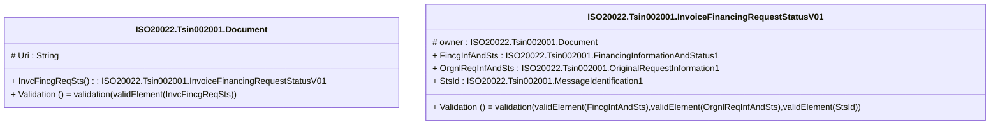

# tsin.002.001.01-physical

> The tables below contain descriptions of the members of each Element. 
> The first column indicates the type of the member:
> A ‘#’ indicates that the field is a key to the element, and a ‘+’ indicates that the field is a value.
> The ‘*’ column contains a description for the element member.  
> The ‘@’ column contains any properties for the member.
> The ‘=’ column contains calculated values; or in the case of an enum, the serialized value.

---

## EntityImpl ISO20022.Tsin002001.Document

| |Name|Type|*|@|=|
|-|-|-|-|-|-|
|#|Uri|String||XmlIgnore(), JsonIgnore()||
|+|InvcFincgReqSts|ISO20022.Tsin002001.InvoiceFinancingRequestStatusV01||XmlElement()||
||Validation|Some(String)||XmlIgnore(), JsonIgnore()|validation(validElement(InvcFincgReqSts))|

---

## AspectImpl ISO20022.Tsin002001.InvoiceFinancingRequestStatusV01

| |Name|Type|*|@|=|
|-|-|-|-|-|-|
|#|owner|ISO20022.Tsin002001.Document||||
|+|FincgInfAndSts|ISO20022.Tsin002001.FinancingInformationAndStatus1||XmlElement()||
|+|OrgnlReqInfAndSts|ISO20022.Tsin002001.OriginalRequestInformation1||XmlElement()||
|+|StsId|ISO20022.Tsin002001.MessageIdentification1||XmlElement()||
||Validation|Some(String)||XmlIgnore(), JsonIgnore()|validation(validElement(FincgInfAndSts),validElement(OrgnlReqInfAndSts),validElement(StsId))|

