# tsin.002.001.01

```mermaid
classDiagram
    class Hiperspace.Edge {
        # From  : Hiperspace.Node
        # To  : Hiperspace.Node
        # TypeName  : String
        + Name  : String
    }
    class ISO20022.Tsin002001.AccountIdentification3Choice {
        + PrtryAcct  : ISO20022.Tsin002001.SimpleIdentificationInformation2
        + UPIC  : String
        + BBAN  : String
        + IBAN  : String
    }
    ISO20022.Tsin002001.AccountIdentification3Choice *-- ISO20022.Tsin002001.SimpleIdentificationInformation2
    class ISO20022.Tsin002001.ActiveCurrencyAndAmount {
        + Value  : Decimal
        + Ccy  : String
    }
    class ISO20022.Tsin002001.AddressType2Code {
        DLVY = 1
        MLTO = 2
        BIZZ = 3
        HOME = 4
        PBOX = 5
        ADDR = 6
    }
    class ISO20022.Tsin002001.CancellationStatus4Code {
        REJT = 1
        PACK = 2
    }
    class ISO20022.Tsin002001.CancellationStatusInformation1 {
        + AddtlStsRsnInf  : global::System.Collections.Generic.List~String~
        + StsRsn  : ISO20022.Tsin002001.StatusReason4Choice
        + Sts  : String
    }
    ISO20022.Tsin002001.CancellationStatusInformation1 *-- ISO20022.Tsin002001.StatusReason4Choice
    class ISO20022.Tsin002001.CashAccount7 {
        + Nm  : String
        + Ccy  : String
        + Tp  : ISO20022.Tsin002001.CashAccountType2
        + Id  : ISO20022.Tsin002001.AccountIdentification3Choice
    }
    ISO20022.Tsin002001.CashAccount7 *-- ISO20022.Tsin002001.CashAccountType2
    ISO20022.Tsin002001.CashAccount7 *-- ISO20022.Tsin002001.AccountIdentification3Choice
    class ISO20022.Tsin002001.CashAccountType2 {
        + Prtry  : String
        + Cd  : String
    }
    class ISO20022.Tsin002001.CashAccountType4Code {
        ODFT = 1
        SLRY = 2
        LOAN = 3
        MOMA = 4
        NREX = 5
        MGLD = 6
        ONDP = 7
        SVGS = 8
        CACC = 9
        SACC = 10
        TRAS = 11
        CISH = 12
        TAXE = 13
        COMM = 14
        CHAR = 15
        CASH = 16
    }
    class ISO20022.Tsin002001.ClearingSystemMemberIdentification2Choice {
        + OthrClrCdId  : String
        + PLKNR  : String
        + GRHEBIC  : String
        + INIFSC  : String
        + AUBSBs  : String
        + AUBSBx  : String
        + HKNCC  : String
        + ZANCC  : String
        + ESNCC  : String
        + DEBLZ  : String
        + CHSIC  : String
        + CACPA  : String
        + ATBLZ  : String
        + ITNCC  : String
        + RUCB  : String
        + PTNCC  : String
        + USFW  : String
        + CHBC  : String
        + USCH  : String
        + GBSC  : String
        + IENSC  : String
        + NZNCC  : String
        + USCHU  : String
    }
    class ISO20022.Tsin002001.DateAndPlaceOfBirth {
        + CtryOfBirth  : String
        + CityOfBirth  : String
        + PrvcOfBirth  : String
        + BirthDt  : DateTime
    }
    class ISO20022.Tsin002001.FinancialInstitutionIdentification6 {
        + BIC  : String
        + PrtryId  : ISO20022.Tsin002001.GenericIdentification4
        + ClrSysMmbId  : ISO20022.Tsin002001.ClearingSystemMemberIdentification2Choice
    }
    ISO20022.Tsin002001.FinancialInstitutionIdentification6 *-- ISO20022.Tsin002001.GenericIdentification4
    ISO20022.Tsin002001.FinancialInstitutionIdentification6 *-- ISO20022.Tsin002001.ClearingSystemMemberIdentification2Choice
    class ISO20022.Tsin002001.FinancingAllowedSummary1 {
        + FincgAcct  : ISO20022.Tsin002001.CashAccount7
        + CdtAcct  : ISO20022.Tsin002001.CashAccount7
        + FincgDtDtls  : ISO20022.Tsin002001.FinancingDateDetails1
        + TtlFincdAmt  : ISO20022.Tsin002001.ActiveCurrencyAndAmount
        + ApldPctg  : Decimal
        + TtlAccptdItmsAmt  : ISO20022.Tsin002001.ActiveCurrencyAndAmount
        + FincdItmNb  : Decimal
    }
    ISO20022.Tsin002001.FinancingAllowedSummary1 *-- ISO20022.Tsin002001.CashAccount7
    ISO20022.Tsin002001.FinancingAllowedSummary1 *-- ISO20022.Tsin002001.CashAccount7
    ISO20022.Tsin002001.FinancingAllowedSummary1 *-- ISO20022.Tsin002001.FinancingDateDetails1
    ISO20022.Tsin002001.FinancingAllowedSummary1 *-- ISO20022.Tsin002001.ActiveCurrencyAndAmount
    ISO20022.Tsin002001.FinancingAllowedSummary1 *-- ISO20022.Tsin002001.ActiveCurrencyAndAmount
    class ISO20022.Tsin002001.FinancingDateDetails1 {
        + DbtDt  : DateTime
        + CdtDt  : DateTime
        + BookDt  : global::System.Collections.Generic.List~DateTime~
    }
    class ISO20022.Tsin002001.FinancingInformationAndStatus1 {
        + InvcFincgDtls  : global::System.Collections.Generic.List~ISO20022.Tsin002001.InvoiceFinancingDetails1~
        + FincgAllwdSummry  : ISO20022.Tsin002001.FinancingAllowedSummary1
    }
    ISO20022.Tsin002001.FinancingInformationAndStatus1 *-- ISO20022.Tsin002001.InvoiceFinancingDetails1
    ISO20022.Tsin002001.FinancingInformationAndStatus1 *-- ISO20022.Tsin002001.FinancingAllowedSummary1
    class ISO20022.Tsin002001.FinancingRateOrAmountChoice {
        + Rate  : Decimal
        + Amt  : ISO20022.Tsin002001.ActiveCurrencyAndAmount
    }
    ISO20022.Tsin002001.FinancingRateOrAmountChoice *-- ISO20022.Tsin002001.ActiveCurrencyAndAmount
    class ISO20022.Tsin002001.FinancingResult1 {
        + FincdAmt  : ISO20022.Tsin002001.FinancingRateOrAmountChoice
        + AddtlStsRsnInf  : global::System.Collections.Generic.List~String~
        + StsRsn  : ISO20022.Tsin002001.StatusReason4Choice
        + FincgReqSts  : String
    }
    ISO20022.Tsin002001.FinancingResult1 *-- ISO20022.Tsin002001.FinancingRateOrAmountChoice
    ISO20022.Tsin002001.FinancingResult1 *-- ISO20022.Tsin002001.StatusReason4Choice
    class ISO20022.Tsin002001.FinancingStatusReason1Code {
        CA03 = 1
        NA01 = 2
        MI01 = 3
        ID03 = 4
        ID02 = 5
        ID01 = 6
        DT02 = 7
        BE11 = 8
        BE10 = 9
        BE09 = 10
        BE08 = 11
        AC06 = 12
        AC04 = 13
        AC01 = 14
        CA02 = 15
        CA01 = 16
    }
    class ISO20022.Tsin002001.GenericIdentification3 {
        + Issr  : String
        + Id  : String
    }
    class ISO20022.Tsin002001.GenericIdentification4 {
        + IdTp  : String
        + Id  : String
    }
    class ISO20022.Tsin002001.InstalmentFinancingInformation1 {
        + InstlmtFincgRslt  : ISO20022.Tsin002001.FinancingResult1
        + InstlmtTtlAmt  : ISO20022.Tsin002001.ActiveCurrencyAndAmount
        + InstlmtSeqId  : String
    }
    ISO20022.Tsin002001.InstalmentFinancingInformation1 *-- ISO20022.Tsin002001.FinancingResult1
    ISO20022.Tsin002001.InstalmentFinancingInformation1 *-- ISO20022.Tsin002001.ActiveCurrencyAndAmount
    class ISO20022.Tsin002001.InvoiceFinancingDetails1 {
        + InstlmtFincgInf  : global::System.Collections.Generic.List~ISO20022.Tsin002001.InstalmentFinancingInformation1~
        + InvcFincgRslt  : ISO20022.Tsin002001.FinancingResult1
        + Spplr  : ISO20022.Tsin002001.PartyIdentification8
        + OrgnlInvcInf  : ISO20022.Tsin002001.OriginalInvoiceInformation1
    }
    ISO20022.Tsin002001.InvoiceFinancingDetails1 *-- ISO20022.Tsin002001.InstalmentFinancingInformation1
    ISO20022.Tsin002001.InvoiceFinancingDetails1 *-- ISO20022.Tsin002001.FinancingResult1
    ISO20022.Tsin002001.InvoiceFinancingDetails1 *-- ISO20022.Tsin002001.PartyIdentification8
    ISO20022.Tsin002001.InvoiceFinancingDetails1 *-- ISO20022.Tsin002001.OriginalInvoiceInformation1
    class ISO20022.Tsin002001.InvoiceFinancingRequestStatusV01 {
        + FincgInfAndSts  : ISO20022.Tsin002001.FinancingInformationAndStatus1
        + OrgnlReqInfAndSts  : ISO20022.Tsin002001.OriginalRequestInformation1
        + StsId  : ISO20022.Tsin002001.MessageIdentification1
    }
    ISO20022.Tsin002001.InvoiceFinancingRequestStatusV01 *-- ISO20022.Tsin002001.FinancingInformationAndStatus1
    ISO20022.Tsin002001.InvoiceFinancingRequestStatusV01 *-- ISO20022.Tsin002001.OriginalRequestInformation1
    ISO20022.Tsin002001.InvoiceFinancingRequestStatusV01 *-- ISO20022.Tsin002001.MessageIdentification1
    class ISO20022.Tsin002001.MessageIdentification1 {
        + CreDtTm  : DateTime
        + Id  : String
    }
    class ISO20022.Tsin002001.OrganisationIdentification2 {
        + PrtryId  : ISO20022.Tsin002001.GenericIdentification3
        + TaxIdNb  : String
        + BkPtyId  : String
        + DUNS  : String
        + USCHU  : String
        + EANGLN  : String
        + BEI  : String
        + IBEI  : String
        + BIC  : String
    }
    ISO20022.Tsin002001.OrganisationIdentification2 *-- ISO20022.Tsin002001.GenericIdentification3
    class ISO20022.Tsin002001.OriginalInvoiceInformation1 {
        + PmtDueDt  : DateTime
        + IsseDt  : DateTime
        + TtlInvcAmt  : ISO20022.Tsin002001.ActiveCurrencyAndAmount
        + DocNb  : String
    }
    ISO20022.Tsin002001.OriginalInvoiceInformation1 *-- ISO20022.Tsin002001.ActiveCurrencyAndAmount
    class ISO20022.Tsin002001.OriginalRequestInformation1 {
        + CxlStsInf  : ISO20022.Tsin002001.CancellationStatusInformation1
        + VldtnStsInf  : ISO20022.Tsin002001.ValidationStatusInformation1
        + FrstAgt  : ISO20022.Tsin002001.FinancialInstitutionIdentification6
        + IntrmyAgt  : ISO20022.Tsin002001.FinancialInstitutionIdentification6
        + FincgRqstr  : ISO20022.Tsin002001.PartyIdentificationAndAccount6
        + CreDtTm  : DateTime
        + Id  : String
    }
    ISO20022.Tsin002001.OriginalRequestInformation1 *-- ISO20022.Tsin002001.CancellationStatusInformation1
    ISO20022.Tsin002001.OriginalRequestInformation1 *-- ISO20022.Tsin002001.ValidationStatusInformation1
    ISO20022.Tsin002001.OriginalRequestInformation1 *-- ISO20022.Tsin002001.FinancialInstitutionIdentification6
    ISO20022.Tsin002001.OriginalRequestInformation1 *-- ISO20022.Tsin002001.FinancialInstitutionIdentification6
    ISO20022.Tsin002001.OriginalRequestInformation1 *-- ISO20022.Tsin002001.PartyIdentificationAndAccount6
    class ISO20022.Tsin002001.Party2Choice {
        + PrvtId  : global::System.Collections.Generic.List~ISO20022.Tsin002001.PersonIdentification3~
        + OrgId  : ISO20022.Tsin002001.OrganisationIdentification2
    }
    ISO20022.Tsin002001.Party2Choice *-- ISO20022.Tsin002001.PersonIdentification3
    ISO20022.Tsin002001.Party2Choice *-- ISO20022.Tsin002001.OrganisationIdentification2
    class ISO20022.Tsin002001.PartyIdentification25 {
        + BEI  : String
        + PrtryId  : ISO20022.Tsin002001.GenericIdentification4
        + Nm  : String
    }
    ISO20022.Tsin002001.PartyIdentification25 *-- ISO20022.Tsin002001.GenericIdentification4
    class ISO20022.Tsin002001.PartyIdentification8 {
        + CtryOfRes  : String
        + Id  : ISO20022.Tsin002001.Party2Choice
        + PstlAdr  : ISO20022.Tsin002001.PostalAddress1
        + Nm  : String
    }
    ISO20022.Tsin002001.PartyIdentification8 *-- ISO20022.Tsin002001.Party2Choice
    ISO20022.Tsin002001.PartyIdentification8 *-- ISO20022.Tsin002001.PostalAddress1
    class ISO20022.Tsin002001.PartyIdentificationAndAccount6 {
        + FincgAcct  : ISO20022.Tsin002001.CashAccount7
        + CdtAcct  : ISO20022.Tsin002001.CashAccount7
        + PtyId  : ISO20022.Tsin002001.PartyIdentification25
    }
    ISO20022.Tsin002001.PartyIdentificationAndAccount6 *-- ISO20022.Tsin002001.CashAccount7
    ISO20022.Tsin002001.PartyIdentificationAndAccount6 *-- ISO20022.Tsin002001.CashAccount7
    ISO20022.Tsin002001.PartyIdentificationAndAccount6 *-- ISO20022.Tsin002001.PartyIdentification25
    class ISO20022.Tsin002001.PersonIdentification3 {
        + Issr  : String
        + OthrId  : ISO20022.Tsin002001.GenericIdentification4
        + DtAndPlcOfBirth  : ISO20022.Tsin002001.DateAndPlaceOfBirth
        + MplyrIdNb  : String
        + IdntyCardNb  : String
        + TaxIdNb  : String
        + PsptNb  : String
        + AlnRegnNb  : String
        + SclSctyNb  : String
        + CstmrNb  : String
        + DrvrsLicNb  : String
    }
    ISO20022.Tsin002001.PersonIdentification3 *-- ISO20022.Tsin002001.GenericIdentification4
    ISO20022.Tsin002001.PersonIdentification3 *-- ISO20022.Tsin002001.DateAndPlaceOfBirth
    class ISO20022.Tsin002001.PostalAddress1 {
        + Ctry  : String
        + CtrySubDvsn  : String
        + TwnNm  : String
        + PstCd  : String
        + BldgNb  : String
        + StrtNm  : String
        + AdrLine  : global::System.Collections.Generic.List~String~
        + AdrTp  : String
    }
    class ISO20022.Tsin002001.RequestStatus1Code {
        NTFD = 1
        PDNG = 2
        FNCD = 3
    }
    class ISO20022.Tsin002001.SimpleIdentificationInformation2 {
        + Id  : String
    }
    class ISO20022.Tsin002001.StatusReason4Choice {
        + Prtry  : String
        + Cd  : String
    }
    class ISO20022.Tsin002001.TechnicalValidationStatus1Code {
        RCER = 1
        RCCF = 2
    }
    class ISO20022.Tsin002001.ValidationStatusInformation1 {
        + AddtlStsRsnInf  : global::System.Collections.Generic.List~String~
        + StsRsn  : ISO20022.Tsin002001.StatusReason4Choice
        + Sts  : String
    }
    ISO20022.Tsin002001.ValidationStatusInformation1 *-- ISO20022.Tsin002001.StatusReason4Choice
    class Hiperspace.Node {
        # SKey  : String
        + TypeName  : String
        + Name  : String
        + Froms (From = this) : Hiperspace.Edge
        + Tos (To = this) : Hiperspace.Edge
    }
```

> The tables below contain descriptions of the members of each Element. 
> The first column indicates the type of the member:
> A ‘#’ indicates that the field is a key to the element, and a ‘+’ indicates that the field is a value.
> The ‘*’ column contains a description for the element member.  
> The ‘@’ column contains any properties for the member.
> The ‘=’ column contains calculated values; or in the case of an enum, the serialized value.

---

## View Hiperspace.Edge
edge between nodes

| |Name|Type|*|@|=|
|-|-|-|-|-|-|
|#|From|Hiperspace.Node||||
|#|To|Hiperspace.Node||||
|#|TypeName|String||||
|+|Name|String||||

---

## Value ISO20022.Tsin002001.AccountIdentification3Choice

| |Name|Type|*|@|=|
|-|-|-|-|-|-|
|+|PrtryAcct|ISO20022.Tsin002001.SimpleIdentificationInformation2||XmlElement()||
|+|UPIC|String||XmlElement()||
|+|BBAN|String||XmlElement()||
|+|IBAN|String||XmlElement()||
||Validation|Some(String)||XmlIgnore(), JsonIgnore()|validation(validElement(PrtryAcct),validPattern("""UPIC""",UPIC,"""[0-9]{8,17}"""),validPattern("""BBAN""",BBAN,"""[a-zA-Z0-9]{1,30}"""),validPattern("""IBAN""",IBAN,"""[a-zA-Z]{2,2}[0-9]{2,2}[a-zA-Z0-9]{1,30}"""),validChoice(PrtryAcct,UPIC,BBAN,IBAN))|

---

## Value ISO20022.Tsin002001.ActiveCurrencyAndAmount

| |Name|Type|*|@|=|
|-|-|-|-|-|-|
|+|Value|Decimal||XmlElement()||
|+|Ccy|String||XmlAttribute()||
||Validation|Some(String)||XmlIgnore(), JsonIgnore()|validation(validRequired("""Value""",Value),validRequired("""Ccy""",Ccy),validPattern("""Ccy""",Ccy,"""[A-Z]{3,3}"""))|

---

## Enum ISO20022.Tsin002001.AddressType2Code

| |Name|Type|*|@|=|
|-|-|-|-|-|-|
||DLVY|Int32||XmlEnum("""DLVY""")|1|
||MLTO|Int32||XmlEnum("""MLTO""")|2|
||BIZZ|Int32||XmlEnum("""BIZZ""")|3|
||HOME|Int32||XmlEnum("""HOME""")|4|
||PBOX|Int32||XmlEnum("""PBOX""")|5|
||ADDR|Int32||XmlEnum("""ADDR""")|6|

---

## Enum ISO20022.Tsin002001.CancellationStatus4Code

| |Name|Type|*|@|=|
|-|-|-|-|-|-|
||REJT|Int32||XmlEnum("""REJT""")|1|
||PACK|Int32||XmlEnum("""PACK""")|2|

---

## Value ISO20022.Tsin002001.CancellationStatusInformation1

| |Name|Type|*|@|=|
|-|-|-|-|-|-|
|+|AddtlStsRsnInf|global::System.Collections.Generic.List<String>||XmlElement()||
|+|StsRsn|ISO20022.Tsin002001.StatusReason4Choice||XmlElement()||
|+|Sts|String||XmlElement()||
||Validation|Some(String)||XmlIgnore(), JsonIgnore()|validation(validElement(StsRsn))|

---

## Value ISO20022.Tsin002001.CashAccount7

| |Name|Type|*|@|=|
|-|-|-|-|-|-|
|+|Nm|String||XmlElement()||
|+|Ccy|String||XmlElement()||
|+|Tp|ISO20022.Tsin002001.CashAccountType2||XmlElement()||
|+|Id|ISO20022.Tsin002001.AccountIdentification3Choice||XmlElement()||
||Validation|Some(String)||XmlIgnore(), JsonIgnore()|validation(validPattern("""Ccy""",Ccy,"""[A-Z]{3,3}"""),validElement(Tp),validElement(Id))|

---

## Value ISO20022.Tsin002001.CashAccountType2

| |Name|Type|*|@|=|
|-|-|-|-|-|-|
|+|Prtry|String||XmlElement()||
|+|Cd|String||XmlElement()||
||Validation|Some(String)||XmlIgnore(), JsonIgnore()|validation(validChoice(Prtry,Cd))|

---

## Enum ISO20022.Tsin002001.CashAccountType4Code

| |Name|Type|*|@|=|
|-|-|-|-|-|-|
||ODFT|Int32||XmlEnum("""ODFT""")|1|
||SLRY|Int32||XmlEnum("""SLRY""")|2|
||LOAN|Int32||XmlEnum("""LOAN""")|3|
||MOMA|Int32||XmlEnum("""MOMA""")|4|
||NREX|Int32||XmlEnum("""NREX""")|5|
||MGLD|Int32||XmlEnum("""MGLD""")|6|
||ONDP|Int32||XmlEnum("""ONDP""")|7|
||SVGS|Int32||XmlEnum("""SVGS""")|8|
||CACC|Int32||XmlEnum("""CACC""")|9|
||SACC|Int32||XmlEnum("""SACC""")|10|
||TRAS|Int32||XmlEnum("""TRAS""")|11|
||CISH|Int32||XmlEnum("""CISH""")|12|
||TAXE|Int32||XmlEnum("""TAXE""")|13|
||COMM|Int32||XmlEnum("""COMM""")|14|
||CHAR|Int32||XmlEnum("""CHAR""")|15|
||CASH|Int32||XmlEnum("""CASH""")|16|

---

## Value ISO20022.Tsin002001.ClearingSystemMemberIdentification2Choice

| |Name|Type|*|@|=|
|-|-|-|-|-|-|
|+|OthrClrCdId|String||XmlElement()||
|+|PLKNR|String||XmlElement()||
|+|GRHEBIC|String||XmlElement()||
|+|INIFSC|String||XmlElement()||
|+|AUBSBs|String||XmlElement()||
|+|AUBSBx|String||XmlElement()||
|+|HKNCC|String||XmlElement()||
|+|ZANCC|String||XmlElement()||
|+|ESNCC|String||XmlElement()||
|+|DEBLZ|String||XmlElement()||
|+|CHSIC|String||XmlElement()||
|+|CACPA|String||XmlElement()||
|+|ATBLZ|String||XmlElement()||
|+|ITNCC|String||XmlElement()||
|+|RUCB|String||XmlElement()||
|+|PTNCC|String||XmlElement()||
|+|USFW|String||XmlElement()||
|+|CHBC|String||XmlElement()||
|+|USCH|String||XmlElement()||
|+|GBSC|String||XmlElement()||
|+|IENSC|String||XmlElement()||
|+|NZNCC|String||XmlElement()||
|+|USCHU|String||XmlElement()||
||Validation|Some(String)||XmlIgnore(), JsonIgnore()|validation(validPattern("""PLKNR""",PLKNR,"""PL[0-9]{8,8}"""),validPattern("""GRHEBIC""",GRHEBIC,"""GR[0-9]{7,7}"""),validPattern("""INIFSC""",INIFSC,"""IN[a-zA-Z0-9]{11,11}"""),validPattern("""AUBSBs""",AUBSBs,"""AU[0-9]{6,6}"""),validPattern("""AUBSBx""",AUBSBx,"""AU[0-9]{6,6}"""),validPattern("""HKNCC""",HKNCC,"""HK[0-9]{3,3}"""),validPattern("""ZANCC""",ZANCC,"""ZA[0-9]{6,6}"""),validPattern("""ESNCC""",ESNCC,"""ES[0-9]{8,9}"""),validPattern("""DEBLZ""",DEBLZ,"""BL[0-9]{8,8}"""),validPattern("""CHSIC""",CHSIC,"""SW[0-9]{6,6}"""),validPattern("""CACPA""",CACPA,"""CA[0-9]{9,9}"""),validPattern("""ATBLZ""",ATBLZ,"""AT[0-9]{5,5}"""),validPattern("""ITNCC""",ITNCC,"""IT[0-9]{10,10}"""),validPattern("""RUCB""",RUCB,"""RU[0-9]{9,9}"""),validPattern("""PTNCC""",PTNCC,"""PT[0-9]{8,8}"""),validPattern("""USFW""",USFW,"""FW[0-9]{9,9}"""),validPattern("""CHBC""",CHBC,"""SW[0-9]{3,5}"""),validPattern("""USCH""",USCH,"""CP[0-9]{4,4}"""),validPattern("""GBSC""",GBSC,"""SC[0-9]{6,6}"""),validPattern("""IENSC""",IENSC,"""IE[0-9]{6,6}"""),validPattern("""NZNCC""",NZNCC,"""NZ[0-9]{6,6}"""),validPattern("""USCHU""",USCHU,"""CH[0-9]{6,6}"""),validChoice(OthrClrCdId,PLKNR,GRHEBIC,INIFSC,AUBSBs,AUBSBx,HKNCC,ZANCC,ESNCC,DEBLZ,CHSIC,CACPA,ATBLZ,ITNCC,RUCB,PTNCC,USFW,CHBC,USCH,GBSC,IENSC,NZNCC,USCHU))|

---

## Value ISO20022.Tsin002001.DateAndPlaceOfBirth

| |Name|Type|*|@|=|
|-|-|-|-|-|-|
|+|CtryOfBirth|String||XmlElement()||
|+|CityOfBirth|String||XmlElement()||
|+|PrvcOfBirth|String||XmlElement()||
|+|BirthDt|DateTime||XmlElement()||
||Validation|Some(String)||XmlIgnore(), JsonIgnore()|validation(validPattern("""CtryOfBirth""",CtryOfBirth,"""[A-Z]{2,2}"""))|

---

## Type ISO20022.Tsin002001.Document

| |Name|Type|*|@|=|
|-|-|-|-|-|-|
|+|InvcFincgReqSts|ISO20022.Tsin002001.InvoiceFinancingRequestStatusV01||XmlElement()||
||Validation|Some(String)||XmlIgnore(), JsonIgnore()|validation(validElement(InvcFincgReqSts))|

---

## Value ISO20022.Tsin002001.FinancialInstitutionIdentification6

| |Name|Type|*|@|=|
|-|-|-|-|-|-|
|+|BIC|String||XmlElement()||
|+|PrtryId|ISO20022.Tsin002001.GenericIdentification4||XmlElement()||
|+|ClrSysMmbId|ISO20022.Tsin002001.ClearingSystemMemberIdentification2Choice||XmlElement()||
||Validation|Some(String)||XmlIgnore(), JsonIgnore()|validation(validPattern("""BIC""",BIC,"""[A-Z]{6,6}[A-Z2-9][A-NP-Z0-9]([A-Z0-9]{3,3}){0,1}"""),validElement(PrtryId),validElement(ClrSysMmbId))|

---

## Value ISO20022.Tsin002001.FinancingAllowedSummary1

| |Name|Type|*|@|=|
|-|-|-|-|-|-|
|+|FincgAcct|ISO20022.Tsin002001.CashAccount7||XmlElement()||
|+|CdtAcct|ISO20022.Tsin002001.CashAccount7||XmlElement()||
|+|FincgDtDtls|ISO20022.Tsin002001.FinancingDateDetails1||XmlElement()||
|+|TtlFincdAmt|ISO20022.Tsin002001.ActiveCurrencyAndAmount||XmlElement()||
|+|ApldPctg|Decimal||XmlElement()||
|+|TtlAccptdItmsAmt|ISO20022.Tsin002001.ActiveCurrencyAndAmount||XmlElement()||
|+|FincdItmNb|Decimal||XmlElement()||
||Validation|Some(String)||XmlIgnore(), JsonIgnore()|validation(validElement(FincgAcct),validElement(CdtAcct),validElement(FincgDtDtls),validElement(TtlFincdAmt),validElement(TtlAccptdItmsAmt))|

---

## Value ISO20022.Tsin002001.FinancingDateDetails1

| |Name|Type|*|@|=|
|-|-|-|-|-|-|
|+|DbtDt|DateTime||XmlElement()||
|+|CdtDt|DateTime||XmlElement()||
|+|BookDt|global::System.Collections.Generic.List<DateTime>||XmlElement()||
||Validation|Some(String)||XmlIgnore(), JsonIgnore()|""|

---

## Value ISO20022.Tsin002001.FinancingInformationAndStatus1

| |Name|Type|*|@|=|
|-|-|-|-|-|-|
|+|InvcFincgDtls|global::System.Collections.Generic.List<ISO20022.Tsin002001.InvoiceFinancingDetails1>||XmlElement()||
|+|FincgAllwdSummry|ISO20022.Tsin002001.FinancingAllowedSummary1||XmlElement()||
||Validation|Some(String)||XmlIgnore(), JsonIgnore()|validation(validRequired("""InvcFincgDtls""",InvcFincgDtls),validList("""InvcFincgDtls""",InvcFincgDtls),validElement(InvcFincgDtls),validElement(FincgAllwdSummry))|

---

## Value ISO20022.Tsin002001.FinancingRateOrAmountChoice

| |Name|Type|*|@|=|
|-|-|-|-|-|-|
|+|Rate|Decimal||XmlElement()||
|+|Amt|ISO20022.Tsin002001.ActiveCurrencyAndAmount||XmlElement()||
||Validation|Some(String)||XmlIgnore(), JsonIgnore()|validation(validElement(Amt),validChoice(Rate,Amt))|

---

## Value ISO20022.Tsin002001.FinancingResult1

| |Name|Type|*|@|=|
|-|-|-|-|-|-|
|+|FincdAmt|ISO20022.Tsin002001.FinancingRateOrAmountChoice||XmlElement()||
|+|AddtlStsRsnInf|global::System.Collections.Generic.List<String>||XmlElement()||
|+|StsRsn|ISO20022.Tsin002001.StatusReason4Choice||XmlElement()||
|+|FincgReqSts|String||XmlElement()||
||Validation|Some(String)||XmlIgnore(), JsonIgnore()|validation(validElement(FincdAmt),validElement(StsRsn))|

---

## Enum ISO20022.Tsin002001.FinancingStatusReason1Code

| |Name|Type|*|@|=|
|-|-|-|-|-|-|
||CA03|Int32||XmlEnum("""CA03""")|1|
||NA01|Int32||XmlEnum("""NA01""")|2|
||MI01|Int32||XmlEnum("""MI01""")|3|
||ID03|Int32||XmlEnum("""ID03""")|4|
||ID02|Int32||XmlEnum("""ID02""")|5|
||ID01|Int32||XmlEnum("""ID01""")|6|
||DT02|Int32||XmlEnum("""DT02""")|7|
||BE11|Int32||XmlEnum("""BE11""")|8|
||BE10|Int32||XmlEnum("""BE10""")|9|
||BE09|Int32||XmlEnum("""BE09""")|10|
||BE08|Int32||XmlEnum("""BE08""")|11|
||AC06|Int32||XmlEnum("""AC06""")|12|
||AC04|Int32||XmlEnum("""AC04""")|13|
||AC01|Int32||XmlEnum("""AC01""")|14|
||CA02|Int32||XmlEnum("""CA02""")|15|
||CA01|Int32||XmlEnum("""CA01""")|16|

---

## Value ISO20022.Tsin002001.GenericIdentification3

| |Name|Type|*|@|=|
|-|-|-|-|-|-|
|+|Issr|String||XmlElement()||
|+|Id|String||XmlElement()||
||Validation|Some(String)||XmlIgnore(), JsonIgnore()|""|

---

## Value ISO20022.Tsin002001.GenericIdentification4

| |Name|Type|*|@|=|
|-|-|-|-|-|-|
|+|IdTp|String||XmlElement()||
|+|Id|String||XmlElement()||
||Validation|Some(String)||XmlIgnore(), JsonIgnore()|""|

---

## Value ISO20022.Tsin002001.InstalmentFinancingInformation1

| |Name|Type|*|@|=|
|-|-|-|-|-|-|
|+|InstlmtFincgRslt|ISO20022.Tsin002001.FinancingResult1||XmlElement()||
|+|InstlmtTtlAmt|ISO20022.Tsin002001.ActiveCurrencyAndAmount||XmlElement()||
|+|InstlmtSeqId|String||XmlElement()||
||Validation|Some(String)||XmlIgnore(), JsonIgnore()|validation(validElement(InstlmtFincgRslt),validElement(InstlmtTtlAmt))|

---

## Value ISO20022.Tsin002001.InvoiceFinancingDetails1

| |Name|Type|*|@|=|
|-|-|-|-|-|-|
|+|InstlmtFincgInf|global::System.Collections.Generic.List<ISO20022.Tsin002001.InstalmentFinancingInformation1>||XmlElement()||
|+|InvcFincgRslt|ISO20022.Tsin002001.FinancingResult1||XmlElement()||
|+|Spplr|ISO20022.Tsin002001.PartyIdentification8||XmlElement()||
|+|OrgnlInvcInf|ISO20022.Tsin002001.OriginalInvoiceInformation1||XmlElement()||
||Validation|Some(String)||XmlIgnore(), JsonIgnore()|validation(validList("""InstlmtFincgInf""",InstlmtFincgInf),validElement(InstlmtFincgInf),validElement(InvcFincgRslt),validElement(Spplr),validElement(OrgnlInvcInf))|

---

## Aspect ISO20022.Tsin002001.InvoiceFinancingRequestStatusV01

| |Name|Type|*|@|=|
|-|-|-|-|-|-|
|+|FincgInfAndSts|ISO20022.Tsin002001.FinancingInformationAndStatus1||XmlElement()||
|+|OrgnlReqInfAndSts|ISO20022.Tsin002001.OriginalRequestInformation1||XmlElement()||
|+|StsId|ISO20022.Tsin002001.MessageIdentification1||XmlElement()||
||Validation|Some(String)||XmlIgnore(), JsonIgnore()|validation(validElement(FincgInfAndSts),validElement(OrgnlReqInfAndSts),validElement(StsId))|

---

## Value ISO20022.Tsin002001.MessageIdentification1

| |Name|Type|*|@|=|
|-|-|-|-|-|-|
|+|CreDtTm|DateTime||XmlElement()||
|+|Id|String||XmlElement()||
||Validation|Some(String)||XmlIgnore(), JsonIgnore()|""|

---

## Value ISO20022.Tsin002001.OrganisationIdentification2

| |Name|Type|*|@|=|
|-|-|-|-|-|-|
|+|PrtryId|ISO20022.Tsin002001.GenericIdentification3||XmlElement()||
|+|TaxIdNb|String||XmlElement()||
|+|BkPtyId|String||XmlElement()||
|+|DUNS|String||XmlElement()||
|+|USCHU|String||XmlElement()||
|+|EANGLN|String||XmlElement()||
|+|BEI|String||XmlElement()||
|+|IBEI|String||XmlElement()||
|+|BIC|String||XmlElement()||
||Validation|Some(String)||XmlIgnore(), JsonIgnore()|validation(validElement(PrtryId),validPattern("""DUNS""",DUNS,"""[0-9]{9,9}"""),validPattern("""USCHU""",USCHU,"""CH[0-9]{6,6}"""),validPattern("""EANGLN""",EANGLN,"""[0-9]{13,13}"""),validPattern("""BEI""",BEI,"""[A-Z]{6,6}[A-Z2-9][A-NP-Z0-9]([A-Z0-9]{3,3}){0,1}"""),validPattern("""IBEI""",IBEI,"""[A-Z]{2,2}[B-DF-HJ-NP-TV-XZ0-9]{7,7}[0-9]{1,1}"""),validPattern("""BIC""",BIC,"""[A-Z]{6,6}[A-Z2-9][A-NP-Z0-9]([A-Z0-9]{3,3}){0,1}"""))|

---

## Value ISO20022.Tsin002001.OriginalInvoiceInformation1

| |Name|Type|*|@|=|
|-|-|-|-|-|-|
|+|PmtDueDt|DateTime||XmlElement()||
|+|IsseDt|DateTime||XmlElement()||
|+|TtlInvcAmt|ISO20022.Tsin002001.ActiveCurrencyAndAmount||XmlElement()||
|+|DocNb|String||XmlElement()||
||Validation|Some(String)||XmlIgnore(), JsonIgnore()|validation(validElement(TtlInvcAmt))|

---

## Value ISO20022.Tsin002001.OriginalRequestInformation1

| |Name|Type|*|@|=|
|-|-|-|-|-|-|
|+|CxlStsInf|ISO20022.Tsin002001.CancellationStatusInformation1||XmlElement()||
|+|VldtnStsInf|ISO20022.Tsin002001.ValidationStatusInformation1||XmlElement()||
|+|FrstAgt|ISO20022.Tsin002001.FinancialInstitutionIdentification6||XmlElement()||
|+|IntrmyAgt|ISO20022.Tsin002001.FinancialInstitutionIdentification6||XmlElement()||
|+|FincgRqstr|ISO20022.Tsin002001.PartyIdentificationAndAccount6||XmlElement()||
|+|CreDtTm|DateTime||XmlElement()||
|+|Id|String||XmlElement()||
||Validation|Some(String)||XmlIgnore(), JsonIgnore()|validation(validElement(CxlStsInf),validElement(VldtnStsInf),validElement(FrstAgt),validElement(IntrmyAgt),validElement(FincgRqstr))|

---

## Value ISO20022.Tsin002001.Party2Choice

| |Name|Type|*|@|=|
|-|-|-|-|-|-|
|+|PrvtId|global::System.Collections.Generic.List<ISO20022.Tsin002001.PersonIdentification3>||XmlElement()||
|+|OrgId|ISO20022.Tsin002001.OrganisationIdentification2||XmlElement()||
||Validation|Some(String)||XmlIgnore(), JsonIgnore()|validation(validRequired("""PrvtId""",PrvtId),validList("""PrvtId""",PrvtId),validListMax("""PrvtId""",PrvtId,4),validElement(PrvtId),validElement(OrgId),validChoice(PrvtId,OrgId))|

---

## Value ISO20022.Tsin002001.PartyIdentification25

| |Name|Type|*|@|=|
|-|-|-|-|-|-|
|+|BEI|String||XmlElement()||
|+|PrtryId|ISO20022.Tsin002001.GenericIdentification4||XmlElement()||
|+|Nm|String||XmlElement()||
||Validation|Some(String)||XmlIgnore(), JsonIgnore()|validation(validPattern("""BEI""",BEI,"""[A-Z]{6,6}[A-Z2-9][A-NP-Z0-9]([A-Z0-9]{3,3}){0,1}"""),validElement(PrtryId))|

---

## Value ISO20022.Tsin002001.PartyIdentification8

| |Name|Type|*|@|=|
|-|-|-|-|-|-|
|+|CtryOfRes|String||XmlElement()||
|+|Id|ISO20022.Tsin002001.Party2Choice||XmlElement()||
|+|PstlAdr|ISO20022.Tsin002001.PostalAddress1||XmlElement()||
|+|Nm|String||XmlElement()||
||Validation|Some(String)||XmlIgnore(), JsonIgnore()|validation(validPattern("""CtryOfRes""",CtryOfRes,"""[A-Z]{2,2}"""),validElement(Id),validElement(PstlAdr))|

---

## Value ISO20022.Tsin002001.PartyIdentificationAndAccount6

| |Name|Type|*|@|=|
|-|-|-|-|-|-|
|+|FincgAcct|ISO20022.Tsin002001.CashAccount7||XmlElement()||
|+|CdtAcct|ISO20022.Tsin002001.CashAccount7||XmlElement()||
|+|PtyId|ISO20022.Tsin002001.PartyIdentification25||XmlElement()||
||Validation|Some(String)||XmlIgnore(), JsonIgnore()|validation(validElement(FincgAcct),validElement(CdtAcct),validElement(PtyId))|

---

## Value ISO20022.Tsin002001.PersonIdentification3

| |Name|Type|*|@|=|
|-|-|-|-|-|-|
|+|Issr|String||XmlElement()||
|+|OthrId|ISO20022.Tsin002001.GenericIdentification4||XmlElement()||
|+|DtAndPlcOfBirth|ISO20022.Tsin002001.DateAndPlaceOfBirth||XmlElement()||
|+|MplyrIdNb|String||XmlElement()||
|+|IdntyCardNb|String||XmlElement()||
|+|TaxIdNb|String||XmlElement()||
|+|PsptNb|String||XmlElement()||
|+|AlnRegnNb|String||XmlElement()||
|+|SclSctyNb|String||XmlElement()||
|+|CstmrNb|String||XmlElement()||
|+|DrvrsLicNb|String||XmlElement()||
||Validation|Some(String)||XmlIgnore(), JsonIgnore()|validation(validElement(OthrId),validElement(DtAndPlcOfBirth),validChoice(Issr,OthrId,DtAndPlcOfBirth,MplyrIdNb,IdntyCardNb,TaxIdNb,PsptNb,AlnRegnNb,SclSctyNb,CstmrNb,DrvrsLicNb))|

---

## Value ISO20022.Tsin002001.PostalAddress1

| |Name|Type|*|@|=|
|-|-|-|-|-|-|
|+|Ctry|String||XmlElement()||
|+|CtrySubDvsn|String||XmlElement()||
|+|TwnNm|String||XmlElement()||
|+|PstCd|String||XmlElement()||
|+|BldgNb|String||XmlElement()||
|+|StrtNm|String||XmlElement()||
|+|AdrLine|global::System.Collections.Generic.List<String>||XmlElement()||
|+|AdrTp|String||XmlElement()||
||Validation|Some(String)||XmlIgnore(), JsonIgnore()|validation(validPattern("""Ctry""",Ctry,"""[A-Z]{2,2}"""),validListMax("""AdrLine""",AdrLine,5))|

---

## Enum ISO20022.Tsin002001.RequestStatus1Code

| |Name|Type|*|@|=|
|-|-|-|-|-|-|
||NTFD|Int32||XmlEnum("""NTFD""")|1|
||PDNG|Int32||XmlEnum("""PDNG""")|2|
||FNCD|Int32||XmlEnum("""FNCD""")|3|

---

## Value ISO20022.Tsin002001.SimpleIdentificationInformation2

| |Name|Type|*|@|=|
|-|-|-|-|-|-|
|+|Id|String||XmlElement()||
||Validation|Some(String)||XmlIgnore(), JsonIgnore()|""|

---

## Value ISO20022.Tsin002001.StatusReason4Choice

| |Name|Type|*|@|=|
|-|-|-|-|-|-|
|+|Prtry|String||XmlElement()||
|+|Cd|String||XmlElement()||
||Validation|Some(String)||XmlIgnore(), JsonIgnore()|validation(validChoice(Prtry,Cd))|

---

## Enum ISO20022.Tsin002001.TechnicalValidationStatus1Code

| |Name|Type|*|@|=|
|-|-|-|-|-|-|
||RCER|Int32||XmlEnum("""RCER""")|1|
||RCCF|Int32||XmlEnum("""RCCF""")|2|

---

## Value ISO20022.Tsin002001.ValidationStatusInformation1

| |Name|Type|*|@|=|
|-|-|-|-|-|-|
|+|AddtlStsRsnInf|global::System.Collections.Generic.List<String>||XmlElement()||
|+|StsRsn|ISO20022.Tsin002001.StatusReason4Choice||XmlElement()||
|+|Sts|String||XmlElement()||
||Validation|Some(String)||XmlIgnore(), JsonIgnore()|validation(validElement(StsRsn))|

---

## View Hiperspace.Node
node in a graph view of data

| |Name|Type|*|@|=|
|-|-|-|-|-|-|
|#|SKey|String||||
|+|TypeName|String||||
|+|Name|String||||
||Froms|Hiperspace.Edge|||From = this|
||Tos|Hiperspace.Edge|||To = this|

