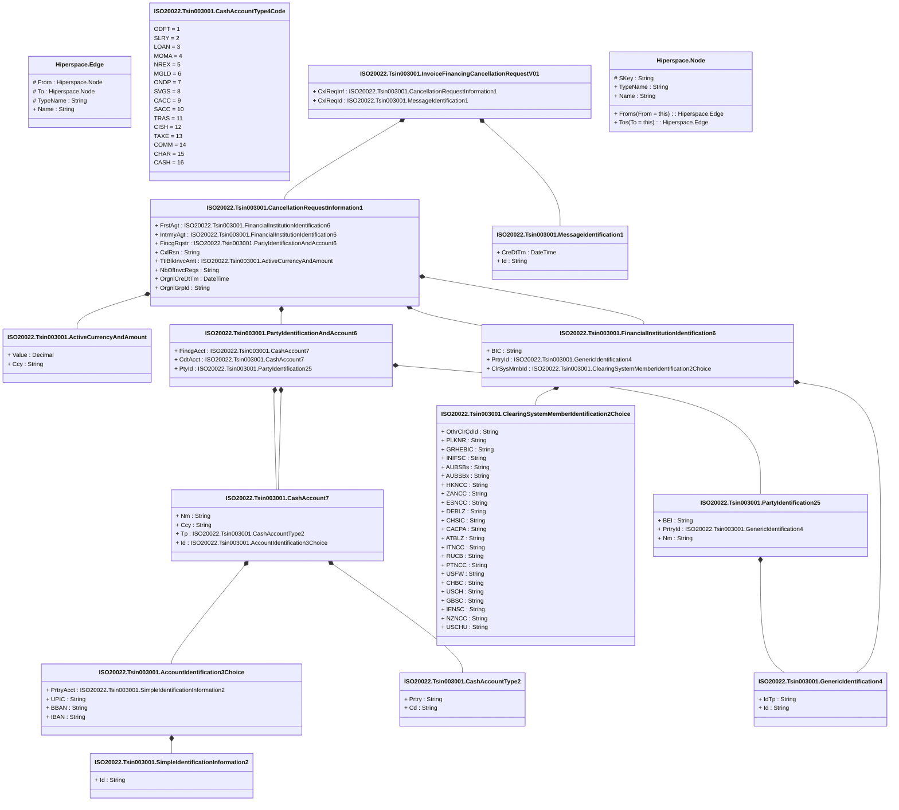

# tsin.003.001.01

> The tables below contain descriptions of the members of each Element. 
> The first column indicates the type of the member:
> A ‘#’ indicates that the field is a key to the element, and a ‘+’ indicates that the field is a value.
> The ‘*’ column contains a description for the element member.  
> The ‘@’ column contains any properties for the member.
> The ‘=’ column contains calculated values; or in the case of an enum, the serialized value.

---

## View Hiperspace.Edge
edge between nodes

| |Name|Type|*|@|=|
|-|-|-|-|-|-|
|#|From|Hiperspace.Node||||
|#|To|Hiperspace.Node||||
|#|TypeName|String||||
|+|Name|String||||

---

## Value ISO20022.Tsin003001.AccountIdentification3Choice

| |Name|Type|*|@|=|
|-|-|-|-|-|-|
|+|PrtryAcct|ISO20022.Tsin003001.SimpleIdentificationInformation2||XmlElement()||
|+|UPIC|String||XmlElement()||
|+|BBAN|String||XmlElement()||
|+|IBAN|String||XmlElement()||
||Validation|Some(String)||XmlIgnore(), JsonIgnore()|validation(validElement(PrtryAcct),validPattern("""UPIC""",UPIC,"""[0-9]{8,17}"""),validPattern("""BBAN""",BBAN,"""[a-zA-Z0-9]{1,30}"""),validPattern("""IBAN""",IBAN,"""[a-zA-Z]{2,2}[0-9]{2,2}[a-zA-Z0-9]{1,30}"""),validChoice(PrtryAcct,UPIC,BBAN,IBAN))|

---

## Value ISO20022.Tsin003001.ActiveCurrencyAndAmount

| |Name|Type|*|@|=|
|-|-|-|-|-|-|
|+|Value|Decimal||XmlElement()||
|+|Ccy|String||XmlAttribute()||
||Validation|Some(String)||XmlIgnore(), JsonIgnore()|validation(validRequired("""Value""",Value),validRequired("""Ccy""",Ccy),validPattern("""Ccy""",Ccy,"""[A-Z]{3,3}"""))|

---

## Value ISO20022.Tsin003001.CancellationRequestInformation1

| |Name|Type|*|@|=|
|-|-|-|-|-|-|
|+|FrstAgt|ISO20022.Tsin003001.FinancialInstitutionIdentification6||XmlElement()||
|+|IntrmyAgt|ISO20022.Tsin003001.FinancialInstitutionIdentification6||XmlElement()||
|+|FincgRqstr|ISO20022.Tsin003001.PartyIdentificationAndAccount6||XmlElement()||
|+|CxlRsn|String||XmlElement()||
|+|TtlBlkInvcAmt|ISO20022.Tsin003001.ActiveCurrencyAndAmount||XmlElement()||
|+|NbOfInvcReqs|String||XmlElement()||
|+|OrgnlCreDtTm|DateTime||XmlElement()||
|+|OrgnlGrpId|String||XmlElement()||
||Validation|Some(String)||XmlIgnore(), JsonIgnore()|validation(validElement(FrstAgt),validElement(IntrmyAgt),validElement(FincgRqstr),validElement(TtlBlkInvcAmt),validPattern("""NbOfInvcReqs""",NbOfInvcReqs,"""[0-9]{1,15}"""))|

---

## Value ISO20022.Tsin003001.CashAccount7

| |Name|Type|*|@|=|
|-|-|-|-|-|-|
|+|Nm|String||XmlElement()||
|+|Ccy|String||XmlElement()||
|+|Tp|ISO20022.Tsin003001.CashAccountType2||XmlElement()||
|+|Id|ISO20022.Tsin003001.AccountIdentification3Choice||XmlElement()||
||Validation|Some(String)||XmlIgnore(), JsonIgnore()|validation(validPattern("""Ccy""",Ccy,"""[A-Z]{3,3}"""),validElement(Tp),validElement(Id))|

---

## Value ISO20022.Tsin003001.CashAccountType2

| |Name|Type|*|@|=|
|-|-|-|-|-|-|
|+|Prtry|String||XmlElement()||
|+|Cd|String||XmlElement()||
||Validation|Some(String)||XmlIgnore(), JsonIgnore()|validation(validChoice(Prtry,Cd))|

---

## Enum ISO20022.Tsin003001.CashAccountType4Code

| |Name|Type|*|@|=|
|-|-|-|-|-|-|
||ODFT|Int32||XmlEnum("""ODFT""")|1|
||SLRY|Int32||XmlEnum("""SLRY""")|2|
||LOAN|Int32||XmlEnum("""LOAN""")|3|
||MOMA|Int32||XmlEnum("""MOMA""")|4|
||NREX|Int32||XmlEnum("""NREX""")|5|
||MGLD|Int32||XmlEnum("""MGLD""")|6|
||ONDP|Int32||XmlEnum("""ONDP""")|7|
||SVGS|Int32||XmlEnum("""SVGS""")|8|
||CACC|Int32||XmlEnum("""CACC""")|9|
||SACC|Int32||XmlEnum("""SACC""")|10|
||TRAS|Int32||XmlEnum("""TRAS""")|11|
||CISH|Int32||XmlEnum("""CISH""")|12|
||TAXE|Int32||XmlEnum("""TAXE""")|13|
||COMM|Int32||XmlEnum("""COMM""")|14|
||CHAR|Int32||XmlEnum("""CHAR""")|15|
||CASH|Int32||XmlEnum("""CASH""")|16|

---

## Value ISO20022.Tsin003001.ClearingSystemMemberIdentification2Choice

| |Name|Type|*|@|=|
|-|-|-|-|-|-|
|+|OthrClrCdId|String||XmlElement()||
|+|PLKNR|String||XmlElement()||
|+|GRHEBIC|String||XmlElement()||
|+|INIFSC|String||XmlElement()||
|+|AUBSBs|String||XmlElement()||
|+|AUBSBx|String||XmlElement()||
|+|HKNCC|String||XmlElement()||
|+|ZANCC|String||XmlElement()||
|+|ESNCC|String||XmlElement()||
|+|DEBLZ|String||XmlElement()||
|+|CHSIC|String||XmlElement()||
|+|CACPA|String||XmlElement()||
|+|ATBLZ|String||XmlElement()||
|+|ITNCC|String||XmlElement()||
|+|RUCB|String||XmlElement()||
|+|PTNCC|String||XmlElement()||
|+|USFW|String||XmlElement()||
|+|CHBC|String||XmlElement()||
|+|USCH|String||XmlElement()||
|+|GBSC|String||XmlElement()||
|+|IENSC|String||XmlElement()||
|+|NZNCC|String||XmlElement()||
|+|USCHU|String||XmlElement()||
||Validation|Some(String)||XmlIgnore(), JsonIgnore()|validation(validPattern("""PLKNR""",PLKNR,"""PL[0-9]{8,8}"""),validPattern("""GRHEBIC""",GRHEBIC,"""GR[0-9]{7,7}"""),validPattern("""INIFSC""",INIFSC,"""IN[a-zA-Z0-9]{11,11}"""),validPattern("""AUBSBs""",AUBSBs,"""AU[0-9]{6,6}"""),validPattern("""AUBSBx""",AUBSBx,"""AU[0-9]{6,6}"""),validPattern("""HKNCC""",HKNCC,"""HK[0-9]{3,3}"""),validPattern("""ZANCC""",ZANCC,"""ZA[0-9]{6,6}"""),validPattern("""ESNCC""",ESNCC,"""ES[0-9]{8,9}"""),validPattern("""DEBLZ""",DEBLZ,"""BL[0-9]{8,8}"""),validPattern("""CHSIC""",CHSIC,"""SW[0-9]{6,6}"""),validPattern("""CACPA""",CACPA,"""CA[0-9]{9,9}"""),validPattern("""ATBLZ""",ATBLZ,"""AT[0-9]{5,5}"""),validPattern("""ITNCC""",ITNCC,"""IT[0-9]{10,10}"""),validPattern("""RUCB""",RUCB,"""RU[0-9]{9,9}"""),validPattern("""PTNCC""",PTNCC,"""PT[0-9]{8,8}"""),validPattern("""USFW""",USFW,"""FW[0-9]{9,9}"""),validPattern("""CHBC""",CHBC,"""SW[0-9]{3,5}"""),validPattern("""USCH""",USCH,"""CP[0-9]{4,4}"""),validPattern("""GBSC""",GBSC,"""SC[0-9]{6,6}"""),validPattern("""IENSC""",IENSC,"""IE[0-9]{6,6}"""),validPattern("""NZNCC""",NZNCC,"""NZ[0-9]{6,6}"""),validPattern("""USCHU""",USCHU,"""CH[0-9]{6,6}"""),validChoice(OthrClrCdId,PLKNR,GRHEBIC,INIFSC,AUBSBs,AUBSBx,HKNCC,ZANCC,ESNCC,DEBLZ,CHSIC,CACPA,ATBLZ,ITNCC,RUCB,PTNCC,USFW,CHBC,USCH,GBSC,IENSC,NZNCC,USCHU))|

---

## Type ISO20022.Tsin003001.Document

| |Name|Type|*|@|=|
|-|-|-|-|-|-|
|+|InvcFincgCxlReq|ISO20022.Tsin003001.InvoiceFinancingCancellationRequestV01||XmlElement()||
||Validation|Some(String)||XmlIgnore(), JsonIgnore()|validation(validElement(InvcFincgCxlReq))|

---

## Value ISO20022.Tsin003001.FinancialInstitutionIdentification6

| |Name|Type|*|@|=|
|-|-|-|-|-|-|
|+|BIC|String||XmlElement()||
|+|PrtryId|ISO20022.Tsin003001.GenericIdentification4||XmlElement()||
|+|ClrSysMmbId|ISO20022.Tsin003001.ClearingSystemMemberIdentification2Choice||XmlElement()||
||Validation|Some(String)||XmlIgnore(), JsonIgnore()|validation(validPattern("""BIC""",BIC,"""[A-Z]{6,6}[A-Z2-9][A-NP-Z0-9]([A-Z0-9]{3,3}){0,1}"""),validElement(PrtryId),validElement(ClrSysMmbId))|

---

## Value ISO20022.Tsin003001.GenericIdentification4

| |Name|Type|*|@|=|
|-|-|-|-|-|-|
|+|IdTp|String||XmlElement()||
|+|Id|String||XmlElement()||
||Validation|Some(String)||XmlIgnore(), JsonIgnore()|""|

---

## Aspect ISO20022.Tsin003001.InvoiceFinancingCancellationRequestV01

| |Name|Type|*|@|=|
|-|-|-|-|-|-|
|+|CxlReqInf|ISO20022.Tsin003001.CancellationRequestInformation1||XmlElement()||
|+|CxlReqId|ISO20022.Tsin003001.MessageIdentification1||XmlElement()||
||Validation|Some(String)||XmlIgnore(), JsonIgnore()|validation(validElement(CxlReqInf),validElement(CxlReqId))|

---

## Value ISO20022.Tsin003001.MessageIdentification1

| |Name|Type|*|@|=|
|-|-|-|-|-|-|
|+|CreDtTm|DateTime||XmlElement()||
|+|Id|String||XmlElement()||
||Validation|Some(String)||XmlIgnore(), JsonIgnore()|""|

---

## Value ISO20022.Tsin003001.PartyIdentification25

| |Name|Type|*|@|=|
|-|-|-|-|-|-|
|+|BEI|String||XmlElement()||
|+|PrtryId|ISO20022.Tsin003001.GenericIdentification4||XmlElement()||
|+|Nm|String||XmlElement()||
||Validation|Some(String)||XmlIgnore(), JsonIgnore()|validation(validPattern("""BEI""",BEI,"""[A-Z]{6,6}[A-Z2-9][A-NP-Z0-9]([A-Z0-9]{3,3}){0,1}"""),validElement(PrtryId))|

---

## Value ISO20022.Tsin003001.PartyIdentificationAndAccount6

| |Name|Type|*|@|=|
|-|-|-|-|-|-|
|+|FincgAcct|ISO20022.Tsin003001.CashAccount7||XmlElement()||
|+|CdtAcct|ISO20022.Tsin003001.CashAccount7||XmlElement()||
|+|PtyId|ISO20022.Tsin003001.PartyIdentification25||XmlElement()||
||Validation|Some(String)||XmlIgnore(), JsonIgnore()|validation(validElement(FincgAcct),validElement(CdtAcct),validElement(PtyId))|

---

## Value ISO20022.Tsin003001.SimpleIdentificationInformation2

| |Name|Type|*|@|=|
|-|-|-|-|-|-|
|+|Id|String||XmlElement()||
||Validation|Some(String)||XmlIgnore(), JsonIgnore()|""|

---

## View Hiperspace.Node
node in a graph view of data

| |Name|Type|*|@|=|
|-|-|-|-|-|-|
|#|SKey|String||||
|+|TypeName|String||||
|+|Name|String||||
||Froms|Hiperspace.Edge|||From = this|
||Tos|Hiperspace.Edge|||To = this|

