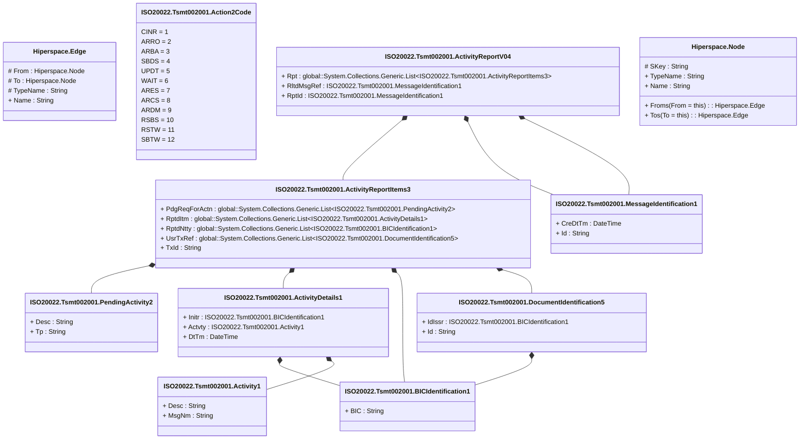

# tsmt.002.001.04

> The tables below contain descriptions of the members of each Element. 
> The first column indicates the type of the member:
> A ‘#’ indicates that the field is a key to the element, and a ‘+’ indicates that the field is a value.
> The ‘*’ column contains a description for the element member.  
> The ‘@’ column contains any properties for the member.
> The ‘=’ column contains calculated values; or in the case of an enum, the serialized value.

---

## View Hiperspace.Edge
edge between nodes

| |Name|Type|*|@|=|
|-|-|-|-|-|-|
|#|From|Hiperspace.Node||||
|#|To|Hiperspace.Node||||
|#|TypeName|String||||
|+|Name|String||||

---

## Enum ISO20022.Tsmt002001.Action2Code

| |Name|Type|*|@|=|
|-|-|-|-|-|-|
||CINR|Int32||XmlEnum("""CINR""")|1|
||ARRO|Int32||XmlEnum("""ARRO""")|2|
||ARBA|Int32||XmlEnum("""ARBA""")|3|
||SBDS|Int32||XmlEnum("""SBDS""")|4|
||UPDT|Int32||XmlEnum("""UPDT""")|5|
||WAIT|Int32||XmlEnum("""WAIT""")|6|
||ARES|Int32||XmlEnum("""ARES""")|7|
||ARCS|Int32||XmlEnum("""ARCS""")|8|
||ARDM|Int32||XmlEnum("""ARDM""")|9|
||RSBS|Int32||XmlEnum("""RSBS""")|10|
||RSTW|Int32||XmlEnum("""RSTW""")|11|
||SBTW|Int32||XmlEnum("""SBTW""")|12|

---

## Value ISO20022.Tsmt002001.Activity1

| |Name|Type|*|@|=|
|-|-|-|-|-|-|
|+|Desc|String||XmlElement()||
|+|MsgNm|String||XmlElement()||
||Validation|Some(String)||XmlIgnore(), JsonIgnore()|""|

---

## Value ISO20022.Tsmt002001.ActivityDetails1

| |Name|Type|*|@|=|
|-|-|-|-|-|-|
|+|Initr|ISO20022.Tsmt002001.BICIdentification1||XmlElement()||
|+|Actvty|ISO20022.Tsmt002001.Activity1||XmlElement()||
|+|DtTm|DateTime||XmlElement()||
||Validation|Some(String)||XmlIgnore(), JsonIgnore()|validation(validElement(Initr),validElement(Actvty))|

---

## Value ISO20022.Tsmt002001.ActivityReportItems3

| |Name|Type|*|@|=|
|-|-|-|-|-|-|
|+|PdgReqForActn|global::System.Collections.Generic.List<ISO20022.Tsmt002001.PendingActivity2>||XmlElement()||
|+|RptdItm|global::System.Collections.Generic.List<ISO20022.Tsmt002001.ActivityDetails1>||XmlElement()||
|+|RptdNtty|global::System.Collections.Generic.List<ISO20022.Tsmt002001.BICIdentification1>||XmlElement()||
|+|UsrTxRef|global::System.Collections.Generic.List<ISO20022.Tsmt002001.DocumentIdentification5>||XmlElement()||
|+|TxId|String||XmlElement()||
||Validation|Some(String)||XmlIgnore(), JsonIgnore()|validation(validList("""PdgReqForActn""",PdgReqForActn),validElement(PdgReqForActn),validRequired("""RptdItm""",RptdItm),validList("""RptdItm""",RptdItm),validElement(RptdItm),validRequired("""RptdNtty""",RptdNtty),validList("""RptdNtty""",RptdNtty),validElement(RptdNtty),validList("""UsrTxRef""",UsrTxRef),validListMax("""UsrTxRef""",UsrTxRef,2),validElement(UsrTxRef))|

---

## Aspect ISO20022.Tsmt002001.ActivityReportV04

| |Name|Type|*|@|=|
|-|-|-|-|-|-|
|+|Rpt|global::System.Collections.Generic.List<ISO20022.Tsmt002001.ActivityReportItems3>||XmlElement()||
|+|RltdMsgRef|ISO20022.Tsmt002001.MessageIdentification1||XmlElement()||
|+|RptId|ISO20022.Tsmt002001.MessageIdentification1||XmlElement()||
||Validation|Some(String)||XmlIgnore(), JsonIgnore()|validation(validList("""Rpt""",Rpt),validElement(Rpt),validElement(RltdMsgRef),validElement(RptId))|

---

## Value ISO20022.Tsmt002001.BICIdentification1

| |Name|Type|*|@|=|
|-|-|-|-|-|-|
|+|BIC|String||XmlElement()||
||Validation|Some(String)||XmlIgnore(), JsonIgnore()|validation(validPattern("""BIC""",BIC,"""[A-Z]{6,6}[A-Z2-9][A-NP-Z0-9]([A-Z0-9]{3,3}){0,1}"""))|

---

## Type ISO20022.Tsmt002001.Document

| |Name|Type|*|@|=|
|-|-|-|-|-|-|
|+|ActvtyRpt|ISO20022.Tsmt002001.ActivityReportV04||XmlElement()||
||Validation|Some(String)||XmlIgnore(), JsonIgnore()|validation(validElement(ActvtyRpt))|

---

## Value ISO20022.Tsmt002001.DocumentIdentification5

| |Name|Type|*|@|=|
|-|-|-|-|-|-|
|+|IdIssr|ISO20022.Tsmt002001.BICIdentification1||XmlElement()||
|+|Id|String||XmlElement()||
||Validation|Some(String)||XmlIgnore(), JsonIgnore()|validation(validElement(IdIssr))|

---

## Value ISO20022.Tsmt002001.MessageIdentification1

| |Name|Type|*|@|=|
|-|-|-|-|-|-|
|+|CreDtTm|DateTime||XmlElement()||
|+|Id|String||XmlElement()||
||Validation|Some(String)||XmlIgnore(), JsonIgnore()|""|

---

## Value ISO20022.Tsmt002001.PendingActivity2

| |Name|Type|*|@|=|
|-|-|-|-|-|-|
|+|Desc|String||XmlElement()||
|+|Tp|String||XmlElement()||
||Validation|Some(String)||XmlIgnore(), JsonIgnore()|""|

---

## View Hiperspace.Node
node in a graph view of data

| |Name|Type|*|@|=|
|-|-|-|-|-|-|
|#|SKey|String||||
|+|TypeName|String||||
|+|Name|String||||
||Froms|Hiperspace.Edge|||From = this|
||Tos|Hiperspace.Edge|||To = this|

