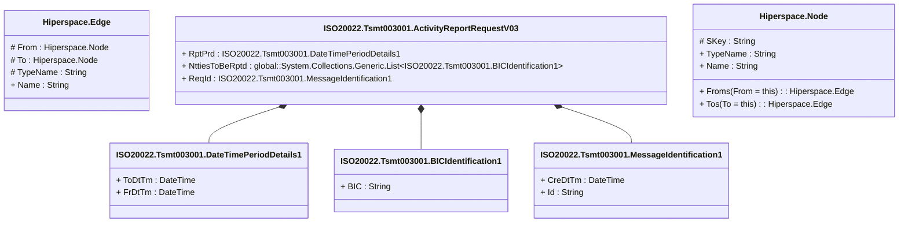

# tsmt.003.001.03

> The tables below contain descriptions of the members of each Element. 
> The first column indicates the type of the member:
> A ‘#’ indicates that the field is a key to the element, and a ‘+’ indicates that the field is a value.
> The ‘*’ column contains a description for the element member.  
> The ‘@’ column contains any properties for the member.
> The ‘=’ column contains calculated values; or in the case of an enum, the serialized value.

---

## View Hiperspace.Edge
edge between nodes

| |Name|Type|*|@|=|
|-|-|-|-|-|-|
|#|From|Hiperspace.Node||||
|#|To|Hiperspace.Node||||
|#|TypeName|String||||
|+|Name|String||||

---

## Aspect ISO20022.Tsmt003001.ActivityReportRequestV03

| |Name|Type|*|@|=|
|-|-|-|-|-|-|
|+|RptPrd|ISO20022.Tsmt003001.DateTimePeriodDetails1||XmlElement()||
|+|NttiesToBeRptd|global::System.Collections.Generic.List<ISO20022.Tsmt003001.BICIdentification1>||XmlElement()||
|+|ReqId|ISO20022.Tsmt003001.MessageIdentification1||XmlElement()||
||Validation|Some(String)||XmlIgnore(), JsonIgnore()|validation(validElement(RptPrd),validList("""NttiesToBeRptd""",NttiesToBeRptd),validElement(NttiesToBeRptd),validElement(ReqId))|

---

## Value ISO20022.Tsmt003001.BICIdentification1

| |Name|Type|*|@|=|
|-|-|-|-|-|-|
|+|BIC|String||XmlElement()||
||Validation|Some(String)||XmlIgnore(), JsonIgnore()|validation(validPattern("""BIC""",BIC,"""[A-Z]{6,6}[A-Z2-9][A-NP-Z0-9]([A-Z0-9]{3,3}){0,1}"""))|

---

## Value ISO20022.Tsmt003001.DateTimePeriodDetails1

| |Name|Type|*|@|=|
|-|-|-|-|-|-|
|+|ToDtTm|DateTime||XmlElement()||
|+|FrDtTm|DateTime||XmlElement()||
||Validation|Some(String)||XmlIgnore(), JsonIgnore()|""|

---

## Type ISO20022.Tsmt003001.Document

| |Name|Type|*|@|=|
|-|-|-|-|-|-|
|+|ActvtyReqRpt|ISO20022.Tsmt003001.ActivityReportRequestV03||XmlElement()||
||Validation|Some(String)||XmlIgnore(), JsonIgnore()|validation(validElement(ActvtyReqRpt))|

---

## Value ISO20022.Tsmt003001.MessageIdentification1

| |Name|Type|*|@|=|
|-|-|-|-|-|-|
|+|CreDtTm|DateTime||XmlElement()||
|+|Id|String||XmlElement()||
||Validation|Some(String)||XmlIgnore(), JsonIgnore()|""|

---

## View Hiperspace.Node
node in a graph view of data

| |Name|Type|*|@|=|
|-|-|-|-|-|-|
|#|SKey|String||||
|+|TypeName|String||||
|+|Name|String||||
||Froms|Hiperspace.Edge|||From = this|
||Tos|Hiperspace.Edge|||To = this|

