# tsmt.008.001.03-physical

```mermaid
classDiagram
    class ISO20022.Tsmt008001.Document {
        # Uri  : String
        + AmdmntRjctnNtfctn () : ISO20022.Tsmt008001.AmendmentRejectionNotificationV03
        + Validation () = validation(validElement(AmdmntRjctnNtfctn))
    }
    class ISO20022.Tsmt008001.AmendmentRejectionNotificationV03 {
        # owner  : ISO20022.Tsmt008001.Document
        + ReqForActn  : ISO20022.Tsmt008001.PendingActivity2
        + RjctnRsn  : ISO20022.Tsmt008001.RejectionReason1Choice
        + Initr  : ISO20022.Tsmt008001.BICIdentification1
        + RjctdAmdmntNb  : ISO20022.Tsmt008001.Count1
        + DltaRptRef  : ISO20022.Tsmt008001.MessageIdentification1
        + UsrTxRef  : List~ISO20022.Tsmt008001.DocumentIdentification5~
        + TxSts  : ISO20022.Tsmt008001.TransactionStatus4
        + EstblishdBaselnId  : ISO20022.Tsmt008001.DocumentIdentification3
        + TxId  : ISO20022.Tsmt008001.SimpleIdentificationInformation
        + NtfctnId  : ISO20022.Tsmt008001.MessageIdentification1
        + Validation () = validation(validElement(ReqForActn),validElement(RjctnRsn),validElement(Initr),validElement(RjctdAmdmntNb),validElement(DltaRptRef),validList("""UsrTxRef""",UsrTxRef),validListMax("""UsrTxRef""",UsrTxRef,2),validElement(UsrTxRef),validElement(TxSts),validElement(EstblishdBaselnId),validElement(TxId),validElement(NtfctnId))
    }
```

> The tables below contain descriptions of the members of each Element. 
> The first column indicates the type of the member:
> A ‘#’ indicates that the field is a key to the element, and a ‘+’ indicates that the field is a value.
> The ‘*’ column contains a description for the element member.  
> The ‘@’ column contains any properties for the member.
> The ‘=’ column contains calculated values; or in the case of an enum, the serialized value.

---

## EntityImpl ISO20022.Tsmt008001.Document

| |Name|Type|*|@|=|
|-|-|-|-|-|-|
|#|Uri|String||XmlIgnore(), JsonIgnore()||
|+|AmdmntRjctnNtfctn|ISO20022.Tsmt008001.AmendmentRejectionNotificationV03||XmlElement()||
||Validation|Some(String)||XmlIgnore(), JsonIgnore()|validation(validElement(AmdmntRjctnNtfctn))|

---

## AspectImpl ISO20022.Tsmt008001.AmendmentRejectionNotificationV03

| |Name|Type|*|@|=|
|-|-|-|-|-|-|
|#|owner|ISO20022.Tsmt008001.Document||||
|+|ReqForActn|ISO20022.Tsmt008001.PendingActivity2||XmlElement()||
|+|RjctnRsn|ISO20022.Tsmt008001.RejectionReason1Choice||XmlElement()||
|+|Initr|ISO20022.Tsmt008001.BICIdentification1||XmlElement()||
|+|RjctdAmdmntNb|ISO20022.Tsmt008001.Count1||XmlElement()||
|+|DltaRptRef|ISO20022.Tsmt008001.MessageIdentification1||XmlElement()||
|+|UsrTxRef|List<ISO20022.Tsmt008001.DocumentIdentification5>||XmlElement()||
|+|TxSts|ISO20022.Tsmt008001.TransactionStatus4||XmlElement()||
|+|EstblishdBaselnId|ISO20022.Tsmt008001.DocumentIdentification3||XmlElement()||
|+|TxId|ISO20022.Tsmt008001.SimpleIdentificationInformation||XmlElement()||
|+|NtfctnId|ISO20022.Tsmt008001.MessageIdentification1||XmlElement()||
||Validation|Some(String)||XmlIgnore(), JsonIgnore()|validation(validElement(ReqForActn),validElement(RjctnRsn),validElement(Initr),validElement(RjctdAmdmntNb),validElement(DltaRptRef),validList("""UsrTxRef""",UsrTxRef),validListMax("""UsrTxRef""",UsrTxRef,2),validElement(UsrTxRef),validElement(TxSts),validElement(EstblishdBaselnId),validElement(TxId),validElement(NtfctnId))|

