# tsmt.009.001.05-physical

```mermaid
classDiagram
    class ISO20022.Tsmt009001.Document {
        # Uri  : String
        + BaselnAmdmntReq () : ISO20022.Tsmt009001.BaselineAmendmentRequestV05
        + Validation () = validation(validElement(BaselnAmdmntReq))
    }
    class ISO20022.Tsmt009001.BaselineAmendmentRequestV05 {
        # owner  : ISO20022.Tsmt009001.Document
        + OthrBkCtctPrsn  : List~ISO20022.Tsmt009001.ContactIdentification3~
        + SellrBkCtctPrsn  : List~ISO20022.Tsmt009001.ContactIdentification1~
        + BuyrBkCtctPrsn  : List~ISO20022.Tsmt009001.ContactIdentification1~
        + SellrCtctPrsn  : List~ISO20022.Tsmt009001.ContactIdentification1~
        + BuyrCtctPrsn  : List~ISO20022.Tsmt009001.ContactIdentification1~
        + Baseln  : ISO20022.Tsmt009001.Baseline5
        + SubmitrTxRef  : ISO20022.Tsmt009001.SimpleIdentificationInformation
        + TxId  : ISO20022.Tsmt009001.SimpleIdentificationInformation
        + ReqId  : ISO20022.Tsmt009001.MessageIdentification1
        + Validation () = validation(validList("""OthrBkCtctPrsn""",OthrBkCtctPrsn),validElement(OthrBkCtctPrsn),validList("""SellrBkCtctPrsn""",SellrBkCtctPrsn),validElement(SellrBkCtctPrsn),validList("""BuyrBkCtctPrsn""",BuyrBkCtctPrsn),validElement(BuyrBkCtctPrsn),validList("""SellrCtctPrsn""",SellrCtctPrsn),validElement(SellrCtctPrsn),validList("""BuyrCtctPrsn""",BuyrCtctPrsn),validElement(BuyrCtctPrsn),validElement(Baseln),validElement(SubmitrTxRef),validElement(TxId),validElement(ReqId))
    }
```

> The tables below contain descriptions of the members of each Element. 
> The first column indicates the type of the member:
> A ‘#’ indicates that the field is a key to the element, and a ‘+’ indicates that the field is a value.
> The ‘*’ column contains a description for the element member.  
> The ‘@’ column contains any properties for the member.
> The ‘=’ column contains calculated values; or in the case of an enum, the serialized value.

---

## EntityImpl ISO20022.Tsmt009001.Document

| |Name|Type|*|@|=|
|-|-|-|-|-|-|
|#|Uri|String||XmlIgnore(), JsonIgnore()||
|+|BaselnAmdmntReq|ISO20022.Tsmt009001.BaselineAmendmentRequestV05||XmlElement()||
||Validation|Some(String)||XmlIgnore(), JsonIgnore()|validation(validElement(BaselnAmdmntReq))|

---

## AspectImpl ISO20022.Tsmt009001.BaselineAmendmentRequestV05

| |Name|Type|*|@|=|
|-|-|-|-|-|-|
|#|owner|ISO20022.Tsmt009001.Document||||
|+|OthrBkCtctPrsn|List<ISO20022.Tsmt009001.ContactIdentification3>||XmlElement()||
|+|SellrBkCtctPrsn|List<ISO20022.Tsmt009001.ContactIdentification1>||XmlElement()||
|+|BuyrBkCtctPrsn|List<ISO20022.Tsmt009001.ContactIdentification1>||XmlElement()||
|+|SellrCtctPrsn|List<ISO20022.Tsmt009001.ContactIdentification1>||XmlElement()||
|+|BuyrCtctPrsn|List<ISO20022.Tsmt009001.ContactIdentification1>||XmlElement()||
|+|Baseln|ISO20022.Tsmt009001.Baseline5||XmlElement()||
|+|SubmitrTxRef|ISO20022.Tsmt009001.SimpleIdentificationInformation||XmlElement()||
|+|TxId|ISO20022.Tsmt009001.SimpleIdentificationInformation||XmlElement()||
|+|ReqId|ISO20022.Tsmt009001.MessageIdentification1||XmlElement()||
||Validation|Some(String)||XmlIgnore(), JsonIgnore()|validation(validList("""OthrBkCtctPrsn""",OthrBkCtctPrsn),validElement(OthrBkCtctPrsn),validList("""SellrBkCtctPrsn""",SellrBkCtctPrsn),validElement(SellrBkCtctPrsn),validList("""BuyrBkCtctPrsn""",BuyrBkCtctPrsn),validElement(BuyrBkCtctPrsn),validList("""SellrCtctPrsn""",SellrCtctPrsn),validElement(SellrCtctPrsn),validList("""BuyrCtctPrsn""",BuyrCtctPrsn),validElement(BuyrCtctPrsn),validElement(Baseln),validElement(SubmitrTxRef),validElement(TxId),validElement(ReqId))|

