# tsmt.011.001.04-physical

```mermaid
classDiagram
    class ISO20022.Tsmt011001.Document {
        # Uri  : String
        + BaselnRpt () : ISO20022.Tsmt011001.BaselineReportV04
        + Validation () = validation(validElement(BaselnRpt))
    }
    class ISO20022.Tsmt011001.BaselineReportV04 {
        # owner  : ISO20022.Tsmt011001.Document
        + ReqForActn  : ISO20022.Tsmt011001.PendingActivity2
        + RptdLineItm  : ISO20022.Tsmt011001.LineItem14
        + SellrBk  : ISO20022.Tsmt011001.BICIdentification1
        + BuyrBk  : ISO20022.Tsmt011001.BICIdentification1
        + Sellr  : ISO20022.Tsmt011001.PartyIdentification26
        + Buyr  : ISO20022.Tsmt011001.PartyIdentification26
        + UsrTxRef  : List~ISO20022.Tsmt011001.DocumentIdentification5~
        + TxSts  : ISO20022.Tsmt011001.TransactionStatus4
        + EstblishdBaselnId  : ISO20022.Tsmt011001.DocumentIdentification6
        + TxId  : ISO20022.Tsmt011001.SimpleIdentificationInformation
        + RptTp  : ISO20022.Tsmt011001.ReportType2
        + RltdMsgRef  : ISO20022.Tsmt011001.MessageIdentification1
        + RptId  : ISO20022.Tsmt011001.MessageIdentification1
        + Validation () = validation(validElement(ReqForActn),validElement(RptdLineItm),validElement(SellrBk),validElement(BuyrBk),validElement(Sellr),validElement(Buyr),validList("""UsrTxRef""",UsrTxRef),validListMax("""UsrTxRef""",UsrTxRef,2),validElement(UsrTxRef),validElement(TxSts),validElement(EstblishdBaselnId),validElement(TxId),validElement(RptTp),validElement(RltdMsgRef),validElement(RptId))
    }
```

> The tables below contain descriptions of the members of each Element. 
> The first column indicates the type of the member:
> A ‘#’ indicates that the field is a key to the element, and a ‘+’ indicates that the field is a value.
> The ‘*’ column contains a description for the element member.  
> The ‘@’ column contains any properties for the member.
> The ‘=’ column contains calculated values; or in the case of an enum, the serialized value.

---

## EntityImpl ISO20022.Tsmt011001.Document

| |Name|Type|*|@|=|
|-|-|-|-|-|-|
|#|Uri|String||XmlIgnore(), JsonIgnore()||
|+|BaselnRpt|ISO20022.Tsmt011001.BaselineReportV04||XmlElement()||
||Validation|Some(String)||XmlIgnore(), JsonIgnore()|validation(validElement(BaselnRpt))|

---

## AspectImpl ISO20022.Tsmt011001.BaselineReportV04

| |Name|Type|*|@|=|
|-|-|-|-|-|-|
|#|owner|ISO20022.Tsmt011001.Document||||
|+|ReqForActn|ISO20022.Tsmt011001.PendingActivity2||XmlElement()||
|+|RptdLineItm|ISO20022.Tsmt011001.LineItem14||XmlElement()||
|+|SellrBk|ISO20022.Tsmt011001.BICIdentification1||XmlElement()||
|+|BuyrBk|ISO20022.Tsmt011001.BICIdentification1||XmlElement()||
|+|Sellr|ISO20022.Tsmt011001.PartyIdentification26||XmlElement()||
|+|Buyr|ISO20022.Tsmt011001.PartyIdentification26||XmlElement()||
|+|UsrTxRef|List<ISO20022.Tsmt011001.DocumentIdentification5>||XmlElement()||
|+|TxSts|ISO20022.Tsmt011001.TransactionStatus4||XmlElement()||
|+|EstblishdBaselnId|ISO20022.Tsmt011001.DocumentIdentification6||XmlElement()||
|+|TxId|ISO20022.Tsmt011001.SimpleIdentificationInformation||XmlElement()||
|+|RptTp|ISO20022.Tsmt011001.ReportType2||XmlElement()||
|+|RltdMsgRef|ISO20022.Tsmt011001.MessageIdentification1||XmlElement()||
|+|RptId|ISO20022.Tsmt011001.MessageIdentification1||XmlElement()||
||Validation|Some(String)||XmlIgnore(), JsonIgnore()|validation(validElement(ReqForActn),validElement(RptdLineItm),validElement(SellrBk),validElement(BuyrBk),validElement(Sellr),validElement(Buyr),validList("""UsrTxRef""",UsrTxRef),validListMax("""UsrTxRef""",UsrTxRef,2),validElement(UsrTxRef),validElement(TxSts),validElement(EstblishdBaselnId),validElement(TxId),validElement(RptTp),validElement(RltdMsgRef),validElement(RptId))|

