# tsmt.011.001.04

```mermaid
classDiagram
    class Hiperspace.Edge {
        # From  : Hiperspace.Node
        # To  : Hiperspace.Node
        # TypeName  : String
        + Name  : String
    }
    class ISO20022.Tsmt011001.Action2Code {
        CINR = 1
        ARRO = 2
        ARBA = 3
        SBDS = 4
        UPDT = 5
        WAIT = 6
        ARES = 7
        ARCS = 8
        ARDM = 9
        RSBS = 10
        RSTW = 11
        SBTW = 12
    }
    class ISO20022.Tsmt011001.BICIdentification1 {
        + BIC  : String
    }
    class ISO20022.Tsmt011001.BaselineReportV04 {
        + ReqForActn  : ISO20022.Tsmt011001.PendingActivity2
        + RptdLineItm  : ISO20022.Tsmt011001.LineItem14
        + SellrBk  : ISO20022.Tsmt011001.BICIdentification1
        + BuyrBk  : ISO20022.Tsmt011001.BICIdentification1
        + Sellr  : ISO20022.Tsmt011001.PartyIdentification26
        + Buyr  : ISO20022.Tsmt011001.PartyIdentification26
        + UsrTxRef  : global::System.Collections.Generic.List~ISO20022.Tsmt011001.DocumentIdentification5~
        + TxSts  : ISO20022.Tsmt011001.TransactionStatus4
        + EstblishdBaselnId  : ISO20022.Tsmt011001.DocumentIdentification6
        + TxId  : ISO20022.Tsmt011001.SimpleIdentificationInformation
        + RptTp  : ISO20022.Tsmt011001.ReportType2
        + RltdMsgRef  : ISO20022.Tsmt011001.MessageIdentification1
        + RptId  : ISO20022.Tsmt011001.MessageIdentification1
    }
    ISO20022.Tsmt011001.BaselineReportV04 *-- ISO20022.Tsmt011001.PendingActivity2
    ISO20022.Tsmt011001.BaselineReportV04 *-- ISO20022.Tsmt011001.LineItem14
    ISO20022.Tsmt011001.BaselineReportV04 *-- ISO20022.Tsmt011001.BICIdentification1
    ISO20022.Tsmt011001.BaselineReportV04 *-- ISO20022.Tsmt011001.BICIdentification1
    ISO20022.Tsmt011001.BaselineReportV04 *-- ISO20022.Tsmt011001.PartyIdentification26
    ISO20022.Tsmt011001.BaselineReportV04 *-- ISO20022.Tsmt011001.PartyIdentification26
    ISO20022.Tsmt011001.BaselineReportV04 *-- ISO20022.Tsmt011001.DocumentIdentification5
    ISO20022.Tsmt011001.BaselineReportV04 *-- ISO20022.Tsmt011001.TransactionStatus4
    ISO20022.Tsmt011001.BaselineReportV04 *-- ISO20022.Tsmt011001.DocumentIdentification6
    ISO20022.Tsmt011001.BaselineReportV04 *-- ISO20022.Tsmt011001.SimpleIdentificationInformation
    ISO20022.Tsmt011001.BaselineReportV04 *-- ISO20022.Tsmt011001.ReportType2
    ISO20022.Tsmt011001.BaselineReportV04 *-- ISO20022.Tsmt011001.MessageIdentification1
    ISO20022.Tsmt011001.BaselineReportV04 *-- ISO20022.Tsmt011001.MessageIdentification1
    class ISO20022.Tsmt011001.BaselineStatus3Code {
        DARQ = 1
        SERQ = 2
        SCRQ = 3
        CLRQ = 4
        RARQ = 5
        AMRQ = 6
        COMP = 7
        ACTV = 8
        ESTD = 9
        PMTC = 10
        CLSD = 11
        PROP = 12
    }
    class ISO20022.Tsmt011001.CurrencyAndAmount {
        + Value  : Decimal
        + Ccy  : String
    }
    class ISO20022.Tsmt011001.DocumentIdentification5 {
        + IdIssr  : ISO20022.Tsmt011001.BICIdentification1
        + Id  : String
    }
    ISO20022.Tsmt011001.DocumentIdentification5 *-- ISO20022.Tsmt011001.BICIdentification1
    class ISO20022.Tsmt011001.DocumentIdentification6 {
        + AmdmntSeqNb  : String
        + Vrsn  : Decimal
        + Id  : String
    }
    class ISO20022.Tsmt011001.GenericIdentification4 {
        + IdTp  : String
        + Id  : String
    }
    class ISO20022.Tsmt011001.LineItem14 {
        + PdgTtlNetAmt  : ISO20022.Tsmt011001.CurrencyAndAmount
        + OutsdngTtlNetAmt  : ISO20022.Tsmt011001.CurrencyAndAmount
        + AccptdTtlNetAmt  : ISO20022.Tsmt011001.CurrencyAndAmount
        + OrdrdTtlNetAmt  : ISO20022.Tsmt011001.CurrencyAndAmount
        + PdgLineItmsTtlAmt  : ISO20022.Tsmt011001.CurrencyAndAmount
        + OutsdngLineItmsTtlAmt  : ISO20022.Tsmt011001.CurrencyAndAmount
        + AccptdLineItmsTtlAmt  : ISO20022.Tsmt011001.CurrencyAndAmount
        + OrdrdLineItmsTtlAmt  : ISO20022.Tsmt011001.CurrencyAndAmount
        + LineItmDtls  : global::System.Collections.Generic.List~ISO20022.Tsmt011001.LineItemDetails12~
    }
    ISO20022.Tsmt011001.LineItem14 *-- ISO20022.Tsmt011001.CurrencyAndAmount
    ISO20022.Tsmt011001.LineItem14 *-- ISO20022.Tsmt011001.CurrencyAndAmount
    ISO20022.Tsmt011001.LineItem14 *-- ISO20022.Tsmt011001.CurrencyAndAmount
    ISO20022.Tsmt011001.LineItem14 *-- ISO20022.Tsmt011001.CurrencyAndAmount
    ISO20022.Tsmt011001.LineItem14 *-- ISO20022.Tsmt011001.CurrencyAndAmount
    ISO20022.Tsmt011001.LineItem14 *-- ISO20022.Tsmt011001.CurrencyAndAmount
    ISO20022.Tsmt011001.LineItem14 *-- ISO20022.Tsmt011001.CurrencyAndAmount
    ISO20022.Tsmt011001.LineItem14 *-- ISO20022.Tsmt011001.CurrencyAndAmount
    ISO20022.Tsmt011001.LineItem14 *-- ISO20022.Tsmt011001.LineItemDetails12
    class ISO20022.Tsmt011001.LineItemDetails12 {
        + PricTlrnce  : ISO20022.Tsmt011001.PercentageTolerance1
        + PdgAmt  : ISO20022.Tsmt011001.CurrencyAndAmount
        + OutsdngAmt  : ISO20022.Tsmt011001.CurrencyAndAmount
        + AccptdAmt  : ISO20022.Tsmt011001.CurrencyAndAmount
        + OrdrdAmt  : ISO20022.Tsmt011001.CurrencyAndAmount
        + QtyTlrnce  : ISO20022.Tsmt011001.PercentageTolerance1
        + PdgQty  : ISO20022.Tsmt011001.Quantity9
        + OutsdngQty  : ISO20022.Tsmt011001.Quantity9
        + AccptdQty  : ISO20022.Tsmt011001.Quantity9
        + OrdrdQty  : ISO20022.Tsmt011001.Quantity9
        + PdctCtgy  : global::System.Collections.Generic.List~ISO20022.Tsmt011001.ProductCategory1Choice~
        + PdctChrtcs  : global::System.Collections.Generic.List~ISO20022.Tsmt011001.ProductCharacteristics1Choice~
        + PdctIdr  : global::System.Collections.Generic.List~ISO20022.Tsmt011001.ProductIdentifier2Choice~
        + PdctNm  : String
        + LineItmId  : String
    }
    ISO20022.Tsmt011001.LineItemDetails12 *-- ISO20022.Tsmt011001.PercentageTolerance1
    ISO20022.Tsmt011001.LineItemDetails12 *-- ISO20022.Tsmt011001.CurrencyAndAmount
    ISO20022.Tsmt011001.LineItemDetails12 *-- ISO20022.Tsmt011001.CurrencyAndAmount
    ISO20022.Tsmt011001.LineItemDetails12 *-- ISO20022.Tsmt011001.CurrencyAndAmount
    ISO20022.Tsmt011001.LineItemDetails12 *-- ISO20022.Tsmt011001.CurrencyAndAmount
    ISO20022.Tsmt011001.LineItemDetails12 *-- ISO20022.Tsmt011001.PercentageTolerance1
    ISO20022.Tsmt011001.LineItemDetails12 *-- ISO20022.Tsmt011001.Quantity9
    ISO20022.Tsmt011001.LineItemDetails12 *-- ISO20022.Tsmt011001.Quantity9
    ISO20022.Tsmt011001.LineItemDetails12 *-- ISO20022.Tsmt011001.Quantity9
    ISO20022.Tsmt011001.LineItemDetails12 *-- ISO20022.Tsmt011001.Quantity9
    ISO20022.Tsmt011001.LineItemDetails12 *-- ISO20022.Tsmt011001.ProductCategory1Choice
    ISO20022.Tsmt011001.LineItemDetails12 *-- ISO20022.Tsmt011001.ProductCharacteristics1Choice
    ISO20022.Tsmt011001.LineItemDetails12 *-- ISO20022.Tsmt011001.ProductIdentifier2Choice
    class ISO20022.Tsmt011001.MessageIdentification1 {
        + CreDtTm  : DateTime
        + Id  : String
    }
    class ISO20022.Tsmt011001.PartyIdentification26 {
        + PstlAdr  : ISO20022.Tsmt011001.PostalAddress5
        + PrtryId  : ISO20022.Tsmt011001.GenericIdentification4
        + Nm  : String
    }
    ISO20022.Tsmt011001.PartyIdentification26 *-- ISO20022.Tsmt011001.PostalAddress5
    ISO20022.Tsmt011001.PartyIdentification26 *-- ISO20022.Tsmt011001.GenericIdentification4
    class ISO20022.Tsmt011001.PendingActivity2 {
        + Desc  : String
        + Tp  : String
    }
    class ISO20022.Tsmt011001.PercentageTolerance1 {
        + MnsPct  : Decimal
        + PlusPct  : Decimal
    }
    class ISO20022.Tsmt011001.PostalAddress5 {
        + Ctry  : String
        + CtrySubDvsn  : String
        + TwnNm  : String
        + PstCdId  : String
        + StrtNm  : String
    }
    class ISO20022.Tsmt011001.ProductCategory1 {
        + Ctgy  : String
        + Tp  : String
    }
    class ISO20022.Tsmt011001.ProductCategory1Choice {
        + OthrPdctCtgy  : ISO20022.Tsmt011001.GenericIdentification4
        + StrdPdctCtgy  : ISO20022.Tsmt011001.ProductCategory1
    }
    ISO20022.Tsmt011001.ProductCategory1Choice *-- ISO20022.Tsmt011001.GenericIdentification4
    ISO20022.Tsmt011001.ProductCategory1Choice *-- ISO20022.Tsmt011001.ProductCategory1
    class ISO20022.Tsmt011001.ProductCategory1Code {
        GNDR = 1
        LOBU = 2
        PRGP = 3
        QOTA = 4
        HRTR = 5
    }
    class ISO20022.Tsmt011001.ProductCharacteristics1 {
        + Chrtcs  : String
        + Tp  : String
    }
    class ISO20022.Tsmt011001.ProductCharacteristics1Choice {
        + OthrPdctChrtcs  : ISO20022.Tsmt011001.GenericIdentification4
        + StrdPdctChrtcs  : ISO20022.Tsmt011001.ProductCharacteristics1
    }
    ISO20022.Tsmt011001.ProductCharacteristics1Choice *-- ISO20022.Tsmt011001.GenericIdentification4
    ISO20022.Tsmt011001.ProductCharacteristics1Choice *-- ISO20022.Tsmt011001.ProductCharacteristics1
    class ISO20022.Tsmt011001.ProductCharacteristics1Code {
        VINR = 1
        STOR = 2
        SPRM = 3
        SZRG = 4
        SIZE = 5
        SISP = 6
        PCTV = 7
        ORCR = 8
        OPTN = 9
        ENNR = 10
        EDSP = 11
        CLOR = 12
        CHNR = 13
        BISP = 14
    }
    class ISO20022.Tsmt011001.ProductIdentifier2 {
        + Idr  : String
        + Tp  : String
    }
    class ISO20022.Tsmt011001.ProductIdentifier2Choice {
        + OthrPdctIdr  : ISO20022.Tsmt011001.GenericIdentification4
        + StrdPdctIdr  : ISO20022.Tsmt011001.ProductIdentifier2
    }
    ISO20022.Tsmt011001.ProductIdentifier2Choice *-- ISO20022.Tsmt011001.GenericIdentification4
    ISO20022.Tsmt011001.ProductIdentifier2Choice *-- ISO20022.Tsmt011001.ProductIdentifier2
    class ISO20022.Tsmt011001.ProductIdentifier2Code {
        UPCC = 1
        SUPI = 2
        STYL = 3
        QOTA = 4
        PART = 5
        MODL = 6
        MANI = 7
        HRTR = 8
        EANC = 9
        COMD = 10
        BINR = 11
    }
    class ISO20022.Tsmt011001.Quantity9 {
        + Fctr  : String
        + Val  : Decimal
        + UnitOfMeasr  : ISO20022.Tsmt011001.UnitOfMeasure3Choice
    }
    ISO20022.Tsmt011001.Quantity9 *-- ISO20022.Tsmt011001.UnitOfMeasure3Choice
    class ISO20022.Tsmt011001.ReportType2 {
        + Tp  : String
    }
    class ISO20022.Tsmt011001.ReportType2Code {
        CURR = 1
        PREC = 2
    }
    class ISO20022.Tsmt011001.SimpleIdentificationInformation {
        + Id  : String
    }
    class ISO20022.Tsmt011001.TransactionStatus4 {
        + Sts  : String
    }
    class ISO20022.Tsmt011001.UnitOfMeasure3Choice {
        + OthrUnitOfMeasr  : String
        + UnitOfMeasrCd  : String
    }
    class ISO20022.Tsmt011001.UnitOfMeasure4Code {
        TNE = 1
        BL = 2
        BG = 3
        OZA = 4
        OZI = 5
        MTQ = 6
        INQ = 7
        CR = 8
        CH = 9
        CT = 10
        BO = 11
        BX = 12
        BLL = 13
        STN = 14
        LBR = 15
        LTR = 16
        CLT = 17
        MMQ = 18
        KMK = 19
        CMK = 20
        MMK = 21
        YDK = 22
        KTM = 23
        MMT = 24
        GLL = 25
        QT = 26
        QTI = 27
        PT = 28
        PTI = 29
        ONZ = 30
        MIK = 31
        FTK = 32
        INK = 33
        E1A = 34
        FOT = 35
        MTK = 36
        CMT = 37
        GRM = 38
        GLI = 39
        LY = 40
        INH = 41
        MTR = 42
        LTN = 43
        EA = 44
        KGM = 45
    }
    class Hiperspace.Node {
        # SKey  : String
        + TypeName  : String
        + Name  : String
        + Froms (From = this) : Hiperspace.Edge
        + Tos (To = this) : Hiperspace.Edge
    }
```

> The tables below contain descriptions of the members of each Element. 
> The first column indicates the type of the member:
> A ‘#’ indicates that the field is a key to the element, and a ‘+’ indicates that the field is a value.
> The ‘*’ column contains a description for the element member.  
> The ‘@’ column contains any properties for the member.
> The ‘=’ column contains calculated values; or in the case of an enum, the serialized value.

---

## View Hiperspace.Edge
edge between nodes

| |Name|Type|*|@|=|
|-|-|-|-|-|-|
|#|From|Hiperspace.Node||||
|#|To|Hiperspace.Node||||
|#|TypeName|String||||
|+|Name|String||||

---

## Enum ISO20022.Tsmt011001.Action2Code

| |Name|Type|*|@|=|
|-|-|-|-|-|-|
||CINR|Int32||XmlEnum("""CINR""")|1|
||ARRO|Int32||XmlEnum("""ARRO""")|2|
||ARBA|Int32||XmlEnum("""ARBA""")|3|
||SBDS|Int32||XmlEnum("""SBDS""")|4|
||UPDT|Int32||XmlEnum("""UPDT""")|5|
||WAIT|Int32||XmlEnum("""WAIT""")|6|
||ARES|Int32||XmlEnum("""ARES""")|7|
||ARCS|Int32||XmlEnum("""ARCS""")|8|
||ARDM|Int32||XmlEnum("""ARDM""")|9|
||RSBS|Int32||XmlEnum("""RSBS""")|10|
||RSTW|Int32||XmlEnum("""RSTW""")|11|
||SBTW|Int32||XmlEnum("""SBTW""")|12|

---

## Value ISO20022.Tsmt011001.BICIdentification1

| |Name|Type|*|@|=|
|-|-|-|-|-|-|
|+|BIC|String||XmlElement()||
||Validation|Some(String)||XmlIgnore(), JsonIgnore()|validation(validPattern("""BIC""",BIC,"""[A-Z]{6,6}[A-Z2-9][A-NP-Z0-9]([A-Z0-9]{3,3}){0,1}"""))|

---

## Aspect ISO20022.Tsmt011001.BaselineReportV04

| |Name|Type|*|@|=|
|-|-|-|-|-|-|
|+|ReqForActn|ISO20022.Tsmt011001.PendingActivity2||XmlElement()||
|+|RptdLineItm|ISO20022.Tsmt011001.LineItem14||XmlElement()||
|+|SellrBk|ISO20022.Tsmt011001.BICIdentification1||XmlElement()||
|+|BuyrBk|ISO20022.Tsmt011001.BICIdentification1||XmlElement()||
|+|Sellr|ISO20022.Tsmt011001.PartyIdentification26||XmlElement()||
|+|Buyr|ISO20022.Tsmt011001.PartyIdentification26||XmlElement()||
|+|UsrTxRef|global::System.Collections.Generic.List<ISO20022.Tsmt011001.DocumentIdentification5>||XmlElement()||
|+|TxSts|ISO20022.Tsmt011001.TransactionStatus4||XmlElement()||
|+|EstblishdBaselnId|ISO20022.Tsmt011001.DocumentIdentification6||XmlElement()||
|+|TxId|ISO20022.Tsmt011001.SimpleIdentificationInformation||XmlElement()||
|+|RptTp|ISO20022.Tsmt011001.ReportType2||XmlElement()||
|+|RltdMsgRef|ISO20022.Tsmt011001.MessageIdentification1||XmlElement()||
|+|RptId|ISO20022.Tsmt011001.MessageIdentification1||XmlElement()||
||Validation|Some(String)||XmlIgnore(), JsonIgnore()|validation(validElement(ReqForActn),validElement(RptdLineItm),validElement(SellrBk),validElement(BuyrBk),validElement(Sellr),validElement(Buyr),validList("""UsrTxRef""",UsrTxRef),validListMax("""UsrTxRef""",UsrTxRef,2),validElement(UsrTxRef),validElement(TxSts),validElement(EstblishdBaselnId),validElement(TxId),validElement(RptTp),validElement(RltdMsgRef),validElement(RptId))|

---

## Enum ISO20022.Tsmt011001.BaselineStatus3Code

| |Name|Type|*|@|=|
|-|-|-|-|-|-|
||DARQ|Int32||XmlEnum("""DARQ""")|1|
||SERQ|Int32||XmlEnum("""SERQ""")|2|
||SCRQ|Int32||XmlEnum("""SCRQ""")|3|
||CLRQ|Int32||XmlEnum("""CLRQ""")|4|
||RARQ|Int32||XmlEnum("""RARQ""")|5|
||AMRQ|Int32||XmlEnum("""AMRQ""")|6|
||COMP|Int32||XmlEnum("""COMP""")|7|
||ACTV|Int32||XmlEnum("""ACTV""")|8|
||ESTD|Int32||XmlEnum("""ESTD""")|9|
||PMTC|Int32||XmlEnum("""PMTC""")|10|
||CLSD|Int32||XmlEnum("""CLSD""")|11|
||PROP|Int32||XmlEnum("""PROP""")|12|

---

## Value ISO20022.Tsmt011001.CurrencyAndAmount

| |Name|Type|*|@|=|
|-|-|-|-|-|-|
|+|Value|Decimal||XmlElement()||
|+|Ccy|String||XmlAttribute()||
||Validation|Some(String)||XmlIgnore(), JsonIgnore()|validation(validRequired("""Value""",Value),validRequired("""Ccy""",Ccy),validPattern("""Ccy""",Ccy,"""[A-Z]{3,3}"""))|

---

## Type ISO20022.Tsmt011001.Document

| |Name|Type|*|@|=|
|-|-|-|-|-|-|
|+|BaselnRpt|ISO20022.Tsmt011001.BaselineReportV04||XmlElement()||
||Validation|Some(String)||XmlIgnore(), JsonIgnore()|validation(validElement(BaselnRpt))|

---

## Value ISO20022.Tsmt011001.DocumentIdentification5

| |Name|Type|*|@|=|
|-|-|-|-|-|-|
|+|IdIssr|ISO20022.Tsmt011001.BICIdentification1||XmlElement()||
|+|Id|String||XmlElement()||
||Validation|Some(String)||XmlIgnore(), JsonIgnore()|validation(validElement(IdIssr))|

---

## Value ISO20022.Tsmt011001.DocumentIdentification6

| |Name|Type|*|@|=|
|-|-|-|-|-|-|
|+|AmdmntSeqNb|String||XmlElement()||
|+|Vrsn|Decimal||XmlElement()||
|+|Id|String||XmlElement()||
||Validation|Some(String)||XmlIgnore(), JsonIgnore()|validation(validPattern("""AmdmntSeqNb""",AmdmntSeqNb,"""[0-9]{1,3}"""))|

---

## Value ISO20022.Tsmt011001.GenericIdentification4

| |Name|Type|*|@|=|
|-|-|-|-|-|-|
|+|IdTp|String||XmlElement()||
|+|Id|String||XmlElement()||
||Validation|Some(String)||XmlIgnore(), JsonIgnore()|""|

---

## Value ISO20022.Tsmt011001.LineItem14

| |Name|Type|*|@|=|
|-|-|-|-|-|-|
|+|PdgTtlNetAmt|ISO20022.Tsmt011001.CurrencyAndAmount||XmlElement()||
|+|OutsdngTtlNetAmt|ISO20022.Tsmt011001.CurrencyAndAmount||XmlElement()||
|+|AccptdTtlNetAmt|ISO20022.Tsmt011001.CurrencyAndAmount||XmlElement()||
|+|OrdrdTtlNetAmt|ISO20022.Tsmt011001.CurrencyAndAmount||XmlElement()||
|+|PdgLineItmsTtlAmt|ISO20022.Tsmt011001.CurrencyAndAmount||XmlElement()||
|+|OutsdngLineItmsTtlAmt|ISO20022.Tsmt011001.CurrencyAndAmount||XmlElement()||
|+|AccptdLineItmsTtlAmt|ISO20022.Tsmt011001.CurrencyAndAmount||XmlElement()||
|+|OrdrdLineItmsTtlAmt|ISO20022.Tsmt011001.CurrencyAndAmount||XmlElement()||
|+|LineItmDtls|global::System.Collections.Generic.List<ISO20022.Tsmt011001.LineItemDetails12>||XmlElement()||
||Validation|Some(String)||XmlIgnore(), JsonIgnore()|validation(validElement(PdgTtlNetAmt),validElement(OutsdngTtlNetAmt),validElement(AccptdTtlNetAmt),validElement(OrdrdTtlNetAmt),validElement(PdgLineItmsTtlAmt),validElement(OutsdngLineItmsTtlAmt),validElement(AccptdLineItmsTtlAmt),validElement(OrdrdLineItmsTtlAmt),validRequired("""LineItmDtls""",LineItmDtls),validList("""LineItmDtls""",LineItmDtls),validElement(LineItmDtls))|

---

## Value ISO20022.Tsmt011001.LineItemDetails12

| |Name|Type|*|@|=|
|-|-|-|-|-|-|
|+|PricTlrnce|ISO20022.Tsmt011001.PercentageTolerance1||XmlElement()||
|+|PdgAmt|ISO20022.Tsmt011001.CurrencyAndAmount||XmlElement()||
|+|OutsdngAmt|ISO20022.Tsmt011001.CurrencyAndAmount||XmlElement()||
|+|AccptdAmt|ISO20022.Tsmt011001.CurrencyAndAmount||XmlElement()||
|+|OrdrdAmt|ISO20022.Tsmt011001.CurrencyAndAmount||XmlElement()||
|+|QtyTlrnce|ISO20022.Tsmt011001.PercentageTolerance1||XmlElement()||
|+|PdgQty|ISO20022.Tsmt011001.Quantity9||XmlElement()||
|+|OutsdngQty|ISO20022.Tsmt011001.Quantity9||XmlElement()||
|+|AccptdQty|ISO20022.Tsmt011001.Quantity9||XmlElement()||
|+|OrdrdQty|ISO20022.Tsmt011001.Quantity9||XmlElement()||
|+|PdctCtgy|global::System.Collections.Generic.List<ISO20022.Tsmt011001.ProductCategory1Choice>||XmlElement()||
|+|PdctChrtcs|global::System.Collections.Generic.List<ISO20022.Tsmt011001.ProductCharacteristics1Choice>||XmlElement()||
|+|PdctIdr|global::System.Collections.Generic.List<ISO20022.Tsmt011001.ProductIdentifier2Choice>||XmlElement()||
|+|PdctNm|String||XmlElement()||
|+|LineItmId|String||XmlElement()||
||Validation|Some(String)||XmlIgnore(), JsonIgnore()|validation(validElement(PricTlrnce),validElement(PdgAmt),validElement(OutsdngAmt),validElement(AccptdAmt),validElement(OrdrdAmt),validElement(QtyTlrnce),validElement(PdgQty),validElement(OutsdngQty),validElement(AccptdQty),validElement(OrdrdQty),validList("""PdctCtgy""",PdctCtgy),validElement(PdctCtgy),validList("""PdctChrtcs""",PdctChrtcs),validElement(PdctChrtcs),validList("""PdctIdr""",PdctIdr),validElement(PdctIdr))|

---

## Value ISO20022.Tsmt011001.MessageIdentification1

| |Name|Type|*|@|=|
|-|-|-|-|-|-|
|+|CreDtTm|DateTime||XmlElement()||
|+|Id|String||XmlElement()||
||Validation|Some(String)||XmlIgnore(), JsonIgnore()|""|

---

## Value ISO20022.Tsmt011001.PartyIdentification26

| |Name|Type|*|@|=|
|-|-|-|-|-|-|
|+|PstlAdr|ISO20022.Tsmt011001.PostalAddress5||XmlElement()||
|+|PrtryId|ISO20022.Tsmt011001.GenericIdentification4||XmlElement()||
|+|Nm|String||XmlElement()||
||Validation|Some(String)||XmlIgnore(), JsonIgnore()|validation(validElement(PstlAdr),validElement(PrtryId))|

---

## Value ISO20022.Tsmt011001.PendingActivity2

| |Name|Type|*|@|=|
|-|-|-|-|-|-|
|+|Desc|String||XmlElement()||
|+|Tp|String||XmlElement()||
||Validation|Some(String)||XmlIgnore(), JsonIgnore()|""|

---

## Value ISO20022.Tsmt011001.PercentageTolerance1

| |Name|Type|*|@|=|
|-|-|-|-|-|-|
|+|MnsPct|Decimal||XmlElement()||
|+|PlusPct|Decimal||XmlElement()||
||Validation|Some(String)||XmlIgnore(), JsonIgnore()|""|

---

## Value ISO20022.Tsmt011001.PostalAddress5

| |Name|Type|*|@|=|
|-|-|-|-|-|-|
|+|Ctry|String||XmlElement()||
|+|CtrySubDvsn|String||XmlElement()||
|+|TwnNm|String||XmlElement()||
|+|PstCdId|String||XmlElement()||
|+|StrtNm|String||XmlElement()||
||Validation|Some(String)||XmlIgnore(), JsonIgnore()|validation(validPattern("""Ctry""",Ctry,"""[A-Z]{2,2}"""))|

---

## Value ISO20022.Tsmt011001.ProductCategory1

| |Name|Type|*|@|=|
|-|-|-|-|-|-|
|+|Ctgy|String||XmlElement()||
|+|Tp|String||XmlElement()||
||Validation|Some(String)||XmlIgnore(), JsonIgnore()|""|

---

## Value ISO20022.Tsmt011001.ProductCategory1Choice

| |Name|Type|*|@|=|
|-|-|-|-|-|-|
|+|OthrPdctCtgy|ISO20022.Tsmt011001.GenericIdentification4||XmlElement()||
|+|StrdPdctCtgy|ISO20022.Tsmt011001.ProductCategory1||XmlElement()||
||Validation|Some(String)||XmlIgnore(), JsonIgnore()|validation(validElement(OthrPdctCtgy),validElement(StrdPdctCtgy),validChoice(OthrPdctCtgy,StrdPdctCtgy))|

---

## Enum ISO20022.Tsmt011001.ProductCategory1Code

| |Name|Type|*|@|=|
|-|-|-|-|-|-|
||GNDR|Int32||XmlEnum("""GNDR""")|1|
||LOBU|Int32||XmlEnum("""LOBU""")|2|
||PRGP|Int32||XmlEnum("""PRGP""")|3|
||QOTA|Int32||XmlEnum("""QOTA""")|4|
||HRTR|Int32||XmlEnum("""HRTR""")|5|

---

## Value ISO20022.Tsmt011001.ProductCharacteristics1

| |Name|Type|*|@|=|
|-|-|-|-|-|-|
|+|Chrtcs|String||XmlElement()||
|+|Tp|String||XmlElement()||
||Validation|Some(String)||XmlIgnore(), JsonIgnore()|""|

---

## Value ISO20022.Tsmt011001.ProductCharacteristics1Choice

| |Name|Type|*|@|=|
|-|-|-|-|-|-|
|+|OthrPdctChrtcs|ISO20022.Tsmt011001.GenericIdentification4||XmlElement()||
|+|StrdPdctChrtcs|ISO20022.Tsmt011001.ProductCharacteristics1||XmlElement()||
||Validation|Some(String)||XmlIgnore(), JsonIgnore()|validation(validElement(OthrPdctChrtcs),validElement(StrdPdctChrtcs),validChoice(OthrPdctChrtcs,StrdPdctChrtcs))|

---

## Enum ISO20022.Tsmt011001.ProductCharacteristics1Code

| |Name|Type|*|@|=|
|-|-|-|-|-|-|
||VINR|Int32||XmlEnum("""VINR""")|1|
||STOR|Int32||XmlEnum("""STOR""")|2|
||SPRM|Int32||XmlEnum("""SPRM""")|3|
||SZRG|Int32||XmlEnum("""SZRG""")|4|
||SIZE|Int32||XmlEnum("""SIZE""")|5|
||SISP|Int32||XmlEnum("""SISP""")|6|
||PCTV|Int32||XmlEnum("""PCTV""")|7|
||ORCR|Int32||XmlEnum("""ORCR""")|8|
||OPTN|Int32||XmlEnum("""OPTN""")|9|
||ENNR|Int32||XmlEnum("""ENNR""")|10|
||EDSP|Int32||XmlEnum("""EDSP""")|11|
||CLOR|Int32||XmlEnum("""CLOR""")|12|
||CHNR|Int32||XmlEnum("""CHNR""")|13|
||BISP|Int32||XmlEnum("""BISP""")|14|

---

## Value ISO20022.Tsmt011001.ProductIdentifier2

| |Name|Type|*|@|=|
|-|-|-|-|-|-|
|+|Idr|String||XmlElement()||
|+|Tp|String||XmlElement()||
||Validation|Some(String)||XmlIgnore(), JsonIgnore()|""|

---

## Value ISO20022.Tsmt011001.ProductIdentifier2Choice

| |Name|Type|*|@|=|
|-|-|-|-|-|-|
|+|OthrPdctIdr|ISO20022.Tsmt011001.GenericIdentification4||XmlElement()||
|+|StrdPdctIdr|ISO20022.Tsmt011001.ProductIdentifier2||XmlElement()||
||Validation|Some(String)||XmlIgnore(), JsonIgnore()|validation(validElement(OthrPdctIdr),validElement(StrdPdctIdr),validChoice(OthrPdctIdr,StrdPdctIdr))|

---

## Enum ISO20022.Tsmt011001.ProductIdentifier2Code

| |Name|Type|*|@|=|
|-|-|-|-|-|-|
||UPCC|Int32||XmlEnum("""UPCC""")|1|
||SUPI|Int32||XmlEnum("""SUPI""")|2|
||STYL|Int32||XmlEnum("""STYL""")|3|
||QOTA|Int32||XmlEnum("""QOTA""")|4|
||PART|Int32||XmlEnum("""PART""")|5|
||MODL|Int32||XmlEnum("""MODL""")|6|
||MANI|Int32||XmlEnum("""MANI""")|7|
||HRTR|Int32||XmlEnum("""HRTR""")|8|
||EANC|Int32||XmlEnum("""EANC""")|9|
||COMD|Int32||XmlEnum("""COMD""")|10|
||BINR|Int32||XmlEnum("""BINR""")|11|

---

## Value ISO20022.Tsmt011001.Quantity9

| |Name|Type|*|@|=|
|-|-|-|-|-|-|
|+|Fctr|String||XmlElement()||
|+|Val|Decimal||XmlElement()||
|+|UnitOfMeasr|ISO20022.Tsmt011001.UnitOfMeasure3Choice||XmlElement()||
||Validation|Some(String)||XmlIgnore(), JsonIgnore()|validation(validPattern("""Fctr""",Fctr,"""[0-9]{1,15}"""),validElement(UnitOfMeasr))|

---

## Value ISO20022.Tsmt011001.ReportType2

| |Name|Type|*|@|=|
|-|-|-|-|-|-|
|+|Tp|String||XmlElement()||
||Validation|Some(String)||XmlIgnore(), JsonIgnore()|""|

---

## Enum ISO20022.Tsmt011001.ReportType2Code

| |Name|Type|*|@|=|
|-|-|-|-|-|-|
||CURR|Int32||XmlEnum("""CURR""")|1|
||PREC|Int32||XmlEnum("""PREC""")|2|

---

## Value ISO20022.Tsmt011001.SimpleIdentificationInformation

| |Name|Type|*|@|=|
|-|-|-|-|-|-|
|+|Id|String||XmlElement()||
||Validation|Some(String)||XmlIgnore(), JsonIgnore()|""|

---

## Value ISO20022.Tsmt011001.TransactionStatus4

| |Name|Type|*|@|=|
|-|-|-|-|-|-|
|+|Sts|String||XmlElement()||
||Validation|Some(String)||XmlIgnore(), JsonIgnore()|""|

---

## Value ISO20022.Tsmt011001.UnitOfMeasure3Choice

| |Name|Type|*|@|=|
|-|-|-|-|-|-|
|+|OthrUnitOfMeasr|String||XmlElement()||
|+|UnitOfMeasrCd|String||XmlElement()||
||Validation|Some(String)||XmlIgnore(), JsonIgnore()|validation(validChoice(OthrUnitOfMeasr,UnitOfMeasrCd))|

---

## Enum ISO20022.Tsmt011001.UnitOfMeasure4Code

| |Name|Type|*|@|=|
|-|-|-|-|-|-|
||TNE|Int32||XmlEnum("""TNE""")|1|
||BL|Int32||XmlEnum("""BL""")|2|
||BG|Int32||XmlEnum("""BG""")|3|
||OZA|Int32||XmlEnum("""OZA""")|4|
||OZI|Int32||XmlEnum("""OZI""")|5|
||MTQ|Int32||XmlEnum("""MTQ""")|6|
||INQ|Int32||XmlEnum("""INQ""")|7|
||CR|Int32||XmlEnum("""CR""")|8|
||CH|Int32||XmlEnum("""CH""")|9|
||CT|Int32||XmlEnum("""CT""")|10|
||BO|Int32||XmlEnum("""BO""")|11|
||BX|Int32||XmlEnum("""BX""")|12|
||BLL|Int32||XmlEnum("""BLL""")|13|
||STN|Int32||XmlEnum("""STN""")|14|
||LBR|Int32||XmlEnum("""LBR""")|15|
||LTR|Int32||XmlEnum("""LTR""")|16|
||CLT|Int32||XmlEnum("""CLT""")|17|
||MMQ|Int32||XmlEnum("""MMQ""")|18|
||KMK|Int32||XmlEnum("""KMK""")|19|
||CMK|Int32||XmlEnum("""CMK""")|20|
||MMK|Int32||XmlEnum("""MMK""")|21|
||YDK|Int32||XmlEnum("""YDK""")|22|
||KTM|Int32||XmlEnum("""KTM""")|23|
||MMT|Int32||XmlEnum("""MMT""")|24|
||GLL|Int32||XmlEnum("""GLL""")|25|
||QT|Int32||XmlEnum("""QT""")|26|
||QTI|Int32||XmlEnum("""QTI""")|27|
||PT|Int32||XmlEnum("""PT""")|28|
||PTI|Int32||XmlEnum("""PTI""")|29|
||ONZ|Int32||XmlEnum("""ONZ""")|30|
||MIK|Int32||XmlEnum("""MIK""")|31|
||FTK|Int32||XmlEnum("""FTK""")|32|
||INK|Int32||XmlEnum("""INK""")|33|
||E1A|Int32||XmlEnum("""1A""")|34|
||FOT|Int32||XmlEnum("""FOT""")|35|
||MTK|Int32||XmlEnum("""MTK""")|36|
||CMT|Int32||XmlEnum("""CMT""")|37|
||GRM|Int32||XmlEnum("""GRM""")|38|
||GLI|Int32||XmlEnum("""GLI""")|39|
||LY|Int32||XmlEnum("""LY""")|40|
||INH|Int32||XmlEnum("""INH""")|41|
||MTR|Int32||XmlEnum("""MTR""")|42|
||LTN|Int32||XmlEnum("""LTN""")|43|
||EA|Int32||XmlEnum("""EA""")|44|
||KGM|Int32||XmlEnum("""KGM""")|45|

---

## View Hiperspace.Node
node in a graph view of data

| |Name|Type|*|@|=|
|-|-|-|-|-|-|
|#|SKey|String||||
|+|TypeName|String||||
|+|Name|String||||
||Froms|Hiperspace.Edge|||From = this|
||Tos|Hiperspace.Edge|||To = this|

