# tsmt.014.001.05-physical

```mermaid
classDiagram
    class ISO20022.Tsmt014001.Document {
        # Uri  : String
        + DataSetSubmissn () : ISO20022.Tsmt014001.DataSetSubmissionV05
        + Validation () = validation(validElement(DataSetSubmissn))
    }
    class ISO20022.Tsmt014001.DataSetSubmissionV05 {
        # owner  : ISO20022.Tsmt014001.Document
        + OthrCertDataSet  : List~ISO20022.Tsmt014001.OtherCertificateDataSet2~
        + CertDataSet  : List~ISO20022.Tsmt014001.CertificateDataSet2~
        + InsrncDataSet  : ISO20022.Tsmt014001.InsuranceDataSet1
        + TrnsprtDataSet  : ISO20022.Tsmt014001.TransportDataSet5
        + ComrclDataSet  : ISO20022.Tsmt014001.CommercialDataSet5
        + SellrBk  : ISO20022.Tsmt014001.BICIdentification1
        + BuyrBk  : ISO20022.Tsmt014001.BICIdentification1
        + Instr  : ISO20022.Tsmt014001.InstructionType3
        + CmonSubmissnRef  : ISO20022.Tsmt014001.SimpleIdentificationInformation
        + RltdTxRefs  : List~ISO20022.Tsmt014001.DataSetSubmissionReferences3~
        + SubmissnId  : ISO20022.Tsmt014001.MessageIdentification1
        + Validation () = validation(validList("""OthrCertDataSet""",OthrCertDataSet),validElement(OthrCertDataSet),validList("""CertDataSet""",CertDataSet),validElement(CertDataSet),validElement(InsrncDataSet),validElement(TrnsprtDataSet),validElement(ComrclDataSet),validElement(SellrBk),validElement(BuyrBk),validElement(Instr),validElement(CmonSubmissnRef),validRequired("""RltdTxRefs""",RltdTxRefs),validList("""RltdTxRefs""",RltdTxRefs),validElement(RltdTxRefs),validElement(SubmissnId))
    }
```

> The tables below contain descriptions of the members of each Element. 
> The first column indicates the type of the member:
> A ‘#’ indicates that the field is a key to the element, and a ‘+’ indicates that the field is a value.
> The ‘*’ column contains a description for the element member.  
> The ‘@’ column contains any properties for the member.
> The ‘=’ column contains calculated values; or in the case of an enum, the serialized value.

---

## EntityImpl ISO20022.Tsmt014001.Document

| |Name|Type|*|@|=|
|-|-|-|-|-|-|
|#|Uri|String||XmlIgnore(), JsonIgnore()||
|+|DataSetSubmissn|ISO20022.Tsmt014001.DataSetSubmissionV05||XmlElement()||
||Validation|Some(String)||XmlIgnore(), JsonIgnore()|validation(validElement(DataSetSubmissn))|

---

## AspectImpl ISO20022.Tsmt014001.DataSetSubmissionV05

| |Name|Type|*|@|=|
|-|-|-|-|-|-|
|#|owner|ISO20022.Tsmt014001.Document||||
|+|OthrCertDataSet|List<ISO20022.Tsmt014001.OtherCertificateDataSet2>||XmlElement()||
|+|CertDataSet|List<ISO20022.Tsmt014001.CertificateDataSet2>||XmlElement()||
|+|InsrncDataSet|ISO20022.Tsmt014001.InsuranceDataSet1||XmlElement()||
|+|TrnsprtDataSet|ISO20022.Tsmt014001.TransportDataSet5||XmlElement()||
|+|ComrclDataSet|ISO20022.Tsmt014001.CommercialDataSet5||XmlElement()||
|+|SellrBk|ISO20022.Tsmt014001.BICIdentification1||XmlElement()||
|+|BuyrBk|ISO20022.Tsmt014001.BICIdentification1||XmlElement()||
|+|Instr|ISO20022.Tsmt014001.InstructionType3||XmlElement()||
|+|CmonSubmissnRef|ISO20022.Tsmt014001.SimpleIdentificationInformation||XmlElement()||
|+|RltdTxRefs|List<ISO20022.Tsmt014001.DataSetSubmissionReferences3>||XmlElement()||
|+|SubmissnId|ISO20022.Tsmt014001.MessageIdentification1||XmlElement()||
||Validation|Some(String)||XmlIgnore(), JsonIgnore()|validation(validList("""OthrCertDataSet""",OthrCertDataSet),validElement(OthrCertDataSet),validList("""CertDataSet""",CertDataSet),validElement(CertDataSet),validElement(InsrncDataSet),validElement(TrnsprtDataSet),validElement(ComrclDataSet),validElement(SellrBk),validElement(BuyrBk),validElement(Instr),validElement(CmonSubmissnRef),validRequired("""RltdTxRefs""",RltdTxRefs),validList("""RltdTxRefs""",RltdTxRefs),validElement(RltdTxRefs),validElement(SubmissnId))|

