# tsmt.015.001.03

```mermaid
classDiagram
    class Hiperspace.Edge {
        # From  : Hiperspace.Node
        # To  : Hiperspace.Node
        # TypeName  : String
        + Name  : String
    }
    class ISO20022.Tsmt015001.Action2Code {
        CINR = 1
        ARRO = 2
        ARBA = 3
        SBDS = 4
        UPDT = 5
        WAIT = 6
        ARES = 7
        ARCS = 8
        ARDM = 9
        RSBS = 10
        RSTW = 11
        SBTW = 12
    }
    class ISO20022.Tsmt015001.Addition2 {
        + PropsdVal  : String
    }
    class ISO20022.Tsmt015001.BICIdentification1 {
        + BIC  : String
    }
    class ISO20022.Tsmt015001.BaselineStatus3Code {
        DARQ = 1
        SERQ = 2
        SCRQ = 3
        CLRQ = 4
        RARQ = 5
        AMRQ = 6
        COMP = 7
        ACTV = 8
        ESTD = 9
        PMTC = 10
        CLSD = 11
        PROP = 12
    }
    class ISO20022.Tsmt015001.ComparisonResult2 {
        + Addtn  : ISO20022.Tsmt015001.Addition2
        + Deltn  : ISO20022.Tsmt015001.Deletion2
        + Rplcmnt  : ISO20022.Tsmt015001.Replacement2
        + ElmtNm  : String
        + ElmtPth  : String
        + ElmtSeqNb  : Decimal
    }
    ISO20022.Tsmt015001.ComparisonResult2 *-- ISO20022.Tsmt015001.Addition2
    ISO20022.Tsmt015001.ComparisonResult2 *-- ISO20022.Tsmt015001.Deletion2
    ISO20022.Tsmt015001.ComparisonResult2 *-- ISO20022.Tsmt015001.Replacement2
    class ISO20022.Tsmt015001.Count1 {
        + Nb  : Decimal
    }
    class ISO20022.Tsmt015001.Deletion2 {
        + DeltdVal  : String
    }
    class ISO20022.Tsmt015001.DeltaReportV03 {
        + ReqForActn  : ISO20022.Tsmt015001.PendingActivity2
        + UpdtdElmt  : global::System.Collections.Generic.List~ISO20022.Tsmt015001.ComparisonResult2~
        + SubmitrPropsdBaselnRef  : ISO20022.Tsmt015001.DocumentIdentification1
        + SellrBk  : ISO20022.Tsmt015001.BICIdentification1
        + BuyrBk  : ISO20022.Tsmt015001.BICIdentification1
        + Sellr  : ISO20022.Tsmt015001.PartyIdentification26
        + Buyr  : ISO20022.Tsmt015001.PartyIdentification26
        + UsrTxRef  : global::System.Collections.Generic.List~ISO20022.Tsmt015001.DocumentIdentification5~
        + AmdmntNb  : ISO20022.Tsmt015001.Count1
        + TxSts  : ISO20022.Tsmt015001.TransactionStatus4
        + EstblishdBaselnId  : ISO20022.Tsmt015001.DocumentIdentification3
        + TxId  : ISO20022.Tsmt015001.SimpleIdentificationInformation
        + RptId  : ISO20022.Tsmt015001.MessageIdentification1
    }
    ISO20022.Tsmt015001.DeltaReportV03 *-- ISO20022.Tsmt015001.PendingActivity2
    ISO20022.Tsmt015001.DeltaReportV03 *-- ISO20022.Tsmt015001.ComparisonResult2
    ISO20022.Tsmt015001.DeltaReportV03 *-- ISO20022.Tsmt015001.DocumentIdentification1
    ISO20022.Tsmt015001.DeltaReportV03 *-- ISO20022.Tsmt015001.BICIdentification1
    ISO20022.Tsmt015001.DeltaReportV03 *-- ISO20022.Tsmt015001.BICIdentification1
    ISO20022.Tsmt015001.DeltaReportV03 *-- ISO20022.Tsmt015001.PartyIdentification26
    ISO20022.Tsmt015001.DeltaReportV03 *-- ISO20022.Tsmt015001.PartyIdentification26
    ISO20022.Tsmt015001.DeltaReportV03 *-- ISO20022.Tsmt015001.DocumentIdentification5
    ISO20022.Tsmt015001.DeltaReportV03 *-- ISO20022.Tsmt015001.Count1
    ISO20022.Tsmt015001.DeltaReportV03 *-- ISO20022.Tsmt015001.TransactionStatus4
    ISO20022.Tsmt015001.DeltaReportV03 *-- ISO20022.Tsmt015001.DocumentIdentification3
    ISO20022.Tsmt015001.DeltaReportV03 *-- ISO20022.Tsmt015001.SimpleIdentificationInformation
    ISO20022.Tsmt015001.DeltaReportV03 *-- ISO20022.Tsmt015001.MessageIdentification1
    class ISO20022.Tsmt015001.DocumentIdentification1 {
        + Submitr  : ISO20022.Tsmt015001.BICIdentification1
        + Vrsn  : Decimal
        + Id  : String
    }
    ISO20022.Tsmt015001.DocumentIdentification1 *-- ISO20022.Tsmt015001.BICIdentification1
    class ISO20022.Tsmt015001.DocumentIdentification3 {
        + Vrsn  : Decimal
        + Id  : String
    }
    class ISO20022.Tsmt015001.DocumentIdentification5 {
        + IdIssr  : ISO20022.Tsmt015001.BICIdentification1
        + Id  : String
    }
    ISO20022.Tsmt015001.DocumentIdentification5 *-- ISO20022.Tsmt015001.BICIdentification1
    class ISO20022.Tsmt015001.GenericIdentification4 {
        + IdTp  : String
        + Id  : String
    }
    class ISO20022.Tsmt015001.MessageIdentification1 {
        + CreDtTm  : DateTime
        + Id  : String
    }
    class ISO20022.Tsmt015001.PartyIdentification26 {
        + PstlAdr  : ISO20022.Tsmt015001.PostalAddress5
        + PrtryId  : ISO20022.Tsmt015001.GenericIdentification4
        + Nm  : String
    }
    ISO20022.Tsmt015001.PartyIdentification26 *-- ISO20022.Tsmt015001.PostalAddress5
    ISO20022.Tsmt015001.PartyIdentification26 *-- ISO20022.Tsmt015001.GenericIdentification4
    class ISO20022.Tsmt015001.PendingActivity2 {
        + Desc  : String
        + Tp  : String
    }
    class ISO20022.Tsmt015001.PostalAddress5 {
        + Ctry  : String
        + CtrySubDvsn  : String
        + TwnNm  : String
        + PstCdId  : String
        + StrtNm  : String
    }
    class ISO20022.Tsmt015001.Replacement2 {
        + PropsdVal  : String
        + CurVal  : String
    }
    class ISO20022.Tsmt015001.SimpleIdentificationInformation {
        + Id  : String
    }
    class ISO20022.Tsmt015001.TransactionStatus4 {
        + Sts  : String
    }
    class Hiperspace.Node {
        # SKey  : String
        + TypeName  : String
        + Name  : String
        + Froms (From = this) : Hiperspace.Edge
        + Tos (To = this) : Hiperspace.Edge
    }
```

> The tables below contain descriptions of the members of each Element. 
> The first column indicates the type of the member:
> A ‘#’ indicates that the field is a key to the element, and a ‘+’ indicates that the field is a value.
> The ‘*’ column contains a description for the element member.  
> The ‘@’ column contains any properties for the member.
> The ‘=’ column contains calculated values; or in the case of an enum, the serialized value.

---

## View Hiperspace.Edge
edge between nodes

| |Name|Type|*|@|=|
|-|-|-|-|-|-|
|#|From|Hiperspace.Node||||
|#|To|Hiperspace.Node||||
|#|TypeName|String||||
|+|Name|String||||

---

## Enum ISO20022.Tsmt015001.Action2Code

| |Name|Type|*|@|=|
|-|-|-|-|-|-|
||CINR|Int32||XmlEnum("""CINR""")|1|
||ARRO|Int32||XmlEnum("""ARRO""")|2|
||ARBA|Int32||XmlEnum("""ARBA""")|3|
||SBDS|Int32||XmlEnum("""SBDS""")|4|
||UPDT|Int32||XmlEnum("""UPDT""")|5|
||WAIT|Int32||XmlEnum("""WAIT""")|6|
||ARES|Int32||XmlEnum("""ARES""")|7|
||ARCS|Int32||XmlEnum("""ARCS""")|8|
||ARDM|Int32||XmlEnum("""ARDM""")|9|
||RSBS|Int32||XmlEnum("""RSBS""")|10|
||RSTW|Int32||XmlEnum("""RSTW""")|11|
||SBTW|Int32||XmlEnum("""SBTW""")|12|

---

## Value ISO20022.Tsmt015001.Addition2

| |Name|Type|*|@|=|
|-|-|-|-|-|-|
|+|PropsdVal|String||XmlElement()||
||Validation|Some(String)||XmlIgnore(), JsonIgnore()|""|

---

## Value ISO20022.Tsmt015001.BICIdentification1

| |Name|Type|*|@|=|
|-|-|-|-|-|-|
|+|BIC|String||XmlElement()||
||Validation|Some(String)||XmlIgnore(), JsonIgnore()|validation(validPattern("""BIC""",BIC,"""[A-Z]{6,6}[A-Z2-9][A-NP-Z0-9]([A-Z0-9]{3,3}){0,1}"""))|

---

## Enum ISO20022.Tsmt015001.BaselineStatus3Code

| |Name|Type|*|@|=|
|-|-|-|-|-|-|
||DARQ|Int32||XmlEnum("""DARQ""")|1|
||SERQ|Int32||XmlEnum("""SERQ""")|2|
||SCRQ|Int32||XmlEnum("""SCRQ""")|3|
||CLRQ|Int32||XmlEnum("""CLRQ""")|4|
||RARQ|Int32||XmlEnum("""RARQ""")|5|
||AMRQ|Int32||XmlEnum("""AMRQ""")|6|
||COMP|Int32||XmlEnum("""COMP""")|7|
||ACTV|Int32||XmlEnum("""ACTV""")|8|
||ESTD|Int32||XmlEnum("""ESTD""")|9|
||PMTC|Int32||XmlEnum("""PMTC""")|10|
||CLSD|Int32||XmlEnum("""CLSD""")|11|
||PROP|Int32||XmlEnum("""PROP""")|12|

---

## Value ISO20022.Tsmt015001.ComparisonResult2

| |Name|Type|*|@|=|
|-|-|-|-|-|-|
|+|Addtn|ISO20022.Tsmt015001.Addition2||XmlElement()||
|+|Deltn|ISO20022.Tsmt015001.Deletion2||XmlElement()||
|+|Rplcmnt|ISO20022.Tsmt015001.Replacement2||XmlElement()||
|+|ElmtNm|String||XmlElement()||
|+|ElmtPth|String||XmlElement()||
|+|ElmtSeqNb|Decimal||XmlElement()||
||Validation|Some(String)||XmlIgnore(), JsonIgnore()|validation(validElement(Addtn),validElement(Deltn),validElement(Rplcmnt),validChoice(Addtn,Deltn,Rplcmnt,ElmtNm,ElmtPth,ElmtSeqNb))|

---

## Value ISO20022.Tsmt015001.Count1

| |Name|Type|*|@|=|
|-|-|-|-|-|-|
|+|Nb|Decimal||XmlElement()||
||Validation|Some(String)||XmlIgnore(), JsonIgnore()|""|

---

## Value ISO20022.Tsmt015001.Deletion2

| |Name|Type|*|@|=|
|-|-|-|-|-|-|
|+|DeltdVal|String||XmlElement()||
||Validation|Some(String)||XmlIgnore(), JsonIgnore()|""|

---

## Aspect ISO20022.Tsmt015001.DeltaReportV03

| |Name|Type|*|@|=|
|-|-|-|-|-|-|
|+|ReqForActn|ISO20022.Tsmt015001.PendingActivity2||XmlElement()||
|+|UpdtdElmt|global::System.Collections.Generic.List<ISO20022.Tsmt015001.ComparisonResult2>||XmlElement()||
|+|SubmitrPropsdBaselnRef|ISO20022.Tsmt015001.DocumentIdentification1||XmlElement()||
|+|SellrBk|ISO20022.Tsmt015001.BICIdentification1||XmlElement()||
|+|BuyrBk|ISO20022.Tsmt015001.BICIdentification1||XmlElement()||
|+|Sellr|ISO20022.Tsmt015001.PartyIdentification26||XmlElement()||
|+|Buyr|ISO20022.Tsmt015001.PartyIdentification26||XmlElement()||
|+|UsrTxRef|global::System.Collections.Generic.List<ISO20022.Tsmt015001.DocumentIdentification5>||XmlElement()||
|+|AmdmntNb|ISO20022.Tsmt015001.Count1||XmlElement()||
|+|TxSts|ISO20022.Tsmt015001.TransactionStatus4||XmlElement()||
|+|EstblishdBaselnId|ISO20022.Tsmt015001.DocumentIdentification3||XmlElement()||
|+|TxId|ISO20022.Tsmt015001.SimpleIdentificationInformation||XmlElement()||
|+|RptId|ISO20022.Tsmt015001.MessageIdentification1||XmlElement()||
||Validation|Some(String)||XmlIgnore(), JsonIgnore()|validation(validElement(ReqForActn),validRequired("""UpdtdElmt""",UpdtdElmt),validList("""UpdtdElmt""",UpdtdElmt),validElement(UpdtdElmt),validElement(SubmitrPropsdBaselnRef),validElement(SellrBk),validElement(BuyrBk),validElement(Sellr),validElement(Buyr),validList("""UsrTxRef""",UsrTxRef),validListMax("""UsrTxRef""",UsrTxRef,2),validElement(UsrTxRef),validElement(AmdmntNb),validElement(TxSts),validElement(EstblishdBaselnId),validElement(TxId),validElement(RptId))|

---

## Type ISO20022.Tsmt015001.Document

| |Name|Type|*|@|=|
|-|-|-|-|-|-|
|+|DltaRpt|ISO20022.Tsmt015001.DeltaReportV03||XmlElement()||
||Validation|Some(String)||XmlIgnore(), JsonIgnore()|validation(validElement(DltaRpt))|

---

## Value ISO20022.Tsmt015001.DocumentIdentification1

| |Name|Type|*|@|=|
|-|-|-|-|-|-|
|+|Submitr|ISO20022.Tsmt015001.BICIdentification1||XmlElement()||
|+|Vrsn|Decimal||XmlElement()||
|+|Id|String||XmlElement()||
||Validation|Some(String)||XmlIgnore(), JsonIgnore()|validation(validElement(Submitr))|

---

## Value ISO20022.Tsmt015001.DocumentIdentification3

| |Name|Type|*|@|=|
|-|-|-|-|-|-|
|+|Vrsn|Decimal||XmlElement()||
|+|Id|String||XmlElement()||
||Validation|Some(String)||XmlIgnore(), JsonIgnore()|""|

---

## Value ISO20022.Tsmt015001.DocumentIdentification5

| |Name|Type|*|@|=|
|-|-|-|-|-|-|
|+|IdIssr|ISO20022.Tsmt015001.BICIdentification1||XmlElement()||
|+|Id|String||XmlElement()||
||Validation|Some(String)||XmlIgnore(), JsonIgnore()|validation(validElement(IdIssr))|

---

## Value ISO20022.Tsmt015001.GenericIdentification4

| |Name|Type|*|@|=|
|-|-|-|-|-|-|
|+|IdTp|String||XmlElement()||
|+|Id|String||XmlElement()||
||Validation|Some(String)||XmlIgnore(), JsonIgnore()|""|

---

## Value ISO20022.Tsmt015001.MessageIdentification1

| |Name|Type|*|@|=|
|-|-|-|-|-|-|
|+|CreDtTm|DateTime||XmlElement()||
|+|Id|String||XmlElement()||
||Validation|Some(String)||XmlIgnore(), JsonIgnore()|""|

---

## Value ISO20022.Tsmt015001.PartyIdentification26

| |Name|Type|*|@|=|
|-|-|-|-|-|-|
|+|PstlAdr|ISO20022.Tsmt015001.PostalAddress5||XmlElement()||
|+|PrtryId|ISO20022.Tsmt015001.GenericIdentification4||XmlElement()||
|+|Nm|String||XmlElement()||
||Validation|Some(String)||XmlIgnore(), JsonIgnore()|validation(validElement(PstlAdr),validElement(PrtryId))|

---

## Value ISO20022.Tsmt015001.PendingActivity2

| |Name|Type|*|@|=|
|-|-|-|-|-|-|
|+|Desc|String||XmlElement()||
|+|Tp|String||XmlElement()||
||Validation|Some(String)||XmlIgnore(), JsonIgnore()|""|

---

## Value ISO20022.Tsmt015001.PostalAddress5

| |Name|Type|*|@|=|
|-|-|-|-|-|-|
|+|Ctry|String||XmlElement()||
|+|CtrySubDvsn|String||XmlElement()||
|+|TwnNm|String||XmlElement()||
|+|PstCdId|String||XmlElement()||
|+|StrtNm|String||XmlElement()||
||Validation|Some(String)||XmlIgnore(), JsonIgnore()|validation(validPattern("""Ctry""",Ctry,"""[A-Z]{2,2}"""))|

---

## Value ISO20022.Tsmt015001.Replacement2

| |Name|Type|*|@|=|
|-|-|-|-|-|-|
|+|PropsdVal|String||XmlElement()||
|+|CurVal|String||XmlElement()||
||Validation|Some(String)||XmlIgnore(), JsonIgnore()|""|

---

## Value ISO20022.Tsmt015001.SimpleIdentificationInformation

| |Name|Type|*|@|=|
|-|-|-|-|-|-|
|+|Id|String||XmlElement()||
||Validation|Some(String)||XmlIgnore(), JsonIgnore()|""|

---

## Value ISO20022.Tsmt015001.TransactionStatus4

| |Name|Type|*|@|=|
|-|-|-|-|-|-|
|+|Sts|String||XmlElement()||
||Validation|Some(String)||XmlIgnore(), JsonIgnore()|""|

---

## View Hiperspace.Node
node in a graph view of data

| |Name|Type|*|@|=|
|-|-|-|-|-|-|
|#|SKey|String||||
|+|TypeName|String||||
|+|Name|String||||
||Froms|Hiperspace.Edge|||From = this|
||Tos|Hiperspace.Edge|||To = this|

