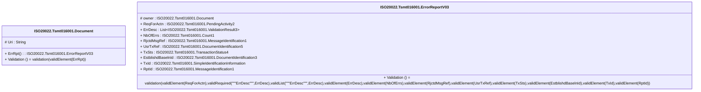

# tsmt.016.001.03-physical

> The tables below contain descriptions of the members of each Element. 
> The first column indicates the type of the member:
> A ‘#’ indicates that the field is a key to the element, and a ‘+’ indicates that the field is a value.
> The ‘*’ column contains a description for the element member.  
> The ‘@’ column contains any properties for the member.
> The ‘=’ column contains calculated values; or in the case of an enum, the serialized value.

---

## EntityImpl ISO20022.Tsmt016001.Document

| |Name|Type|*|@|=|
|-|-|-|-|-|-|
|#|Uri|String||XmlIgnore(), JsonIgnore()||
|+|ErrRpt|ISO20022.Tsmt016001.ErrorReportV03||XmlElement()||
||Validation|Some(String)||XmlIgnore(), JsonIgnore()|validation(validElement(ErrRpt))|

---

## AspectImpl ISO20022.Tsmt016001.ErrorReportV03

| |Name|Type|*|@|=|
|-|-|-|-|-|-|
|#|owner|ISO20022.Tsmt016001.Document||||
|+|ReqForActn|ISO20022.Tsmt016001.PendingActivity2||XmlElement()||
|+|ErrDesc|List<ISO20022.Tsmt016001.ValidationResult3>||XmlElement()||
|+|NbOfErrs|ISO20022.Tsmt016001.Count1||XmlElement()||
|+|RjctdMsgRef|ISO20022.Tsmt016001.MessageIdentification1||XmlElement()||
|+|UsrTxRef|ISO20022.Tsmt016001.DocumentIdentification5||XmlElement()||
|+|TxSts|ISO20022.Tsmt016001.TransactionStatus4||XmlElement()||
|+|EstblishdBaselnId|ISO20022.Tsmt016001.DocumentIdentification3||XmlElement()||
|+|TxId|ISO20022.Tsmt016001.SimpleIdentificationInformation||XmlElement()||
|+|RptId|ISO20022.Tsmt016001.MessageIdentification1||XmlElement()||
||Validation|Some(String)||XmlIgnore(), JsonIgnore()|validation(validElement(ReqForActn),validRequired("""ErrDesc""",ErrDesc),validList("""ErrDesc""",ErrDesc),validElement(ErrDesc),validElement(NbOfErrs),validElement(RjctdMsgRef),validElement(UsrTxRef),validElement(TxSts),validElement(EstblishdBaselnId),validElement(TxId),validElement(RptId))|

