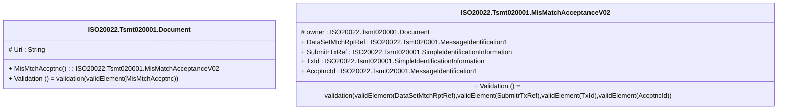

# tsmt.020.001.02-physical

> The tables below contain descriptions of the members of each Element. 
> The first column indicates the type of the member:
> A ‘#’ indicates that the field is a key to the element, and a ‘+’ indicates that the field is a value.
> The ‘*’ column contains a description for the element member.  
> The ‘@’ column contains any properties for the member.
> The ‘=’ column contains calculated values; or in the case of an enum, the serialized value.

---

## EntityImpl ISO20022.Tsmt020001.Document

| |Name|Type|*|@|=|
|-|-|-|-|-|-|
|#|Uri|String||XmlIgnore(), JsonIgnore()||
|+|MisMtchAccptnc|ISO20022.Tsmt020001.MisMatchAcceptanceV02||XmlElement()||
||Validation|Some(String)||XmlIgnore(), JsonIgnore()|validation(validElement(MisMtchAccptnc))|

---

## AspectImpl ISO20022.Tsmt020001.MisMatchAcceptanceV02

| |Name|Type|*|@|=|
|-|-|-|-|-|-|
|#|owner|ISO20022.Tsmt020001.Document||||
|+|DataSetMtchRptRef|ISO20022.Tsmt020001.MessageIdentification1||XmlElement()||
|+|SubmitrTxRef|ISO20022.Tsmt020001.SimpleIdentificationInformation||XmlElement()||
|+|TxId|ISO20022.Tsmt020001.SimpleIdentificationInformation||XmlElement()||
|+|AccptncId|ISO20022.Tsmt020001.MessageIdentification1||XmlElement()||
||Validation|Some(String)||XmlIgnore(), JsonIgnore()|validation(validElement(DataSetMtchRptRef),validElement(SubmitrTxRef),validElement(TxId),validElement(AccptncId))|

